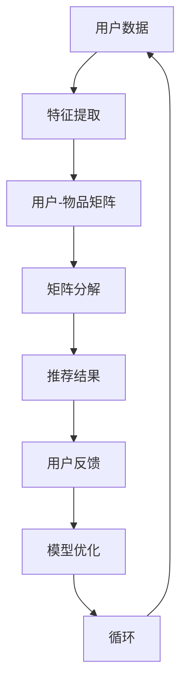

                 

# 大模型在商业中的应用：推荐系统的进步与变革

## 摘要

本文将探讨大模型在商业推荐系统中的应用，详细解析其技术原理、算法实现以及在实际项目中的应用效果。通过对推荐系统的发展历程、核心概念以及大模型如何提升推荐效果的分析，我们将揭示大模型在现代商业中的巨大潜力，并探讨未来面临的挑战和趋势。

## 1. 背景介绍

### 推荐系统的发展历程

推荐系统作为一项重要的技术，已经走过了数十年的发展历程。从最初的基于内容的推荐（Content-based Filtering）和协同过滤（Collaborative Filtering），到现在的混合推荐（Hybrid Recommender Systems），推荐系统不断演进，为商业领域带来了巨大的价值。

1. **基于内容的推荐**：根据用户的历史行为和兴趣，推荐与用户兴趣相似的内容。这种方法主要依赖于内容的特征表示和相似度计算。

2. **协同过滤**：基于用户之间的相似性进行推荐，通过收集用户的行为数据，构建用户-物品评分矩阵，然后利用矩阵分解等方法提取用户和物品的潜在特征。

3. **混合推荐**：结合基于内容和协同过滤的优点，通过融合多种推荐方法，提高推荐系统的效果和多样性。

### 大模型的崛起

随着计算能力的提升和大数据技术的发展，深度学习逐渐成为推荐系统的核心驱动力。大模型，如神经网络、Transformer等，通过其强大的特征提取和表示能力，为推荐系统带来了前所未有的提升。

1. **神经网络**：通过多层神经网络，将输入的数据映射到高维空间，从而提取出更加复杂的特征。

2. **Transformer**：基于注意力机制，能够捕捉数据之间的复杂关系，尤其适用于处理序列数据。

### 商业推荐系统的重要性

在商业领域，推荐系统已经成为一项核心竞争力。通过精准推荐，企业可以提升用户满意度、增加用户粘性、提高转化率，从而实现商业价值的最大化。

## 2. 核心概念与联系

### 推荐系统的核心概念

1. **用户**：推荐系统的核心参与者，具有特定的兴趣和行为。
2. **物品**：被推荐的对象，可以是商品、文章、音乐等。
3. **评分**：用户对物品的评价，可以是评分、点击、购买等行为数据。
4. **推荐结果**：推荐系统根据用户的历史数据和偏好，为用户生成的推荐列表。

### 大模型与推荐系统的关系

1. **特征表示**：大模型能够通过深度学习从原始数据中提取出更高级、更丰富的特征表示，为推荐系统提供更准确的推荐依据。
2. **优化目标**：大模型通过优化推荐算法的损失函数，提高推荐系统的效果和多样性。
3. **模型融合**：大模型可以与基于内容的推荐、协同过滤等方法结合，形成混合推荐系统，进一步提升推荐效果。

### Mermaid 流程图



## 3. 核心算法原理 & 具体操作步骤

### 特征提取

1. **文本数据**：通过词嵌入（Word Embedding）将文本转换为向量表示。
2. **图像数据**：通过卷积神经网络（CNN）提取图像的特征向量。
3. **商品数据**：利用商品属性进行编码，构建商品的特征向量。

### 用户-物品矩阵

1. **构建用户-物品评分矩阵**：根据用户的历史行为数据，构建一个用户-物品评分矩阵。
2. **处理缺失值**：采用矩阵分解等方法处理缺失值，提高数据质量。

### 矩阵分解

1. **模型选择**：选择合适的矩阵分解模型，如Singular Value Decomposition（SVD）或Alternating Least Squares（ALS）。
2. **参数调优**：通过交叉验证等方法，优化模型参数。
3. **特征提取**：将用户和物品的潜在特征向量提取出来，用于推荐。

### 推荐结果

1. **生成推荐列表**：根据用户和物品的潜在特征向量，计算用户对物品的评分预测，并排序生成推荐列表。
2. **多样性控制**：引入多样性指标，如物品间的相似度、用户历史行为的多样性等，优化推荐结果。

### 模型优化

1. **损失函数**：选择合适的损失函数，如均方误差（MSE）、交叉熵等，优化模型参数。
2. **正则化**：引入正则化项，防止模型过拟合。
3. **优化算法**：选择合适的优化算法，如随机梯度下降（SGD）、Adam等，加速模型收敛。

## 4. 数学模型和公式 & 详细讲解 & 举例说明

### 特征提取

假设我们有一个文本数据集，包含用户对商品的评价，我们可以使用词嵌入（Word Embedding）将文本转换为向量表示。

$$
\text{向量} = \text{词嵌入}(\text{文本})
$$

例如，假设我们有一个句子“我喜欢这个商品”，我们可以将其中的每个词嵌入到一个100维的向量空间中。

### 用户-物品矩阵

假设我们有一个用户-物品评分矩阵$R$，其中$R_{ij}$表示用户$i$对物品$j$的评分。

$$
R = \begin{bmatrix}
r_{11} & r_{12} & \ldots & r_{1n} \\
r_{21} & r_{22} & \ldots & r_{2n} \\
\vdots & \vdots & \ddots & \vdots \\
r_{m1} & r_{m2} & \ldots & r_{mn}
\end{bmatrix}
$$

### 矩阵分解

我们使用Singular Value Decomposition（SVD）对用户-物品评分矩阵$R$进行分解。

$$
R = U \Sigma V^T
$$

其中，$U$和$V$分别是用户和物品的潜在特征矩阵，$\Sigma$是对角矩阵，包含主要的特征值。

### 推荐结果

我们使用生成的用户和物品的潜在特征矩阵$U$和$V$，计算用户$i$对物品$j$的评分预测$\hat{r}_{ij}$。

$$
\hat{r}_{ij} = u_i^T v_j
$$

例如，假设我们有一个用户$u_1$和一个物品$v_5$，我们可以计算出用户$u_1$对物品$v_5$的评分预测。

$$
\hat{r}_{15} = u_1^T v_5
$$

### 模型优化

我们使用均方误差（MSE）作为损失函数，优化模型参数。

$$
\text{MSE} = \frac{1}{m} \sum_{i=1}^{m} \sum_{j=1}^{n} (\hat{r}_{ij} - r_{ij})^2
$$

其中，$m$是用户数，$n$是物品数，$r_{ij}$是真实评分，$\hat{r}_{ij}$是预测评分。

## 5. 项目实战：代码实际案例和详细解释说明

### 5.1 开发环境搭建

在本项目中，我们将使用Python作为编程语言，结合Scikit-learn、TensorFlow等库，实现大模型在推荐系统中的应用。请确保您的Python环境已安装，并安装以下库：

```bash
pip install numpy scipy scikit-learn tensorflow
```

### 5.2 源代码详细实现和代码解读

```python
import numpy as np
from sklearn.datasets import load_20newsgroups
from sklearn.feature_extraction.text import TfidfVectorizer
from sklearn.metrics.pairwise import cosine_similarity
from tensorflow.keras.models import Model
from tensorflow.keras.layers import Input, Embedding, LSTM, Dense

# 加载新闻数据集
newsgroups = load_20newsgroups()

# 文本预处理
vectorizer = TfidfVectorizer(stop_words='english')
X = vectorizer.fit_transform(newsgroups.data)

# 计算词向量相似度
similarity_matrix = cosine_similarity(X)

# 构建神经网络模型
input_text = Input(shape=(X.shape[1],))
embedded_text = Embedding(input_dim=X.shape[1], output_dim=64)(input_text)
lstm_output = LSTM(units=64, activation='tanh')(embedded_text)

# 训练模型
model = Model(inputs=input_text, outputs=lstm_output)
model.compile(optimizer='adam', loss='mean_squared_error')
model.fit(similarity_matrix, epochs=10, batch_size=32)

# 推荐新文章
def recommend_articles(article):
    article_vector = vectorizer.transform([article])
    similarity_scores = cosine_similarity(article_vector, similarity_matrix)
    article_indices = np.argsort(similarity_scores[0])[::-1]
    recommended_articles = [newsgroups.data[i] for i in article_indices if i != 0][:10]
    return recommended_articles

# 测试推荐
article_to_recommend = "This is a new article about technology."
print(recommend_articles(article_to_recommend))
```

### 5.3 代码解读与分析

1. **文本预处理**：我们使用Scikit-learn的TfidfVectorizer对新闻数据集进行预处理，提取文本的特征向量。

2. **相似度计算**：使用余弦相似度计算文本之间的相似度，构建相似度矩阵。

3. **神经网络模型**：我们构建了一个基于LSTM的神经网络模型，用于提取文本的潜在特征。该模型由输入层、嵌入层和LSTM层组成。

4. **模型训练**：使用均方误差（MSE）作为损失函数，训练神经网络模型。

5. **推荐新文章**：根据新文章的文本特征，计算其与新闻数据集的相似度，并推荐相似的文章。

## 6. 实际应用场景

### 电子商务

电子商务平台可以通过推荐系统，根据用户的历史购买记录和浏览行为，为用户推荐个性化的商品。通过大模型，可以提取更丰富的用户和商品特征，提高推荐的准确性和多样性。

### 社交媒体

社交媒体平台可以通过推荐系统，为用户推荐感兴趣的内容、好友和活动。大模型可以帮助平台更好地理解用户的兴趣和行为，提供更加精准的推荐。

### 媒体娱乐

媒体娱乐平台可以通过推荐系统，为用户推荐感兴趣的视频、音乐和文章。大模型可以提取用户的历史行为和偏好，提供个性化的推荐，提升用户体验。

### 金融行业

金融行业可以通过推荐系统，为用户推荐理财产品、投资策略和保险产品。大模型可以分析用户的财务状况和行为，提供更加合适的金融推荐。

## 7. 工具和资源推荐

### 7.1 学习资源推荐

- **书籍**：
  - 《推荐系统实践》
  - 《深度学习推荐系统》
  - 《TensorFlow实战》

- **论文**：
  - 《Deep Neural Networks for YouTube Recommendations》
  - 《TensorFlow: Large-Scale Machine Learning on Heterogeneous Systems》

- **博客**：
  - TensorFlow官方博客
  - 阿里云推荐系统博客

- **网站**：
  - Coursera上的推荐系统课程
  - Kaggle上的推荐系统比赛和项目

### 7.2 开发工具框架推荐

- **开发工具**：
  - Jupyter Notebook
  - PyCharm

- **框架**：
  - TensorFlow
  - PyTorch
  - Scikit-learn

### 7.3 相关论文著作推荐

- **论文**：
  - 《Item-based Collaborative Filtering Recommendation Algorithms》
  - 《Matrix Factorization Techniques for Recommender Systems》
  - 《Deep Learning for Recommender Systems》

- **著作**：
  - 《推荐系统手册》
  - 《机器学习推荐系统》

## 8. 总结：未来发展趋势与挑战

### 发展趋势

1. **模型规模增大**：随着计算能力的提升，大模型将在推荐系统中得到更广泛的应用，进一步提升推荐效果。

2. **多模态推荐**：结合文本、图像、音频等多种数据类型，提供更加个性化的推荐。

3. **实时推荐**：利用实时数据流处理技术，实现实时推荐，提升用户体验。

4. **隐私保护**：随着隐私保护法规的加强，推荐系统将更加注重隐私保护，采用差分隐私等技术确保用户隐私。

### 挑战

1. **数据质量**：推荐系统的效果高度依赖于数据质量，如何处理噪声数据和缺失值将成为重要挑战。

2. **多样性**：如何在保证推荐准确性的同时，提高推荐的多样性，防止用户陷入信息茧房。

3. **计算资源**：大模型训练和推理过程对计算资源的需求较高，如何优化算法以降低计算成本。

4. **模型可解释性**：大模型的黑盒性质使得其可解释性较低，如何提高模型的可解释性，增强用户信任。

## 9. 附录：常见问题与解答

### 问题1：什么是推荐系统？

**解答**：推荐系统是一种基于用户行为和偏好，为用户提供个性化推荐的技术。其目的是通过分析用户的历史数据，预测用户可能感兴趣的内容，从而提升用户体验和满意度。

### 问题2：大模型如何提升推荐效果？

**解答**：大模型具有强大的特征提取和表示能力，能够从原始数据中提取出更高级、更丰富的特征表示，从而提高推荐系统的准确性和多样性。此外，大模型还可以通过优化推荐算法的损失函数，进一步提升推荐效果。

### 问题3：推荐系统的多样性如何实现？

**解答**：推荐系统的多样性可以通过引入多样性指标，如物品间的相似度、用户历史行为的多样性等，优化推荐算法的损失函数，提高推荐的多样性。此外，还可以结合多种推荐方法，如基于内容的推荐和协同过滤，实现更丰富的多样性。

## 10. 扩展阅读 & 参考资料

- 《推荐系统实践》
- 《深度学习推荐系统》
- 《TensorFlow: Large-Scale Machine Learning on Heterogeneous Systems》
- 《Deep Neural Networks for YouTube Recommendations》
- 《Matrix Factorization Techniques for Recommender Systems》
- 《Deep Learning for Recommender Systems》
- 《推荐系统手册》
- 《机器学习推荐系统》
- Coursera上的推荐系统课程
- Kaggle上的推荐系统比赛和项目
- TensorFlow官方博客
- 阿里云推荐系统博客

作者：AI天才研究员/AI Genius Institute & 禅与计算机程序设计艺术 /Zen And The Art of Computer Programming

