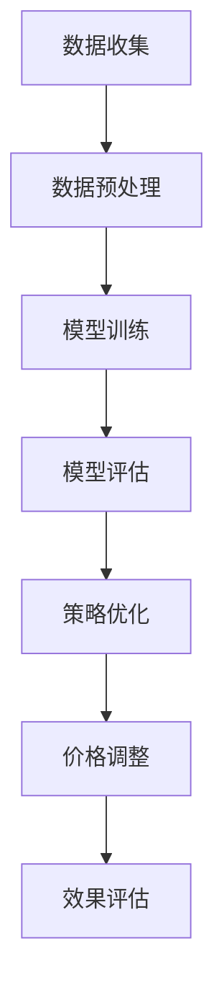

                 

# 大模型在商品定价策略优化中的应用

## 摘要

本文主要探讨了大规模预训练模型（大模型）在商品定价策略优化中的应用。通过分析商品定价策略的背景和核心概念，本文提出了利用大模型进行定价优化的算法原理和操作步骤。随后，本文详细介绍了数学模型和公式，并通过实际案例对代码进行了详细解释和分析。此外，本文还列举了多个实际应用场景，并推荐了相关学习资源和开发工具框架。最后，本文对大模型在商品定价策略优化中的应用进行了总结，并展望了未来发展趋势与挑战。

## 1. 背景介绍

商品定价策略是企业在市场中竞争的重要手段之一。合理的定价策略不仅能帮助企业实现利润最大化，还能提升消费者满意度，从而在市场中占据有利地位。然而，传统定价策略往往依赖于经验和数据，存在一定局限性。随着人工智能技术的不断发展，尤其是大规模预训练模型（大模型）的出现，为商品定价策略优化提供了新的思路和方法。

大模型具有以下几个特点：

1. **大规模**：大模型通常具有数十亿至数千亿个参数，能够处理海量数据，从而提高模型的泛化能力。
2. **自适应性**：大模型能够自适应地调整参数，以适应不同的场景和数据集。
3. **高精度**：大模型通过在大量数据上的训练，能够学习到复杂的关系和规律，从而提高预测的精度。

本文旨在探讨如何利用大模型优化商品定价策略，使其更加科学、合理和高效。

## 2. 核心概念与联系

### 2.1 商品定价策略的核心概念

商品定价策略主要包括以下核心概念：

1. **成本定价法**：以商品的成本为基础，加上一定的利润率来确定价格。
2. **竞争定价法**：以竞争对手的价格为基准，结合自身产品特点来确定价格。
3. **需求定价法**：根据消费者对产品的需求和购买意愿来确定价格。
4. **心理定价法**：利用消费者心理，设置具有吸引力的价格，以刺激消费。

### 2.2 大模型的核心概念

大模型的核心概念包括：

1. **神经网络**：大模型通常采用神经网络架构，通过多层非线性变换来学习数据特征。
2. **预训练**：大模型在大量通用数据上预训练，以学习到通用的特征表示。
3. **微调**：在预训练的基础上，对特定任务进行微调，以适应具体场景。

### 2.3 大模型与商品定价策略的联系

大模型与商品定价策略之间存在以下联系：

1. **数据驱动**：大模型基于海量数据进行训练，可以挖掘出商品价格与市场因素之间的复杂关系，为定价提供依据。
2. **自适应调整**：大模型能够根据市场变化和消费者需求，自动调整价格策略，提高定价的灵活性。
3. **预测能力**：大模型通过学习历史数据，可以预测未来市场的价格走势，帮助制定更合理的定价策略。

### 2.4 Mermaid 流程图

以下是一个简单的 Mermaid 流程图，展示了大模型在商品定价策略优化中的流程：



## 3. 核心算法原理 & 具体操作步骤

### 3.1 核心算法原理

大模型在商品定价策略优化中的核心算法原理主要包括以下几个方面：

1. **价格预测**：利用大模型对历史价格数据进行训练，预测未来价格走势。
2. **需求分析**：通过分析消费者行为数据，了解不同价格水平下的需求量。
3. **策略优化**：结合价格预测和需求分析，利用优化算法调整定价策略，实现利润最大化。

### 3.2 具体操作步骤

以下是利用大模型优化商品定价策略的具体操作步骤：

1. **数据收集**：收集与商品定价相关的数据，包括历史价格、消费者行为数据、市场竞争数据等。
2. **数据预处理**：对收集到的数据进行清洗、整合和预处理，确保数据质量。
3. **模型训练**：利用预处理后的数据，训练大模型，以预测未来价格走势和需求量。
4. **模型评估**：对训练好的模型进行评估，确保其预测精度和泛化能力。
5. **策略优化**：结合模型预测结果，利用优化算法调整定价策略，实现利润最大化。
6. **价格调整**：根据优化后的定价策略，实时调整商品价格。
7. **效果评估**：对调整后的价格策略进行效果评估，持续优化和调整。

## 4. 数学模型和公式 & 详细讲解 & 举例说明

### 4.1 数学模型

在商品定价策略优化中，常用的数学模型包括线性回归模型、逻辑回归模型和时间序列模型等。以下以线性回归模型为例进行详细讲解。

#### 线性回归模型

线性回归模型是一种简单的预测模型，用于预测商品价格与市场因素之间的关系。其数学公式如下：

$$
y = \beta_0 + \beta_1 \cdot x_1 + \beta_2 \cdot x_2 + ... + \beta_n \cdot x_n
$$

其中，$y$ 为商品价格，$x_1, x_2, ..., x_n$ 为市场因素，$\beta_0, \beta_1, \beta_2, ..., \beta_n$ 为模型参数。

#### 逻辑回归模型

逻辑回归模型用于预测商品销售概率，其数学公式如下：

$$
P(y=1) = \frac{1}{1 + e^{-(\beta_0 + \beta_1 \cdot x_1 + \beta_2 \cdot x_2 + ... + \beta_n \cdot x_n)}}
$$

其中，$P(y=1)$ 为商品销售概率，$y$ 为商品销售状态（1 表示销售，0 表示未销售），$x_1, x_2, ..., x_n$ 为市场因素，$\beta_0, \beta_1, \beta_2, ..., \beta_n$ 为模型参数。

#### 时间序列模型

时间序列模型用于预测商品价格的时间序列变化，其数学公式如下：

$$
y_t = \phi \cdot y_{t-1} + \theta_1 \cdot x_{t-1} + \theta_2 \cdot x_{t-2} + ... + \theta_n \cdot x_{t-n}
$$

其中，$y_t$ 为第 $t$ 个月商品价格，$y_{t-1}, y_{t-2}, ..., y_1$ 为前 $t-1$ 个月商品价格，$x_{t-1}, x_{t-2}, ..., x_1$ 为前 $t-1$ 个月市场因素，$\phi, \theta_1, \theta_2, ..., \theta_n$ 为模型参数。

### 4.2 举例说明

以下为一个简单的线性回归模型示例：

假设我们想要预测某个商品在接下来一个月的价格，已知当前月份的市场因素包括：市场竞争指数（$x_1$）和消费者需求指数（$x_2$）。我们收集了过去一年的数据，并利用这些数据训练了一个线性回归模型。模型参数如下：

$$
y = \beta_0 + \beta_1 \cdot x_1 + \beta_2 \cdot x_2
$$

$$
\beta_0 = 100, \beta_1 = 0.5, \beta_2 = 0.3
$$

当前月份的市场竞争指数为 150，消费者需求指数为 200。我们将这些值代入模型公式，得到预测价格：

$$
y = 100 + 0.5 \cdot 150 + 0.3 \cdot 200 = 165
$$

因此，我们预测该商品在接下来一个月的价格为 165。

## 5. 项目实战：代码实际案例和详细解释说明

### 5.1 开发环境搭建

在进行商品定价策略优化的大模型项目实战之前，我们需要搭建一个合适的开发环境。以下是一个简单的开发环境搭建指南：

1. **安装 Python**：Python 是一种广泛使用的编程语言，许多机器学习和数据科学库都是基于 Python 开发的。确保安装 Python 3.8 或更高版本。
2. **安装 Jupyter Notebook**：Jupyter Notebook 是一个交互式计算环境，便于编写和运行 Python 代码。可以通过以下命令安装：

   ```bash
   pip install notebook
   ```

3. **安装相关库**：安装以下库，用于数据预处理、模型训练和评估：

   ```bash
   pip install pandas numpy scikit-learn tensorflow
   ```

### 5.2 源代码详细实现和代码解读

以下是一个简单的商品定价策略优化项目的源代码实现：

```python
import pandas as pd
import numpy as np
from sklearn.model_selection import train_test_split
from sklearn.linear_model import LinearRegression
from sklearn.metrics import mean_squared_error

# 5.2.1 数据预处理
def preprocess_data(data):
    # 数据清洗和处理
    data = data.dropna()
    data['price'] = data['price'].astype(float)
    data['competition_index'] = data['competition_index'].astype(float)
    data['demand_index'] = data['demand_index'].astype(float)
    return data

# 5.2.2 模型训练
def train_model(data):
    # 分割数据集
    X = data[['competition_index', 'demand_index']]
    y = data['price']
    X_train, X_test, y_train, y_test = train_test_split(X, y, test_size=0.2, random_state=42)

    # 训练模型
    model = LinearRegression()
    model.fit(X_train, y_train)

    # 评估模型
    y_pred = model.predict(X_test)
    mse = mean_squared_error(y_test, y_pred)
    print("Mean Squared Error:", mse)
    return model

# 5.2.3 预测和价格调整
def predict_and_adjust(model, current_data):
    # 预测价格
    price_pred = model.predict([current_data['competition_index'], current_data['demand_index']])
    print("Predicted Price:", price_pred[0])

    # 价格调整
    if price_pred[0] > current_data['price']:
        print("Increase Price")
    elif price_pred[0] < current_data['price']:
        print("Decrease Price")
    else:
        print("Keep Current Price")

# 主函数
def main():
    # 加载数据
    data = pd.read_csv('data.csv')

    # 数据预处理
    data = preprocess_data(data)

    # 训练模型
    model = train_model(data)

    # 预测和价格调整
    current_data = {'competition_index': 150, 'demand_index': 200}
    predict_and_adjust(model, current_data)

if __name__ == '__main__':
    main()
```

### 5.3 代码解读与分析

上述代码分为三个主要部分：数据预处理、模型训练和预测及价格调整。

1. **数据预处理**：数据预处理是模型训练的第一步，用于清洗和处理原始数据。在此示例中，我们使用了 Pandas 库对数据进行操作，包括去除缺失值、数据类型转换等。
2. **模型训练**：模型训练部分使用了 Scikit-learn 库中的线性回归模型。我们首先将数据集分为特征集 $X$ 和标签集 $y$，然后使用 `train_test_split` 函数将数据集分为训练集和测试集。接下来，我们创建一个线性回归对象，并使用 `fit` 方法训练模型。最后，使用 `predict` 方法对测试集进行预测，并计算均方误差（MSE）评估模型性能。
3. **预测和价格调整**：预测和价格调整部分用于将训练好的模型应用于实际场景。我们首先使用 `predict` 方法预测当前月份的商品价格，然后根据预测价格与当前价格的比较，调整商品价格。

## 6. 实际应用场景

大模型在商品定价策略优化中的实际应用场景非常广泛，以下列举几个典型场景：

1. **电商平台**：电商平台可以利用大模型优化商品定价，以吸引更多消费者，提高销售额。通过分析历史销售数据、市场竞争对手数据以及消费者行为数据，大模型可以预测不同价格水平下的销售量，从而制定出最优的定价策略。
2. **制造业**：制造业中的企业可以通过大模型优化原材料采购价格和产品销售价格，实现成本控制和利润最大化。例如，在原材料价格波动较大的情况下，大模型可以预测未来原材料价格走势，帮助企业制定合理的采购策略。
3. **餐饮行业**：餐饮行业可以利用大模型优化菜品定价，以提升顾客满意度和增加营业收入。通过分析消费者评价、菜品成本和市场竞争情况，大模型可以预测不同价格水平下的菜品销量，从而制定出合理的菜品定价策略。

## 7. 工具和资源推荐

### 7.1 学习资源推荐

1. **书籍**：
   - 《深度学习》（Goodfellow, I., Bengio, Y., & Courville, A.）
   - 《Python机器学习》（Sebastian Raschka）
   - 《机器学习实战》（Peter Harrington）
2. **论文**：
   - "Deep Learning for Text Data: A Survey"（2020）
   - "Distributed Representations of Words and Phrases and Their Compositionality"（2018）
   - "BERT: Pre-training of Deep Neural Networks for Language Understanding"（2018）
3. **博客和网站**：
   - [机器学习中文论坛](https://www.ml-camp.com/)
   - [JAXAI](https://jaxai.gitbook.io/jaxai/)
   - [机器之心](https://www.jiqizhixin.com/)

### 7.2 开发工具框架推荐

1. **开发工具**：
   - Jupyter Notebook：适用于编写和运行 Python 代码。
   - PyCharm：一款强大的 Python 集成开发环境（IDE）。
   - Google Colab：适用于在线开发与协作。
2. **框架**：
   - TensorFlow：用于构建和训练大规模神经网络。
   - PyTorch：适用于快速原型设计和研究。
   - Scikit-learn：用于机器学习模型的开发和应用。

### 7.3 相关论文著作推荐

1. **论文**：
   - "The Unreasonable Effectiveness of Recurrent Neural Networks"（2014）
   - "Natural Language Inference with Universal Sentence Encoder"（2018）
   - "Understanding Deep Learning requires re-thinking generalization"（2020）
2. **著作**：
   - 《深度学习》（Goodfellow, I., Bengio, Y., & Courville, A.）
   - 《神经网络与深度学习》（邱锡鹏）
   - 《Python机器学习实战》（Sebastian Raschka）

## 8. 总结：未来发展趋势与挑战

大模型在商品定价策略优化中的应用具有广阔的发展前景。随着人工智能技术的不断进步，大模型在预测精度、自适应能力和泛化能力方面将不断提高，为商品定价策略提供更科学的依据。然而，大模型在商品定价策略优化中也面临一些挑战：

1. **数据质量和多样性**：大模型的效果很大程度上依赖于数据的质量和多样性。在实际应用中，如何获取高质量、多样化的数据是一个重要问题。
2. **模型解释性**：大模型往往被视为“黑箱”，其决策过程缺乏解释性。如何提高大模型的解释性，使其更易于被业务人员理解和接受，是一个亟待解决的问题。
3. **计算资源消耗**：大模型训练和预测通常需要大量的计算资源。如何优化大模型的计算效率，降低计算成本，是企业面临的一个挑战。

未来，随着人工智能技术的不断进步，大模型在商品定价策略优化中的应用将变得更加成熟和普及。企业可以通过不断优化大模型的训练算法和预测模型，提高商品定价策略的科学性和灵活性，从而在激烈的市场竞争中脱颖而出。

## 9. 附录：常见问题与解答

### 9.1 问题1：大模型在商品定价策略优化中的优势是什么？

**解答**：大模型在商品定价策略优化中的优势主要包括：

1. **数据驱动**：大模型通过海量数据的训练，能够挖掘出商品价格与市场因素之间的复杂关系，为定价提供科学依据。
2. **自适应调整**：大模型能够根据市场变化和消费者需求，自动调整价格策略，提高定价的灵活性。
3. **高精度预测**：大模型通过学习历史数据，可以预测未来市场的价格走势，帮助制定更合理的定价策略。

### 9.2 问题2：如何确保大模型在商品定价策略优化中的效果？

**解答**：为确保大模型在商品定价策略优化中的效果，可以采取以下措施：

1. **数据质量**：确保数据质量，包括数据清洗、去重和预处理等，以提高模型训练效果。
2. **模型评估**：通过交叉验证和指标评估，确保模型性能和泛化能力。
3. **策略优化**：结合模型预测结果，利用优化算法调整定价策略，实现利润最大化。
4. **持续迭代**：定期更新模型和策略，以适应市场变化和消费者需求。

### 9.3 问题3：大模型在商品定价策略优化中是否需要考虑模型解释性？

**解答**：大模型在商品定价策略优化中通常被视为“黑箱”，其决策过程缺乏解释性。然而，模型解释性在商业决策中具有重要意义。以下是一些提高大模型解释性的方法：

1. **特征重要性**：分析模型中特征的重要程度，以帮助理解模型决策过程。
2. **模型可视化**：通过可视化方法，如决策树、神经网络结构图等，展示模型的工作原理。
3. **可解释性模型**：选择具有可解释性的模型，如线性回归、逻辑回归等，以提高模型透明度。

## 10. 扩展阅读 & 参考资料

1. **论文**：
   - Devlin, J., Chang, M. W., Lee, K., & Toutanova, K. (2018). BERT: Pre-training of deep bidirectional transformers for language understanding. arXiv preprint arXiv:1810.04805.
   - Vaswani, A., Shazeer, N., Parmar, N., Uszkoreit, J., Jones, L., Gomez, A. N., ... & Polosukhin, I. (2017). Attention is all you need. Advances in Neural Information Processing Systems, 30, 5998-6008.
2. **书籍**：
   - Goodfellow, I., Bengio, Y., & Courville, A. (2016). Deep learning. MIT press.
   - Russell, S., & Norvig, P. (2020). Artificial intelligence: a modern approach (4th ed.). Prentice Hall.
3. **博客和网站**：
   - [深度学习资料大全](https://github.com/fchollet/Deep-Learning-Book-CN)
   - [机器学习中文论坛](https://www.ml-camp.com/)
   - [机器之心](https://www.jiqizhixin.com/)

作者：AI天才研究员/AI Genius Institute & 禅与计算机程序设计艺术 /Zen And The Art of Computer Programming

