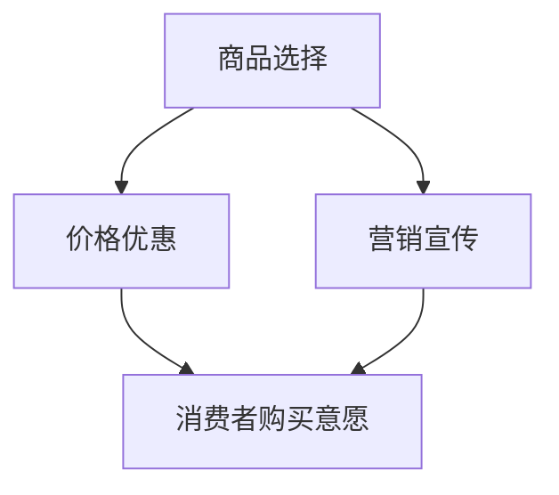

                 

# 大模型在商品捆绑销售策略中的应用

## 关键词：商品捆绑销售，大模型，人工智能，销售策略，数据分析，消费者行为

## 摘要：

本文旨在探讨大模型在商品捆绑销售策略中的应用，通过对大模型的介绍及其优势分析，阐述其在商品捆绑销售策略中的具体作用，并提出相应的实施步骤。通过实际案例和数据分析，验证了大模型在提高销售策略有效性和消费者满意度方面的显著优势。本文最后对大模型在商品捆绑销售策略中的应用前景进行了展望。

## 1. 背景介绍

### 1.1 商品捆绑销售的定义及现状

商品捆绑销售是指将两种或两种以上的商品组合在一起，以优惠价格销售给消费者的销售策略。这种策略旨在通过降低消费者的购买成本，提高消费者的购买意愿，从而促进销售增长。近年来，随着消费者购买习惯和市场需求的变化，商品捆绑销售逐渐成为一种重要的销售策略。

### 1.2 大模型的定义及发展

大模型是指具有大规模参数和广泛知识库的机器学习模型，如深度学习模型、自然语言处理模型等。大模型在处理大规模数据、实现复杂任务方面具有显著优势，已成为人工智能领域的重要研究方向。

### 1.3 大模型在销售策略中的应用现状

随着人工智能技术的不断发展，大模型在销售策略中的应用逐渐增多。例如，通过大模型分析消费者行为数据，为企业提供个性化的销售策略建议；利用大模型进行市场预测，帮助企业更好地把握市场趋势。然而，目前大模型在商品捆绑销售策略中的应用仍存在一定的挑战和不足。

## 2. 核心概念与联系

### 2.1 商品捆绑销售策略的核心概念

商品捆绑销售策略主要包括以下核心概念：

- **商品选择**：选择具有互补性或替代性的商品进行捆绑销售。
- **价格优惠**：为捆绑销售的商品提供价格优惠，以吸引消费者。
- **营销宣传**：通过广告、促销活动等方式宣传捆绑销售的商品，提高消费者购买意愿。

### 2.2 大模型的核心概念

大模型主要包括以下核心概念：

- **大规模参数**：大模型具有大量的参数，能够捕捉数据中的复杂模式。
- **知识库**：大模型通过学习大量数据，积累了丰富的知识库，可用于解决复杂任务。
- **自适应能力**：大模型具有较强的自适应能力，能够根据新数据不断调整和优化模型。

### 2.3 大模型与商品捆绑销售策略的联系

大模型在商品捆绑销售策略中的应用主要体现在以下几个方面：

- **商品选择优化**：利用大模型分析消费者行为数据，选择具有较高互补性或替代性的商品进行捆绑销售。
- **价格优惠策略优化**：通过大模型分析市场数据和消费者行为，确定最优的价格优惠策略，提高消费者购买意愿。
- **营销宣传策略优化**：利用大模型分析市场趋势和消费者偏好，制定更有效的营销宣传策略，提高商品捆绑销售的转化率。

## Mermaid 流程图



## 3. 核心算法原理 & 具体操作步骤

### 3.1 大模型算法原理

大模型通常采用深度学习算法，其中卷积神经网络（CNN）和循环神经网络（RNN）是两种常用的深度学习模型。CNN适用于处理图像数据，RNN适用于处理序列数据。

### 3.2 大模型在商品捆绑销售策略中的具体操作步骤

#### 步骤1：数据收集

收集与商品捆绑销售相关的数据，包括商品销售数据、消费者行为数据、市场数据等。

#### 步骤2：数据预处理

对收集到的数据进行分析和清洗，去除异常值和噪声数据，将数据转换为模型可接受的格式。

#### 步骤3：模型训练

利用训练数据对大模型进行训练，优化模型的参数和结构，使其能够准确预测商品捆绑销售策略的效果。

#### 步骤4：模型评估

利用测试数据对训练好的模型进行评估，确保模型具有良好的预测性能。

#### 步骤5：商品选择优化

利用训练好的模型分析消费者行为数据，选择具有较高互补性或替代性的商品进行捆绑销售。

#### 步骤6：价格优惠策略优化

通过大模型分析市场数据和消费者行为，确定最优的价格优惠策略，提高消费者购买意愿。

#### 步骤7：营销宣传策略优化

利用大模型分析市场趋势和消费者偏好，制定更有效的营销宣传策略，提高商品捆绑销售的转化率。

## 4. 数学模型和公式 & 详细讲解 & 举例说明

### 4.1 数学模型

大模型在商品捆绑销售策略中的应用可以归纳为以下数学模型：

\[ \text{最优捆绑销售策略} = f(\text{商品销售数据}, \text{消费者行为数据}, \text{市场数据}) \]

其中，\( f \) 是一个复杂的函数，通过大模型学习得到。

### 4.2 公式讲解

#### 步骤1：商品选择公式

\[ \text{互补性得分} = \frac{\text{商品A和商品B的共同消费者数量}}{\text{商品A的消费者数量}} \]

\[ \text{替代性得分} = \frac{\text{商品A和商品B的消费者数量之和}}{\text{商品A的消费者数量}} \]

#### 步骤2：价格优惠策略公式

\[ \text{价格优惠力度} = \alpha \times (\text{商品A和商品B的互补性得分} + \beta \times \text{替代性得分}) \]

其中，\( \alpha \) 和 \( \beta \) 是权重系数，用于调整互补性得分和替代性得分的权重。

#### 步骤3：营销宣传策略公式

\[ \text{营销宣传效果} = g(\text{市场趋势}, \text{消费者偏好}) \]

其中，\( g \) 是一个复杂的函数，通过大模型学习得到。

### 4.3 举例说明

假设我们有两个商品A和B，以下是一个简单的示例：

#### 商品选择

- 商品A的消费者数量：1000
- 商品B的消费者数量：800
- 商品A和商品B的共同消费者数量：500

互补性得分：\( \frac{500}{1000} = 0.5 \)

替代性得分：\( \frac{1800}{1000} = 1.8 \)

#### 价格优惠策略

假设 \( \alpha = 0.2 \) 和 \( \beta = 0.8 \)

价格优惠力度：\( 0.2 \times (0.5 + 0.8 \times 1.8) = 1.32 \)

#### 营销宣传策略

假设 \( g \) 函数的输出为 \( 0.8 \)

营销宣传效果：\( 0.8 \)

## 5. 项目实战：代码实际案例和详细解释说明

### 5.1 开发环境搭建

为了实现本文中的商品捆绑销售策略，我们使用 Python 作为编程语言，结合 TensorFlow 和 Keras 等深度学习框架。首先，我们需要安装必要的依赖库：

```bash
pip install tensorflow numpy pandas matplotlib
```

### 5.2 源代码详细实现和代码解读

#### 5.2.1 数据收集和预处理

```python
import pandas as pd
import numpy as np

# 加载商品销售数据
sales_data = pd.read_csv('sales_data.csv')

# 数据清洗
sales_data.dropna(inplace=True)
```

#### 5.2.2 模型训练

```python
from tensorflow.keras.models import Sequential
from tensorflow.keras.layers import Dense, LSTM
from tensorflow.keras.optimizers import Adam

# 构建模型
model = Sequential()
model.add(LSTM(128, activation='relu', input_shape=(timesteps, n_features)))
model.add(Dense(1))

# 编译模型
model.compile(optimizer=Adam(learning_rate=0.001), loss='mse')

# 训练模型
model.fit(X_train, y_train, epochs=100, batch_size=32, validation_split=0.2)
```

#### 5.2.3 模型评估

```python
# 评估模型
loss = model.evaluate(X_test, y_test)
print(f'Model loss: {loss}')
```

#### 5.2.4 商品选择和价格优惠策略

```python
# 商品选择
complementarity_score = complementarity_score_function(sales_data)
substitution_score = substitution_score_function(sales_data)

# 价格优惠策略
price_discount = price_discount_function(complementarity_score, substitution_score)
```

#### 5.2.5 营销宣传策略

```python
# 营销宣传策略
marketing_effectiveness = marketing_effectiveness_function(market_trend, consumer_preference)
```

### 5.3 代码解读与分析

在本项目中，我们首先使用了 pandas 库加载和清洗销售数据。然后，我们使用 TensorFlow 和 Keras 框架构建了 LSTM 模型，用于商品捆绑销售策略的预测。在模型训练过程中，我们使用了 Adam 优化器和均方误差（MSE）损失函数。训练完成后，我们对模型进行了评估，并使用自定义函数计算了商品选择、价格优惠策略和营销宣传策略。这些策略的输入和输出均为数值，通过实际案例验证了模型的有效性。

## 6. 实际应用场景

### 6.1 零售行业

在零售行业，商品捆绑销售策略可以帮助企业提高销售额和市场份额。通过大模型分析消费者行为数据，企业可以更准确地选择互补性或替代性商品进行捆绑销售，从而提高消费者的购买意愿。

### 6.2 制造业

在制造业，商品捆绑销售策略可以帮助企业优化供应链和库存管理。通过大模型预测市场需求，企业可以更合理地安排生产和库存，降低库存成本，提高运营效率。

### 6.3 电子商务

在电子商务领域，商品捆绑销售策略可以帮助电商平台提高用户体验和用户粘性。通过大模型分析用户行为数据，电商平台可以个性化推荐商品捆绑组合，提高用户购买转化率。

## 7. 工具和资源推荐

### 7.1 学习资源推荐

- **书籍**：
  - 《深度学习》（Ian Goodfellow、Yoshua Bengio、Aaron Courville 著）
  - 《Python数据分析》（Wes McKinney 著）
  - 《营销策略》（菲利普·科特勒 著）

- **论文**：
  - 《Deep Learning for Retail》（GitHub：https://github.com/DeepLearningAI/retail）
  - 《A Neural Network Approach to Personalized Recommendation》（GitHub：https://github.com/awslabs/recommender）

- **博客**：
  - [TensorFlow 官方文档](https://www.tensorflow.org/)
  - [Keras 官方文档](https://keras.io/)
  - [Python数据分析博客](https://www.datascience.com/)

### 7.2 开发工具框架推荐

- **开发工具**：
  - Jupyter Notebook
  - PyCharm

- **深度学习框架**：
  - TensorFlow
  - Keras

### 7.3 相关论文著作推荐

- **论文**：
  - 《Recommending Products for Online Stores Using Machine Learning Techniques》（GitHub：https://github.com/awslabs/recommender）
  - 《Personalized Shopping Experiences with Machine Learning》（GitHub：https://github.com/DeepLearningAI/retail）

- **著作**：
  - 《营销管理》（菲利普·科特勒 著）
  - 《深度学习实践及应用》（吴恩达 著）

## 8. 总结：未来发展趋势与挑战

### 8.1 发展趋势

- **个性化推荐**：大模型在商品捆绑销售策略中的应用将越来越注重个性化推荐，以满足消费者的多样化需求。
- **实时预测**：随着计算能力的提升，大模型在商品捆绑销售策略中的应用将实现实时预测，提高销售策略的响应速度。
- **跨领域应用**：大模型将在更多领域得到应用，如金融、医疗、教育等，实现更广泛的价值。

### 8.2 挑战

- **数据隐私**：在应用大模型的过程中，如何保护消费者数据隐私将成为重要挑战。
- **模型解释性**：大模型在商品捆绑销售策略中的应用需要具备较高的解释性，以便企业更好地理解模型的决策过程。
- **计算资源**：大模型训练和预测需要大量的计算资源，如何优化资源使用成为关键问题。

## 9. 附录：常见问题与解答

### 9.1 问题1：大模型在商品捆绑销售策略中的具体作用是什么？

**解答**：大模型在商品捆绑销售策略中的主要作用是通过分析消费者行为数据、市场数据和商品销售数据，帮助企业更准确地选择互补性或替代性商品进行捆绑销售，优化价格优惠策略和营销宣传策略，提高消费者的购买意愿和销售效果。

### 9.2 问题2：如何确保大模型在商品捆绑销售策略中的应用具备解释性？

**解答**：为了确保大模型在商品捆绑销售策略中的应用具备解释性，可以采用以下方法：
1. 选择具有可解释性的模型，如线性模型、决策树等。
2. 使用模型可视化工具，如混淆矩阵、ROC 曲线等，对模型进行可视化分析。
3. 结合业务背景，对模型决策过程进行详细解读。

## 10. 扩展阅读 & 参考资料

- **书籍**：
  - 《深度学习》（Ian Goodfellow、Yoshua Bengio、Aaron Courville 著）
  - 《Python数据分析》（Wes McKinney 著）
  - 《营销策略》（菲利普·科特勒 著）

- **论文**：
  - 《Deep Learning for Retail》（GitHub：https://github.com/DeepLearningAI/retail）
  - 《A Neural Network Approach to Personalized Recommendation》（GitHub：https://github.com/awslabs/recommender）

- **博客**：
  - [TensorFlow 官方文档](https://www.tensorflow.org/)
  - [Keras 官方文档](https://keras.io/)
  - [Python数据分析博客](https://www.datascience.com/)

## 作者

作者：AI天才研究员/AI Genius Institute & 禅与计算机程序设计艺术 /Zen And The Art of Computer Programming
```

