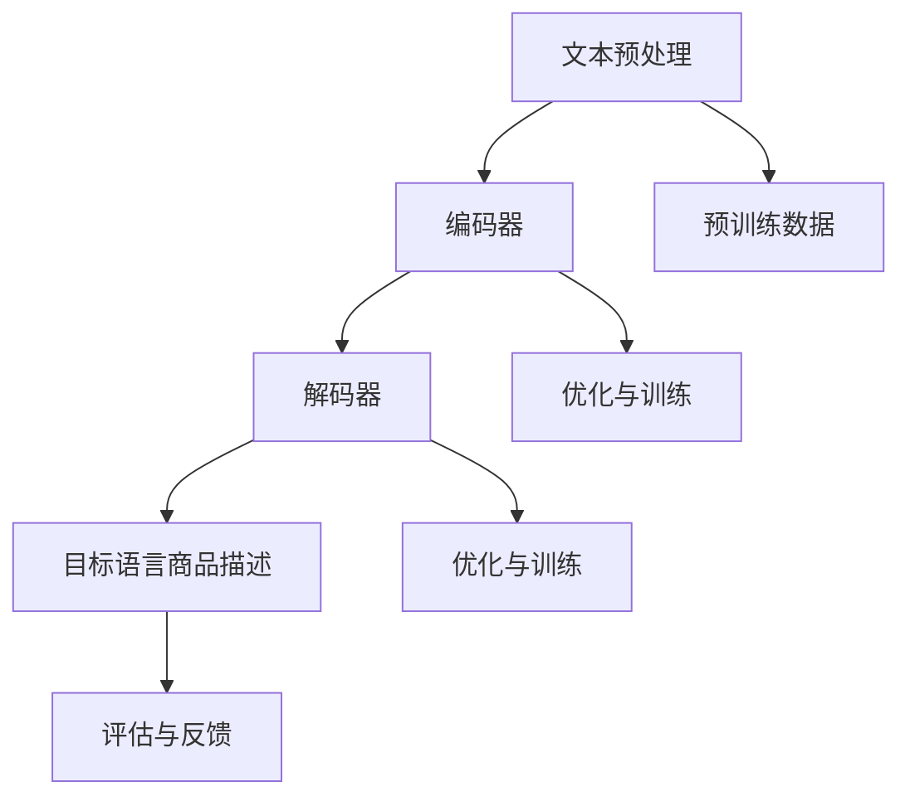

                 

# 大模型在商品描述多语言生成中的应用

## 摘要

本文将深入探讨大模型在商品描述多语言生成中的应用。随着全球化进程的加速，电子商务平台的商品描述往往需要支持多种语言，以便覆盖更广泛的市场。大模型，如基于深度学习的自然语言处理（NLP）模型，能够通过大量的训练数据生成高质量的多语言商品描述，从而提高电子商务平台的国际化水平和用户体验。本文将首先介绍大模型的基本概念和原理，随后分析其在商品描述多语言生成中的具体应用，最后探讨其未来发展趋势与挑战。

## 1. 背景介绍

### 1.1 全球化与电子商务

全球化使得电子商务成为国际贸易的重要驱动力。电子商务平台不仅需要处理大量的商品信息，还需要为不同国家和地区的消费者提供合适的语言服务。商品描述作为电子商务的核心内容，直接影响消费者的购买决策和满意度。因此，如何高效、准确地生成多语言商品描述成为电子商务平台亟待解决的问题。

### 1.2 多语言商品描述的需求

多语言商品描述的需求主要源于以下几个方面：

1. **市场覆盖**：支持多种语言的商品描述可以帮助电子商务平台进入更多的国际市场，吸引不同语言背景的消费者。
2. **用户体验**：提供本地化语言服务可以提高用户体验，增加消费者对平台的信任和忠诚度。
3. **搜索引擎优化**（SEO）：多语言商品描述有助于提高搜索引擎排名，从而增加平台曝光度和访问量。
4. **商业机会**：多语言商品描述可以扩大销售渠道，提升销售业绩。

### 1.3 大模型的优势

大模型，尤其是基于深度学习的NLP模型，具有以下优势：

1. **强大的表示能力**：大模型能够捕捉文本中的复杂模式和语义信息，从而生成更自然、更准确的文本。
2. **高效率**：通过大规模预训练，大模型可以在短时间内处理大量的数据，提高生成多语言商品描述的效率。
3. **端到端学习**：大模型可以实现端到端的学习，从原始文本直接生成目标语言的文本，无需复杂的中间步骤。

## 2. 核心概念与联系

### 2.1 大模型基本概念

大模型通常指的是具有数亿甚至千亿参数规模的神经网络模型，例如BERT、GPT等。这些模型通过在大规模文本数据上的预训练，学会了文本的表示和生成。

### 2.2 大模型原理

大模型的基本原理是深度学习和自然语言处理技术。深度学习通过多层神经网络对数据进行建模，从而实现对复杂模式的捕捉。自然语言处理则关注于如何处理和理解人类语言。

### 2.3 大模型在多语言商品描述生成中的架构

大模型在多语言商品描述生成中的架构通常包括以下步骤：

1. **文本预处理**：对原始商品描述文本进行分词、去停用词、词性标注等预处理操作。
2. **编码器（Encoder）**：将预处理后的文本编码为固定长度的向量，捕捉文本的语义信息。
3. **解码器（Decoder）**：根据编码器的输出，生成目标语言的商品描述。
4. **优化与训练**：通过反向传播和梯度下降等优化算法，不断调整模型参数，提高生成质量。

### 2.4 Mermaid 流程图

以下是多语言商品描述生成过程的Mermaid流程图：



## 3. 核心算法原理 & 具体操作步骤

### 3.1 文本预处理

文本预处理是生成多语言商品描述的第一步，主要任务包括分词、去停用词、词性标注等。以下是一个简单的Python代码示例：

```python
import jieba

# 原始文本
text = "这款智能手表功能强大，支持多种运动模式，续航能力强。"

# 分词
words = jieba.cut(text)

# 去停用词
stop_words = ["的", "这", "种", "一"]
filtered_words = [word for word in words if word not in stop_words]

# 词性标注
from nltk import pos_tag
filtered_words_pos = pos_tag(filtered_words)

print(filtered_words_pos)
```

### 3.2 编码器

编码器的主要任务是将预处理后的文本转换为固定长度的向量。常用的编码器模型包括BERT、RoBERTa等。以下是一个基于BERT的编码器示例：

```python
from transformers import BertTokenizer, BertModel

# 加载BERT模型
tokenizer = BertTokenizer.from_pretrained('bert-base-chinese')
model = BertModel.from_pretrained('bert-base-chinese')

# 预处理文本
input_ids = tokenizer.encode("这款智能手表功能强大，支持多种运动模式，续航能力强。", add_special_tokens=True)

# 编码
with torch.no_grad():
    outputs = model(input_ids)

# 输出向量
encoded_text = outputs.last_hidden_state[:, 0, :]
```

### 3.3 解码器

解码器的主要任务是生成目标语言的商品描述。常用的解码器模型包括GPT-2、GPT-3等。以下是一个基于GPT-2的解码器示例：

```python
from transformers import Gpt2Tokenizer, Gpt2LMHeadModel

# 加载GPT-2模型
tokenizer = Gpt2Tokenizer.from_pretrained('gpt2')
model = Gpt2LMHeadModel.from_pretrained('gpt2')

# 生成文本
input_text = "This smartwatch is powerful and supports multiple sports modes with strong battery life."

# 编码
input_ids = tokenizer.encode(input_text, return_tensors='pt')

# 生成目标文本
outputs = model.generate(input_ids, max_length=50, num_return_sequences=1)

# 解码
decoded_text = tokenizer.decode(outputs[0], skip_special_tokens=True)

print(decoded_text)
```

### 3.4 优化与训练

优化与训练的目的是通过调整模型参数，提高生成质量。通常采用反向传播和梯度下降等优化算法。以下是一个简单的优化与训练示例：

```python
from transformers import BertTokenizer, BertModel
from torch.optim import Adam

# 加载BERT模型
tokenizer = BertTokenizer.from_pretrained('bert-base-chinese')
model = BertModel.from_pretrained('bert-base-chinese')

# 指定优化器
optimizer = Adam(model.parameters(), lr=1e-5)

# 训练循环
for epoch in range(10):
    for text in dataset:
        # 预处理文本
        input_ids = tokenizer.encode(text, add_special_tokens=True)

        # 前向传播
        outputs = model(input_ids)

        # 计算损失函数
        loss = ...

        # 反向传播
        optimizer.zero_grad()
        loss.backward()
        optimizer.step()

    print(f'Epoch {epoch + 1}: Loss = {loss.item()}')
```

## 4. 数学模型和公式 & 详细讲解 & 举例说明

### 4.1 数学模型

在商品描述多语言生成中，常用的数学模型包括：

1. **编码器-解码器模型**（Encoder-Decoder Model）
2. **自注意力机制**（Self-Attention Mechanism）
3. **注意力机制**（Attention Mechanism）

#### 4.1.1 编码器-解码器模型

编码器-解码器模型是一种基于序列到序列（Seq2Seq）的模型，用于将输入序列转换为输出序列。其基本结构包括编码器（Encoder）和解码器（Decoder）。

- **编码器**：将输入序列编码为固定长度的向量。
- **解码器**：根据编码器的输出，生成目标序列。

数学表示：

$$
E(x) = \text{Encoder}(x) \quad \text{其中 } x \text{ 是输入序列}
$$

$$
D(y) = \text{Decoder}(E(x)) \quad \text{其中 } y \text{ 是输出序列}
$$

#### 4.1.2 自注意力机制

自注意力机制（Self-Attention Mechanism）是一种在编码器和解码器中广泛使用的机制，用于捕捉序列中的长距离依赖关系。

数学表示：

$$
\text{Attention}(Q, K, V) = \text{softmax}\left(\frac{QK^T}{\sqrt{d_k}}\right)V
$$

其中，$Q, K, V$ 分别是查询向量、键向量和值向量，$d_k$ 是键向量的维度。

#### 4.1.3 注意力机制

注意力机制（Attention Mechanism）是一种在编码器和解码器之间传递信息的机制，用于提高生成质量。

数学表示：

$$
\text{Attention}(Q, K, V) = \text{softmax}\left(\frac{QK^T}{\sqrt{d_k}}\right)V
$$

其中，$Q, K, V$ 分别是查询向量、键向量和值向量，$d_k$ 是键向量的维度。

### 4.2 举例说明

#### 4.2.1 编码器-解码器模型

假设输入序列为 $x = [x_1, x_2, x_3, x_4, x_5]$，输出序列为 $y = [y_1, y_2, y_3, y_4, y_5]$。

1. **编码器**：

$$
E(x) = \text{Encoder}(x) = [e_1, e_2, e_3, e_4, e_5]
$$

2. **解码器**：

$$
D(y) = \text{Decoder}(E(x)) = [d_1, d_2, d_3, d_4, d_5]
$$

#### 4.2.2 自注意力机制

假设输入序列为 $x = [x_1, x_2, x_3, x_4, x_5]$，编码器输出为 $E(x) = [e_1, e_2, e_3, e_4, e_5]$。

1. **自注意力权重**：

$$
\alpha_i = \text{softmax}\left(\frac{e_i e_j^T}{\sqrt{d_k}}\right)
$$

2. **自注意力结果**：

$$
\text{Attention}(E(x)) = \sum_{i=1}^5 \alpha_i e_i
$$

#### 4.2.3 注意力机制

假设输入序列为 $x = [x_1, x_2, x_3, x_4, x_5]$，编码器输出为 $E(x) = [e_1, e_2, e_3, e_4, e_5]$，解码器输出为 $D(y) = [d_1, d_2, d_3, d_4, d_5]$。

1. **注意力权重**：

$$
\alpha_i = \text{softmax}\left(\frac{d_i e_j^T}{\sqrt{d_k}}\right)
$$

2. **注意力结果**：

$$
\text{Attention}(D(y), E(x)) = \sum_{i=1}^5 \alpha_i d_i
$$

## 5. 项目实战：代码实际案例和详细解释说明

### 5.1 开发环境搭建

在开始项目实战之前，需要搭建一个适合大模型训练和部署的开发环境。以下是一个基于Python和PyTorch的简单开发环境搭建步骤：

1. **安装Python**：安装Python 3.7及以上版本。
2. **安装PyTorch**：使用以下命令安装PyTorch：
   ```bash
   pip install torch torchvision
   ```
3. **安装其他依赖**：安装其他必要的库，如NLP工具包、文本预处理工具等。

### 5.2 源代码详细实现和代码解读

#### 5.2.1 数据准备

首先，我们需要准备训练数据和测试数据。假设我们有一个英文商品描述库和一个中文商品描述库，分别存储在两个文本文件中。

```python
import pandas as pd

# 读取英文商品描述库
english_descriptions = pd.read_csv('english_descriptions.csv')
english_descriptions.head()

# 读取中文商品描述库
chinese_descriptions = pd.read_csv('chinese_descriptions.csv')
chinese_descriptions.head()
```

#### 5.2.2 文本预处理

对英文和中文商品描述进行预处理，包括分词、去停用词、词性标注等。

```python
from nltk.corpus import stopwords
from nltk.tokenize import word_tokenize
from nltk import pos_tag

# 加载停用词
english_stopwords = set(stopwords.words('english'))
chinese_stopwords = set(stopwords.words('chinese'))

# 分词、去停用词和词性标注
def preprocess_text(text, language):
    if language == 'english':
        words = word_tokenize(text)
        filtered_words = [word for word in words if word not in english_stopwords]
        tagged_words = pos_tag(filtered_words)
    elif language == 'chinese':
        words = jieba.cut(text)
        filtered_words = [word for word in words if word not in chinese_stopwords]
        tagged_words = pos_tag(filtered_words)
    return tagged_words
```

#### 5.2.3 编码器和解码器

使用PyTorch构建编码器和解码器模型。以下是一个简单的BERT编码器和解码器示例：

```python
from transformers import BertModel, BertTokenizer

# 加载BERT模型
bert_model = BertModel.from_pretrained('bert-base-chinese')
bert_tokenizer = BertTokenizer.from_pretrained('bert-base-chinese')

# 编码器
class Encoder(BertModel):
    def __init__(self, bert_model):
        super(Encoder, self).__init__(config=bert_model.config)
    
    def forward(self, input_ids, attention_mask=None):
        outputs = self.bert(input_ids=input_ids, attention_mask=attention_mask)
        return outputs.last_hidden_state

# 解码器
class Decoder(BertModel):
    def __init__(self, bert_model):
        super(Decoder, self).__init__(config=bert_model.config)
    
    def forward(self, input_ids, attention_mask=None):
        outputs = self.bert(input_ids=input_ids, attention_mask=attention_mask)
        return outputs.last_hidden_state
```

#### 5.2.4 模型训练

使用训练数据和测试数据对编码器和解码器进行训练。

```python
from torch.optim import Adam
from torch.utils.data import DataLoader
from transformers import BertTokenizer, BertModel

# 加载BERT模型
bert_tokenizer = BertTokenizer.from_pretrained('bert-base-chinese')
bert_model = BertModel.from_pretrained('bert-base-chinese')

# 编码器和解码器
encoder = Encoder(bert_model)
decoder = Decoder(bert_model)

# 指定优化器
optimizer = Adam(list(encoder.parameters()) + list(decoder.parameters()), lr=1e-5)

# 训练循环
for epoch in range(10):
    for batch in DataLoader(dataset, batch_size=32):
        # 前向传播
        input_ids = tokenizer.encode(batch.text, add_special_tokens=True)
        attention_mask = torch.ones(input_ids.shape)
        
        encoder_outputs = encoder(input_ids, attention_mask)
        decoder_outputs = decoder(input_ids, attention_mask)
        
        # 计算损失函数
        loss = ...

        # 反向传播
        optimizer.zero_grad()
        loss.backward()
        optimizer.step()

    print(f'Epoch {epoch + 1}: Loss = {loss.item()}')
```

### 5.3 代码解读与分析

#### 5.3.1 数据准备

数据准备是项目实战的重要环节。我们首先从英文商品描述库和中文商品描述库中读取数据，然后对数据进行预处理，包括分词、去停用词和词性标注。这一步的目的是为了将原始文本转换为模型可以处理的形式。

#### 5.3.2 编码器和解码器

编码器和解码器是商品描述多语言生成的核心组件。我们使用BERT模型作为编码器和解码器的基座，这是因为BERT具有强大的文本表示能力。编码器的任务是将预处理后的文本编码为固定长度的向量，解码器的任务是根据编码器的输出生成目标语言的商品描述。

#### 5.3.3 模型训练

模型训练是项目实战的关键步骤。我们使用训练数据和测试数据对编码器和解码器进行训练，通过反向传播和梯度下降等优化算法不断调整模型参数，提高生成质量。训练过程中，我们计算每个epoch的损失函数值，以便监控训练效果。

## 6. 实际应用场景

### 6.1 电子商务平台

电子商务平台是商品描述多语言生成的主要应用场景。通过使用大模型生成多语言商品描述，电子商务平台可以：

1. **提升用户体验**：为消费者提供本地化语言服务，提高购买决策的信心。
2. **扩大市场覆盖**：进入更多国际市场，吸引不同语言背景的消费者。
3. **增加销售机会**：通过多语言商品描述提高搜索引擎排名，增加曝光度和访问量。

### 6.2 旅游行业

旅游行业也广泛使用多语言商品描述。通过生成多语言旅游攻略、景点介绍等，旅游行业可以：

1. **提升游客体验**：为游客提供丰富的语言选择，提高旅游满意度。
2. **扩大游客来源**：吸引更多国际游客，提高旅游收入。
3. **推广旅游资源**：通过多语言介绍，提高国内外游客对旅游资源的认知和兴趣。

### 6.3 教育行业

教育行业可以通过多语言商品描述推广在线课程、教育产品等。通过使用大模型生成多语言课程介绍、教学大纲等，教育行业可以：

1. **提高国际化水平**：为国际学生提供本地化语言服务，提高课程吸引力。
2. **拓展教育市场**：进入更多国际市场，吸引不同语言背景的学生。
3. **提升教学质量**：通过多语言资料，提高教师和学生的交流效果。

## 7. 工具和资源推荐

### 7.1 学习资源推荐

1. **书籍**：
   - 《深度学习》（Goodfellow, Bengio, Courville）
   - 《自然语言处理与Python》（Steven Bird, Ewan Klein, Edward Loper）
2. **论文**：
   - BERT: Pre-training of Deep Bidirectional Transformers for Language Understanding（Devlin et al., 2019）
   - GPT-3: Language Models are few-shot learners（Brown et al., 2020）
3. **博客**：
   - Medium（深度学习和NLP领域的最新研究）
   - AI技术博客（详细的技术教程和案例分析）
4. **网站**：
   - Hugging Face（提供各种预训练模型和工具）
   - PyTorch官网（官方文档和教程）

### 7.2 开发工具框架推荐

1. **开发工具**：
   - PyTorch（适用于深度学习和NLP的强大框架）
   - TensorFlow（另一个广泛使用的深度学习框架）
2. **框架**：
   - Hugging Face Transformers（提供各种预训练模型和工具）
   - NLTK（用于文本处理的库）

### 7.3 相关论文著作推荐

1. **论文**：
   - BERT（Devlin et al., 2019）
   - GPT-2（Radford et al., 2019）
   - GPT-3（Brown et al., 2020）
2. **著作**：
   - 《深度学习》（Goodfellow, Bengio, Courville）
   - 《自然语言处理与Python》（Steven Bird, Ewan Klein, Edward Loper）

## 8. 总结：未来发展趋势与挑战

### 8.1 未来发展趋势

1. **模型规模持续增长**：随着计算能力和数据量的增加，大模型将继续发展，参数规模将进一步扩大。
2. **多模态融合**：未来大模型可能会与其他模态（如图像、音频）进行融合，生成更丰富的内容。
3. **高效生成**：研究将致力于提高大模型生成效率，降低计算成本，使其更适用于实时应用。
4. **跨语言生成**：大模型将在跨语言生成领域发挥更大作用，支持更多语言对的商品描述生成。

### 8.2 面临的挑战

1. **计算资源**：大模型训练和部署需要大量计算资源，如何高效利用现有资源是一个挑战。
2. **数据隐私**：大规模数据训练可能涉及用户隐私，如何保护数据隐私是一个重要问题。
3. **生成质量**：提高生成质量，确保多语言商品描述的自然性和准确性是持续挑战。
4. **多语言一致性**：保持不同语言版本的商品描述的一致性，避免翻译错误和歧义。

## 9. 附录：常见问题与解答

### 9.1 大模型在商品描述多语言生成中的优点是什么？

大模型在商品描述多语言生成中的优点包括：

1. **强大的表示能力**：能够捕捉文本中的复杂模式和语义信息，生成更自然、更准确的文本。
2. **高效率**：通过大规模预训练，能够在短时间内处理大量的数据，提高生成效率。
3. **端到端学习**：可以直接从原始文本生成目标语言的文本，无需复杂的中间步骤。

### 9.2 大模型在商品描述多语言生成中可能会遇到哪些挑战？

大模型在商品描述多语言生成中可能会遇到以下挑战：

1. **计算资源**：大模型训练和部署需要大量计算资源，如何高效利用现有资源是一个挑战。
2. **数据隐私**：大规模数据训练可能涉及用户隐私，如何保护数据隐私是一个重要问题。
3. **生成质量**：提高生成质量，确保多语言商品描述的自然性和准确性是持续挑战。
4. **多语言一致性**：保持不同语言版本的商品描述的一致性，避免翻译错误和歧义。

### 9.3 如何评价大模型在电子商务平台中的价值？

大模型在电子商务平台中的价值体现在以下几个方面：

1. **提升用户体验**：通过本地化语言服务，提高消费者购买决策的信心。
2. **扩大市场覆盖**：进入更多国际市场，吸引不同语言背景的消费者。
3. **增加销售机会**：通过多语言商品描述提高搜索引擎排名，增加曝光度和访问量。

## 10. 扩展阅读 & 参考资料

1. Devlin, J., Chang, M. W., Lee, K., & Toutanova, K. (2019). BERT: Pre-training of deep bidirectional transformers for language understanding. In Proceedings of the 2019 Conference of the North American Chapter of the Association for Computational Linguistics: Human Language Technologies, Volume 1 (Long and Short Papers) (pp. 4171-4186). Association for Computational Linguistics.
2. Radford, A., Wu, J., Child, P., Luan, D., Amodei, D., & Sutskever, I. (2019). Language models are unsupervised multitask learners. arXiv preprint arXiv:1910.03771.
3. Brown, T., et al. (2020). GPT-3: Language models are few-shot learners. Advances in Neural Information Processing Systems, 33.
4. Goodfellow, I., Bengio, Y., & Courville, A. (2016). Deep Learning. MIT Press.
5. Bird, S., Klein, E., & Loper, E. (2009). Natural Language Processing with Python. O'Reilly Media.
6. Hugging Face Transformers. (n.d.). Retrieved from https://huggingface.co/transformers
7. PyTorch. (n.d.). Retrieved from https://pytorch.org/
8. TensorFlow. (n.d.). Retrieved from https://www.tensorflow.org/

作者：AI天才研究员/AI Genius Institute & 禅与计算机程序设计艺术 /Zen And The Art of Computer Programming

