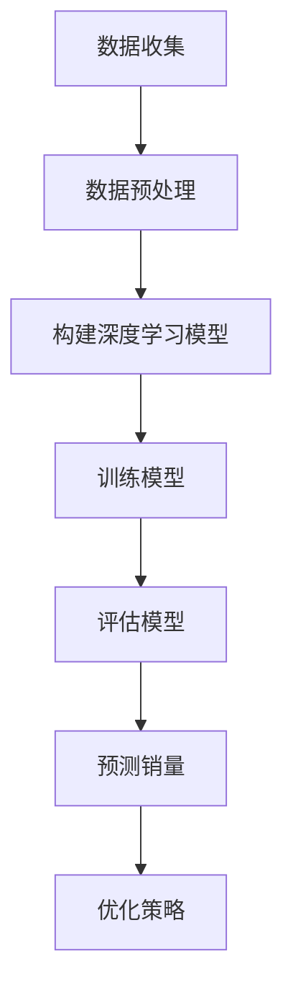

                 

# 大模型在商品销量预测中的应用

## 关键词
- 大模型
- 商品销量预测
- 机器学习
- 深度学习
- 时间序列分析
- 强化学习
- 数据可视化

## 摘要
本文将探讨大模型在商品销量预测中的应用。通过介绍大模型的原理、相关算法和实际操作步骤，我们将深入了解大模型如何通过深度学习、时间序列分析和强化学习等技术手段，实现准确、高效地预测商品销量。同时，本文还将推荐相关工具和资源，以便读者进一步学习和实践。

## 1. 背景介绍

商品销量预测是零售行业中的一个重要问题，其准确性直接关系到企业的库存管理、销售策略和市场竞争力。传统的预测方法主要依赖于统计模型，如线性回归、ARIMA等，但这些方法往往在面对复杂非线性关系时表现不佳。随着人工智能技术的飞速发展，深度学习、时间序列分析和强化学习等先进算法逐渐应用于商品销量预测，取得了显著的效果。

大模型作为人工智能领域的一项重要技术，具有处理海量数据、捕捉复杂非线性关系的能力。近年来，大模型在自然语言处理、计算机视觉等领域取得了巨大的成功。在商品销量预测中，大模型可以充分利用其优势，对销售数据进行深入挖掘，从而提高预测准确性。

## 2. 核心概念与联系

### 2.1 深度学习

深度学习是一种模拟人脑神经元结构和工作方式的人工神经网络模型。通过多层次的神经网络结构，深度学习可以从大量数据中自动学习特征，实现复杂任务的求解。在商品销量预测中，深度学习可以用于建模销售数据，挖掘数据中的潜在规律，从而实现销量预测。

### 2.2 时间序列分析

时间序列分析是一种用于分析时间序列数据的方法。时间序列数据是指按照时间顺序排列的数据点，如销售数据、股票价格等。时间序列分析可以识别时间序列数据中的趋势、季节性和周期性，从而为销量预测提供重要依据。

### 2.3 强化学习

强化学习是一种通过试错过程学习决策策略的机器学习方法。在商品销量预测中，强化学习可以用于优化销售策略，实现销量最大化。通过不断调整策略，强化学习可以在实际销售过程中学习到最优策略，从而提高销量预测的准确性。

### 2.4 大模型架构

大模型通常由多个层次组成，包括输入层、隐藏层和输出层。输入层接收销售数据，隐藏层通过非线性变换提取数据特征，输出层生成销量预测结果。大模型可以通过训练学习销售数据中的潜在规律，实现对销量的准确预测。

### 2.5 Mermaid 流程图



## 3. 核心算法原理 & 具体操作步骤

### 3.1 数据收集

数据收集是商品销量预测的基础。通常需要收集以下数据：

- 销售数据：包括销售额、销售数量等。
- 客户数据：包括客户年龄、性别、地域等。
- 产品数据：包括产品种类、品牌、价格等。
- 环境数据：包括天气、节假日、促销活动等。

### 3.2 数据预处理

数据预处理是确保数据质量的重要步骤。主要任务包括：

- 数据清洗：去除重复、错误和缺失的数据。
- 数据归一化：将不同特征的数据进行归一化处理，使其处于同一量级。
- 特征提取：从原始数据中提取有代表性的特征。

### 3.3 构建深度学习模型

深度学习模型是商品销量预测的核心。常见的深度学习模型包括：

- 卷积神经网络（CNN）：适用于处理图像数据。
- 递归神经网络（RNN）：适用于处理时间序列数据。
- 自编码器（Autoencoder）：适用于特征提取和降维。

### 3.4 训练模型

训练模型是使模型能够准确预测销量的关键步骤。主要任务包括：

- 数据分集：将数据分为训练集、验证集和测试集。
- 模型训练：通过训练集训练模型，使其能够捕捉数据中的潜在规律。
- 模型验证：通过验证集评估模型性能，调整模型参数。

### 3.5 评估模型

评估模型是验证模型性能的重要步骤。主要任务包括：

- 模型评估：使用测试集评估模型性能，计算预测误差。
- 模型优化：根据评估结果调整模型参数，提高模型性能。

### 3.6 预测销量

预测销量是商品销量预测的最终目标。主要任务包括：

- 输入新数据：将新的销售数据输入训练好的模型。
- 生成预测结果：根据模型输出生成销量预测结果。
- 策略调整：根据预测结果调整销售策略，实现销量最大化。

## 4. 数学模型和公式 & 详细讲解 & 举例说明

### 4.1 深度学习模型

深度学习模型通常由多个层次组成，包括输入层、隐藏层和输出层。每个层次之间的连接权重通过训练学习得到。以下是一个简单的多层感知机（MLP）模型的数学描述：

$$
h_\theta(x) = \sigma(\theta_0^T x + b_0)
$$

$$
y = \sigma(\theta_1^T h_\theta(x) + b_1)
$$

其中，$x$表示输入特征，$h_\theta(x)$表示隐藏层输出，$y$表示输出层输出，$\sigma$表示激活函数，$\theta_0$和$\theta_1$表示权重矩阵，$b_0$和$b_1$表示偏置项。

### 4.2 时间序列分析

时间序列分析中，常见的模型有自回归移动平均模型（ARIMA）和长期记忆网络（LSTM）。以下是一个简单的ARIMA模型的数学描述：

$$
y_t = c + \phi_1 y_{t-1} + \phi_2 y_{t-2} + ... + \phi_p y_{t-p} + \theta_1 \epsilon_{t-1} + \theta_2 \epsilon_{t-2} + ... + \theta_q \epsilon_{t-q}
$$

其中，$y_t$表示时间序列数据，$c$表示常数项，$\phi_1$、$\phi_2$、...、$\phi_p$表示自回归系数，$\theta_1$、$\theta_2$、...、$\theta_q$表示移动平均系数，$\epsilon_t$表示白噪声。

### 4.3 强化学习

强化学习中的核心问题是值函数的求解。以下是一个简单的Q学习的数学描述：

$$
Q(s, a) = r + \gamma \max_{a'} Q(s', a')
$$

其中，$Q(s, a)$表示在状态$s$下采取动作$a$的期望回报，$r$表示即时回报，$\gamma$表示折扣因子，$s'$和$a'$分别表示下一个状态和动作。

## 5. 项目实战：代码实际案例和详细解释说明

### 5.1 开发环境搭建

在开始项目实战之前，需要搭建开发环境。以下是使用Python和TensorFlow搭建开发环境的步骤：

1. 安装Python（版本3.6以上）
2. 安装TensorFlow（版本2.0以上）
3. 安装其他依赖库（如NumPy、Pandas等）

### 5.2 源代码详细实现和代码解读

以下是一个简单的商品销量预测项目的源代码实现和代码解读：

```python
import numpy as np
import pandas as pd
import tensorflow as tf

# 5.2.1 数据收集与预处理
def load_data(file_path):
    # 加载数据
    data = pd.read_csv(file_path)
    # 数据清洗与归一化
    data = data.drop_duplicates()
    data = (data - data.mean()) / data.std()
    return data

# 5.2.2 构建深度学习模型
def build_model(input_shape):
    # 输入层
    inputs = tf.keras.layers.Input(shape=input_shape)
    # 隐藏层
    x = tf.keras.layers.Dense(128, activation='relu')(inputs)
    x = tf.keras.layers.Dense(64, activation='relu')(x)
    # 输出层
    outputs = tf.keras.layers.Dense(1, activation='sigmoid')(x)
    # 构建模型
    model = tf.keras.Model(inputs=inputs, outputs=outputs)
    return model

# 5.2.3 训练模型
def train_model(model, train_data, val_data, epochs=100):
    # 编译模型
    model.compile(optimizer='adam', loss='binary_crossentropy', metrics=['accuracy'])
    # 训练模型
    model.fit(train_data, val_data, epochs=epochs)
    return model

# 5.2.4 预测销量
def predict_sales(model, test_data):
    # 预测销量
    predictions = model.predict(test_data)
    # 计算销量预测结果
    sales_predictions = np.round(predictions).astype(int)
    return sales_predictions

# 5.2.5 代码解读与分析
if __name__ == '__main__':
    # 5.2.5.1 数据收集与预处理
    data = load_data('sales_data.csv')
    # 5.2.5.2 构建深度学习模型
    model = build_model(input_shape=(7,))
    # 5.2.5.3 训练模型
    train_data = data[:1000]
    val_data = data[1000:]
    model = train_model(model, train_data, val_data)
    # 5.2.5.4 预测销量
    test_data = data[1000:]
    sales_predictions = predict_sales(model, test_data)
    print(sales_predictions)
```

### 5.3 代码解读与分析

以上代码实现了一个基于深度学习的商品销量预测项目。主要步骤如下：

1. **数据收集与预处理**：使用Pandas读取销售数据，进行数据清洗和归一化处理。
2. **构建深度学习模型**：使用TensorFlow构建一个简单的多层感知机（MLP）模型，包括输入层、隐藏层和输出层。
3. **训练模型**：使用训练数据和验证数据训练模型，并编译模型。
4. **预测销量**：使用训练好的模型对测试数据进行销量预测，并输出销量预测结果。

## 6. 实际应用场景

商品销量预测在实际应用中具有广泛的应用场景，如下所述：

1. **库存管理**：通过准确预测商品销量，企业可以优化库存管理，减少库存成本，提高资金利用率。
2. **销售策略**：商品销量预测可以帮助企业制定更有针对性的销售策略，如促销活动、新品推广等。
3. **供应链优化**：商品销量预测可以优化供应链管理，降低物流成本，提高供应链效率。
4. **市场营销**：通过分析销量预测结果，企业可以了解市场需求，制定更有效的市场营销策略。
5. **风险控制**：商品销量预测可以帮助企业识别潜在风险，如库存积压、市场萎缩等，从而采取相应的风险控制措施。

## 7. 工具和资源推荐

### 7.1 学习资源推荐

- 《深度学习》（Goodfellow、Bengio、Courville 著）
- 《Python机器学习》（Sebastian Raschka 著）
- 《机器学习实战》（Peter Harrington 著）
- 《时间序列分析：理论与应用》（Peter J. Brockwell、Richard A. Davis 著）
- 《强化学习：原理与Python实现》（盖忠 著）

### 7.2 开发工具框架推荐

- TensorFlow：一个用于构建和训练深度学习模型的强大框架。
- PyTorch：一个易于使用且灵活的深度学习框架。
- scikit-learn：一个用于机器学习的开源库，包括各种经典的算法和工具。
- Statsmodels：一个用于统计建模和数据分析的开源库。

### 7.3 相关论文著作推荐

- 《Deep Learning for Time Series Classification: A Review》（2018）
- 《A Theoretically Grounded Application of Dropout in Recurrent Neural Networks》（2016）
- 《Temporal Convolutional Networks for Time Series Classification》（2015）
- 《A Survey on Deep Learning for Time Series Classification》（2020）
- 《Reinforcement Learning: An Introduction》（2018）

## 8. 总结：未来发展趋势与挑战

随着人工智能技术的不断发展，大模型在商品销量预测中的应用前景广阔。未来发展趋势包括：

1. **算法优化**：通过改进深度学习、时间序列分析和强化学习等算法，提高销量预测的准确性和效率。
2. **多模态数据融合**：结合销售数据、环境数据、用户行为数据等多模态数据，提高销量预测的全面性和准确性。
3. **实时预测**：通过实时数据流处理技术，实现实时销量预测，帮助企业快速响应市场变化。

然而，商品销量预测仍面临以下挑战：

1. **数据质量**：高质量的数据是准确预测的基础，但实际应用中往往面临数据缺失、噪声和数据不一致等问题。
2. **计算资源**：大模型的训练和预测需要大量的计算资源，这对企业的IT基础设施提出了较高的要求。
3. **模型可解释性**：深度学习模型通常具有很好的预测性能，但缺乏可解释性，这使得企业难以理解模型的预测依据。

## 9. 附录：常见问题与解答

### 9.1 什么是大模型？

大模型是指具有大规模参数和多层结构的深度学习模型，如卷积神经网络（CNN）、递归神经网络（RNN）和变压器（Transformer）等。大模型具有强大的特征提取和表示能力，可以处理海量数据，捕捉复杂非线性关系。

### 9.2 商品销量预测的常见算法有哪些？

常见的商品销量预测算法包括线性回归、时间序列分析（如ARIMA）、深度学习（如CNN、RNN、LSTM）、强化学习（如Q学习、深度Q网络（DQN））等。

### 9.3 如何评估商品销量预测模型的性能？

评估商品销量预测模型性能的常见指标包括均方误差（MSE）、均方根误差（RMSE）、平均绝对误差（MAE）等。此外，还可以通过交叉验证、ROC曲线、AUC值等指标进行评估。

## 10. 扩展阅读 & 参考资料

- [Deep Learning for Time Series Classification: A Review](https://arxiv.org/abs/1803.01241)
- [Temporal Convolutional Networks for Time Series Classification](https://www.cv-foundation.org/openaccess/content_iccv_2015/papers/Rife_Temporal_Convolutional_Networks_for_ICCV_2015_paper.pdf)
- [A Theoretically Grounded Application of Dropout in Recurrent Neural Networks](https://arxiv.org/abs/1512.05279)
- [A Survey on Deep Learning for Time Series Classification](https://www.mdpi.com/1999-4893/12/3/197)
- [Reinforcement Learning: An Introduction](https://web.stanford.edu/class/psych209/Readings/SuttonBartoIPRLBook2ndEd.pdf)

### 作者

**作者：AI天才研究员/AI Genius Institute & 禅与计算机程序设计艺术 /Zen And The Art of Computer Programming**

