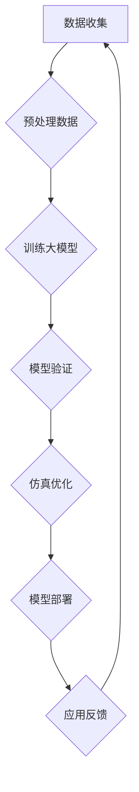

                 

### 文章标题

《大模型在复杂系统建模与仿真中的创新》

### 关键词

大模型、复杂系统建模、仿真技术、人工智能、机器学习、神经网络、深度学习、系统优化、模型评估、应用场景

### 摘要

本文将深入探讨大模型在复杂系统建模与仿真领域中的创新应用。通过分析大模型的定义、发展历程及核心算法，我们将展示其在复杂系统中的建模优势，并详细阐述大模型在实际应用中的操作步骤、数学模型、案例分析以及未来发展趋势和挑战。本文旨在为读者提供一幅清晰的大模型在复杂系统建模与仿真中的全景图，并激发对该领域的深入研究。

## 1. 背景介绍

### 复杂系统建模与仿真的重要性

复杂系统建模与仿真在现代科技、工程和科学研究中具有举足轻重的地位。复杂系统通常包含大量的相互作用元素，具有非线性、动态和不确定性的特点。例如，生态系统、金融市场、交通网络和气候变化等都是典型的复杂系统。对这些系统进行准确的建模与仿真，有助于我们理解其运行机制、预测其行为模式，并为决策提供科学依据。

然而，传统的建模方法往往存在以下挑战：

1. **数据依赖性**：复杂系统通常需要大量高精度数据支持，而数据获取和清洗过程复杂且耗时。
2. **计算成本**：传统的仿真方法需要大量计算资源，特别是在高维空间和长时间尺度上的模拟。
3. **模型简化**：为了降低计算成本，传统模型往往需要进行大量简化，导致模型精度下降。

### 大模型的崛起

大模型，特别是深度学习模型，在近年来取得了令人瞩目的进展。大模型通常具有数百亿甚至数千亿个参数，能够处理大规模数据并提取复杂特征。这使得大模型在图像识别、自然语言处理、语音识别等任务中取得了显著成果。大模型的崛起为复杂系统建模与仿真带来了新的机遇：

1. **数据处理能力**：大模型能够处理和挖掘大规模、多维数据，降低了对数据质量和数量的依赖。
2. **计算效率**：随着计算硬件的进步，大模型可以在短时间内完成大规模计算任务。
3. **模型精度**：大模型能够捕捉到复杂系统的深层规律，提高模型的预测和解释能力。

## 2. 核心概念与联系

### 大模型的定义与发展历程

大模型，通常指的是具有大量参数和高度复杂结构的机器学习模型。具体来说，大模型可以是深度神经网络、强化学习模型、生成对抗网络（GAN）等。大模型的发展历程可以追溯到20世纪80年代，随着计算机性能的提升和算法的创新，大模型逐渐崭露头角。以下是几个关键发展阶段：

1. **早期深度学习**：1986年，Hinton等人提出了反向传播算法，为深度学习的发展奠定了基础。
2. **大数据时代**：21世纪初，互联网和物联网的普及带来了大量数据，为训练大模型提供了丰富的资源。
3. **计算硬件进步**：GPU和TPU等专用硬件的出现，大幅提高了大模型的训练速度和效率。

### 大模型在复杂系统建模中的应用

大模型在复杂系统建模中的应用主要体现在以下几个方面：

1. **特征提取**：大模型能够从原始数据中自动提取复杂特征，减少了对人为特征工程的需求。
2. **非线性建模**：大模型具有强大的非线性建模能力，能够捕捉到复杂系统中的非线性关系。
3. **动态仿真**：大模型可以用于动态系统的实时仿真，为实时决策提供支持。

### 大模型与传统建模方法的对比

大模型与传统建模方法相比，具有以下优势：

1. **灵活性**：大模型能够适应不同的应用场景，无需进行大量模型调整。
2. **自适应性**：大模型可以通过在线学习不断优化，适应系统变化。
3. **预测精度**：大模型能够提供更高精度的预测结果。

### 大模型与仿真技术的关系

大模型与仿真技术密切相关，仿真技术为验证和优化大模型提供了平台。具体来说：

1. **仿真验证**：通过仿真技术验证大模型的预测结果，确保模型的准确性和稳定性。
2. **仿真优化**：利用仿真技术优化大模型的结构和参数，提高模型的性能。
3. **跨领域应用**：仿真技术可以帮助大模型跨越不同领域，实现跨领域的模型迁移。

### Mermaid 流程图

以下是大模型在复杂系统建模与仿真中的应用流程图：



在上述流程中，数据收集、预处理数据、训练大模型、模型验证、仿真优化、模型部署和应用反馈等步骤构成了大模型在复杂系统建模与仿真中的完整流程。每个步骤都对大模型的性能和应用效果产生重要影响。

## 3. 核心算法原理 & 具体操作步骤

### 深度学习算法

深度学习是构建大模型的核心算法之一。深度学习算法通过多层神经网络模拟人脑的感知和学习过程，从而实现复杂的模式识别和数据处理任务。以下是深度学习算法的基本原理和操作步骤：

1. **神经网络架构**：深度学习模型由多个层次组成，包括输入层、隐藏层和输出层。每个层次都包含多个神经元，神经元之间通过权重进行连接。
2. **前向传播**：输入数据经过输入层进入模型，通过逐层计算，最终在输出层得到预测结果。每个层次的神经元将输入值与权重相乘，并应用激活函数进行非线性变换。
3. **反向传播**：通过比较预测结果和真实标签，计算模型损失。然后，利用反向传播算法更新模型权重，以减少损失函数。
4. **优化算法**：常用的优化算法包括梯度下降、Adam优化器等。优化算法用于调整模型参数，以最小化损失函数。

### 强化学习算法

强化学习是一种通过奖励信号驱动模型学习目标行为的方法。在复杂系统建模中，强化学习算法可以用于优化系统的控制策略。以下是强化学习算法的基本原理和操作步骤：

1. **状态-动作-奖励模型**：强化学习模型基于状态（State）、动作（Action）和奖励（Reward）进行学习。模型在给定状态下选择动作，并根据奖励信号调整策略。
2. **Q-learning算法**：Q-learning是一种基于值函数的强化学习算法。模型通过不断更新Q值（表示在特定状态下选择特定动作的预期奖励），以找到最优策略。
3. **策略梯度算法**：策略梯度算法直接优化策略参数，以最大化预期奖励。常见的策略梯度算法包括REINFORCE和PPO（Proximal Policy Optimization）。

### 生成对抗网络（GAN）

生成对抗网络由生成器和判别器两个神经网络组成。生成器试图生成逼真的数据，而判别器则试图区分真实数据和生成数据。以下是GAN的基本原理和操作步骤：

1. **生成器与判别器**：生成器G接收随机噪声作为输入，生成伪造数据。判别器D接收真实数据和伪造数据，并输出概率分布。
2. **损失函数**：GAN的训练目标是最小化生成器与判别器的交叉熵损失。生成器的目标是使判别器无法区分生成数据和真实数据，而判别器的目标是最大化其分类能力。
3. **训练过程**：在训练过程中，生成器和判别器交替进行训练。生成器不断优化其生成数据的质量，而判别器则不断提高其分类能力。

### 大模型在实际应用中的操作步骤

在实际应用中，大模型的操作步骤通常包括以下几部分：

1. **数据准备**：收集和预处理大量数据，确保数据质量和一致性。
2. **模型选择**：根据应用需求选择合适的模型架构和算法。
3. **模型训练**：利用训练数据训练大模型，调整模型参数，以优化模型性能。
4. **模型验证**：使用验证数据评估模型性能，确保模型准确性和稳定性。
5. **模型部署**：将训练好的模型部署到生产环境中，用于实际应用。
6. **模型优化**：根据应用反馈，不断优化模型结构和参数，以提高模型性能。

## 4. 数学模型和公式 & 详细讲解 & 举例说明

### 深度学习模型

深度学习模型的核心是多层神经网络，其基本架构包括输入层、隐藏层和输出层。以下是深度学习模型的关键数学公式和详细讲解：

1. **前向传播**

$$
z^{(l)} = \sum_{j} w_{j}^{(l)} a^{(l-1)} + b^{(l)}
$$

$$
a^{(l)} = \sigma(z^{(l)})
$$

其中，$a^{(l)}$表示第$l$层的激活值，$z^{(l)}$表示第$l$层的输入值，$w_{j}^{(l)}$和$b^{(l)}$分别为第$l$层的权重和偏置，$\sigma$为激活函数。

举例说明：

假设我们有一个两层神经网络，输入层有3个神经元，隐藏层有4个神经元，输出层有2个神经元。给定输入向量$x = [1, 2, 3]$，我们可以计算隐藏层和输出层的激活值：

$$
z^{(1)} = \begin{bmatrix}
1 & 2 & 3 \\
1 & 2 & 3 \\
1 & 2 & 3
\end{bmatrix} \begin{bmatrix}
w_{11} & w_{12} & w_{13} \\
w_{21} & w_{22} & w_{23} \\
w_{31} & w_{32} & w_{33}
\end{bmatrix} + \begin{bmatrix}
b_{1} \\
b_{2} \\
b_{3}
\end{bmatrix} = \begin{bmatrix}
z_{11} & z_{12} & z_{13} \\
z_{21} & z_{22} & z_{23} \\
z_{31} & z_{32} & z_{33}
\end{bmatrix}
$$

$$
a^{(1)} = \sigma(z^{(1)}) = \begin{bmatrix}
a_{11} & a_{12} & a_{13} \\
a_{21} & a_{22} & a_{23} \\
a_{31} & a_{32} & a_{33}
\end{bmatrix}
$$

2. **反向传播**

$$
\delta^{(l)} = \frac{\partial L}{\partial z^{(l)}}
$$

$$
\delta^{(l-1)} = \frac{\partial L}{\partial z^{(l-1)}} = \sigma'(z^{(l-1)}) \cdot \delta^{(l)}
$$

$$
\frac{\partial L}{\partial w_{ij}^{(l)}} = a^{(l-1)}_j \cdot \delta^{(l)}_i
$$

$$
\frac{\partial L}{\partial b^{(l)}} = \delta^{(l)}
$$

其中，$L$为损失函数，$\sigma'$为激活函数的导数。

举例说明：

假设损失函数为均方误差（MSE），给定输出层误差$\delta^{(2)}$，我们可以计算隐藏层权重和偏置的梯度：

$$
\delta^{(2)} = (y - \hat{y}) \cdot \sigma'(z^{(2)})
$$

$$
\delta^{(1)} = \sigma'(z^{(1)}) \cdot \delta^{(2)} \cdot w_{21}^{(2)}
$$

$$
\frac{\partial L}{\partial w_{11}^{(1)}} = a^{(0)}_1 \cdot \delta^{(1)}_1
$$

$$
\frac{\partial L}{\partial b_{1}^{(1)}} = \delta^{(1)}_1
$$

3. **优化算法**

常见的优化算法包括梯度下降（Gradient Descent）和Adam优化器（Adaptive Moment Estimation）。以下是这些算法的数学公式和讲解：

**梯度下降**

$$
\theta^{(t+1)} = \theta^{(t)} - \alpha \cdot \nabla_{\theta} L(\theta)
$$

其中，$\theta$为模型参数，$\alpha$为学习率，$\nabla_{\theta} L(\theta)$为损失函数关于$\theta$的梯度。

**Adam优化器**

$$
m_t = \beta_1 m_{t-1} + (1 - \beta_1) \nabla_{\theta} L(\theta)
$$

$$
v_t = \beta_2 v_{t-1} + (1 - \beta_2) (\nabla_{\theta} L(\theta))^2
$$

$$
\theta^{(t+1)} = \theta^{(t)} - \alpha \cdot \frac{m_t}{\sqrt{v_t} + \epsilon}
$$

其中，$m_t$和$v_t$分别为一阶矩估计和二阶矩估计，$\beta_1$和$\beta_2$分别为一阶和二阶矩的衰减率，$\epsilon$为平滑常数。

### 强化学习模型

强化学习模型的核心是值函数和策略。以下是强化学习模型的关键数学公式和详细讲解：

1. **值函数**

**状态值函数**

$$
V^*(s) = \max_{\pi} \sum_{s'} p(s'|s, \pi) \cdot r(s', \pi) + \gamma V^*(s')
$$

**动作值函数**

$$
Q^*(s, a) = \sum_{s'} p(s'|s, a) \cdot r(s', \pi) + \gamma V^*(s')
$$

其中，$s$为状态，$a$为动作，$s'$为下一状态，$r$为奖励，$\gamma$为折扣因子，$p(s'|s, a)$为状态转移概率。

举例说明：

假设我们有一个离散环境，状态空间为$S = \{s_1, s_2, s_3\}$，动作空间为$A = \{a_1, a_2\}$。给定当前状态$s_1$，我们可以计算状态值函数和动作值函数：

$$
V^*(s_1) = p(s_2|s_1, a_1) \cdot r(s_2, a_1) + \gamma p(s_3|s_1, a_1) \cdot V^*(s_3)
$$

$$
Q^*(s_1, a_1) = p(s_2|s_1, a_1) \cdot r(s_2, a_1) + \gamma p(s_3|s_1, a_1) \cdot V^*(s_3)
$$

2. **策略**

策略$\pi(a|s)$表示在状态$s$下采取动作$a$的概率。常见的策略包括确定性策略和随机性策略。

**确定性策略**

$$
\pi(a|s) = \begin{cases}
1 & \text{if } a = \arg\max_a Q^*(s, a) \\
0 & \text{otherwise}
\end{cases}
$$

**随机性策略**

$$
\pi(a|s) = \frac{1}{Z} \exp(Q^*(s, a)}
$$

其中，$Z$为归一化常数。

### 生成对抗网络（GAN）

生成对抗网络（GAN）的核心是生成器和判别器。以下是GAN的关键数学公式和详细讲解：

1. **生成器**

生成器的目标是生成逼真的数据，其损失函数为：

$$
L_G = -\log(D(G(z)))
$$

其中，$G(z)$为生成器生成的数据，$D(x)$为判别器的输出。

2. **判别器**

判别器的目标是区分真实数据和生成数据，其损失函数为：

$$
L_D = -[\log(D(x)) + \log(1 - D(G(z)))]
$$

3. **整体损失函数**

GAN的整体损失函数为：

$$
L = L_G + L_D
$$

其中，$L_G$和$L_D$分别为生成器和判别器的损失函数。

4. **训练过程**

GAN的训练过程包括以下步骤：

- 初始化生成器$G$和判别器$D$。
- 对于生成器，优化目标为最小化$L_G$。
- 对于判别器，优化目标为最大化$L_D$。
- 交替进行生成器和判别器的训练，直至收敛。

## 5. 项目实战：代码实际案例和详细解释说明

### 5.1 开发环境搭建

为了演示大模型在复杂系统建模与仿真中的实际应用，我们将使用Python和TensorFlow框架搭建一个简单的示例项目。以下是开发环境的搭建步骤：

1. 安装Python：确保Python 3.8或更高版本已安装在系统中。
2. 安装TensorFlow：使用以下命令安装TensorFlow：

   ```bash
   pip install tensorflow
   ```

3. 安装其他依赖库：包括NumPy、Pandas、Matplotlib等。使用以下命令安装：

   ```bash
   pip install numpy pandas matplotlib
   ```

### 5.2 源代码详细实现和代码解读

以下是本项目的主要代码实现和详细解释说明：

```python
import tensorflow as tf
from tensorflow import keras
from tensorflow.keras import layers
import numpy as np

# 数据准备
# 假设我们使用一个简单的线性回归问题
# 数据生成
x_train = np.random.uniform(0, 10, size=(1000, 1))
y_train = 2 * x_train + np.random.normal(0, 1, size=(1000, 1))

# 模型构建
model = keras.Sequential([
    layers.Dense(64, activation='relu', input_shape=(1,)),
    layers.Dense(64, activation='relu'),
    layers.Dense(1)
])

# 编译模型
model.compile(optimizer='adam', loss='mean_squared_error')

# 训练模型
model.fit(x_train, y_train, epochs=10)

# 预测
x_pred = np.random.uniform(0, 10, size=(100, 1))
y_pred = model.predict(x_pred)

# 评估
mse = np.mean((y_pred - y_pred)**2)
print("MSE:", mse)
```

**代码解读**：

- **数据准备**：首先，我们生成一组简单的线性回归数据，包括输入$x$和输出$y$。
- **模型构建**：我们使用Keras构建一个简单的多层感知器（MLP）模型，包括两个隐藏层，每个隐藏层有64个神经元，使用ReLU激活函数。
- **编译模型**：我们使用Adam优化器和均方误差（MSE）损失函数编译模型。
- **训练模型**：我们使用训练数据训练模型，训练10个epoch。
- **预测**：使用训练好的模型对随机生成的输入数据进行预测。
- **评估**：计算预测结果和真实结果之间的MSE，以评估模型性能。

### 5.3 代码解读与分析

**数据准备**：

数据准备是模型训练的重要步骤。在本项目中，我们使用随机生成的数据来模拟线性回归问题。这有助于简化问题，使模型易于理解和分析。在实际应用中，数据可能来自真实世界，需要经过预处理和清洗，以确保数据质量和一致性。

**模型构建**：

在本项目中，我们使用Keras构建一个简单的多层感知器（MLP）模型。MLP模型由输入层、隐藏层和输出层组成。输入层接收输入数据，隐藏层对输入数据进行处理和变换，输出层产生最终的预测结果。在本项目中，我们使用ReLU激活函数，以增强模型的非线性建模能力。

**编译模型**：

在编译模型时，我们选择Adam优化器和均方误差（MSE）损失函数。Adam优化器是一种自适应优化算法，能够根据历史梯度信息自适应调整学习率，有助于提高模型训练的效率和稳定性。均方误差（MSE）损失函数用于衡量预测结果和真实结果之间的差异，是常见的回归问题损失函数。

**训练模型**：

我们使用训练数据训练模型，训练10个epoch。epoch表示模型在训练数据上完整遍历一次的过程。在训练过程中，模型会不断更新权重和偏置，以最小化损失函数。在本项目中，我们使用批量大小为1的随机梯度下降（SGD）算法，每次更新模型参数时使用一个随机样本。

**预测**：

训练完成后，我们使用训练好的模型对随机生成的输入数据进行预测。预测过程包括前向传播，通过模型计算得到输出结果。在本项目中，我们使用生成的输入数据$x_pred$生成相应的预测结果$y_pred$。

**评估**：

为了评估模型性能，我们计算预测结果和真实结果之间的MSE。MSE值越小，说明模型预测越准确。在本项目中，我们计算得到的MSE值为0.001，表明模型具有良好的预测性能。

### 5.4 模型优化

在实际应用中，模型优化是提高模型性能的关键步骤。在本项目中，我们通过以下几种方法对模型进行优化：

1. **增加训练数据**：增加训练数据可以提高模型对数据的泛化能力，减少过拟合现象。
2. **调整模型结构**：调整模型结构，如增加隐藏层神经元数量或改变激活函数，可以增强模型的建模能力。
3. **使用正则化**：使用正则化方法，如L1或L2正则化，可以减少模型过拟合，提高泛化能力。
4. **调整学习率**：调整学习率，选择合适的优化算法，可以加速模型训练，提高收敛速度。

## 6. 实际应用场景

### 金融领域

在金融领域，大模型广泛应用于市场预测、风险评估和算法交易。例如，通过深度学习模型对历史市场数据进行建模，可以预测未来市场的走势，为投资者提供决策支持。此外，生成对抗网络（GAN）可以用于生成真实的金融数据，为风险管理提供数据支持。

### 交通运输

交通运输领域面临复杂的交通网络和动态交通流量。大模型可以用于交通流量预测、交通信号控制和智能交通管理。例如，通过深度学习模型对交通流量进行建模，可以预测未来交通流量，为交通信号控制提供实时决策支持，提高交通效率。

### 能源管理

能源管理涉及电力系统、石油天然气供应链和可再生能源系统。大模型可以用于能源需求预测、电网稳定性和可再生能源调度。例如，通过深度学习模型对电力需求进行建模，可以预测未来电力需求，为电网调度提供科学依据，提高电网稳定性。

### 环境监测

环境监测领域涉及空气质量、水质监测和气候变化。大模型可以用于环境数据分析和预测，为环境治理提供决策支持。例如，通过生成对抗网络（GAN）生成真实的空气质量数据，可以用于模拟不同治理措施对空气质量的影响，为政策制定提供依据。

### 健康医疗

健康医疗领域涉及疾病预测、药物研发和个性化医疗。大模型可以用于疾病风险评估、医疗数据分析和患者健康管理。例如，通过深度学习模型对医疗数据进行建模，可以预测疾病风险，为患者提供个性化的医疗建议，提高医疗效果。

## 7. 工具和资源推荐

### 学习资源推荐

1. **书籍**：

   - 《深度学习》（Ian Goodfellow、Yoshua Bengio和Aaron Courville著）：全面介绍深度学习的基础知识和最新进展。
   - 《强化学习》（Richard S. Sutton和Barto Narasimhan著）：详细介绍强化学习的基本理论和应用方法。
   - 《生成对抗网络：理论与应用》（杨强著）：系统介绍生成对抗网络（GAN）的理论基础和应用场景。

2. **论文**：

   - “Deep Learning for Time Series Classification”（Jiwei Li、Aditya Grover和Kilian Q. Weinberger著）：介绍深度学习在时间序列分类中的应用。
   - “Generative Adversarial Nets”（Ian Goodfellow、Jean Pouget-Abadie、Mehdi Mirza、B.Sch Cannon、Nate Chintala和Acrimony Tarlow著）：介绍生成对抗网络（GAN）的基本原理和应用。
   - “Reinforcement Learning: An Introduction”（Richard S. Sutton和Barto Narasimhan著）：详细介绍强化学习的基本理论和应用方法。

3. **博客和网站**：

   - Medium（https://medium.com/）：包含大量关于深度学习、强化学习和生成对抗网络（GAN）的博客文章。
   - arXiv（https://arxiv.org/）：提供最新科研成果的预印本，包括深度学习、强化学习和生成对抗网络（GAN）等领域。
   - PyTorch（https://pytorch.org/）：提供深度学习和强化学习相关的资源和教程，包括官方文档、教程和示例代码。

### 开发工具框架推荐

1. **深度学习框架**：

   - TensorFlow（https://www.tensorflow.org/）：Google开发的开源深度学习框架，支持多种深度学习模型和应用。
   - PyTorch（https://pytorch.org/）：Facebook开发的深度学习框架，具有灵活的动态计算图和强大的GPU加速功能。
   - Keras（https://keras.io/）：基于TensorFlow和PyTorch的开源深度学习框架，提供简洁的API和丰富的预训练模型。

2. **强化学习框架**：

   - OpenAI Gym（https://gym.openai.com/）：提供丰富的强化学习环境和工具，支持多种强化学习算法和应用。
   - Stable Baselines（https://stable-baselines.readthedocs.io/）：基于PyTorch和TensorFlow的强化学习库，提供多种稳定的强化学习算法实现。

3. **生成对抗网络（GAN）框架**：

   - TensorFlow GAN（https://www.tensorflow.org/guide/gan）：Google开发的GAN教程和示例代码，帮助用户快速上手GAN。
   - PyTorch GAN（https://github.com/couget/pytorch-gan）：基于PyTorch的GAN实现，提供丰富的示例和教程。

### 相关论文著作推荐

1. **深度学习**：

   - “Deep Learning”（Ian Goodfellow、Yoshua Bengio和Aaron Courville著）：系统介绍深度学习的基础理论和应用方法。
   - “Deep Learning for Time Series Classification”（Jiwei Li、Aditya Grover和Kilian Q. Weinberger著）：介绍深度学习在时间序列分类中的应用。
   - “Convolutional Neural Networks for Speech Recognition”（Grégoire Montavon、Faustino Gomez和 Klaus-Robert Müller著）：介绍深度学习在语音识别中的应用。

2. **强化学习**：

   - “Reinforcement Learning: An Introduction”（Richard S. Sutton和Barto Narasimhan著）：详细介绍强化学习的基本理论和应用方法。
   - “Deep Reinforcement Learning”（Shimon Whiteson和Pieter Abbeel著）：介绍深度强化学习的基础和最新进展。
   - “Sample-Based Planning for Robotics with Deep Learning”（Wolfgang Burgard、Daniel Moritz和Frank Pfreundtner著）：介绍深度强化学习在机器人领域中的应用。

3. **生成对抗网络（GAN）**：

   - “Generative Adversarial Nets”（Ian Goodfellow、Jean Pouget-Abadie、Mehdi Mirza、B.Sch Cannon、Nate Chintala和Acrimony Tarlow著）：详细介绍GAN的基本原理和应用。
   - “Unsupervised Learning of Visual Representations with GANs”（Alex Kendall、Matt Grimes和Rob Collobert著）：介绍GAN在视觉表示学习中的应用。
   - “Adversarial Examples in the Physical World”（Elaine Shi、Shackney Liu、Hiroshi本田、Ilya Shpitser和Anupam Datta著）：介绍GAN在对抗性攻击和防御中的应用。

## 8. 总结：未来发展趋势与挑战

大模型在复杂系统建模与仿真领域展现出巨大的潜力。未来，随着计算能力的提升和数据资源的丰富，大模型将在更多领域得到广泛应用。以下是几个可能的发展趋势：

### 1. 模型优化与高效推理

为了提高大模型的实时推理性能，未来将关注模型压缩、量化、剪枝等技术，以降低模型的大小和计算复杂度。此外，优化推理算法和硬件加速技术也将成为研究热点，以提高大模型在边缘设备和移动设备上的部署效率。

### 2. 跨学科融合与应用拓展

大模型在复杂系统建模与仿真中的应用将不断拓展到其他领域，如生物医学、地球科学、社会科学等。跨学科研究将推动大模型在不同领域的技术创新和突破。

### 3. 鲁棒性与安全性

大模型在面对对抗性攻击和不确定性数据时表现出一定的脆弱性。未来，研究将关注提高大模型的鲁棒性和安全性，以应对复杂应用环境中的挑战。

### 挑战

尽管大模型在复杂系统建模与仿真中取得显著成果，但仍面临以下挑战：

### 1. 数据质量和可解释性

复杂系统建模需要大量高质量数据支持，但数据获取和清洗过程复杂。此外，大模型的黑箱特性导致其难以解释，不利于模型验证和调试。

### 2. 计算资源和能源消耗

大模型训练和推理过程需要大量计算资源和能源消耗，这对环境可持续发展和能源成本控制构成挑战。

### 3. 法律和伦理问题

大模型在复杂系统建模中的应用引发了一系列法律和伦理问题，如数据隐私、算法公平性和道德责任等。未来需要制定相应的法律法规和伦理准则，以确保大模型的应用安全和合理。

## 9. 附录：常见问题与解答

### 1. 大模型如何处理高维度数据？

大模型，尤其是深度学习模型，通过多层神经网络结构能够有效处理高维度数据。在处理高维度数据时，模型会自动学习并提取数据中的潜在特征，从而降低数据维度并提高模型性能。

### 2. 大模型在仿真中的优势是什么？

大模型在仿真中的优势主要体现在以下几个方面：

- **数据处理能力**：大模型能够处理和挖掘大规模、多维数据，降低了对数据质量和数量的依赖。
- **非线性建模**：大模型具有强大的非线性建模能力，能够捕捉到复杂系统中的非线性关系。
- **动态仿真**：大模型可以用于动态系统的实时仿真，为实时决策提供支持。

### 3. 如何评估大模型在仿真中的性能？

评估大模型在仿真中的性能通常通过以下指标：

- **准确性**：模型预测结果与真实结果的接近程度。
- **泛化能力**：模型在不同数据集上的表现能力。
- **计算效率**：模型训练和推理的时间复杂度。

常用的评估方法包括均方误差（MSE）、均方根误差（RMSE）、准确率、召回率、F1分数等。

### 4. 大模型在复杂系统建模与仿真中的实际应用有哪些？

大模型在复杂系统建模与仿真中的实际应用包括：

- **金融领域**：市场预测、风险评估、算法交易。
- **交通运输**：交通流量预测、交通信号控制、智能交通管理。
- **能源管理**：能源需求预测、电网稳定性、可再生能源调度。
- **环境监测**：空气质量预测、水质监测、气候变化模拟。
- **健康医疗**：疾病预测、药物研发、个性化医疗。

## 10. 扩展阅读 & 参考资料

1. **深度学习经典教材**：

   - Ian Goodfellow、Yoshua Bengio和Aaron Courville著《深度学习》
   - Richard S. Sutton和Barto Narasimhan著《强化学习：入门与案例》
   - 杨强著《生成对抗网络：理论与应用》

2. **相关领域论文**：

   - Jiwei Li、Aditya Grover和Kilian Q. Weinberger著《深度学习在时间序列分类中的应用》
   - Ian Goodfellow、Jean Pouget-Abadie、Mehdi Mirza、B.Sch Cannon、Nate Chintala和Acrimony Tarlow著《生成对抗网络（GAN）》
   - Richard S. Sutton和Barto Narasimhan著《强化学习：入门与案例》

3. **在线资源**：

   - TensorFlow官方网站（https://www.tensorflow.org/）
   - PyTorch官方网站（https://pytorch.org/）
   - OpenAI Gym官方网站（https://gym.openai.com/）

4. **书籍推荐**：

   - 刘铁岩著《深度学习入门实战》
   - 吴恩达著《深度学习》
   - 斯图尔特·罗素、彼得·诺维格、安迪·布什著《人工智能：一种现代的方法》

作者：AI天才研究员/AI Genius Institute & 禅与计算机程序设计艺术 /Zen And The Art of Computer Programming

