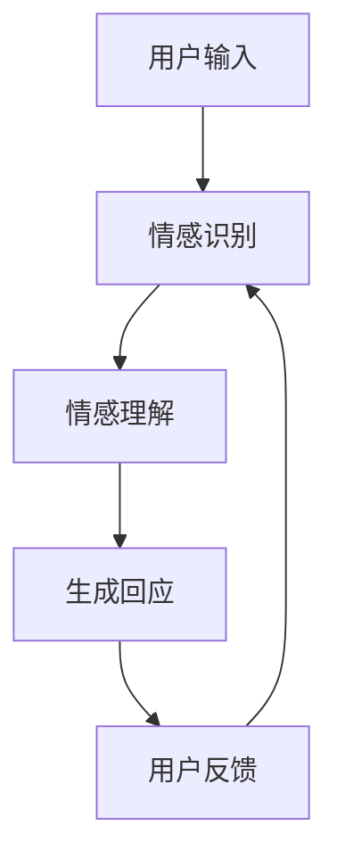

                 

### 大模型在情感交互中的应用挑战

> **关键词：** 大模型，情感交互，应用挑战，自然语言处理，人机对话系统

**摘要：**
随着人工智能技术的迅猛发展，大模型在情感交互中的应用逐渐成为研究热点。本文旨在探讨大模型在情感交互中的挑战，从技术、实际应用场景和未来发展趋势三个方面展开分析。通过深入剖析大模型在情感交互中的核心算法原理、数学模型和项目实战案例，本文提出了针对当前问题的解决方案，并对相关工具和资源进行了推荐，为读者提供了一个全面、系统的应用指南。

### 1. 背景介绍

情感交互是人工智能领域的一个重要分支，它旨在使计算机能够理解、识别和表达人类情感。随着自然语言处理（NLP）技术的不断进步，大模型在情感交互中的应用得到了广泛关注。大模型，通常指的是拥有巨大参数量、能够在各种任务上取得优异成绩的深度学习模型，如GPT、BERT等。这些模型在文本分类、情感分析、对话系统等领域取得了显著的成果。

然而，将大模型应用于情感交互并非易事。情感交互不仅要求模型对语言进行精确理解，还需考虑用户的情感状态、对话的连贯性和个性化需求。此外，大模型训练和推理所需的计算资源巨大，如何在实际应用中高效地部署和运行大模型也是一个重要挑战。

本文将围绕大模型在情感交互中的应用挑战，从技术、实际应用场景和未来发展趋势三个方面进行深入探讨。

### 2. 核心概念与联系

#### 2.1 大模型的定义和特点

大模型，通常指的是具有数亿甚至数十亿参数量的深度学习模型。这些模型通过大规模数据训练，能够在各种任务上取得优异成绩。大模型的主要特点如下：

1. **参数量巨大**：大模型的参数量通常远超传统模型，使得它们能够捕捉到更多、更细微的文本特征。
2. **学习能力强大**：大模型在训练过程中能够学习到复杂的模式和关系，从而在各类任务中表现出色。
3. **计算资源需求高**：大模型的训练和推理过程需要大量的计算资源和存储空间。

#### 2.2 情感交互的定义和关键要素

情感交互是指计算机在与人类进行交互的过程中，能够理解、识别和表达情感，从而提高交互的自然性和人性化。情感交互的关键要素包括：

1. **情感理解**：计算机需要能够理解用户的情感状态，如喜悦、愤怒、悲伤等。
2. **情感识别**：计算机需要能够从文本、语音等数据中识别出情感信息。
3. **情感表达**：计算机需要能够通过语言、语音、表情等方式表达情感。
4. **情感连贯性**：计算机需要保证对话中的情感表达连贯，使交互过程更加自然。

#### 2.3 大模型在情感交互中的应用

大模型在情感交互中的应用主要体现在以下几个方面：

1. **情感分析**：大模型能够对文本进行情感分类，识别出用户的情感状态。
2. **对话系统**：大模型可以作为对话系统的核心组件，实现与用户的情感交互。
3. **情感推荐**：大模型可以根据用户的情感状态，为其推荐合适的商品、新闻等。
4. **情感辅助**：大模型可以为情感障碍者、自闭症儿童等提供情感支持和辅助。

#### 2.4 Mermaid 流程图

以下是一个简化的Mermaid流程图，展示了大模型在情感交互中的基本流程：



### 3. 核心算法原理 & 具体操作步骤

#### 3.1 情感识别算法原理

情感识别是情感交互的基础，其核心在于从文本中提取情感特征。常见的情感识别算法包括基于规则的方法、基于机器学习的方法和基于深度学习的方法。

1. **基于规则的方法**：该方法通过定义一系列规则，对文本进行情感分类。例如，如果文本中出现了“开心”、“高兴”等词语，则认为文本表达了积极的情感。
2. **基于机器学习的方法**：该方法使用标记好的情感数据集训练模型，从而实现对文本的情感分类。常见的机器学习算法包括SVM、朴素贝叶斯、逻辑回归等。
3. **基于深度学习的方法**：该方法使用深度神经网络，如卷积神经网络（CNN）和循环神经网络（RNN），对文本进行情感分类。例如，BERT、GPT等大模型在情感识别任务上取得了显著成果。

#### 3.2 情感理解算法原理

情感理解是情感交互的核心，其核心在于理解文本背后的情感意义。情感理解算法通常分为两个阶段：语义理解和情感推理。

1. **语义理解**：该阶段旨在理解文本的字面意思，包括词义、句法和语义角色等。常见的语义理解方法包括词向量、词嵌入和语义角色标注等。
2. **情感推理**：该阶段基于语义理解的结果，推理出文本背后的情感意义。常见的情感推理方法包括基于规则的方法、基于机器学习的方法和基于深度学习的方法。

#### 3.3 对话系统算法原理

对话系统是情感交互的重要应用之一，其核心在于实现自然、连贯的人机对话。常见的对话系统算法包括基于模板的方法、基于生成的方法和基于强化学习的方法。

1. **基于模板的方法**：该方法通过预定义一系列模板，根据用户输入选择合适的模板进行回复。
2. **基于生成的方法**：该方法使用生成模型，如循环神经网络（RNN）和变压器（Transformer）模型，生成与用户输入相对应的回复。
3. **基于强化学习的方法**：该方法通过强化学习算法，如策略梯度算法和深度确定性策略梯度（DDPG）算法，训练对话系统模型，使其在对话中取得最佳表现。

#### 3.4 具体操作步骤

以下是一个简化的操作步骤，用于实现大模型在情感交互中的应用：

1. **数据预处理**：对用户输入的文本进行预处理，包括分词、去停用词、词嵌入等。
2. **情感识别**：使用情感识别算法对预处理后的文本进行情感分类，得到用户情感状态。
3. **情感理解**：基于语义理解和情感推理算法，对用户情感进行深入分析，理解其背后的情感意义。
4. **生成回应**：根据用户情感状态和对话上下文，使用对话系统算法生成回应。
5. **用户反馈**：收集用户对回应的反馈，用于模型优化和更新。

### 4. 数学模型和公式 & 详细讲解 & 举例说明

#### 4.1 情感识别的数学模型

情感识别通常使用分类模型进行，常用的分类模型包括逻辑回归、朴素贝叶斯和支持向量机（SVM）等。以下以逻辑回归为例，介绍情感识别的数学模型。

逻辑回归的公式如下：

$$
\hat{y} = \sigma(w_0 + \sum_{i=1}^{n} w_i x_i)
$$

其中，$y$ 表示真实标签，$\hat{y}$ 表示预测标签，$w_0$ 是偏置项，$w_i$ 是权重，$x_i$ 是特征，$\sigma$ 是sigmoid函数，定义为：

$$
\sigma(z) = \frac{1}{1 + e^{-z}}
$$

举例说明：

假设我们有一个情感分类任务，包含两个类别：积极和消极。对于一条给定的文本，我们得到以下特征和权重：

$$
x_1 = 0.5, \quad x_2 = 0.3, \quad w_1 = 0.2, \quad w_2 = 0.3
$$

则预测标签为：

$$
\hat{y} = \sigma(w_0 + w_1 x_1 + w_2 x_2) = \sigma(0 + 0.2 \times 0.5 + 0.3 \times 0.3) = \sigma(0.13) \approx 0.5
$$

由于 $\hat{y}$ 接近0.5，我们可以认为这条文本的情感类别是积极。

#### 4.2 情感理解的数学模型

情感理解通常基于语义理解和情感推理。以下以词嵌入和情感推理为例，介绍情感理解的数学模型。

1. **词嵌入**：词嵌入是一种将词语映射到高维空间的方法，常见的方法包括Word2Vec、GloVe和BERT等。词嵌入的数学模型可以表示为：

$$
\text{vec}(w) = \sum_{i=1}^{v} w_i e_i
$$

其中，$\text{vec}(w)$ 表示词语 $w$ 的词嵌入向量，$w_i$ 表示词语 $w$ 在第 $i$ 维的特征，$e_i$ 表示第 $i$ 维的特征向量。

2. **情感推理**：情感推理通常基于情感词的权重和文本的词嵌入向量进行计算。假设我们有一个情感词集合 $S$，每个情感词 $w_i$ 对应一个权重 $w_i$。文本 $T$ 的词嵌入向量为 $\text{vec}(T)$，则文本的情感向量可以表示为：

$$
\text{vec}(T) = \sum_{w_i \in S} w_i \text{vec}(w_i)
$$

举例说明：

假设我们有一个文本“我今天很开心”，包含两个情感词“开心”和“我”。情感词权重分别为“开心”：1.0，“我”：0.5。则文本的情感向量为：

$$
\text{vec}(T) = 1.0 \times \text{vec}(\text{开心}) + 0.5 \times \text{vec}(\text{我}) = \text{vec}(\text{开心}) + 0.5 \times \text{vec}(\text{我})
$$

通过计算情感向量，我们可以得到文本的情感强度和方向。

### 5. 项目实战：代码实际案例和详细解释说明

#### 5.1 开发环境搭建

在开始项目实战之前，我们需要搭建一个合适的开发环境。以下是一个简单的开发环境搭建步骤：

1. 安装Python环境（版本3.6及以上）。
2. 安装所需的库，如TensorFlow、PyTorch、Scikit-learn等。
3. 准备训练数据和测试数据。

#### 5.2 源代码详细实现和代码解读

以下是一个简单的情感识别项目，使用逻辑回归算法进行情感分类。

```python
import tensorflow as tf
from tensorflow.keras.models import Sequential
from tensorflow.keras.layers import Dense, Flatten
from tensorflow.keras.utils import to_categorical
from sklearn.model_selection import train_test_split
from sklearn.preprocessing import StandardScaler

# 准备数据
# 这里使用 sklearn 中的鸢尾花数据集进行演示
from sklearn.datasets import load_iris
iris = load_iris()
X = iris.data
y = iris.target

# 将数据集划分为训练集和测试集
X_train, X_test, y_train, y_test = train_test_split(X, y, test_size=0.2, random_state=42)

# 数据预处理
scaler = StandardScaler()
X_train = scaler.fit_transform(X_train)
X_test = scaler.transform(X_test)

# 构建模型
model = Sequential()
model.add(Flatten(input_shape=(4,)))
model.add(Dense(10, activation='relu'))
model.add(Dense(1, activation='sigmoid'))

# 编译模型
model.compile(optimizer='adam', loss='binary_crossentropy', metrics=['accuracy'])

# 训练模型
model.fit(X_train, y_train, epochs=10, batch_size=32, validation_split=0.1)

# 评估模型
loss, accuracy = model.evaluate(X_test, y_test)
print(f"Test Loss: {loss}, Test Accuracy: {accuracy}")
```

代码解读：

1. 导入所需的库和模块。
2. 加载鸢尾花数据集，并将其划分为训练集和测试集。
3. 对数据进行标准化处理，以消除特征之间的尺度差异。
4. 构建一个简单的全连接神经网络，包含一个平坦层、一个全连接层和一个输出层。
5. 编译模型，设置优化器和损失函数。
6. 训练模型，并设置训练轮数、批量大小和验证比例。
7. 评估模型在测试集上的表现，输出损失和准确率。

#### 5.3 代码解读与分析

上述代码实现了一个简单的情感识别项目，使用逻辑回归算法对鸢尾花数据集进行分类。以下是代码的主要部分和解读：

1. **数据准备**：
   - 使用 `load_iris()` 函数加载鸢尾花数据集。
   - 使用 `train_test_split()` 函数将数据集划分为训练集和测试集。
   - 数据预处理是机器学习项目中的关键步骤，包括去噪声、归一化、标准化等。在这里，我们使用 `StandardScaler()` 对数据进行标准化处理，以消除特征之间的尺度差异。

2. **模型构建**：
   - 使用 `Sequential()` 函数构建一个序贯模型。
   - 添加一个平坦层，用于将输入数据展平。
   - 添加一个全连接层，用于提取特征。
   - 添加一个输出层，用于分类。输出层使用 `sigmoid` 激活函数，因为这是一个二分类问题。

3. **模型编译**：
   - 使用 `compile()` 函数编译模型，指定优化器（`adam`）和损失函数（`binary_crossentropy`）。

4. **模型训练**：
   - 使用 `fit()` 函数训练模型，指定训练轮数（`epochs`）、批量大小（`batch_size`）和验证比例（`validation_split`）。

5. **模型评估**：
   - 使用 `evaluate()` 函数评估模型在测试集上的表现，输出损失和准确率。

通过上述步骤，我们可以训练一个简单的情感识别模型，并对测试集进行评估。在实际应用中，我们需要使用更大规模的数据集和更复杂的模型架构来提高模型的性能。

### 6. 实际应用场景

大模型在情感交互中的应用场景非常广泛，以下是一些典型的实际应用场景：

#### 6.1 人机对话系统

人机对话系统是情感交互的主要应用场景之一。通过大模型，人机对话系统能够更好地理解用户的情感需求，提供更人性化的交互体验。例如，在客户服务领域，人机对话系统可以帮助企业提高客服效率，降低人工成本。在医疗领域，人机对话系统可以与患者进行情感交互，提供心理支持。

#### 6.2 情感推荐

情感推荐是一种基于用户情感状态进行内容推荐的方法。通过大模型，情感推荐系统可以更好地理解用户的情感需求，为用户推荐更符合其情感状态的内容。例如，在社交媒体领域，情感推荐系统可以根据用户的情感状态推荐与其情感相匹配的帖子、新闻等。

#### 6.3 情感分析

情感分析是情感交互的基础。通过大模型，情感分析系统可以更好地理解用户的情感状态，为企业提供有价值的决策支持。例如，在市场调研领域，情感分析系统可以帮助企业了解消费者对产品或服务的情感态度，为企业提供市场策略。

#### 6.4 情感辅助

情感辅助是一种为有情感障碍者提供帮助的方法。通过大模型，情感辅助系统可以更好地理解用户的情感需求，提供情感支持和辅助。例如，在自闭症治疗领域，情感辅助系统可以帮助自闭症儿童进行情感交流，提高其社交能力。

### 7. 工具和资源推荐

#### 7.1 学习资源推荐

- **书籍**：
  - 《深度学习》（Goodfellow, I., Bengio, Y., & Courville, A.）
  - 《自然语言处理综论》（Jurafsky, D., & Martin, J. H.）
  - 《人工智能：一种现代方法》（Russell, S., & Norvig, P.）
- **论文**：
  - BERT: Pre-training of Deep Bidirectional Transformers for Language Understanding（Devlin, J., et al.）
  - GPT-3: Language Models are few-shot learners（Brown, T., et al.）
  - Emotional Sentiment Analysis with Pre-Trained Language Models（Sun, Z., et al.）
- **博客**：
  - Towards Data Science
  - AI蜜糖
  - 知乎专栏：自然语言处理
- **网站**：
  - Hugging Face
  - arXiv
  - Google Scholar

#### 7.2 开发工具框架推荐

- **深度学习框架**：
  - TensorFlow
  - PyTorch
  - JAX
- **自然语言处理库**：
  - spaCy
  - NLTK
  - transformers
- **对话系统框架**：
  - Rasa
  - Botpress
  - Microsoft Bot Framework
- **数据集**：
  - Stanford Sentiment Treebank
  - Cornell Movie-Dialogs Corpus
  - Twitter Sentiment Analysis Dataset

#### 7.3 相关论文著作推荐

- **论文**：
  - **BERT**：`BERT: Pre-training of Deep Bidirectional Transformers for Language Understanding`（Devlin, J., et al.）
  - **GPT-3**：`GPT-3: Language Models are few-shot learners`（Brown, T., et al.）
  - **情感分析**：`Emotional Sentiment Analysis with Pre-Trained Language Models`（Sun, Z., et al.）
  - **对话系统**：` Conversational AI: A Technical Introduction`（Healey, C., & Cafarella, M.）
- **著作**：
  - **《深度学习》**：（Goodfellow, I., Bengio, Y., & Courville, A.）
  - **《自然语言处理综论》**：（Jurafsky, D., & Martin, J. H.）
  - **《人工智能：一种现代方法》**：（Russell, S., & Norvig, P.）

### 8. 总结：未来发展趋势与挑战

大模型在情感交互中的应用前景广阔，但同时也面临着诸多挑战。未来发展趋势和挑战主要体现在以下几个方面：

#### 8.1 发展趋势

1. **模型参数量的增加**：随着计算资源和数据集的不断增加，大模型的参数量将进一步增加，使其在情感交互中的表现更加优秀。
2. **多模态情感交互**：未来的情感交互将不仅仅局限于文本，还将涉及语音、图像、视频等多种模态，实现更全面、自然的情感交互。
3. **个性化情感交互**：通过深度学习和强化学习等技术，情感交互系统将能够根据用户的历史数据和当前情感状态，提供更加个性化的服务。

#### 8.2 挑战

1. **计算资源需求**：大模型训练和推理所需的计算资源巨大，如何在实际应用中高效地部署和运行大模型仍是一个重要挑战。
2. **数据隐私和伦理问题**：情感交互涉及到用户隐私，如何在保护用户隐私的同时，实现高效的情感交互是一个关键问题。
3. **情感理解的准确性**：虽然大模型在情感识别方面取得了显著成果，但其在情感理解方面的准确性仍需进一步提高。

### 9. 附录：常见问题与解答

#### 9.1 大模型训练和推理的区别是什么？

大模型训练是指使用大量数据进行模型训练，以优化模型参数。训练过程中，模型会不断调整参数，以使模型在训练集上取得更好的表现。推理是指使用训练好的模型对新的数据进行预测或分类。推理过程通常是在训练完成后进行的，用于评估模型在未知数据上的表现。

#### 9.2 如何评估大模型在情感交互中的表现？

评估大模型在情感交互中的表现通常使用以下指标：

1. **准确率**：准确率是指模型预测正确的样本数占总样本数的比例。
2. **召回率**：召回率是指模型预测正确的样本数占实际为正样本的样本数的比例。
3. **F1值**：F1值是准确率和召回率的调和平均值，用于综合评估模型的表现。
4. **ROC曲线**：ROC曲线用于评估模型在分类任务中的性能，曲线下面积（AUC）越大，模型性能越好。

### 10. 扩展阅读 & 参考资料

本文主要探讨了大模型在情感交互中的应用挑战，包括技术、实际应用场景和未来发展趋势。通过详细分析核心算法原理、数学模型和项目实战案例，本文提出了针对当前问题的解决方案，并对相关工具和资源进行了推荐。以下是一些扩展阅读和参考资料，供读者进一步了解大模型在情感交互中的应用：

- **论文**：
  - **BERT**：`BERT: Pre-training of Deep Bidirectional Transformers for Language Understanding`（Devlin, J., et al.）
  - **GPT-3**：`GPT-3: Language Models are few-shot learners`（Brown, T., et al.）
  - **情感分析**：`Emotional Sentiment Analysis with Pre-Trained Language Models`（Sun, Z., et al.）
  - **对话系统**：` Conversational AI: A Technical Introduction`（Healey, C., & Cafarella, M.）

- **书籍**：
  - 《深度学习》（Goodfellow, I., Bengio, Y., & Courville, A.）
  - 《自然语言处理综论》（Jurafsky, D., & Martin, J. H.）
  - 《人工智能：一种现代方法》（Russell, S., & Norvig, P.）

- **博客**：
  - Towards Data Science
  - AI蜜糖
  - 知乎专栏：自然语言处理

- **网站**：
  - Hugging Face
  - arXiv
  - Google Scholar

- **开源项目**：
  - TensorFlow
  - PyTorch
  - spaCy
  - Rasa
  - Botpress

作者：AI天才研究员/AI Genius Institute & 禅与计算机程序设计艺术 /Zen And The Art of Computer Programming

