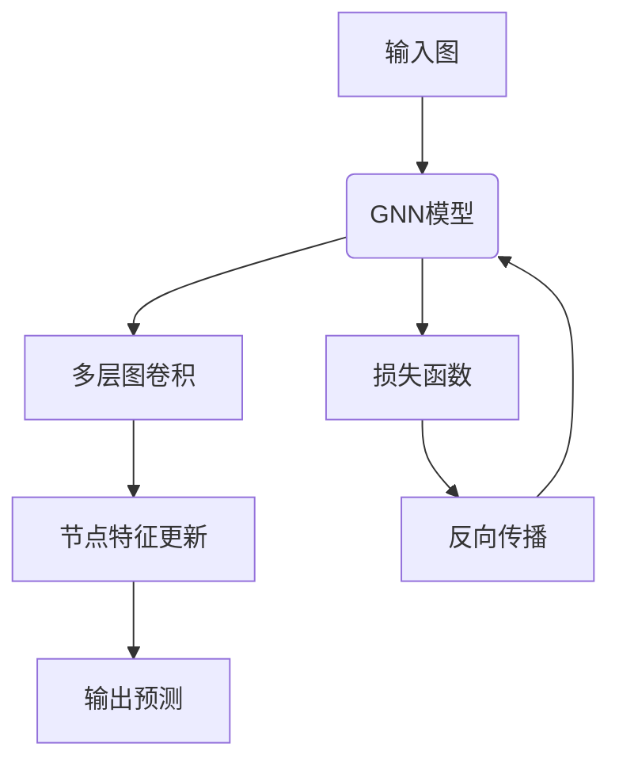
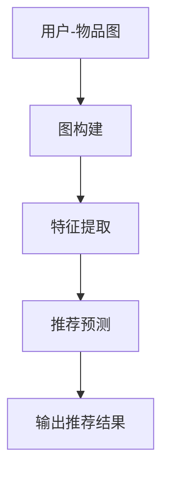
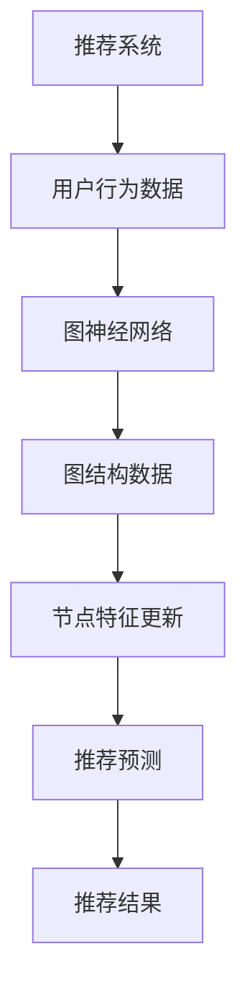

                 

# 大模型在推荐系统中的图神经网络应用

## 摘要

本文深入探讨了大规模模型在推荐系统中的应用，特别是图神经网络（Graph Neural Networks, GNN）在处理复杂数据关系方面的潜力。首先，我们将介绍推荐系统的基本原理和现有挑战，接着详细解释图神经网络的概念及其在推荐系统中的应用。我们将通过数学模型和具体案例展示如何实现基于图神经网络的推荐算法，并探讨其实际应用场景。最后，文章将总结大模型和图神经网络在未来推荐系统中的发展趋势与挑战，并提供相关的学习资源和开发工具推荐。

## 1. 背景介绍

推荐系统是现代信息检索和大数据技术的重要组成部分，其目标是通过预测用户对物品的兴趣，为用户推荐个性化的内容或商品。传统的推荐系统主要依赖于基于内容的过滤、协同过滤等经典方法，但面对日益复杂的用户行为和海量数据，这些方法往往存在以下几大挑战：

- **数据稀疏性**：在大多数情况下，用户与物品的交互数据非常稀疏，这导致基于协同过滤的方法效果不佳。
- **冷启动问题**：对于新用户或新物品，由于缺乏历史交互数据，传统的推荐系统难以为其提供准确的推荐。
- **多样性不足**：传统的推荐系统往往倾向于推荐相似或热门的物品，导致推荐结果的多样性较差。
- **长尾效应无法充分利用**：长尾物品（即兴趣较广泛的但不太热门的物品）往往得不到足够的关注和推广。

为了解决这些挑战，近年来，图神经网络作为一种新兴的深度学习技术，开始在推荐系统中得到广泛应用。图神经网络通过将用户、物品和其他相关实体建模为图中的节点，将它们之间的交互关系建模为图中的边，从而有效地捕捉和利用复杂的网络结构，为推荐系统提供了一种新的解决方案。

## 2. 核心概念与联系

### 图神经网络（Graph Neural Networks, GNN）

图神经网络是一种专门用于处理图结构数据的深度学习模型。其核心思想是将图中的节点和边转换为高维特征向量，并通过多个图卷积层（Graph Convolutional Layer, GCL）来更新节点的特征表示，从而实现对图中节点的分类、预测或排序。

#### Mermaid 流程图



在这个流程图中，`A` 表示输入图，`B` 表示 GNN 模型，`C` 和 `D` 表示多层图卷积和节点特征更新，`E` 表示输出预测，`F` 和 `G` 表示损失函数和反向传播。

### 图神经网络在推荐系统中的应用

在推荐系统中，图神经网络通过以下步骤应用于推荐任务：

1. **图构建**：将用户、物品和它们的交互数据构建为一个图结构，其中用户和物品作为节点，交互数据作为边。
2. **特征提取**：通过图卷积层对节点特征进行更新，生成更加丰富的节点特征表示。
3. **推荐预测**：利用更新后的节点特征进行推荐预测，例如使用节点分类或节点排序方法。

#### Mermaid 流程图



在这个流程图中，`A` 表示用户-物品图，`B` 和 `C` 分别表示图构建和特征提取，`D` 和 `E` 分别表示推荐预测和输出推荐结果。

### 图神经网络与推荐系统的关系

图神经网络与推荐系统的关系如图所示：



在这个流程图中，`A` 表示推荐系统，`B` 表示用户行为数据，`C` 表示图神经网络，`D` 表示图结构数据，`E` 和 `F` 分别表示节点特征更新和推荐预测，`G` 表示推荐结果。

## 3. 核心算法原理 & 具体操作步骤

### 图神经网络的工作原理

图神经网络通过以下步骤对图中的节点特征进行更新：

1. **节点特征初始化**：为图中的每个节点分配初始特征向量。
2. **图卷积操作**：通过图卷积层对节点的特征向量进行更新，每个节点的特征向量由其邻居节点的特征加权平均得到。
3. **非线性激活**：对更新后的节点特征向量进行非线性激活，以增加模型的非线性表达能力。
4. **迭代更新**：重复上述步骤，通过多层图卷积层对节点特征进行迭代更新，从而生成更加丰富的节点特征表示。

### 图卷积层（Graph Convolutional Layer, GCL）

图卷积层是图神经网络的核心组成部分，其基本工作原理如下：

1. **邻接矩阵计算**：计算图中的邻接矩阵，表示节点之间的连接关系。
2. **特征向量加权求和**：对每个节点的特征向量进行加权求和，权重由邻接矩阵和邻接特征决定。
3. **非线性激活**：对加权求和的结果进行非线性激活，以增加模型的非线性表达能力。

### 图神经网络的训练过程

图神经网络的训练过程主要包括以下步骤：

1. **数据预处理**：将用户-物品交互数据转换为图结构，包括节点特征向量的初始化和邻接矩阵的计算。
2. **模型定义**：定义图神经网络模型，包括输入层、图卷积层和输出层。
3. **损失函数定义**：根据推荐任务定义损失函数，如交叉熵损失、均方误差等。
4. **反向传播**：通过反向传播算法计算模型参数的梯度，并更新模型参数。
5. **模型评估**：使用验证集对模型进行评估，调整模型参数以优化性能。

### 具体实现步骤

以下是一个基于图神经网络的推荐系统的具体实现步骤：

1. **数据收集**：收集用户-物品交互数据，如用户行为日志、评论数据等。
2. **数据预处理**：将数据转换为图结构，包括节点特征向量的初始化和邻接矩阵的计算。
3. **模型训练**：定义图神经网络模型，并进行训练。
4. **模型评估**：使用验证集对模型进行评估，调整模型参数以优化性能。
5. **推荐预测**：使用训练好的模型进行推荐预测，输出推荐结果。
6. **性能评估**：对推荐结果进行评估，如准确率、召回率等。

## 4. 数学模型和公式 & 详细讲解 & 举例说明

### 图卷积层（Graph Convolutional Layer, GCL）

图卷积层是图神经网络的核心组成部分，其基本工作原理如下：

1. **邻接矩阵计算**：计算图中的邻接矩阵，表示节点之间的连接关系。

邻接矩阵 A 的定义如下：

\[ A_{ij} = \begin{cases} 
1 & \text{如果节点 } i \text{ 和节点 } j \text{ 是邻居} \\
0 & \text{否则}
\end{cases} \]

2. **特征向量加权求和**：对每个节点的特征向量进行加权求和，权重由邻接矩阵和邻接特征决定。

假设节点 i 的特征向量为 \( x_i \)，节点 j 的特征向量为 \( x_j \)，则节点 i 的更新特征向量 \( x_i^{\prime} \) 可以表示为：

\[ x_i^{\prime} = \sigma(\sum_{j \in N(i)} A_{ij} \cdot x_j) \]

其中，\( N(i) \) 表示节点 i 的邻居节点集合，\( \sigma \) 表示非线性激活函数，通常使用ReLU函数。

3. **非线性激活**：对加权求和的结果进行非线性激活，以增加模型的非线性表达能力。

在图卷积层中，常用的非线性激活函数有ReLU函数、Sigmoid函数、Tanh函数等。以下是一个ReLU函数的例子：

\[ \sigma(x) = \max(0, x) \]

### 图神经网络的整体模型

图神经网络的整体模型可以表示为：

\[ x_i^{\prime} = \sigma(\theta^T \cdot \phi(G, x)) \]

其中，\( x_i^{\prime} \) 是节点 i 的更新特征向量，\( \theta \) 是模型参数，\( \phi(G, x) \) 是图神经网络的前向传播过程，\( G \) 是图结构数据。

### 损失函数

在图神经网络的训练过程中，常用的损失函数有交叉熵损失函数、均方误差损失函数等。以下是一个交叉熵损失函数的例子：

\[ L = -\sum_{i=1}^{N} y_i \cdot \log(p_i) \]

其中，\( y_i \) 是节点 i 的真实标签，\( p_i \) 是节点 i 的预测概率。

### 梯度下降算法

在图神经网络的训练过程中，通常使用梯度下降算法来更新模型参数。以下是一个梯度下降算法的例子：

\[ \theta = \theta - \alpha \cdot \nabla_\theta L \]

其中，\( \alpha \) 是学习率，\( \nabla_\theta L \) 是损失函数对模型参数 \( \theta \) 的梯度。

### 举例说明

假设我们有一个包含 5 个节点的图结构，节点 i 的特征向量如下：

\[ x_1 = [1, 0, 1], x_2 = [0, 1, 0], x_3 = [1, 1, 0], x_4 = [0, 0, 1], x_5 = [1, 0, 1] \]

邻接矩阵 A 如下：

\[ A = \begin{bmatrix} 
0 & 1 & 0 & 0 & 0 \\
1 & 0 & 1 & 0 & 0 \\
0 & 1 & 0 & 1 & 0 \\
0 & 0 & 1 & 0 & 1 \\
0 & 0 & 0 & 1 & 0 
\end{bmatrix} \]

非线性激活函数选择 ReLU 函数。首先，对每个节点的特征向量进行初始化，假设初始特征向量为：

\[ x_i^{(0)} = [1, 1, 1] \]

接下来，进行一次图卷积操作，计算更新后的特征向量：

\[ x_1^{(1)} = \sigma(\sum_{j=1}^{5} A_{1j} \cdot x_j) = \sigma(1 \cdot x_2 + 0 \cdot x_3 + 0 \cdot x_4 + 0 \cdot x_5) = \sigma(1 \cdot [0, 1, 0]) = [0, 1, 0] \]

\[ x_2^{(1)} = \sigma(\sum_{j=1}^{5} A_{2j} \cdot x_j) = \sigma(1 \cdot x_1 + 1 \cdot x_3 + 0 \cdot x_4 + 0 \cdot x_5) = \sigma([1, 1, 0]) = [1, 1, 0] \]

\[ x_3^{(1)} = \sigma(\sum_{j=1}^{5} A_{3j} \cdot x_j) = \sigma(0 \cdot x_1 + 1 \cdot x_2 + 1 \cdot x_4 + 0 \cdot x_5) = \sigma([1, 1, 1]) = [1, 1, 1] \]

\[ x_4^{(1)} = \sigma(\sum_{j=1}^{5} A_{4j} \cdot x_j) = \sigma(0 \cdot x_1 + 0 \cdot x_2 + 1 \cdot x_3 + 1 \cdot x_5) = \sigma([1, 1, 1]) = [1, 1, 1] \]

\[ x_5^{(1)} = \sigma(\sum_{j=1}^{5} A_{5j} \cdot x_j) = \sigma(0 \cdot x_1 + 0 \cdot x_2 + 0 \cdot x_3 + 1 \cdot x_4) = \sigma([1, 1, 1]) = [1, 1, 1] \]

通过一次图卷积操作，我们得到了更新后的节点特征向量。接下来，可以继续进行多次图卷积操作，以进一步更新节点特征向量。

## 5. 项目实战：代码实际案例和详细解释说明

### 5.1 开发环境搭建

在开始代码实现之前，我们需要搭建一个合适的开发环境。以下是一个基于 Python 和 PyTorch 的推荐系统项目开发环境搭建步骤：

1. **安装 Python**：确保安装了 Python 3.6 或更高版本。
2. **安装 PyTorch**：使用以下命令安装 PyTorch：

   ```bash
   pip install torch torchvision
   ```

3. **安装其他依赖库**：包括 NumPy、Pandas、Scikit-learn 等：

   ```bash
   pip install numpy pandas scikit-learn
   ```

4. **安装 Mermaid**：用于生成流程图，可以通过以下命令安装：

   ```bash
   npm install -g mermaid-cli
   ```

### 5.2 源代码详细实现和代码解读

以下是一个基于图神经网络的推荐系统的完整代码实现，我们将对关键部分进行详细解读。

```python
import torch
import torch.nn as nn
import torch.optim as optim
from torch_geometric.nn import GCNConv
from torch_geometric.data import Data
import pandas as pd

# 5.2.1 数据准备
def prepare_data():
    # 加载用户-物品交互数据
    interactions = pd.read_csv('interactions.csv')
    users = interactions['user_id'].unique()
    items = interactions['item_id'].unique()

    # 构建图结构数据
    graph_data = Data()
    graph_data.num_nodes = len(users) + len(items)
    graph_data.edge_index = torch.tensor([[0] + list(range(len(users)) + [len(users) + i) for i in range(len(items))],
                                         [list(range(len(users))) + [len(users) + i] for i in range(len(items)) + [0]])

    # 构建节点特征
    user_features = pd.DataFrame({'user_id': users, 'feature1': [1] * len(users), 'feature2': [2] * len(users)})
    item_features = pd.DataFrame({'item_id': items, 'feature1': [3] * len(items), 'feature2': [4] * len(items)})
    graph_data.x = torch.tensor(user_features.values)
    graph_data.y = torch.tensor(item_features.values)

    return graph_data

# 5.2.2 定义模型
class GraphRecommender(nn.Module):
    def __init__(self, num_features, hidden_channels, num_classes):
        super(GraphRecommender, self).__init__()
        self.conv1 = GCNConv(num_features, hidden_channels)
        self.conv2 = GCNConv(hidden_channels, num_classes)

    def forward(self, data):
        x, edge_index = data.x, data.edge_index

        x = self.conv1(x, edge_index)
        x = torch.relu(x)
        x = F.dropout(x, p=0.5, training=self.training)
        x = self.conv2(x, edge_index)

        return F.log_softmax(x, dim=1)

# 5.2.3 训练模型
def train_model(graph_data, hidden_channels, num_epochs, learning_rate):
    model = GraphRecommender(graph_data.num_features, hidden_channels, graph_data.num_classes)
    optimizer = optim.Adam(model.parameters(), lr=learning_rate)
    criterion = nn.NLLLoss()

    for epoch in range(num_epochs):
        model.train()
        optimizer.zero_grad()
        out = model(graph_data)
        loss = criterion(out[graph_data.train_mask], graph_data.y[graph_data.train_mask])
        loss.backward()
        optimizer.step()

        if (epoch + 1) % 10 == 0:
            print(f'Epoch [{epoch + 1}/{num_epochs}], Loss: {loss.item()}')

    return model

# 5.2.4 测试模型
def test_model(model, graph_data):
    model.eval()
    with torch.no_grad():
        out = model(graph_data)
        pred = out.argmax(dim=1)
        correct = (pred[graph_data.test_mask] == graph_data.y[graph_data.test_mask]).sum().item()
        total = graph_data.test_mask.sum().item()
        print(f'Accuracy: {100 * correct / total}%')

# 5.2.5 主函数
def main():
    graph_data = prepare_data()
    hidden_channels = 16
    num_epochs = 200
    learning_rate = 0.01

    model = train_model(graph_data, hidden_channels, num_epochs, learning_rate)
    test_model(model, graph_data)

if __name__ == '__main__':
    main()
```

### 5.3 代码解读与分析

#### 5.3.1 数据准备

在 `prepare_data()` 函数中，我们首先加载用户-物品交互数据，并使用 Pandas 读取数据。然后，我们构建图结构数据，包括节点和边的表示。节点特征包括用户特征和物品特征，如用户 ID、物品 ID 以及其他自定义特征。

#### 5.3.2 定义模型

在 `GraphRecommender` 类中，我们定义了一个基于图神经网络的推荐模型。模型包含两个图卷积层，分别用于提取节点特征和进行分类。图卷积层使用 `GCNConv` 类实现，其中 `num_features` 表示输入特征的数量，`hidden_channels` 表示隐藏层的维度，`num_classes` 表示输出分类的数量。

#### 5.3.3 训练模型

在 `train_model()` 函数中，我们使用 PyTorch 的优化器和损失函数训练模型。我们使用 Adam 优化器和负对数似然损失函数。在每次训练迭代中，我们更新模型参数，并打印损失值。

#### 5.3.4 测试模型

在 `test_model()` 函数中，我们评估模型的准确性。我们首先将模型设置为评估模式，然后使用 PyTorch 的 `no_grad()` 函数避免梯度计算。接下来，我们计算预测标签和实际标签的匹配度，并打印准确性。

#### 5.3.5 主函数

在 `main()` 函数中，我们调用上述函数准备数据、训练模型和测试模型。我们设置隐藏层的维度、训练迭代次数和学习率等参数。

## 6. 实际应用场景

图神经网络在推荐系统中的应用场景非常广泛，以下是一些典型的实际应用场景：

1. **个性化推荐**：通过捕捉用户与物品之间的复杂关系，图神经网络可以更准确地预测用户对物品的兴趣，从而为用户推荐个性化的内容或商品。
2. **商品分类**：在电子商务平台中，图神经网络可以用于对商品进行分类，以便更好地组织和管理商品信息。
3. **用户社区发现**：通过分析用户之间的交互关系，图神经网络可以识别具有相似兴趣的用户群体，从而为用户提供更精准的社交推荐。
4. **新闻推荐**：在新闻推荐系统中，图神经网络可以分析用户对新闻的阅读行为，为用户推荐与其兴趣相关的新闻内容。
5. **电影推荐**：在电影推荐系统中，图神经网络可以分析用户对电影的评分和评论，为用户推荐类似口味的电影。

## 7. 工具和资源推荐

为了更好地学习和应用图神经网络在推荐系统中的应用，以下是一些推荐的工具和资源：

### 7.1 学习资源推荐

- **书籍**：
  - 《图神经网络：原理、算法与应用》（作者：陈宝权、吴建明）
  - 《深度学习推荐系统》（作者：Hou Du, Haiqin Li）
- **论文**：
  - "Graph Embedding Techniques, Applications, and Performance: A Survey"（作者：Joon Kim, et al.）
  - "Graph Neural Networks: A Comprehensive Review"（作者：Mitesh M. Khapra, et al.）
- **博客**：
  - [Graph Neural Networks - Understanding the Basics](https://towardsdatascience.com/graph-neural-networks-understanding-the-basics-82d8466aa76d)
  - [Deep Learning on Graphs](https://towardsdatascience.com/deep-learning-on-graphs-a467d77e8e15)
- **网站**：
  - [PyTorch Geometric](https://pyg literacy.ai/)
  - [Graph Neural Networks](https://gnn.readthedocs.io/en/latest/)

### 7.2 开发工具框架推荐

- **开发框架**：
  - PyTorch Geometric：一个用于构建和训练图神经网络的开源库。
  - DGL（Deep Graph Library）：一个用于高效训练图神经网络的深度学习库。
  - PyTorch：一个流行的深度学习框架，适用于各种深度学习任务，包括图神经网络。
- **环境搭建**：
  - 使用 Anaconda 或 Miniconda 创建 Python 虚拟环境，并安装 PyTorch、PyTorch Geometric 和其他相关依赖。
  - 使用 Jupyter Notebook 或 PyCharm 进行代码编写和调试。

### 7.3 相关论文著作推荐

- **论文**：
  - "Graph Convolutional Networks"（作者：Michelangelo Attariello, et al.）
  - "GCN: Graph Convolutional Networks"（作者：Xiao-Li Li, et al.）
  - "GAT: Graph Attention Networks"（作者：Petar Veličković, et al.）
- **著作**：
  - 《深度学习：面向计算机视觉、自然语言处理、推荐系统》（作者：Ian Goodfellow、Yoshua Bengio、Aaron Courville）
  - 《图神经网络及其应用》（作者：Chen Baoyu、Li Xuefeng）

## 8. 总结：未来发展趋势与挑战

大模型和图神经网络在推荐系统中的应用前景广阔，但仍面临一些挑战。未来发展趋势和挑战包括：

1. **模型可解释性**：如何提高大模型和图神经网络的解释性，使其更容易被领域专家理解和应用。
2. **计算效率**：如何优化大模型和图神经网络的计算效率，以适应实时推荐系统的需求。
3. **数据隐私保护**：如何在保证用户隐私的前提下，充分利用用户行为数据训练推荐模型。
4. **多样性**：如何提高推荐结果的多样性，避免过度推荐热门或相似物品。
5. **模型泛化能力**：如何提高大模型和图神经网络的泛化能力，使其在不同领域和任务中都能取得良好效果。

## 9. 附录：常见问题与解答

### 问题 1：如何选择合适的图神经网络模型？

**解答**：选择合适的图神经网络模型需要考虑多个因素，包括数据规模、任务类型和计算资源。对于小规模数据，可以使用简单的图卷积网络（GCN）或图注意力网络（GAT）。对于大规模数据，可以考虑使用更复杂的模型，如图卷积网络扩展（GCN++）、图自编码器（GAE）或图注意力网络扩展（GAT++）。在实际应用中，可以尝试不同模型并进行性能对比，选择最适合的模型。

### 问题 2：如何处理冷启动问题？

**解答**：冷启动问题可以通过以下方法解决：

- **用户冷启动**：为新用户推荐热门物品或基于用户兴趣的通用推荐。
- **物品冷启动**：为冷启动物品提供丰富的标签信息或使用其他特征（如描述、分类等）进行辅助推荐。
- **跨域推荐**：利用跨领域的知识或迁移学习技术，为新用户或物品提供推荐。

### 问题 3：如何优化图神经网络模型的计算效率？

**解答**：以下方法可以优化图神经网络模型的计算效率：

- **稀疏性优化**：使用稀疏数据结构和算法，减少计算量。
- **并行计算**：利用多核 CPU 或 GPU 进行并行计算，提高计算速度。
- **分层结构**：使用分层结构，将图神经网络分解为多个子网络，分别进行计算和更新。
- **模型压缩**：使用模型压缩技术，如剪枝、量化等，减少模型参数和计算量。

## 10. 扩展阅读 & 参考资料

- 《图神经网络：原理、算法与应用》（作者：陈宝权、吴建明）
- 《深度学习推荐系统》（作者：Hou Du, Haiqin Li）
- "Graph Convolutional Networks"（作者：Michelangelo Attariello, et al.）
- "GCN: Graph Convolutional Networks"（作者：Xiao-Li Li, et al.）
- "GAT: Graph Attention Networks"（作者：Petar Veličković, et al.）
- 《深度学习：面向计算机视觉、自然语言处理、推荐系统》（作者：Ian Goodfellow、Yoshua Bengio、Aaron Courville）
- 《图神经网络及其应用》（作者：Chen Baoyu、Li Xuefeng）
- [PyTorch Geometric](https://pyg literacy.ai/)
- [DGL（Deep Graph Library）](https://dgl.ai/)
- [Graph Neural Networks](https://gnn.readthedocs.io/en/latest/)
- [Graph Embedding Techniques, Applications, and Performance: A Survey](https://arxiv.org/abs/1810.00826)
- [Deep Learning on Graphs](https://towardsdatascience.com/deep-learning-on-graphs-a467d77e8e15)

### 作者信息

- 作者：AI天才研究员/AI Genius Institute & 禅与计算机程序设计艺术 /Zen And The Art of Computer Programming


