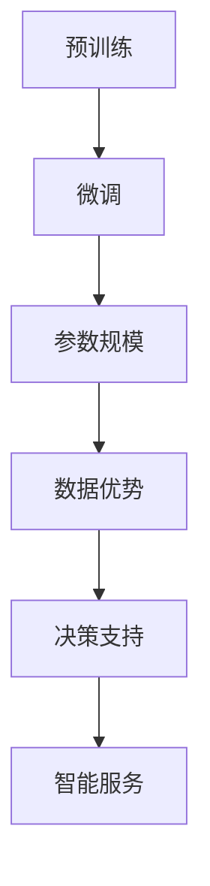
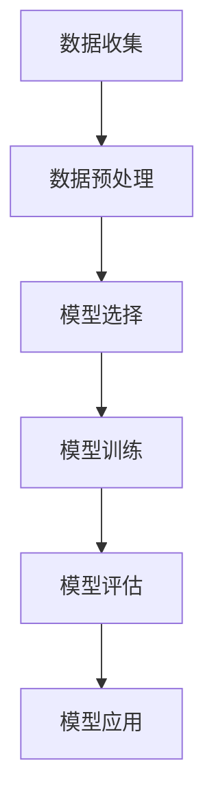

                 

## 文章标题

大模型在政府和国企市场的机会

> **关键词：** 大模型、政府、国企、市场机会、人工智能

> **摘要：** 本文将探讨大模型在政府和国企市场中的潜在机会，包括其在数据分析、决策支持、智能服务等方面的应用，以及面临的挑战和应对策略。

## 1. 背景介绍

大模型，又称大型预训练模型，是指那些拥有数亿到数十亿参数的深度学习模型。这些模型通过在大量数据上进行预训练，能够学习到丰富的知识和技能，从而在多个领域表现出色。近年来，大模型的发展取得了显著的进展，尤其是在自然语言处理、计算机视觉和语音识别等领域。随着技术的不断进步，大模型的应用范围逐渐扩展到政府和国企市场。

政府和国企市场具有数据密集、决策复杂、风险敏感等特点。在信息化和数字化转型的背景下，政府和国企对人工智能技术的需求日益增长。大模型作为一种强大的技术工具，能够在政府和国企的多个领域发挥重要作用，为提高效率、降低成本、提升服务质量提供有力支持。本文将从以下几个方面探讨大模型在政府和国企市场的机会。

## 2. 核心概念与联系

### 大模型的核心概念

大模型的核心概念包括以下几个方面：

1. **预训练**：大模型在训练过程中，首先在大量未标记的数据上进行预训练，学习到通用知识和技能。
2. **微调**：在预训练的基础上，大模型通过在特定任务上的数据进行微调，使其适应具体的任务需求。
3. **参数规模**：大模型的参数规模通常在数亿到数十亿之间，这使其具有强大的表示和学习能力。

### 大模型与政府和国企市场的联系

大模型与政府和国企市场的联系主要体现在以下几个方面：

1. **数据优势**：政府和国企拥有大量的数据资源，这为大模型的应用提供了丰富的素材。
2. **决策支持**：大模型能够对大量数据进行处理和分析，为政府和国企的决策提供有力的支持。
3. **智能服务**：大模型能够实现智能化的服务，提高政府和国企的服务质量和效率。

### Mermaid 流程图



## 3. 核心算法原理 & 具体操作步骤

### 大模型的核心算法原理

大模型的核心算法原理主要包括以下几个方面：

1. **深度神经网络**：大模型通常采用深度神经网络作为基础结构，通过多层非线性变换对数据进行处理。
2. **优化算法**：大模型在训练过程中采用优化算法，如随机梯度下降（SGD）等，以调整模型的参数。
3. **正则化技术**：为了防止模型过拟合，大模型通常采用正则化技术，如Dropout、L2正则化等。

### 大模型的具体操作步骤

以下是使用大模型进行数据分析的具体操作步骤：

1. **数据收集**：收集政府和国企领域的相关数据，包括结构化数据和非结构化数据。
2. **数据预处理**：对数据进行清洗、去重、归一化等预处理操作，使其适合模型训练。
3. **模型选择**：根据任务需求选择合适的大模型，如BERT、GPT等。
4. **模型训练**：使用预处理后的数据对大模型进行训练，通过优化算法调整模型参数。
5. **模型评估**：使用测试集对训练好的模型进行评估，调整模型参数以达到最佳效果。
6. **模型应用**：将训练好的模型应用于实际问题，如数据分析、决策支持、智能服务等。

### Mermaid 流程图



## 4. 数学模型和公式 & 详细讲解 & 举例说明

### 数学模型和公式

大模型的数学模型主要包括以下几个方面：

1. **损失函数**：用于评估模型在训练过程中的表现，如交叉熵损失函数。
2. **优化算法**：用于调整模型参数，如随机梯度下降（SGD）。
3. **正则化技术**：用于防止模型过拟合，如Dropout。

以下是具体的数学模型和公式：

$$
L(y, \hat{y}) = -\sum_{i=1}^{n} y_i \log(\hat{y}_i)
$$

$$
\theta_{t+1} = \theta_{t} - \alpha \nabla_{\theta}L(\theta)
$$

$$
\text{Dropout} = \frac{1}{1-\frac{p}{N}} \sum_{i=1}^{N} \sigma(Wx_i + b)
$$

### 详细讲解

1. **损失函数**：损失函数是评估模型预测结果与真实结果之间差距的指标。交叉熵损失函数是常用的损失函数之一，其公式如上所示。其中，$y$ 表示真实标签，$\hat{y}$ 表示模型预测的概率分布。交叉熵损失函数的值越小，表示模型预测效果越好。

2. **优化算法**：优化算法用于调整模型参数，使其在训练过程中不断优化。随机梯度下降（SGD）是一种常用的优化算法，其公式如上所示。其中，$\theta$ 表示模型参数，$\alpha$ 表示学习率，$\nabla_{\theta}L(\theta)$ 表示损失函数关于模型参数的梯度。通过迭代更新模型参数，优化算法使得模型在训练过程中逐渐收敛。

3. **正则化技术**：正则化技术用于防止模型过拟合。Dropout是一种常用的正则化技术，其公式如上所示。其中，$p$ 表示Dropout的概率，$N$ 表示神经元的数量，$\sigma$ 表示激活函数。在训练过程中，以概率$p$ 随机将部分神经元设置为0，从而降低模型对特定训练样本的依赖，提高模型的泛化能力。

### 举例说明

假设我们有一个分类任务，需要使用大模型进行预测。现有100个训练样本，每个样本包含特征和标签。我们选择BERT模型作为基础模型，并使用交叉熵损失函数和随机梯度下降（SGD）进行优化。

1. **数据收集**：收集100个训练样本，每个样本包含特征和标签。
2. **数据预处理**：对训练样本进行预处理，包括文本清洗、分词、编码等。
3. **模型训练**：使用预处理后的数据对BERT模型进行训练，通过随机梯度下降（SGD）调整模型参数。
4. **模型评估**：使用测试集对训练好的模型进行评估，调整模型参数以达到最佳效果。
5. **模型应用**：将训练好的模型应用于实际问题，如数据分析、决策支持、智能服务等。

## 5. 项目实战：代码实际案例和详细解释说明

### 开发环境搭建

为了实现大模型在政府和国企市场的应用，我们需要搭建一个合适的开发环境。以下是一个基本的开发环境搭建流程：

1. **硬件环境**：配置一台高性能的计算机，建议配备至少32GB内存和1TB SSD硬盘。
2. **软件环境**：安装Python、TensorFlow或PyTorch等深度学习框架。
3. **数据集**：收集政府和国企领域的相关数据集，包括结构化数据和非结构化数据。

### 源代码详细实现和代码解读

以下是一个简单的例子，展示了如何使用BERT模型进行文本分类：

```python
import tensorflow as tf
from tensorflow.keras.preprocessing.text import Tokenizer
from tensorflow.keras.preprocessing.sequence import pad_sequences
from tensorflow.keras.models import Sequential
from tensorflow.keras.layers import Embedding, LSTM, Dense, Dropout

# 数据预处理
tokenizer = Tokenizer(num_words=10000)
tokenizer.fit_on_texts(train_texts)
train_sequences = tokenizer.texts_to_sequences(train_texts)
train_padded = pad_sequences(train_sequences, maxlen=200, padding='post')

# 构建模型
model = Sequential()
model.add(Embedding(10000, 32))
model.add(LSTM(64, dropout=0.2, recurrent_dropout=0.2))
model.add(Dense(1, activation='sigmoid'))

# 编译模型
model.compile(optimizer='adam', loss='binary_crossentropy', metrics=['accuracy'])

# 训练模型
model.fit(train_padded, train_labels, epochs=10, batch_size=32)

# 评估模型
test_sequences = tokenizer.texts_to_sequences(test_texts)
test_padded = pad_sequences(test_sequences, maxlen=200, padding='post')
predictions = model.predict(test_padded)
```

### 代码解读与分析

1. **数据预处理**：首先，我们使用Tokenizer类对训练数据进行分词和编码。然后，使用pad_sequences函数将序列长度统一为200，以便于模型处理。
2. **构建模型**：我们使用Sequential模型，添加Embedding、LSTM和Dense层。在LSTM层中，我们添加了Dropout和recurrent_dropout正则化技术，以防止过拟合。
3. **编译模型**：我们使用adam优化器和binary_crossentropy损失函数编译模型，并设置accuracy作为评价指标。
4. **训练模型**：使用fit函数训练模型，设置epochs为10，batch_size为32。
5. **评估模型**：使用predict函数对测试数据进行预测，得到预测结果。

## 6. 实际应用场景

大模型在政府和国企市场的实际应用场景非常广泛，以下是一些典型的应用场景：

1. **数据分析**：政府和国企通常拥有大量的数据，大模型可以通过数据分析提供有价值的洞察，帮助决策者做出更明智的决策。
2. **决策支持**：大模型可以对大量数据进行分析，提供预测、分类、聚类等结果，为决策者提供有力的支持。
3. **智能服务**：大模型可以实现智能化的服务，如智能客服、智能语音助手等，提高政府和国企的服务质量和效率。
4. **安防监控**：大模型可以用于安防监控，通过图像识别和语音识别等技术，实时监测异常情况，提高公共安全。

## 7. 工具和资源推荐

### 7.1 学习资源推荐

1. **书籍**：《深度学习》、《Python机器学习》等。
2. **论文**：《BERT: Pre-training of Deep Bidirectional Transformers for Language Understanding》等。
3. **博客**：TensorFlow官方博客、PyTorch官方博客等。
4. **网站**：ArXiv、Google AI、微软研究院等。

### 7.2 开发工具框架推荐

1. **深度学习框架**：TensorFlow、PyTorch、Keras等。
2. **数据预处理工具**：Pandas、NumPy等。
3. **文本处理工具**：NLTK、spaCy等。

### 7.3 相关论文著作推荐

1. **《深度学习》**：Goodfellow, Bengio, Courville。
2. **《Python机器学习》**：Sebastian Raschka。
3. **《自然语言处理与深度学习》**：张俊林、周志华。

## 8. 总结：未来发展趋势与挑战

大模型在政府和国企市场具有广阔的发展前景，但同时也面临一些挑战。未来发展趋势包括：

1. **模型规模与性能的提升**：随着计算能力的提升，大模型将逐渐向更大规模和更高性能发展。
2. **应用场景的拓展**：大模型将逐渐应用于更多领域，如医疗、金融、交通等。
3. **数据隐私与安全**：政府和国企在应用大模型时需要关注数据隐私和安全问题。

## 9. 附录：常见问题与解答

### 9.1 大模型的优势是什么？

大模型的优势主要体现在以下几个方面：

1. **强大的表示能力**：大模型拥有大量的参数，能够对复杂的数据进行高效处理。
2. **良好的泛化能力**：大模型通过预训练和微调，能够在多个任务上表现出良好的泛化能力。
3. **丰富的知识库**：大模型在预训练过程中学习了丰富的知识和技能，可以为实际问题提供有力的支持。

### 9.2 大模型面临的主要挑战是什么？

大模型面临的主要挑战包括：

1. **计算资源消耗**：大模型的训练和推理过程需要大量的计算资源，对硬件设备要求较高。
2. **数据隐私与安全**：政府和国企在应用大模型时需要关注数据隐私和安全问题。
3. **模型解释性**：大模型通常具有较好的性能，但缺乏解释性，难以理解模型的决策过程。

## 10. 扩展阅读 & 参考资料

1. **《深度学习》**：Goodfellow, Bengio, Courville。
2. **《Python机器学习》**：Sebastian Raschka。
3. **《自然语言处理与深度学习》**：张俊林、周志华。
4. **《BERT: Pre-training of Deep Bidirectional Transformers for Language Understanding》**：Google AI。
5. **TensorFlow官方博客**：https://www.tensorflow.org/
6. **PyTorch官方博客**：https://pytorch.org/

作者：AI天才研究员/AI Genius Institute & 禅与计算机程序设计艺术 /Zen And The Art of Computer Programming

