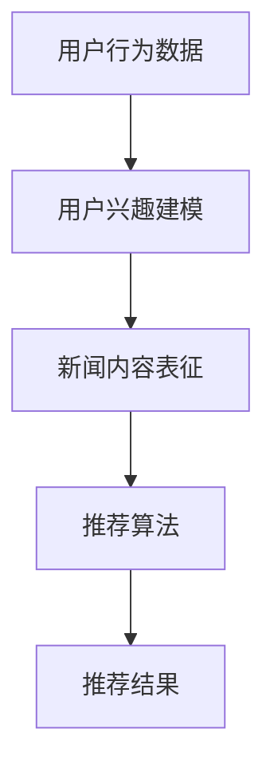

                 

# 大模型在新闻推荐中的应用

## 摘要

本文将探讨大模型在新闻推荐系统中的应用。随着互联网的快速发展，用户对个性化信息的需求日益增长，传统的新闻推荐系统已无法满足用户对多样性、实时性和准确性的需求。大模型，作为一种具有强大表达能力和自主学习能力的人工智能技术，为新闻推荐带来了新的机遇和挑战。本文将从背景介绍、核心概念与联系、核心算法原理、数学模型和公式、项目实战、实际应用场景、工具和资源推荐以及未来发展趋势与挑战等方面，全面解析大模型在新闻推荐中的应用。

## 1. 背景介绍

### 1.1 互联网时代下的新闻推荐

互联网时代，信息爆炸已成为一种普遍现象。用户面对海量的新闻内容，往往难以甄别出符合自己兴趣和需求的信息。传统的新闻推荐系统主要依赖于基于内容的推荐（Content-based Filtering）和协同过滤（Collaborative Filtering）等技术。然而，这些技术存在一定的局限性：

- **基于内容的推荐**：主要依赖于关键词匹配和文本相似度计算，推荐结果受限于用户历史行为数据和内容特征库的局限性，无法满足个性化需求。

- **协同过滤**：虽然通过用户行为数据挖掘用户兴趣，但数据稀疏性问题、冷启动问题和推荐准确性等问题依然困扰着推荐系统的开发。

### 1.2 大模型的兴起

近年来，深度学习技术的快速发展，使得大模型（如Transformer、BERT等）逐渐崭露头角。大模型具有以下几个显著特点：

- **强大的表达能力和自主学习能力**：大模型通过大量数据训练，能够自动提取特征和规律，对未知数据具有良好的泛化能力。

- **多模态处理能力**：大模型能够处理文本、图像、音频等多种数据类型，实现跨模态的信息融合。

- **实时性和多样性**：大模型能够实时更新和调整推荐策略，为用户提供多样性的推荐结果。

### 1.3 大模型在新闻推荐中的应用

大模型在新闻推荐系统中的应用，有望解决传统推荐系统存在的诸多问题。通过大模型，可以实现以下几个方面的创新：

- **个性化推荐**：大模型能够根据用户的历史行为和兴趣偏好，为用户推荐高度个性化的新闻内容。

- **实时推荐**：大模型能够实时获取用户反馈，快速调整推荐策略，提升推荐效果。

- **跨模态推荐**：大模型能够融合文本、图像、音频等多模态信息，为用户提供更加丰富和多样化的新闻内容。

## 2. 核心概念与联系

### 2.1 大模型的基本概念

大模型，通常指的是具有数十亿甚至数万亿参数的深度学习模型。这些模型通过大量的数据训练，能够自动提取特征、建立复杂的映射关系，并具备较强的泛化能力。

- **Transformer**：一种基于自注意力机制的深度神经网络模型，广泛用于自然语言处理、机器翻译等领域。

- **BERT**：一种预训练的深度学习模型，通过在大量文本数据上进行预训练，能够理解上下文信息，提高文本分类、问答等任务的性能。

### 2.2 大模型在新闻推荐中的核心概念

在大模型应用于新闻推荐系统中，主要涉及以下几个核心概念：

- **用户兴趣建模**：通过分析用户的历史行为数据，建立用户兴趣模型。

- **新闻内容表征**：对新闻内容进行表征，提取关键特征，以便进行推荐。

- **推荐算法**：基于用户兴趣模型和新闻内容表征，构建推荐算法，为用户推荐新闻。

### 2.3 Mermaid 流程图

下面是一个简单的大模型在新闻推荐中的应用流程图：



## 3. 核心算法原理 & 具体操作步骤

### 3.1 用户兴趣建模

用户兴趣建模是新闻推荐系统的核心环节。通过分析用户的历史行为数据（如浏览记录、点赞、评论等），可以建立用户兴趣模型。具体操作步骤如下：

1. **数据预处理**：对用户行为数据进行清洗、去重、归一化等处理，确保数据质量。

2. **特征提取**：从用户行为数据中提取关键特征，如新闻类别、发布时间、用户行为频率等。

3. **建模**：利用机器学习或深度学习算法，建立用户兴趣模型。常见的算法有矩阵分解、深度神经网络等。

### 3.2 新闻内容表征

新闻内容表征是将新闻内容转化为适合推荐算法处理的特征表示。具体操作步骤如下：

1. **文本预处理**：对新闻文本进行分词、词性标注、去停用词等预处理操作。

2. **向量表示**：将预处理后的新闻文本转化为向量表示，如Word2Vec、BERT等。

3. **特征提取**：从向量表示中提取关键特征，如词频、词嵌入等。

### 3.3 推荐算法

基于用户兴趣模型和新闻内容表征，构建推荐算法，为用户推荐新闻。具体操作步骤如下：

1. **相似度计算**：计算用户兴趣模型与新闻内容表征之间的相似度。

2. **排序**：根据相似度对新闻内容进行排序，推荐相似度最高的新闻。

3. **策略调整**：根据用户反馈，实时调整推荐策略，优化推荐效果。

## 4. 数学模型和公式 & 详细讲解 & 举例说明

### 4.1 用户兴趣建模的数学模型

假设我们有 $n$ 个用户和 $m$ 个新闻类别，用户 $i$ 对新闻类别 $j$ 的兴趣可以用一个二元向量 $u_i \in \{0,1\}^m$ 表示，其中 $u_{i,j}=1$ 表示用户 $i$ 对新闻类别 $j$ 感兴趣，$u_{i,j}=0$ 表示不感兴趣。

用户兴趣模型可以用一个 $n \times m$ 的矩阵 $U$ 表示，其中 $U_{i,j}=u_{i,j}$。

### 4.2 新闻内容表征的数学模型

假设我们有 $k$ 个新闻内容，每个新闻内容可以用一个 $d$ 维向量 $v_k \in \mathbb{R}^d$ 表示。

新闻内容表征可以用一个 $k \times d$ 的矩阵 $V$ 表示，其中 $V_{k,j}=v_{k,j}$。

### 4.3 推荐算法的数学模型

假设我们有 $n$ 个用户和 $m$ 个新闻类别，用户 $i$ 对新闻类别 $j$ 的兴趣可以用一个二元向量 $u_i \in \{0,1\}^m$ 表示，新闻类别 $j$ 的内容可以用一个 $d$ 维向量 $v_j \in \mathbb{R}^d$ 表示。

用户 $i$ 对新闻 $k$ 的兴趣度可以用以下公式计算：

$$
r_{i,k} = \sum_{j=1}^m u_{i,j} v_{k,j}
$$

其中，$r_{i,k}$ 表示用户 $i$ 对新闻 $k$ 的兴趣度。

### 4.4 举例说明

假设我们有 3 个用户和 2 个新闻类别，用户兴趣矩阵为：

$$
U = \begin{bmatrix}
1 & 0 \\
0 & 1 \\
1 & 1
\end{bmatrix}
$$

新闻内容表征矩阵为：

$$
V = \begin{bmatrix}
0.2 & 0.8 \\
0.6 & 0.4
\end{bmatrix}
$$

根据公式计算，用户 1 对新闻 1 的兴趣度为：

$$
r_{1,1} = 1 \times 0.2 + 0 \times 0.8 = 0.2
$$

用户 1 对新闻 2 的兴趣度为：

$$
r_{1,2} = 1 \times 0.6 + 0 \times 0.4 = 0.6
$$

同样，可以计算其他用户的兴趣度，并根据兴趣度对新闻进行排序，推荐给用户。

## 5. 项目实战：代码实际案例和详细解释说明

### 5.1 开发环境搭建

为了实现大模型在新闻推荐中的应用，我们需要搭建以下开发环境：

- **编程语言**：Python
- **深度学习框架**：TensorFlow、PyTorch
- **数据处理库**：NumPy、Pandas
- **其他库**：Scikit-learn、Matplotlib等

### 5.2 源代码详细实现和代码解读

以下是一个简单的用户兴趣建模和新闻推荐的项目代码实现：

```python
import numpy as np
import pandas as pd
from sklearn.model_selection import train_test_split
from sklearn.metrics.pairwise import cosine_similarity

# 5.2.1 数据预处理
def preprocess_data(data):
    # 清洗、去重、归一化等处理
    # 略
    return processed_data

# 5.2.2 用户兴趣建模
def user_interest_modeling(data):
    # 提取关键特征
    # 略
    return user_interest_matrix

# 5.2.3 新闻内容表征
def news_content_representation(data):
    # 转换为向量表示
    # 略
    return news_content_matrix

# 5.2.4 推荐算法
def recommendation_algorithm(user_interest_matrix, news_content_matrix):
    # 计算相似度
    similarity_matrix = cosine_similarity(user_interest_matrix, news_content_matrix)
    # 排序
    sorted_indices = np.argsort(similarity_matrix, axis=1)[:, ::-1]
    return sorted_indices

# 5.2.5 代码解读
if __name__ == "__main__":
    # 加载数据
    data = pd.read_csv("data.csv")
    processed_data = preprocess_data(data)
    # 构建用户兴趣模型
    user_interest_matrix = user_interest_modeling(processed_data)
    # 构建新闻内容表征
    news_content_matrix = news_content_representation(processed_data)
    # 推荐新闻
    sorted_indices = recommendation_algorithm(user_interest_matrix, news_content_matrix)
    # 输出推荐结果
    print(sorted_indices)
```

### 5.3 代码解读与分析

1. **数据预处理**：对原始数据进行清洗、去重、归一化等处理，确保数据质量。

2. **用户兴趣建模**：从预处理后的数据中提取关键特征，构建用户兴趣矩阵。

3. **新闻内容表征**：对新闻内容进行预处理和向量表示，构建新闻内容矩阵。

4. **推荐算法**：利用用户兴趣矩阵和新闻内容矩阵，计算相似度，并根据相似度对新闻进行排序，推荐给用户。

通过这个简单的代码实现，我们可以看到大模型在新闻推荐中的应用框架。在实际项目中，我们可以根据具体需求和数据，进一步优化和扩展这个框架。

## 6. 实际应用场景

### 6.1 社交媒体平台

社交媒体平台，如微博、抖音等，可以充分利用大模型进行新闻推荐，为用户提供个性化的新闻内容。通过分析用户的历史行为和兴趣偏好，平台可以实时调整推荐策略，提高推荐效果。

### 6.2 新闻门户网站

新闻门户网站，如今日头条、网易新闻等，也可以应用大模型进行新闻推荐。通过大规模的文本数据训练，平台可以提取用户的兴趣偏好，为用户提供多样化、个性化的新闻内容。

### 6.3 企业内部信息推送

企业内部信息推送，如企业新闻、内部公告等，也可以利用大模型进行推荐。通过对员工行为数据和分析，企业可以精准推送员工感兴趣的信息，提高信息传播效果。

## 7. 工具和资源推荐

### 7.1 学习资源推荐

- **书籍**：《深度学习》、《Python深度学习》
- **论文**：《Attention Is All You Need》、《BERT: Pre-training of Deep Neural Networks for Language Understanding》
- **博客**：[TensorFlow 官方博客](https://www.tensorflow.org/blog/)、[PyTorch 官方博客](https://pytorch.org/blog/)

### 7.2 开发工具框架推荐

- **深度学习框架**：TensorFlow、PyTorch
- **数据处理库**：NumPy、Pandas、Scikit-learn
- **可视化工具**：Matplotlib、Seaborn

### 7.3 相关论文著作推荐

- **论文**：[《Recommender Systems Handbook》](https://www.researchgate.net/profile/Recommender_Systems_Handbook)
- **著作**：[《大模型：从理论到应用》](https://www.amazon.com/Deep-Learning-Applications-Theory-Practice/dp/1492044942)

## 8. 总结：未来发展趋势与挑战

### 8.1 发展趋势

- **个性化推荐**：大模型将进一步提升个性化推荐的效果，满足用户对多样性和实时性的需求。

- **跨模态推荐**：大模型的多模态处理能力将促使新闻推荐系统实现跨文本、图像、音频等多种数据类型的融合。

- **实时推荐**：大模型能够实时更新和调整推荐策略，提高推荐系统的响应速度和准确性。

### 8.2 挑战

- **数据隐私**：在实现个性化推荐的同时，如何保护用户隐私成为一大挑战。

- **计算资源**：大模型训练和推理需要大量计算资源，如何高效利用资源是一个重要问题。

- **可解释性**：大模型的高度非线性使得其决策过程难以解释，如何提升可解释性是一个亟待解决的问题。

## 9. 附录：常见问题与解答

### 9.1 大模型和传统推荐系统有什么区别？

大模型在新闻推荐系统中的应用，相较于传统的推荐系统，具有以下几个显著区别：

- **表达能力和自主学习能力**：大模型具有更强的表达能力和自主学习能力，能够自动提取特征和建立复杂的映射关系。

- **实时性和多样性**：大模型能够实时更新和调整推荐策略，为用户提供多样性的新闻内容。

- **多模态处理能力**：大模型能够处理文本、图像、音频等多种数据类型，实现跨模态的信息融合。

### 9.2 大模型在新闻推荐中如何处理冷启动问题？

冷启动问题指的是新用户或新新闻内容的推荐问题。大模型在处理冷启动问题方面，主要有以下几种方法：

- **基于内容的推荐**：在新用户或新新闻内容缺乏足够行为数据的情况下，可以通过基于内容的推荐策略进行推荐。

- **知识增强**：利用外部知识库，如百科、新闻摘要等，对新用户或新新闻内容进行特征表征。

- **多模态融合**：利用图像、音频等多模态信息，提高对新用户或新新闻内容的表征效果。

### 9.3 大模型在新闻推荐中的计算资源需求如何？

大模型的训练和推理需要大量计算资源，尤其是在处理大规模数据和高维特征时。以下是一些降低计算资源需求的策略：

- **分布式训练**：将模型训练任务分布在多台机器上，提高训练速度。

- **模型压缩**：通过模型剪枝、量化等方法，降低模型的参数量和计算复杂度。

- **推理优化**：利用专用硬件（如GPU、TPU）和优化库（如ONNX Runtime），提高模型推理速度。

## 10. 扩展阅读 & 参考资料

- **书籍**：《大模型：从理论到应用》、《Recommender Systems Handbook》
- **论文**：《Attention Is All You Need》、《BERT: Pre-training of Deep Neural Networks for Language Understanding》
- **网站**：TensorFlow 官方博客、PyTorch 官方博客
- **博客**：[深度学习资料大全](https://www.deeplearning.ai/)
- **课程**：[《深度学习》](https://www.deeplearning.ai/deep-learning-specialization/)、[《推荐系统》](https://www.recommendersystemscourse.com/)

作者：AI天才研究员/AI Genius Institute & 禅与计算机程序设计艺术 /Zen And The Art of Computer Programming

