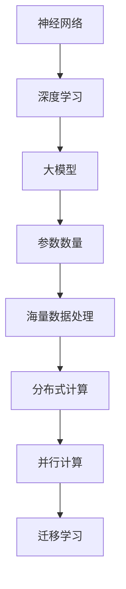
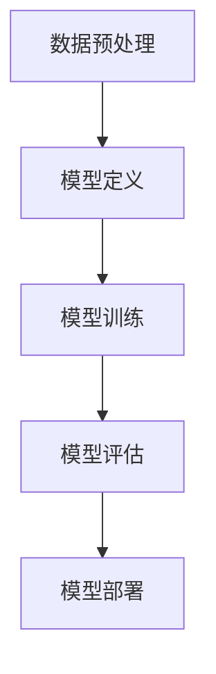

                 

# 大模型在新领域应用的探索

## 摘要

本文旨在探讨大模型在新领域应用的前景与挑战。随着人工智能技术的飞速发展，大模型以其强大的计算能力和自学习能力，正在成为推动各行各业创新的关键力量。本文将深入剖析大模型的原理、应用场景、以及面临的技术难题，旨在为读者提供一个全面的视野，以应对未来人工智能领域的变革。

## 1. 背景介绍

在过去的几十年里，人工智能（AI）技术经历了从规则推理到机器学习，再到深度学习的演变。特别是在深度学习领域，随着计算能力的提升和海量数据的积累，大模型应运而生。大模型，顾名思义，是指参数数量极其庞大的神经网络模型，它们可以捕捉到数据中的复杂模式和潜在规律。

大模型的出现，使得机器学习算法在图像识别、自然语言处理、语音识别等领域取得了显著的突破。例如，谷歌的Transformer模型在机器翻译、文本生成等任务上表现出色；OpenAI的GPT系列模型在文本生成和对话系统上展现出了令人惊叹的能力。这些成功案例表明，大模型正在成为人工智能领域的重要趋势。

然而，大模型的应用并不仅限于传统的计算机视觉和自然语言处理领域。随着技术的不断进步，大模型开始向更多的新领域拓展，如生物信息学、金融分析、医疗诊断等。这些新领域具有数据复杂度高、模式难以预测等特点，传统的算法难以胜任，而大模型的强大计算能力和自学习能力，使得它们在这些领域具有巨大的潜力。

## 2. 核心概念与联系

为了更好地理解大模型在新领域应用的前景，我们需要先了解大模型的核心概念及其与其他技术的联系。

### 2.1 大模型的核心概念

大模型通常指的是具有数亿甚至数十亿参数的神经网络模型。这些模型能够通过学习海量数据来提取特征，并进行预测或生成任务。以下是几个关键概念：

- **神经网络（Neural Network）**：神经网络是一种模拟生物神经系统的计算模型，通过大量神经元（即神经元节点）的连接和激活来实现数据处理和推理。

- **深度学习（Deep Learning）**：深度学习是神经网络的一种，它通过多层神经网络进行特征提取和复杂模式的学习。深度学习的核心是多层神经网络结构，即所谓的“深度”。

- **参数（Parameter）**：神经网络中的参数是影响模型输出的关键因素，包括权重和偏置等。参数的数量决定了模型的复杂度。

### 2.2 大模型与其他技术的联系

大模型的应用不仅依赖于其自身的特点，还需要结合其他相关技术。以下是几个关键技术：

- **海量数据处理（Big Data Processing）**：大模型需要处理海量数据，这就需要高效的数据处理技术，如分布式计算和大数据存储。

- **分布式计算（Distributed Computing）**：由于大模型通常需要大量的计算资源，分布式计算技术可以帮助我们将计算任务分布到多个计算节点上，从而提高计算效率。

- **并行计算（Parallel Computing）**：与分布式计算类似，并行计算也是通过将任务分布在多个计算资源上来实现加速计算。

- **迁移学习（Transfer Learning）**：迁移学习是一种利用预训练模型在新任务上快速获得高性能的方法。大模型通常在预训练阶段就已经学习了大量的通用特征，这些特征可以迁移到新的任务中，从而提高模型的泛化能力。

### 2.3 Mermaid流程图

以下是使用Mermaid语言表示的大模型核心概念和联系：



## 3. 核心算法原理 & 具体操作步骤

### 3.1 算法原理

大模型的核心算法是深度学习，特别是基于神经网络的深度学习。以下是深度学习的基本原理：

- **前向传播（Forward Propagation）**：输入数据通过网络的各个层进行传递，每层的神经元对数据进行线性组合，并应用激活函数，得到输出。

- **反向传播（Backpropagation）**：根据输出结果和真实值，通过网络反向传播误差，并更新网络的权重和偏置。

- **优化算法（Optimization Algorithm）**：如随机梯度下降（SGD）、Adam等，用于在训练过程中高效地更新模型参数。

### 3.2 具体操作步骤

以下是使用大模型进行训练和预测的基本步骤：

1. **数据预处理**：包括数据清洗、归一化、数据增强等操作，以提高模型的泛化能力。

2. **模型定义**：根据任务需求，定义神经网络的结构，包括层数、每层的神经元数量、激活函数等。

3. **模型训练**：使用训练数据对模型进行训练，通过前向传播和反向传播不断调整模型参数，直到模型收敛。

4. **模型评估**：使用验证集或测试集评估模型的性能，包括准确率、召回率、F1分数等指标。

5. **模型部署**：将训练好的模型部署到生产环境，进行实际任务的处理。

### 3.3 Mermaid流程图

以下是使用Mermaid语言表示的大模型操作步骤：



## 4. 数学模型和公式 & 详细讲解 & 举例说明

### 4.1 数学模型

深度学习中的数学模型主要包括损失函数、梯度计算和优化算法等。以下是几个关键数学模型：

1. **损失函数（Loss Function）**：

   $$ L = -\sum_{i=1}^{N} y_i \log(p_i) $$

   其中，$y_i$ 是真实标签，$p_i$ 是模型预测的概率。

2. **梯度计算（Gradient Calculation）**：

   $$ \nabla_w L = \frac{\partial L}{\partial w} $$

   其中，$w$ 是模型参数。

3. **优化算法（Optimization Algorithm）**：

   例如，随机梯度下降（SGD）：

   $$ w_{t+1} = w_t - \alpha \nabla_w L(w_t) $$

   其中，$\alpha$ 是学习率。

### 4.2 举例说明

以下是一个简单的神经网络模型训练过程举例：

1. **数据预处理**：

   假设我们有一个包含1000个样本的训练集，每个样本是一个10维的向量。

2. **模型定义**：

   定义一个包含3层神经网络的模型，每层的神经元数量分别为10、20、10。

3. **模型训练**：

   初始化模型参数，然后进行前向传播和反向传播，不断更新参数。

4. **模型评估**：

   使用验证集评估模型的性能，调整模型参数，直到模型收敛。

5. **模型部署**：

   将训练好的模型部署到生产环境，进行实际任务的处理。

### 4.3 Mermaid流程图

以下是使用Mermaid语言表示的数学模型和举例说明：


## 5. 项目实战：代码实际案例和详细解释说明

### 5.1 开发环境搭建

在进行大模型的项目实战之前，我们需要搭建一个合适的技术环境。以下是搭建开发环境的基本步骤：

1. **硬件配置**：

   - CPU：至少4核处理器
   - GPU：NVIDIA GTX 1080 Ti及以上型号
   - 内存：至少16GB

2. **操作系统**：

   - Linux：Ubuntu 18.04及以上版本
   - macOS：最新版本

3. **编程语言**：

   - Python：Python 3.7及以上版本

4. **深度学习框架**：

   - TensorFlow 2.x：安装最新版本的TensorFlow

5. **安装工具**：

   使用pip命令安装必要的工具和库，如NumPy、Pandas、Matplotlib等。

### 5.2 源代码详细实现和代码解读

以下是一个简单的大模型训练和预测的示例代码：

```python
import tensorflow as tf
from tensorflow.keras.models import Sequential
from tensorflow.keras.layers import Dense, Activation
from tensorflow.keras.optimizers import SGD
from tensorflow.keras.callbacks import EarlyStopping

# 数据预处理
# 假设数据集为X_train, y_train

# 模型定义
model = Sequential([
    Dense(10, input_shape=(10,), activation='relu'),
    Dense(20, activation='relu'),
    Dense(10, activation='softmax')
])

# 模型编译
model.compile(optimizer=SGD(), loss='categorical_crossentropy', metrics=['accuracy'])

# 模型训练
early_stopping = EarlyStopping(monitor='val_loss', patience=10)
model.fit(X_train, y_train, epochs=100, batch_size=32, validation_split=0.2, callbacks=[early_stopping])

# 模型评估
test_loss, test_acc = model.evaluate(X_test, y_test)
print(f"Test accuracy: {test_acc}")

# 模型预测
predictions = model.predict(X_test)
```

### 5.3 代码解读与分析

以上代码是一个简单的大模型训练和预测案例，下面是对代码的详细解读和分析：

- **数据预处理**：使用`X_train`和`y_train`作为训练数据，对其进行必要的预处理，如归一化、数据增强等。

- **模型定义**：使用`Sequential`模型定义一个包含3层的神经网络，每层的神经元数量分别为10、20、10，激活函数为ReLU。

- **模型编译**：使用`SGD`优化器和`categorical_crossentropy`损失函数编译模型。

- **模型训练**：使用`fit`方法对模型进行训练，设置训练的epoch数为100，batch_size为32，使用`validation_split`参数对训练数据进行划分，使用`EarlyStopping`回调函数提前停止训练，以防止过拟合。

- **模型评估**：使用`evaluate`方法对模型进行评估，计算测试数据的损失和准确率。

- **模型预测**：使用`predict`方法对测试数据进行预测，得到预测结果。

### 5.4 总结

通过以上代码示例，我们可以看到如何使用大模型进行训练和预测。在实际项目中，我们可能需要根据具体任务的需求，调整模型的结构和参数，以及优化训练过程。这些都是在实践中不断探索和改进的过程。

## 6. 实际应用场景

大模型在各个领域的应用越来越广泛，以下是一些实际应用场景：

### 6.1 生物信息学

在大规模基因组数据分析、蛋白质结构预测、疾病诊断等领域，大模型展现了其强大的能力。例如，谷歌的AlphaFold2模型在蛋白质结构预测上取得了突破性进展，为生物医学研究提供了强有力的工具。

### 6.2 金融分析

大模型在金融分析中的应用主要体现在风险控制、市场预测、客户行为分析等方面。例如，通过分析大量金融数据，大模型可以帮助金融机构预测市场走势，优化投资策略。

### 6.3 医疗诊断

在医疗诊断领域，大模型可以用于疾病预测、影像分析、药物研发等。例如，IBM的Watson系统在癌症诊断和治疗建议方面已经取得了显著成果。

### 6.4 自动驾驶

自动驾驶是另一个大模型的重要应用领域。通过处理大量交通数据，大模型可以帮助自动驾驶系统实现复杂的决策和路径规划。

### 6.5 人机交互

大模型在自然语言处理和语音识别领域的应用，极大地提升了人机交互的体验。例如，智能助手和语音翻译系统，使得人与机器的交流更加自然和高效。

## 7. 工具和资源推荐

### 7.1 学习资源推荐

1. **书籍**：

   - 《深度学习》（Goodfellow, Bengio, Courville）
   - 《Python深度学习》（François Chollet）

2. **论文**：

   - “A Theoretically Grounded Application of Dropout in Recurrent Neural Networks”
   - “Bert: Pre-training of Deep Bidirectional Transformers for Language Understanding”

3. **博客**：

   - TensorFlow官方博客
   - PyTorch官方博客

4. **网站**：

   - arXiv.org：最新论文发布平台
   - GitHub：开源代码和项目库

### 7.2 开发工具框架推荐

1. **深度学习框架**：

   - TensorFlow
   - PyTorch

2. **数据预处理工具**：

   - NumPy
   - Pandas

3. **可视化工具**：

   - Matplotlib
   - Seaborn

### 7.3 相关论文著作推荐

1. **深度学习**：

   - “Deep Learning” by Ian Goodfellow, Yoshua Bengio, Aaron Courville
   - “Understanding Deep Learning” by Shai Shalev-Shwartz, Shai Ben-David

2. **计算机视觉**：

   - “Computer Vision: Algorithms and Applications” by Richard Szeliski
   - “Deep Learning for Computer Vision” by amitabh singh

3. **自然语言处理**：

   - “Speech and Language Processing” by Daniel Jurafsky, James H. Martin
   - “Natural Language Processing with Python” by Steven Bird, Ewan Klein, Edward Loper

## 8. 总结：未来发展趋势与挑战

大模型在人工智能领域的应用前景广阔，但同时也面临着诸多挑战。以下是未来发展趋势和挑战的总结：

### 8.1 发展趋势

1. **模型规模不断扩大**：随着计算能力的提升，大模型的规模将不断增加，从而提升模型的性能。

2. **跨领域应用**：大模型将在更多领域得到应用，如生物信息学、金融分析、医疗诊断等。

3. **自监督学习和半监督学习**：未来的大模型将更加重视自监督学习和半监督学习，以提高模型的泛化能力和效率。

4. **可解释性提升**：大模型的可解释性将得到进一步提升，使得模型的应用更加透明和可靠。

### 8.2 挑战

1. **计算资源需求**：大模型对计算资源的需求巨大，如何高效利用计算资源，降低成本，是一个重要的挑战。

2. **数据隐私和安全**：在应用大模型时，如何保护数据隐私和安全，防止数据泄露，是一个关键问题。

3. **伦理和监管**：随着大模型在各个领域的广泛应用，如何确保其应用的伦理性和合规性，需要引起高度重视。

4. **技术瓶颈**：大模型在性能和效率方面仍然存在瓶颈，如何突破这些瓶颈，是一个长期的挑战。

## 9. 附录：常见问题与解答

### 9.1 问题1：大模型是如何训练的？

大模型通常通过以下步骤进行训练：

1. 数据预处理：对输入数据进行清洗、归一化等处理。
2. 模型定义：根据任务需求，定义神经网络的结构。
3. 模型编译：选择合适的优化器、损失函数和评价指标。
4. 模型训练：使用训练数据对模型进行迭代训练。
5. 模型评估：使用验证集或测试集评估模型性能。
6. 模型部署：将训练好的模型部署到生产环境。

### 9.2 问题2：如何优化大模型的训练过程？

优化大模型训练过程的方法包括：

1. 使用更高效的优化器，如Adam。
2. 调整学习率，采用学习率衰减策略。
3. 使用批量归一化（Batch Normalization）和残差连接（Residual Connection）等技术。
4. 使用数据增强（Data Augmentation）和dropout等方法提高模型泛化能力。
5. 使用分布式计算和并行计算提高训练速度。

## 10. 扩展阅读 & 参考资料

1. Goodfellow, I., Bengio, Y., & Courville, A. (2016). *Deep Learning*. MIT Press.
2. Chollet, F. (2017). *Python Deep Learning*. Packt Publishing.
3. Bengio, Y., Courville, A., & Vincent, P. (2013). Representation Learning: A Review and New Perspectives. *IEEE Transactions on Pattern Analysis and Machine Intelligence*, 35(8), 1798-1828.
4. LeCun, Y., Bengio, Y., & Hinton, G. (2015). Deep Learning. *Nature*, 521(7553), 436-444.
5. Hochreiter, S., & Schmidhuber, J. (1997). Long Short-Term Memory. *Neural Computation*, 9(8), 1735-1780.
6. kingma, d. p., & welling, m. (2013). auto-encoding variational bayes. *arXiv preprint arXiv:1312.6114*.

### 作者

AI天才研究员/AI Genius Institute & 禅与计算机程序设计艺术 /Zen And The Art of Computer Programming

