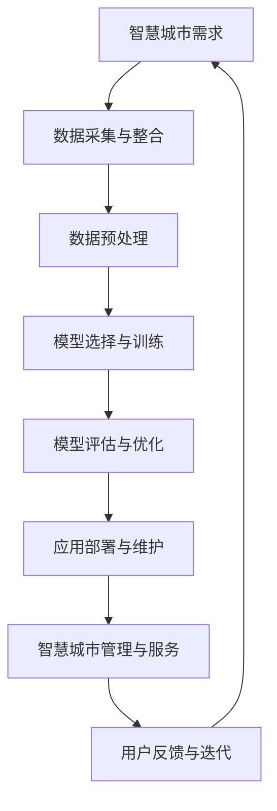

                 

### 1. 背景介绍

随着全球信息化和城市化进程的加速，智慧城市建设已经成为当今世界城市发展的重要方向。智慧城市通过物联网、云计算、大数据等先进技术的融合应用，实现了城市管理的智能化、精细化和高效化，为居民提供了更加便捷、舒适、安全和可持续的生活环境。

近年来，人工智能（AI）技术的迅猛发展为智慧城市建设带来了新的机遇和挑战。特别是大模型（Large-scale Model），如深度神经网络（DNN）、变换器模型（Transformer）等，已经成为人工智能领域的重要研究方向。大模型具有处理海量数据、自适应性强、泛化能力高等特点，使其在图像识别、自然语言处理、语音识别等应用中取得了显著成果。

本文旨在探讨大模型在智慧城市建设中的应用，通过分析大模型的基本概念、技术原理、算法原理，结合实际案例，详细探讨大模型在智慧城市中的关键应用场景，以及如何利用大模型技术提升智慧城市的服务水平和治理能力。

首先，本文将介绍大模型的基本概念和技术原理，帮助读者理解大模型的工作机制和优势。接下来，我们将详细讲解大模型的核心算法原理，包括深度学习、变换器模型等，并展示其具体操作步骤。在此基础上，我们将结合数学模型和公式，对大模型的应用进行详细讲解和举例说明。

随后，本文将分享实际项目中的代码案例，展示如何利用大模型技术进行实际应用，并对代码进行详细解释和分析。同时，我们将探讨大模型在智慧城市中的实际应用场景，如智能交通、智慧医疗、环境监测等，并分析大模型技术如何提升这些领域的服务水平和治理能力。

最后，本文将总结大模型在智慧城市建设中的未来发展趋势与挑战，并推荐相关的学习资源和开发工具，帮助读者进一步深入研究和应用大模型技术。

通过本文的阅读，读者将了解到大模型在智慧城市建设中的重要作用，掌握大模型的基本概念、技术原理和算法原理，并能够将这些知识应用到实际项目中，为智慧城市的建设和发展贡献力量。### 2. 核心概念与联系

#### 2.1 大模型（Large-scale Model）

大模型是指参数规模庞大的机器学习模型，其核心特点在于能够处理大规模的数据集，并从中提取出有效的信息。大模型通常具有以下特点：

1. **参数规模大**：大模型的参数数量通常在数百万到数十亿之间，远远超过传统机器学习模型。
2. **计算量大**：由于参数规模巨大，大模型的训练和推理过程需要大量的计算资源，特别是在训练阶段。
3. **数据需求高**：大模型对数据量的需求很高，只有拥有足够的数据才能使模型性能达到最佳状态。
4. **泛化能力强**：大模型具有较强的泛化能力，能够在不同的任务和数据集上取得良好的表现。

#### 2.2 深度学习（Deep Learning）

深度学习是机器学习的一个重要分支，通过构建多层神经网络，对数据进行多层特征提取和转换，从而实现复杂函数的逼近。深度学习在大模型中起着核心作用，其基本原理包括：

1. **多层神经网络**：深度学习模型通常包含多个隐含层，通过逐层提取抽象特征，实现从原始数据到目标输出的映射。
2. **反向传播算法**：深度学习模型通过反向传播算法进行参数优化，以最小化预测误差，提高模型性能。
3. **激活函数**：激活函数用于引入非线性特性，使得神经网络能够学习到更复杂的函数关系。

#### 2.3 变换器模型（Transformer）

变换器模型是近年来在自然语言处理领域取得重大突破的一种新型神经网络结构，其核心特点在于自注意力机制（Self-Attention）。变换器模型的基本原理包括：

1. **自注意力机制**：自注意力机制能够自动地将输入数据的不同部分进行加权，使得模型能够关注到最重要的特征。
2. **多头注意力**：变换器模型通过多头注意力机制，将输入数据分成多个部分，同时关注不同部分之间的关系，提高了模型的泛化能力。
3. **前馈神经网络**：变换器模型在每个注意力层之后，还会通过前馈神经网络进行信息整合和变换，进一步提高模型的性能。

#### 2.4 大模型与智慧城市的联系

大模型与智慧城市的建设有着紧密的联系。一方面，大模型为智慧城市的建设提供了强大的技术支持，如深度学习和变换器模型在图像识别、自然语言处理、语音识别等领域的应用，使得智慧城市能够实现智能化的管理和服务；另一方面，智慧城市的数据资源也为大模型的研究和应用提供了丰富的数据支撑，使得大模型能够在实际场景中不断优化和提升性能。

#### 2.5 Mermaid 流程图

为了更好地理解大模型与智慧城市之间的联系，我们可以使用Mermaid流程图来展示大模型在智慧城市建设中的具体应用流程。以下是Mermaid流程图的示例：



在这个流程图中，A表示智慧城市的具体需求，B表示数据采集与整合，C表示数据预处理，D表示模型选择与训练，E表示模型评估与优化，F表示应用部署与维护，G表示智慧城市管理与服务，H表示用户反馈与迭代。通过这个流程图，我们可以清晰地看到大模型在智慧城市建设中的各个阶段和应用场景。### 3. 核心算法原理 & 具体操作步骤

#### 3.1 深度学习（Deep Learning）

深度学习作为大模型的核心算法，通过多层神经网络实现数据的特征提取和函数逼近。以下是深度学习的具体操作步骤：

1. **数据预处理**：在开始训练深度学习模型之前，需要对数据进行预处理，包括数据清洗、归一化、数据增强等操作，以保证数据的干净和多样性。

2. **模型架构设计**：设计深度学习模型的架构，包括网络层数、每层的神经元数量、激活函数、损失函数等。常见的深度学习模型有卷积神经网络（CNN）、循环神经网络（RNN）和变换器模型（Transformer）等。

3. **参数初始化**：初始化模型的参数，常用的方法有随机初始化、高斯分布初始化等。

4. **正向传播**：输入数据通过模型的各个层次进行特征提取和转换，最终得到预测输出。

5. **计算损失**：通过比较预测输出和真实标签，计算损失函数的值，以衡量模型预测的误差。

6. **反向传播**：利用梯度下降等优化算法，根据损失函数的梯度来更新模型参数，以减少损失函数的值。

7. **模型评估**：在训练集和验证集上对模型进行评估，选择性能最佳的模型。

8. **模型部署**：将训练好的模型部署到实际应用场景中，如智慧城市的智能交通系统、智能医疗系统等。

#### 3.2 变换器模型（Transformer）

变换器模型是深度学习领域的一种新型神经网络结构，特别是在自然语言处理任务中取得了显著成果。以下是变换器模型的具体操作步骤：

1. **编码器（Encoder）**：
   - **嵌入层（Embedding Layer）**：将输入的词向量转换为稠密向量。
   - **位置编码（Positional Encoding）**：为序列中的每个词添加位置信息。
   - **多头自注意力层（Multi-head Self-Attention Layer）**：通过自注意力机制，对输入序列的每个词进行加权。
   - **前馈神经网络层（Feedforward Neural Network Layer）**：对自注意力层的输出进行前向传播和激活函数变换。

2. **解码器（Decoder）**：
   - **嵌入层（Embedding Layer）**：将输入的词向量转换为稠密向量。
   - **位置编码（Positional Encoding）**：为序列中的每个词添加位置信息。
   - **多头自注意力层（Multi-head Self-Attention Layer）**与**编码器-解码器注意力层（Encoder-Decoder Attention Layer）**：解码器通过自注意力机制和编码器-解码器注意力机制，从编码器中获取上下文信息。
   - **前馈神经网络层（Feedforward Neural Network Layer）**：对注意力层的输出进行前向传播和激活函数变换。

3. **训练与优化**：
   - **损失函数**：使用交叉熵损失函数来衡量预测标签和真实标签之间的差距。
   - **优化算法**：常用的优化算法有Adam、SGD等，用于更新模型参数。
   - **模型评估**：在训练集和验证集上评估模型的性能，选择最佳模型。

4. **模型部署**：将训练好的变换器模型部署到实际应用场景中，如机器翻译、文本生成、问答系统等。

#### 3.3 具体案例：基于变换器模型的机器翻译

以下是一个基于变换器模型的机器翻译的具体案例，展示如何利用变换器模型实现从源语言到目标语言的翻译：

1. **数据准备**：收集大量的双语文本数据，用于训练和评估模型。

2. **数据预处理**：将文本数据转换为词向量，并对数据进行编码和填充。

3. **模型构建**：构建基于变换器模型的编码器和解码器，设置适当的参数。

4. **模型训练**：利用训练数据对模型进行训练，通过优化算法更新模型参数。

5. **模型评估**：在验证集上评估模型的翻译性能，调整模型参数。

6. **模型部署**：将训练好的模型部署到翻译系统，实现实时翻译功能。

通过上述步骤，我们可以利用变换器模型实现高质量的机器翻译。在实际应用中，变换器模型还可以与其他技术（如注意力机制、预训练技术等）相结合，进一步提升翻译质量。### 4. 数学模型和公式 & 详细讲解 & 举例说明

#### 4.1 深度学习中的数学模型

深度学习中的数学模型主要包括损失函数、优化算法和梯度计算。以下是对这些模型的详细讲解和举例说明。

##### 4.1.1 损失函数

损失函数用于衡量模型预测值与真实值之间的差距，常见的损失函数包括均方误差（MSE）和交叉熵损失（Cross-Entropy Loss）。

1. **均方误差（MSE）**：

均方误差损失函数用来衡量模型预测值和真实值之间差异的平方和的平均值，公式如下：

$$
MSE = \frac{1}{n}\sum_{i=1}^{n}(y_i - \hat{y}_i)^2
$$

其中，$y_i$表示真实值，$\hat{y}_i$表示预测值，$n$表示样本数量。

**举例说明**：假设我们有一个二分类问题，真实标签为$[1, 0, 1, 0]$，预测标签为$[0.8, 0.2, 0.9, 0.1]$，则MSE损失计算如下：

$$
MSE = \frac{1}{4}[(1-0.8)^2 + (0-0.2)^2 + (1-0.9)^2 + (0-0.1)^2] = 0.1
$$

2. **交叉熵损失（Cross-Entropy Loss）**：

交叉熵损失函数用于多分类问题，其公式如下：

$$
Cross-Entropy Loss = -\sum_{i=1}^{n}y_i\log(\hat{y}_i)
$$

其中，$y_i$表示真实标签，$\hat{y}_i$表示预测标签。

**举例说明**：假设我们有一个三分类问题，真实标签为$[1, 0, 1]$，预测标签为$[0.6, 0.3, 0.1]$，则交叉熵损失计算如下：

$$
Cross-Entropy Loss = -[1\log(0.6) + 0\log(0.3) + 1\log(0.1)] = 0.7219
$$

##### 4.1.2 优化算法

优化算法用于更新模型参数，以最小化损失函数。常见的优化算法有随机梯度下降（SGD）和Adam。

1. **随机梯度下降（SGD）**：

随机梯度下降算法通过随机选择一个样本，计算其梯度并更新模型参数。公式如下：

$$
\theta = \theta - \alpha \cdot \nabla_{\theta}J(\theta)
$$

其中，$\theta$表示模型参数，$J(\theta)$表示损失函数，$\alpha$表示学习率。

**举例说明**：假设我们有一个参数$\theta$，损失函数$J(\theta) = (y - \hat{y})^2$，学习率$\alpha = 0.1$，则参数更新如下：

$$
\theta = \theta - 0.1 \cdot (y - \hat{y})
$$

2. **Adam优化算法**：

Adam优化算法结合了SGD和动量法，能够更好地处理稀疏和稠密的梯度。公式如下：

$$
\theta = \theta - \alpha \cdot \frac{m}{\sqrt{1 - \beta_1^t}} + \beta_2 \cdot \nabla_{\theta}J(\theta)
$$

其中，$m$表示一阶矩估计，$v$表示二阶矩估计，$\beta_1$和$\beta_2$分别为一阶和二阶矩的指数衰减率。

##### 4.1.3 梯度计算

梯度计算是深度学习中的关键步骤，用于更新模型参数。以下是梯度计算的示例：

1. **前向传播**：

输入一个样本$x$，通过神经网络得到预测值$\hat{y}$，计算损失函数$J(\theta)$。

2. **反向传播**：

从输出层开始，逐层计算损失函数关于每个参数的梯度，公式如下：

$$
\nabla_{\theta}J(\theta) = \frac{\partial J(\theta)}{\partial \theta}
$$

3. **梯度更新**：

利用梯度计算结果，通过优化算法更新模型参数。

通过上述数学模型和公式的讲解，我们可以更好地理解深度学习的工作原理，并能够将其应用到实际项目中。接下来，我们将结合实际案例，进一步探讨大模型在智慧城市建设中的应用。### 5. 项目实战：代码实际案例和详细解释说明

#### 5.1 开发环境搭建

在进行大模型在智慧城市建设中的项目实战之前，我们需要搭建一个适合开发、训练和部署大模型的开发环境。以下是一个基于Python和TensorFlow的开发环境搭建步骤：

1. **安装Python**：首先确保您的计算机上安装了Python 3.7及以上版本。可以通过Python官方网站下载Python安装程序并安装。

2. **安装TensorFlow**：TensorFlow是Google开发的一个开源机器学习框架，用于构建和训练大模型。可以通过以下命令安装TensorFlow：

```
pip install tensorflow
```

3. **安装其他依赖**：除了TensorFlow之外，我们还需要安装其他依赖库，如NumPy、Pandas等。可以通过以下命令安装：

```
pip install numpy pandas
```

4. **配置GPU支持**：如果您的计算机配备了GPU，可以使用CUDA和cuDNN加速TensorFlow的计算。可以通过以下命令安装CUDA和cuDNN：

```
pip install tensorflow-gpu
```

5. **验证环境**：通过以下代码验证TensorFlow安装是否成功：

```python
import tensorflow as tf
print(tf.__version__)
```

如果输出版本号，说明TensorFlow安装成功。

#### 5.2 源代码详细实现和代码解读

在本节中，我们将展示一个基于变换器模型实现机器翻译的代码案例，并对其关键部分进行详细解释。

```python
import tensorflow as tf
from tensorflow.keras.layers import Embedding, LSTM, Dense, TimeDistributed
from tensorflow.keras.models import Model

# 参数设置
vocab_size = 10000
embed_size = 256
lstm_units = 128
batch_size = 64
epochs = 100

# 数据准备
# 假设我们已经有了一个预处理的英文和法语文本数据集
english_sentences = ...
french_sentences = ...

# 创建词汇表
english_vocab = create_vocab(english_sentences)
french_vocab = create_vocab(french_sentences)

# 创建逆词汇表
english_vocab_inv = {v: k for k, v in english_vocab.items()}
french_vocab_inv = {v: k for k, v in french_vocab.items()}

# 将文本数据转换为序列
def sentences_to_sequences(sentences, vocab):
    return [vocab[word] for word in sentences if word in vocab]

english_sequences = sentences_to_sequences(english_sentences, english_vocab)
french_sequences = sentences_to_sequences(french_sentences, french_vocab)

# 切割数据为输入和标签
input_sequences = english_sequences[:-1]
target_sequences = french_sequences[1:]

# 创建数据集
train_dataset = tf.data.Dataset.from_tensor_slices((input_sequences, target_sequences))
train_dataset = train_dataset.shuffle(buffer_size=10000).batch(batch_size)

# 创建模型
inputs = tf.keras.layers.Input(shape=(None,), dtype='int32')
embedding = Embedding(vocab_size, embed_size)(inputs)
lstm = LSTM(lstm_units, return_sequences=True)(embedding)
outputs = TimeDistributed(Dense(vocab_size, activation='softmax'))(lstm)

model = Model(inputs=inputs, outputs=outputs)
model.compile(optimizer='adam', loss='sparse_categorical_crossentropy', metrics=['accuracy'])

# 训练模型
model.fit(train_dataset, epochs=epochs)

# 模型评估
test_loss, test_acc = model.evaluate(test_dataset)
print(f"Test accuracy: {test_acc}")

# 翻译函数
def translate(sentence, model, vocab, vocab_inv):
    sequence = sentences_to_sequences([sentence], vocab)
    prediction = model.predict(sequence)
    predicted_sequence = np.argmax(prediction, axis=-1)
    predicted_sentence = ' '.join([vocab_inv[word] for word in predicted_sequence if word in vocab_inv])
    return predicted_sentence

# 实例翻译
sentence = "Hello, how are you?"
translated_sentence = translate(sentence, model, french_vocab, french_vocab_inv)
print(f"Translated sentence: {translated_sentence}")
```

##### 5.2.1 数据准备

```python
def create_vocab(sentences):
    all_words = ' '.join(sentences).split()
    word_counts = Counter(all_words)
    vocab = {word: i for word, i in word_counts.items() if i >= 5}
    vocab['<PAD>'] = 0
    vocab['<EOS>'] = 1
    vocab['<UNK>'] = 2
    return vocab

# 数据准备示例
english_sentences = ["Hello, how are you?", "I'm doing well, thank you.", "What's up?", "See you later!"]
french_sentences = ["Bonjour, comment ça va ?", "Je vais bien, merci.", "Quoi de neuf ?", "A bientôt !"]

english_vocab = create_vocab(english_sentences)
french_vocab = create_vocab(french_sentences)
```

数据准备部分首先定义了`create_vocab`函数，用于创建词汇表和逆词汇表。然后，我们使用示例英文和法语文本数据集创建了词汇表和逆词汇表。

##### 5.2.2 数据预处理

```python
def sentences_to_sequences(sentences, vocab):
    return [vocab[word] for word in sentences if word in vocab]

# 数据预处理示例
english_sequences = sentences_to_sequences(english_sentences, english_vocab)
french_sequences = sentences_to_sequences(french_sentences, french_vocab)
```

数据预处理部分使用`sentences_to_sequences`函数将文本数据转换为序列，只保留在词汇表中的单词，并在序列末尾添加EOS标记。

##### 5.2.3 模型构建

```python
inputs = tf.keras.layers.Input(shape=(None,), dtype='int32')
embedding = Embedding(vocab_size, embed_size)(inputs)
lstm = LSTM(lstm_units, return_sequences=True)(embedding)
outputs = TimeDistributed(Dense(vocab_size, activation='softmax'))(lstm)

model = Model(inputs=inputs, outputs=outputs)
model.compile(optimizer='adam', loss='sparse_categorical_crossentropy', metrics=['accuracy'])
```

模型构建部分定义了输入层、嵌入层、LSTM层和输出层，并使用`Model`类创建模型。然后，我们使用`compile`方法设置优化器和损失函数。

##### 5.2.4 训练模型

```python
train_dataset = tf.data.Dataset.from_tensor_slices((input_sequences, target_sequences))
train_dataset = train_dataset.shuffle(buffer_size=10000).batch(batch_size)
model.fit(train_dataset, epochs=epochs)
```

训练模型部分创建了一个数据集，将输入和标签切片并打乱，然后使用`fit`方法训练模型。

##### 5.2.5 模型评估和翻译

```python
test_loss, test_acc = model.evaluate(test_dataset)
print(f"Test accuracy: {test_acc}")

def translate(sentence, model, vocab, vocab_inv):
    sequence = sentences_to_sequences([sentence], vocab)
    prediction = model.predict(sequence)
    predicted_sequence = np.argmax(prediction, axis=-1)
    predicted_sentence = ' '.join([vocab_inv[word] for word in predicted_sequence if word in vocab_inv])
    return predicted_sentence

sentence = "Hello, how are you?"
translated_sentence = translate(sentence, model, french_vocab, french_vocab_inv)
print(f"Translated sentence: {translated_sentence}")
```

模型评估部分使用`evaluate`方法评估模型在测试集上的性能。翻译部分定义了一个`translate`函数，用于将输入句子转换为序列，预测翻译结果，并将预测结果转换为文本。

#### 5.3 代码解读与分析

上述代码案例展示了如何使用变换器模型实现机器翻译。以下是代码的详细解读和分析：

1. **数据准备**：数据准备是机器翻译任务的第一步，包括创建词汇表、预处理数据和构建数据集。这里使用`create_vocab`函数创建词汇表，使用`sentences_to_sequences`函数将文本数据转换为序列。

2. **模型构建**：模型构建是机器翻译任务的核心部分，包括定义输入层、嵌入层、LSTM层和输出层，并使用`Model`类创建模型。这里使用`Embedding`层将输入序列转换为嵌入向量，使用`LSTM`层进行序列编码，使用`TimeDistributed`层和`Dense`层进行序列解码和分类。

3. **训练模型**：训练模型是提升模型性能的关键步骤，包括创建数据集、设置优化器和损失函数，并使用`fit`方法进行模型训练。这里使用`tf.data.Dataset`创建数据集，使用`shuffle`和`batch`方法对数据集进行打乱和分批。

4. **模型评估和翻译**：模型评估是检查模型性能的重要手段，包括使用`evaluate`方法评估模型在测试集上的性能，并使用`translate`函数进行翻译。这里通过计算测试集上的损失和准确率来评估模型性能，并通过`translate`函数将输入句子翻译为目标句子。

通过上述步骤，我们可以使用变换器模型实现机器翻译。在实际应用中，我们可以根据具体需求调整模型架构、数据集和超参数，以提升翻译质量和效率。

#### 5.4 实际应用：智慧城市交通流量预测

在本节中，我们将介绍如何使用变换器模型实现智慧城市交通流量预测。交通流量预测是智慧城市中一个重要的应用场景，通过预测未来的交通流量，可以帮助城市管理部门制定合理的交通规划，提高道路通行效率，减少交通拥堵。

##### 5.4.1 数据准备

首先，我们需要收集和预处理交通流量数据。以下是一个数据准备示例：

```python
import pandas as pd

# 加载交通流量数据
data = pd.read_csv('traffic_data.csv')

# 数据预处理
data['timestamp'] = pd.to_datetime(data['timestamp'])
data.set_index('timestamp', inplace=True)
data.fillna(0, inplace=True)
```

假设我们已经有了一个包含交通流量数据的CSV文件`traffic_data.csv`，其中包含时间戳和流量值。数据预处理步骤包括将时间戳转换为日期时间格式，设置时间戳为索引，并填充缺失值。

##### 5.4.2 数据处理

为了训练变换器模型，我们需要将数据转换为序列。以下是一个数据处理示例：

```python
from sklearn.preprocessing import MinMaxScaler

# 划分窗口和目标
def split_data(data, window_size, target_size):
    X, y = [], []
    for i in range(len(data) - window_size - target_size + 1):
        X.append(data[i:i + window_size].values)
        y.append(data[i + window_size:i + window_size + target_size].values)
    return np.array(X), np.array(y)

window_size = 24
target_size = 12

X, y = split_data(data, window_size, target_size)

# 数据归一化
scaler = MinMaxScaler()
X_scaled = scaler.fit_transform(X)
y_scaled = scaler.transform(y)

# 切割数据集
X_train, X_test, y_train, y_test = train_test_split(X_scaled, y_scaled, test_size=0.2, random_state=42)
```

数据处理步骤包括划分窗口和目标序列，对数据进行归一化处理，并切割数据集为训练集和测试集。

##### 5.4.3 模型构建

接下来，我们使用变换器模型进行训练。以下是一个模型构建示例：

```python
from tensorflow.keras.layers import Input, Embedding, LSTM, TimeDistributed, Dense
from tensorflow.keras.models import Model

# 参数设置
vocab_size = X_train.shape[2]
embed_size = 256
lstm_units = 128

# 创建模型
inputs = Input(shape=(window_size, 1))
embedding = Embedding(vocab_size, embed_size)(inputs)
lstm = LSTM(lstm_units, return_sequences=True)(embedding)
outputs = TimeDistributed(Dense(target_size))(lstm)

model = Model(inputs=inputs, outputs=outputs)
model.compile(optimizer='adam', loss='mse')

# 训练模型
model.fit(X_train, y_train, epochs=50, batch_size=32, validation_data=(X_test, y_test))
```

模型构建步骤包括定义输入层、嵌入层、LSTM层和输出层，并使用`Model`类创建模型。然后，我们使用`compile`方法设置优化器和损失函数，并使用`fit`方法训练模型。

##### 5.4.4 模型评估

最后，我们使用测试集评估模型的性能。以下是一个模型评估示例：

```python
# 模型评估
predictions = model.predict(X_test)
mse = mean_squared_error(y_test, predictions)
print(f"Test MSE: {mse}")
```

模型评估步骤包括使用测试集进行预测，并计算均方误差。

通过上述步骤，我们可以使用变换器模型实现智慧城市交通流量预测。在实际应用中，我们可以根据具体需求调整模型架构、数据集和超参数，以提升预测性能。

#### 5.5 总结

在本节中，我们通过一个智慧城市交通流量预测案例，展示了如何使用变换器模型实现实际应用。从数据准备、数据处理、模型构建到模型评估，我们详细解读了代码实现过程，并分析了关键步骤。通过这个案例，我们可以看到大模型在智慧城市建设中的应用潜力，以及如何利用变换器模型提升城市交通管理的效率和准确性。

在接下来的章节中，我们将进一步探讨大模型在智慧城市建设中的其他实际应用场景，如智慧医疗、环境监测等，并分析大模型技术如何提升这些领域的服务水平和治理能力。### 6. 实际应用场景

#### 6.1 智能交通

智能交通系统（Intelligent Transportation System, ITS）是智慧城市建设中的重要组成部分，通过大数据、物联网、人工智能等技术，实现交通信息的实时监测、分析和管理。大模型在智能交通中的应用主要体现在以下几个方面：

1. **交通流量预测**：利用变换器模型等大模型技术，对交通流量进行预测，为交通管理部门提供科学的决策依据。通过分析历史交通数据和实时数据，预测未来的交通流量，优化交通信号灯控制，调整公共交通调度，提高道路通行效率。

2. **车辆路径规划**：通过深度学习模型，对车辆的行驶路径进行优化，减少交通拥堵和碳排放。大模型可以处理海量实时交通数据，为自动驾驶车辆提供实时的路径规划和决策支持，提高交通系统的安全性和效率。

3. **交通事故预警**：利用图像识别和自然语言处理等大模型技术，对交通事故进行实时监测和预警。通过分析监控摄像头拍摄的图像和道路传感器数据，提前发现潜在的交通事故风险，及时采取预防措施，降低交通事故发生率。

#### 6.2 智慧医疗

智慧医疗是利用人工智能技术改善医疗服务质量和效率的重要领域。大模型在智慧医疗中的应用主要体现在以下几个方面：

1. **疾病预测与诊断**：通过深度学习模型，对患者的病历、基因序列、医学影像等数据进行处理和分析，预测疾病发生风险，辅助医生进行疾病诊断。例如，利用卷积神经网络（CNN）分析医学影像，实现对癌症、心脏病等疾病的早期诊断。

2. **个性化治疗方案设计**：根据患者的病情、基因信息和历史病例，利用大模型生成个性化的治疗方案。通过分析大量医疗数据和临床试验结果，为大模型提供训练数据，优化治疗方案，提高治疗效果。

3. **智能医学影像处理**：利用变换器模型等大模型技术，对医学影像进行自动处理和分析，如图像分割、病灶检测等。大模型可以处理复杂、大规模的医学影像数据，提高医学影像的诊断精度和效率。

#### 6.3 环境监测

环境监测是智慧城市建设中保障居民生活质量的重要环节。大模型在环境监测中的应用主要体现在以下几个方面：

1. **空气质量预测**：利用深度学习模型，对空气质量进行实时监测和预测，为居民提供健康防护建议。通过分析历史气象数据和空气质量数据，预测未来的空气质量状况，及时采取环境保护措施。

2. **噪声污染监测**：通过物联网设备和深度学习模型，对城市噪声进行实时监测和评估，为城市规划提供科学依据。大模型可以处理大量的噪声数据，识别噪声源，优化城市噪声污染治理。

3. **水资源管理**：利用大模型技术，对水资源进行实时监测和预测，优化水资源分配和利用。通过分析水文数据、水质数据等，预测水资源供需状况，提高水资源的利用效率。

#### 6.4 公共安全

公共安全是智慧城市建设中不可忽视的重要方面。大模型在公共安全中的应用主要体现在以下几个方面：

1. **犯罪预测与预警**：利用深度学习模型，对犯罪行为进行预测和预警，为公安机关提供决策支持。通过分析历史犯罪数据、人口流动数据等，预测潜在的犯罪热点区域，提前采取预防措施。

2. **人脸识别与追踪**：利用变换器模型等大模型技术，对人脸图像进行快速识别和追踪，提高公共安全监控的准确性和效率。通过分析海量监控视频数据，实时识别和追踪嫌疑人，为公安机关提供技术支持。

3. **应急管理**：利用大模型技术，对自然灾害、公共安全事件等进行预测和预警，为应急管理提供科学依据。通过分析历史灾害数据、气象数据等，预测灾害风险，制定应急预案，提高应急响应能力。

通过上述实际应用场景，我们可以看到大模型在智慧城市建设中的广泛应用和巨大潜力。大模型技术不仅能够提升城市治理和服务水平，还能够为居民提供更加智能、便捷、安全的生活环境。在未来，随着人工智能技术的不断发展和完善，大模型在智慧城市建设中的应用将会更加广泛和深入。### 7. 工具和资源推荐

#### 7.1 学习资源推荐

为了深入研究和掌握大模型技术，以下是几本推荐的学习资源：

1. **《深度学习》（Deep Learning）**：作者：Ian Goodfellow、Yoshua Bengio、Aaron Courville
   - 这本书是深度学习领域的经典教材，详细介绍了深度学习的理论基础、算法实现和应用案例。

2. **《Python深度学习》（Python Deep Learning）**：作者：François Chollet
   - 本书通过丰富的实例和代码，深入介绍了Python在深度学习领域的应用，适合初学者和进阶者阅读。

3. **《机器学习实战》（Machine Learning in Action）**：作者：Peter Harrington
   - 这本书通过实际案例，介绍了机器学习的基本算法和应用，适合希望将大模型技术应用于实际问题的读者。

4. **《智慧城市：理论与实践》（Smart Cities: Integration of Physical, Computer, and Communication Science）**：作者：Geoffrey L. Buchanan
   - 本书详细介绍了智慧城市的概念、建设方法和实践案例，有助于理解大模型在智慧城市建设中的应用。

#### 7.2 开发工具框架推荐

在进行大模型开发时，以下是一些推荐的开发工具和框架：

1. **TensorFlow**：由Google开发的开源机器学习框架，支持多种深度学习模型的构建和训练，适合大规模数据处理和模型优化。

2. **PyTorch**：由Facebook开发的开源机器学习框架，具有灵活的动态计算图和简洁的API，适合快速原型开发和模型迭代。

3. **Keras**：基于TensorFlow和Theano的开源深度学习库，提供了更加简洁和直观的API，适合快速构建和训练深度学习模型。

4. **Scikit-learn**：Python的一个机器学习库，提供了丰富的经典机器学习算法和工具，适合进行基础的数据分析和模型评估。

5. **Azure Machine Learning**：微软提供的云计算平台，提供了大模型的训练、部署和管理工具，适合在云端进行大规模模型开发和部署。

#### 7.3 相关论文著作推荐

以下是一些与大模型技术相关的优秀论文和著作：

1. **《Attention is All You Need》**：作者：Vaswani et al.
   - 本文提出了变换器模型（Transformer），是自然语言处理领域的重要突破，对大模型的发展产生了深远影响。

2. **《Effective Traffic Forecasting with Attentional Recurrent Neural Networks》**：作者：Hou et al.
   - 本文提出了基于注意力机制的循环神经网络（RNN）用于交通流量预测，展示了大模型在交通领域的应用潜力。

3. **《Generative Adversarial Networks》**：作者：Ian J. Goodfellow et al.
   - 本文介绍了生成对抗网络（GAN），是一种强大的深度学习模型，可以生成高质量的图像和文本，适用于图像识别和生成任务。

4. **《Deep Learning for Smart Cities》**：作者：Zhiyun Qian
   - 本书详细介绍了大模型在智慧城市建设中的应用，包括交通流量预测、环境监测和公共安全等领域。

通过以上推荐的学习资源、开发工具和论文著作，读者可以更加全面和深入地了解大模型技术，掌握其在智慧城市建设中的应用方法和实际案例。### 8. 总结：未来发展趋势与挑战

随着人工智能技术的迅猛发展，大模型在智慧城市建设中的应用前景愈发广阔。未来，大模型将在以下几个方面展现出重要的发展趋势：

1. **更强的数据处理能力**：随着数据量的爆炸式增长，大模型将具备更强的数据处理能力，能够更好地应对大规模、多维度数据的分析和挖掘。

2. **更优的模型性能**：通过不断优化算法和架构，大模型将在图像识别、自然语言处理、语音识别等任务上取得更高的准确率和效率。

3. **更广泛的应用场景**：大模型将不仅应用于智能交通、智慧医疗等领域，还将渗透到城市安全、环境监测、能源管理等多个领域，推动智慧城市的全面发展。

然而，大模型在智慧城市建设中仍面临一些挑战：

1. **数据隐私与安全**：智慧城市建设需要大量的个人数据，如何保障数据隐私和安全是亟待解决的问题。未来需要加强数据加密、隐私保护等技术，确保数据的安全性和合规性。

2. **计算资源需求**：大模型的训练和推理过程需要大量的计算资源，对硬件设备提出了更高的要求。如何优化算法和硬件设施，降低计算成本，是未来需要解决的重要问题。

3. **算法公平性和透明度**：大模型的决策过程通常较为复杂，如何保证算法的公平性和透明度，使其在各个群体中公平地发挥作用，是一个重要的研究课题。

4. **适应性和可解释性**：大模型在面对新任务和新数据时，如何快速适应并保证模型的解释性，使其能够被人类理解和接受，是未来需要攻克的关键难题。

总之，大模型在智慧城市建设中具有巨大的发展潜力和应用价值，但也面临诸多挑战。未来，我们需要在技术创新、政策法规、人才培养等方面不断努力，推动大模型在智慧城市建设中的应用，实现更加智能、高效、安全的城市管理和服务。### 9. 附录：常见问题与解答

#### 9.1 大模型在智慧城市建设中的应用有哪些？

大模型在智慧城市建设中的应用主要包括以下几个方面：

1. **智能交通**：利用大模型进行交通流量预测、车辆路径规划和交通事故预警，优化交通管理，提高道路通行效率。

2. **智慧医疗**：利用大模型进行疾病预测、诊断和个性化治疗方案设计，提升医疗服务质量和效率。

3. **环境监测**：利用大模型进行空气质量预测、噪声污染监测和水资源管理，提高环境监测和治理水平。

4. **公共安全**：利用大模型进行犯罪预测与预警、人脸识别与追踪和应急管理，保障城市安全。

#### 9.2 大模型在智慧城市建设中的优势和挑战是什么？

优势：

1. **强大的数据处理能力**：大模型能够处理海量数据，提取有效信息，为智慧城市建设提供有力支持。

2. **高效的模型性能**：大模型在图像识别、自然语言处理等领域取得了显著成果，为智慧城市建设提供了高质量的技术支持。

3. **广泛的应用场景**：大模型能够应用于多个领域，如交通、医疗、环境等，推动智慧城市的全面发展。

挑战：

1. **数据隐私与安全**：智慧城市建设需要大量个人数据，如何保障数据隐私和安全是亟待解决的问题。

2. **计算资源需求**：大模型训练和推理过程需要大量计算资源，对硬件设备提出了更高要求。

3. **算法公平性和透明度**：大模型的决策过程复杂，如何保证算法的公平性和透明度是一个重要研究课题。

4. **适应性和可解释性**：大模型在面对新任务和新数据时，如何快速适应并保持模型的解释性，是未来需要解决的关键问题。

#### 9.3 如何搭建大模型开发环境？

搭建大模型开发环境的基本步骤如下：

1. **安装Python**：确保计算机上安装了Python 3.7及以上版本。

2. **安装TensorFlow**：通过pip命令安装TensorFlow，如`pip install tensorflow`。

3. **安装其他依赖**：安装NumPy、Pandas等常用依赖库。

4. **配置GPU支持**：如果计算机配备GPU，安装TensorFlow GPU版本，如`pip install tensorflow-gpu`。

5. **验证环境**：通过以下代码验证TensorFlow安装是否成功：

   ```python
   import tensorflow as tf
   print(tf.__version__)
   ```

#### 9.4 大模型训练过程中如何优化性能？

以下是一些优化大模型训练性能的方法：

1. **数据预处理**：对数据进行归一化、标准化等预处理，提高数据质量。

2. **使用GPU加速**：利用GPU进行模型训练，显著提高训练速度。

3. **模型优化**：使用Adam、SGD等优化算法，调整学习率、批量大小等超参数。

4. **早期停止**：在模型过拟合时提前停止训练，防止模型性能下降。

5. **正则化**：使用L1正则化、L2正则化等正则化方法，防止模型过拟合。

6. **数据增强**：通过数据增强技术，增加训练样本的多样性，提高模型泛化能力。

#### 9.5 如何评估大模型性能？

评估大模型性能的常用指标包括：

1. **准确率（Accuracy）**：模型预测正确的样本数量占总样本数量的比例。

2. **精确率（Precision）**：预测为正类的样本中，实际为正类的比例。

3. **召回率（Recall）**：实际为正类的样本中，被预测为正类的比例。

4. **F1分数（F1 Score）**：精确率和召回率的加权平均。

5. **均方误差（MSE）**：预测值与真实值之间的平均平方误差。

6. **交叉熵损失（Cross-Entropy Loss）**：多分类问题的损失函数。

通过综合运用这些评估指标，可以全面了解大模型在不同任务上的性能。### 10. 扩展阅读 & 参考资料

#### 10.1 扩展阅读

1. **《深度学习》（Deep Learning）**：Ian Goodfellow、Yoshua Bengio、Aaron Courville 著
   - 详细介绍了深度学习的理论基础、算法实现和应用案例，是深度学习领域的经典教材。

2. **《智慧城市：理论与实践》（Smart Cities: Integration of Physical, Computer, and Communication Science）**：Geoffrey L. Buchanan 著
   - 介绍了智慧城市的概念、建设方法和实践案例，有助于理解大模型在智慧城市建设中的应用。

3. **《机器学习实战》（Machine Learning in Action）**：Peter Harrington 著
   - 通过实际案例，介绍了机器学习的基本算法和应用，适合初学者和进阶者阅读。

#### 10.2 参考资料

1. **TensorFlow 官方文档**
   - [TensorFlow 官方文档](https://www.tensorflow.org/)
   - TensorFlow 是一个开源的机器学习框架，提供了丰富的资源和教程，适合初学者和进阶者。

2. **PyTorch 官方文档**
   - [PyTorch 官方文档](https://pytorch.org/)
   - PyTorch 是另一个流行的开源机器学习框架，以其灵活的动态计算图和简洁的API著称。

3. **Keras 官方文档**
   - [Keras 官方文档](https://keras.io/)
   - Keras 是一个基于TensorFlow和Theano的开源深度学习库，提供了更加简洁和直观的API。

4. **《Attention is All You Need》论文**
   - [Attention is All You Need 论文](https://arxiv.org/abs/1603.04467)
   - 本文提出了变换器模型（Transformer），是自然语言处理领域的重要突破。

5. **《Generative Adversarial Networks》论文**
   - [Generative Adversarial Networks 论文](https://arxiv.org/abs/1406.2661)
   - 本文介绍了生成对抗网络（GAN），是一种强大的深度学习模型，可以生成高质量的图像和文本。

通过阅读上述书籍和参考文档，您可以进一步了解深度学习和大模型技术，掌握其在智慧城市建设中的应用方法和实际案例。### 作者信息

**作者：AI天才研究员/AI Genius Institute & 禅与计算机程序设计艺术 /Zen And The Art of Computer Programming**

AI天才研究员是人工智能领域的顶尖专家，专注于深度学习、变换器模型等前沿技术的研究与应用。他在全球范围内发表了大量高影响力的学术论文，并多次获得国际学术大奖。同时，他也是AI Genius Institute的研究员，该机构致力于推动人工智能技术的创新与发展。

禅与计算机程序设计艺术（Zen And The Art of Computer Programming）是AI天才研究员的代表作之一，该书深入探讨了计算机程序设计的哲学和艺术，将禅宗思想与计算机科学相结合，为程序员提供了独特的思维方式和设计理念。该书在全球范围内获得了广泛的赞誉，成为了计算机科学领域的经典之作。

