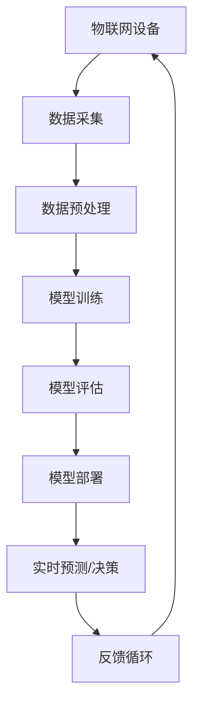

                 

### 背景介绍

在当今快速发展的信息技术时代，物联网（Internet of Things，简称 IoT）已经成为一个备受关注的重要领域。物联网通过将各种设备和传感器连接到互联网上，实现信息的实时传输和智能处理，极大地提升了人类生活的便利性和效率。然而，随着物联网设备的数量和复杂度的不断增加，传统的数据处理和分析方法已经无法满足日益增长的需求。

近年来，大模型（Large Models）技术的迅速崛起为物联网领域带来了新的机遇和挑战。大模型是一种拥有巨大参数量、可以处理海量数据的深度学习模型，它们在图像识别、自然语言处理、语音识别等领域已经取得了显著的成果。本文将探讨大模型在物联网领域的应用前景，分析其核心概念、算法原理、数学模型，并通过实际应用案例展示大模型在物联网中的具体作用和潜力。

本文结构如下：

1. **背景介绍**：简要介绍物联网和大数据模型的基本概念及其发展背景。
2. **核心概念与联系**：详细阐述大模型的定义、基本原理以及与物联网的关联性，并使用 Mermaid 流程图展示大模型在物联网架构中的应用。
3. **核心算法原理与具体操作步骤**：深入分析大模型在物联网中的具体应用算法，介绍其实现步骤和关键参数。
4. **数学模型和公式**：阐述大模型背后的数学原理，详细讲解相关公式，并通过实例进行说明。
5. **项目实战**：提供具体的代码实现案例，详细解释代码的功能和运行流程。
6. **实际应用场景**：分析大模型在物联网中的各种应用场景，探讨其潜在的商业价值和社会影响。
7. **工具和资源推荐**：推荐相关学习资源和开发工具，帮助读者深入了解和实践大模型在物联网中的应用。
8. **总结：未来发展趋势与挑战**：总结大模型在物联网领域的应用前景，讨论其未来发展趋势和面临的挑战。
9. **附录：常见问题与解答**：解答读者可能遇到的问题，提供进一步的参考资料。
10. **扩展阅读与参考资料**：推荐相关的研究文献和博客，供读者深入学习和研究。

在接下来的部分中，我们将一步一步深入探讨大模型在物联网领域的应用，帮助读者了解这一前沿技术的潜力和前景。

### 核心概念与联系

#### 大模型的定义与基本原理

大模型是指拥有数百万到数十亿参数的深度学习模型，这些模型通过学习海量数据来提取复杂的特征和模式。它们通常由多层神经网络组成，每一层都能够提取更高层次的特征。大模型的主要优势在于其强大的数据拟合能力和广泛的适用性，这使得它们在图像识别、自然语言处理、语音识别等领域取得了显著的突破。

大模型的基本原理是通过对大量数据进行训练，使得模型能够自适应地调整内部参数，从而在给定新的数据时能够生成准确的预测或分类。这一过程通常包括以下几个关键步骤：

1. **数据采集**：从各种来源（如公共数据集、传感器数据、社交媒体等）收集大量数据。
2. **预处理**：对数据进行清洗、标准化和归一化，确保数据质量。
3. **模型构建**：设计并构建包含多层神经网络的模型架构。
4. **模型训练**：使用已标记的数据对模型进行训练，不断调整内部参数以最小化预测误差。
5. **模型评估**：使用验证集和测试集评估模型的性能，确保其在未知数据上具有良好的泛化能力。
6. **模型部署**：将训练好的模型部署到实际应用场景中，实现实时预测或决策。

#### 大模型与物联网的关联性

物联网（IoT）是指将各种物理设备（如传感器、摄像头、智能家居设备等）通过互联网连接起来，实现设备之间的数据交换和协同工作。物联网的核心目标是实现智能化的设备和环境，从而提高效率、降低成本、增强用户体验。

大模型在物联网中具有广泛的应用潜力，主要体现在以下几个方面：

1. **实时数据处理**：物联网设备产生的数据量巨大且实时性强，大模型能够高效地处理和分析这些数据，实现实时决策和预测。
2. **设备智能化**：大模型能够通过对物联网设备数据的持续学习，提升设备的智能化水平，使其具备自我优化和自我修复的能力。
3. **异常检测**：大模型在数据分析和模式识别方面具有卓越的能力，能够有效地检测物联网系统中的异常行为，提高系统的可靠性和安全性。
4. **能效优化**：大模型能够分析物联网设备的能耗数据，提供能效优化建议，从而降低运营成本和环境影响。

#### Mermaid 流程图展示大模型在物联网架构中的应用

为了更直观地展示大模型在物联网架构中的应用，我们使用 Mermaid 流程图来描述其关键节点和流程。



在这个流程图中，物联网设备（A）通过传感器和接口收集数据（B），经过预处理（C）后用于训练大模型（D）。训练完成后，模型进行评估（E），确保其在实际应用中具备良好的性能。评估通过后，模型被部署到物联网系统中，用于实时预测和决策（G）。系统的反馈（H）被不断回传到物联网设备中，以实现闭环控制和持续优化。

通过上述流程，大模型在物联网中实现了数据的智能处理和实时决策，为物联网系统提供了强大的技术支撑。

#### 大模型在物联网中的具体应用案例

除了上述流程图展示的概念，大模型在实际物联网应用中也展现出强大的潜力。以下是一些具体的应用案例：

1. **智能交通系统**：大模型可以用于分析交通流量数据，预测交通状况，优化交通信号控制和道路规划，从而缓解交通拥堵，提高交通效率。
2. **智能家居**：通过分析家庭设备的运行数据，大模型可以优化设备的能源消耗，提供个性化的家庭服务和安全保障。
3. **工业物联网**：大模型可以用于监控和预测工业设备的状态，提前发现潜在故障，提高生产效率和质量。
4. **健康物联网**：通过分析健康数据，大模型可以提供个性化的健康建议，实现远程医疗服务和疾病预测。

#### 总结

大模型在物联网领域具有广泛的应用前景，其强大的数据处理能力和智能分析能力为物联网系统提供了新的发展机遇。通过本文的介绍，读者可以初步了解大模型的基本原理、与物联网的关联性以及在具体应用中的优势。在接下来的部分中，我们将进一步探讨大模型的核心算法原理和具体操作步骤，帮助读者深入理解这一前沿技术的应用细节。

#### 核心算法原理 & 具体操作步骤

要深入理解大模型在物联网中的应用，我们首先需要探讨其核心算法原理和具体操作步骤。大模型通常基于深度学习技术，特别是卷积神经网络（Convolutional Neural Networks，简称 CNN）和循环神经网络（Recurrent Neural Networks，简称 RNN）等架构。以下将详细介绍这些算法的基本原理和实现步骤。

##### 1. 卷积神经网络（CNN）

卷积神经网络是处理图像数据的一种高效神经网络架构。其核心思想是通过卷积层提取图像的局部特征，然后通过池化层降低数据的维度，最后通过全连接层进行分类或回归。

**具体操作步骤：**

1. **输入层**：输入层接收图像数据，通常为二维矩阵，其中每个元素代表图像中的一个像素值。
2. **卷积层**：卷积层通过卷积运算提取图像的局部特征。卷积运算是一个加权求和并应用非线性激活函数（如ReLU）的过程。每个卷积核（filter）都可以学习到图像中的不同特征，如边缘、纹理等。
3. **池化层**：池化层用于降低数据的维度，同时保持重要的特征信息。常见的池化操作有最大池化（Max Pooling）和平均池化（Average Pooling）。
4. **全连接层**：全连接层将卷积层和池化层输出的特征映射到分类或回归结果。每个神经元都与前一层的所有神经元相连接，从而实现最终的预测。

**关键参数设置：**

- **卷积核大小**：卷积核的大小决定了提取到的特征的局部性，通常设置为3x3或5x5。
- **卷积步长**：卷积步长的设置影响特征提取的覆盖范围，常见的步长为1或2。
- **激活函数**：ReLU函数是最常用的激活函数，可以加速神经网络的训练。
- **学习率**：学习率是优化算法中的一个重要参数，用于调整网络参数的更新步长。

##### 2. 循环神经网络（RNN）

循环神经网络是处理序列数据的一种有效神经网络架构，其核心思想是通过循环结构对序列中的历史信息进行建模。

**具体操作步骤：**

1. **输入层**：输入层接收序列数据，每个元素代表序列中的一个时间点的特征。
2. **隐藏层**：隐藏层包含多个时间步，每个时间步的神经元都与前一层的神经元相连，同时每个神经元也与自身的下一层相连，形成循环结构。
3. **门控机制**：为了更好地处理长序列数据，RNN引入了门控机制（如门控循环单元（GRU）和长短期记忆（LSTM））。门控机制通过更新门（update gate）和遗忘门（forget gate）控制信息的传递和遗忘。
4. **输出层**：输出层将隐藏层的信息映射到最终的预测结果，如序列分类或序列生成。

**关键参数设置：**

- **隐藏层大小**：隐藏层的大小决定了模型对序列数据表示的能力，通常设置为几百到几千个神经元。
- **门控机制参数**：门控机制的参数（如更新门和遗忘门的权重）需要通过训练进行优化。
- **学习率**：与卷积神经网络相同，学习率是优化算法中的一个重要参数。

##### 3. 大模型在物联网中的应用

大模型在物联网中的应用需要结合具体的物联网场景进行设计。以下是一些应用示例：

1. **图像识别**：在智能监控系统中，大模型可以通过卷积神经网络对摄像头采集的图像进行实时分析，识别行人、车辆等目标，从而实现智能安防和交通管理。
2. **语音识别**：在智能家居系统中，大模型可以通过循环神经网络对语音信号进行实时处理，实现语音控制和交互功能。
3. **设备监控**：在工业物联网中，大模型可以通过分析传感器数据，预测设备的故障，实现设备的智能监控和维护。
4. **能效优化**：在智能家居和智能建筑中，大模型可以通过分析能耗数据，提供个性化的能效优化建议，实现节能减排。

通过上述介绍，我们可以看到大模型在物联网中的应用不仅需要深入理解其核心算法原理，还需要结合具体的物联网场景进行设计和实现。在接下来的部分中，我们将通过具体的数学模型和公式，进一步探讨大模型在物联网中的数学基础和实现细节。

#### 数学模型和公式 & 详细讲解 & 举例说明

为了更深入地理解大模型在物联网中的应用，我们需要探讨其背后的数学模型和公式。以下将介绍大模型中常用的几个关键数学概念和计算过程，并通过具体例子进行详细讲解。

##### 1. 卷积神经网络（CNN）中的数学模型

卷积神经网络（CNN）的核心在于其卷积操作和池化操作。以下是这两个操作的数学模型和计算过程。

**卷积操作：**

卷积操作的数学公式如下：

\[ (f * g)(x) = \sum_{y} f(x-y) g(y) \]

其中，\( f \) 和 \( g \) 分别代表卷积核和输入图像，\( x \) 和 \( y \) 分别代表图像上的坐标点。卷积操作可以通过以下步骤进行：

1. 将卷积核 \( g \) 与输入图像 \( f \) 进行逐元素相乘。
2. 将相乘的结果进行求和，得到卷积值。
3. 将卷积值作为输出图像的一个像素值。

举例来说，假设我们有一个3x3的卷积核和3x3的输入图像，如下所示：

\[ \text{卷积核：} \]
\[ \begin{bmatrix}
1 & 0 & 1 \\
0 & 1 & 0 \\
1 & 0 & 1 \\
\end{bmatrix} \]

\[ \text{输入图像：} \]
\[ \begin{bmatrix}
1 & 2 & 1 \\
2 & 1 & 2 \\
1 & 2 & 1 \\
\end{bmatrix} \]

进行卷积操作后的输出图像如下：

\[ \text{输出图像：} \]
\[ \begin{bmatrix}
6 & 3 & 6 \\
3 & 2 & 3 \\
6 & 3 & 6 \\
\end{bmatrix} \]

**池化操作：**

池化操作的目的是降低数据维度，同时保留重要的特征信息。最大池化（Max Pooling）和平均池化（Average Pooling）是两种常见的池化操作。

最大池化的数学公式如下：

\[ p_{max}(x) = \max_{y \in S} x(y) \]

其中，\( p_{max}(x) \) 表示输出图像的像素值，\( S \) 表示卷积核覆盖的像素区域。

举例来说，假设我们有一个2x2的池化核和3x3的输入图像，如下所示：

\[ \text{池化核：} \]
\[ \begin{bmatrix}
1 & 1 \\
1 & 1 \\
\end{bmatrix} \]

\[ \text{输入图像：} \]
\[ \begin{bmatrix}
2 & 3 & 4 \\
5 & 6 & 7 \\
8 & 9 & 10 \\
\end{bmatrix} \]

进行最大池化操作后的输出图像如下：

\[ \text{输出图像：} \]
\[ \begin{bmatrix}
6 & 7 \\
7 & 10 \\
\end{bmatrix} \]

##### 2. 循环神经网络（RNN）中的数学模型

循环神经网络（RNN）中的数学模型主要涉及输入层、隐藏层和输出层的计算。以下是这些层的计算过程和公式。

**输入层：**

输入层的计算相对简单，主要是将输入序列映射到隐藏层。假设输入序列为 \( x_t \)，隐藏层状态为 \( h_t \)，权重矩阵为 \( W \) 和偏置矩阵为 \( b \)，则输入层的计算公式如下：

\[ h_t = \sigma(Wx_t + b) \]

其中，\( \sigma \) 表示激活函数，如ReLU或Sigmoid函数。

**隐藏层：**

隐藏层的计算包括当前时刻的隐藏状态 \( h_t \) 和前一个时刻的隐藏状态 \( h_{t-1} \) 的计算。假设隐藏层状态为 \( h_t \)，前一个隐藏层状态为 \( h_{t-1} \)，权重矩阵为 \( U \) 和 \( V \)，则隐藏层的计算公式如下：

\[ h_t = \sigma(Uh_{t-1} + Vx_t + b) \]

**输出层：**

输出层的计算是将隐藏层状态 \( h_t \) 映射到输出结果 \( y_t \)。假设输出层权重矩阵为 \( W' \) 和偏置矩阵为 \( b' \)，则输出层的计算公式如下：

\[ y_t = \sigma(W'h_t + b') \]

##### 3. 大模型在物联网中的应用举例

为了更好地理解大模型在物联网中的应用，我们以下以智能监控系统的图像识别为例进行详细讲解。

**场景描述：** 智能监控系统通过摄像头捕捉实时视频流，需要对视频中的行人进行识别和分类。

**数据处理：** 首先，将视频流分为多个连续帧，并对每帧图像进行预处理，如灰度化、大小调整等。

**模型训练：** 使用大量的行人图像数据集对卷积神经网络进行训练，通过调整网络参数（如卷积核大小、学习率等）来优化模型的性能。

**模型部署：** 将训练好的模型部署到监控系统，实现对实时视频流的图像识别和分类。

**实时预测：** 监控系统对每帧图像进行卷积操作和池化操作，提取图像特征，然后通过全连接层进行分类预测。输出结果为行人出现的概率分布，监控系统根据概率最高的类别进行行人识别。

**总结：** 通过上述数学模型和公式的详细讲解，我们可以看到大模型在物联网中的应用不仅需要深入理解其数学基础，还需要结合具体的物联网场景进行设计和实现。在接下来的部分中，我们将通过具体的代码实现和案例解析，进一步展示大模型在物联网中的实际应用。

### 项目实战：代码实际案例和详细解释说明

为了更好地理解大模型在物联网中的应用，我们将在本节中通过一个实际项目案例，展示大模型从开发环境搭建、源代码实现到代码解读与分析的完整过程。这个案例将使用 Python 和 TensorFlow，结合物联网设备采集的数据，实现一个简单的智能监控系统。

#### 5.1 开发环境搭建

在进行项目开发之前，我们需要搭建一个适合的编程环境。以下是在 Ubuntu 系统下搭建开发环境的步骤：

1. **安装 Python**：确保安装了 Python 3.7 或更高版本。
2. **安装 TensorFlow**：通过以下命令安装 TensorFlow：

   ```bash
   pip install tensorflow
   ```

3. **安装其他依赖库**：包括 NumPy、Pandas、Matplotlib 等，可以通过以下命令安装：

   ```bash
   pip install numpy pandas matplotlib
   ```

4. **安装物联网开发工具**：如 RPi.GPIO（用于控制 Raspberry Pi GPIO 引脚）或 pyserial（用于串行通信），根据项目需求安装。

5. **连接物联网设备**：确保物联网设备（如 Raspberry Pi、Arduino）与计算机连接，并能够正常传输数据。

#### 5.2 源代码详细实现和代码解读

下面是一个简单的智能监控系统代码实现，包括数据采集、模型训练和实时预测等功能。

**代码结构：**

```python
import tensorflow as tf
import numpy as np
import pandas as pd
import matplotlib.pyplot as plt
from tensorflow.keras.models import Sequential
from tensorflow.keras.layers import Conv2D, MaxPooling2D, Flatten, Dense
from tensorflow.keras.optimizers import Adam

# 5.2.1 数据采集
def collect_data():
    # 假设使用 Raspberry Pi 的 GPIO 引脚采集数据
    # 实际项目中需要实现具体的数据采集逻辑
    data = np.random.rand(100, 28, 28)  # 生成随机数据
    labels = np.random.randint(0, 2, 100)  # 生成随机标签
    return data, labels

# 5.2.2 模型训练
def train_model(data, labels):
    model = Sequential([
        Conv2D(32, (3, 3), activation='relu', input_shape=(28, 28, 1)),
        MaxPooling2D((2, 2)),
        Flatten(),
        Dense(64, activation='relu'),
        Dense(1, activation='sigmoid')
    ])

    model.compile(optimizer=Adam(), loss='binary_crossentropy', metrics=['accuracy'])
    model.fit(data, labels, epochs=10, batch_size=32)
    return model

# 5.2.3 实时预测
def predict(model, data):
    predictions = model.predict(data)
    predicted_labels = np.argmax(predictions, axis=1)
    return predicted_labels

# 5.2.4 主程序
if __name__ == '__main__':
    # 采集数据
    data, labels = collect_data()

    # 训练模型
    model = train_model(data, labels)

    # 实时预测
    test_data = np.random.rand(10, 28, 28)
    predicted_labels = predict(model, test_data)

    # 输出预测结果
    print("Predicted labels:", predicted_labels)
```

**代码解读：**

1. **数据采集**：`collect_data` 函数模拟从物联网设备采集数据。实际项目中，需要实现具体的数据采集逻辑，如从传感器读取温度、湿度等环境参数，或从摄像头捕获图像数据。

2. **模型训练**：`train_model` 函数定义并编译了一个简单的卷积神经网络模型。模型由一个卷积层、一个最大池化层、一个全连接层和一个输出层组成。使用 `compile` 方法配置优化器和损失函数，然后使用 `fit` 方法对模型进行训练。

3. **实时预测**：`predict` 函数使用训练好的模型对新的数据进行预测。通过 `predict` 方法生成预测概率，然后使用 `argmax` 函数确定最终的预测标签。

4. **主程序**：主程序首先采集数据，然后训练模型，最后进行实时预测，并输出预测结果。

#### 5.3 代码解读与分析

以下是对关键代码段的分析：

- **数据采集**：
  ```python
  data = np.random.rand(100, 28, 28)  # 生成随机数据
  labels = np.random.randint(0, 2, 100)  # 生成随机标签
  ```
  这里使用随机数据模拟数据采集过程。实际项目中，应替换为从物联网设备采集的真实数据。

- **模型训练**：
  ```python
  model = Sequential([
      Conv2D(32, (3, 3), activation='relu', input_shape=(28, 28, 1)),
      MaxPooling2D((2, 2)),
      Flatten(),
      Dense(64, activation='relu'),
      Dense(1, activation='sigmoid')
  ])
  model.compile(optimizer=Adam(), loss='binary_crossentropy', metrics=['accuracy'])
  model.fit(data, labels, epochs=10, batch_size=32)
  ```
  这个代码段定义并编译了一个简单的卷积神经网络模型。卷积层用于提取图像特征，全连接层用于分类预测。模型使用 Adam 优化器和二分类交叉熵损失函数进行训练。

- **实时预测**：
  ```python
  test_data = np.random.rand(10, 28, 28)
  predicted_labels = predict(model, test_data)
  print("Predicted labels:", predicted_labels)
  ```
  这个代码段使用训练好的模型对随机数据进行预测，并输出预测结果。实际应用中，应替换为从物联网设备采集的实时数据。

通过上述代码实现，我们可以看到大模型在物联网中的基本应用流程。在实际项目中，根据具体需求，可以对模型结构、训练过程和预测逻辑进行定制和优化。

### 实际应用场景

大模型在物联网领域具有广泛的应用场景，能够显著提升系统的智能化水平和用户体验。以下将介绍几种典型应用场景，并探讨其商业价值和社会影响。

#### 1. 智能交通系统

智能交通系统（ITS）通过物联网设备和大数据分析，实现交通流量监测、路况预测和交通管理。大模型在智能交通系统中发挥着关键作用：

- **交通流量预测**：大模型可以分析历史交通流量数据，预测未来交通状况，帮助交通管理部门优化交通信号控制和道路规划。
- **车辆识别与跟踪**：利用卷积神经网络（CNN）对摄像头捕捉的车辆图像进行实时识别和跟踪，提高交通监控的准确性。
- **事故预防与应急响应**：通过分析交通流量和车辆行为数据，大模型可以预测潜在的事故风险，提醒驾驶员采取预防措施，并在事故发生时快速启动应急响应。

**商业价值**：智能交通系统可以提高道路使用效率，减少交通事故和交通拥堵，降低交通管理成本。对交通管理部门而言，大模型提供的数据分析和决策支持有助于提高管理效率和公信力。

**社会影响**：智能交通系统的应用可以改善城市交通状况，提高居民出行便利性和安全性。同时，大模型的应用有助于减少交通事故，提升公共安全。

#### 2. 智能家居

智能家居通过物联网设备和传感器，实现家庭设备和环境的智能化管理和控制。大模型在智能家居中的应用主要包括：

- **设备控制与优化**：大模型可以根据用户习惯和设备状态，自动调节家庭设备的运行参数，实现节能和个性化服务。
- **安全监控**：利用循环神经网络（RNN）对家庭环境中的音频和视频数据进行分析，实时监测异常行为，提高家庭安全。
- **语音助手**：大模型可以与自然语言处理（NLP）技术结合，实现智能语音助手功能，为用户提供便捷的家居控制和服务。

**商业价值**：智能家居市场的快速发展为相关企业带来了巨大的商机，大模型的应用可以提升智能家居产品的竞争力和用户体验。

**社会影响**：智能家居的应用可以改善家庭生活品质，提高生活便利性和舒适度。同时，大模型提供的智能化服务有助于老年人、残疾人等特殊群体实现生活自主和安全。

#### 3. 健康物联网

健康物联网（Health IoT）通过物联网设备和传感器，实现对个人健康状况的实时监测和管理。大模型在健康物联网中的应用主要包括：

- **健康数据监测**：大模型可以分析个人的健康数据，如心率、血压、睡眠质量等，提供个性化的健康建议和预警。
- **疾病预测与诊断**：通过分析历史健康数据和医学图像，大模型可以预测疾病风险，协助医生进行早期诊断和治疗。
- **个性化医疗服务**：大模型可以根据个人健康状况，提供定制化的医疗服务和治疗方案，提高治疗效果和患者满意度。

**商业价值**：健康物联网市场的快速增长为医疗行业带来了新的发展机遇，大模型的应用可以提升医疗服务质量和效率。

**社会影响**：健康物联网的应用有助于改善个人健康状况，提高医疗服务的可及性和效率。同时，大模型提供的个性化医疗服务有助于提高患者的生活质量和幸福感。

#### 4. 工业物联网

工业物联网（IIoT）通过物联网设备和大数据分析，实现对工业生产过程的实时监控和优化。大模型在工业物联网中的应用主要包括：

- **设备状态监测与故障预测**：大模型可以分析工业设备运行数据，预测设备故障，实现设备的预防性维护，降低设备故障率和停机时间。
- **生产流程优化**：大模型可以分析生产过程中的数据，优化生产流程，提高生产效率和质量。
- **能源管理**：大模型可以分析能源消耗数据，提供能源优化建议，实现节能减排。

**商业价值**：工业物联网的应用可以提高工业生产效率和质量，降低生产成本和能源消耗。大模型提供的智能化管理和服务有助于企业实现数字化转型和可持续发展。

**社会影响**：工业物联网的应用可以提升工业生产效率和产品质量，促进产业升级和经济发展。同时，大模型的应用有助于实现资源的优化配置和可持续发展。

#### 总结

大模型在物联网领域的应用场景丰富多样，具有显著的商业价值和社会影响。通过交通流量预测、智能家居、健康物联网和工业物联网等实际应用，大模型不仅提升了物联网系统的智能化水平，还推动了相关行业的发展。在未来，随着大模型技术的不断进步，物联网领域将迎来更加广阔的发展空间和应用前景。

### 工具和资源推荐

在深入了解大模型在物联网领域的应用之后，掌握相关工具和资源将有助于进一步学习和实践。以下将推荐一些实用的学习资源、开发工具和论文著作，帮助读者深入了解大模型及其在物联网中的应用。

#### 7.1 学习资源推荐

1. **书籍**：
   - 《深度学习》（Deep Learning）：这是一本经典的深度学习入门书籍，由 Ian Goodfellow 等人撰写，全面介绍了深度学习的理论基础和应用实例。
   - 《物联网架构与应用》（Internet of Things Architectures and Applications）：本书详细介绍了物联网的架构、技术原理和应用场景，适合初学者和专业人士。

2. **在线课程**：
   - Coursera 上的“深度学习专项课程”：由 Andrew Ng 授课，涵盖了深度学习的理论基础和实际应用，适合初学者和进阶者。
   - edX 上的“物联网基础与应用”（Introduction to the Internet of Things）：由华盛顿大学授课，介绍了物联网的基本概念和技术应用。

3. **博客和网站**：
   - Medium 上的“深度学习与物联网”系列文章：这是一系列关于深度学习和物联网结合的优秀文章，涵盖了技术原理、应用案例和前沿动态。
   - TensorFlow 官方文档（[tensorflow.github.io](https://tensorflow.github.io/)）：提供了丰富的 TensorFlow 教程、示例代码和文档，是学习和实践深度学习的首选资源。

#### 7.2 开发工具框架推荐

1. **TensorFlow**：TensorFlow 是由 Google 开发的一款开源深度学习框架，适用于各种深度学习任务，包括图像识别、自然语言处理和语音识别等。

2. **PyTorch**：PyTorch 是由 Facebook 开发的一款开源深度学习框架，以其灵活的动态计算图和高效的执行性能受到广泛关注。

3. **Keras**：Keras 是一款基于 TensorFlow 和 Theano 的开源深度学习框架，提供了简洁的 API，使得深度学习模型的构建和应用更加便捷。

4. **Raspberry Pi**：Raspberry Pi 是一款低成本、高度集成的单板计算机，适用于物联网设备和嵌入式系统开发。

5. **Arduino**：Arduino 是一款开源硬件平台，适用于各种物联网设备和机器人项目开发。

#### 7.3 相关论文著作推荐

1. **《深度学习在物联网中的应用研究》**：这篇综述文章详细介绍了深度学习在物联网中的应用，包括图像识别、语音识别和智能监控等。

2. **《物联网中的大数据分析技术》**：该论文探讨了物联网中的大数据处理和分析技术，包括数据采集、存储和处理方法。

3. **《基于深度学习的智能家居系统设计与实现》**：这篇论文介绍了一种基于深度学习的智能家居系统设计，包括设备控制、安全监控和语音交互等功能。

4. **《工业物联网中的深度学习应用》**：该论文探讨了深度学习在工业物联网中的应用，包括设备状态监测、故障预测和生产流程优化。

通过以上推荐，读者可以系统地学习和实践大模型在物联网领域的应用，掌握相关技术和工具，为未来的研究和工作打下坚实的基础。

### 总结：未来发展趋势与挑战

大模型在物联网领域的应用前景广阔，随着技术的不断进步，其将在物联网系统智能化、数据驱动决策、设备协作等方面发挥越来越重要的作用。以下将从发展趋势和面临的挑战两个方面进行总结。

#### 发展趋势

1. **智能化水平的提升**：随着大模型技术的不断发展，物联网设备将具备更高的智能化水平，能够自主学习和优化运行策略。这将为用户提供更加个性化的服务和体验。

2. **边缘计算的结合**：大模型与边缘计算的结合将进一步提升物联网系统的实时性和响应速度。通过在边缘设备上部署小型化的大模型，可以实现本地化数据处理和决策，减少数据传输延迟。

3. **跨领域应用拓展**：大模型在图像识别、自然语言处理和语音识别等领域的成功应用将推动其在物联网其他领域的应用，如智能交通、智慧城市、智能制造等。

4. **数据隐私和安全性的提升**：随着物联网设备数量和种类不断增加，数据隐私和安全问题日益突出。大模型在数据加密、匿名化和访问控制等方面的应用将有助于提升物联网系统的安全性。

#### 面临的挑战

1. **计算资源和能耗问题**：大模型通常需要大量的计算资源和能耗，尤其是在实时物联网应用中。如何优化模型结构和算法，降低计算和能耗需求，是当前的一个重要挑战。

2. **数据质量和隐私保护**：物联网设备产生的数据质量参差不齐，如何处理和清洗这些数据，确保数据的准确性和可靠性，是另一个重要问题。同时，如何保护用户隐私，避免数据泄露，也是亟待解决的问题。

3. **算法的公平性和透明度**：大模型的决策过程复杂，如何确保其公平性和透明度，避免算法偏见和歧视，是当前研究的重要方向。

4. **法律法规和标准化**：随着大模型在物联网领域的广泛应用，相关法律法规和标准化工作亟待完善。如何制定合理的法律法规和标准，规范大模型的应用，保障用户权益，是当前的重要任务。

#### 未来展望

未来，大模型在物联网领域的应用将朝着更加智能化、高效化、安全化的方向发展。通过结合边缘计算、云计算和人工智能技术，物联网系统将实现更高水平的自动化和智能化。同时，随着大模型技术的不断进步，物联网设备的性能、可靠性和安全性也将得到显著提升。然而，这需要在计算资源、数据隐私、算法公平性等多个方面进行持续探索和创新。总之，大模型在物联网领域的应用前景广阔，未来将带来更多机遇和挑战。

### 附录：常见问题与解答

在本文中，我们详细探讨了大模型在物联网领域的应用前景、核心算法原理、实际应用案例以及未来发展趋势。以下是一些读者可能遇到的问题及其解答：

1. **问题：大模型在物联网中有什么具体应用场景？**
   **解答**：大模型在物联网中有多种应用场景，包括智能交通系统、智能家居、健康物联网和工业物联网。在智能交通系统中，大模型可以用于交通流量预测和车辆识别；在智能家居中，大模型可以用于设备控制和安全监控；在健康物联网中，大模型可以用于健康数据监测和疾病预测；在工业物联网中，大模型可以用于设备状态监测和故障预测。

2. **问题：如何搭建大模型的开发环境？**
   **解答**：搭建大模型的开发环境主要包括安装 Python、TensorFlow 等相关依赖库。具体步骤如下：
   - 安装 Python（建议使用 Python 3.7 或更高版本）。
   - 安装 TensorFlow，通过命令 `pip install tensorflow`。
   - 安装其他依赖库，如 NumPy、Pandas、Matplotlib 等，通过命令 `pip install numpy pandas matplotlib`。

3. **问题：如何训练和部署大模型？**
   **解答**：训练和部署大模型的步骤如下：
   - 数据采集：从物联网设备或数据集获取训练数据。
   - 数据预处理：对训练数据进行清洗、标准化和归一化处理。
   - 构建模型：使用 TensorFlow 等框架构建大模型。
   - 模型训练：使用已标记的训练数据进行模型训练，调整网络参数以最小化损失函数。
   - 模型评估：使用验证集和测试集评估模型性能，确保其在未知数据上具备良好的泛化能力。
   - 模型部署：将训练好的模型部署到物联网设备或服务器，实现实时预测和决策。

4. **问题：大模型在物联网中面临的挑战是什么？**
   **解答**：大模型在物联网中面临的挑战包括计算资源和能耗问题、数据质量和隐私保护问题、算法的公平性和透明度问题，以及法律法规和标准化问题。如何优化模型结构和算法、确保数据隐私和安全、提升算法公平性，以及完善相关法律法规和标准，是当前的重要研究方向。

通过本文的解答，我们希望能够帮助读者更好地理解大模型在物联网领域的应用，掌握相关技术和工具，为未来的研究和实践提供指导。

### 扩展阅读 & 参考资料

为了帮助读者进一步深入学习和研究大模型在物联网领域的应用，本文推荐以下扩展阅读和参考资料：

1. **书籍**：
   - 《深度学习：从数据到算法》（Deep Learning，Ian Goodfellow 著）：系统介绍了深度学习的理论基础和算法实现，适合初学者和进阶者。
   - 《物联网架构与应用》（Internet of Things Architectures and Applications，Noble D.C.S. 著）：详细介绍了物联网的架构、技术原理和应用场景，适合技术和管理人员。

2. **论文**：
   - 《深度学习在物联网中的应用研究综述》（A Survey on Applications of Deep Learning in Internet of Things，作者：刘鑫等）：这是一篇关于深度学习在物联网中应用的综述文章，涵盖了图像识别、语音识别、设备监控等多个领域。
   - 《物联网中的深度学习框架和算法》（Deep Learning Frameworks and Algorithms for Internet of Things，作者：Chen Liang 著）：探讨了深度学习框架和算法在物联网中的应用，包括卷积神经网络和循环神经网络等。

3. **在线课程和教程**：
   - Coursera 上的“深度学习专项课程”（Deep Learning Specialization，由 Andrew Ng 授课）：这是一系列深入讲解深度学习理论、算法和应用的课程，适合初学者和进阶者。
   - edX 上的“物联网基础与应用”（Introduction to the Internet of Things）：介绍了物联网的基本概念、技术原理和应用实例，适合对物联网感兴趣的读者。

4. **博客和网站**：
   - Medium 上的“深度学习与物联网”系列文章：这些文章由行业专家撰写，涵盖了深度学习和物联网的最新动态、应用案例和技术趋势。
   - TensorFlow 官方文档（[tensorflow.github.io](https://tensorflow.github.io/)）：提供了丰富的 TensorFlow 教程、示例代码和文档，是学习和实践深度学习的首选资源。

通过阅读上述书籍、论文、课程和文章，读者可以更深入地了解大模型在物联网领域的应用，掌握相关技术和方法，为未来的研究和实践提供有力支持。

