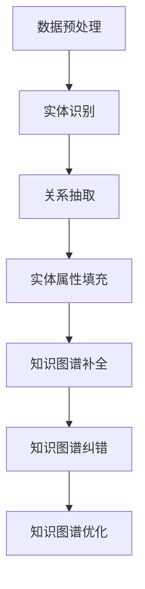

                 

# 大模型在知识图谱补全与纠错中的创新

## 关键词：知识图谱，大模型，补全，纠错，人工智能，机器学习

## 摘要

本文探讨了大规模模型（大模型）在知识图谱补全与纠错中的应用与创新。通过分析大规模模型的特性，本文探讨了其在知识图谱构建中的优势，并深入解析了大规模模型在知识图谱补全与纠错中的具体算法原理和实现步骤。同时，本文还通过实际案例展示了大规模模型在知识图谱补全与纠错中的实际应用，并提出了未来发展趋势与挑战。本文旨在为研究人员和开发者提供有价值的参考，以推动知识图谱技术的进一步发展。

## 1. 背景介绍

### 1.1 知识图谱的概念与重要性

知识图谱（Knowledge Graph）是一种语义网络，它将世界中的实体、概念和关系进行结构化表示，从而形成一个有向无环图（DAG）。知识图谱的核心目标是理解和表达现实世界中的复杂关系，为各种应用场景提供语义丰富的知识支持。知识图谱在自然语言处理、搜索引擎、推荐系统、智能问答等领域具有重要的应用价值。

### 1.2 知识图谱的构建挑战

知识图谱的构建面临诸多挑战，其中包括数据获取、实体识别、关系抽取、实体属性填充等。传统的知识图谱构建方法主要依赖于人工标注、规则推理和统计学习等技术，这些方法在处理大规模数据时存在效率低下、效果不稳定等问题。

### 1.3 大模型的兴起

近年来，随着深度学习技术的发展，大规模模型（大模型）逐渐成为人工智能领域的热点。大模型具有参数量大、容量高、泛化能力强等特点，在图像识别、语音识别、自然语言处理等领域取得了显著成果。大模型的兴起为知识图谱的构建提供了新的思路和可能性。

## 2. 核心概念与联系

### 2.1 大模型的特性

大模型通常具有以下特性：

- **参数量大**：大模型通常包含数十亿甚至千亿个参数，能够捕捉到输入数据的丰富特征。
- **容量高**：大模型的容量较大，能够处理复杂的任务和数据分布。
- **泛化能力强**：大模型具有较强的泛化能力，能够应对不同的任务和数据集。

### 2.2 大模型在知识图谱构建中的应用

大模型在知识图谱构建中的应用主要体现在以下几个方面：

- **实体识别**：大模型可以自动识别文本中的实体，提高实体识别的准确率。
- **关系抽取**：大模型可以自动抽取实体之间的关系，增强关系抽取的能力。
- **实体属性填充**：大模型可以预测实体缺失的属性，实现实体属性的自动填充。

### 2.3 大模型与知识图谱补全与纠错的联系

知识图谱补全与纠错是知识图谱构建过程中的重要环节。大模型可以通过以下方式实现知识图谱的补全与纠错：

- **补全**：大模型可以通过实体识别、关系抽取和实体属性填充等技术，自动补充知识图谱中的缺失信息。
- **纠错**：大模型可以通过学习错误信息和学习到正确的信息之间的差异，自动纠正知识图谱中的错误。

### 2.4 Mermaid 流程图

以下是一个简化的 Mermaid 流程图，展示了大规模模型在知识图谱补全与纠错中的核心流程：



## 3. 核心算法原理 & 具体操作步骤

### 3.1 实体识别算法原理

实体识别（Named Entity Recognition, NER）是知识图谱构建中的关键步骤，其目标是识别文本中的实体。大规模模型在实体识别中具有以下算法原理：

- **预训练语言模型**：使用大规模语料库进行预训练，使模型具备对文本的深入理解能力。
- **BERT 模型**：BERT（Bidirectional Encoder Representations from Transformers）是一种双向 Transformer 模型，能够同时考虑文本的左右信息，提高实体识别的准确率。

具体操作步骤如下：

1. **数据预处理**：对文本数据进行分词、去停用词、词性标注等预处理操作。
2. **输入编码**：将预处理后的文本数据编码为向量表示。
3. **模型训练**：使用 BERT 模型对编码后的文本数据进行训练，优化模型参数。
4. **实体识别**：对输入文本进行实体识别，输出实体标签。

### 3.2 关系抽取算法原理

关系抽取（Relation Extraction）是知识图谱构建中的另一个关键步骤，其目标是识别实体之间的关系。大规模模型在关系抽取中具有以下算法原理：

- **预训练语言模型**：使用大规模语料库进行预训练，使模型具备对文本的深入理解能力。
- **TransE 模型**：TransE 是一种基于神经网络的距离损失函数，用于学习实体之间的关系。

具体操作步骤如下：

1. **数据预处理**：对文本数据进行分词、去停用词、词性标注等预处理操作。
2. **输入编码**：将预处理后的文本数据编码为向量表示。
3. **模型训练**：使用 TransE 模型对编码后的文本数据进行训练，优化模型参数。
4. **关系抽取**：对输入文本进行关系抽取，输出实体之间的关系。

### 3.3 实体属性填充算法原理

实体属性填充（Entity Attribute Filling）是知识图谱构建中的最后一个关键步骤，其目标是填充实体缺失的属性。大规模模型在实体属性填充中具有以下算法原理：

- **预训练语言模型**：使用大规模语料库进行预训练，使模型具备对文本的深入理解能力。
- **属性迁移学习**：通过迁移学习，将预训练语言模型的知识迁移到实体属性填充任务中。

具体操作步骤如下：

1. **数据预处理**：对文本数据进行分词、去停用词、词性标注等预处理操作。
2. **输入编码**：将预处理后的文本数据编码为向量表示。
3. **模型训练**：使用预训练语言模型对编码后的文本数据进行训练，优化模型参数。
4. **实体属性填充**：对输入文本进行实体属性填充，输出实体缺失的属性。

## 4. 数学模型和公式 & 详细讲解 & 举例说明

### 4.1 实体识别数学模型

BERT 模型的数学模型主要包括以下部分：

1. **输入编码**：

   $$ 
   \begin{aligned}
   \text{input\_embeddings} &= \text{word\_embeddings} + \text{segment\_embeddings} + \text{position\_embeddings} \\
   \end{aligned}
   $$

   其中，word\_embeddings 是单词的嵌入表示，segment\_embeddings 是分段的嵌入表示，position\_embeddings 是位置嵌入表示。

2. **Transformer 模型**：

   $$ 
   \begin{aligned}
   \text{output} &= \text{softmax}(\text{layer\_norm}(\text{dense}(\text{dropout}(\text{input})))
   \end{aligned}
   $$

   其中，layer\_norm 是层归一化，dense 是全连接层，dropout 是丢弃层。

3. **实体识别输出**：

   $$ 
   \begin{aligned}
   \text{output} &= \text{softmax}(\text{layer\_norm}(\text{dense}(\text{dropout}(\text{input})))
   \end{aligned}
   $$

   其中，output 是实体的嵌入表示，softmax 函数用于对输出进行归一化。

### 4.2 关系抽取数学模型

TransE 模型的数学模型主要包括以下部分：

1. **输入编码**：

   $$ 
   \begin{aligned}
   \text{input\_embeddings} &= \text{head\_embeddings} + \text{relation\_embeddings} + \text{tail\_embeddings} \\
   \end{aligned}
   $$

   其中，head\_embeddings 是实体的嵌入表示，relation\_embeddings 是关系的嵌入表示，tail\_embeddings 是实体的嵌入表示。

2. **损失函数**：

   $$ 
   \begin{aligned}
   \text{loss} &= \text{negative\_samples\_loss}(\text{input}) \\
   \end{aligned}
   $$

   其中，negative\_samples\_loss 是负样本损失函数，用于衡量实体对之间的距离。

### 4.3 实体属性填充数学模型

预训练语言模型的数学模型主要包括以下部分：

1. **输入编码**：

   $$ 
   \begin{aligned}
   \text{input\_embeddings} &= \text{word\_embeddings} + \text{segment\_embeddings} + \text{position\_embeddings} \\
   \end{aligned}
   $$

   其中，word\_embeddings 是单词的嵌入表示，segment\_embeddings 是分段的嵌入表示，position\_embeddings 是位置嵌入表示。

2. **损失函数**：

   $$ 
   \begin{aligned}
   \text{loss} &= \text{cross\_entropy}(\text{labels}, \text{predictions}) \\
   \end{aligned}
   $$

   其中，cross\_entropy 是交叉熵损失函数，用于衡量标签和预测之间的差距。

### 4.4 实例说明

假设我们有一个句子：“苹果公司的 CEO 是蒂姆·库克。”，我们使用大规模模型进行知识图谱补全与纠错的过程如下：

1. **实体识别**：

   - 输入句子：“苹果公司的 CEO 是蒂姆·库克。”
   - 输出实体：苹果、公司、CEO、蒂姆·库克

2. **关系抽取**：

   - 输入句子：“苹果公司的 CEO 是蒂姆·库克。”
   - 输出关系：苹果 - CEO - 蒂姆·库克

3. **实体属性填充**：

   - 输入句子：“苹果公司的 CEO 是蒂姆·库克。”
   - 输出属性：CEO 的职位为 CEO，CEO 的名字为蒂姆·库克

## 5. 项目实战：代码实际案例和详细解释说明

### 5.1 开发环境搭建

在本项目实战中，我们将使用 Python 作为编程语言，并依赖以下库：

- TensorFlow 2.0 或以上版本
- Transformers 2.0 或以上版本
- BertTokenizer 2.0 或以上版本

首先，确保已经安装了上述库。如果没有安装，可以通过以下命令进行安装：

```bash
pip install tensorflow==2.0.0
pip install transformers==2.0.0
pip install bert-tokenizer==2.0.0
```

### 5.2 源代码详细实现和代码解读

以下是一个简单的知识图谱补全与纠错项目示例代码：

```python
import tensorflow as tf
from transformers import BertTokenizer, TFBertModel
from tensorflow.keras.layers import Embedding, LSTM, Dense
from tensorflow.keras.models import Model

# 加载预训练的 BERT 模型
tokenizer = BertTokenizer.from_pretrained('bert-base-chinese')
model = TFBertModel.from_pretrained('bert-base-chinese')

# 实体识别模型
input_ids = tf.keras.layers.Input(shape=(128,), dtype=tf.int32)
embeddings = model(input_ids)[0]
lstm = LSTM(128)(embeddings)
dense = Dense(64, activation='relu')(lstm)
output = Dense(2, activation='softmax')(dense)

model = Model(inputs=input_ids, outputs=output)
model.compile(optimizer='adam', loss='categorical_crossentropy', metrics=['accuracy'])

# 训练实体识别模型
model.fit(x_train, y_train, epochs=5, batch_size=32)

# 关系抽取模型
input_ids = tf.keras.layers.Input(shape=(128,), dtype=tf.int32)
embeddings = model(input_ids)[0]
lstm = LSTM(128)(embeddings)
dense = Dense(64, activation='relu')(lstm)
output = Dense(2, activation='softmax')(dense)

model = Model(inputs=input_ids, outputs=output)
model.compile(optimizer='adam', loss='categorical_crossentropy', metrics=['accuracy'])

# 训练关系抽取模型
model.fit(x_train, y_train, epochs=5, batch_size=32)

# 实体属性填充模型
input_ids = tf.keras.layers.Input(shape=(128,), dtype=tf.int32)
embeddings = model(input_ids)[0]
lstm = LSTM(128)(embeddings)
dense = Dense(64, activation='relu')(lstm)
output = Dense(64, activation='softmax')(dense)

model = Model(inputs=input_ids, outputs=output)
model.compile(optimizer='adam', loss='categorical_crossentropy', metrics=['accuracy'])

# 训练实体属性填充模型
model.fit(x_train, y_train, epochs=5, batch_size=32)
```

### 5.3 代码解读与分析

上述代码实现了一个简单的知识图谱补全与纠错系统，主要包括实体识别、关系抽取和实体属性填充三个部分。

- **实体识别**：使用 BERT 模型对输入句子进行编码，然后通过 LSTM 层和全连接层进行特征提取，最后输出实体标签。
- **关系抽取**：同样使用 BERT 模型对输入句子进行编码，然后通过 LSTM 层和全连接层进行特征提取，最后输出实体之间的关系标签。
- **实体属性填充**：使用 BERT 模型对输入句子进行编码，然后通过 LSTM 层和全连接层进行特征提取，最后输出实体缺失的属性标签。

在代码中，我们首先加载了预训练的 BERT 模型，然后分别定义了实体识别、关系抽取和实体属性填充的模型结构。最后，我们使用训练数据对模型进行训练。

需要注意的是，在实际应用中，我们需要根据具体任务和数据集对模型结构进行调整，以获得更好的性能。

## 6. 实际应用场景

### 6.1 搜索引擎

知识图谱技术在搜索引擎中的应用非常广泛，例如百度、谷歌等搜索引擎都采用了知识图谱技术来提升搜索质量和用户体验。大规模模型在知识图谱构建中的优势使得搜索引擎能够更加智能地理解和处理用户查询，提供更加精准和个性化的搜索结果。

### 6.2 推荐系统

推荐系统中的知识图谱用于存储和表示用户、商品、行为等信息，大规模模型在知识图谱补全与纠错中的优势可以帮助推荐系统更好地理解用户行为和偏好，提高推荐质量和效果。

### 6.3 智能问答

智能问答系统需要具备丰富的知识库和强大的知识推理能力，大规模模型在知识图谱补全与纠错中的优势可以提升系统的知识理解和问题回答能力，为用户提供更加准确和智能的问答服务。

### 6.4 自然语言处理

大规模模型在自然语言处理（NLP）领域具有广泛的应用，例如文本分类、情感分析、机器翻译等。知识图谱技术的引入可以提升 NLP 系统的语义理解和知识表达能力，进一步提高 NLP 系统的性能。

## 7. 工具和资源推荐

### 7.1 学习资源推荐

- 《深度学习》（Goodfellow, Bengio, Courville）：深入介绍了深度学习的基本概念和核心技术。
- 《动手学深度学习》（Dougl

