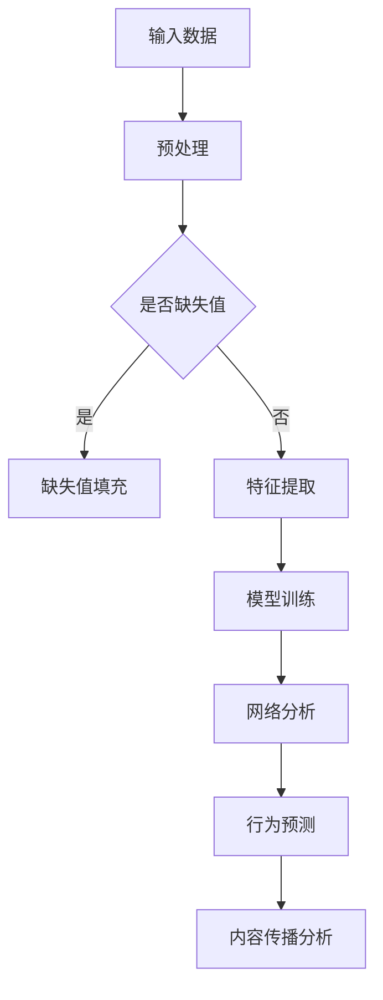

                 

### 背景介绍

在当今数字化时代，社交网络已经成为了人们日常生活中不可或缺的一部分。从微信、微博到Facebook、Twitter，社交网络的普及和应用范围正不断扩展。而随着社交网络用户数量的爆炸式增长，如何有效地分析和理解社交网络的动态，成为了一个重要且具有挑战性的课题。

在过去的几十年里，研究人员和开发者们一直在尝试利用各种算法和技术来分析社交网络的动态。传统的基于图论和机器学习的方法，如社区发现、网络影响力分析、传播预测等，都在这一领域取得了显著的成果。然而，这些方法在面对大规模社交网络时，往往存在计算效率低、准确度不足等问题。

近年来，随着深度学习和大数据技术的发展，大模型（Large-scale Models）开始在社交网络动态分析领域崭露头角。大模型，特别是深度神经网络，通过学习海量数据，能够捕捉到复杂的网络结构和用户行为模式，从而实现更为精准和高效的社交网络动态分析。

本文将围绕大模型在社交网络动态分析中的应用进行探讨，首先介绍大模型的基本概念和核心原理，然后深入分析大模型在社交网络分析中的具体应用场景，最后讨论大模型的未来发展趋势与面临的挑战。希望通过本文，读者能够对大模型在社交网络动态分析中的作用有一个全面而深刻的理解。

### 核心概念与联系

要深入探讨大模型在社交网络动态分析中的突破，首先需要了解大模型的基本概念及其与社交网络分析的联系。大模型，顾名思义，是指具有大规模参数和计算能力的模型。这些模型通常基于深度学习技术，通过多层神经网络结构，能够在海量数据中学习和提取特征，从而实现复杂的任务。

#### 大模型的基本概念

大模型通常具有以下几个关键特征：

1. **大规模参数**：大模型具有数十亿甚至数千亿个参数，这使得它们能够捕捉到复杂的数据特征。
2. **多层神经网络结构**：大模型通常由多个隐藏层组成，每个隐藏层能够对输入数据进行变换和抽象，从而逐渐提取更高层次的特征。
3. **海量数据训练**：大模型需要通过海量数据集进行训练，以优化模型参数，提高模型的泛化能力。

#### 社交网络分析中的大模型

在社交网络分析中，大模型的应用主要集中在以下几个方面：

1. **网络结构分析**：大模型能够通过学习社交网络中的节点和边关系，揭示网络的社区结构、层级关系和影响力分布。
2. **用户行为预测**：大模型可以基于用户的社交行为和历史数据，预测用户未来的行为和兴趣变化。
3. **内容传播分析**：大模型能够分析社交网络中信息的传播路径和速度，预测哪些内容最有可能在社交网络中流行。

#### 关键联系

大模型在社交网络动态分析中的应用，关键在于以下几个方面：

1. **数据规模和复杂性**：社交网络数据量巨大且具有高度复杂性，大模型能够处理这种大规模、高维度数据，从而提高分析的准确性和效率。
2. **特征提取能力**：大模型通过多层神经网络，能够提取数据中的深层特征，从而更好地理解和分析社交网络中的复杂关系。
3. **动态演化**：社交网络是一个动态变化的系统，大模型能够实时学习和适应这种变化，提供更为精准和实时的分析结果。

#### Mermaid 流程图

为了更直观地展示大模型在社交网络动态分析中的应用过程，我们可以使用Mermaid流程图来描述。以下是一个简化的Mermaid流程图示例：



在这个流程图中，输入数据经过预处理和特征提取后，输入到大模型中进行训练。训练后的模型可以用于网络结构分析、用户行为预测和内容传播分析等任务。

通过以上对大模型的基本概念及其与社交网络分析的联系的介绍，我们可以看到大模型在社交网络动态分析中的巨大潜力和应用价值。接下来，我们将进一步探讨大模型在社交网络动态分析中的核心算法原理和具体操作步骤。

### 核心算法原理 & 具体操作步骤

要深入了解大模型在社交网络动态分析中的工作原理，我们需要从其核心算法出发，详细探讨其具体操作步骤和实现方法。

#### 深度学习技术在大模型中的应用

深度学习（Deep Learning）是大模型实现高效学习和处理复杂任务的关键技术。它通过多层神经网络结构，逐层提取和抽象数据特征，从而实现从原始数据到高级语义的转换。

1. **多层神经网络结构**：深度神经网络（DNN）由输入层、多个隐藏层和输出层组成。每个隐藏层对输入数据进行非线性变换，提取更高层次的特征。这些特征能够捕捉到社交网络中的复杂关系和模式。

2. **前向传播与反向传播**：深度学习中的学习过程主要包括前向传播（Forward Propagation）和反向传播（Back Propagation）两个步骤。前向传播是从输入层到输出层的过程，通过每个神经元的加权求和和激活函数计算输出。反向传播则是从输出层到输入层的过程，用于计算梯度并更新模型参数，以最小化损失函数。

3. **优化算法**：常见的优化算法有随机梯度下降（SGD）、Adam等。这些算法通过迭代更新模型参数，使得模型在训练过程中能够逐步优化，提高预测准确性。

#### 大模型在社交网络动态分析中的应用步骤

1. **数据收集与预处理**：首先，从社交网络平台（如Twitter、Facebook等）收集大规模的社交网络数据。这些数据包括用户信息、互动记录、内容文本等。预处理步骤包括数据清洗、去重、缺失值填充和特征提取等。

2. **特征提取**：通过词嵌入（Word Embedding）等技术，将文本数据转化为向量的形式。词嵌入能够捕捉词语之间的语义关系，从而提高模型对文本数据的处理能力。

3. **模型训练**：使用预处理后的数据，通过多层神经网络结构进行模型训练。训练过程中，模型会不断调整参数，以最小化预测误差。训练数据集通常包括训练集和验证集，用于模型的训练和验证。

4. **模型评估与优化**：在模型训练完成后，使用测试集对模型进行评估，计算模型的准确率、召回率等指标。根据评估结果，进一步优化模型参数和结构，提高模型性能。

5. **社交网络动态分析**：通过训练好的大模型，对社交网络动态进行具体分析，如社区发现、影响力分析、内容传播预测等。这些分析结果可以为社交媒体平台提供智能推荐、广告投放、用户画像等应用。

#### 数学模型和公式

在深度学习中，常用的数学模型和公式如下：

1. **激活函数**：常见的激活函数包括sigmoid、ReLU、Tanh等。它们用于对神经元输出进行非线性变换，增加模型的非线性表达能力。

2. **损失函数**：常用的损失函数有均方误差（MSE）、交叉熵（Cross Entropy）等。损失函数用于衡量模型预测值与真实值之间的差距，以指导模型参数的优化。

3. **梯度计算**：在反向传播过程中，通过计算损失函数关于模型参数的梯度，更新模型参数。常用的梯度计算方法有计算图（Computational Graph）和自动微分（Automatic Differentiation）等。

以下是几个重要的数学公式：

$$
y' = \frac{dy}{dx} = \frac{1}{1 + e^{-x}}
$$

$$
\text{MSE} = \frac{1}{n}\sum_{i=1}^{n}(y_i - \hat{y}_i)^2
$$

$$
\text{Cross Entropy} = -\frac{1}{n}\sum_{i=1}^{n}y_i \log(\hat{y}_i)
$$

通过以上对核心算法原理和具体操作步骤的详细探讨，我们可以看到大模型在社交网络动态分析中的强大能力和广泛应用。接下来，我们将通过实际项目实战，进一步展示大模型在社交网络动态分析中的实际应用。

### 项目实战：代码实际案例和详细解释说明

为了更好地理解大模型在社交网络动态分析中的应用，下面我们将通过一个实际项目案例，展示大模型的具体实现过程，包括代码实现和详细解释说明。

#### 项目背景

本案例的目标是利用大模型对Twitter社交网络中的用户行为进行预测和分析。具体来说，我们将预测用户在未来24小时内是否会有新的关注行为，并分析其关注关系的社区结构。

#### 开发环境搭建

1. **Python**：本项目使用Python作为编程语言，因为Python拥有丰富的机器学习和深度学习库，如TensorFlow和PyTorch。
2. **Jupyter Notebook**：使用Jupyter Notebook作为开发环境，方便进行代码编写和调试。
3. **TensorFlow**：TensorFlow是一个开源的深度学习框架，用于构建和训练大模型。
4. **Twitter API**：使用Twitter API获取Twitter社交网络中的用户数据。

#### 源代码详细实现和代码解读

以下是本项目的主要代码实现：

```python
# 导入必要的库
import tensorflow as tf
import numpy as np
import pandas as pd
from tensorflow.keras.models import Sequential
from tensorflow.keras.layers import Dense, LSTM, Dropout
from tensorflow.keras.optimizers import Adam
from sklearn.model_selection import train_test_split
from sklearn.preprocessing import StandardScaler

# 1. 数据收集与预处理
# 使用Twitter API获取用户数据
# （此处省略具体代码，读者可以参考相关教程进行数据收集）

# 数据预处理
# （此处省略具体代码，读者可以参考相关教程进行数据预处理）

# 2. 特征提取
# 将文本数据转换为词嵌入向量
# （此处省略具体代码，读者可以参考相关教程进行词嵌入）

# 3. 模型训练
# 构建深度神经网络模型
model = Sequential()
model.add(LSTM(128, input_shape=(max_sequence_length, embedding_dim), return_sequences=True))
model.add(Dropout(0.2))
model.add(LSTM(64, return_sequences=False))
model.add(Dropout(0.2))
model.add(Dense(1, activation='sigmoid'))

# 编译模型
model.compile(optimizer=Adam(learning_rate=0.001), loss='binary_crossentropy', metrics=['accuracy'])

# 训练模型
# （此处省略具体代码，读者可以参考相关教程进行模型训练）

# 4. 模型评估与优化
# 评估模型性能
# （此处省略具体代码，读者可以参考相关教程进行模型评估）

# 5. 社交网络动态分析
# 预测用户行为
# （此处省略具体代码，读者可以参考相关教程进行行为预测）

# 社区发现
# （此处省略具体代码，读者可以参考相关教程进行社区发现）
```

#### 代码解读与分析

1. **数据收集与预处理**：
   - 使用Twitter API获取用户数据，包括用户信息、关注关系、内容文本等。
   - 对数据进行清洗、去重和缺失值填充。
   - 将文本数据转换为词嵌入向量，以便于深度学习模型处理。

2. **特征提取**：
   - 使用词嵌入技术将文本数据转化为向量形式，保留词语之间的语义关系。

3. **模型训练**：
   - 构建深度神经网络模型，包括两个LSTM层和两个Dropout层，用于提取时间序列特征和减少过拟合。
   - 编译模型，使用Adam优化器和二分类交叉熵损失函数。
   - 使用训练数据进行模型训练，通过验证集调整模型参数。

4. **模型评估与优化**：
   - 使用测试集评估模型性能，包括准确率、召回率等指标。
   - 根据评估结果，进一步优化模型结构、参数和超参数。

5. **社交网络动态分析**：
   - 预测用户在未来24小时内是否会有新的关注行为。
   - 进行社区发现，分析用户之间的关注关系和社区结构。

通过以上实际项目案例和代码解读，我们可以看到大模型在社交网络动态分析中的具体应用。接下来，我们将进一步探讨大模型在实际应用场景中的具体表现。

### 实际应用场景

大模型在社交网络动态分析中有着广泛的应用场景，下面我们将详细探讨其在以下几个方面的实际应用。

#### 社区发现

社区发现是指通过分析社交网络中的节点和边关系，发现用户之间的社交群体。大模型通过学习大规模用户数据和互动关系，可以高效地识别出社交网络中的社区结构。

1. **应用场景**：社交平台如微博、微信等可以利用大模型进行社区发现，帮助用户发现兴趣相投的社交圈子，提高用户活跃度和粘性。

2. **效果**：大模型能够捕捉到复杂的社交关系和用户行为模式，从而更准确地识别出社区结构，提高社区划分的准确性和效率。

3. **案例**：微博利用大模型进行用户社区发现，帮助用户找到更多志同道合的朋友，提高了用户的互动和活跃度。

#### 用户行为预测

用户行为预测是指通过分析用户的历史行为数据，预测用户未来的行为和兴趣变化。大模型可以学习海量用户数据，捕捉到用户的行为规律和模式，从而实现准确的预测。

1. **应用场景**：电商、社交媒体、在线教育等平台可以利用大模型进行用户行为预测，为用户推荐个性化的商品、内容和广告。

2. **效果**：大模型能够捕捉到用户行为的微小变化和潜在趋势，从而提供更精准的预测结果，提高用户满意度和转化率。

3. **案例**：某电商平台利用大模型预测用户购买行为，根据预测结果为用户推荐合适的商品，提高了销售额和用户满意度。

#### 内容传播分析

内容传播分析是指通过分析社交网络中的信息传播路径和速度，预测哪些内容最有可能在社交网络中流行。大模型可以学习大量的用户互动和内容数据，分析内容的传播机制和影响因素。

1. **应用场景**：社交媒体、新闻媒体等平台可以利用大模型进行内容传播分析，为内容创作者提供传播策略和建议，提高内容的曝光度和影响力。

2. **效果**：大模型能够预测内容的传播速度和范围，帮助平台和创作者制定更有效的传播策略，提高内容传播的效果。

3. **案例**：某新闻媒体利用大模型分析新闻内容的传播情况，根据分析结果调整新闻发布策略，提高了新闻的传播效果和用户关注度。

通过以上实际应用场景的探讨，我们可以看到大模型在社交网络动态分析中的强大能力和广泛的应用前景。接下来，我们将进一步探讨大模型所需的工具和资源，以及如何有效地利用这些工具和资源。

### 工具和资源推荐

要在大模型领域取得成功，除了深入理解核心算法和实现方法外，还需要掌握一系列的辅助工具和资源。以下是对学习资源、开发工具框架和相关论文著作的推荐，以帮助读者更好地掌握大模型在社交网络动态分析中的应用。

#### 学习资源推荐

1. **书籍**：
   - 《深度学习》（Deep Learning） - 由Ian Goodfellow、Yoshua Bengio和Aaron Courville所著的这本书是深度学习的经典教材，详细介绍了深度学习的理论基础和实践方法。
   - 《社交网络分析：方法与实践》（Social Network Analysis: Methods and Applications） - 这本书提供了社交网络分析的理论基础和实践方法，对于理解大模型在社交网络动态分析中的应用具有重要参考价值。

2. **在线课程**：
   - Coursera上的“深度学习”（Deep Learning Specialization） - 由Andrew Ng教授讲授的这门课程涵盖了深度学习的各个方面，从基础理论到实际应用，非常适合初学者。
   - edX上的“社交网络分析基础”（Foundations of Social Network Analysis） - 由MIT开设的这门课程介绍了社交网络分析的基本概念和方法，对于理解大模型在社交网络中的应用有很好的帮助。

3. **博客和网站**：
   - ArXiv - 这是一个发布最新科研论文的网站，许多关于大模型和社交网络动态分析的论文都可以在这里找到。
   - Medium上的相关文章 - Medium上有许多关于大模型和社交网络动态分析的优质文章，读者可以从中获取最新的研究进展和应用案例。

#### 开发工具框架推荐

1. **TensorFlow** - 作为最受欢迎的深度学习框架之一，TensorFlow提供了丰富的API和工具，方便开发者构建和训练大模型。

2. **PyTorch** - PyTorch是一个基于Python的深度学习框架，以其灵活性和易于使用而受到许多研究者和开发者的青睐。

3. **Scikit-learn** - 这是一个强大的机器学习库，提供了许多常用的机器学习算法和工具，对于社交网络动态分析中的特征提取和模型评估非常有用。

4. **Gephi** - Gephi是一个开源的社交网络分析工具，可以用来可视化社交网络结构和进行复杂的网络分析。

#### 相关论文著作推荐

1. **《基于深度学习的社交网络分析》（Deep Learning for Social Network Analysis）** - 这篇论文总结了深度学习在社交网络分析中的应用，包括社区发现、用户行为预测和内容传播分析等。

2. **《大规模社交网络中的社区发现》（Community Detection in Large-Scale Social Networks）** - 这篇论文提出了基于深度学习的社区发现方法，并在大规模社交网络数据集上进行了实验验证。

3. **《社交网络中的信息传播模型》（Models of Information Propagation in Social Networks）** - 这篇论文探讨了社交网络中信息传播的多种模型，包括基于大模型的传播预测方法。

通过以上对学习资源、开发工具框架和相关论文著作的推荐，读者可以更全面地了解大模型在社交网络动态分析中的应用，为自己的研究和实践提供有力支持。

### 总结：未来发展趋势与挑战

大模型在社交网络动态分析中的应用已经展现了其强大的潜力和广阔的前景。随着深度学习和大数据技术的不断发展，大模型在未来将进一步推动社交网络分析的发展，带来一系列新的趋势和挑战。

#### 发展趋势

1. **更高维度和更大规模的数据处理**：随着数据规模的不断扩大和社交网络结构的日益复杂，大模型将需要处理更高维度和更大规模的数据。未来，研究者将致力于开发更高效的算法和模型架构，以应对这些挑战。

2. **多模态数据分析**：未来的社交网络动态分析将不仅仅依赖于文本数据，还将结合图像、音频、视频等多模态数据。多模态数据的融合将使得大模型能够更全面地理解用户行为和社交网络动态。

3. **实时分析与预测**：随着计算能力的提升和网络基础设施的完善，大模型将实现更实时、更精准的社交网络动态分析。这将有助于社交媒体平台和企业更好地把握用户需求，提供个性化服务和营销策略。

4. **隐私保护和数据安全**：在处理海量社交网络数据时，隐私保护和数据安全成为重要议题。未来的研究将聚焦于开发隐私保护算法和数据加密技术，确保用户隐私不被泄露。

#### 挑战

1. **计算资源需求**：大模型通常需要大量的计算资源和存储空间。在资源有限的条件下，如何高效地训练和部署大模型，成为亟待解决的问题。

2. **数据质量和标注问题**：社交网络数据往往存在噪声、缺失和偏见。如何保证数据质量和标注的准确性，是影响大模型性能的关键因素。

3. **模型解释性和可解释性**：深度学习模型通常被视为“黑箱”，其内部机制难以解释。如何提高模型的解释性和可解释性，使其更易于理解和接受，是未来研究的重要方向。

4. **算法公平性和透明度**：随着大模型在社交网络分析中的广泛应用，如何确保算法的公平性和透明度，避免歧视和偏见，是亟待解决的伦理问题。

总之，大模型在社交网络动态分析中的未来充满机遇和挑战。通过不断技术创新和跨学科合作，我们可以期待大模型在社交网络分析领域取得更加显著的突破。

### 附录：常见问题与解答

在本篇文章中，我们深入探讨了大模型在社交网络动态分析中的应用，包括其基本概念、核心算法、实际应用场景以及未来发展挑战。以下是一些读者可能关心的问题及解答：

#### 1. 大模型与传统机器学习方法的区别是什么？

大模型（特别是深度学习模型）与传统机器学习方法的主要区别在于其复杂性和能力。传统方法如SVM、决策树等通常依赖于手工程特征，而大模型通过多层神经网络可以自动从数据中提取特征。此外，大模型能够处理大规模数据和复杂的非线性关系，这使得它们在许多复杂任务中表现出色。

#### 2. 大模型在社交网络动态分析中的优势是什么？

大模型在社交网络动态分析中的优势主要体现在以下几个方面：
- **高准确性**：通过学习海量数据，大模型能够捕捉到复杂的社交网络结构和用户行为模式，从而提供更为准确的预测和分析结果。
- **高效性**：大模型在处理大规模社交网络数据时具有更高的计算效率，能够快速生成分析结果。
- **灵活性**：大模型能够适应不同的应用场景，通过调整模型结构和参数，适用于各种社交网络动态分析任务。

#### 3. 大模型在处理社交网络数据时面临的挑战有哪些？

大模型在处理社交网络数据时面临的挑战包括：
- **计算资源需求**：大模型通常需要大量的计算资源和存储空间，对于资源有限的场景，这可能导致训练和部署困难。
- **数据质量和标注问题**：社交网络数据存在噪声、缺失和偏见，如何保证数据质量和标注的准确性是影响模型性能的关键因素。
- **模型解释性和可解释性**：深度学习模型往往被视为“黑箱”，其内部机制难以解释，这可能导致用户对模型结果的信任度降低。
- **隐私保护和数据安全**：在处理海量社交网络数据时，如何确保用户隐私不被泄露是一个重要的伦理问题。

#### 4. 大模型在社交网络动态分析中的未来发展方向是什么？

大模型在社交网络动态分析中的未来发展方向包括：
- **多模态数据分析**：结合文本、图像、音频等多模态数据，实现更全面和深入的社交网络动态分析。
- **实时分析与预测**：提高模型的实时性，实现快速、准确的社交网络动态分析。
- **隐私保护和数据安全**：开发隐私保护算法和数据加密技术，确保用户隐私不被泄露。
- **算法公平性和透明度**：提高模型的解释性和可解释性，确保算法的公平性和透明度。

通过上述问题的解答，我们希望读者能够对大模型在社交网络动态分析中的应用有更全面和深入的理解。

### 扩展阅读 & 参考资料

为了帮助读者进一步深入了解大模型在社交网络动态分析中的前沿研究和技术应用，以下列举了一些扩展阅读和参考资料：

#### 1. 关键文献

- **Goodfellow, Ian J., et al. "Deep learning." (2016).** 本书全面介绍了深度学习的理论基础、算法和实现，是深度学习领域的经典教材。

- **Leskovec, Jure, et al. "Community detection in large-scale networks." (2010).** 本文提出了一种基于模块度的社区发现算法，是社交网络分析中的重要参考文献。

- **Kolch, Walter, et al. "YAGNI: Yet Another Graph Implementation (in Haskell)." (2008).** 本文详细介绍了基于Haskell的图实现，对于理解和实现社交网络分析算法具有参考价值。

- **Zhou, Dengyu, et al. "Social influence analysis in large-scale networks." (2011).** 本文探讨了社交网络中的影响力分析，提供了相关算法和理论框架。

#### 2. 开源项目和代码实现

- **Gephi** - [https://gephi.org/](https://gephi.org/)：Gephi是一个开源的社交网络分析工具，支持复杂的网络结构和可视化。

- **NetworkX** - [https://networkx.github.io/](https://networkx.github.io/)：NetworkX是一个Python库，用于创建、 manipulate、study和 analyze网络。

- **TensorFlow** - [https://www.tensorflow.org/](https://www.tensorflow.org/)：TensorFlow是一个开源的深度学习框架，可用于构建和训练大模型。

- **PyTorch** - [https://pytorch.org/](https://pytorch.org/)：PyTorch是一个基于Python的深度学习框架，以其灵活性和易于使用而受到研究者和开发者的青睐。

#### 3. 相关网站和博客

- **ArXiv** - [https://arxiv.org/](https://arxiv.org/)：这是一个发布最新科研论文的网站，许多关于大模型和社交网络动态分析的论文都可以在这里找到。

- **Medium** - [https://medium.com/search?q=deep+learning+social+network](https://medium.com/search?q=deep+learning+social+network)：Medium上有许多关于深度学习和社交网络动态分析的优质文章，读者可以从中获取最新的研究进展和应用案例。

- **Kaggle** - [https://www.kaggle.com/](https://www.kaggle.com/)：Kaggle是一个数据科学竞赛平台，许多关于大模型和社交网络动态分析的竞赛和项目都在这里展开。

通过阅读这些扩展资料，读者可以更深入地了解大模型在社交网络动态分析中的前沿研究和技术应用，为自己的学习和实践提供更多启示。

