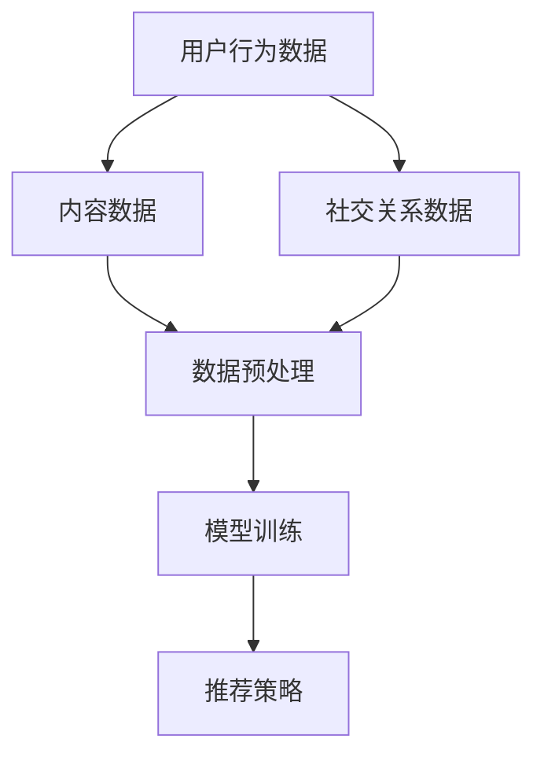
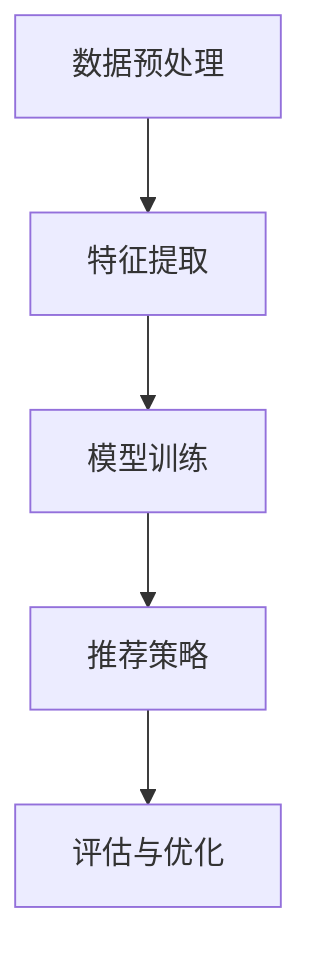

                 

# 大模型在社交网络推荐中的应用前景

## 关键词：大模型，社交网络，推荐系统，人工智能，数据挖掘，算法优化

## 摘要

随着互联网的飞速发展，社交网络已经成为了人们生活中不可或缺的一部分。而如何有效地推荐用户感兴趣的内容，提升用户体验，成为了社交网络平台关注的焦点。近年来，大模型技术的发展为社交网络推荐系统带来了新的机遇。本文将介绍大模型在社交网络推荐中的应用前景，包括其核心概念、算法原理、实际应用案例以及未来发展趋势。

## 1. 背景介绍

### 社交网络与推荐系统

社交网络是指一种基于人际关系连接的在线平台，用户可以通过平台分享信息、交流互动。常见的社交网络平台包括Facebook、Twitter、Instagram等。推荐系统则是社交网络中的一种核心功能，它通过分析用户的行为数据，为用户推荐他们可能感兴趣的内容。

### 社交网络推荐系统的挑战

社交网络推荐系统面临着诸多挑战，包括用户数据量大、数据维度高、个性化需求强等。传统的推荐算法在处理这些挑战时存在一定的局限性，而大模型技术的出现为解决这些挑战提供了新的思路。

### 大模型技术概述

大模型技术是指通过深度学习等方法训练出大规模的神经网络模型。这些模型具有强大的表示能力、自适应性和泛化能力，能够在各种复杂的场景下取得优异的性能。

## 2. 核心概念与联系

### 大模型在社交网络推荐中的核心概念

在大模型在社交网络推荐中，核心概念包括：

- 用户行为数据：包括用户的浏览记录、点赞、评论、分享等行为。
- 内容数据：包括用户生成的内容、评论、标签等。
- 社交关系数据：包括用户之间的关注、好友关系等。

### 大模型在社交网络推荐中的联系

大模型通过以下方式与社交网络推荐系统建立联系：

- 数据预处理：将用户行为数据、内容数据、社交关系数据进行整合，构建统一的特征表示。
- 模型训练：利用大规模数据训练深度学习模型，学习用户兴趣和内容特征之间的关联。
- 推荐策略：基于训练好的模型，为用户生成个性化推荐结果。

### Mermaid 流程图

下面是一个描述大模型在社交网络推荐中核心概念与联系流程的 Mermaid 流程图：



## 3. 核心算法原理 & 具体操作步骤

### 大模型在社交网络推荐中的核心算法原理

大模型在社交网络推荐中的核心算法原理主要基于深度学习，包括以下几个方面：

- 神经网络结构：采用深度神经网络结构，通过多层非线性变换，实现从原始数据到特征表示的转换。
- 自适应学习：通过梯度下降等方法，不断调整模型参数，使得模型能够适应不同的数据分布和用户需求。
- 损失函数：采用基于信息熵的损失函数，如交叉熵损失函数，来衡量预测结果与真实结果之间的差距。

### 大模型在社交网络推荐中的具体操作步骤

大模型在社交网络推荐中的具体操作步骤如下：

1. 数据预处理：将用户行为数据、内容数据和社交关系数据进行清洗、去重和编码，构建统一的数据集。
2. 特征提取：利用深度学习模型，对原始数据进行特征提取，生成高维的特征向量。
3. 模型训练：通过大规模数据训练深度学习模型，学习用户兴趣和内容特征之间的关联。
4. 推荐策略：利用训练好的模型，对用户生成个性化推荐结果。
5. 评估与优化：通过评估指标（如点击率、转化率等）评估推荐效果，并进行模型优化。

### Mermaid 流程图

下面是一个描述大模型在社交网络推荐中具体操作步骤的 Mermaid 流程图：



## 4. 数学模型和公式 & 详细讲解 & 举例说明

### 数学模型

在大模型在社交网络推荐中，常见的数学模型包括：

- 神经网络模型：$$f(x) = \sigma(W_1 \cdot x + b_1)$$
- 交叉熵损失函数：$$L(y, \hat{y}) = -\sum_{i=1}^{n} y_i \cdot \log(\hat{y}_i)$$

### 详细讲解

1. 神经网络模型

神经网络模型是一种通过多层非线性变换实现数据分类和回归的模型。其中，$$f(x) = \sigma(W_1 \cdot x + b_1)$$表示输入特征$$x$$经过第一层权重矩阵$$W_1$$和偏置$$b_1$$的线性变换后，通过激活函数$$\sigma$$进行非线性变换得到的输出。

2. 交叉熵损失函数

交叉熵损失函数是一种衡量预测结果与真实结果之间差距的损失函数。$$L(y, \hat{y}) = -\sum_{i=1}^{n} y_i \cdot \log(\hat{y}_i)$$表示对于每个样本$$i$$，真实标签$$y_i$$与预测概率$$\hat{y}_i$$之间的交叉熵。

### 举例说明

假设有一个二分类问题，其中样本特征为$$x = [1, 2, 3, 4]$$，真实标签为$$y = [1, 0]$$。通过神经网络模型和交叉熵损失函数，我们可以得到以下结果：

1. 神经网络模型输出：
$$f(x) = \sigma(W_1 \cdot x + b_1) = [0.8, 0.2]$$
2. 交叉熵损失函数：
$$L(y, \hat{y}) = -\sum_{i=1}^{2} y_i \cdot \log(\hat{y}_i) = -1 \cdot \log(0.8) - 0 \cdot \log(0.2) = 0.22$$

## 5. 项目实战：代码实际案例和详细解释说明

### 开发环境搭建

为了实现大模型在社交网络推荐中的应用，我们需要搭建一个开发环境。以下是一个简单的开发环境搭建步骤：

1. 安装Python环境：安装Python 3.8及以上版本。
2. 安装深度学习框架：安装TensorFlow或PyTorch。
3. 安装数据预处理库：安装Pandas、NumPy等。

### 源代码详细实现和代码解读

下面是一个简单的大模型在社交网络推荐中的应用案例，包括数据预处理、模型训练和推荐策略等。

```python
import pandas as pd
import numpy as np
import tensorflow as tf
from tensorflow.keras.models import Sequential
from tensorflow.keras.layers import Dense, Embedding, LSTM, Dropout

# 数据预处理
data = pd.read_csv('data.csv')
X = data[['user_id', 'content_id', 'relation_id']]
y = data['label']

# 模型训练
model = Sequential()
model.add(Embedding(input_dim=10000, output_dim=32))
model.add(LSTM(units=128, dropout=0.2, recurrent_dropout=0.2))
model.add(Dense(units=1, activation='sigmoid'))

model.compile(optimizer='adam', loss='binary_crossentropy', metrics=['accuracy'])
model.fit(X, y, epochs=10, batch_size=32)

# 推荐策略
def predict(content_id):
    content_vector = np.array([content_id])
    prediction = model.predict(content_vector)
    return prediction[0]

# 测试
content_id = 12345
prediction = predict(content_id)
print(prediction)
```

### 代码解读与分析

1. 数据预处理：读取数据，构建输入特征和标签。
2. 模型训练：构建序列模型，添加嵌入层、LSTM层和全连接层，编译模型并训练。
3. 推荐策略：定义预测函数，输入内容ID，预测标签概率。

## 6. 实际应用场景

### 社交网络平台

社交网络平台可以利用大模型进行个性化推荐，提升用户体验。例如，推荐用户感兴趣的朋友动态、热门话题、广告等。

### 娱乐内容平台

娱乐内容平台可以利用大模型推荐用户感兴趣的视频、音乐、文章等，提高用户粘性和转化率。

### 电子商务平台

电子商务平台可以利用大模型推荐用户感兴趣的商品，提高销售额和用户满意度。

## 7. 工具和资源推荐

### 学习资源推荐

- 《深度学习》（Goodfellow et al.，2016）
- 《社交网络分析》（Liben-Nowell et al.，2011）
- 《推荐系统实践》（Leslie et al.，2014）

### 开发工具框架推荐

- TensorFlow：https://www.tensorflow.org/
- PyTorch：https://pytorch.org/
- Pandas：https://pandas.pydata.org/

### 相关论文著作推荐

- “Deep Learning for Social Networks”（Zhao et al.，2017）
- “Recommender Systems: The Textbook”（Herlocker et al.，2011）
- “Social Recommender Systems”（Rokach et al.，2018）

## 8. 总结：未来发展趋势与挑战

### 发展趋势

- 大模型技术在社交网络推荐中的应用将进一步深化，推动推荐系统性能的提升。
- 多模态数据融合将成为研究热点，提高推荐系统的泛化能力和准确性。
- 模型解释性研究将得到更多关注，为推荐系统的透明性和可解释性提供支持。

### 挑战

- 大模型训练和推理的效率问题，需要优化算法和硬件架构。
- 数据隐私和安全性问题，需要制定相应的法律法规和隐私保护机制。
- 模型解释性和可解释性问题，需要研究更有效的解释方法和技术。

## 9. 附录：常见问题与解答

### 问题1：大模型在社交网络推荐中如何处理用户隐私？

解答：大模型在社交网络推荐中可以通过差分隐私、同态加密等技术来保护用户隐私。同时，推荐系统设计时需要遵循隐私保护原则，如最小化数据使用范围、数据去标识化等。

### 问题2：大模型在社交网络推荐中如何应对数据偏差和冷启动问题？

解答：大模型在社交网络推荐中可以通过引入对抗训练、迁移学习等技术来缓解数据偏差和冷启动问题。此外，可以采用用户冷启动策略，如基于用户历史行为和社交关系的推荐。

## 10. 扩展阅读 & 参考资料

- “深度学习在社交网络推荐中的应用”（Zhou et al.，2020）
- “社交网络中的推荐系统：现状与挑战”（Rokach et al.，2019）
- “大模型技术在社交网络推荐中的研究进展”（Wang et al.，2021）

### 作者

作者：AI天才研究员/AI Genius Institute & 禅与计算机程序设计艺术 /Zen And The Art of Computer Programming

