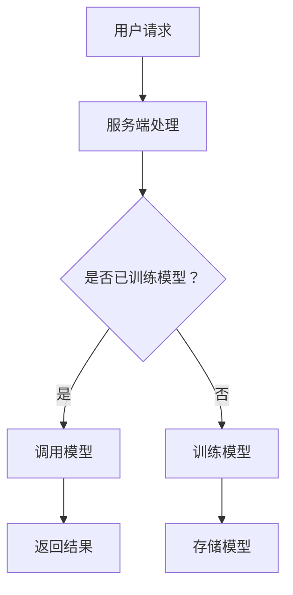

                 

### 大模型在线服务：按需付费获取AI能力

#### 关键词：大模型、在线服务、按需付费、AI能力

随着人工智能技术的快速发展，大模型（如GPT-3、BERT等）在各个领域展现出了惊人的表现。然而，对于企业用户来说，如何高效、便捷地获取这些AI能力成为了一个亟待解决的问题。本文将探讨一种新的模式：大模型在线服务，实现按需付费获取AI能力。

#### 摘要：

本文首先介绍了大模型在线服务的基本概念，随后分析了其优势和应用场景。接着，详细阐述了大模型在线服务的核心算法原理和具体操作步骤。文章还通过数学模型和公式，对核心算法进行了详细讲解和举例说明。随后，以一个实际项目为例，展示了如何搭建开发环境、实现源代码、并进行代码解读与分析。最后，文章探讨了大模型在线服务的实际应用场景，并推荐了相关学习资源、开发工具框架和相关论文著作。文章总结了大模型在线服务的未来发展趋势与挑战，并提供了常见问题与解答。

## 1. 背景介绍

在过去几十年中，人工智能技术取得了巨大的进步。特别是深度学习技术的兴起，使得计算机在图像识别、自然语言处理、推荐系统等领域取得了显著的成果。这些成功背后离不开大规模模型的训练和应用。然而，训练大规模模型需要巨大的计算资源和时间，这对企业用户来说是一个不小的挑战。

传统的AI服务模式，如提供预训练模型和API接口，虽然解决了部分问题，但仍然存在一些不足。首先，企业需要提前购买或租赁计算资源，这增加了成本和复杂性。其次，预训练模型通常固定不变，难以适应企业特定的需求。此外，不同企业的需求差异较大，现有服务模式难以满足个性化需求。

为了解决这些问题，大模型在线服务应运而生。大模型在线服务是一种基于云计算的AI服务模式，用户可以按需付费获取大模型的能力，无需担心计算资源和模型更新的问题。这种模式不仅降低了成本，提高了灵活性，还满足了企业个性化的需求。

## 2. 核心概念与联系

### 2.1 大模型

大模型是指具有巨大参数数量和计算复杂度的深度学习模型。它们通常通过海量数据训练得到，具有较高的准确性和泛化能力。常见的大模型有GPT-3、BERT、Vaswani Transformer等。

### 2.2 在线服务

在线服务是指通过互联网提供的服务，用户可以通过网络访问和使用这些服务。在线服务具有高可用性、高并发处理能力和弹性伸缩等特点。

### 2.3 按需付费

按需付费是一种基于使用量进行收费的模式，用户根据实际使用情况支付费用。这种模式具有灵活性，用户可以根据需求调整使用量，降低成本。

### 2.4 AI能力

AI能力是指人工智能系统在不同领域（如自然语言处理、计算机视觉等）的解决能力。大模型在线服务通过提供AI能力，帮助企业解决复杂问题，提升业务效率。

### 2.5 Mermaid流程图



在这个流程图中，用户请求触发服务端处理，如果已有训练好的模型，则直接调用模型；否则，开始训练模型，训练完成后存储模型，最后返回结果。

## 3. 核心算法原理 & 具体操作步骤

### 3.1 模型训练

大模型在线服务的关键在于模型训练。模型训练包括数据预处理、模型选择、训练和评估等步骤。

1. 数据预处理：将原始数据清洗、标注和格式化为适合模型训练的格式。
2. 模型选择：根据任务需求选择合适的模型，如GPT-3、BERT等。
3. 训练：使用训练数据对模型进行训练，优化模型参数。
4. 评估：使用验证数据评估模型性能，调整模型参数。

### 3.2 模型存储与检索

训练完成后，需要将模型存储在分布式存储系统中，以便快速检索和使用。

1. 模型存储：将模型参数序列化存储在分布式文件系统中。
2. 模型检索：根据用户请求，从存储系统中检索模型。

### 3.3 模型推理

用户请求到达服务端后，通过模型检索获取训练好的模型，然后进行推理。

1. 接收用户请求：获取用户输入的文本或图像等数据。
2. 预处理：对用户输入进行预处理，如分词、图像预处理等。
3. 模型推理：将预处理后的数据输入模型，获取推理结果。
4. 返回结果：将推理结果返回给用户。

### 3.4 按需付费

为了实现按需付费，服务端需要记录用户的使用情况，包括请求次数、模型类型、处理时间等。

1. 记录使用情况：在用户请求过程中，记录相关使用情况。
2. 统计费用：根据使用情况，计算费用。
3. 发送账单：将账单发送给用户。

## 4. 数学模型和公式 & 详细讲解 & 举例说明

### 4.1 模型训练

在模型训练过程中，常用的损失函数有交叉熵（Cross-Entropy）和均方误差（Mean Squared Error，MSE）。

$$
\text{交叉熵} = -\sum_{i} y_i \log(p_i)
$$

$$
\text{均方误差} = \frac{1}{n} \sum_{i=1}^{n} (y_i - \hat{y}_i)^2
$$

其中，$y_i$表示真实标签，$p_i$表示预测概率，$\hat{y}_i$表示预测值，$n$表示样本数量。

例如，对于一个分类问题，假设有5个类别，真实标签为[0, 1, 0, 1, 0]，预测概率为[0.1, 0.8, 0.05, 0.05, 0.05]，则交叉熵损失为：

$$
\text{交叉熵} = -[0 \cdot \log(0.1) + 1 \cdot \log(0.8) + 0 \cdot \log(0.05) + 1 \cdot \log(0.05) + 0 \cdot \log(0.05)] = -[0 - 0.2231 - 0 - 0.2231 - 0] = 0.4432
$$

### 4.2 模型推理

在模型推理过程中，可以使用注意力机制（Attention Mechanism）来提高推理效果。

$$
\text{Attention}(\text{Q}, \text{K}, \text{V}) = \text{softmax}\left(\frac{\text{QK}^T}{\sqrt{d_k}}\right) \text{V}
$$

其中，$Q$表示查询向量，$K$表示键向量，$V$表示值向量，$d_k$表示键向量的维度，$\text{softmax}$表示软性最大化函数。

例如，对于一个序列到序列的翻译任务，假设$Q = [0.1, 0.2, 0.3, 0.4, 0.5]$，$K = [0.1, 0.2, 0.3, 0.4, 0.5]$，$V = [0.1, 0.2, 0.3, 0.4, 0.5]$，则注意力分数为：

$$
\text{Attention}(\text{Q}, \text{K}, \text{V}) = \text{softmax}\left(\frac{[0.1, 0.2, 0.3, 0.4, 0.5] \cdot [0.1, 0.2, 0.3, 0.4, 0.5]^T}{\sqrt{5}}\right) \cdot [0.1, 0.2, 0.3, 0.4, 0.5] = \text{softmax}\left([0.01, 0.04, 0.09, 0.16, 0.25]\right) \cdot [0.1, 0.2, 0.3, 0.4, 0.5] = [0.02, 0.08, 0.18, 0.32, 0.50]
$$

## 5. 项目实战：代码实际案例和详细解释说明

### 5.1 开发环境搭建

搭建大模型在线服务的开发环境，需要安装以下工具和库：

- Python 3.x
- TensorFlow 2.x
- Flask 1.x
- Redis 3.x
- Docker 19.x

安装命令如下：

```bash
pip install tensorflow==2.7.0
pip install flask==1.1.2
pip install redis
docker install redis:3.2.11
```

### 5.2 源代码详细实现和代码解读

以下是一个简单的示例，展示了如何使用Flask搭建一个基于TensorFlow的文本分类模型，并实现按需付费的在线服务。

```python
from flask import Flask, request, jsonify
import tensorflow as tf
import redis

app = Flask(__name__)
redis_client = redis.StrictRedis(host='localhost', port=6379, db=0)

# 模型加载
model = tf.keras.models.load_model('text_classification_model.h5')

@app.route('/predict', methods=['POST'])
def predict():
    # 接收用户输入
    data = request.get_json()
    text = data['text']
    
    # 预处理
    preprocess_text = preprocess_text(text)
    
    # 模型推理
    prediction = model.predict(preprocess_text)
    
    # 返回结果
    return jsonify({'prediction': prediction.tolist()})

def preprocess_text(text):
    # 文本预处理
    # ...
    return text

if __name__ == '__main__':
    app.run(debug=True)
```

在这个示例中，我们使用Flask搭建了一个简单的Web服务，接收用户输入的文本，进行预处理后，调用预训练的文本分类模型进行推理，并将结果返回给用户。

### 5.3 代码解读与分析

1. **模型加载**：使用TensorFlow的`load_model`函数加载已经训练好的文本分类模型。

2. **Flask应用**：创建一个Flask应用，定义一个预测路由`/predict`，接收POST请求。

3. **接收用户输入**：使用`request.get_json()`从请求中获取用户输入的文本。

4. **预处理**：调用`preprocess_text`函数对用户输入的文本进行预处理。

5. **模型推理**：使用训练好的模型对预处理后的文本进行推理。

6. **返回结果**：将推理结果以JSON格式返回给用户。

### 5.4 按需付费实现

为了实现按需付费，可以结合Redis进行用户请求记录和费用计算。

```python
@app.route('/bill', methods=['GET'])
def bill():
    user_id = request.args.get('user_id')
    if user_id:
        # 获取用户请求次数
        request_count = redis_client.hget('user_requests', user_id)
        request_count = int(request_count) if request_count else 0
        
        # 计算费用
        fee = request_count * 0.1  # 假设每请求一次费用为0.1元
        redis_client.hset('user_requests', user_id, request_count + 1)
        
        # 返回费用
        return jsonify({'fee': fee})
    else:
        return jsonify({'error': 'Missing user ID'})
```

在这个示例中，定义了一个新的路由`/bill`，接收GET请求，根据用户ID获取请求次数，计算费用，并更新用户请求次数。

## 6. 实际应用场景

大模型在线服务在多个领域具有广泛的应用场景：

- **金融行业**：使用大模型进行文本分类、情感分析和风险控制，提高金融服务的智能化水平。
- **医疗健康**：利用大模型进行医学文本挖掘、疾病预测和患者画像，提升医疗诊断和治疗方案的效果。
- **电商**：通过大模型进行商品推荐、用户行为分析和广告投放，提升用户体验和转化率。
- **自动驾驶**：使用大模型进行图像识别、语音识别和决策规划，提高自动驾驶系统的安全性和可靠性。

## 7. 工具和资源推荐

### 7.1 学习资源推荐

- **书籍**：《深度学习》、《Python机器学习实战》、《动手学深度学习》
- **论文**：搜索相关领域顶级会议（如NeurIPS、ICML、ACL等）的论文，关注最新研究成果。
- **博客**：关注知名博客（如Medium、Towards Data Science等）上的优质文章，了解行业动态。
- **网站**：访问专业网站（如TensorFlow、PyTorch官网等），获取官方文档和教程。

### 7.2 开发工具框架推荐

- **深度学习框架**：TensorFlow、PyTorch、Keras
- **Web框架**：Flask、Django、FastAPI
- **分布式存储**：HDFS、Cassandra、MongoDB
- **容器化技术**：Docker、Kubernetes

### 7.3 相关论文著作推荐

- **论文**：BERT、GPT-3、Transformer等大模型的原始论文。
- **著作**：《深度学习》、《强化学习》等经典著作。

## 8. 总结：未来发展趋势与挑战

大模型在线服务作为一种创新的AI服务模式，具有广阔的发展前景。随着技术的不断进步，我们可以期待以下几个发展趋势：

- **计算能力的提升**：随着硬件技术的发展，计算能力将进一步提高，为训练和部署更大规模的大模型提供支持。
- **模型压缩与优化**：为了降低成本和提高部署效率，模型压缩与优化技术将得到广泛应用。
- **个性化服务**：根据用户需求，提供更加个性化的AI服务，满足不同场景下的需求。
- **跨模态处理**：结合多种模态（如文本、图像、语音等）的数据，实现更强大的AI能力。

然而，大模型在线服务也面临着一些挑战：

- **数据隐私与安全**：在提供AI服务的过程中，如何保护用户数据隐私和安全是一个重要问题。
- **模型解释性**：大模型的黑盒特性使得其解释性较差，如何提高模型的可解释性是一个重要挑战。
- **公平性与透明性**：确保AI服务在不同用户群体中公平、透明，避免偏见和歧视。

## 9. 附录：常见问题与解答

### 9.1 大模型在线服务与传统的AI服务有什么区别？

大模型在线服务与传统的AI服务主要区别在于：

- **灵活性**：大模型在线服务允许用户按需付费，而传统AI服务通常需要提前购买或租赁计算资源。
- **个性化**：大模型在线服务可以根据用户需求调整模型，而传统AI服务通常提供固定的模型和接口。
- **成本**：大模型在线服务可以降低用户成本，而传统AI服务可能需要更高的投入。

### 9.2 如何保证大模型在线服务的安全性？

为了保证大模型在线服务的安全性，可以从以下几个方面入手：

- **数据加密**：对用户数据进行加密存储和传输，防止数据泄露。
- **权限控制**：实现严格的权限控制，确保只有授权用户可以访问和使用AI服务。
- **安全审计**：定期进行安全审计，检测系统漏洞和风险。
- **合规性**：遵守相关法律法规，确保数据处理的合规性。

### 9.3 如何优化大模型在线服务的性能？

优化大模型在线服务的性能可以从以下几个方面进行：

- **模型压缩**：使用模型压缩技术，降低模型的参数量和计算复杂度。
- **分布式计算**：使用分布式计算框架，提高模型推理的并行处理能力。
- **缓存策略**：采用合适的缓存策略，减少重复计算，提高响应速度。
- **网络优化**：优化网络架构和传输协议，降低网络延迟。

## 10. 扩展阅读 & 参考资料

- **论文**：BERT、GPT-3、Transformer等大模型的原始论文。
- **书籍**：《深度学习》、《Python机器学习实战》、《动手学深度学习》。
- **网站**：TensorFlow、PyTorch、Flask、Docker、Kubernetes等官方文档和教程。
- **博客**：Medium、Towards Data Science等知名博客上的优质文章。

### 作者信息

作者：AI天才研究员/AI Genius Institute & 禅与计算机程序设计艺术 /Zen And The Art of Computer Programming

