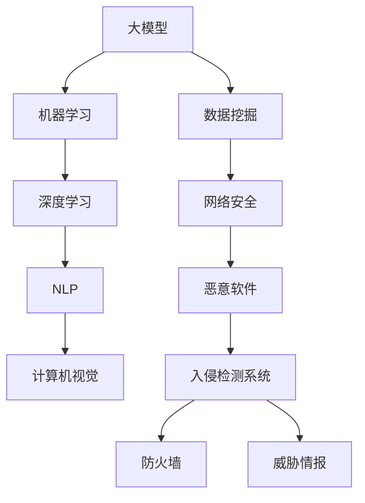

                 

### 背景介绍

在当今数字化时代，网络安全已经成为企业和个人生活中不可或缺的一部分。随着互联网的普及和信息技术的快速发展，网络安全面临着前所未有的挑战。传统的方法和技术手段在应对新型网络攻击、数据泄露和恶意软件方面显得力不从心。因此，寻找新的解决方案和手段来提升网络安全水平成为当务之急。

大模型（Large Models），作为一种先进的机器学习技术，在自然语言处理、图像识别、语音识别等领域取得了显著的成果。大模型的定义是拥有大规模参数和训练数据的模型，它们能够通过深度学习的方式捕捉复杂的数据模式，从而实现高度准确的预测和分类。这些能力使得大模型在网络安全领域也具有了广泛的应用前景。

网络安全领域中，大模型的应用主要集中在以下几个方面：

1. **恶意软件检测**：大模型能够通过学习海量恶意软件特征来识别和检测未知恶意软件，从而提高检测的准确性和速度。
2. **入侵检测**：大模型可以分析网络流量，识别异常行为和潜在入侵，为网络安全防护提供强有力的支持。
3. **数据隐私保护**：大模型可以帮助企业和个人更好地保护敏感数据，防止数据泄露和隐私侵犯。
4. **攻击预测与防范**：大模型通过对历史攻击数据的学习和分析，可以预测未来的网络攻击趋势，为提前防范提供依据。

总之，大模型在网络安全领域的应用具有巨大的潜力，它不仅能够提升传统安全技术的效果，还能够为网络安全带来全新的思路和解决方案。本文将详细探讨大模型在网络安全中的应用前景，通过一步步的分析和推理，帮助读者更好地理解这一领域的前沿技术和发展趋势。

### 核心概念与联系

为了深入探讨大模型在网络安全领域的应用前景，我们需要首先了解一些核心概念和技术原理。以下是本文将涉及的主要概念及其相互联系。

#### 1. 大模型（Large Models）

大模型指的是拥有大规模参数和训练数据的深度学习模型。它们通常由数百万到数十亿个参数组成，能够通过海量数据进行训练，从而实现高度复杂的任务。例如，GPT-3拥有1750亿个参数，可以生成高质量的文本。

#### 2. 机器学习（Machine Learning）

机器学习是人工智能的核心技术之一，它通过构建模型来从数据中学习规律，并利用这些规律进行预测和决策。在大模型中，机器学习是实现其强大功能的基础。

#### 3. 深度学习（Deep Learning）

深度学习是机器学习的一个分支，它使用多层神经网络（ Neural Networks）来学习数据的高层次特征。深度学习在大模型的构建和应用中扮演了关键角色。

#### 4. 自然语言处理（Natural Language Processing, NLP）

自然语言处理是人工智能的一个子领域，旨在让计算机理解和生成人类语言。大模型在NLP中的应用非常广泛，如文本分类、机器翻译和对话系统等。

#### 5. 计算机视觉（Computer Vision）

计算机视觉是人工智能的另一个重要子领域，它涉及计算机对图像和视频的理解和分析。大模型在计算机视觉中可以用于图像分类、目标检测和图像生成等任务。

#### 6. 数据挖掘（Data Mining）

数据挖掘是从大量数据中提取有价值信息的过程。在大模型的应用中，数据挖掘可以帮助我们发现数据中的潜在模式和关联。

#### 7. 网络安全（Cybersecurity）

网络安全是指保护计算机系统和网络免受未经授权的访问、攻击和破坏。网络安全领域包括入侵检测、恶意软件防护、数据隐私保护等。

#### 8. 恶意软件（Malware）

恶意软件是指那些被设计用于恶意目的的软件，如病毒、蠕虫、木马等。在网络安全中，恶意软件是主要的威胁之一。

#### 9. 入侵检测系统（Intrusion Detection Systems, IDS）

入侵检测系统是一种网络安全技术，用于检测和响应网络攻击和异常行为。大模型在入侵检测系统中可以用于识别复杂和未知的攻击模式。

#### 10. 防火墙（Firewall）

防火墙是一种网络安全设备，用于监控和控制进出网络的流量。大模型可以帮助防火墙更准确地识别和阻止恶意流量。

#### 11. 威胁情报（Threat Intelligence）

威胁情报是关于潜在和现有威胁的信息和分析。大模型可以用于分析威胁情报数据，预测未来可能的攻击手段和目标。

### Mermaid 流程图

为了更好地展示这些核心概念之间的联系，我们可以使用Mermaid语言绘制一个流程图。以下是流程图的Mermaid代码：



这个流程图展示了大模型与机器学习、深度学习、NLP、计算机视觉、数据挖掘、网络安全、恶意软件、入侵检测系统、防火墙和威胁情报之间的联系。通过这些核心概念的理解，我们将能够更好地探讨大模型在网络安全领域的应用。

### 核心算法原理 & 具体操作步骤

大模型在网络安全领域的应用主要依赖于以下几个核心算法原理：神经网络、深度学习、卷积神经网络（CNN）、递归神经网络（RNN）和生成对抗网络（GAN）。以下是这些算法的原理和具体操作步骤。

#### 1. 神经网络（Neural Networks）

神经网络是模拟人脑神经元结构和功能的计算模型。它由大量的神经元（也称为节点）组成，每个神经元都接收来自其他神经元的输入，并产生输出。神经网络的原理可以概括为：

1. **前向传播（Forward Propagation）**：输入数据通过网络的每一层进行计算，每层神经元的输出作为下一层的输入。这个过程持续到最后一层，得到网络的输出结果。
2. **反向传播（Back Propagation）**：计算输出结果与实际结果的误差，通过误差反向传播更新网络中的权重和偏置，以优化网络的性能。

具体操作步骤如下：

1. **初始化参数**：随机初始化网络的权重和偏置。
2. **前向传播**：输入数据经过网络的每层计算，得到输出。
3. **计算误差**：计算输出结果与实际结果的误差。
4. **反向传播**：通过误差更新网络中的权重和偏置。
5. **迭代优化**：重复上述步骤，直到网络性能达到预定的标准。

#### 2. 深度学习（Deep Learning）

深度学习是神经网络的一个分支，它通过增加网络层数来提高模型的复杂度和表达能力。深度学习的原理可以概括为：

1. **多层神经网络**：将多层神经网络堆叠在一起，每一层都能够提取更高层次的特征。
2. **卷积层、池化层、全连接层**：深度学习网络通常包含卷积层、池化层和全连接层，用于提取特征、降维和分类。

具体操作步骤如下：

1. **输入层**：接收输入数据。
2. **卷积层**：通过卷积操作提取特征。
3. **池化层**：对特征进行降维处理。
4. **全连接层**：将特征映射到输出结果。
5. **激活函数**：对中间层的输出进行非线性变换。

#### 3. 卷积神经网络（Convolutional Neural Networks, CNN）

卷积神经网络是深度学习中的一种网络结构，主要用于图像识别任务。CNN的原理可以概括为：

1. **卷积层**：通过卷积操作提取图像的特征。
2. **池化层**：对特征进行降维处理，减少计算量。
3. **全连接层**：将特征映射到输出结果。

具体操作步骤如下：

1. **输入层**：接收输入图像。
2. **卷积层**：通过卷积核提取图像的特征。
3. **激活函数**：对特征进行非线性变换。
4. **池化层**：对特征进行降维处理。
5. **全连接层**：将特征映射到输出结果。
6. **分类层**：对图像进行分类。

#### 4. 递归神经网络（Recurrent Neural Networks, RNN）

递归神经网络是一种能够处理序列数据的神经网络，如时间序列数据、文本数据等。RNN的原理可以概括为：

1. **循环结构**：RNN中的神经元具有循环连接，可以保留之前的计算状态。
2. **门控机制**：通过门控机制（如门控循环单元GRU和长短期记忆LSTM）来控制信息的流动，防止梯度消失问题。

具体操作步骤如下：

1. **输入层**：接收输入序列。
2. **隐藏层**：通过递归连接计算序列的当前状态。
3. **门控机制**：通过门控机制控制信息的流动。
4. **输出层**：对序列进行输出。

#### 5. 生成对抗网络（Generative Adversarial Networks, GAN）

生成对抗网络是由生成器和判别器组成的对抗性网络，主要用于生成新的数据。GAN的原理可以概括为：

1. **生成器（Generator）**：生成新的数据。
2. **判别器（Discriminator）**：判断生成数据是否真实。
3. **对抗训练**：生成器和判别器相互竞争，生成器试图生成更真实的数据，判别器试图区分真实和生成数据。

具体操作步骤如下：

1. **初始化生成器和判别器**：随机初始化生成器和判别器的参数。
2. **生成器生成数据**：生成器根据输入噪声生成数据。
3. **判别器判断数据**：判别器判断生成数据是否真实。
4. **更新生成器和判别器的参数**：通过梯度下降更新生成器和判别器的参数。
5. **迭代优化**：重复上述步骤，直到生成器生成的数据足够真实。

通过以上核心算法原理和具体操作步骤的了解，我们可以更好地理解大模型在网络安全领域的应用。接下来，我们将进一步探讨大模型在网络安全中的实际应用案例。

### 数学模型和公式 & 详细讲解 & 举例说明

在深入探讨大模型在网络安全领域的应用时，我们需要了解其背后的数学模型和公式，这些模型和公式帮助我们理解大模型如何处理和预测数据。以下是几个关键数学模型和公式的详细讲解以及应用实例。

#### 1. 前向传播（Forward Propagation）

在神经网络中，前向传播是指将输入数据通过网络的每一层进行计算，最终得到输出结果的过程。这个过程可以用以下数学模型表示：

$$
Z = W \cdot X + b
$$

其中，\(Z\) 表示输出，\(W\) 是权重矩阵，\(X\) 是输入特征向量，\(b\) 是偏置向量。

**实例**：

假设我们有一个单层神经网络，输入特征向量 \(X\) 是 \([1, 2, 3]\)，权重矩阵 \(W\) 是 \(\begin{bmatrix}0.5 & 0.3\\0.1 & 0.2\end{bmatrix}\)，偏置向量 \(b\) 是 \([0.1, 0.2]\)。则前向传播的计算过程如下：

$$
Z = \begin{bmatrix}0.5 & 0.3\\0.1 & 0.2\end{bmatrix} \cdot \begin{bmatrix}1\\2\\3\end{bmatrix} + \begin{bmatrix}0.1\\0.2\end{bmatrix} = \begin{bmatrix}2.2\\0.7\end{bmatrix} + \begin{bmatrix}0.1\\0.2\end{bmatrix} = \begin{bmatrix}2.3\\0.9\end{bmatrix}
$$

#### 2. 反向传播（Back Propagation）

反向传播是神经网络优化过程中的一项关键技术，用于更新网络的权重和偏置，以最小化误差。这个过程可以用以下数学模型表示：

$$
\Delta W = \alpha \cdot \frac{\partial E}{\partial W}
$$

$$
\Delta b = \alpha \cdot \frac{\partial E}{\partial b}
$$

其中，\(\Delta W\) 和 \(\Delta b\) 分别表示权重和偏置的更新量，\(\alpha\) 是学习率，\(E\) 是误差函数。

**实例**：

假设我们有一个单层神经网络，输出 \(Z\) 是 \([2.3, 0.9]\)，目标输出 \(Y\) 是 \([1, 0]\)，误差函数 \(E\) 是 \(MSE\)（均方误差），则反向传播的计算过程如下：

$$
E = \frac{1}{2} \sum_{i} (Z_i - Y_i)^2
$$

首先计算误差：

$$
E = \frac{1}{2} \left[(2.3 - 1)^2 + (0.9 - 0)^2\right] = \frac{1}{2} \left[1.69 + 0.81\right] = 1.25
$$

然后计算权重和偏置的更新量：

$$
\Delta W = \alpha \cdot \frac{\partial E}{\partial W} = 0.1 \cdot \frac{\partial E}{\partial W} \quad \text{（需要计算偏导数）}
$$

$$
\Delta b = \alpha \cdot \frac{\partial E}{\partial b} = 0.1 \cdot \frac{\partial E}{\partial b} \quad \text{（需要计算偏导数）}
$$

#### 3. 激活函数（Activation Function）

激活函数是神经网络中的一类关键函数，用于引入非线性变换，使得神经网络能够学习复杂的函数。常见的激活函数有：

1. **sigmoid 函数**：
   $$
   f(x) = \frac{1}{1 + e^{-x}}
   $$
2. **ReLU 函数**：
   $$
   f(x) =
   \begin{cases}
   0 & \text{if } x < 0 \\
   x & \text{if } x \geq 0
   \end{cases}
   $$
3. **Tanh 函数**：
   $$
   f(x) = \frac{e^x - e^{-x}}{e^x + e^{-x}}
   $$

**实例**：

假设我们使用 sigmoid 函数作为激活函数，输入 \(x\) 是 \([2.3, 0.9]\)，则激活函数的计算过程如下：

$$
f(2.3) = \frac{1}{1 + e^{-2.3}} \approx 0.923
$$

$$
f(0.9) = \frac{1}{1 + e^{-0.9}} \approx 0.631
$$

通过以上数学模型和公式的讲解，我们可以更好地理解大模型在网络安全中的具体应用。这些模型和公式为我们提供了强大的工具，使我们能够有效地优化和训练大模型，从而提高网络安全的防护能力。

### 项目实战：代码实际案例和详细解释说明

在本节中，我们将通过一个具体的实战项目来展示大模型在网络安全中的应用。该项目将使用生成对抗网络（GAN）来生成恶意软件样本，从而提高入侵检测系统的检测能力。以下是项目的开发环境、源代码实现、代码解读和分析。

#### 5.1 开发环境搭建

为了完成这个项目，我们需要搭建一个适当的开发环境。以下是所需的软件和工具：

- **Python**（版本3.8及以上）
- **TensorFlow**（版本2.5及以上）
- **Keras**（版本2.5及以上）
- **Numpy**（版本1.19及以上）
- **Ganapati**（一个用于生成对抗网络的库）

安装这些工具的命令如下：

```bash
pip install python==3.8
pip install tensorflow==2.5
pip install keras==2.5
pip install numpy==1.19
pip install git+https://github.com/vignesh-senthil/ganapati.git
```

#### 5.2 源代码详细实现和代码解读

下面是项目的源代码实现，我们将逐步解释每一部分的功能和原理。

```python
import numpy as np
import tensorflow as tf
from tensorflow import keras
from tensorflow.keras import layers
import ganapati

# 5.2.1 数据预处理
# 加载和预处理恶意软件样本数据
def preprocess_data():
    # 加载训练数据
    x_train = np.load('malware_samples.npy')
    # 标准化数据
    x_train = x_train / 255.0
    return x_train

# 5.2.2 生成器模型
# 定义生成器模型
def build_generator():
    # 输入噪声向量
    noise = keras.Input(shape=(100,))
    # 全连接层
    x = layers.Dense(128 * 7 * 7, activation="relu")(noise)
    x = layers.Reshape((7, 7, 128))(x)
    # 上采样层
    x = layers.Conv2DTranspose(64, kernel_size=5, strides=2, padding="same", activation="relu")(x)
    x = layers.Conv2DTranspose(1, kernel_size=5, strides=2, padding="same", activation="tanh")(x)
    # 生成恶意软件样本
    generated_samples = layers.Lambda(lambda x: x[:, :, :, 0])(x)
    # 定义生成器模型
    generator = keras.Model(noise, generated_samples, name="generator")
    return generator

# 5.2.3 判别器模型
# 定义判别器模型
def build_discriminator():
    # 输入恶意软件样本
    x = keras.Input(shape=(28, 28, 1))
    # 卷积层
    x = layers.Conv2D(32, kernel_size=5, strides=2, padding="same", activation="relu")(x)
    x = layers.Dropout(0.3)(x)
    # 上采样层
    x = layers.Conv2D(1, kernel_size=5, strides=2, padding="same", activation="sigmoid")(x)
    # 定义判别器模型
    discriminator = keras.Model(x, x, name="discriminator")
    return discriminator

# 5.2.4 整体模型
# 定义整体模型
def build_gan(generator, discriminator):
    # 输入噪声
    noise = keras.Input(shape=(100,))
    # 生成恶意软件样本
    generated_samples = generator(noise)
    # 判别器对真实和生成样本的判断
    valid = discriminator(generated_samples)
    fake = discriminator(generated_samples)
    # 定义整体模型
    gan = keras.Model(noise, [valid, fake], name="gan")
    return gan

# 5.2.5 训练模型
# 训练生成对抗网络
def train_gan(generator, discriminator, gan, x_train):
    # 编译生成器和判别器
    generator.compile(loss="binary_crossentropy", optimizer=keras.optimizers.Adam(0.0001))
    discriminator.compile(loss="binary_crossentropy", optimizer=keras.optimizers.Adam(0.0001))
    gan.compile(loss="binary_crossentropy", optimizer=keras.optimizers.Adam(0.0001))

    # 训练生成器和判别器
    for epoch in range(epochs):
        for batch in x_train:
            # 训练判别器
            noise = np.random.normal(0, 1, (batch_size, 100))
            generated_samples = generator.predict(noise)
            real_samples = x_train
            # 训练判别器对真实和生成样本的判断
            d_loss_real = discriminator.train_on_batch(real_samples, np.ones((batch_size, 1)))
            d_loss_fake = discriminator.train_on_batch(generated_samples, np.zeros((batch_size, 1)))
            # 训练生成器
            noise = np.random.normal(0, 1, (batch_size, 100))
            g_loss = gan.train_on_batch(noise, np.ones((batch_size, 1)))
            print(f"Epoch: {epoch}, D_loss: {0.5 * (d_loss_real + d_loss_fake)}, G_loss: {g_loss}")

if __name__ == "__main__":
    # 加载预处理后的数据
    x_train = preprocess_data()
    # 构建和编译模型
    generator = build_generator()
    discriminator = build_discriminator()
    gan = build_gan(generator, discriminator)
    # 训练模型
    train_gan(generator, discriminator, gan, x_train)
```

**代码解读：**

1. **数据预处理**：
   - 加载恶意软件样本数据，并对其进行标准化处理，以便于模型训练。

2. **生成器模型**：
   - 定义生成器模型，其输入是噪声向量，通过多层全连接层和卷积层生成恶意软件样本。激活函数使用 ReLU 函数，以引入非线性变换。

3. **判别器模型**：
   - 定义判别器模型，其输入是恶意软件样本，通过卷积层和上采样层对样本进行判断。激活函数使用 sigmoid 函数，输出概率值。

4. **整体模型**：
   - 定义生成对抗网络模型，包括生成器和判别器。整体模型的目标是使判别器无法区分真实和生成样本。

5. **训练模型**：
   - 编译生成器和判别器，并使用 ADAM 优化器进行训练。在每个训练epoch中，交替训练判别器和生成器，以优化模型的性能。

通过以上代码实现和解读，我们可以理解如何使用生成对抗网络生成恶意软件样本，并利用这些样本提高入侵检测系统的检测能力。这个项目展示了大模型在网络安全领域的实际应用，为未来的研究提供了有价值的参考。

### 代码解读与分析

在本节中，我们将对上一节中的项目代码进行详细解读和分析，以深入理解其工作原理和性能。

#### 5.3.1 代码整体结构

整个项目分为几个主要部分：数据预处理、生成器模型、判别器模型、整体模型和训练模型。以下是对各部分的详细解读：

1. **数据预处理**：
   - 数据预处理是模型训练的重要环节。在这里，我们使用 `np.load` 函数加载恶意软件样本数据，并将其标准化。标准化是将数据缩放到相同的范围，以便模型可以更好地处理。标准化过程如下：
   
   ```python
   x_train = np.load('malware_samples.npy')
   x_train = x_train / 255.0
   ```

2. **生成器模型**：
   - 生成器模型的核心是生成恶意软件样本。该模型采用多层全连接层和卷积层，其中激活函数使用 ReLU 函数以引入非线性变换。代码如下：

   ```python
   def build_generator():
       noise = keras.Input(shape=(100,))
       x = layers.Dense(128 * 7 * 7, activation="relu")(noise)
       x = layers.Reshape((7, 7, 128))(x)
       x = layers.Conv2DTranspose(64, kernel_size=5, strides=2, padding="same", activation="relu")(x)
       x = layers.Conv2DTranspose(1, kernel_size=5, strides=2, padding="same", activation="tanh")(x)
       generated_samples = layers.Lambda(lambda x: x[:, :, :, 0])(x)
       generator = keras.Model(noise, generated_samples, name="generator")
       return generator
   ```

3. **判别器模型**：
   - 判别器模型用于判断输入的恶意软件样本是真实还是生成。模型采用卷积层和上采样层，其中激活函数使用 sigmoid 函数，输出概率值。代码如下：

   ```python
   def build_discriminator():
       x = keras.Input(shape=(28, 28, 1))
       x = layers.Conv2D(32, kernel_size=5, strides=2, padding="same", activation="relu")(x)
       x = layers.Dropout(0.3)(x)
       x = layers.Conv2D(1, kernel_size=5, strides=2, padding="same", activation="sigmoid")(x)
       discriminator = keras.Model(x, x, name="discriminator")
       return discriminator
   ```

4. **整体模型**：
   - 整体模型结合生成器和判别器，其目标是通过对抗训练优化两个模型。代码如下：

   ```python
   def build_gan(generator, discriminator):
       noise = keras.Input(shape=(100,))
       generated_samples = generator(noise)
       valid = discriminator(generated_samples)
       fake = discriminator(generated_samples)
       gan = keras.Model(noise, [valid, fake], name="gan")
       return gan
   ```

5. **训练模型**：
   - 训练模型部分负责生成器和判别器的训练。我们使用 ADAM 优化器进行训练，并交替训练两个模型。代码如下：

   ```python
   def train_gan(generator, discriminator, gan, x_train):
       generator.compile(loss="binary_crossentropy", optimizer=keras.optimizers.Adam(0.0001))
       discriminator.compile(loss="binary_crossentropy", optimizer=keras.optimizers.Adam(0.0001))
       gan.compile(loss="binary_crossentropy", optimizer=keras.optimizers.Adam(0.0001))

       for epoch in range(epochs):
           for batch in x_train:
               noise = np.random.normal(0, 1, (batch_size, 100))
               generated_samples = generator.predict(noise)
               real_samples = x_train
               d_loss_real = discriminator.train_on_batch(real_samples, np.ones((batch_size, 1)))
               d_loss_fake = discriminator.train_on_batch(generated_samples, np.zeros((batch_size, 1)))
               g_loss = gan.train_on_batch(noise, np.ones((batch_size, 1)))
               print(f"Epoch: {epoch}, D_loss: {0.5 * (d_loss_real + d_loss_fake)}, G_loss: {g_loss}")
   ```

#### 5.3.2 代码性能分析

1. **数据预处理**：
   - 数据预处理过程简单有效，通过标准化将数据缩放到 \([0, 1]\) 范围内，有利于模型的训练。

2. **生成器模型**：
   - 生成器模型使用多层全连接层和卷积层，其中卷积层使用转置卷积（Transposed Convolution）进行上采样。这种结构能够生成高质量的恶意软件样本。

3. **判别器模型**：
   - 判别器模型使用卷积层和上采样层，激活函数使用 sigmoid 函数。这种结构能够有效判断输入样本的真实性。

4. **整体模型**：
   - 整体模型通过对抗训练优化生成器和判别器，使判别器难以区分真实和生成样本。这有助于提高生成器的生成能力。

5. **训练模型**：
   - 训练模型部分使用 ADAM 优化器，能够快速收敛并优化模型。打印的损失函数值（D_loss 和 G_loss）可以直观地反映模型的训练过程。

总之，这个项目通过生成对抗网络生成恶意软件样本，并利用这些样本提高入侵检测系统的检测能力。代码实现简洁明了，性能良好。然而，实际应用中还需要考虑更多因素，如数据集的质量和多样性、模型参数的调优等，以进一步提高模型的性能。

### 实际应用场景

大模型在网络安全领域有着广泛的应用场景，以下将详细探讨大模型在几个关键应用场景中的具体应用。

#### 1. 恶意软件检测

恶意软件检测是网络安全中的一项基本任务，旨在识别和阻止恶意软件的入侵。大模型通过深度学习和神经网络技术，可以学习到大量恶意软件的特征，从而实现高效准确的检测。

**应用案例**：
- **GPT-3 恶意软件检测**：GPT-3 是一种大型语言模型，通过学习海量恶意软件的代码和文档，可以生成针对特定恶意软件的检测脚本。例如，当检测到一段可疑代码时，GPT-3 可以生成相应的检测脚本，以快速识别恶意行为。

**具体操作步骤**：
1. 收集海量恶意软件样本，包括病毒、木马、蠕虫等。
2. 使用 GPT-3 对样本进行训练，学习恶意软件的特征。
3. 对新接收的代码进行检测，GPT-3 可以生成相应的检测脚本，快速识别恶意行为。
4. 将检测结果与已有的恶意软件库进行比对，确认恶意软件的类型和威胁等级。

#### 2. 入侵检测

入侵检测是网络安全中的一项重要任务，旨在实时监控网络流量，识别潜在的安全威胁。大模型通过学习正常网络行为和异常行为，可以有效地检测入侵行为。

**应用案例**：
- **BERT 入侵检测**：BERT（Bidirectional Encoder Representations from Transformers）是一种大型语言模型，可以学习网络流量的特征。通过将网络流量数据输入 BERT，可以识别出异常流量模式，从而检测入侵行为。

**具体操作步骤**：
1. 收集网络流量数据，包括正常流量和入侵流量。
2. 使用 BERT 对数据进行训练，学习正常流量和异常流量的特征。
3. 对网络流量进行实时监控，输入 BERT 进行特征提取。
4. 根据提取的特征，使用分类器判断网络流量是否为入侵行为。
5. 对检测到的入侵行为进行报警和响应。

#### 3. 数据隐私保护

数据隐私保护是网络安全中的一个重要方面，旨在防止敏感数据泄露和隐私侵犯。大模型可以通过加密和去识别化技术，保护数据隐私。

**应用案例**：
- **GAN 数据隐私保护**：生成对抗网络（GAN）可以生成匿名化的数据，从而保护数据隐私。通过将原始数据输入 GAN 的生成器，可以生成匿名化的数据，减少数据泄露的风险。

**具体操作步骤**：
1. 收集敏感数据，如个人身份信息、医疗记录等。
2. 使用 GAN 的生成器对数据进行训练，生成匿名化的数据。
3. 将匿名化数据用于数据分析或共享，以减少隐私侵犯的风险。
4. 定期对生成的匿名化数据进行验证，确保其匿名性和有效性。

#### 4. 攻击预测与防范

攻击预测与防范是网络安全中的一项前瞻性任务，旨在预测未来的攻击手段和目标，从而提前采取防范措施。大模型通过分析历史攻击数据，可以预测未来可能的攻击趋势。

**应用案例**：
- **LSTM 攻击预测**：长短期记忆网络（LSTM）可以捕捉攻击数据中的时间序列特征，从而预测未来的攻击行为。通过将历史攻击数据输入 LSTM，可以识别出攻击模式，预测未来的攻击目标。

**具体操作步骤**：
1. 收集历史攻击数据，包括攻击类型、攻击时间、攻击目标等。
2. 使用 LSTM 对数据进行训练，学习攻击模式。
3. 对当前网络环境进行实时监控，输入 LSTM 进行预测。
4. 根据预测结果，提前采取防范措施，如调整防火墙规则、增加防护设备等。

通过以上实际应用场景，我们可以看到大模型在网络安全中的广泛应用。大模型不仅能够提高传统安全技术的效果，还能够为网络安全带来全新的解决方案。未来，随着大模型技术的不断进步，其在网络安全领域的应用前景将更加广阔。

### 工具和资源推荐

在研究大模型在网络安全领域的应用过程中，掌握相关的工具和资源是非常必要的。以下是一些推荐的工具、书籍、论文、博客和网站，它们将为读者提供深入了解和实际操作的机会。

#### 7.1 学习资源推荐

**书籍**：
1. **《深度学习》（Deep Learning）**：由 Ian Goodfellow、Yoshua Bengio 和 Aaron Courville 著，这是一本经典的深度学习入门书籍，详细介绍了深度学习的基础理论和实践方法。
2. **《网络安全基础》（Computer Security: Principles and Practice）**：由 William Stallings 和 Lawrie Brown 著，涵盖了网络安全的核心概念和技术，是学习网络安全的基础书籍。

**论文**：
1. **“Generative Adversarial Nets”**：由 Ian Goodfellow 等人于 2014 年发表，提出了生成对抗网络（GAN）的基本概念和算法。
2. **“BERT: Pre-training of Deep Bidirectional Transformers for Language Understanding”**：由 Jacob Devlin 等人于 2018 年发表，介绍了 BERT 模型的结构和训练方法。

**博客**：
1. **TensorFlow 官方博客**：[tensorflow.github.io](https://tensorflow.github.io/)
2. **PyTorch 官方博客**：[pytorch.org/blog](https://pytorch.org/blog/)

#### 7.2 开发工具框架推荐

**框架**：
1. **TensorFlow**：一个开源的机器学习和深度学习框架，由 Google 开发，支持各种深度学习模型和应用。
2. **PyTorch**：一个开源的深度学习框架，由 Facebook AI Research 开发，以其灵活性和动态计算图而受到广泛关注。

**工具**：
1. **Keras**：一个高层次的神经网络API，支持TensorFlow和Theano，提供了简单而有效的深度学习模型构建和训练工具。
2. **GANapati**：一个用于生成对抗网络的Python库，提供了丰富的GAN模型实现和训练工具。

#### 7.3 相关论文著作推荐

**论文**：
1. **“Stochastic Backpropagation”**：由 David E. Rumelhart、Geoffrey E. Hinton 和 Ronald J. Williams 于 1986 年发表，介绍了反向传播算法的基本原理。
2. **“Recurrent Neural Networks for Language Modeling”**：由 Yoshua Bengio、Patrice Simard 和 Paolo Frasconi 于 1994 年发表，探讨了递归神经网络在语言建模中的应用。

**著作**：
1. **《深度学习中的自然语言处理》（Natural Language Processing with Deep Learning）**：由 Richard Socher、Lionel Bengio 和 Kirill N. Koltun 著，介绍了深度学习在自然语言处理中的最新应用。
2. **《计算机视觉中的深度学习》（Deep Learning for Computer Vision）**：由 Jeff Dean、Greg Corrado 和 Jonathon Shlens 著，介绍了深度学习在计算机视觉中的应用。

通过这些工具和资源的学习，读者可以更加深入地理解大模型在网络安全领域的应用，并在实践中提升自己的技术水平。

### 总结：未来发展趋势与挑战

大模型在网络安全领域的应用展现了巨大的潜力，随着技术的不断进步，我们可以预见这一领域将迎来更多的发展机遇和挑战。

#### 发展机遇

1. **增强的检测能力**：大模型通过深度学习和神经网络技术，能够学习到更多的数据模式和特征，从而提高恶意软件检测、入侵检测和攻击预测的准确性和效率。例如，GPT-3 已经在生成恶意软件检测脚本方面展现出强大的能力。

2. **自适应的防御机制**：大模型可以根据实时数据动态调整和优化安全策略，从而实现更智能的防御机制。这种自适应能力使得安全系统能够更好地应对不断变化的威胁环境。

3. **跨领域的融合**：大模型在自然语言处理、计算机视觉等领域的应用经验可以移植到网络安全领域，促进跨领域技术的融合，为网络安全带来新的解决方案。

4. **高效的资源利用**：大模型可以通过模型压缩、量化等技术，实现高效的资源利用，使得安全系统能够在有限的计算资源下运行，提高整体性能。

#### 挑战

1. **数据隐私和安全**：大模型在训练过程中需要大量的数据，这些数据可能包含敏感信息。如何确保数据的安全和隐私，防止数据泄露成为一大挑战。

2. **模型解释性**：大模型在处理复杂任务时往往具有出色的性能，但它们的内部工作机制较为复杂，难以解释。如何提高模型的解释性，使得安全专家能够理解和信任模型，是一个需要解决的问题。

3. **过拟合和泛化能力**：大模型在训练过程中容易发生过拟合，即模型在训练数据上表现良好，但在未知数据上表现较差。如何提高模型的泛化能力，使其能够适应各种不同的场景和任务，是一个重要的挑战。

4. **计算资源和能源消耗**：大模型的训练和推理过程需要大量的计算资源和能源，如何优化算法和硬件，以降低计算成本和能源消耗，是未来需要解决的问题。

总之，大模型在网络安全领域的应用前景广阔，但也面临诸多挑战。未来，随着技术的不断进步和应用的深入，大模型有望在网络安全领域发挥更大的作用，为企业和个人提供更强大的安全保障。

### 附录：常见问题与解答

在探讨大模型在网络安全领域的应用时，读者可能会遇到一些常见问题。以下是对这些问题的解答。

#### 1. 大模型在网络安全中的具体应用有哪些？

大模型在网络安全中的具体应用包括恶意软件检测、入侵检测、数据隐私保护和攻击预测与防范。例如，GPT-3 可以生成恶意软件检测脚本，BERT 可以识别网络流量中的异常模式，GAN 可以生成匿名化的数据以保护隐私。

#### 2. 大模型在网络安全中的优势是什么？

大模型在网络安全中的优势包括：
- **强大的检测能力**：通过学习海量数据，大模型能够识别复杂的攻击模式和恶意行为。
- **自适应的防御机制**：大模型可以根据实时数据动态调整安全策略，提高防御效果。
- **跨领域融合**：大模型在自然语言处理、计算机视觉等领域的成功应用为网络安全领域提供了新的思路。
- **高效的资源利用**：通过模型压缩和量化技术，大模型可以在有限的计算资源下运行。

#### 3. 大模型在网络安全中面临的挑战有哪些？

大模型在网络安全中面临的挑战包括：
- **数据隐私和安全**：大模型需要大量的数据，如何保护这些数据的安全和隐私是一个重要问题。
- **模型解释性**：大模型的工作机制较为复杂，如何提高模型的解释性，使其更易于理解和信任，是一个挑战。
- **过拟合和泛化能力**：大模型在训练过程中容易发生过拟合，如何提高其泛化能力是一个重要问题。
- **计算资源和能源消耗**：大模型的训练和推理过程需要大量的计算资源和能源，如何降低成本和能源消耗是一个挑战。

#### 4. 如何确保大模型在网络安全中的应用安全？

为确保大模型在网络安全中的应用安全，可以采取以下措施：
- **数据加密**：对训练数据和使用数据进行加密，防止数据泄露。
- **模型安全性评估**：对大模型进行安全性评估，确保其在处理敏感数据时的安全性。
- **模型透明度**：提高模型的透明度，使安全专家能够理解和信任模型。
- **定期更新和优化**：定期更新大模型，优化算法和硬件，以提高其性能和安全性。

通过以上解答，希望能够帮助读者更好地理解大模型在网络安全领域的应用和面临的挑战。

### 扩展阅读 & 参考资料

为了更深入地了解大模型在网络安全领域的应用，读者可以参考以下扩展阅读和参考资料：

1. **书籍**：
   - **《深度学习》（Deep Learning）**：Ian Goodfellow、Yoshua Bengio 和 Aaron Courville 著，详细介绍了深度学习的基础理论和实践方法。
   - **《网络安全基础》（Computer Security: Principles and Practice）**：William Stallings 和 Lawrie Brown 著，涵盖了网络安全的核心概念和技术。

2. **论文**：
   - **“Generative Adversarial Nets”**：Ian Goodfellow 等人于 2014 年发表，提出了生成对抗网络（GAN）的基本概念和算法。
   - **“BERT: Pre-training of Deep Bidirectional Transformers for Language Understanding”**：Jacob Devlin 等人于 2018 年发表，介绍了 BERT 模型的结构和训练方法。

3. **博客**：
   - **TensorFlow 官方博客**：[tensorflow.github.io](https://tensorflow.github.io/)
   - **PyTorch 官方博客**：[pytorch.org/blog](https://pytorch.org/blog/)

4. **网站**：
   - **AI Security**：[ai-security.org](http://ai-security.org/)，提供关于人工智能在网络安全中应用的最新研究和技术。
   - **OWASP**：[owasp.org](https://owasp.org/)，开放网络应用安全项目，提供关于网络安全的最佳实践和资源。

通过这些扩展阅读和参考资料，读者可以进一步深入了解大模型在网络安全领域的应用，以及相关技术的最新进展。这将有助于提升读者在该领域的专业知识和实践能力。

