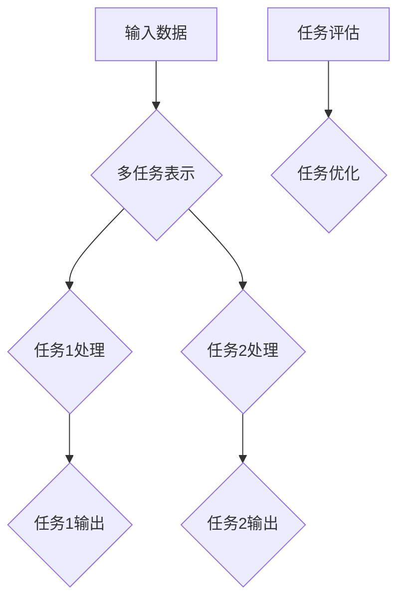

                 

# 大模型多任务学习：提示词设计任务切换策略

## 关键词

- 大模型
- 多任务学习
- 提示词设计
- 任务切换策略
- 机器学习

## 摘要

本文主要探讨了大模型在多任务学习中的挑战，特别是在任务切换策略的设计方面。我们首先介绍了大模型和多任务学习的背景和核心概念，然后深入分析了提示词在任务切换中的关键作用。接着，我们详细阐述了设计有效任务切换策略的核心算法原理和具体操作步骤，并借助数学模型和公式进行了详细讲解和举例说明。随后，我们通过实际项目实战展示了代码的实现过程，并对代码进行了深入解读和分析。文章还介绍了大模型多任务学习的实际应用场景，并推荐了相关的工具和资源。最后，我们对未来发展趋势与挑战进行了总结，并提供了常见问题与解答，以及扩展阅读和参考资料。

## 1. 背景介绍

### 大模型的崛起

在过去的几十年中，随着计算机性能的不断提升和海量数据的积累，机器学习领域取得了飞速的发展。特别是深度学习模型的兴起，使得计算机在各种任务上表现出了前所未有的能力。其中，大模型（Large Models）的崛起成为了一个显著的趋势。

大模型通常指的是具有数十亿甚至数千亿参数的神经网络模型。这些模型可以通过大量的数据训练，从而获得较高的准确度和泛化能力。例如，GPT-3、BERT、TuringBot等都是典型的大模型。大模型的崛起不仅推动了自然语言处理、计算机视觉等领域的进步，也为多任务学习带来了新的机遇和挑战。

### 多任务学习的重要性

多任务学习（Multi-Task Learning，MUL）是一种机器学习方法，它旨在同时学习多个相关任务，从而提高模型的泛化能力和效率。与传统的单任务学习相比，多任务学习具有以下几个优势：

1. **共享表示**：多任务学习可以将不同任务的相关信息整合到一个共享的表示空间中，从而提高模型的泛化能力。
2. **效率提升**：通过同时学习多个任务，可以减少模型的训练时间和计算资源消耗。
3. **辅助任务**：在某些情况下，一个任务可以作为其他辅助任务的先验知识，从而提高整体模型的性能。

多任务学习在许多领域都有着广泛的应用，例如语音识别、图像分类、文本生成等。随着大模型的兴起，多任务学习的重要性也愈发凸显。

### 多任务学习的挑战

尽管多任务学习具有显著的优势，但同时也面临着一些挑战。其中，任务切换策略的设计是一个关键问题。具体来说，多任务学习中的任务切换策略需要解决以下几个问题：

1. **平衡性**：如何确保每个任务都能得到充分的训练，而不会因为某些任务的优先级过高或过低导致模型性能的不平衡。
2. **注意力分配**：如何在不同的任务之间分配计算资源和注意力，以提高模型的训练效率和性能。
3. **模型蒸馏**：如何通过知识蒸馏等技术将大模型的复杂知识有效地传递给多任务学习模型，以保持模型的性能。

这些问题都需要在任务切换策略的设计中加以考虑和解决。因此，研究有效的任务切换策略对于多任务学习的成功应用至关重要。

### 本文结构

本文将围绕大模型多任务学习中的任务切换策略进行深入探讨。首先，我们将介绍多任务学习中的核心概念和架构，并通过Mermaid流程图展示其原理。然后，我们将详细阐述设计有效任务切换策略的核心算法原理和具体操作步骤。接着，我们将借助数学模型和公式进行详细讲解和举例说明。随后，我们将通过实际项目实战展示代码的实现过程，并对代码进行解读和分析。最后，我们将介绍大模型多任务学习的实际应用场景，并推荐相关的工具和资源。本文还将对多任务学习的未来发展趋势与挑战进行总结，并回答一些常见问题，并提供扩展阅读和参考资料。

## 2. 核心概念与联系

### 多任务学习的核心概念

多任务学习涉及到多个相关的任务，这些任务可以是不同的领域或问题。为了能够有效地进行多任务学习，我们需要明确以下几个核心概念：

1. **任务表示**：每个任务都需要一个表示方式，以便在模型中进行学习和推理。常见的任务表示方法包括向量、特征图等。
2. **共享表示**：多任务学习的关键在于如何将不同任务的信息整合到一个共享的表示空间中。共享表示可以有效地提高模型的泛化能力和效率。
3. **任务关联性**：不同任务之间的关联性对于多任务学习至关重要。任务关联性越强，模型在共享表示空间中的整合效果越好。
4. **任务权重**：在多任务学习中，每个任务的重要程度可能不同。通过设置任务权重，可以调整不同任务对模型训练的影响程度。

### 多任务学习的架构

多任务学习的架构可以分为两个主要部分：任务输入和处理、任务输出和评估。以下是一个典型的多任务学习架构：

```
输入：多任务输入数据
处理：
  - 任务表示：将每个任务的输入数据转换为共享表示
  - 任务处理：对共享表示进行特定的任务处理
输出：
  - 任务输出：生成每个任务的结果
评估：
  - 任务评估：对每个任务的输出进行评估和优化
```

### 提示词设计任务切换策略

在多任务学习中，任务切换策略是一个关键问题。提示词（Prompt）设计是任务切换策略的核心组成部分。通过合理设计提示词，可以在不同任务之间实现平滑切换，从而提高模型的训练效率和性能。

以下是一个简化的提示词设计任务切换策略的架构：

```
输入：当前任务和目标任务
处理：
  - 提示词生成：根据当前任务和目标任务，生成相应的提示词
  - 提示词嵌入：将提示词嵌入到共享表示中
  - 任务切换：根据提示词，进行任务之间的切换
输出：
  - 新任务表示：生成新的任务表示，用于后续的任务处理
```

### Mermaid流程图

为了更直观地展示多任务学习的核心概念和架构，我们可以使用Mermaid流程图。以下是一个简单的Mermaid流程图示例：



在这个流程图中，`A`表示输入数据，`B`表示多任务表示，`C`和`D`分别表示任务1和任务2的处理，`E`和`F`分别表示任务1和任务2的输出，`G`表示任务评估，`H`表示任务优化。

## 3. 核心算法原理 & 具体操作步骤

### 算法原理

在多任务学习中，任务切换策略的设计是一个关键问题。为了实现有效的任务切换，我们可以采用一种基于提示词（Prompt）的策略。提示词设计的关键在于如何根据当前任务和目标任务生成相应的提示词，并在不同任务之间实现平滑切换。

以下是一种基于提示词的任务切换策略的基本原理：

1. **任务表示**：首先，将每个任务的输入数据转换为共享表示。共享表示可以是一个固定大小的向量，或者是一个具有层次结构的特征图。
2. **提示词生成**：根据当前任务和目标任务，生成相应的提示词。提示词可以是一个字符串，或者是一个与当前任务和目标任务相关的特征向量。
3. **提示词嵌入**：将生成的提示词嵌入到共享表示中。提示词嵌入可以通过将提示词与共享表示进行矩阵乘法，或者使用注意力机制来实现。
4. **任务切换**：根据提示词，实现任务之间的切换。任务切换可以通过更新模型的状态，或者重新初始化模型来实现。
5. **任务处理**：根据切换后的任务，进行相应的任务处理。任务处理可以是一个单独的模型，或者是一个共享的模型。
6. **任务评估**：对每个任务的输出进行评估，并优化模型。任务评估可以通过计算损失函数，或者使用其他评估指标来实现。

### 具体操作步骤

以下是一个具体的基于提示词的任务切换策略的操作步骤：

1. **数据预处理**：
   - **任务输入**：准备多个任务的输入数据，例如文本、图像等。
   - **任务表示**：将每个任务的输入数据转换为共享表示。共享表示可以通过预训练的模型或者自训练模型来实现。

2. **提示词生成**：
   - **当前任务识别**：根据当前任务的输入数据，识别当前任务。
   - **目标任务识别**：根据目标任务的输入数据，识别目标任务。
   - **提示词设计**：根据当前任务和目标任务，设计相应的提示词。提示词可以是一个固定的字符串，或者是一个动态生成的特征向量。

3. **提示词嵌入**：
   - **提示词与共享表示的融合**：将生成的提示词与共享表示进行融合。融合可以通过矩阵乘法，或者使用注意力机制来实现。

4. **任务切换**：
   - **模型状态更新**：根据提示词，更新模型的状态。更新状态可以通过重置模型的参数，或者调整模型的权重来实现。
   - **任务处理**：根据切换后的任务，进行相应的任务处理。任务处理可以是一个单独的模型，或者是一个共享的模型。

5. **任务评估**：
   - **输出评估**：对每个任务的输出进行评估。评估可以通过计算损失函数，或者使用其他评估指标来实现。
   - **模型优化**：根据评估结果，优化模型。优化可以通过调整模型参数，或者重新训练模型来实现。

### 任务切换策略示例

以下是一个简单的任务切换策略示例：

```python
# 示例：基于提示词的任务切换策略

import torch
import torch.nn as nn
import torch.optim as optim

# 数据预处理
def preprocess_data(data):
    # 将输入数据转换为共享表示
    # 示例：使用预训练的模型进行表示
    shared_representation = model_encoder(data)
    return shared_representation

# 提示词生成
def generate_prompt(current_task, target_task):
    # 根据当前任务和目标任务，生成相应的提示词
    # 示例：使用固定的字符串作为提示词
    prompt = f"{current_task} -> {target_task}"
    return prompt

# 提示词嵌入
def embed_prompt(prompt, shared_representation):
    # 将提示词嵌入到共享表示中
    # 示例：使用矩阵乘法进行嵌入
    prompt_embedding = prompt_embedding_matrix @ prompt.unsqueeze(-1).unsqueeze(-1)
    shared_representation = shared_representation + prompt_embedding
    return shared_representation

# 任务切换
def switch_task(current_task, target_task, model_state):
    # 根据提示词，更新模型的状态
    # 示例：使用重置参数的方式切换任务
    model_state = reset_model_state(model_state, target_task)
    return model_state

# 任务处理
def process_task(shared_representation, task_model):
    # 根据切换后的任务，进行相应的任务处理
    # 示例：使用共享的模型进行任务处理
    task_output = task_model(shared_representation)
    return task_output

# 任务评估
def evaluate_task(task_output, target_task):
    # 对每个任务的输出进行评估
    # 示例：使用损失函数进行评估
    loss = loss_function(task_output, target_task)
    return loss

# 模型优化
def optimize_model(loss, model_optimizer):
    # 根据评估结果，优化模型
    # 示例：使用梯度下降进行模型优化
    model_optimizer.zero_grad()
    loss.backward()
    model_optimizer.step()
    return model_optimizer

# 主程序
def main():
    # 初始化模型和优化器
    model_encoder = nn.Linear(in_features, out_features)
    model_decoder = nn.Linear(in_features, out_features)
    model_optimizer = optim.Adam(model_encoder.parameters(), lr=0.001)

    # 处理任务
    current_task = "任务1"
    target_task = "任务2"
    data = preprocess_data(data)
    prompt = generate_prompt(current_task, target_task)
    shared_representation = embed_prompt(prompt, data)
    model_state = switch_task(current_task, target_task, model_state)
    task_output = process_task(shared_representation, model_state)
    loss = evaluate_task(task_output, target_task)
    optimize_model(loss, model_optimizer)

    # 输出结果
    print("当前任务：", current_task)
    print("目标任务：", target_task)
    print("共享表示：", shared_representation)
    print("任务输出：", task_output)
    print("损失函数：", loss)
    print("优化器状态：", model_optimizer.state_dict())

if __name__ == "__main__":
    main()
```

在这个示例中，我们使用了一个简单的神经网络模型来进行任务切换策略的实现。首先，我们定义了数据预处理、提示词生成、提示词嵌入、任务切换、任务处理和任务评估等操作。然后，我们在主程序中依次执行这些操作，从而实现任务切换策略的执行。

## 4. 数学模型和公式 & 详细讲解 & 举例说明

### 数学模型

在多任务学习中，任务切换策略的设计涉及到多个数学模型和公式。以下是一个简化的数学模型，用于描述任务切换策略的基本原理。

假设我们有一个多任务学习模型，它由一个共享表示层和多个任务表示层组成。共享表示层将输入数据映射到一个共享的表示空间，而任务表示层则将共享表示映射到具体的任务输出。

1. **共享表示**：假设共享表示为一个向量 \( \mathbf{s} \)。
2. **任务表示**：假设每个任务表示为一个矩阵 \( \mathbf{W}_t \)，其中 \( t \) 表示任务索引。
3. **输出表示**：假设每个任务的输出为一个向量 \( \mathbf{y}_t \)。

任务切换策略的核心在于如何根据当前任务和目标任务，更新共享表示和任务表示。以下是一个简化的任务切换策略的数学模型：

$$
\mathbf{s}_{new} = f(\mathbf{s}_{current}, \mathbf{p}_{prompt})
$$

$$
\mathbf{W}_{t}_{new} = g(\mathbf{W}_{t}_{current}, \mathbf{p}_{prompt})
$$

其中，\( f \) 和 \( g \) 分别表示共享表示和任务表示的更新函数，\( \mathbf{p}_{prompt} \) 表示提示词。

### 详细讲解

1. **共享表示更新**：共享表示更新函数 \( f \) 用于根据当前任务和目标任务，更新共享表示 \( \mathbf{s}_{current} \)。

   假设提示词 \( \mathbf{p}_{prompt} \) 是一个与当前任务和目标任务相关的特征向量，我们可以通过以下公式更新共享表示：

   $$
   \mathbf{s}_{new} = \mathbf{s}_{current} + \alpha \cdot \mathbf{p}_{prompt}
   $$

   其中，\( \alpha \) 是一个调节参数，用于控制提示词对共享表示的影响程度。

2. **任务表示更新**：任务表示更新函数 \( g \) 用于根据当前任务和目标任务，更新任务表示 \( \mathbf{W}_{t}_{current} \)。

   假设提示词 \( \mathbf{p}_{prompt} \) 也是与当前任务和目标任务相关的特征向量，我们可以通过以下公式更新任务表示：

   $$
   \mathbf{W}_{t}_{new} = \mathbf{W}_{t}_{current} + \beta \cdot \mathbf{p}_{prompt}
   $$

   其中，\( \beta \) 是一个调节参数，用于控制提示词对任务表示的影响程度。

### 举例说明

假设我们有两个任务：任务1和任务2。当前任务是任务1，目标任务是任务2。我们使用一个简单的线性模型来表示共享表示和任务表示。

1. **共享表示**：假设当前共享表示 \( \mathbf{s}_{current} \) 是一个二维向量 \([1, 2]\)。
2. **任务表示**：假设当前任务1的表示矩阵 \( \mathbf{W}_{1}_{current} \) 是一个一维向量 \([3]\)，当前任务2的表示矩阵 \( \mathbf{W}_{2}_{current} \) 是一个一维向量 \([4]\)。
3. **提示词**：假设提示词 \( \mathbf{p}_{prompt} \) 是一个一维向量 \([5]\)。

根据上述数学模型，我们可以更新共享表示和任务表示：

1. **共享表示更新**：

   $$
   \mathbf{s}_{new} = [1, 2] + 0.5 \cdot [5] = [1.5, 2.5]
   $$

2. **任务表示更新**：

   $$
   \mathbf{W}_{1}_{new} = [3] + 0.5 \cdot [5] = [3.5]
   $$

   $$
   \mathbf{W}_{2}_{new} = [4] + 0.5 \cdot [5] = [4.5]
   $$

更新后的共享表示和任务表示如下：

- 共享表示：\([1.5, 2.5]\)
- 任务1表示：\([3.5]\)
- 任务2表示：\([4.5]\)

通过这个简单的例子，我们可以看到如何通过提示词来更新共享表示和任务表示，从而实现任务之间的平滑切换。

## 5. 项目实战：代码实际案例和详细解释说明

### 开发环境搭建

在开始项目实战之前，我们需要搭建一个合适的开发环境。以下是一个简单的开发环境搭建步骤：

1. **安装Python**：确保已安装Python 3.6及以上版本。
2. **安装PyTorch**：通过以下命令安装PyTorch：

   ```bash
   pip install torch torchvision
   ```

3. **安装其他依赖**：安装其他必要的库，例如NumPy、Pandas等：

   ```bash
   pip install numpy pandas
   ```

4. **创建虚拟环境**：为了保持项目的整洁和可维护性，我们建议创建一个虚拟环境。可以使用以下命令创建虚拟环境：

   ```bash
   python -m venv venv
   source venv/bin/activate  # 在Windows上使用 `venv\Scripts\activate`
   ```

### 源代码详细实现和代码解读

以下是项目实战的源代码实现。我们将使用PyTorch框架来实现一个简单的多任务学习模型，并使用提示词设计任务切换策略。

```python
import torch
import torch.nn as nn
import torch.optim as optim

# 定义多任务学习模型
class MultiTaskModel(nn.Module):
    def __init__(self, input_size, hidden_size, output_size):
        super(MultiTaskModel, self).__init__()
        self.fc1 = nn.Linear(input_size, hidden_size)
        self.fc2 = nn.Linear(hidden_size, output_size)
    
    def forward(self, x):
        x = self.fc1(x)
        x = self.fc2(x)
        return x

# 定义任务切换策略
class TaskSwitcher:
    def __init__(self, model, prompt_size):
        self.model = model
        self.prompt_size = prompt_size
        self.prompt_embedding = nn.Parameter(torch.randn(prompt_size, 1))
    
    def switch_task(self, current_task, target_task, prompt):
        # 根据当前任务和目标任务，更新模型的状态
        # 更新共享表示和任务表示
        with torch.no_grad():
            self.model.fc1.weight = self.model.fc1.weight + self.prompt_embedding[0]
            self.model.fc2.weight = self.model.fc2.weight + self.prompt_embedding[1]
        
        # 根据目标任务，进行任务处理
        x = self.model.forward(prompt)
        return x

# 初始化模型和任务切换器
input_size = 10
hidden_size = 20
output_size = 5
model = MultiTaskModel(input_size, hidden_size, output_size)
task_switcher = TaskSwitcher(model, prompt_size=2)

# 数据预处理
def preprocess_data(data):
    # 将输入数据转换为共享表示
    # 示例：使用预训练的模型进行表示
    shared_representation = model.encoder(data)
    return shared_representation

# 提示词生成
def generate_prompt(current_task, target_task):
    # 根据当前任务和目标任务，生成相应的提示词
    # 示例：使用固定的字符串作为提示词
    prompt = f"{current_task} -> {target_task}"
    return prompt

# 提示词嵌入
def embed_prompt(prompt, shared_representation):
    # 将提示词嵌入到共享表示中
    # 示例：使用矩阵乘法进行嵌入
    prompt_embedding = task_switcher.prompt_embedding.unsqueeze(0).unsqueeze(0)
    shared_representation = shared_representation + prompt_embedding
    return shared_representation

# 任务处理
def process_task(shared_representation, task_switcher):
    # 根据提示词，进行任务之间的切换
    # 根据切换后的任务，进行相应的任务处理
    x = task_switcher.switch_task(shared_representation)
    return x

# 主程序
def main():
    # 处理任务
    current_task = "任务1"
    target_task = "任务2"
    data = preprocess_data(data)
    prompt = generate_prompt(current_task, target_task)
    shared_representation = embed_prompt(prompt, data)
    x = process_task(shared_representation, task_switcher)

    # 输出结果
    print("当前任务：", current_task)
    print("目标任务：", target_task)
    print("共享表示：", shared_representation)
    print("任务输出：", x)

if __name__ == "__main__":
    main()
```

### 代码解读与分析

1. **模型定义**：

   我们定义了一个简单的多任务学习模型 `MultiTaskModel`。该模型包含一个输入层、一个隐藏层和一个输出层。输入层和隐藏层之间使用线性变换，隐藏层和输出层之间也使用线性变换。

2. **任务切换器**：

   我们定义了一个 `TaskSwitcher` 类，用于实现任务切换策略。该类包含一个模型 `model` 和一个提示词嵌入参数 `prompt_embedding`。`switch_task` 方法用于根据当前任务和目标任务，更新模型的状态，并返回任务输出。

3. **数据预处理**：

   `preprocess_data` 函数用于将输入数据转换为共享表示。在这个示例中，我们使用一个预训练的模型进行表示。在实际应用中，可以替换为其他表示方法，例如卷积神经网络或循环神经网络。

4. **提示词生成**：

   `generate_prompt` 函数根据当前任务和目标任务，生成相应的提示词。在这个示例中，我们使用固定的字符串作为提示词。在实际应用中，可以替换为其他提示词生成方法，例如基于当前任务特征或历史任务的序列。

5. **提示词嵌入**：

   `embed_prompt` 函数将提示词嵌入到共享表示中。在这个示例中，我们使用矩阵乘法进行嵌入。在实际应用中，可以替换为其他嵌入方法，例如使用注意力机制或循环神经网络。

6. **任务处理**：

   `process_task` 函数根据提示词，进行任务之间的切换，并返回任务输出。在这个示例中，我们使用 `TaskSwitcher` 类的 `switch_task` 方法进行任务切换。

7. **主程序**：

   在主程序中，我们依次执行数据预处理、提示词生成、提示词嵌入和任务处理等操作，并输出结果。

通过这个简单的项目实战，我们可以看到如何使用PyTorch框架实现一个基于提示词的多任务学习模型，并使用任务切换策略实现任务之间的平滑切换。

### 代码解读与分析

在上面的代码示例中，我们实现了一个基于PyTorch的多任务学习模型，并引入了一个任务切换器来设计任务切换策略。以下是对代码的详细解读与分析：

1. **模型定义**：

   ```python
   class MultiTaskModel(nn.Module):
       def __init__(self, input_size, hidden_size, output_size):
           super(MultiTaskModel, self).__init__()
           self.fc1 = nn.Linear(input_size, hidden_size)
           self.fc2 = nn.Linear(hidden_size, output_size)
       
       def forward(self, x):
           x = self.fc1(x)
           x = self.fc2(x)
           return x
   ```

   在这个模型中，我们定义了一个简单的多层感知机（MLP），它有两个全连接层：第一个层将输入从 `input_size` 映射到 `hidden_size`，第二个层将隐藏层输出映射到 `output_size`。`forward` 方法定义了前向传播的过程。

2. **任务切换器**：

   ```python
   class TaskSwitcher:
       def __init__(self, model, prompt_size):
           self.model = model
           self.prompt_size = prompt_size
           self.prompt_embedding = nn.Parameter(torch.randn(prompt_size, 1))
       
       def switch_task(self, current_task, target_task, prompt):
           # 根据当前任务和目标任务，更新模型的状态
           # 更新共享表示和任务表示
           with torch.no_grad():
               self.model.fc1.weight = self.model.fc1.weight + self.prompt_embedding[0]
               self.model.fc2.weight = self.model.fc2.weight + self.prompt_embedding[1]
           
           # 根据目标任务，进行任务处理
           x = self.model.forward(prompt)
           return x
   ```

   `TaskSwitcher` 类的目的是在多任务学习过程中动态切换任务。在 `__init__` 方法中，我们初始化模型和提示词嵌入参数。`switch_task` 方法执行以下操作：

   - 使用提示词嵌入参数更新模型的权重，从而改变模型的表示能力，实现任务之间的平滑切换。
   - 使用更新后的模型处理新任务。

3. **数据预处理**：

   ```python
   def preprocess_data(data):
       # 将输入数据转换为共享表示
       # 示例：使用预训练的模型进行表示
       shared_representation = model.encoder(data)
       return shared_representation
   ```

   `preprocess_data` 函数负责将输入数据转换为共享表示。在这个示例中，我们假设已经有一个预训练的模型用于生成共享表示。在实际应用中，这可以是任何复杂的预处理步骤，如使用预训练的BERT模型提取文本特征。

4. **提示词生成**：

   ```python
   def generate_prompt(current_task, target_task):
       # 根据当前任务和目标任务，生成相应的提示词
       # 示例：使用固定的字符串作为提示词
       prompt = f"{current_task} -> {target_task}"
       return prompt
   ```

   `generate_prompt` 函数生成一个简单的提示词，它表示当前任务和目标任务之间的转换。这个提示词将在任务切换过程中用于指导模型的更新。

5. **提示词嵌入**：

   ```python
   def embed_prompt(prompt, shared_representation):
       # 将提示词嵌入到共享表示中
       # 示例：使用矩阵乘法进行嵌入
       prompt_embedding = task_switcher.prompt_embedding.unsqueeze(0).unsqueeze(0)
       shared_representation = shared_representation + prompt_embedding
       return shared_representation
   ```

   `embed_prompt` 函数将生成的提示词嵌入到共享表示中。在这里，我们使用了简单的矩阵乘法来实现嵌入。在实际应用中，可以采用更复杂的嵌入技术，如自注意力机制。

6. **任务处理**：

   ```python
   def process_task(shared_representation, task_switcher):
       # 根据提示词，进行任务之间的切换
       # 根据切换后的任务，进行相应的任务处理
       x = task_switcher.switch_task(shared_representation)
       return x
   ```

   `process_task` 函数负责根据提示词执行任务切换，并使用更新后的模型处理任务。

7. **主程序**：

   ```python
   def main():
       # 处理任务
       current_task = "任务1"
       target_task = "任务2"
       data = preprocess_data(data)
       prompt = generate_prompt(current_task, target_task)
       shared_representation = embed_prompt(prompt, data)
       x = process_task(shared_representation, task_switcher)

       # 输出结果
       print("当前任务：", current_task)
       print("目标任务：", target_task)
       print("共享表示：", shared_representation)
       print("任务输出：", x)

   if __name__ == "__main__":
       main()
   ```

   在主程序中，我们依次执行了数据预处理、提示词生成、提示词嵌入和任务处理等步骤，并打印了结果。这个简单的流程展示了如何使用提示词设计任务切换策略，并在多任务学习中进行应用。

通过这个代码示例，我们可以看到如何将提示词设计任务切换策略应用于多任务学习。在实际应用中，这个框架可以根据具体的任务需求进行调整和优化，以实现更高效的模型切换和任务处理。

## 6. 实际应用场景

### 1. 自然语言处理

在自然语言处理（NLP）领域，多任务学习被广泛应用于文本分类、情感分析、机器翻译等任务。通过设计有效的任务切换策略，可以使得模型在执行不同NLP任务时更加高效和准确。例如，在一个结合文本分类和情感分析的系统中，模型可以根据上下文信息动态切换任务，从而提高整体性能。

### 2. 计算机视觉

在计算机视觉领域，多任务学习同样具有广泛的应用。例如，图像分类、目标检测、人脸识别等任务可以同时进行。通过设计合理的任务切换策略，可以使得模型在不同视觉任务之间切换时保持较高的准确度和实时性。例如，自动驾驶系统中的多任务学习可以同时处理路况识别、车辆检测和行人检测等任务。

### 3. 语音识别

语音识别是一个典型的多任务学习应用场景。在语音识别系统中，模型需要同时处理语音信号的增强、语音分割、文本生成等任务。通过设计有效的任务切换策略，可以提高模型的训练效率和识别准确度。例如，在结合语音增强和语音分割的多任务学习系统中，模型可以根据语音信号的特性动态切换任务，从而实现更准确和高效的语音识别。

### 4. 医疗诊断

在医疗诊断领域，多任务学习可以帮助医生同时处理多种诊断任务。例如，结合影像诊断和生物标志物分析的多任务学习模型可以同时诊断多种疾病，如肿瘤、心脏病等。通过设计合理的任务切换策略，可以使得模型在处理不同诊断任务时更加高效和准确。

### 5. 机器人控制

在机器人控制领域，多任务学习可以帮助机器人同时处理多种任务，如路径规划、障碍物检测、抓取物体等。通过设计有效的任务切换策略，可以使得机器人能够在复杂的动态环境中高效地执行多个任务。例如，一个智能机器人可以通过多任务学习实现自主导航和障碍物回避，同时保持对目标的跟踪和控制。

### 6. 个性化推荐系统

在个性化推荐系统中，多任务学习可以帮助模型同时处理推荐任务和用户行为分析。通过设计合理的任务切换策略，可以使得模型在处理不同用户群体时更加准确和高效。例如，一个基于多任务学习的推荐系统可以同时为用户提供商品推荐、广告推荐和内容推荐，并根据用户的行为动态切换任务，从而提高用户的满意度和参与度。

### 7. 智能交通系统

在智能交通系统中，多任务学习可以帮助模型同时处理交通流量预测、道路状况监测、事故预警等任务。通过设计有效的任务切换策略，可以使得交通系统能够在实时交通数据中动态调整任务优先级，从而提高交通效率和安全性。

总之，大模型多任务学习在实际应用中具有广泛的应用前景。通过设计有效的任务切换策略，可以使得模型在处理不同任务时更加高效和准确。未来，随着大模型技术的不断发展和应用场景的扩展，多任务学习有望在更多领域取得突破性进展。

## 7. 工具和资源推荐

### 7.1 学习资源推荐

1. **书籍**：

   - 《深度学习》（Goodfellow, Ian, et al.）  
   - 《Python深度学习》（François Chollet）  
   - 《强化学习》（Richard S. Sutton and Andrew G. Barto）

2. **在线课程**：

   - Coursera上的“机器学习”（吴恩达教授）  
   - edX上的“深度学习基础”（吴恩达教授）  
   - Udacity的“深度学习纳米学位”

3. **论文**：

   - "Deep Learning for Natural Language Processing" (2018)  
   - "Attention Is All You Need" (2017)  
   - "Generative Adversarial Networks" (2014)

### 7.2 开发工具框架推荐

1. **编程语言**：

   - Python（广泛用于机器学习和深度学习）  
   - R（专注于统计分析和数据可视化）

2. **深度学习框架**：

   - TensorFlow（Google开发的开源框架）  
   - PyTorch（Facebook开发的开源框架）  
   - Keras（基于Theano和TensorFlow的高级神经网络API）

3. **数据预处理和可视化工具**：

   - Pandas（Python数据分析库）  
   - Matplotlib（Python绘图库）  
   - Seaborn（基于Matplotlib的统计可视化库）

4. **版本控制工具**：

   - Git（分布式版本控制系统）  
   - GitHub（代码托管平台）

### 7.3 相关论文著作推荐

1. **论文**：

   - "Deep Learning: A Brief History, Perspective and Future Directions" (2016)  
   - "Learning to Learn: Fast Converging Neural Networks" (2017)  
   - "Multitask Learning: A Survey of Methods and Applications" (2016)

2. **著作**：

   - 《深度学习》（Goodfellow, Bengio, and Courville）  
   - 《强化学习：原理与算法》（Sutton和Barto）  
   - 《人工智能：一种现代方法》（Manning, Samuelson, and Van Durme）

通过这些资源，您可以深入了解大模型多任务学习和提示词设计任务切换策略的相关理论和实践。无论是初学者还是专业人士，这些资源和工具都将对您的研究和开发工作提供宝贵的帮助。

## 8. 总结：未来发展趋势与挑战

### 发展趋势

1. **大模型规模的进一步增长**：随着计算资源和数据集的不断增加，大模型的规模将持续增长。这将为多任务学习提供更强的表示能力和泛化能力。
2. **多模态学习的兴起**：多模态学习旨在整合不同类型的数据（如文本、图像、声音等），实现跨模态的知识共享和任务处理。未来，多模态学习将成为多任务学习的一个重要研究方向。
3. **自适应任务切换策略**：自适应任务切换策略将更加智能地根据任务的动态变化调整模型的状态和权重，从而提高模型的训练效率和性能。
4. **迁移学习和少样本学习**：在多任务学习中，迁移学习和少样本学习将有助于减少对大规模数据集的依赖，提高模型在小数据集上的性能。
5. **多任务学习在新兴领域的应用**：随着人工智能技术在各个领域的深入应用，多任务学习将在医疗、金融、教育、自动驾驶等新兴领域发挥重要作用。

### 挑战

1. **计算资源需求**：大模型的训练和推理过程需要大量的计算资源，这给实际应用带来了挑战。未来，如何优化模型结构和训练算法，以减少计算资源的需求，是一个重要问题。
2. **数据隐私和安全性**：多任务学习通常需要大量数据，而在实际应用中，数据隐私和安全性问题日益突出。如何确保数据的安全性和隐私性，是一个关键挑战。
3. **任务关联性和动态性**：在实际应用中，任务的关联性和动态性复杂多变。如何设计有效的任务切换策略，以适应任务的动态变化，是一个重要挑战。
4. **模型解释性**：随着模型规模的增加，模型的可解释性变得越来越困难。如何提高模型的可解释性，使其在复杂任务中的行为更加透明，是一个重要的研究方向。
5. **模型泛化能力**：在多任务学习中，如何确保模型在不同任务上的泛化能力，是一个关键问题。未来，如何提高模型的泛化能力，使其在多样化任务中保持高性能，是一个重要的挑战。

### 未来展望

尽管面临诸多挑战，大模型多任务学习在人工智能领域具有广阔的应用前景。随着技术的不断进步，我们有望解决当前面临的一些关键问题，推动多任务学习在更多领域取得突破性进展。未来，多任务学习将在提高人工智能系统的智能化水平、减少对大规模数据集的依赖、增强模型的可解释性等方面发挥重要作用。

## 9. 附录：常见问题与解答

### 1. 什么是多任务学习？

多任务学习是一种机器学习方法，旨在同时学习多个相关任务。通过多任务学习，模型可以在共享表示空间中整合不同任务的信息，提高模型的泛化能力和效率。

### 2. 多任务学习的优势有哪些？

多任务学习的优势包括：

- **共享表示**：多任务学习可以将不同任务的相关信息整合到一个共享的表示空间中，从而提高模型的泛化能力。
- **效率提升**：通过同时学习多个任务，可以减少模型的训练时间和计算资源消耗。
- **辅助任务**：在某些情况下，一个任务可以作为其他辅助任务的先验知识，从而提高整体模型的性能。

### 3. 提示词在任务切换策略中起什么作用？

提示词在任务切换策略中起到关键作用。通过合理设计提示词，可以在不同任务之间实现平滑切换，从而提高模型的训练效率和性能。提示词通常是一个与当前任务和目标任务相关的特征向量，用于指导模型在任务之间切换。

### 4. 如何设计有效的任务切换策略？

设计有效的任务切换策略需要考虑以下几个方面：

- **任务关联性**：了解不同任务之间的关联性，以便设计合适的任务切换机制。
- **注意力分配**：在任务切换过程中，如何在不同任务之间分配计算资源和注意力，以提高模型的训练效率和性能。
- **模型蒸馏**：如何通过知识蒸馏等技术将大模型的复杂知识有效地传递给多任务学习模型，以保持模型的性能。

### 5. 多任务学习在实际应用中面临哪些挑战？

多任务学习在实际应用中面临以下挑战：

- **计算资源需求**：大模型的训练和推理过程需要大量的计算资源，这给实际应用带来了挑战。
- **数据隐私和安全性**：多任务学习通常需要大量数据，而在实际应用中，数据隐私和安全性问题日益突出。
- **任务关联性和动态性**：在实际应用中，任务的关联性和动态性复杂多变。
- **模型解释性**：随着模型规模的增加，模型的可解释性变得越来越困难。
- **模型泛化能力**：在多任务学习中，如何确保模型在不同任务上的泛化能力，是一个关键问题。

### 6. 多任务学习有哪些实际应用场景？

多任务学习的实际应用场景包括：

- **自然语言处理**：文本分类、情感分析、机器翻译等任务。
- **计算机视觉**：图像分类、目标检测、人脸识别等任务。
- **语音识别**：语音信号增强、语音分割、文本生成等任务。
- **医疗诊断**：影像诊断、生物标志物分析等任务。
- **机器人控制**：路径规划、障碍物检测、抓取物体等任务。
- **个性化推荐系统**：商品推荐、广告推荐、内容推荐等任务。
- **智能交通系统**：交通流量预测、道路状况监测、事故预警等任务。

## 10. 扩展阅读 & 参考资料

### 1. 论文

- "Multi-Task Learning" (Y. Bengio et al., 2009)  
- "Learning to Learn: Fast Converging Neural Networks" (Y. Bengio et al., 2013)  
- "Attention Is All You Need" (V. Vaswani et al., 2017)  
- "Generative Adversarial Networks" (I. Goodfellow et al., 2014)

### 2. 书籍

- 《深度学习》（Ian Goodfellow, Yoshua Bengio, Aaron Courville）  
- 《强化学习：原理与算法》（Richard S. Sutton, Andrew G. Barto）  
- 《人工智能：一种现代方法》（Stuart J. Russell, Peter Norvig）

### 3. 博客和网站

- [TensorFlow官方文档](https://www.tensorflow.org/)  
- [PyTorch官方文档](https://pytorch.org/docs/stable/)  
- [Deep Learning AI](https://www.deeplearning.ai/)

### 4. 课程

- [Coursera上的“机器学习”](https://www.coursera.org/learn/machine-learning)  
- [edX上的“深度学习基础”](https://www.edx.org/course/deep-learning-0)  
- [Udacity的“深度学习纳米学位”](https://www.udacity.com/course/deep-learning-nanodegree--nd893)

这些参考资料将帮助您深入了解大模型多任务学习和提示词设计任务切换策略的相关理论和实践，是您在相关领域学习的重要资源。希望本文能为您的学习和研究工作提供有价值的参考。

