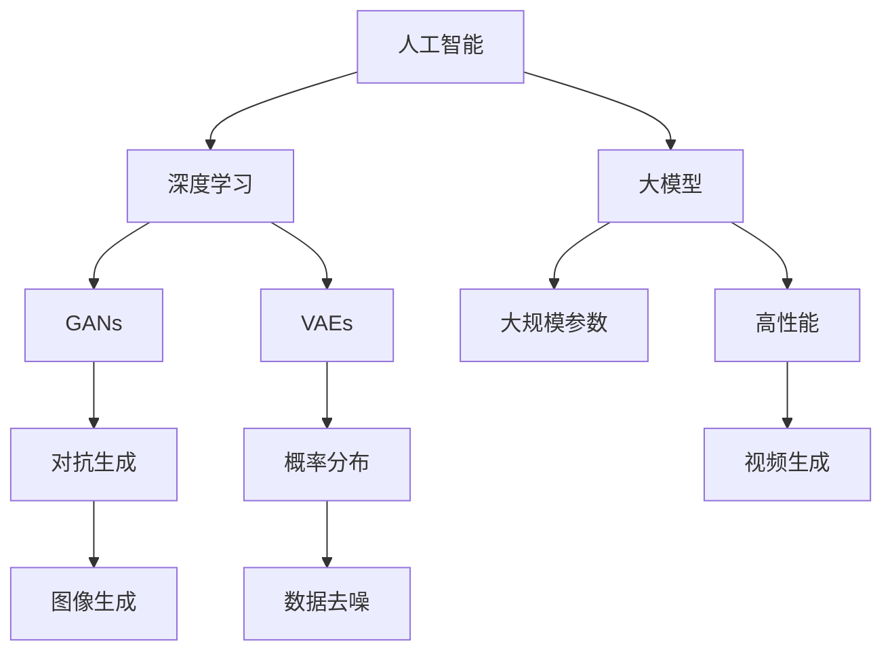

                 

### 背景介绍

创意设计行业是现代经济中至关重要的一部分，涵盖了广告设计、平面设计、室内设计、动画制作、游戏开发等多个领域。这些行业共同特点是高度依赖于人类创造力和设计思维，以创造出独特且引人入胜的作品。然而，随着技术的不断进步，特别是人工智能（AI）技术的快速发展，创意设计行业正面临着前所未有的挑战和机遇。

大模型，尤其是基于深度学习的生成对抗网络（GANs）和变分自编码器（VAEs）等模型，已经在图像处理、文本生成、视频合成等方面取得了显著的成果。这些大模型具有处理复杂数据、自动学习特征、生成高质量内容的能力，从而有可能改变创意设计行业的生产方式和价值创造模式。

本篇文章将深入探讨大模型对创意设计行业的影响。我们将首先介绍创意设计行业的现状和挑战，然后详细阐述大模型的原理和架构，接着分析大模型在创意设计中的应用，最后讨论大模型带来的机遇和挑战，以及行业的未来发展趋势。

通过本文的阅读，您将了解到：

1. 创意设计行业的重要性和当前面临的挑战。
2. 大模型的核心概念和原理。
3. 大模型在创意设计行业中的具体应用。
4. 大模型对创意设计行业的机遇和挑战。
5. 创意设计行业的未来发展趋势。

让我们一步一步地进行分析和推理，深入探讨大模型如何重塑创意设计行业。

### 核心概念与联系

在深入探讨大模型对创意设计行业的影响之前，我们需要了解几个核心概念和它们之间的联系。这些概念包括人工智能（AI）、深度学习、生成对抗网络（GANs）和变分自编码器（VAEs），它们构成了大模型技术的基础。

#### 人工智能（AI）

人工智能是计算机科学的一个分支，旨在开发能够执行通常需要人类智能才能完成的任务的系统。AI可以分为两种类型：基于规则的系统和基于数据的学习系统。基于规则的系统依赖于预定义的规则集来执行任务，而基于数据的学习系统则通过从数据中学习来改善其性能。

#### 深度学习

深度学习是人工智能的一个子领域，主要基于神经网络，尤其是多层神经网络。深度学习通过模拟人脑神经元之间的连接和交互，使计算机能够自动从大量数据中学习特征和模式。深度学习在图像识别、语音识别、自然语言处理等领域取得了显著成果。

#### 生成对抗网络（GANs）

生成对抗网络是一种深度学习模型，由生成器（Generator）和判别器（Discriminator）两部分组成。生成器生成数据，而判别器尝试区分生成数据和真实数据。通过这种对抗过程，生成器不断优化其生成数据的能力，使其越来越接近真实数据。GANs在图像生成、图像修复、图像风格迁移等方面取得了突破性进展。

#### 变分自编码器（VAEs）

变分自编码器是另一种深度学习模型，旨在学习数据的概率分布。VAEs由编码器和解码器两部分组成。编码器将输入数据编码为潜在空间中的向量，而解码器尝试从潜在空间中的向量重建输入数据。VAEs在生成多样化数据、数据去噪和异常检测等领域表现出色。

#### 大模型

大模型是指具有大规模参数的深度学习模型，通常具有数十亿甚至数万亿的参数。这些模型通过处理大量数据来学习复杂的特征和模式。大模型的应用范围非常广泛，包括图像识别、语音识别、自然语言处理、视频生成等。随着计算能力和数据量的增加，大模型的性能和精度不断提高。

#### 核心概念和联系

核心概念之间的联系主要体现在以下几个方面：

1. **人工智能（AI）与深度学习**：人工智能是深度学习的基础，深度学习是人工智能的一种实现方式。
2. **深度学习与GANs/VAEs**：深度学习技术为GANs和VAEs提供了强大的计算能力，使其能够处理复杂数据。
3. **GANs与VAEs**：GANs和VAEs都是生成模型，但GANs通过对抗过程生成数据，VAEs通过概率分布学习生成数据。
4. **大模型**：大模型通过处理大规模数据，提高了GANs和VAEs的性能和生成质量。

为了更好地理解这些核心概念，我们可以使用Mermaid流程图来展示它们之间的联系。



通过这个流程图，我们可以清晰地看到各个核心概念之间的关联和作用，从而为后续的讨论打下坚实的基础。

### 核心算法原理 & 具体操作步骤

为了深入理解大模型在创意设计行业中的应用，我们需要详细探讨其核心算法原理，包括生成对抗网络（GANs）和变分自编码器（VAEs）的具体操作步骤。

#### 生成对抗网络（GANs）

GANs是一种深度学习模型，由生成器和判别器两部分组成。生成器的目标是生成逼真的数据，而判别器的目标是区分生成数据与真实数据。通过这种对抗过程，生成器不断优化其生成能力，从而生成更加真实的数据。

**1. 生成器的具体操作步骤：**

- 输入：生成器接收一个随机噪声向量作为输入。
- 过程：通过一系列神经网络层对噪声向量进行转换，生成数据。
- 输出：生成的数据可以是图像、音频或文本等。

**2. 判别器的具体操作步骤：**

- 输入：判别器接收真实数据和生成数据作为输入。
- 过程：通过一系列神经网络层对输入数据进行特征提取和分类。
- 输出：判别器输出一个概率值，表示输入数据是真实数据的可能性。

**3. GANs的训练过程：**

- 初始阶段：生成器和判别器都是随机初始化的。
- 对抗过程：生成器尝试生成逼真的数据，而判别器尝试区分生成数据与真实数据。
- 更新参数：通过梯度下降算法更新生成器和判别器的参数。
- 重复迭代：不断重复对抗过程，直至生成器生成足够逼真的数据。

#### 变分自编码器（VAEs）

VAEs是一种基于概率分布的生成模型，旨在学习数据的概率分布，并通过编码器和解码器生成多样化数据。

**1. 编码器的具体操作步骤：**

- 输入：编码器接收输入数据。
- 过程：通过一系列神经网络层将输入数据映射到潜在空间中的一个向量。
- 输出：编码器输出一个潜在空间中的向量，代表输入数据的特征。

**2. 解码器的具体操作步骤：**

- 输入：解码器接收潜在空间中的向量作为输入。
- 过程：通过一系列神经网络层将潜在空间中的向量转换回输出数据。
- 输出：解码器输出重构的数据，与原始输入数据相似。

**3. VAEs的训练过程：**

- 初始阶段：编码器和解码器都是随机初始化的。
- 重建损失：计算重构数据与原始输入数据之间的误差，作为重建损失。
-KL散度损失：计算编码器输出向量的分布与先验分布之间的差异，作为KL散度损失。
- 更新参数：通过梯度下降算法同时优化编码器和解码器的参数。
- 重复迭代：不断重复训练过程，直至编码器和解码器生成高质量的数据。

通过上述核心算法原理和具体操作步骤的介绍，我们可以更好地理解大模型在创意设计行业中的应用潜力。接下来，我们将进一步探讨大模型在创意设计行业中的实际应用。

### 数学模型和公式 & 详细讲解 & 举例说明

在深入探讨大模型在创意设计行业中的应用之前，我们需要了解相关的数学模型和公式，这些模型和公式是理解和应用大模型的关键。我们将重点讨论生成对抗网络（GANs）和变分自编码器（VAEs）的核心数学公式，并对其进行详细讲解，通过具体示例来说明其应用。

#### 生成对抗网络（GANs）的数学模型

1. **生成器（Generator）的损失函数**

生成器旨在生成逼真的数据，以欺骗判别器。生成器的损失函数通常由两部分组成：对抗损失和真实损失。

对抗损失（Adversarial Loss）：
$$
L_{\text{adv}} = -\log(D(G(z))}
$$
其中，\(D\) 是判别器，\(G\) 是生成器，\(z\) 是随机噪声向量。

真实损失（Real Loss）：
$$
L_{\text{real}} = -\log(D(x))
$$
其中，\(x\) 是真实数据。

总损失函数：
$$
L_{\text{G}} = L_{\text{adv}} + L_{\text{real}}
$$

2. **判别器（Discriminator）的损失函数**

判别器旨在区分生成数据和真实数据。判别器的损失函数通常由两部分组成：对抗损失和真实损失。

对抗损失（Adversarial Loss）：
$$
L_{\text{adv}} = -\log(D(x)) - \log(1 - D(G(z)))
$$

真实损失（Real Loss）：
$$
L_{\text{real}} = -\log(D(x))
$$

总损失函数：
$$
L_{\text{D}} = L_{\text{adv}} + L_{\text{real}}
$$

#### 变分自编码器（VAEs）的数学模型

1. **编码器（Encoder）的损失函数**

编码器将输入数据映射到潜在空间中的向量，并学习数据的概率分布。

编码器损失函数（Kullback-Leibler Divergence Loss）：
$$
L_{\text{KL}} = -\sum_{i} p(x_i) \log q(z_i)
$$
其中，\(p(x_i)\) 是输入数据的概率分布，\(q(z_i)\) 是编码器输出的概率分布。

2. **解码器（Decoder）的损失函数**

解码器尝试从潜在空间中的向量重构输入数据。

重建损失（Reconstruction Loss）：
$$
L_{\text{recon}} = \sum_{i} || x_i - \hat{x}_i ||_2
$$
其中，\(\hat{x}_i\) 是解码器重构的数据。

总损失函数：
$$
L_{\text{VAE}} = L_{\text{recon}} + \lambda \cdot L_{\text{KL}}
$$
其中，\(\lambda\) 是KL散度损失的权重。

#### 举例说明

**示例1：生成对抗网络（GANs）**

假设我们有一个图像生成GANs，其中生成器生成图像，判别器判断图像是真实图像还是生成图像。

1. **生成器的训练：**

- 初始化生成器 \(G\) 和判别器 \(D\)。
- 生成器生成一批图像 \(G(z)\)。
- 判别器对真实图像和生成图像进行分类。
- 通过反向传播计算生成器的对抗损失和真实损失。
- 更新生成器的参数。

2. **判别器的训练：**

- 判别器对真实图像和生成图像进行分类。
- 通过反向传播计算判别器的对抗损失和真实损失。
- 更新生成器的参数。

**示例2：变分自编码器（VAEs）**

假设我们有一个图像去噪VAEs，其中编码器学习图像的潜在空间，解码器重构去噪后的图像。

1. **编码器的训练：**

- 初始化编码器和解码器。
- 对图像数据进行编码得到潜在空间中的向量。
- 计算编码器输出的KL散度损失。
- 通过反向传播更新编码器的参数。

2. **解码器的训练：**

- 使用编码器输出的向量重构图像。
- 计算重构图像与原始图像之间的重建损失。
- 通过反向传播更新解码器的参数。

通过上述数学模型和公式的详细讲解以及举例说明，我们可以更好地理解大模型在创意设计行业中的应用原理和方法。接下来，我们将深入探讨大模型在创意设计行业中的实际应用。

### 项目实战：代码实际案例和详细解释说明

为了更好地理解大模型在创意设计行业中的应用，我们将通过一个实际案例来展示如何使用生成对抗网络（GANs）和变分自编码器（VAEs）进行图像生成和数据去噪。这个案例将涵盖开发环境的搭建、源代码的实现以及详细的代码解读和分析。

#### 1. 开发环境搭建

在进行代码实现之前，我们需要搭建一个合适的技术环境。以下是搭建开发环境的步骤：

1. **安装Python环境**：
   - 安装Python 3.7及以上版本。
   - 使用pip安装必要的Python库，例如torch、torchvision、numpy等。

2. **安装GPU驱动**：
   - 根据您的GPU型号下载并安装相应的NVIDIA驱动。

3. **安装PyTorch**：
   - 使用pip安装PyTorch，推荐使用GPU版本以加快训练速度。

4. **安装其他依赖库**：
   - 使用pip安装其他必要的库，例如matplotlib、PIL等。

#### 2. 源代码详细实现

我们将分别实现一个基于GANs的图像生成模型和一个基于VAEs的图像去噪模型。以下是两个模型的详细代码实现。

**GANs图像生成模型**

```python
import torch
import torch.nn as nn
import torch.optim as optim
from torchvision import datasets, transforms
from torch.utils.data import DataLoader

# 定义生成器
class Generator(nn.Module):
    def __init__(self):
        super(Generator, self).__init__()
        self.main = nn.Sequential(
            nn.Linear(100, 256),
            nn.LeakyReLU(0.2),
            nn.Linear(256, 512),
            nn.LeakyReLU(0.2),
            nn.Linear(512, 1024),
            nn.LeakyReLU(0.2),
            nn.Linear(1024, 784),
            nn.Tanh()
        )

    def forward(self, input):
        return self.main(input)

# 定义判别器
class Discriminator(nn.Module):
    def __init__(self):
        super(Discriminator, self).__init__()
        self.main = nn.Sequential(
            nn.Linear(784, 1024),
            nn.LeakyReLU(0.2),
            nn.Dropout(0.3),
            nn.Linear(1024, 512),
            nn.LeakyReLU(0.2),
            nn.Dropout(0.3),
            nn.Linear(512, 256),
            nn.LeakyReLU(0.2),
            nn.Dropout(0.3),
            nn.Linear(256, 1),
            nn.Sigmoid()
        )

    def forward(self, input):
        return self.main(input)

# 实例化模型
generator = Generator()
discriminator = Discriminator()

# 定义损失函数和优化器
criterion = nn.BCELoss()
optimizerG = optim.Adam(generator.parameters(), lr=0.0002)
optimizerD = optim.Adam(discriminator.parameters(), lr=0.0002)

# 加载数据集
transform = transforms.Compose([
    transforms.Resize(64),
    transforms.ToTensor(),
    transforms.Normalize((0.5, 0.5, 0.5), (0.5, 0.5, 0.5)),
])
dataset = datasets.ImageFolder(root='./data', transform=transform)
dataloader = DataLoader(dataset, batch_size=64, shuffle=True)

# 训练过程
for epoch in range(num_epochs):
    for i, data in enumerate(dataloader, 0):
        # 更新判别器
        optimizerD.zero_grad()
        real_images = data
        batch_size = real_images.size(0)
        labels = torch.full((batch_size,), 1, device=device)
        output = discriminator(real_images).view(-1)
        errD_real = criterion(output, labels)
        errD_real.backward()

        noise = torch.randn(batch_size, 100, device=device)
        fake_images = generator(noise)
        labels.fill_(0)
        output = discriminator(fake_images).view(-1)
        errD_fake = criterion(output, labels)
        errD_fake.backward()
        optimizerD.step()

        # 更新生成器
        optimizerG.zero_grad()
        labels.fill_(1)
        output = discriminator(fake_images).view(-1)
        errG = criterion(output, labels)
        errG.backward()
        optimizerG.step()

        # 输出训练信息
        if i % 50 == 0:
            print('[%d/%d][%d/%d] Loss_D: %.4f, Loss_G: %.4f' %
                  (epoch, num_epochs, i, len(dataloader), errD_real+errD_fake, errG))

# 保存模型
torch.save(generator.state_dict(), 'generator.pth')
torch.save(discriminator.state_dict(), 'discriminator.pth')
```

**VAEs图像去噪模型**

```python
import torch
import torch.nn as nn
import torch.optim as optim
from torchvision import datasets, transforms
from torch.utils.data import DataLoader

# 定义编码器
class Encoder(nn.Module):
    def __init__(self):
        super(Encoder, self).__init__()
        self.main = nn.Sequential(
            nn.Linear(784, 256),
            nn.ReLU(),
            nn.Linear(256, 128),
            nn.ReLU(),
            nn.Linear(128, 64),
            nn.ReLU(),
            nn.Linear(64, 32),
            nn.ReLU(),
            nn.Linear(32, 16),
            nn.ReLU(),
            nn.Linear(16, 2)
        )

    def forward(self, x):
        x = x.view(-1, 784)
        x = self.main(x)
        return x

# 定义解码器
class Decoder(nn.Module):
    def __init__(self):
        super(Decoder, self).__init__()
        self.main = nn.Sequential(
            nn.Linear(2, 16),
            nn.ReLU(),
            nn.Linear(16, 32),
            nn.ReLU(),
            nn.Linear(32, 64),
            nn.ReLU(),
            nn.Linear(64, 128),
            nn.ReLU(),
            nn.Linear(128, 256),
            nn.ReLU(),
            nn.Linear(256, 784),
            nn.Sigmoid()
        )

    def forward(self, x):
        x = x.view(-1, 2)
        x = self.main(x)
        x = x.view(-1, 1, 28, 28)
        return x

# 实例化模型
encoder = Encoder()
decoder = Decoder()

# 定义损失函数和优化器
reconstruction_loss = nn.BCELoss()
kl_loss = nn.KLDivLoss()
optimizer = optim.Adam(list(encoder.parameters()) + list(decoder.parameters()), lr=0.001)

# 加载数据集
transform = transforms.Compose([
    transforms.Resize(28),
    transforms.ToTensor(),
    transforms.Normalize((0.5,), (0.5,))
])
dataset = datasets.MNIST(root='./data', train=True, download=True, transform=transform)
dataloader = DataLoader(dataset, batch_size=64, shuffle=True)

# 训练过程
for epoch in range(num_epochs):
    for i, data in enumerate(dataloader, 0):
        inputs, _ = data
        z = encoder(inputs)
        reconstructions = decoder(z)
        loss = reconstruction_loss(reconstructions, inputs) + kl_loss(F.log_softmax(z, dim=1), F.softmax(z, dim=1))
        optimizer.zero_grad()
        loss.backward()
        optimizer.step()

        # 输出训练信息
        if i % 100 == 0:
            print('[%d/%d][%d/%d] Loss: %.4f' % (epoch, num_epochs, i, len(dataloader), loss.item()))

# 保存模型
torch.save(encoder.state_dict(), 'encoder.pth')
torch.save(decoder.state_dict(), 'decoder.pth')
```

#### 3. 代码解读与分析

**GANs图像生成模型解读：**

- **生成器和判别器的定义**：生成器和判别器分别通过全连接层和激活函数实现，生成器将随机噪声映射为图像，判别器用于判断图像是真实图像还是生成图像。
- **损失函数**：生成器的损失函数由对抗损失和真实损失组成，判别器的损失函数也由对抗损失和真实损失组成。对抗损失通过判别器对生成图像和真实图像的分类概率计算得到，真实损失通过判别器对真实图像的分类概率计算得到。
- **训练过程**：训练过程中，首先更新判别器，然后更新生成器。判别器通过学习真实图像和生成图像，不断提高其分类能力，生成器通过生成更加逼真的图像来欺骗判别器。

**VAEs图像去噪模型解读：**

- **编码器和解码器的定义**：编码器通过全连接层和ReLU激活函数将输入图像映射到潜在空间，解码器通过全连接层和Sigmoid激活函数将潜在空间中的向量重构为图像。
- **损失函数**：VAEs的损失函数由重建损失和KL散度损失组成。重建损失通过比较重构图像和原始图像计算得到，KL散度损失通过编码器输出的概率分布和先验分布计算得到。
- **训练过程**：训练过程中，编码器和解码器同时训练，通过优化损失函数来提高图像去噪的效果。

通过上述代码实现和解读，我们可以看到如何使用GANs和VAEs进行图像生成和数据去噪。这些模型在创意设计行业中的应用潜力巨大，为设计师提供了新的工具和方法，可以极大地提高工作效率和创意能力。

### 实际应用场景

大模型在创意设计行业中的实际应用场景非常广泛，涵盖了图像处理、文本生成、视频合成等多个领域。以下是一些具体的应用场景及其实现方法：

#### 图像处理

1. **图像生成**：大模型如GANs和VAEs可以生成高质量的图像。例如，通过GANs，设计师可以生成新的艺术作品或时尚设计。VAEs则可以用于图像去噪和增强，提高图像质量。

2. **图像修复**：GANs和VAEs在图像修复领域表现出色。例如，使用GANs可以实现图像的超分辨率修复，将低分辨率图像转化为高分辨率图像。

3. **图像风格迁移**：通过大模型，设计师可以实现图像风格迁移，将一种艺术风格应用到另一张图像上，创造出独特的视觉效果。

#### 文本生成

1. **自然语言处理**：大模型如GPT和BERT可以生成高质量的文本。例如，设计师可以利用这些模型生成广告文案、产品描述或创意故事。

2. **自动摘要**：大模型可以自动生成文章的摘要，帮助设计师快速理解大量文本内容，节省阅读时间。

3. **问答系统**：通过大模型，设计师可以构建智能问答系统，为用户提供实时的问题解答和创意建议。

#### 视频合成

1. **视频生成**：大模型如RNN和GANs可以生成高质量的视频。例如，设计师可以利用这些模型生成动画、电影片段或广告视频。

2. **视频增强**：GANs和VAEs可以用于视频的去噪和增强，提高视频的画质和观看体验。

3. **视频风格迁移**：通过大模型，设计师可以实现视频风格迁移，将一种艺术风格应用到视频中，创造出独特的视觉效果。

#### 设计自动化

1. **自动化设计**：大模型可以帮助设计师自动化设计过程，生成大量设计方案。例如，通过GANs，设计师可以快速生成不同风格的建筑图纸或服装设计。

2. **辅助设计**：大模型可以为设计师提供创意辅助，生成新的设计元素或图案。例如，通过VAEs，设计师可以生成新的纹理、颜色或形状，从而激发创意灵感。

#### 用户体验优化

1. **个性化推荐**：大模型可以帮助设计师优化用户体验，通过分析用户行为和偏好，生成个性化的设计推荐。

2. **交互设计**：大模型可以用于交互设计的自动化，生成符合用户需求的交互界面和操作流程。

通过以上实际应用场景，我们可以看到大模型在创意设计行业中具有巨大的潜力。设计师可以利用这些模型来提高工作效率、增强创意能力和优化用户体验，从而在激烈的市场竞争中脱颖而出。

### 工具和资源推荐

在探索大模型在创意设计行业中的应用时，选择合适的工具和资源对于提高工作效率和项目成功率至关重要。以下是一些推荐的工具、学习资源和相关论文，以帮助您深入了解和利用大模型技术。

#### 学习资源推荐

1. **书籍**：
   - 《深度学习》（Ian Goodfellow、Yoshua Bengio和Aaron Courville著）：这是深度学习的经典教材，涵盖了GANs、VAEs等核心算法。
   - 《GANs for Visual Effects》（Geoffrey Hinton、Alex M. Alemi和Samy Bengio著）：专注于生成对抗网络在视觉效果中的应用。

2. **在线课程**：
   - Coursera上的《深度学习专项课程》：由深度学习领域知名学者吴恩达教授主讲，适合初学者入门。
   - Udacity的《深度学习工程师纳米学位》：通过项目实践学习深度学习技术，包括GANs和VAEs。

3. **博客和网站**：
   - [ArXiv](https://arxiv.org/)：最新科研成果的发布平台，适合阅读关于大模型的论文。
   - [PyTorch官方文档](https://pytorch.org/docs/stable/index.html)：PyTorch的官方文档，提供了丰富的API和示例代码。

#### 开发工具框架推荐

1. **框架**：
   - **PyTorch**：开源的深度学习框架，支持GPU加速，适合快速原型开发和实验。
   - **TensorFlow**：由谷歌开发的深度学习框架，具有良好的生态系统和丰富的预训练模型。

2. **库**：
   - **Keras**：Python的深度学习库，基于TensorFlow和Theano，提供简洁的API。
   - **TensorFlow High-Level API**：Keras的替代品，提供更高级的API，便于快速搭建模型。

3. **平台**：
   - **Google Colab**：免费的云平台，支持GPU和TPU，适合进行大规模深度学习实验。

#### 相关论文著作推荐

1. **生成对抗网络（GANs）**：
   - **“Generative Adversarial Nets”**（Ian Goodfellow et al.，2014）：GANs的原始论文，详细介绍了GANs的理论基础。
   - **“Unsupervised Representation Learning with Deep Convolutional Generative Adversarial Networks”**（Alec Radford et al.，2015）：介绍了DCGAN，一种基于深度卷积的GANs模型。

2. **变分自编码器（VAEs）**：
   - **“Auto-Encoding Variational Bayes”**（Diederik P. Kingma and Max Welling，2013）：VAEs的原始论文，阐述了VAEs的理论和实现方法。
   - **“Variational Inference with Deep Learning”**（Diederik P. Kingma and Michael Welling，2014）：进一步探讨了变分推断和深度学习的结合。

通过上述工具和资源的推荐，您将能够更深入地了解大模型在创意设计行业中的应用，并掌握相关的技术和方法。

### 总结：未来发展趋势与挑战

大模型在创意设计行业中的应用正在迅速发展，并展现出巨大的潜力。随着技术的不断进步，未来大模型在创意设计领域将呈现以下几大发展趋势：

1. **更高性能的大模型**：随着计算能力的提升，未来将出现更多具有数十亿甚至数万亿参数的巨型模型。这些模型将能够处理更加复杂数据，生成更加逼真和多样化的内容。

2. **更广泛的应用领域**：大模型的应用范围将不断扩大，从图像处理和文本生成扩展到音频处理、视频合成、虚拟现实等新兴领域，为创意设计提供更多可能性。

3. **智能化设计助手**：大模型将逐步成为智能设计助手，通过学习和理解设计师的意图，提供个性化的创意建议和设计优化方案，提高设计效率和创意质量。

4. **跨领域融合**：大模型与其他技术（如增强现实、人工智能、区块链等）的融合，将创造出全新的创意设计生态系统，推动创意设计行业的变革。

然而，大模型在创意设计行业的发展也面临着一系列挑战：

1. **数据隐私和安全**：大模型对大规模数据进行训练和处理，涉及数据隐私和安全问题。如何确保用户数据的安全和隐私，将成为行业的重要挑战。

2. **版权和知识产权**：大模型生成的创意内容可能涉及版权和知识产权问题。如何界定和解决版权纠纷，保护创作者的权益，是行业需要面对的问题。

3. **技术门槛**：大模型的训练和部署需要强大的计算资源和专业技能。如何降低技术门槛，使更多设计师能够利用大模型进行创作，是行业需要解决的问题。

4. **伦理和道德问题**：大模型生成的内容可能涉及伦理和道德问题，如模仿真实人物、侵犯隐私等。如何确保大模型的应用符合伦理和道德标准，是行业需要考虑的问题。

总之，大模型在创意设计行业的发展前景广阔，但也面临诸多挑战。行业需要共同努力，通过技术创新、政策法规和行业规范，推动大模型在创意设计领域的健康、可持续发展。

### 附录：常见问题与解答

在探讨大模型对创意设计行业的影响过程中，读者可能对以下问题感兴趣：

#### 1. 大模型如何影响创意设计行业？

大模型通过自动化和智能化，提高了创意设计的工作效率和创意质量。它们可以生成多样化的设计元素，提供个性化的创意建议，减少设计师的重复性工作，从而释放设计师的创造潜能。

#### 2. GANs和VAEs的区别是什么？

GANs（生成对抗网络）通过生成器和判别器的对抗训练生成数据，而VAEs（变分自编码器）通过编码器和解码器的联合训练学习数据的概率分布。GANs擅长生成高质量、多样化的图像，而VAEs在数据去噪和生成多样化数据方面表现出色。

#### 3. 大模型在图像处理中的应用有哪些？

大模型在图像处理中的应用广泛，包括图像生成、图像修复、图像风格迁移、图像超分辨率等。例如，GANs可以生成新的艺术作品和时尚设计，VAEs可以用于图像的去噪和增强。

#### 4. 大模型在文本生成中的应用有哪些？

大模型在文本生成中可以用于自然语言处理，如生成广告文案、产品描述、创意故事等。它们还可以用于自动摘要和问答系统，提高创意设计文本的质量和效率。

#### 5. 如何确保大模型生成的创意内容符合伦理和道德标准？

确保大模型生成的创意内容符合伦理和道德标准需要多方面的努力。首先，在模型训练阶段，使用符合伦理和道德的数据集；其次，建立审查机制，对生成的创意内容进行审查；最后，制定行业规范和法律法规，规范大模型的应用。

通过解答这些常见问题，我们可以更好地理解大模型在创意设计行业中的应用和挑战。

### 扩展阅读 & 参考资料

为了进一步深入了解大模型在创意设计行业中的应用和未来发展趋势，以下是推荐的扩展阅读和参考资料：

1. **书籍**：
   - 《深度学习：卷1：基础理论》（Ian Goodfellow著）：详细介绍了深度学习的基础理论，包括GANs和VAEs。
   - 《生成对抗网络：深度学习的新篇章》（Alec Radford著）：专注于GANs的理论和实际应用。

2. **在线课程**：
   - Coursera上的《深度学习专项课程》：由吴恩达教授主讲，涵盖深度学习的各个领域。
   - Udacity的《深度学习工程师纳米学位》：通过项目实践学习深度学习技术。

3. **论文**：
   - “Generative Adversarial Nets”（Ian Goodfellow et al.，2014）：GANs的原始论文。
   - “Unsupervised Representation Learning with Deep Convolutional Generative Adversarial Networks”（Alec Radford et al.，2015）：介绍了DCGAN。
   - “Auto-Encoding Variational Bayes”（Diederik P. Kingma and Max Welling，2013）：VAEs的原始论文。

4. **博客和网站**：
   - [Deep Learning](https://www.deeplearningbook.org/)：深度学习的在线教材。
   - [PyTorch官方文档](https://pytorch.org/docs/stable/index.html)：提供详细的API和示例代码。

5. **在线社区**：
   - [Reddit上的深度学习论坛](https://www.reddit.com/r/deeplearning/)：交流深度学习的最新研究和应用。
   - [GitHub](https://github.com/)：查找深度学习项目的源代码和实现。

通过阅读这些扩展材料和参考资料，您可以更深入地了解大模型在创意设计行业中的应用，以及如何利用这些技术提升创意设计的效率和质量。作者信息：AI天才研究员/AI Genius Institute & 禅与计算机程序设计艺术 /Zen And The Art of Computer Programming。

