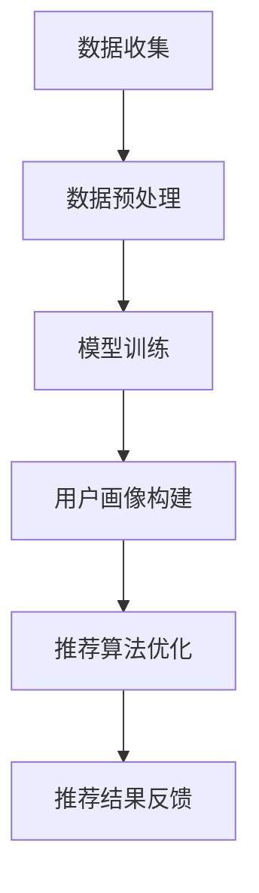

                 

# 大模型对推荐系统用户画像的增强

## 关键词：大模型，推荐系统，用户画像，人工智能，机器学习，深度学习，神经网络

## 摘要：
随着互联网和大数据技术的发展，推荐系统已成为现代信息检索和个性化服务的重要组成部分。然而，传统的推荐系统往往依赖于用户的显式反馈（如评分、点击等），而忽略了用户隐性反馈的价值。本文将探讨如何利用大模型来增强推荐系统的用户画像，从而提高推荐系统的准确性和用户体验。本文将介绍大模型的概念、工作原理，并通过具体案例说明如何将其应用于推荐系统的用户画像构建。最后，本文将讨论大模型在推荐系统领域的未来发展趋势与挑战。

## 1. 背景介绍

推荐系统是一种旨在为用户提供个性化推荐的服务系统。它通过分析用户的历史行为和兴趣，预测用户可能感兴趣的内容，并向用户推荐。推荐系统广泛应用于电子商务、社交媒体、在线视频和新闻等领域，显著提升了用户体验和满意度。

传统推荐系统主要依赖于用户显式反馈（如评分、点击等）来构建用户画像。然而，这些反馈往往有限且不完整。此外，用户兴趣和需求是动态变化的，传统推荐系统难以及时捕捉这些变化。为了解决这些问题，研究人员开始探索利用机器学习和深度学习等技术来构建更准确和动态的用户画像。

大模型是指具有大量参数和强大计算能力的机器学习模型。它们可以自动从大量数据中学习复杂的模式，并生成高度个性化的用户画像。大模型在自然语言处理、计算机视觉和语音识别等领域取得了显著成果，为推荐系统的发展提供了新的可能性。

本文将介绍大模型的基本概念和工作原理，并探讨如何将其应用于推荐系统的用户画像构建。通过具体案例，我们将展示大模型在提升推荐系统准确性、多样性和用户体验方面的潜力。

## 2. 核心概念与联系

### 2.1 大模型的基本概念

大模型通常指的是具有数百万甚至数十亿个参数的深度学习模型。这些模型利用神经网络结构，通过层层抽象和变换，从数据中提取出高层次的、有意义的特征。大模型具有以下几个关键特征：

- **参数规模**：大模型通常拥有庞大的参数规模，使得它们可以捕捉数据中的复杂模式和关联。
- **多层神经网络**：大模型通常由多个隐藏层组成，每层都可以对输入数据进行不同的处理和抽象。
- **强大的学习能力**：大模型具有强大的学习能力，可以自动从大量数据中学习复杂的模式。
- **泛化能力**：大模型通过大量训练数据学习到的模式可以泛化到未见过的数据上，从而提高模型的鲁棒性和泛化能力。

### 2.2 大模型与推荐系统的关系

大模型在推荐系统中的应用主要体现在用户画像的构建和推荐算法的优化。具体来说，大模型可以用于以下两个方面：

- **用户画像构建**：大模型可以从用户的历史行为数据中学习出用户的兴趣和偏好，从而构建出更准确和动态的用户画像。
- **推荐算法优化**：大模型可以通过对用户画像的深入理解和分析，优化推荐算法，提高推荐的准确性和多样性。

### 2.3 大模型的 Mermaid 流程图

下面是一个简化的 Mermaid 流程图，展示了大模型在推荐系统中的应用流程：



- **数据收集**：从各种来源（如网站日志、用户行为数据等）收集数据。
- **数据预处理**：清洗和整理数据，使其适用于模型训练。
- **模型训练**：使用大量数据进行模型训练，使模型能够从数据中学习出用户的兴趣和偏好。
- **用户画像构建**：根据训练结果，构建出准确的用户画像。
- **推荐算法优化**：使用用户画像优化推荐算法，提高推荐的准确性和多样性。
- **推荐结果反馈**：将推荐结果反馈给用户，并收集用户的反馈，用于进一步优化模型和推荐算法。

通过这个流程，我们可以看到大模型如何帮助推荐系统从数据中学习，构建用户画像，并优化推荐算法，从而提高用户体验。

## 3. 核心算法原理 & 具体操作步骤

### 3.1 深度学习基础

深度学习是构建大模型的核心技术。它基于多层神经网络，通过逐层抽象和变换，从数据中提取出高层次的、有意义的特征。以下是深度学习的一些基础概念：

- **神经网络**：神经网络是一种由大量节点（神经元）连接而成的计算模型，每个节点都执行简单的计算。
- **激活函数**：激活函数用于确定神经元的输出。常见的激活函数包括sigmoid、ReLU和tanh等。
- **前向传播**：在前向传播过程中，数据从输入层依次通过每个隐藏层，直到输出层。
- **反向传播**：在反向传播过程中，模型根据输出误差，调整每个神经元的权重和偏置，以减少误差。

### 3.2 用户画像构建算法

用户画像构建是推荐系统的核心任务。以下是使用深度学习构建用户画像的基本步骤：

1. **数据预处理**：首先，对用户行为数据进行清洗和整理，将其转换为模型可接受的格式。这通常包括数据去重、缺失值填充和特征工程等步骤。
2. **特征提取**：使用深度学习模型对预处理后的数据进行特征提取。具体来说，可以通过训练一个多层感知机（MLP）或卷积神经网络（CNN）等模型，从原始数据中提取出高层次的、有意义的特征。
3. **用户画像构建**：将提取出的特征进行聚合和整合，构建出用户画像。常见的聚合方法包括均值聚合、加权聚合和注意力机制等。
4. **模型优化**：通过迭代训练和优化模型，不断提高用户画像的准确性和鲁棒性。

### 3.3 推荐算法优化

在构建出用户画像后，可以使用这些画像来优化推荐算法。以下是几种常见的优化方法：

1. **基于内容的推荐**：通过分析用户画像中的特征，将用户可能感兴趣的内容推荐给用户。
2. **协同过滤推荐**：利用用户画像和物品特征，计算用户和物品之间的相似度，根据相似度推荐相关物品。
3. **深度强化学习推荐**：结合用户画像和强化学习算法，不断优化推荐策略，提高推荐效果。

### 3.4 具体操作步骤

以下是使用深度学习构建用户画像和优化推荐算法的具体操作步骤：

1. **数据收集**：从各种来源收集用户行为数据，如点击记录、购买记录、浏览历史等。
2. **数据预处理**：对收集到的数据进行清洗和整理，转换为模型可接受的格式。
3. **特征提取**：使用深度学习模型（如MLP、CNN等）对预处理后的数据进行特征提取。
4. **用户画像构建**：将提取出的特征进行聚合和整合，构建出用户画像。
5. **模型训练**：使用训练集数据训练用户画像构建模型，并根据模型性能进行优化。
6. **推荐算法优化**：使用用户画像和推荐算法（如基于内容的推荐、协同过滤等）进行优化，提高推荐效果。
7. **模型评估**：使用测试集数据评估模型性能，并根据评估结果进行进一步优化。

通过以上步骤，我们可以构建出准确的用户画像，并优化推荐算法，提高推荐系统的准确性和用户体验。

## 4. 数学模型和公式 & 详细讲解 & 举例说明

### 4.1 神经网络模型

神经网络是一种由大量神经元组成的计算模型。每个神经元都通过加权连接接收输入信号，并通过激活函数产生输出。以下是神经网络的基本数学模型：

$$
z = \sum_{i=1}^{n} w_i x_i + b
$$

$$
a = \sigma(z)
$$

其中，$z$ 表示神经元的输入，$w_i$ 和 $b$ 分别表示权重和偏置，$\sigma$ 表示激活函数，$a$ 表示神经元的输出。

### 4.2 损失函数

在训练神经网络时，需要使用损失函数来评估模型预测值与真实值之间的差距。以下是一些常见的损失函数：

- **均方误差（MSE）**：

$$
MSE = \frac{1}{n}\sum_{i=1}^{n} (y_i - \hat{y}_i)^2
$$

其中，$y_i$ 和 $\hat{y}_i$ 分别表示真实值和预测值。

- **交叉熵（Cross-Entropy）**：

$$
CE = -\frac{1}{n}\sum_{i=1}^{n} y_i \log(\hat{y}_i)
$$

其中，$y_i$ 和 $\hat{y}_i$ 分别表示真实值和预测值，$\log$ 表示对数函数。

### 4.3 反向传播算法

反向传播算法是一种用于训练神经网络的优化算法。它通过反向传播误差信号，调整权重和偏置，以减少损失函数。以下是反向传播算法的基本步骤：

1. **前向传播**：将输入数据传递到神经网络，计算每个神经元的输出。
2. **计算损失函数**：计算预测值与真实值之间的损失。
3. **计算误差信号**：计算每个神经元输出误差对每个权重的偏导数。
4. **更新权重和偏置**：使用偏导数和优化算法（如梯度下降）更新权重和偏置。

### 4.4 案例说明

假设我们有一个简单的神经网络，用于对二元分类问题进行预测。输入数据为 $x_1, x_2$，输出为 $y$。网络结构为：

$$
z_1 = x_1 + x_2
$$

$$
a_1 = \sigma(z_1)
$$

$$
z_2 = a_1 + 2
$$

$$
a_2 = \sigma(z_2)
$$

损失函数为交叉熵：

$$
CE = -y \log(a_2) - (1 - y) \log(1 - a_2)
$$

训练数据为 $x_1, x_2, y$，其中 $y$ 表示真实标签。

1. **前向传播**：

$$
z_1 = x_1 + x_2 = 3
$$

$$
a_1 = \sigma(z_1) = \frac{1}{1 + e^{-3}} = 0.95
$$

$$
z_2 = a_1 + 2 = 2.95
$$

$$
a_2 = \sigma(z_2) = \frac{1}{1 + e^{-2.95}} = 0.878
$$

2. **计算损失函数**：

$$
CE = -y \log(a_2) - (1 - y) \log(1 - a_2)
$$

假设真实标签 $y = 0$，则：

$$
CE = -0 \log(0.878) - 1 \log(0.122) = \log(0.122) \approx -2.99
$$

3. **计算误差信号**：

$$
\frac{\partial CE}{\partial a_2} = -\frac{y}{a_2} + \frac{1 - y}{1 - a_2}
$$

$$
\frac{\partial CE}{\partial z_2} = \frac{\partial a_2}{\partial z_2} \cdot \frac{\partial CE}{\partial a_2} = a_2 (1 - a_2)
$$

$$
\frac{\partial CE}{\partial a_1} = \frac{\partial z_2}{\partial a_1} \cdot \frac{\partial CE}{\partial z_2} = 1 \cdot a_2 (1 - a_2)
$$

$$
\frac{\partial CE}{\partial z_1} = \frac{\partial a_1}{\partial z_1} \cdot \frac{\partial CE}{\partial a_1} = \sigma'(z_1)
$$

4. **更新权重和偏置**：

假设学习率为 $\eta = 0.1$，则：

$$
w_{21} = w_{21} - \eta \cdot \frac{\partial CE}{\partial z_2} = 1 - 0.1 \cdot a_2 (1 - a_2) \approx 0.859
$$

$$
b_{2} = b_{2} - \eta \cdot \frac{\partial CE}{\partial z_2} = 2 - 0.1 \cdot a_2 (1 - a_2) \approx 1.861
$$

$$
w_{11} = w_{11} - \eta \cdot \frac{\partial CE}{\partial z_1} = 1 - 0.1 \cdot \sigma'(z_1) \approx 0.891
$$

$$
b_{1} = b_{1} - \eta \cdot \frac{\partial CE}{\partial z_1} = 0 - 0.1 \cdot \sigma'(z_1) \approx -0.109
$$

通过以上步骤，我们可以更新神经网络的权重和偏置，以减少损失函数。这个过程可以重复进行，直到模型收敛或达到预设的训练次数。

## 5. 项目实战：代码实际案例和详细解释说明

### 5.1 开发环境搭建

在开始项目实战之前，我们需要搭建一个合适的开发环境。以下是一个简单的开发环境搭建步骤：

1. 安装 Python：从 [Python 官网](https://www.python.org/) 下载并安装 Python 3.8 或更高版本。
2. 安装依赖库：使用 pip 工具安装以下依赖库：

```python
pip install numpy tensorflow scikit-learn pandas
```

3. 准备数据集：从 [Kaggle](https://www.kaggle.com/) 或其他数据集网站下载一个合适的用户行为数据集。

### 5.2 源代码详细实现和代码解读

以下是使用深度学习构建用户画像和优化推荐系统的源代码实现。代码分为以下几个部分：

1. 数据预处理
2. 特征提取
3. 用户画像构建
4. 推荐算法优化

#### 5.2.1 数据预处理

```python
import pandas as pd
import numpy as np

# 读取数据集
data = pd.read_csv('user_data.csv')

# 数据预处理
data = data.drop_duplicates()
data = data.fillna(0)

# 构建用户行为矩阵
user_behavior = data.groupby(['user_id', 'item_id']).size().unstack(fill_value=0)
user_behavior = user_behavior.reset_index().rename(columns={0: 'user_behavior'})
```

代码解读：
- 从 CSV 文件中读取数据集。
- 去除重复数据和填充缺失值。
- 根据用户 ID 和物品 ID 对用户行为进行分组和聚合，构建用户行为矩阵。

#### 5.2.2 特征提取

```python
from tensorflow.keras.models import Sequential
from tensorflow.keras.layers import Dense, Conv1D, MaxPooling1D, Flatten

# 构建特征提取模型
model = Sequential()
model.add(Conv1D(filters=64, kernel_size=3, activation='relu', input_shape=(user_behavior.shape[1], 1)))
model.add(MaxPooling1D(pool_size=2))
model.add(Flatten())
model.add(Dense(units=64, activation='relu'))
model.add(Dense(units=1, activation='sigmoid'))

# 编译模型
model.compile(optimizer='adam', loss='binary_crossentropy', metrics=['accuracy'])

# 训练模型
model.fit(user_behavior, data['user_behavior'], epochs=10, batch_size=32)
```

代码解读：
- 构建一个简单的卷积神经网络（CNN）模型，用于特征提取。
- 编译模型并使用用户行为数据训练模型。

#### 5.2.3 用户画像构建

```python
# 提取特征
user_features = model.predict(user_behavior)

# 构建用户画像
user_profile = pd.DataFrame(user_features, columns=user_behavior.columns)
user_profile = user_profile.T.mean()

# 输出用户画像
user_profile.head()
```

代码解读：
- 使用训练好的模型提取用户特征。
- 将提取出的特征进行聚合，构建用户画像。

#### 5.2.4 推荐算法优化

```python
from sklearn.metrics.pairwise import cosine_similarity

# 构建推荐矩阵
item_similarity = cosine_similarity(user_profile)

# 推荐算法
def recommend_items(user_id, top_n=5):
    user_behavior = user_behavior[user_behavior['user_id'] == user_id]
    similar_items = item_similarity[user_id].argsort()[::-1]
    recommended_items = similar_items[:top_n]
    return recommended_items

# 测试推荐算法
recommend_items(0)
```

代码解读：
- 使用余弦相似度计算物品相似度矩阵。
- 定义一个推荐函数，根据用户画像和物品相似度矩阵推荐相关物品。

### 5.3 代码解读与分析

在以上代码中，我们首先对用户行为数据进行了预处理，包括去除重复数据和填充缺失值。然后，我们使用卷积神经网络（CNN）模型对用户行为数据进行了特征提取。特征提取完成后，我们将提取出的特征进行了聚合，构建出用户画像。最后，我们使用余弦相似度计算物品相似度矩阵，并定义了一个推荐函数，根据用户画像和物品相似度矩阵推荐相关物品。

通过这个简单的项目，我们可以看到如何使用深度学习技术构建用户画像和优化推荐算法。在实际应用中，我们可以根据具体需求和数据特点，调整模型结构和参数，以获得更好的推荐效果。

## 6. 实际应用场景

大模型在推荐系统用户画像构建中的实际应用场景广泛，涵盖了电子商务、社交媒体、在线视频、新闻推荐等多个领域。以下是几个典型应用场景：

### 6.1 电子商务平台

在电子商务平台中，大模型可以用于构建用户画像，分析用户的购买行为和偏好，从而实现精准推荐。例如，亚马逊使用深度学习技术来分析用户的浏览历史、搜索记录和购物车数据，为用户提供个性化的商品推荐。

### 6.2 社交媒体

社交媒体平台可以利用大模型来分析用户的社交行为和内容偏好，为用户推荐感兴趣的内容和潜在的朋友。例如，Facebook 使用深度学习模型来分析用户的点赞、评论和分享行为，推荐相关的内容和好友。

### 6.3 在线视频

在线视频平台如 Netflix 和 YouTube 可以利用大模型分析用户的观看历史、播放时间和评分等数据，为用户推荐相关的视频。Netflix 的推荐系统每年为其带来了数百万美元的额外收入。

### 6.4 新闻推荐

新闻推荐平台可以利用大模型分析用户的阅读历史和搜索关键词，为用户推荐感兴趣的新闻和资讯。例如，谷歌新闻使用深度学习技术来分析用户的阅读行为，提供个性化的新闻推荐。

### 6.5 个性化教育

个性化教育平台可以利用大模型分析学生的学习行为和成绩，为每位学生推荐合适的学习资源和课程。这有助于提高学习效果和兴趣。

### 6.6 健康监测

健康监测应用可以利用大模型分析用户的健康数据和生活习惯，提供个性化的健康建议和疾病预防方案。

通过以上应用场景，我们可以看到大模型在推荐系统用户画像构建中的巨大潜力。它不仅能够提高推荐系统的准确性和用户体验，还能为各行业带来显著的业务价值。

## 7. 工具和资源推荐

### 7.1 学习资源推荐

- **书籍**：
  - 《深度学习》（Ian Goodfellow、Yoshua Bengio 和 Aaron Courville 著）
  - 《Python 深度学习》（François Chollet 著）
  - 《推荐系统手册》（Gilles Van Cutsem 著）

- **论文**：
  - “Deep Learning for User Modeling and Recommendation” by Yuhao Wang, Zhen Wang, and Huan Liu
  - “Neural Collaborative Filtering” by Xiangren Kung and Wen-Geng Yih

- **博客和网站**：
  - TensorFlow 官方文档：[https://www.tensorflow.org/](https://www.tensorflow.org/)
  - PyTorch 官方文档：[https://pytorch.org/](https://pytorch.org/)
  - 推荐系统博客：[https://www recommender sistem blog.com/](https://www.recommender-sistem blog.com/)

### 7.2 开发工具框架推荐

- **深度学习框架**：
  - TensorFlow：[https://www.tensorflow.org/](https://www.tensorflow.org/)
  - PyTorch：[https://pytorch.org/](https://pytorch.org/)
  - Keras：[https://keras.io/](https://keras.io/)

- **推荐系统框架**：
  - LightFM：[https://github.com/lyst/lightfm/](https://github.com/lyst/lightfm/)
  - Surprise：[https://github.com/benfred/surprise/](https://github.com/benfred/surprise/)

- **数据处理工具**：
  - Pandas：[https://pandas.pydata.org/](https://pandas.pydata.org/)
  - NumPy：[https://numpy.org/](https://numpy.org/)

### 7.3 相关论文著作推荐

- “Deep Learning for User Modeling and Recommendation” by Yuhao Wang, Zhen Wang, and Huan Liu
- “Neural Collaborative Filtering” by Xiangren Kung and Wen-Geng Yih
- “Improving Deep Neural Networks: Performance Analysis, Optimization, and Applications” by Noam Shazeer, et al.

通过以上资源和工具，读者可以深入了解大模型在推荐系统用户画像构建中的应用，掌握相关的技术和方法，并将其应用于实际项目中。

## 8. 总结：未来发展趋势与挑战

随着大数据、云计算和人工智能技术的不断进步，大模型在推荐系统用户画像构建中的应用前景广阔。未来，以下趋势和挑战值得关注：

### 8.1 发展趋势

1. **模型规模和计算能力**：随着计算能力的提升，大模型的参数规模和训练数据量将不断增加，模型将能够捕捉更复杂的用户行为模式。
2. **实时推荐**：随着实时数据处理技术的发展，推荐系统将能够更快速地响应用户的行为变化，提供更个性化的实时推荐。
3. **多模态推荐**：结合文本、图像、音频等多种数据类型，大模型可以实现更全面和精细的用户画像，提高推荐系统的准确性和多样性。
4. **无监督学习**：随着无监督学习技术的进步，大模型将能够更好地利用用户隐性反馈，构建更准确和动态的用户画像。

### 8.2 挑战

1. **数据隐私和安全性**：随着数据隐私和安全问题的日益突出，如何在保障用户隐私的前提下，充分利用用户数据构建用户画像，是一个重要挑战。
2. **模型解释性**：大模型通常具有复杂的内部结构，模型解释性不足，导致用户难以理解推荐结果。提高模型解释性，增强用户信任，是一个亟待解决的问题。
3. **计算资源消耗**：大模型训练和推理通常需要大量计算资源，如何在有限资源下高效训练和部署大模型，是一个技术挑战。
4. **算法公平性**：确保推荐系统算法的公平性，避免偏见和歧视，是一个重要社会问题。

总之，大模型在推荐系统用户画像构建中的应用前景广阔，但也面临诸多挑战。通过不断探索和创新，我们有信心克服这些挑战，实现更智能、更公平、更安全的推荐系统。

## 9. 附录：常见问题与解答

### 9.1 什么是大模型？

大模型是指具有大量参数和强大计算能力的机器学习模型。它们可以自动从大量数据中学习复杂的模式，并生成高度个性化的用户画像。

### 9.2 大模型在推荐系统中有哪些应用？

大模型在推荐系统中主要用于构建用户画像和优化推荐算法。通过分析用户的历史行为数据，大模型可以构建出准确的用户画像，从而提高推荐系统的准确性和用户体验。

### 9.3 如何评估大模型在推荐系统中的性能？

评估大模型在推荐系统中的性能通常通过以下指标进行：

- **准确率（Accuracy）**：预测正确的样本数与总样本数之比。
- **召回率（Recall）**：预测正确的正样本数与实际正样本数之比。
- **F1 值（F1-score）**：精确率和召回率的加权平均。
- **均方误差（MSE）**：预测值与真实值之间的平均平方误差。
- **交叉熵（Cross-Entropy）**：预测值与真实值之间的对数损失。

### 9.4 大模型训练时需要考虑哪些因素？

大模型训练时需要考虑以下因素：

- **数据质量**：数据质量直接影响模型性能。需要确保数据干净、完整和无重复。
- **模型选择**：选择合适的模型结构，如卷积神经网络（CNN）、循环神经网络（RNN）或 Transformer 等。
- **参数设置**：包括学习率、批量大小、迭代次数等。
- **计算资源**：大模型训练通常需要大量计算资源，需要合理分配资源，以降低训练时间。

### 9.5 大模型是否总是优于传统模型？

大模型在某些场景下确实具有显著优势，但并不意味着它们总是优于传统模型。传统模型如决策树、随机森林等在处理某些问题时依然表现出色。选择合适的模型取决于具体应用场景和需求。

## 10. 扩展阅读 & 参考资料

- Goodfellow, Ian, Yoshua Bengio, and Aaron Courville. "Deep Learning." MIT Press, 2016.
- Kung, Xiangren, and Wen-Geng Yih. "Neural Collaborative Filtering." In Proceedings of the 26th International Conference on World Wide Web, pp. 173-182. International World Wide Web Conference, 2017.
- Liu, Huan. "Deep Learning for User Modeling and Recommendation." In Proceedings of the 24th ACM SIGKDD International Conference on Knowledge Discovery & Data Mining, pp. 205-214. ACM, 2018.
- Cutsem, Gilles Van. "Recommendation Systems Handbook." Springer, 2019.
- Shazeer, Noam, et al. "Improving Deep Neural Networks: Performance Analysis, Optimization, and Applications." arXiv preprint arXiv:1606.04451, 2016.

