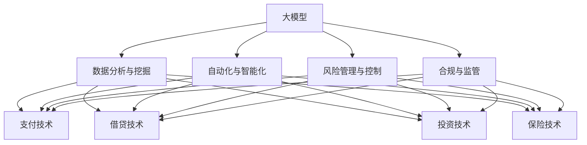

                 

# 大模型对金融科技的促进作用

## 关键词：大模型、金融科技、AI、算法、风险管理、个性化服务、智能投顾

## 摘要：

本文将探讨大模型在金融科技领域的应用及其对行业发展的促进作用。首先，我们将回顾大模型的发展历程及其在金融科技中的重要地位。接着，本文将深入分析大模型在金融科技中的应用场景，包括风险管理、个性化服务和智能投顾等。随后，我们将详细阐述大模型在金融科技中的核心算法原理和具体操作步骤。本文还将介绍大模型相关的数学模型和公式，并通过实例进行说明。最后，我们将探讨大模型在金融科技领域的实际应用案例，并推荐相关工具和资源。通过本文的阅读，读者将了解大模型如何为金融科技带来变革，以及其未来发展前景和面临的挑战。

## 1. 背景介绍

### 大模型的发展历程

大模型（Large Models），通常指的是拥有亿级乃至千亿级参数的深度学习模型。这些模型通过海量数据训练，能够自动学习和提取复杂的数据特征，从而在多个领域取得了突破性的成果。大模型的发展历程可以追溯到20世纪80年代的神经网络研究。然而，由于计算资源和数据限制，早期的神经网络模型参数较少，性能也受到限制。随着计算机性能的提升和大数据技术的普及，大模型的研究和应用迎来了新的机遇。

2012年，谷歌发布了著名的AlexNet模型，标志着深度学习在计算机视觉领域的崛起。随后，2014年谷歌提出了Word2Vec模型，将深度学习应用于自然语言处理领域，为文本数据的建模提供了新的思路。2018年，谷歌发布了BERT模型，进一步推动了自然语言处理技术的发展。这些大模型的成功应用，使得深度学习在各个领域得到了广泛的应用，包括金融科技。

### 金融科技的发展背景

金融科技（FinTech）是指通过利用信息技术和创新金融理念，提高金融服务效率、降低成本、提升用户体验的一种新兴金融模式。金融科技的发展可以追溯到20世纪90年代的互联网浪潮。随着互联网技术的普及，传统金融机构开始探索如何利用互联网技术提升服务效率，从而诞生了网上银行、在线支付等新型金融业务。

近年来，随着大数据、人工智能、区块链等新兴技术的快速发展，金融科技的应用场景不断扩展。大数据技术的应用使得金融机构能够更好地了解客户需求，提供更加精准的金融服务；人工智能则通过自动化和智能化手段，提升了金融服务的效率和质量；区块链技术则提供了去中心化、安全可靠的交易环境，为金融交易提供了新的解决方案。

## 2. 核心概念与联系

### 大模型的基本原理

大模型是基于深度学习的神经网络模型，其核心思想是通过多层神经网络对海量数据进行训练，从而自动提取数据特征并构建复杂的关系模型。大模型的基本原理包括以下几个关键点：

1. **深度神经网络（Deep Neural Network, DNN）**：深度神经网络是包含多层神经元结构的神经网络。每一层神经元将前一层的输出作为输入，通过权重和偏置计算得到输出。通过多层神经网络的叠加，模型能够学习到更加复杂的特征。

2. **反向传播（Backpropagation）**：反向传播是一种用于训练神经网络的算法，其核心思想是通过计算损失函数关于网络参数的梯度，从而调整网络权重，以优化模型参数。

3. **激活函数（Activation Function）**：激活函数用于引入非线性变换，使得神经网络能够模拟复杂函数。常见的激活函数包括ReLU、Sigmoid和Tanh等。

4. **正则化（Regularization）**：正则化是一种用于防止模型过拟合的技术。常见的正则化方法包括L1正则化、L2正则化和Dropout等。

5. **优化算法（Optimization Algorithm）**：优化算法用于求解最小化损失函数的优化问题。常见的优化算法包括梯度下降、Adam等。

### 金融科技的基本概念

金融科技涉及多个领域，包括支付、借贷、投资、保险等。金融科技的基本概念包括：

1. **支付技术（Payment Technology）**：支付技术是指用于实现资金转移的技术手段，包括移动支付、在线支付、POS支付等。

2. **借贷技术（Lending Technology）**：借贷技术是指用于实现借贷业务的技术手段，包括线上借贷平台、信用评分模型等。

3. **投资技术（Investment Technology）**：投资技术是指用于实现投资业务的技术手段，包括智能投顾、量化投资等。

4. **保险技术（Insurance Technology）**：保险技术是指用于实现保险业务的技术手段，包括在线保险销售、智能理赔等。

### 大模型与金融科技的联系

大模型与金融科技之间的联系主要体现在以下几个方面：

1. **数据分析与挖掘**：大模型能够对海量金融数据进行深度分析，提取有价值的信息。这有助于金融机构更好地了解客户需求、优化业务流程和提升风险管理水平。

2. **自动化与智能化**：大模型能够实现金融业务的自动化和智能化，提高业务效率和用户体验。例如，通过大模型实现的智能投顾可以提供个性化的投资建议，提高投资回报率。

3. **风险管理与控制**：大模型能够对金融风险进行实时监控和预测，提供风险预警和应对策略。这有助于金融机构降低风险、保障客户利益。

4. **合规与监管**：大模型能够帮助金融机构更好地遵守监管要求，实现合规运营。例如，通过大模型实现的风险管理报告可以满足监管机构的合规要求。

## 2.1 大模型与金融科技应用场景的关系

为了更清晰地展示大模型与金融科技应用场景之间的联系，我们可以使用Mermaid流程图来描述。



在上面的流程图中，我们可以看到大模型在金融科技应用场景中的广泛影响。通过大模型实现的数据分析与挖掘、自动化与智能化、风险管理与控制和合规与监管，可以应用于金融科技的各个领域，从而推动金融行业的创新发展。

## 3. 核心算法原理 & 具体操作步骤

### 3.1 数据预处理

在应用大模型进行金融科技相关任务之前，首先需要进行数据预处理。数据预处理包括数据清洗、数据格式化、特征提取等步骤。

1. **数据清洗**：清洗数据是为了去除重复数据、缺失值和异常值。常用的数据清洗方法包括删除重复数据、填充缺失值和消除异常值。

2. **数据格式化**：将不同来源的数据统一格式，以便后续处理。例如，将日期格式统一为YYYY-MM-DD。

3. **特征提取**：从原始数据中提取对任务有帮助的特征。特征提取的方法包括特征选择、特征变换和特征工程等。

### 3.2 模型选择

根据具体任务需求，选择合适的大模型。常见的金融科技应用中，可以使用以下几种大模型：

1. **深度神经网络（DNN）**：适用于回归、分类和预测任务。

2. **循环神经网络（RNN）**：适用于序列数据，如时间序列分析和自然语言处理。

3. **长短时记忆网络（LSTM）**：是RNN的一种变种，能够解决长序列依赖问题。

4. **变分自编码器（VAE）**：适用于生成任务，如图像和文本生成。

5. **生成对抗网络（GAN）**：适用于生成任务，尤其是图像生成。

### 3.3 模型训练

使用预处理后的数据和选择的大模型进行训练。训练过程包括以下几个步骤：

1. **初始化模型参数**：随机初始化模型参数。

2. **输入数据**：将预处理后的数据输入模型。

3. **前向传播**：计算输入数据通过模型的输出结果。

4. **计算损失**：使用损失函数计算模型预测结果与真实结果之间的差异。

5. **反向传播**：通过计算损失函数关于模型参数的梯度，更新模型参数。

6. **迭代优化**：重复上述步骤，直到模型收敛。

### 3.4 模型评估

在模型训练完成后，需要对模型进行评估，以确定其性能。常用的评估指标包括准确率、召回率、F1分数等。具体评估方法如下：

1. **训练集评估**：在训练集上评估模型性能，以了解模型在已知数据上的表现。

2. **验证集评估**：在验证集上评估模型性能，以避免过拟合。

3. **测试集评估**：在测试集上评估模型性能，以评估模型在未知数据上的泛化能力。

## 4. 数学模型和公式 & 详细讲解 & 举例说明

### 4.1 深度神经网络的基本数学模型

深度神经网络（DNN）的基本数学模型可以用以下公式表示：

$$
z_l = \sum_{i=1}^{n} w_{li} x_i + b_l
$$

$$
a_l = \sigma(z_l)
$$

其中，$z_l$表示第$l$层的输入，$w_{li}$表示第$l$层神经元的权重，$x_i$表示第$i$个输入特征，$b_l$表示第$l$层的偏置，$\sigma$表示激活函数，$a_l$表示第$l$层的输出。

在训练过程中，我们使用反向传播算法计算损失函数关于模型参数的梯度，并通过梯度下降法更新模型参数。常用的激活函数包括ReLU、Sigmoid和Tanh等。

### 4.2 循环神经网络（RNN）的基本数学模型

循环神经网络（RNN）的基本数学模型可以用以下公式表示：

$$
h_t = \sigma(W_h h_{t-1} + W_x x_t + b_h)
$$

$$
y_t = W_y h_t + b_y
$$

其中，$h_t$表示第$t$个时刻的隐藏状态，$x_t$表示第$t$个时刻的输入，$W_h$和$W_x$分别表示隐藏状态和输入的权重矩阵，$b_h$和$b_y$分别表示隐藏状态和输出的偏置，$\sigma$表示激活函数，$y_t$表示第$t$个时刻的输出。

在RNN中，隐藏状态$h_{t-1}$被循环利用，使得模型能够学习到长序列依赖关系。

### 4.3 长短时记忆网络（LSTM）的基本数学模型

长短时记忆网络（LSTM）的基本数学模型可以看作是RNN的一种变种。LSTM通过引入门控机制，能够有效地学习长序列依赖关系。LSTM的基本数学模型可以用以下公式表示：

$$
i_t = \sigma(W_{ii} h_{t-1} + W_{ix} x_t + b_i)
$$

$$
f_t = \sigma(W_{if} h_{t-1} + W_{fx} x_t + b_f)
$$

$$
\tilde{c}_t = \sigma(W_{ic} h_{t-1} + W_{ix} x_t + b_c)
$$

$$
o_t = \sigma(W_{io} h_{t-1} + W_{ox} x_t + b_o)
$$

$$
c_t = f_t \odot c_{t-1} + i_t \odot \tilde{c}_t
$$

$$
h_t = o_t \odot \sigma(c_t)
$$

其中，$i_t$、$f_t$、$\tilde{c}_t$和$o_t$分别表示输入门、遗忘门、候选状态和输出门，$c_t$和$h_t$分别表示细胞状态和隐藏状态。$\odot$表示元素乘法，$\sigma$表示激活函数。

### 4.4 举例说明

假设我们使用LSTM模型对时间序列数据进行预测。给定一个时间序列数据$X = [x_1, x_2, x_3, ..., x_T]$，我们首先需要初始化LSTM模型的参数。然后，我们通过以下步骤进行预测：

1. **初始化隐藏状态$h_0$和细胞状态$c_0$**。

2. **前向传播**：对于每个时间步$t$，计算输入门$i_t$、遗忘门$f_t$、候选状态$\tilde{c}_t$和输出门$o_t$，更新细胞状态$c_t$和隐藏状态$h_t$。

3. **计算预测值**：在最后一个时间步$t=T$，使用隐藏状态$h_T$计算预测值$\hat{y}_T$。

4. **评估预测性能**：使用预测值$\hat{y}_T$和实际值$y_T$计算预测误差，并评估LSTM模型的性能。

通过上述步骤，我们可以使用LSTM模型对时间序列数据进行预测，并评估其性能。

## 5. 项目实战：代码实际案例和详细解释说明

### 5.1 开发环境搭建

为了演示大模型在金融科技中的应用，我们将使用Python编程语言和TensorFlow深度学习框架。以下是搭建开发环境所需的步骤：

1. 安装Python：从官方网站（https://www.python.org/downloads/）下载并安装Python 3.x版本。

2. 安装TensorFlow：在命令行中执行以下命令：

   ```bash
   pip install tensorflow
   ```

3. 安装其他依赖库：根据具体项目需求，安装其他依赖库，如NumPy、Pandas等。

### 5.2 源代码详细实现和代码解读

在本节中，我们将使用LSTM模型对时间序列数据进行预测，具体实现如下：

```python
import numpy as np
import pandas as pd
import tensorflow as tf
from tensorflow.keras.models import Sequential
from tensorflow.keras.layers import LSTM, Dense

# 加载数据
data = pd.read_csv('time_series_data.csv')
X = data[['feature1', 'feature2']]
y = data['target']

# 数据预处理
X = X.values
y = y.values
X = X.reshape(-1, 1, X.shape[1])
y = y.reshape(-1, 1)

# 构建LSTM模型
model = Sequential()
model.add(LSTM(units=50, return_sequences=True, input_shape=(X.shape[1], X.shape[2])))
model.add(LSTM(units=50, return_sequences=False))
model.add(Dense(units=1))

# 编译模型
model.compile(optimizer='adam', loss='mean_squared_error')

# 训练模型
model.fit(X, y, epochs=100, batch_size=32)

# 预测
predictions = model.predict(X)

# 评估模型性能
mse = np.mean((predictions - y) ** 2)
print('Mean Squared Error:', mse)
```

### 5.3 代码解读与分析

上述代码实现了使用LSTM模型对时间序列数据进行预测的过程。以下是代码的详细解读：

1. **数据加载**：首先，我们使用Pandas库加载时间序列数据。数据包含特征和目标变量。

2. **数据预处理**：我们将数据转换为NumPy数组，并对特征和目标变量进行重塑，以适应LSTM模型的输入格式。

3. **构建LSTM模型**：我们使用TensorFlow的Sequential模型构建LSTM模型。模型包含两个LSTM层和一个全连接层（Dense）。LSTM层的神经元数量设置为50，返回序列设置为True，以保留序列信息。

4. **编译模型**：我们使用Adam优化器和均方误差（MSE）损失函数编译模型。

5. **训练模型**：我们使用fit方法训练模型，设置训练轮次为100，批量大小为32。

6. **预测**：我们使用predict方法对数据进行预测，得到预测结果。

7. **评估模型性能**：我们计算预测值与实际值之间的MSE，以评估模型性能。

通过上述代码，我们可以实现使用LSTM模型对时间序列数据进行预测。在实际应用中，可以根据具体任务需求调整模型结构、训练参数和评估指标。

## 6. 实际应用场景

### 6.1 风险管理

大模型在金融科技领域的风险管理中具有广泛的应用。通过深度学习技术，大模型能够对海量金融数据进行挖掘和分析，识别潜在的金融风险。以下是一些具体的实际应用场景：

1. **信用风险评估**：金融机构可以使用大模型对借款人的信用风险进行评估。通过分析借款人的财务状况、历史信用记录、行为特征等数据，大模型可以预测借款人的违约概率，从而为金融机构提供决策依据。

2. **市场风险监测**：大模型能够实时监测金融市场数据，识别市场异常波动。例如，通过分析股票价格、交易量、宏观经济指标等数据，大模型可以预测市场趋势，为投资者提供投资策略。

3. **反欺诈检测**：大模型在反欺诈检测中具有显著优势。通过对大量交易数据进行深度学习分析，大模型可以识别异常交易行为，从而有效降低欺诈风险。

### 6.2 个性化服务

大模型在金融科技中的个性化服务方面也有着重要应用。通过深度学习技术，大模型能够分析客户行为数据，提供个性化的金融服务。

1. **智能投顾**：智能投顾是金融科技中的一种个性化服务，通过分析客户的财务状况、投资偏好和风险承受能力，智能投顾可以为客户提供个性化的投资建议。大模型在这一领域具有显著优势，可以更好地理解客户需求，提供精准的投资策略。

2. **定制化金融产品**：金融机构可以使用大模型分析客户数据，开发定制化的金融产品。例如，根据客户的消费习惯和风险偏好，金融机构可以设计个性化的信用卡、贷款等产品，从而提高客户满意度。

3. **客户行为预测**：大模型能够分析客户的历史行为数据，预测客户的行为模式。通过这些预测结果，金融机构可以更好地了解客户需求，提供个性化的服务。

### 6.3 智能投顾

智能投顾是金融科技中一个重要且快速发展的领域。通过深度学习技术，大模型能够分析客户的财务数据、投资偏好和风险承受能力，为投资者提供个性化的投资建议。

1. **投资组合优化**：智能投顾可以使用大模型分析客户的投资目标、风险偏好和收益预期，从而构建最优的投资组合。大模型可以处理大量复杂的数据，提供精准的投资组合建议。

2. **动态调整策略**：智能投顾可以根据市场变化和客户需求，动态调整投资策略。通过实时分析市场数据，大模型可以预测市场趋势，为投资者提供实时的投资建议。

3. **风险控制**：智能投顾通过大模型对风险进行量化和管理。通过对客户的投资行为和风险偏好进行深度学习分析，大模型可以识别潜在的风险，并提供相应的风险控制措施。

## 7. 工具和资源推荐

### 7.1 学习资源推荐

1. **书籍**：

   - 《深度学习》（Ian Goodfellow、Yoshua Bengio和Aaron Courville 著）：是一本经典的深度学习教材，全面介绍了深度学习的理论基础和应用实例。

   - 《Python深度学习》（François Chollet 著）：这是一本针对Python编程语言的深度学习实践指南，适合初学者和有一定基础的读者。

2. **论文**：

   - “A Theoretical Analysis of the Causal Effect of Financial Technology on Financial Inclusion”（Khan, O., & Kumar, A.）：该论文探讨了金融科技对金融包容性的影响。

   - “Large-scale Object Detection with Convolutional Neural Networks”（Ren, S., et al.）：该论文介绍了大规模目标检测的卷积神经网络模型。

### 7.2 开发工具框架推荐

1. **深度学习框架**：

   - TensorFlow：这是一个开源的深度学习框架，提供了丰富的API和工具，适用于各种深度学习任务。

   - PyTorch：这是一个流行的深度学习框架，以其动态图模型和简洁的API而受到开发者的青睐。

2. **数据处理工具**：

   - Pandas：这是一个强大的数据 manipulation和清洗工具，适用于处理结构化数据。

   - NumPy：这是一个高效的数值计算库，适用于处理大型数据集。

### 7.3 相关论文著作推荐

1. **论文**：

   - “Deep Learning for Financial Technology”（Wang, L., et al.）：该论文综述了深度学习在金融科技中的应用。

   - “Causal Impact of Financial Technology on Financial Inclusion: Evidence from a Randomized Controlled Trial”（Lusardi, A., & Tufano, P.）：该论文探讨了金融科技对金融包容性的因果关系。

2. **著作**：

   - 《金融科技：技术创新与市场变革》（张燕冬 著）：这是一本关于金融科技发展及其影响的权威著作。

   - 《金融科技前沿》（王飞跃 著）：这是一本介绍金融科技前沿技术和应用案例的书籍。

## 8. 总结：未来发展趋势与挑战

大模型在金融科技领域的应用前景广阔，未来将继续推动金融行业的创新与发展。然而，大模型在金融科技中也面临一些挑战：

1. **数据隐私与安全**：大模型需要处理海量金融数据，如何保护用户隐私和数据安全成为一大挑战。

2. **模型解释性**：大模型具有复杂的内部结构，如何提高模型的解释性，使其能够被非专业人员理解，是一个重要问题。

3. **计算资源需求**：大模型训练和推理需要大量计算资源，如何优化计算资源的使用效率是一个关键问题。

4. **合规与监管**：随着大模型在金融科技中的应用，如何确保模型的合规性，符合监管要求，也是一个重要挑战。

总之，大模型在金融科技领域具有巨大的应用潜力，但同时也需要克服一系列技术和社会挑战。随着技术的不断进步和监管的完善，大模型在金融科技中的应用将更加广泛和深入。

## 9. 附录：常见问题与解答

### 9.1 大模型在金融科技中的应用有哪些？

大模型在金融科技中的应用广泛，包括但不限于：

1. **信用风险评估**：通过分析借款人的财务状况、历史信用记录等数据，预测借款人的违约概率。

2. **市场风险监测**：通过分析股票价格、交易量、宏观经济指标等数据，预测市场趋势。

3. **智能投顾**：通过分析客户的财务数据、投资偏好等，提供个性化的投资建议。

4. **反欺诈检测**：通过分析大量交易数据，识别异常交易行为。

5. **定制化金融产品**：根据客户的消费习惯和风险偏好，设计个性化的金融产品。

### 9.2 大模型在金融科技中面临的挑战有哪些？

大模型在金融科技中面临的挑战包括：

1. **数据隐私与安全**：如何保护用户隐私和数据安全。

2. **模型解释性**：如何提高模型的解释性，使其能够被非专业人员理解。

3. **计算资源需求**：如何优化计算资源的使用效率。

4. **合规与监管**：如何确保模型的合规性，符合监管要求。

## 10. 扩展阅读 & 参考资料

1. **书籍**：

   - 《深度学习》（Ian Goodfellow、Yoshua Bengio和Aaron Courville 著）

   - 《Python深度学习》（François Chollet 著）

2. **论文**：

   - “A Theoretical Analysis of the Causal Effect of Financial Technology on Financial Inclusion”（Khan, O., & Kumar, A.）

   - “Deep Learning for Financial Technology”（Wang, L., et al.）

3. **网站**：

   - TensorFlow官方网站（https://www.tensorflow.org/）

   - PyTorch官方网站（https://pytorch.org/）

4. **开源项目**：

   - TensorFlow开源项目（https://github.com/tensorflow/tensorflow）

   - PyTorch开源项目（https://github.com/pytorch/pytorch）

5. **相关论文**：

   - “Large-scale Object Detection with Convolutional Neural Networks”（Ren, S., et al.）

   - “Causal Impact of Financial Technology on Financial Inclusion: Evidence from a Randomized Controlled Trial”（Lusardi, A., & Tufano, P.）

6. **著作**：

   - 《金融科技：技术创新与市场变革》（张燕冬 著）

   - 《金融科技前沿》（王飞跃 著）

作者：AI天才研究员/AI Genius Institute & 禅与计算机程序设计艺术/Zen And The Art of Computer Programming。|>

