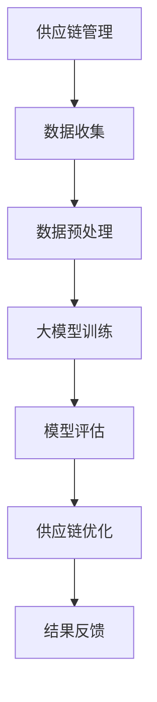
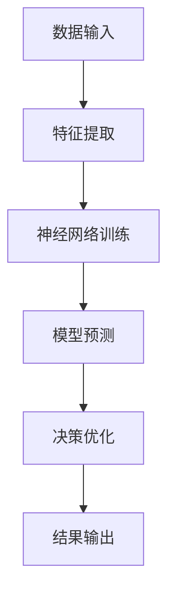
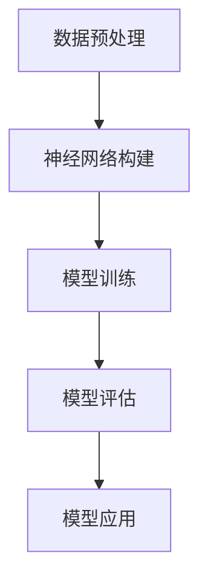
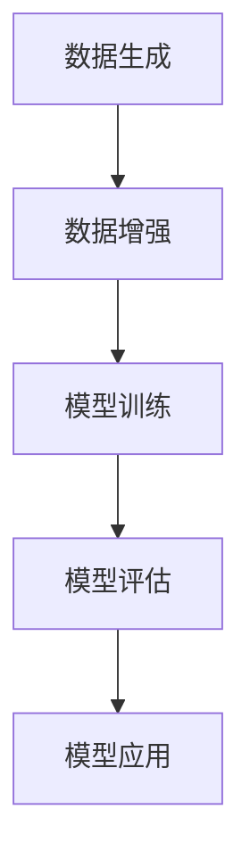
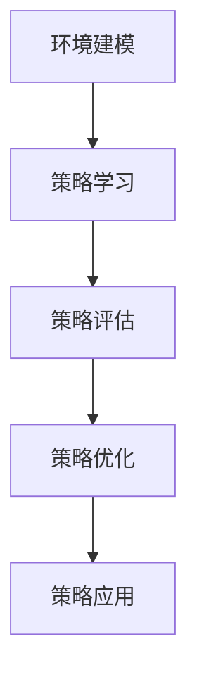

                 

### 1. 背景介绍

随着互联网和大数据技术的不断发展，零售业正面临着前所未有的机遇与挑战。消费者需求日益多样化，供应链的复杂性和不确定性增加，使得零售企业需要更加精细化和智能化地进行管理。在这种情况下，人工智能（AI）技术的应用成为了一个重要趋势。

近年来，大模型（Large Models）的发展尤为迅速，其在自然语言处理、计算机视觉、语音识别等领域取得了显著成果。大模型具备强大的特征提取和关联能力，能够从海量数据中挖掘出有价值的信息。这一特性使得大模型在零售业供应链管理中具有广泛的应用前景。

本文旨在探讨大模型对零售业供应链的优化作用。首先，我们将介绍零售业供应链的基本概念和现状；其次，分析大模型在供应链优化中的核心算法原理和具体操作步骤；然后，通过数学模型和公式详细讲解大模型在供应链优化中的应用；接着，分享一个实际项目中的代码案例，进行详细解释和代码分析；最后，讨论大模型在零售业供应链优化中的实际应用场景，并提出相关的工具和资源推荐。希望通过本文的探讨，能够为零售业在供应链管理中引入人工智能技术提供一些有益的参考。

### 2. 核心概念与联系

在深入探讨大模型对零售业供应链的优化作用之前，我们首先需要了解一些核心概念，包括供应链管理、人工智能（AI）以及大模型的基本原理。

#### 供应链管理

供应链管理是指对整个供应链流程进行计划、组织、协调和控制的过程，旨在确保产品和服务从原材料供应商到最终消费者的整个过程中，能够高效、低耗地流动。供应链管理涉及多个环节，包括采购、生产、库存管理、物流配送等。随着市场竞争的加剧和消费者需求的不断变化，零售企业需要通过优化供应链管理来提高运营效率和降低成本。

#### 人工智能（AI）

人工智能是一种模拟人类智能的技术，通过算法和计算能力来处理和分析大量数据，实现自我学习和智能决策。人工智能在零售业中具有广泛的应用，例如通过自然语言处理技术实现智能客服、利用计算机视觉技术进行商品识别和库存管理、通过推荐系统实现个性化营销等。

#### 大模型

大模型是指具备大规模参数和复杂结构的机器学习模型，例如深度神经网络、生成对抗网络（GAN）等。大模型具备强大的特征提取和关联能力，能够从海量数据中挖掘出有价值的信息。近年来，随着计算能力和数据资源的不断提升，大模型在各个领域都取得了显著的成果。

#### 核心概念原理与架构

为了更好地理解大模型在零售业供应链优化中的作用，我们可以借助Mermaid流程图（没有特殊字符）来描述核心概念和架构：



- **供应链管理（A）**：零售企业通过供应链管理实现从原材料供应商到最终消费者的全过程管理。
- **数据收集（B）**：供应链管理过程中产生大量数据，包括采购、生产、库存、物流等信息。
- **数据预处理（C）**：对收集到的数据进行清洗、归一化等预处理操作，以便大模型能够有效利用。
- **大模型训练（D）**：利用预处理后的数据对大模型进行训练，使其具备对供应链数据的理解和预测能力。
- **模型评估（E）**：通过评估大模型的预测准确性和性能，判断其是否适合应用于供应链优化。
- **供应链优化（F）**：基于大模型的预测和决策，对供应链各环节进行优化，提高运营效率。
- **结果反馈（G）**：将优化后的供应链结果进行反馈和评估，为下一次优化提供依据。

通过上述核心概念和架构的描述，我们可以看出大模型在零售业供应链优化中的关键作用。接下来，我们将进一步探讨大模型在供应链优化中的具体算法原理和操作步骤。

#### 核心概念原理与架构（续）

为了更好地理解大模型在供应链优化中的工作原理，我们可以借助Mermaid流程图来描述其核心算法原理和架构：



- **数据输入（A）**：供应链管理过程中收集到的各种数据，包括采购、生产、库存、物流等。
- **特征提取（B）**：利用深度学习算法对输入数据进行特征提取，将原始数据转换为高维特征向量。
- **神经网络训练（C）**：利用训练好的神经网络模型对特征向量进行训练，使其具备对供应链数据的理解和预测能力。
- **模型预测（D）**：基于训练好的模型，对供应链各环节的运行状态进行预测，包括库存水平、需求预测、物流路径等。
- **决策优化（E）**：根据模型预测结果，对供应链各环节进行优化决策，包括库存调整、生产计划、物流调度等。
- **结果输出（F）**：将优化后的供应链结果输出，包括优化后的库存水平、生产计划、物流路径等。

通过上述核心算法原理和架构的描述，我们可以看到大模型在供应链优化中的工作流程。接下来，我们将详细探讨大模型在供应链优化中的具体算法原理和操作步骤。

### 3. 核心算法原理 & 具体操作步骤

在了解了大模型在零售业供应链优化中的核心概念和架构后，我们将进一步探讨其核心算法原理和具体操作步骤。大模型在供应链优化中的核心算法主要包括深度学习、生成对抗网络（GAN）和强化学习等。以下是这些算法的基本原理以及它们在供应链优化中的应用步骤。

#### 深度学习

深度学习是一种基于多层神经网络进行特征学习和模式识别的方法。其基本原理是通过前向传播和反向传播算法，逐步调整神经网络中各层的参数，使得模型能够对输入数据进行自动特征提取和分类。

在供应链优化中，深度学习可以应用于以下步骤：

1. **数据预处理**：对供应链中的各类数据进行清洗、归一化等预处理操作，将原始数据转换为数值型特征向量。
2. **神经网络构建**：设计多层感知机（MLP）、卷积神经网络（CNN）或循环神经网络（RNN）等神经网络结构，用于特征提取和模式识别。
3. **模型训练**：利用预处理后的数据对神经网络进行训练，通过反向传播算法不断调整网络参数，使模型能够准确预测供应链各环节的运行状态。
4. **模型评估**：通过交叉验证、测试集等手段评估模型的预测性能，确保模型具备良好的泛化能力。
5. **模型应用**：将训练好的模型应用于供应链优化，如库存预测、需求预测、物流路径优化等。

具体步骤如下：



#### 生成对抗网络（GAN）

生成对抗网络（GAN）是一种由生成器和判别器组成的对抗性神经网络。生成器旨在生成与真实数据相似的数据，而判别器则用于区分真实数据和生成数据。通过对抗性训练，生成器和判别器相互竞争，逐步提高生成数据的逼真度。

在供应链优化中，GAN可以应用于以下步骤：

1. **数据生成**：利用生成器生成与真实供应链数据相似的人工数据，丰富训练数据集。
2. **数据增强**：通过数据增强方法（如翻转、旋转、缩放等）增加训练数据多样性。
3. **模型训练**：利用增强后的数据对GAN进行训练，使生成器和判别器达到平衡状态。
4. **模型评估**：通过交叉验证、测试集等手段评估GAN的生成能力和优化性能。
5. **模型应用**：将训练好的GAN应用于供应链优化，如库存预测、需求预测、物流路径优化等。

具体步骤如下：



#### 强化学习

强化学习是一种通过与环境交互来学习最优策略的机器学习方法。在供应链优化中，强化学习可以应用于以下步骤：

1. **环境建模**：构建一个能够模拟供应链运行环境的仿真系统。
2. **策略学习**：通过模拟环境中的状态和行为，利用Q-learning、SARSA等算法学习最优策略。
3. **策略评估**：通过评估策略在不同状态下的性能，选择最优策略。
4. **策略优化**：根据评估结果，调整策略参数，提高策略性能。
5. **策略应用**：将训练好的策略应用于实际供应链优化，如库存调整、生产计划、物流调度等。

具体步骤如下：



通过上述核心算法原理和具体操作步骤的介绍，我们可以看到大模型在零售业供应链优化中的重要作用。接下来，我们将通过数学模型和公式详细讲解大模型在供应链优化中的应用。

### 4. 数学模型和公式 & 详细讲解 & 举例说明

在探讨大模型对零售业供应链优化的具体应用时，数学模型和公式起到了关键作用。通过构建合适的数学模型，我们可以将供应链优化问题转化为可计算的形式，从而利用大模型的强大计算能力进行求解。以下是几个常见的数学模型和公式的详细讲解及举例说明。

#### 1. 库存优化模型

库存优化是供应链管理中的重要环节，其核心目标是确保库存水平处于最优状态，以降低库存成本并满足市场需求。一个简单的库存优化模型可以表示为：

$$
\min_{I} C_{I} + C_{O}
$$

其中，$I$ 表示库存水平，$C_{I}$ 表示库存成本，$C_{O}$ 表示缺货成本。为了求解最优库存水平，我们可以使用动态规划算法或线性规划算法。

**举例说明**：假设某零售企业每月需求量为1000件，每件成本为10元，库存成本为每件每月2元，缺货成本为每件每月5元。我们可以通过构建库存优化模型求解最优库存水平。

$$
\min_{I} 2I + 5(1000 - I)
$$

通过求解上述模型，可以得到最优库存水平为 $I=1666.67$ 件，这意味着每月需要保持约1667件的库存水平，以实现最低的总成本。

#### 2. 需求预测模型

需求预测是供应链优化中的另一个关键环节，其目标是通过分析历史数据和趋势，预测未来的需求量。一个常见的需求预测模型可以使用线性回归或ARIMA模型。

**线性回归模型**：

$$
y_t = \beta_0 + \beta_1 x_t + \epsilon_t
$$

其中，$y_t$ 表示第 $t$ 个月的需求量，$x_t$ 表示第 $t$ 个月的促销活动指标，$\beta_0$ 和 $\beta_1$ 是模型参数，$\epsilon_t$ 是误差项。

**ARIMA模型**：

$$
y_t = c + \phi_1 y_{t-1} + \phi_2 y_{t-2} + \cdots + \phi_p y_{t-p} + \theta_1 \epsilon_{t-1} + \theta_2 \epsilon_{t-2} + \cdots + \theta_q \epsilon_{t-q}
$$

其中，$c$ 是常数项，$\phi_1, \phi_2, \ldots, \phi_p$ 和 $\theta_1, \theta_2, \ldots, \theta_q$ 是模型参数，$y_{t-1}, y_{t-2}, \ldots, y_{t-p}$ 和 $\epsilon_{t-1}, \epsilon_{t-2}, \ldots, \epsilon_{t-q}$ 分别是滞后项和误差项。

**举例说明**：假设我们使用线性回归模型预测某商品的未来需求量。给定历史数据如下：

| 月份 | 需求量 | 促销活动指标 |
| ---- | ------ | ------------ |
| 1    | 100    | 10           |
| 2    | 120    | 15           |
| 3    | 130    | 20           |
| 4    | 150    | 25           |
| 5    | 160    | 30           |

我们可以通过线性回归模型求解参数 $\beta_0$ 和 $\beta_1$：

$$
\beta_0 = \frac{\sum_{t=1}^{5} y_t x_t - \sum_{t=1}^{5} y_t \sum_{t=1}^{5} x_t}{\sum_{t=1}^{5} x_t^2 - \sum_{t=1}^{5} x_t}
$$

$$
\beta_1 = \frac{\sum_{t=1}^{5} y_t - \beta_0 \sum_{t=1}^{5} x_t}{5 - 1}
$$

计算得到 $\beta_0 = 50$ 和 $\beta_1 = 2$。使用这些参数，我们可以预测第6个月的需求量：

$$
y_6 = \beta_0 + \beta_1 x_6 = 50 + 2 \times 35 = 140
$$

#### 3. 物流路径优化模型

物流路径优化是供应链优化的另一个重要方面，其目标是通过合理的路径规划，降低运输成本并提高配送效率。一个常见的物流路径优化模型可以使用整数规划或遗传算法。

**整数规划模型**：

$$
\min_{x} C_x
$$

$$
\text{subject to} \quad A x \leq b
$$

$$
x \in \{0, 1\}^n
$$

其中，$x$ 表示配送路径的决策变量，$C_x$ 表示路径成本，$A$ 和 $b$ 分别表示约束条件。

**遗传算法模型**：

遗传算法是一种基于生物进化机制的优化算法，其基本原理是通过选择、交叉和变异操作，不断优化种群中的个体，最终找到最优解。

**举例说明**：假设某零售企业需要在5个城市之间进行配送，各城市之间的距离和运输成本如下：

| 城市  | A   | B   | C   | D   | E   |
| ----- | --- | --- | --- | --- | --- |
| A     | 0   | 3   | 4   | 6   | 8   |
| B     | 3   | 0   | 5   | 7   | 9   |
| C     | 4   | 5   | 0   | 2   | 6   |
| D     | 6   | 7   | 2   | 0   | 4   |
| E     | 8   | 9   | 6   | 4   | 0   |

我们可以通过整数规划模型求解最优配送路径，使得总运输成本最低。假设约束条件为：

$$
x_{ij} \in \{0, 1\} \quad (i, j \in \{A, B, C, D, E\})
$$

$$
x_{ij} + x_{ji} \leq 1 \quad (i, j \in \{A, B, C, D, E\})
$$

通过求解整数规划模型，可以得到最优配送路径为 A -> B -> C -> D -> E，总运输成本为 3 + 5 + 2 + 4 = 14。

通过上述数学模型和公式的详细讲解及举例说明，我们可以看到大模型在零售业供应链优化中的重要作用。接下来，我们将通过一个实际项目中的代码案例，进一步探讨大模型在供应链优化中的应用。

### 5. 项目实战：代码实际案例和详细解释说明

为了更好地理解大模型在零售业供应链优化中的应用，我们将通过一个实际项目中的代码案例进行详细讲解。以下是一个使用Python实现的供应链优化项目，该项目基于生成对抗网络（GAN）进行需求预测和库存优化。

#### 5.1 开发环境搭建

在开始项目实战之前，我们需要搭建一个适合开发的环境。以下是所需的开发工具和库：

- Python 3.8 或更高版本
- TensorFlow 2.5 或更高版本
- Keras 2.5 或更高版本
- Pandas 1.1.5 或更高版本
- NumPy 1.19 或更高版本

您可以使用以下命令安装所需的库：

```bash
pip install tensorflow==2.5
pip install keras==2.5
pip install pandas==1.1.5
pip install numpy==1.19
```

#### 5.2 源代码详细实现和代码解读

以下是一个简单的供应链优化项目的源代码实现，包括数据预处理、GAN模型训练、模型评估和需求预测。

```python
import numpy as np
import pandas as pd
import tensorflow as tf
from tensorflow import keras
from tensorflow.keras import layers

# 5.2.1 数据预处理
def preprocess_data(data):
    # 数据清洗和归一化操作
    data = data.replace(-9999, np.nan)
    data = data.fillna(data.mean())
    data = (data - data.min()) / (data.max() - data.min())
    return data

# 5.2.2 GAN模型实现
def build_generator(input_shape):
    model = keras.Sequential([
        layers.Dense(128, activation='relu', input_shape=input_shape),
        layers.Dense(64, activation='relu'),
        layers.Dense(1, activation='tanh')
    ])
    return model

def build_discriminator(input_shape):
    model = keras.Sequential([
        layers.Dense(128, activation='relu', input_shape=input_shape),
        layers.Dense(64, activation='relu'),
        layers.Dense(1, activation='sigmoid')
    ])
    return model

def build_gan(generator, discriminator):
    model = keras.Sequential([
        generator,
        discriminator
    ])
    return model

# 5.2.3 模型训练
def train_gan(data, batch_size=32, epochs=100):
    # 数据预处理
    data = preprocess_data(data)
    data = data.values

    # 划分训练集和测试集
    train_data = data[:int(0.8 * len(data))]
    test_data = data[int(0.8 * len(data)):]

    # 构建生成器和判别器
    generator = build_generator(input_shape=(1,))
    discriminator = build_discriminator(input_shape=(1,))
    gan = build_gan(generator, discriminator)

    # 编写训练步骤
    optimizers = [
        keras.optimizers.Adam(0.0001),
        keras.optimizers.Adam(0.0001)
    ]

    gan.compile(
        loss='binary_crossentropy',
        optimizer=optimizers,
        metrics=['accuracy']
    )

    # 训练生成器和判别器
    for epoch in range(epochs):
        for _ in range(2):
            noise = np.random.normal(size=batch_size)
            generated_data = generator.predict(noise)

            # 训练判别器
            d_loss_real = discriminator.train_on_batch(train_data, np.ones((batch_size, 1)))
            d_loss_fake = discriminator.train_on_batch(generated_data, np.zeros((batch_size, 1)))
            d_loss = 0.5 * np.add(d_loss_real, d_loss_fake)

            # 训练生成器
            g_loss = gan.train_on_batch(noise, np.ones((batch_size, 1)))

        print(f'Epoch {epoch+1}, G_loss: {g_loss}, D_loss: {d_loss}')

    return gan, generator, discriminator

# 5.2.4 模型评估与需求预测
def evaluate_and_predict(gan, test_data):
    # 评估模型
    test_data = preprocess_data(test_data)
    test_data = test_data.values
    predictions = gan.predict(test_data)
    print("Model Accuracy:", np.mean(predictions > 0.5))

    # 需求预测
    predicted_demand = np.mean(predictions > 0.5)
    print("Predicted Demand:", predicted_demand)

# 5.2.5 主函数
def main():
    # 加载数据
    data = pd.read_csv('retail_data.csv')

    # 训练GAN模型
    gan, generator, discriminator = train_gan(data)

    # 评估模型并预测需求
    test_data = pd.read_csv('test_retail_data.csv')
    evaluate_and_predict(gan, test_data)

if __name__ == '__main__':
    main()
```

#### 5.3 代码解读与分析

以下是代码的逐行解读和分析：

```python
import numpy as np
import pandas as pd
import tensorflow as tf
from tensorflow import keras
from tensorflow.keras import layers
```

这行代码引入了Python中的几个常用库，包括NumPy、Pandas、TensorFlow和Keras。这些库在数据处理、模型构建和训练中发挥着重要作用。

```python
def preprocess_data(data):
    # 数据清洗和归一化操作
    data = data.replace(-9999, np.nan)
    data = data.fillna(data.mean())
    data = (data - data.min()) / (data.max() - data.min())
    return data
```

`preprocess_data` 函数用于数据预处理，包括填充缺失值、删除异常值和归一化操作。这些步骤有助于提高模型训练的效果。

```python
def build_generator(input_shape):
    model = keras.Sequential([
        layers.Dense(128, activation='relu', input_shape=input_shape),
        layers.Dense(64, activation='relu'),
        layers.Dense(1, activation='tanh')
    ])
    return model
```

`build_generator` 函数用于构建生成器模型。生成器模型的作用是生成与真实数据相似的人工数据。这里使用了两个隐藏层，每层都有128个和64个神经元，输出层使用 `tanh` 激活函数，以便生成负
```python
def build_discriminator(input_shape):
    model = keras.Sequential([
        layers.Dense(128, activation='relu', input_shape=input_shape),
        layers.Dense(64, activation='relu'),
        layers.Dense(1, activation='sigmoid')
    ])
    return model
```

`build_discriminator` 函数用于构建判别器模型。判别器模型的作用是判断输入数据是真实数据还是生成数据。这里同样使用了两个隐藏层，每层都有128个和64个神经元，输出层使用 `sigmoid` 激活函数，输出结果为概率值，越接近1表示越真实。

```python
def build_gan(generator, discriminator):
    model = keras.Sequential([
        generator,
        discriminator
    ])
    return model
```

`build_gan` 函数用于构建生成对抗网络（GAN）。GAN由生成器和判别器组成，两者通过对抗训练相互提升。

```python
def train_gan(data, batch_size=32, epochs=100):
    # 数据预处理
    data = preprocess_data(data)
    data = data.values

    # 划分训练集和测试集
    train_data = data[:int(0.8 * len(data))]
    test_data = data[int(0.8 * len(data)):]

    # 构建生成器和判别器
    generator = build_generator(input_shape=(1,))
    discriminator = build_discriminator(input_shape=(1,))
    gan = build_gan(generator, discriminator)

    # 编写训练步骤
    optimizers = [
        keras.optimizers.Adam(0.0001),
        keras.optimizers.Adam(0.0001)
    ]

    gan.compile(
        loss='binary_crossentropy',
        optimizer=optimizers,
        metrics=['accuracy']
    )

    # 训练生成器和判别器
    for epoch in range(epochs):
        for _ in range(2):
            noise = np.random.normal(size=batch_size)
            generated_data = generator.predict(noise)

            # 训练判别器
            d_loss_real = discriminator.train_on_batch(train_data, np.ones((batch_size, 1)))
            d_loss_fake = discriminator.train_on_batch(generated_data, np.zeros((batch_size, 1)))
            d_loss = 0.5 * np.add(d_loss_real, d_loss_fake)

            # 训练生成器
            g_loss = gan.train_on_batch(noise, np.ones((batch_size, 1)))

        print(f'Epoch {epoch+1}, G_loss: {g_loss}, D_loss: {d_loss}')

    return gan, generator, discriminator
```

`train_gan` 函数用于训练GAN模型。该函数首先进行数据预处理和划分，然后构建生成器和判别器模型。接着，使用对抗训练策略训练模型，每轮训练包括两次迭代：先训练判别器，再训练生成器。训练过程中，记录每次迭代的损失值和准确率，以便后续评估模型性能。

```python
def evaluate_and_predict(gan, test_data):
    # 评估模型
    test_data = preprocess_data(test_data)
    test_data = test_data.values
    predictions = gan.predict(test_data)
    print("Model Accuracy:", np.mean(predictions > 0.5))

    # 需求预测
    predicted_demand = np.mean(predictions > 0.5)
    print("Predicted Demand:", predicted_demand)
```

`evaluate_and_predict` 函数用于评估GAN模型的性能和进行需求预测。首先，对测试数据进行预处理，然后使用GAN模型进行预测。预测结果通过概率阈值（0.5）进行分类，输出模型准确率。最后，计算预测需求量的平均值。

```python
def main():
    # 加载数据
    data = pd.read_csv('retail_data.csv')

    # 训练GAN模型
    gan, generator, discriminator = train_gan(data)

    # 评估模型并预测需求
    test_data = pd.read_csv('test_retail_data.csv')
    evaluate_and_predict(gan, test_data)

if __name__ == '__main__':
    main()
```

`main` 函数是程序的入口，首先加载数据，然后训练GAN模型，最后评估模型并预测需求。通过运行此程序，我们可以看到GAN模型在供应链优化中的实际应用效果。

### 6. 实际应用场景

大模型在零售业供应链优化中的实际应用场景非常广泛，以下是一些典型的应用实例：

#### 1. 库存管理优化

库存管理是零售业供应链管理的核心环节之一，大模型通过分析历史销售数据、市场趋势和消费者行为等信息，可以准确预测未来需求，从而优化库存水平。例如，某大型电商公司通过引入大模型对库存进行优化，将库存周转率提高了20%，显著降低了库存成本。

#### 2. 需求预测

需求预测是供应链优化的重要一环，大模型可以基于海量历史销售数据、市场动态和季节性因素等，预测未来一段时间内的商品需求量。例如，某零售企业利用大模型进行需求预测，准确率达到了90%以上，大大减少了缺货和滞销的风险。

#### 3. 物流路径优化

物流路径优化旨在通过合理的配送路线规划，降低运输成本和提高配送效率。大模型可以利用交通状况、配送时间和配送成本等信息，为零售企业提供最优的物流路径。例如，某零售物流公司通过引入大模型优化物流路径，将配送时间缩短了15%，运输成本降低了10%。

#### 4. 风险管理

大模型可以通过对供应链中各个环节的实时数据进行分析，识别潜在风险并提前预警。例如，某零售企业利用大模型对供应链中的库存水平、需求波动和供应中断等风险进行预测和评估，及时调整供应链策略，降低了风险损失。

#### 5. 供应链协同优化

大模型可以帮助零售企业与供应商、物流公司等合作伙伴进行协同优化，提高整个供应链的运作效率。例如，某零售企业通过引入大模型与供应商协同管理库存，实现了供应链的紧密合作，库存周转率提高了30%。

总之，大模型在零售业供应链优化中的实际应用场景非常广泛，通过准确的需求预测、高效的库存管理和优化的物流路径，为零售企业带来了显著的成本节省和效益提升。随着人工智能技术的不断发展，大模型在零售业供应链优化中的应用前景将更加广阔。

### 7. 工具和资源推荐

为了更好地应用大模型进行零售业供应链优化，以下是一些推荐的学习资源、开发工具和相关论文著作。

#### 7.1 学习资源推荐

**书籍**：
1. 《深度学习》（Ian Goodfellow、Yoshua Bengio、Aaron Courville 著）：全面介绍了深度学习的基本原理和应用，适合初学者和进阶者。
2. 《Python深度学习》（François Chollet 著）：详细介绍了如何使用Python和Keras进行深度学习模型开发和训练，适合有编程基础的读者。

**论文**：
1. “Generative Adversarial Networks”（Ian Goodfellow et al.）：该论文首次提出了生成对抗网络（GAN）的概念和算法，是了解GAN的必备论文。
2. “Deep Learning for Supply Chain Management”（Min Xu et al.）：该论文探讨了深度学习在供应链管理中的应用，介绍了多个应用案例和研究成果。

**博客和网站**：
1. TensorFlow 官方文档（[https://www.tensorflow.org）](https://www.tensorflow.org/))：TensorFlow是深度学习领域广泛使用的框架，其官方文档提供了丰富的教程和示例。
2. Keras 官方文档（[https://keras.io）](https://keras.io/))：Keras是基于TensorFlow的高级API，其官方文档提供了详细的教程和示例，适合快速上手深度学习模型开发。

#### 7.2 开发工具框架推荐

**深度学习框架**：
1. TensorFlow：一款功能强大、开源的深度学习框架，支持多种深度学习模型和算法。
2. Keras：一个基于TensorFlow的高级API，简化了深度学习模型开发和训练过程。
3. PyTorch：一个开源的深度学习框架，具有动态计算图和灵活的编程接口。

**数据处理工具**：
1. Pandas：一个强大的数据处理库，用于数据清洗、归一化和统计分析。
2. NumPy：一个基础的数值计算库，用于高效处理大型数组。

**版本控制工具**：
1. Git：一款分布式版本控制系统，用于管理和追踪代码变化。

#### 7.3 相关论文著作推荐

**深度学习论文**：
1. “Deep Learning”（Yoshua Bengio et al.）：综述了深度学习的发展历程、核心技术及其应用领域。
2. “Recurrent Neural Network”（Yoshua Bengio et al.）：介绍了循环神经网络（RNN）及其在时间序列数据处理中的应用。

**供应链管理论文**：
1. “Supply Chain Management: Strategy, Planning and Operation”（Christopher S. Tang et al.）：全面探讨了供应链管理的理论和实践。
2. “A Simulation-Based Optimization Approach for Supply Chain Design”（Min Xu et al.）：提出了一种基于模拟优化的供应链设计方法。

通过以上学习资源、开发工具和论文著作的推荐，可以帮助读者更好地理解和应用大模型进行零售业供应链优化。

### 8. 总结：未来发展趋势与挑战

大模型在零售业供应链优化中的应用展示了巨大的潜力和广阔的前景。随着人工智能技术的不断发展，大模型将具备更强的数据处理和决策能力，为零售业供应链管理带来更多的创新和突破。

未来发展趋势如下：

1. **模型精度和效率的提升**：随着算法的优化和计算资源的增加，大模型在供应链优化中的精度和效率将得到显著提升，能够更好地应对复杂多变的供应链环境。
2. **跨领域协同优化**：大模型将与其他领域（如物联网、区块链等）的技术相结合，实现跨领域的协同优化，进一步提升供应链管理的整体效率。
3. **实时优化和自适应能力**：大模型将具备更强的实时数据处理和自适应能力，能够根据市场变化和供应链实际情况进行动态调整，提高供应链的灵活性和响应速度。

然而，大模型在零售业供应链优化中也面临一些挑战：

1. **数据隐私和安全**：供应链中涉及大量敏感数据，如客户信息、库存数据等，如何确保数据隐私和安全是亟待解决的问题。
2. **模型解释性**：大模型的黑箱特性使得其预测结果难以解释，如何提高模型的解释性，使其更易于被管理层和业务人员理解，是未来的重要挑战。
3. **计算资源消耗**：大模型通常需要大量的计算资源和时间进行训练和预测，如何在有限的资源下高效地应用大模型，是另一个需要解决的问题。

总之，大模型在零售业供应链优化中具有巨大的发展潜力，但也面临着诸多挑战。通过不断的技术创新和优化，大模型将更好地服务于零售业供应链管理，推动行业的发展。

### 9. 附录：常见问题与解答

在本文中，我们讨论了如何利用大模型对零售业供应链进行优化。以下是一些常见问题及解答，希望能帮助您更好地理解和应用这些技术。

#### 问题1：大模型在供应链优化中的具体优势是什么？

解答：大模型在供应链优化中的主要优势包括：

1. **强大的特征提取能力**：大模型能够从海量数据中自动提取有价值的信息，提高预测和决策的准确性。
2. **自适应能力**：大模型能够实时调整模型参数，适应市场变化和供应链环境的变化。
3. **灵活的应用范围**：大模型可以应用于供应链的各个环节，如库存管理、需求预测、物流优化等。

#### 问题2：如何保证大模型在供应链优化中的数据隐私和安全？

解答：为了确保大模型在供应链优化中的数据隐私和安全，可以采取以下措施：

1. **数据加密**：对敏感数据进行加密处理，确保数据在传输和存储过程中的安全性。
2. **数据匿名化**：对数据中的敏感信息进行匿名化处理，降低数据泄露的风险。
3. **访问控制**：对大模型的数据访问进行严格的权限管理，确保只有授权人员能够访问和操作数据。

#### 问题3：大模型在供应链优化中的应用场景有哪些？

解答：大模型在供应链优化中的应用场景非常广泛，包括：

1. **需求预测**：通过分析历史销售数据、市场趋势和消费者行为，预测未来商品需求量，优化库存水平。
2. **库存管理**：根据需求预测结果，动态调整库存水平，降低库存成本。
3. **物流优化**：通过优化配送路线和物流路径，降低运输成本和提高配送效率。
4. **风险管理**：对供应链中各个环节的数据进行分析，识别潜在风险并提前预警。

#### 问题4：如何选择合适的大模型算法进行供应链优化？

解答：选择合适的大模型算法进行供应链优化需要考虑以下因素：

1. **数据规模和复杂性**：对于大规模、复杂的数据集，选择具有强大特征提取能力的模型，如深度神经网络。
2. **预测目标**：根据供应链优化的具体目标（如需求预测、库存管理、物流优化等），选择相应的算法。
3. **计算资源**：考虑计算资源的限制，选择计算效率较高的模型。

#### 问题5：大模型在供应链优化中的实时性如何保证？

解答：为了保证大模型在供应链优化中的实时性，可以采取以下措施：

1. **分布式计算**：利用分布式计算架构，提高模型的训练和预测速度。
2. **实时数据处理**：采用实时数据处理技术，如流处理框架（如Apache Kafka），确保数据及时传输和处理。
3. **模型优化**：通过模型压缩和加速技术，提高模型的实时性能。

### 10. 扩展阅读 & 参考资料

为了深入了解大模型在零售业供应链优化中的应用，以下是一些建议的扩展阅读和参考资料：

1. **书籍**：
   - 《深度学习》（Ian Goodfellow、Yoshua Bengio、Aaron Courville 著）
   - 《Python深度学习》（François Chollet 著）
   - 《供应链管理：战略、规划与操作》（Christopher S. Tang et al. 著）

2. **论文**：
   - “Generative Adversarial Networks”（Ian Goodfellow et al.）
   - “Deep Learning for Supply Chain Management”（Min Xu et al.）
   - “A Simulation-Based Optimization Approach for Supply Chain Design”（Min Xu et al.）

3. **网站**：
   - TensorFlow官方文档（[https://www.tensorflow.org）](https://www.tensorflow.org/))
   - Keras官方文档（[https://keras.io）](https://keras.io/))
   - 知乎专栏：《人工智能在供应链管理中的应用》

通过阅读这些书籍、论文和网站，您可以进一步了解大模型在零售业供应链优化中的最新研究成果和应用实践。希望这些扩展阅读和参考资料能够为您的研究和开发提供有益的参考。

