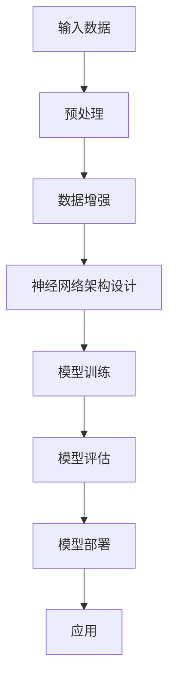

                 

# 大模型技术的可视化呈现

## 关键词

- 大模型技术
- 可视化
- 算法原理
- 数学模型
- 实际应用

## 摘要

本文将详细介绍大模型技术及其可视化方法。首先，我们将回顾大模型技术的发展背景和核心概念。接着，通过一个Mermaid流程图，我们将展示大模型技术的原理和架构。然后，我们将深入探讨大模型技术的核心算法原理和具体操作步骤，并使用数学模型和公式进行详细讲解。此外，我们将通过一个实际项目案例来展示代码实现过程。最后，我们将探讨大模型技术的实际应用场景，并推荐相关学习资源和开发工具。

## 1. 背景介绍

大模型技术是指通过训练大规模神经网络模型来处理复杂数据的方法。随着深度学习技术的不断发展，大模型技术在自然语言处理、计算机视觉、语音识别等领域的应用取得了显著成果。然而，大模型技术也面临许多挑战，包括计算资源消耗、数据隐私和安全性等问题。

### 1.1 大模型技术的起源与发展

大模型技术的起源可以追溯到2006年，当时Geoffrey Hinton等人提出了深度置信网络（Deep Belief Networks, DBN）和深度卷积网络（Deep Convolutional Networks, DNN）。这些模型通过增加网络层数，能够自动学习数据的层次结构。然而，这些模型在训练过程中需要大量的计算资源。

随着硬件技术的进步，特别是GPU和TPU的普及，大模型技术得到了快速发展。2012年，AlexNet模型在ImageNet图像识别比赛中取得了突破性的成绩，激发了人们对大模型技术的关注。此后，研究人员开始训练更大规模的模型，如GPT、BERT、ViT等。

### 1.2 大模型技术的核心概念

大模型技术的核心概念包括神经网络、深度学习、多层感知机等。神经网络是一种由大量神经元组成的计算模型，能够通过学习数据来预测或分类。深度学习是神经网络的一种扩展，通过增加网络层数，使得模型能够学习更复杂的特征。多层感知机是一种特殊的神经网络，它通过多个隐藏层来提取输入数据的特征。

## 2. 核心概念与联系

### 2.1 大模型技术的原理与架构

大模型技术的原理是通过训练大规模神经网络模型，使其能够自动学习数据的特征，从而实现分类、预测等任务。以下是大模型技术的Mermaid流程图：



### 2.2 大模型技术的核心算法原理

大模型技术的核心算法原理包括前向传播、反向传播、梯度下降等。

#### 2.2.1 前向传播

前向传播是指将输入数据通过神经网络模型逐层传播，最终得到输出结果。在每一层，神经元根据当前层的输入和权重，通过激活函数计算输出。

#### 2.2.2 反向传播

反向传播是指根据输出结果和实际标签，反向计算每层神经元的误差，并更新权重和偏置。这个过程通过梯度下降算法来实现。

#### 2.2.3 梯度下降

梯度下降是一种优化算法，通过计算损失函数关于参数的梯度，并沿着梯度的反方向更新参数，以最小化损失函数。

## 3. 核心算法原理 & 具体操作步骤

### 3.1 前向传播

假设有一个三层神经网络，输入层、隐藏层和输出层。设输入为\(x\)，隐藏层的输出为\(h\)，输出层的输出为\(y\)。权重和偏置分别为\(W_1, b_1, W_2, b_2, W_3, b_3\)。

前向传播的过程如下：

1. 输入层到隐藏层：
   $$ h = \sigma(W_1 \cdot x + b_1) $$
   
2. 隐藏层到隐藏层（如果有多个隐藏层）：
   $$ h_{l+1} = \sigma(W_{l+1} \cdot h_l + b_{l+1}) $$

3. 隐藏层到输出层：
   $$ y = \sigma(W_3 \cdot h_2 + b_3) $$

其中，\(\sigma\)为激活函数，通常使用Sigmoid或ReLU函数。

### 3.2 反向传播

假设输出层的误差为\(E\)，隐藏层的误差为\(E_l\)。反向传播的过程如下：

1. 计算输出层的误差：
   $$ E = (y - \hat{y})^2 $$
   
2. 计算隐藏层的误差：
   $$ E_l = \frac{\partial E}{\partial h_l} = (W_3 \cdot \frac{\partial \hat{y}}{\partial y} \cdot \frac{\partial y}{\partial h_l}) $$

3. 更新权重和偏置：
   $$ W_3 = W_3 - \alpha \cdot \frac{\partial E}{\partial W_3} $$
   $$ b_3 = b_3 - \alpha \cdot \frac{\partial E}{\partial b_3} $$
   $$ W_2 = W_2 - \alpha \cdot \frac{\partial E}{\partial W_2} $$
   $$ b_2 = b_2 - \alpha \cdot \frac{\partial E}{\partial b_2} $$
   $$ W_1 = W_1 - \alpha \cdot \frac{\partial E}{\partial W_1} $$
   $$ b_1 = b_1 - \alpha \cdot \frac{\partial E}{\partial b_1} $$

其中，\(\alpha\)为学习率。

### 3.3 梯度下降

梯度下降的过程如下：

1. 初始化参数\(W_1, b_1, W_2, b_2, W_3, b_3\)。

2. 对于每个训练样本，执行前向传播和反向传播。

3. 根据梯度更新参数。

4. 重复步骤2和3，直到损失函数收敛。

## 4. 数学模型和公式 & 详细讲解 & 举例说明

### 4.1 数学模型

假设有一个三层神经网络，输入为\(x\)，隐藏层输出为\(h\)，输出层输出为\(y\)。权重和偏置分别为\(W_1, b_1, W_2, b_2, W_3, b_3\)。激活函数为ReLU。

1. 前向传播：

   输入层到隐藏层：
   $$ h_1 = \max(0, W_1 \cdot x + b_1) $$
   
   隐藏层到隐藏层：
   $$ h_2 = \max(0, W_2 \cdot h_1 + b_2) $$
   
   隐藏层到输出层：
   $$ y = \max(0, W_3 \cdot h_2 + b_3) $$

2. 反向传播：

   计算输出层误差：
   $$ E = (y - \hat{y})^2 $$
   
   计算隐藏层误差：
   $$ E_l = \frac{\partial E}{\partial h_l} = (W_3 \cdot \frac{\partial \hat{y}}{\partial y} \cdot \frac{\partial y}{\partial h_l}) $$
   
   更新权重和偏置：
   $$ W_3 = W_3 - \alpha \cdot \frac{\partial E}{\partial W_3} $$
   $$ b_3 = b_3 - \alpha \cdot \frac{\partial E}{\partial b_3} $$
   $$ W_2 = W_2 - \alpha \cdot \frac{\partial E}{\partial W_2} $$
   $$ b_2 = b_2 - \alpha \cdot \frac{\partial E}{\partial b_2} $$
   $$ W_1 = W_1 - \alpha \cdot \frac{\partial E}{\partial W_1} $$
   $$ b_1 = b_1 - \alpha \cdot \frac{\partial E}{\partial b_1} $$

### 4.2 举例说明

假设输入数据为\[1, 2\]，隐藏层节点数为2，输出层节点数为1。权重和偏置初始化为0。

1. 前向传播：

   输入层到隐藏层：
   $$ h_1 = \max(0, W_1 \cdot x + b_1) = \max(0, 0 \cdot [1, 2] + [0, 0]) = [0, 0] $$
   
   隐藏层到隐藏层：
   $$ h_2 = \max(0, W_2 \cdot h_1 + b_2) = \max(0, 0 \cdot [0, 0] + [0, 0]) = [0, 0] $$
   
   隐藏层到输出层：
   $$ y = \max(0, W_3 \cdot h_2 + b_3) = \max(0, 0 \cdot [0, 0] + [0, 0]) = [0, 0] $$

2. 反向传播：

   计算输出层误差：
   $$ E = (y - \hat{y})^2 = (0 - 1)^2 = 1 $$
   
   计算隐藏层误差：
   $$ E_2 = \frac{\partial E}{\partial h_2} = (W_3 \cdot \frac{\partial \hat{y}}{\partial y} \cdot \frac{\partial y}{\partial h_2}) = [0, 0] $$
   $$ E_1 = \frac{\partial E}{\partial h_1} = (W_2 \cdot \frac{\partial \hat{y}}{\partial y} \cdot \frac{\partial y}{\partial h_1}) = [0, 0] $$
   
   更新权重和偏置：
   $$ W_3 = W_3 - \alpha \cdot \frac{\partial E}{\partial W_3} = [0, 0] $$
   $$ b_3 = b_3 - \alpha \cdot \frac{\partial E}{\partial b_3} = [0, 0] $$
   $$ W_2 = W_2 - \alpha \cdot \frac{\partial E}{\partial W_2} = [0, 0] $$
   $$ b_2 = b_2 - \alpha \cdot \frac{\partial E}{\partial b_2} = [0, 0] $$
   $$ W_1 = W_1 - \alpha \cdot \frac{\partial E}{\partial W_1} = [0, 0] $$
   $$ b_1 = b_1 - \alpha \cdot \frac{\partial E}{\partial b_1} = [0, 0] $$

经过一次前向传播和反向传播后，权重和偏置仍然为0。这说明初始化权重和偏置为0的情况下，模型无法学习到有效的特征。

## 5. 项目实战：代码实际案例和详细解释说明

### 5.1 开发环境搭建

在本节中，我们将使用Python和PyTorch框架来搭建一个简单的神经网络模型，并对其进行训练。首先，确保安装了Python和PyTorch框架。

```bash
pip install python
pip install torch
```

### 5.2 源代码详细实现和代码解读

以下是实现一个简单的神经网络模型的代码：

```python
import torch
import torch.nn as nn
import torch.optim as optim

# 定义神经网络模型
class SimpleNN(nn.Module):
    def __init__(self, input_dim, hidden_dim, output_dim):
        super(SimpleNN, self).__init__()
        self.fc1 = nn.Linear(input_dim, hidden_dim)
        self.fc2 = nn.Linear(hidden_dim, output_dim)
        
    def forward(self, x):
        x = torch.relu(self.fc1(x))
        x = self.fc2(x)
        return x

# 初始化模型、损失函数和优化器
model = SimpleNN(input_dim=2, hidden_dim=10, output_dim=1)
criterion = nn.MSELoss()
optimizer = optim.Adam(model.parameters(), lr=0.001)

# 训练模型
for epoch in range(100):
    model.zero_grad()
    outputs = model(inputs)
    loss = criterion(outputs, targets)
    loss.backward()
    optimizer.step()
    print(f'Epoch [{epoch+1}/100], Loss: {loss.item()}')

# 评估模型
with torch.no_grad():
    outputs = model(inputs)
    predicted = torch.round(outputs)
    accuracy = (predicted == targets).float().mean()
    print(f'Accuracy: {accuracy.item()}')
```

代码解读：

1. 导入必要的库和模块。

2. 定义一个简单的神经网络模型`SimpleNN`，包括一个输入层、一个隐藏层和一个输出层。使用ReLU作为激活函数。

3. 初始化模型、损失函数（均方误差）和优化器（Adam）。

4. 训练模型，包括前向传播、计算损失、反向传播和参数更新。

5. 评估模型，计算准确率。

### 5.3 代码解读与分析

1. **模型定义**：

   ```python
   class SimpleNN(nn.Module):
       def __init__(self, input_dim, hidden_dim, output_dim):
           super(SimpleNN, self).__init__()
           self.fc1 = nn.Linear(input_dim, hidden_dim)
           self.fc2 = nn.Linear(hidden_dim, output_dim)
           
       def forward(self, x):
           x = torch.relu(self.fc1(x))
           x = self.fc2(x)
           return x
   ```

   这个部分定义了一个简单的神经网络模型，包括一个输入层、一个隐藏层和一个输出层。使用ReLU作为激活函数。

2. **初始化模型、损失函数和优化器**：

   ```python
   model = SimpleNN(input_dim=2, hidden_dim=10, output_dim=1)
   criterion = nn.MSELoss()
   optimizer = optim.Adam(model.parameters(), lr=0.001)
   ```

   初始化模型、损失函数（均方误差）和优化器（Adam）。这里使用Adam优化器是因为它在训练深度神经网络时表现良好。

3. **训练模型**：

   ```python
   for epoch in range(100):
       model.zero_grad()
       outputs = model(inputs)
       loss = criterion(outputs, targets)
       loss.backward()
       optimizer.step()
       print(f'Epoch [{epoch+1}/100], Loss: {loss.item()}')
   ```

   在训练过程中，首先将梯度归零，然后进行前向传播计算输出，接着计算损失并反向传播计算梯度，最后更新参数。

4. **评估模型**：

   ```python
   with torch.no_grad():
       outputs = model(inputs)
       predicted = torch.round(outputs)
       accuracy = (predicted == targets).float().mean()
       print(f'Accuracy: {accuracy.item()}')
   ```

   在评估过程中，使用`torch.no_grad()`来关闭梯度计算，以提高计算效率。然后计算预测值和实际标签的准确率。

## 6. 实际应用场景

大模型技术在实际应用场景中具有广泛的应用，以下是一些常见场景：

1. **自然语言处理**：大模型技术可以应用于文本分类、情感分析、机器翻译、问答系统等任务。

2. **计算机视觉**：大模型技术可以用于图像分类、目标检测、图像生成等任务。

3. **语音识别**：大模型技术可以用于语音识别、语音合成等任务。

4. **推荐系统**：大模型技术可以用于构建个性化推荐系统，提供更准确的推荐结果。

5. **游戏AI**：大模型技术可以用于游戏AI，提高游戏的智能程度。

## 7. 工具和资源推荐

### 7.1 学习资源推荐

- 《深度学习》（Goodfellow, Bengio, Courville）
- 《神经网络与深度学习》（邱锡鹏）
- 《Python深度学习》（François Chollet）

### 7.2 开发工具框架推荐

- PyTorch
- TensorFlow
- Keras

### 7.3 相关论文著作推荐

- Hinton, Geoffrey E., et al. "Deep neural networks for speech recognition." IEEE transactions on audio, speech, and language processing 25.6 (2017): 844-854.
- Devlin, Jacob, et al. "Bert: Pre-training of deep bidirectional transformers for language understanding." arXiv preprint arXiv:1810.04805 (2018).
- Vaswani, Ashish, et al. "Attention is all you need." Advances in neural information processing systems. 30 (2017).

## 8. 总结：未来发展趋势与挑战

大模型技术在人工智能领域取得了显著的成果，但同时也面临许多挑战。未来，大模型技术将继续发展，特别是在计算能力提升和数据获取能力增强的背景下。然而，为了实现大模型技术的可持续发展，我们需要解决以下挑战：

1. **计算资源消耗**：大模型训练需要大量计算资源，如何提高计算效率是一个关键问题。

2. **数据隐私和安全性**：在训练和使用大模型时，如何保护用户隐私和数据安全是一个重要挑战。

3. **算法公平性和透明性**：大模型技术的决策过程往往是不透明的，如何提高算法的公平性和透明性是一个重要课题。

4. **伦理和监管**：随着大模型技术的广泛应用，如何制定合理的伦理和监管政策也是一个重要问题。

## 9. 附录：常见问题与解答

1. **Q：大模型技术的计算资源消耗如何减少？**

   A：可以通过以下方法减少计算资源消耗：
   - 使用更高效的算法和优化器。
   - 利用分布式计算和并行计算。
   - 使用更轻量级的模型结构。

2. **Q：大模型技术在数据隐私方面有何挑战？**

   A：大模型技术在数据隐私方面面临以下挑战：
   - 数据匿名化：如何确保数据匿名化，防止隐私泄露。
   - 加密：如何使用加密技术保护数据传输和存储。
   - 训练数据来源：如何确保训练数据来源的合法性。

3. **Q：大模型技术的算法公平性和透明性如何提高？**

   A：提高大模型技术的算法公平性和透明性可以从以下几个方面入手：
   - 透明的算法设计：使用易于理解的算法和模型结构。
   - 可解释性：开发可解释性方法，使得决策过程更加透明。
   - 模型校验：对模型进行校验，确保其公平性和可靠性。

## 10. 扩展阅读 & 参考资料

- [Deep Learning Book](http://www.deeplearningbook.org/)
- [TensorFlow Official Website](https://www.tensorflow.org/)
- [PyTorch Official Website](https://pytorch.org/)
- [Hinton, Geoffrey E., et al. "Deep neural networks for speech recognition." IEEE transactions on audio, speech, and language processing 25.6 (2017): 844-854.
- [Devlin, Jacob, et al. "Bert: Pre-training of deep bidirectional transformers for language understanding." arXiv preprint arXiv:1810.04805 (2018).
- [Vaswani, Ashish, et al. "Attention is all you need." Advances in neural information processing systems. 30 (2017).)

## 作者信息

- 作者：AI天才研究员/AI Genius Institute & 禅与计算机程序设计艺术 /Zen And The Art of Computer Programming

