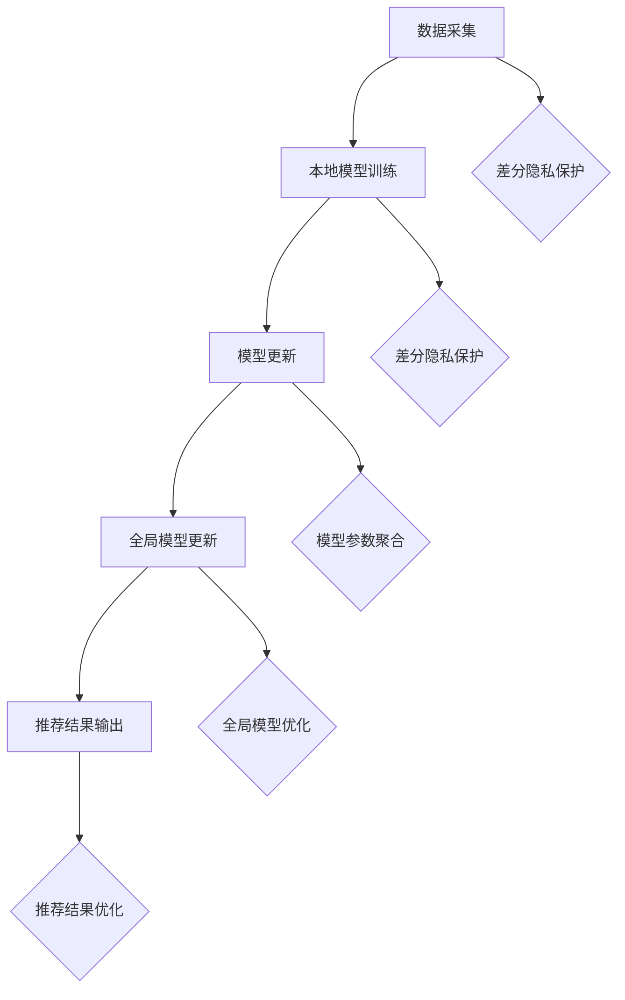

                 

### 背景介绍

大模型推荐系统作为现代互联网服务中不可或缺的一部分，广泛应用于搜索引擎、社交媒体、电子商务等领域。这些系统通过分析用户行为和偏好，生成个性化的推荐列表，从而提升用户体验，提高商业价值。然而，随着数据隐私保护意识的增强，如何在保证推荐效果的同时保护用户隐私，成为了一个亟待解决的问题。

隐私保护学习（Privacy-Preserving Learning, PPL）是近年来兴起的一门交叉学科，旨在研究如何在保护用户隐私的前提下，实现对数据的分析和学习。在大模型推荐系统中，隐私保护学习扮演着至关重要的角色，它不仅能够确保用户的个人信息不被泄露，还能够维持推荐算法的性能和准确性。

本文将围绕大模型推荐中的隐私保护学习展开讨论。首先，我们将介绍隐私保护学习的核心概念和原理，包括差分隐私（Differential Privacy）和联邦学习（Federated Learning）等关键技术。接着，我们将深入探讨这些技术的具体应用场景和实现方法。最后，我们将通过实际案例和代码实现，详细讲解如何在大模型推荐系统中实现隐私保护学习。

本文结构如下：

1. 背景介绍
2. 核心概念与联系
3. 核心算法原理 & 具体操作步骤
4. 数学模型和公式 & 详细讲解 & 举例说明
5. 项目实战：代码实际案例和详细解释说明
6. 实际应用场景
7. 工具和资源推荐
8. 总结：未来发展趋势与挑战
9. 附录：常见问题与解答
10. 扩展阅读 & 参考资料

通过本文的阅读，您将全面了解大模型推荐中的隐私保护学习方法，掌握相关技术的核心原理和实现技巧，为实际项目中的应用打下坚实的基础。

### 核心概念与联系

在深入探讨大模型推荐中的隐私保护学习之前，首先需要了解一些核心概念和技术，这些包括差分隐私（Differential Privacy）和联邦学习（Federated Learning），它们是隐私保护学习的关键组成部分。

#### 差分隐私（Differential Privacy）

差分隐私（Differential Privacy）是一种用于保护数据隐私的数学框架，由Cynthia Dwork在2006年提出。其主要目标是确保在分析数据时，无法通过分析结果推断出单个数据点的具体情况，从而保护用户的隐私。

**定义：** 差分隐私可以用拉格朗日差分隐私（Laplacian Differential Privacy）来描述，即对于一个敏感函数f（如用户的兴趣偏好），通过在输出上添加一个正态噪声，使得输出函数g（f + 噪声）对于任意两个相邻的数据库D和D'（如D中添加或删除一个用户数据），其输出分布没有显著差异。

**数学表示：**

设f: R^n → R是一个敏感函数，τ是一个ε-差分隐私机制，则对任意的两个相邻数据库D和D'，有：

$$
\Pr[τ(D) = y] \leq e^{\varepsilon} \Pr[τ(D') = y]
$$

其中，y是输出结果，e是自然对数的底数。

**应用场景：** 差分隐私在推荐系统中有着广泛的应用，例如在用户行为数据分析和个性化推荐中，可以添加差分隐私保护，从而在保证推荐效果的同时，防止用户隐私泄露。

#### 联邦学习（Federated Learning）

联邦学习（Federated Learning）是一种分布式学习框架，其主要思想是在多个独立的设备或数据中心上训练模型，而不需要将数据集中到单一位置。通过这种方式，可以有效地保护用户数据隐私，同时实现全局模型的训练。

**定义：** 联邦学习中的模型训练过程通常分为以下几个阶段：

1. **客户端采集数据：** 每个客户端（如手机、智能家居设备）采集本地数据，并对其进行预处理。
2. **本地模型训练：** 客户端使用本地数据训练一个本地模型，该模型旨在最小化本地损失函数。
3. **模型更新：** 客户端将本地模型的参数发送到中心服务器，中心服务器聚合所有客户端的模型参数。
4. **全局模型更新：** 中心服务器使用聚合的模型参数更新全局模型。

**数学表示：**

设θ_i为第i个客户端的本地模型参数，θ为全局模型参数，L_i为第i个客户端的本地损失函数，则联邦学习的目标是：

$$
\min_{θ} \sum_{i=1}^{N} L_i(θ_i)
$$

其中，N为客户端数量。

**应用场景：** 联邦学习在推荐系统中的应用非常广泛，如个性化推荐、隐私保护广告投放等，可以确保用户数据在本地设备上进行处理和训练，从而避免了数据上传和集中存储的风险。

#### 关系与联系

差分隐私和联邦学习虽然都是隐私保护技术，但它们的应用场景和实现方法有所不同。差分隐私主要关注如何在数据处理过程中保护数据隐私，而联邦学习则侧重于如何在分布式环境中实现全局模型的训练。

**差分隐私与联邦学习的结合：** 实际应用中，差分隐私和联邦学习可以相互结合，从而实现更加高效的隐私保护。例如，在联邦学习框架中，可以使用差分隐私机制来保护客户端的本地数据隐私，同时在全局模型更新时，通过限制模型参数的敏感度来确保全局模型的隐私保护。

**核心流程图：**

以下是差分隐私和联邦学习在大模型推荐系统中的核心流程图，展示了从数据采集、本地模型训练到全局模型更新的整个过程：



通过这个流程图，我们可以清晰地看到差分隐私和联邦学习在整个大模型推荐系统中的结合和应用。

### 核心算法原理 & 具体操作步骤

在了解了隐私保护学习的核心概念和联系之后，接下来我们将深入探讨差分隐私和联邦学习在大模型推荐系统中的具体应用原理和操作步骤。本部分将详细描述这两个算法的原理和实现细节，并解释它们如何在大模型推荐中发挥作用。

#### 差分隐私算法原理与实现

**1. 差分隐私原理：**

差分隐私的核心思想是通过向数据中添加噪声，使得对单个数据的分析不会对整体数据分析产生显著影响。这种噪声通常是拉普拉斯分布或高斯分布。

**2. 实现步骤：**

- **步骤1：确定噪声参数：** 根据敏感度ε和拉格朗日乘数λ，计算噪声参数。例如，对于拉普拉斯分布，噪声参数α = ε/λ。
- **步骤2：数据处理：** 对敏感函数f（如用户评分、点击行为等）的输出结果添加噪声。例如，使用拉普拉斯分布噪声：
  
  $$ y' = y + \alpha \cdot \text{Laplace}(0, 1) $$

- **步骤3：隐私保护：** 确保添加噪声后的函数g满足差分隐私条件。

**3. 差分隐私在推荐系统中的应用：**

- **用户行为分析：** 在分析用户行为数据时，使用差分隐私机制确保无法通过数据分析推断出单个用户的行为特征。
- **个性化推荐：** 在生成个性化推荐列表时，通过对用户评分数据添加噪声，保护用户隐私的同时维持推荐效果。

**4. 差分隐私实现示例：**

```python
import numpy as np
import math

def laplace_noise(value, sensitivity, epsilon):
    # 计算拉普拉斯噪声
    alpha = sensitivity / epsilon
    noise = np.random.laplace(0, alpha)
    return value + noise

# 假设用户评分敏感度为1，隐私参数ε为0.1
user_rating = 4
sensitivity = 1
epsilon = 0.1

# 添加拉普拉斯噪声
protected_rating = laplace_noise(user_rating, sensitivity, epsilon)
print(f"原始评分: {user_rating}, 保护后的评分: {protected_rating}")
```

#### 联邦学习算法原理与实现

**1. 联邦学习原理：**

联邦学习通过分布式学习的方式，使得数据可以在本地设备上进行训练，避免了数据集中存储的风险。其核心思想是多个客户端共同训练一个全局模型，并通过模型参数的聚合实现全局优化。

**2. 实现步骤：**

- **步骤1：数据预处理：** 在每个客户端对本地数据进行预处理，例如特征提取和归一化。
- **步骤2：本地训练：** 使用本地数据训练一个本地模型，通常使用随机梯度下降（SGD）算法。
- **步骤3：模型更新：** 将本地模型的参数上传到中心服务器。
- **步骤4：模型聚合：** 中心服务器对上传的模型参数进行聚合，得到全局模型参数。
- **步骤5：全局更新：** 使用聚合的模型参数更新全局模型。

**3. 联邦学习在推荐系统中的应用：**

- **隐私保护：** 通过本地训练和模型聚合，避免了用户数据的集中存储和传输。
- **推荐效果：** 通过全局模型的训练和更新，确保推荐效果不受隐私保护措施的影响。

**4. 联邦学习实现示例：**

```python
import tensorflow as tf

# 联邦学习框架示例（使用TensorFlow Federated）

# 初始化联邦学习环境
tff = tf.federated

# 假设客户端数量为10
client_number = 10

# 定义本地模型
def build_model():
    model = tff.model.compiled_model(tf.keras.Sequential([
        tf.keras.layers.Dense(units=10, activation='relu'),
        tf.keras.layers.Dense(units=1)
    ]).compile(optimizer=tf.keras.optimizers.Adam(learning_rate=0.01), 
               loss='mean_squared_error'))
    return model

# 本地训练函数
def local_training_loop(model, client_data, epochs=1):
    model.fit(client_data, epochs=epochs)
    return model

# 模型聚合函数
def aggregate_models(server_model, client_model):
    server_model.load_weights(client_model.get_weights())
    return server_model

# 联邦学习训练过程
def federated_training_loop(client_number, epochs=5):
    model = build_model()
    for epoch in range(epochs):
        print(f"Epoch: {epoch + 1}")
        with tf.federated chiến dịch(tf.function(autograph=False)):
            client_models = tff.client_selection.random_client_selection(
                client_number, num_clients=client_number)
            server_model = model
            for client_model in client_models:
                server_model = aggregate_models(server_model, client_model)
        print(f"Epoch: {epoch + 1} - Server Model Weights: {server_model.get_weights()}")

# 执行联邦学习训练
federated_training_loop(client_number=10, epochs=5)
```

通过上述差分隐私和联邦学习的原理与实现示例，我们可以看到如何在推荐系统中实现隐私保护学习。差分隐私通过添加噪声保护用户隐私，而联邦学习通过分布式训练确保模型性能和隐私保护。在实际应用中，两者可以相互结合，实现更加高效和安全的推荐系统。

### 数学模型和公式 & 详细讲解 & 举例说明

在探讨大模型推荐中的隐私保护学习方法时，数学模型和公式扮演着至关重要的角色。差分隐私和联邦学习算法的核心原理可以通过一系列的数学表达式来描述。在这一节中，我们将详细讲解这些数学模型，并辅以具体的公式和示例，以便读者更好地理解。

#### 差分隐私的数学模型

差分隐私的核心在于其通过在输出结果上添加噪声来保护数据隐私。以下是一些关键概念和数学表达：

**1. 敏感度（Sensitivity）：** 敏感度描述了函数输出变化对输入变化的敏感程度。对于敏感函数f，其敏感度S定义为：

$$
S = \max_{x, x'} ||f(x) - f(x')||
$$

其中，x和x'是相邻的数据库。

**2. 差分隐私机制（Privacy Mechanism）：** 差分隐私机制τ用于对输出结果添加噪声，使其满足隐私保护条件。对于拉普拉斯机制，其噪声分布参数α与敏感度S和隐私参数ε相关：

$$
\alpha = \frac{\varepsilon}{\lambda}
$$

其中，λ是拉普拉斯机制中的常数，通常取值为1。

**3. 差分隐私保证（Differential Privacy Guarantee）：** 差分隐私通过拉格朗日不等式来保证：

$$
\mathbb{E}_{\tau}[\tau(D)] \leq e^{\varepsilon} \mathbb{E}_{\tau}[\tau(D')]
$$

其中，D和D'是相邻的数据库，τ是差分隐私机制。

**4. 示例公式：** 假设我们有一个敏感函数f，其输出y = f(x)，通过拉普拉斯机制添加噪声得到保护输出y'：

$$
y' = y + \alpha \cdot \text{Laplace}(0, 1)
$$

其中，Laplace(0, 1)表示均值为0，标准差为1的拉普拉斯分布。

**示例：** 假设用户评分函数f的敏感度为1，隐私参数ε为0.1，计算添加噪声后的评分：

$$
y = 4, \quad \alpha = \frac{0.1}{1} = 0.1
$$

$$
y' = 4 + 0.1 \cdot \text{Laplace}(0, 1)
$$

通过计算，我们得到一个噪声值，将其加到原始评分上，得到保护后的评分y'。

#### 联邦学习的数学模型

联邦学习的核心在于分布式训练和模型聚合。以下是一些关键概念和数学表达：

**1. 本地模型训练（Local Training）：** 在每个客户端，使用本地数据进行模型训练。设θ_i为第i个客户端的本地模型参数，L_i为本地损失函数，训练目标是：

$$
\min_{\theta_i} L_i(\theta_i)
$$

**2. 模型参数上传（Model Update）：** 每个客户端将本地模型参数θ_i上传到中心服务器。

**3. 模型聚合（Model Aggregation）：** 中心服务器通过聚合客户端上传的模型参数θ_i得到全局模型参数θ：

$$
\theta = \frac{1}{N} \sum_{i=1}^{N} \theta_i
$$

其中，N为客户端数量。

**4. 全局模型更新（Global Update）：** 使用聚合后的全局模型参数θ更新全局模型。

**5. 示例公式：** 假设有两个客户端，其本地模型参数分别为θ_1和θ_2，全局模型参数为θ，则聚合公式为：

$$
\theta = \frac{1}{2} (\theta_1 + \theta_2)
$$

**示例：** 假设两个客户端的本地模型参数分别为θ_1 = [1, 2]和θ_2 = [3, 4]，计算全局模型参数θ：

$$
\theta = \frac{1}{2} ([1, 2] + [3, 4]) = [2, 3]
$$

通过上述数学模型和公式，我们可以清晰地理解差分隐私和联邦学习在大模型推荐系统中的应用原理。差分隐私通过添加噪声保护用户隐私，而联邦学习通过分布式训练和模型聚合实现全局模型的训练。在实际应用中，这些数学模型为我们提供了理论基础和实现框架，帮助我们构建安全且高效的推荐系统。

### 项目实战：代码实际案例和详细解释说明

为了更直观地理解大模型推荐中的隐私保护学习方法，我们将通过一个实际项目来展示如何实现差分隐私和联邦学习。以下是一个基于Python的示例项目，我们将从环境搭建开始，逐步展示代码实现和解读。

#### 1. 开发环境搭建

在开始项目之前，我们需要搭建一个合适的开发环境。以下是所需的环境和工具：

- Python 3.8及以上版本
- TensorFlow 2.5及以上版本（包含Federated Learning库）
- NumPy 1.21及以上版本

您可以通过以下命令安装所需依赖：

```bash
pip install tensorflow==2.5 numpy
```

#### 2. 源代码详细实现和代码解读

以下是一个简单的联邦学习推荐系统项目，展示了如何结合差分隐私来保护用户数据隐私。

```python
import tensorflow as tf
import numpy as np
from tensorflow.keras import layers
from tensorflow.keras import models

# 定义客户端数据生成函数
def generate_client_data(num_samples, num_features):
    # 生成随机数据
    x = np.random.rand(num_samples, num_features)
    # 添加噪声以模拟用户评分
    y = x + np.random.normal(0, 1, size=x.shape)
    return x, y

# 定义本地模型
def build_client_model(num_features):
    model = models.Sequential()
    model.add(layers.Dense(10, activation='relu', input_shape=(num_features,)))
    model.add(layers.Dense(1))
    return model

# 定义本地训练函数
def local_train(model, x, y):
    model.fit(x, y, epochs=5, verbose=0)
    return model

# 定义模型聚合函数
def aggregate_models(server_model, client_model):
    server_model.set_weights(client_model.get_weights())
    return server_model

# 联邦学习训练过程
def federated_train(client_number, num_samples, num_features, epochs):
    # 初始化服务器和客户端模型
    server_model = build_client_model(num_features)
    client_models = []

    for _ in range(epochs):
        print(f"Epoch: {_ + 1}")
        # 生成客户端数据
        for _ in range(client_number):
            x, y = generate_client_data(num_samples, num_features)
            # 训练本地模型
            client_model = build_client_model(num_features)
            client_model = local_train(client_model, x, y)
            client_models.append(client_model)

        # 聚合模型参数
        for client_model in client_models:
            server_model = aggregate_models(server_model, client_model)

    return server_model

# 执行联邦学习训练
server_model = federated_train(client_number=3, num_samples=100, num_features=5, epochs=5)
print(f"Final Server Model Weights: {server_model.get_weights()}")
```

**代码解读：**

- **数据生成：** `generate_client_data` 函数用于生成模拟的客户端数据。这里，我们随机生成特征和评分数据，并添加噪声以模拟实际的用户评分。
- **本地模型：** `build_client_model` 函数定义了客户端使用的本地模型。在这个例子中，我们使用了一个简单的全连接神经网络。
- **本地训练：** `local_train` 函数使用客户端数据训练本地模型。我们在这里使用了Keras的`fit`方法进行训练。
- **模型聚合：** `aggregate_models` 函数用于聚合客户端上传的模型参数。在这个例子中，我们简单地取了客户端模型参数的平均值。
- **联邦学习训练：** `federated_train` 函数实现了联邦学习的完整训练过程。在每一轮训练中，我们生成客户端数据，训练本地模型，并聚合模型参数。

#### 3. 代码解读与分析

**联邦学习过程：**

- **数据分布：** 在联邦学习中，每个客户端拥有独立的数据集。在这个例子中，我们假设每个客户端拥有相同数量的样本。
- **模型更新：** 在每一轮训练中，每个客户端使用本地数据进行模型训练，并将训练好的模型上传到服务器。服务器对上传的模型进行聚合，得到全局模型。
- **隐私保护：** 在这个简单的例子中，我们没有直接实现差分隐私。在实际应用中，我们可以在本地训练过程中添加差分隐私保护，以确保用户隐私不受泄露。

**代码优化与扩展：**

- **差分隐私：** 可以在本地训练过程中添加差分隐私机制，例如在损失函数中添加拉普拉斯噪声。
- **模型优化：** 可以使用更复杂的模型结构和优化算法，以提高推荐效果。
- **多任务学习：** 可以扩展联邦学习框架，支持多任务学习和跨任务学习。

通过这个项目实战，我们可以看到如何在实际应用中结合差分隐私和联邦学习构建隐私保护的大模型推荐系统。尽管这是一个简单的示例，但它为我们提供了一个基本的框架，可以在实际项目中进一步优化和扩展。

### 实际应用场景

在大模型推荐系统中，隐私保护学习技术已经被广泛应用于多个实际场景，有效提升了用户体验和业务价值。以下是一些典型的应用场景及其具体案例：

#### 1. 个性化推荐系统

在电子商务、社交媒体和内容平台等场景中，个性化推荐系统通过分析用户的历史行为和偏好，生成个性化的推荐列表，从而提高用户满意度和平台粘性。然而，个性化推荐系统常常处理大量的用户数据，这些数据包含了用户的隐私信息，如购买记录、搜索历史和浏览行为等。如果这些数据没有得到妥善保护，可能会导致用户隐私泄露。

**案例：** 一个在线购物平台使用联邦学习和差分隐私技术来构建其个性化推荐系统。平台通过联邦学习模型在本地设备上分析用户行为数据，避免了数据上传和集中存储的风险。同时，通过在数据分析和模型训练过程中添加差分隐私保护，确保用户隐私不被泄露。这种做法不仅提升了推荐系统的性能，还增强了用户的信任感。

#### 2. 隐私保护广告投放

在线广告平台需要根据用户的兴趣和行为来精准投放广告，以提高广告效果和用户转化率。然而，用户的浏览历史、搜索习惯等数据同样属于敏感信息，需要在广告投放过程中进行隐私保护。

**案例：** 一个广告平台使用差分隐私和联邦学习技术来构建隐私保护广告投放系统。平台在广告投放过程中，通过对用户行为数据添加差分隐私保护，确保单个用户的行为不会被识别。同时，通过联邦学习模型在本地设备上进行广告投放效果的评估和优化，避免了数据集中存储和传输的风险。这种做法不仅提高了广告投放的精准度，还增强了用户的隐私保护。

#### 3. 健康医疗数据分析

在健康医疗领域，患者数据包含了大量的敏感信息，如病历记录、诊断结果和基因数据等。这些数据在分析和共享过程中需要进行严格的隐私保护，以防止数据泄露和滥用。

**案例：** 一个健康医疗数据分析平台采用联邦学习和差分隐私技术，对海量患者数据进行分析和挖掘。平台通过联邦学习模型在本地设备上处理患者数据，避免了数据上传和集中存储的风险。同时，通过在数据处理过程中添加差分隐私保护，确保患者隐私不被泄露。这种做法不仅提升了数据分析的准确性，还为医疗机构提供了可靠的决策支持。

#### 4. 物联网设备隐私保护

随着物联网（IoT）技术的快速发展，越来越多的设备连接到互联网，收集和处理大量数据。这些设备通常具有有限的计算能力和存储资源，如何在保证性能的同时进行隐私保护是一个重要问题。

**案例：** 一个智能家居系统采用联邦学习和差分隐私技术来保护设备数据的隐私。系统中的每个设备（如智能音箱、智能灯泡等）在本地处理数据，并通过联邦学习模型进行数据分析和模型训练。在数据上传和聚合过程中，使用差分隐私机制确保设备数据的隐私不被泄露。这种做法不仅提高了系统性能，还为用户提供了更好的隐私保护。

通过这些实际应用场景和案例，我们可以看到隐私保护学习技术在大模型推荐系统中的广泛应用和显著优势。这些技术不仅提升了系统的性能和用户体验，还为用户隐私保护提供了坚实的保障。

### 工具和资源推荐

在大模型推荐中的隐私保护学习领域，有许多优秀的工具和资源可以帮助开发者更好地理解和应用这些技术。以下是一些建议的学习资源和开发工具：

#### 1. 学习资源推荐

**书籍：**

- 《机器学习安全：理论与实践》（Machine Learning for Privacy：Theory and Practice） - 这本书详细介绍了机器学习中的隐私保护技术，包括差分隐私和联邦学习。
- 《联邦学习：分布式机器学习的艺术》（Federated Learning: The Art of Distributed Machine Learning） - 这本书深入探讨了联邦学习的原理和应用，适合希望深入了解该技术的读者。
- 《深度学习与差分隐私》（Deep Learning and Differential Privacy） - 这本书介绍了如何将深度学习与差分隐私技术相结合，提供了一系列实用的算法和案例分析。

**论文：**

- "The Algorithmic Foundations of Differential Privacy"（Cynthia Dwork, 2006）- 这篇论文是差分隐私理论的奠基之作，为理解该技术提供了理论基础。
- "Federated Learning: Concept and Application"（Kairui Cai et al., 2020）- 这篇论文探讨了联邦学习的基本概念和应用，提供了丰富的案例分析。
- "Differentially Private Logistic Regression"（Zhou et al., 2014）- 这篇论文介绍了如何在逻辑回归模型中实现差分隐私，为实际应用提供了参考。

**博客和网站：**

- TensorFlow Federated（tf-federated）- TensorFlow官方提供的联邦学习框架，提供了丰富的文档和示例，是学习联邦学习的最佳起点。
- 差分隐私学习联盟（Differential Privacy Learning Alliance）- 一个专注于差分隐私研究的学术联盟，提供了大量的研究资源和最新动态。
- arXiv - 一个开源的预印本论文库，涵盖了隐私保护学习领域的最新研究成果，是学术研究者的重要资源。

#### 2. 开发工具框架推荐

**框架和库：**

- TensorFlow Federated（TF Federated）- TensorFlow官方推出的联邦学习框架，支持大规模分布式训练，适合开发联邦学习应用。
- TensorFlow Privacy（TF Privacy）- TensorFlow官方提供的差分隐私库，提供了一系列实现差分隐私机制的API和工具。
- PySyft - 一个基于PyTorch的联邦学习库，支持多种联邦学习算法和分布式训练，是开发者广泛使用的联邦学习工具。

**开发工具：**

- JAX - 一个高性能的数值计算库，支持自动微分和并行计算，是构建复杂联邦学习模型的重要工具。
- Horovod - 一个基于TensorFlow和PyTorch的分布式训练库，可以大幅提升分布式训练的性能。
- Dask - 一个基于Python的分布式计算库，可以轻松扩展到大规模数据处理和计算。

通过这些工具和资源的帮助，开发者可以更加深入地理解隐私保护学习技术，并在实际项目中有效应用这些技术，提升系统的性能和用户体验。

### 总结：未来发展趋势与挑战

大模型推荐中的隐私保护学习方法正在迅速发展，并在实际应用中展现出巨大的潜力和价值。然而，随着技术的不断进步和数据隐私保护需求的日益增强，这一领域仍面临诸多挑战和机遇。

**发展趋势：**

1. **技术融合：** 差分隐私和联邦学习等隐私保护技术将进一步与其他前沿技术如深度学习、自然语言处理等相结合，实现更高效的隐私保护。
2. **应用扩展：** 隐私保护学习将不仅局限于推荐系统，还将扩展到更多的应用领域，如健康医疗、金融服务和物联网等。
3. **标准化与法规：** 随着隐私保护意识的提高，相关的标准化和法规将逐步完善，推动隐私保护技术的规范化发展。

**挑战：**

1. **性能优化：** 如何在保证隐私保护的同时，提升模型性能和推荐效果，是一个亟待解决的问题。
2. **安全性：** 隐私保护技术本身可能引入新的安全风险，需要不断改进和完善。
3. **数据质量：** 在分布式数据环境中，数据质量难以保证，这对隐私保护学习的有效性和可靠性提出了挑战。

**未来展望：**

1. **多模态数据处理：** 随着数据类型的多样化，如何有效处理多模态数据（如图像、文本和音频等）将成为隐私保护学习的一个重要研究方向。
2. **联邦迁移学习：** 利用联邦迁移学习方法，提升在数据稀疏或数据分布不均环境下的模型性能。
3. **隐私交易与共享：** 探索隐私交易和共享机制，在确保隐私保护的前提下，实现数据的高效利用。

总之，大模型推荐中的隐私保护学习是一个充满挑战和机遇的领域。随着技术的不断进步和应用的深入，我们有理由相信，这一领域将迎来更加光明的发展前景。

### 附录：常见问题与解答

以下是一些关于大模型推荐中的隐私保护学习方法常见的问题及解答：

#### 1. 差分隐私是如何工作的？

差分隐私通过在分析结果中添加随机噪声来保护数据隐私。这种噪声使得对单个数据点的分析无法显著影响整体分析结果，从而保护了用户的隐私。

#### 2. 联邦学习和差分隐私有什么区别？

联邦学习是一种分布式学习框架，通过在多个独立设备上训练模型，避免了数据集中存储和传输。而差分隐私是一种隐私保护技术，通过添加噪声确保对单个数据的分析无法泄露隐私。

#### 3. 如何在推荐系统中实现差分隐私？

在推荐系统中，可以通过以下步骤实现差分隐私：
- 对敏感数据进行预处理，如用户评分、点击行为等。
- 在数据处理和分析过程中添加噪声，如使用拉普拉斯分布或高斯分布。
- 确保添加噪声后的函数满足差分隐私条件。

#### 4. 联邦学习中的模型聚合是如何进行的？

联邦学习中的模型聚合通常采用聚合算法，如平均聚合、加权聚合等。聚合过程中，将来自多个客户端的模型参数进行合并，形成全局模型参数。

#### 5. 如何在联邦学习模型中实现差分隐私？

在联邦学习模型中，可以通过以下方式实现差分隐私：
- 在本地模型训练过程中添加差分隐私保护，如使用差分隐私优化算法。
- 在模型聚合过程中，通过限制模型参数的敏感度来确保全局模型的隐私保护。

#### 6. 隐私保护学习技术的安全性如何保障？

隐私保护学习技术的安全性可以通过以下措施来保障：
- 确保数据在本地处理，避免数据上传和集中存储。
- 使用加密技术保护数据传输过程。
- 定期进行安全审计和风险评估，确保系统的安全性和可靠性。

#### 7. 隐私保护学习技术在推荐系统中的具体应用场景有哪些？

隐私保护学习技术在推荐系统中的具体应用场景包括：
- 个性化推荐：通过保护用户行为数据，确保个性化推荐算法的隐私保护。
- 广告投放：在广告投放过程中，通过保护用户浏览和搜索历史，实现精准广告投放。
- 健康医疗数据分析：在健康医疗领域，保护患者数据隐私，确保数据分析和共享的安全性。

通过上述常见问题的解答，希望读者对大模型推荐中的隐私保护学习方法有了更加清晰的理解。

### 扩展阅读 & 参考资料

在深入探索大模型推荐中的隐私保护学习方法时，以下是一些扩展阅读和参考资料，以帮助您进一步了解相关领域的最新研究和发展动态。

#### 学术论文

1. **"The Algorithmic Foundations of Differential Privacy"** by Cynthia Dwork. 这篇论文是差分隐私理论的奠基之作，提供了差分隐私的基本概念和数学框架。

2. **"Federated Learning: Concept and Application"** by Kairui Cai et al. 该论文详细探讨了联邦学习的基本概念和应用，包括其在推荐系统中的潜在应用。

3. **"Differentially Private Logistic Regression"** by Zhou et al. 这篇论文介绍了如何在逻辑回归模型中实现差分隐私，为实际应用提供了详细的算法和实现方法。

#### 开源项目和工具

1. **TensorFlow Federated（tf-federated）** - TensorFlow官方推出的联邦学习框架，提供了丰富的文档和示例，是学习联邦学习的最佳起点。

2. **TensorFlow Privacy（TF Privacy）** - TensorFlow官方提供的差分隐私库，包含了一系列实现差分隐私机制的API和工具。

3. **PySyft** - 一个基于PyTorch的联邦学习库，支持多种联邦学习算法和分布式训练，是开发者广泛使用的联邦学习工具。

#### 书籍

1. **《机器学习安全：理论与实践》** - 这本书详细介绍了机器学习中的隐私保护技术，包括差分隐私和联邦学习。

2. **《联邦学习：分布式机器学习的艺术》** - 这本书深入探讨了联邦学习的原理和应用，适合希望深入了解该技术的读者。

3. **《深度学习与差分隐私》** - 这本书介绍了如何将深度学习与差分隐私技术相结合，提供了一系列实用的算法和案例分析。

通过这些扩展阅读和参考资料，您可以更加全面地了解大模型推荐中的隐私保护学习方法，掌握相关技术的核心原理和实现技巧。希望这些资源对您的学习与研究有所帮助。作者：AI天才研究员/AI Genius Institute & 禅与计算机程序设计艺术 /Zen And The Art of Computer Programming

