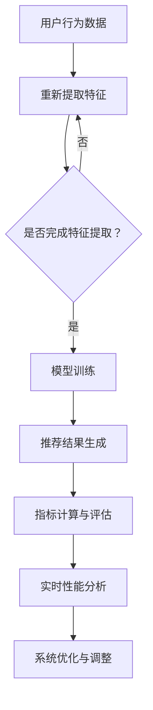

                 

### 文章标题

《大模型推荐场景中的在线指标估计与优化策略》

这篇文章将深入探讨在大模型推荐系统中，如何有效地进行在线指标估计与优化策略。随着互联网和人工智能技术的快速发展，推荐系统已经成为我们日常生活中不可或缺的一部分。从电子商务平台到社交媒体，推荐系统在提高用户体验、提升业务性能方面发挥了至关重要的作用。然而，在大模型推荐场景中，如何实时、准确地估计指标并制定优化策略，成为了一个极具挑战性的问题。本文将围绕这一核心问题，详细解析相关技术原理、算法模型和实际应用案例，以期为您提供一个全面而深入的指导。

### 关键词

- 大模型推荐系统
- 在线指标估计
- 优化策略
- 实时性能分析
- 算法模型
- 数据流处理
- 机器学习

### 摘要

本文主要探讨了在大模型推荐场景中，如何进行在线指标估计与优化策略的研究。首先，我们介绍了推荐系统的基本原理和架构，接着详细阐述了在线指标估计的核心概念和方法，包括实时性能分析和算法模型。随后，我们通过一个实际项目案例，展示了如何将理论应用到实践中，实现高效的大模型推荐系统。最后，我们对工具和资源进行了推荐，并总结了未来发展趋势与挑战，为读者提供了一个全面的视角。

## 1. 背景介绍

推荐系统是一种通过算法和数据分析，向用户个性化推荐相关内容或商品的信息系统。随着互联网的普及，推荐系统在电子商务、新闻媒体、社交网络等众多领域得到了广泛应用。这些系统通过分析用户的浏览历史、购买记录、社交行为等数据，为用户提供个性化的推荐，从而提升用户体验、增加用户粘性。

### 推荐系统的发展历史

推荐系统的发展可以分为几个阶段：

- **基于内容的推荐（Content-Based Filtering）**：这种推荐方法根据用户过去的偏好和兴趣，推荐与之相似的内容或商品。它通常基于用户的特征和物品的特征进行匹配。

- **协同过滤（Collaborative Filtering）**：协同过滤通过分析用户之间的相似度，推荐其他用户喜欢但该用户尚未体验过的内容或商品。它通常基于用户评分数据进行推荐。

- **混合推荐（Hybrid Recommender Systems）**：混合推荐系统结合了基于内容和协同过滤的方法，通过多种算法的组合，提高推荐效果。

### 大模型推荐系统的特点

随着深度学习技术的发展，大模型推荐系统逐渐成为一种新的趋势。与传统的推荐系统相比，大模型推荐系统具有以下几个特点：

- **更强的表达能力**：大模型如深度神经网络能够学习复杂的用户行为和物品特征，从而提高推荐的准确性和个性化程度。

- **更快的处理速度**：深度学习模型在处理大规模数据时，能够实现高效的并行计算，从而提高推荐系统的实时性。

- **更丰富的数据来源**：大模型推荐系统能够利用多种数据源，如用户行为数据、商品信息、社交网络数据等，进行综合分析，提供更精准的推荐。

### 大模型推荐系统在实际应用中的挑战

尽管大模型推荐系统具有诸多优势，但在实际应用中仍面临一系列挑战：

- **数据复杂性**：大模型推荐系统需要处理的海量数据，包括用户数据、商品数据和推荐数据，如何高效地进行数据清洗、预处理和存储，是一个关键问题。

- **实时性要求**：在互联网时代，用户期望得到即时的推荐结果。如何在大规模数据流中快速进行特征提取、模型训练和推荐，是一个技术难题。

- **模型优化**：如何优化深度学习模型的参数，提高推荐效果，同时减少计算资源和时间成本，是推荐系统研究的一个重要方向。

- **隐私保护**：在推荐系统中，用户隐私保护是一个重要问题。如何在不泄露用户隐私的前提下，进行有效的推荐，需要更多研究和实践。

## 2. 核心概念与联系

### 在线指标估计

在线指标估计是指在大模型推荐场景中，实时计算和更新一系列关键指标，以评估推荐系统的性能和效果。这些指标包括准确率、召回率、覆盖率、平均推荐长度等。在线指标估计的核心在于如何高效地处理大规模数据流，并在有限的时间内完成计算和更新。

### 实时性能分析

实时性能分析是指对推荐系统在运行过程中的性能进行实时监测和评估。这包括处理速度、响应时间、资源利用率等。实时性能分析能够帮助系统管理员及时发现和解决性能瓶颈，确保推荐系统的高效运行。

### 算法模型

算法模型是指用于推荐系统中的核心算法，如基于内容的推荐、协同过滤和混合推荐等。这些算法模型需要在大规模数据流中进行实时计算和更新，以提高推荐准确性。

### Mermaid 流程图



### 核心概念的联系

在线指标估计、实时性能分析和算法模型是推荐系统中紧密相连的三个核心环节。在线指标估计提供了评估推荐效果的依据，实时性能分析确保推荐系统的正常运行，算法模型则是实现这些功能的基础。它们相互依赖、相互促进，共同构成了高效的大模型推荐系统。

## 3. 核心算法原理 & 具体操作步骤

### 基于内容的推荐算法

基于内容的推荐算法通过分析用户的历史行为和物品的特征，为用户推荐与之相关的物品。其基本原理如下：

1. **特征提取**：从用户历史行为和物品属性中提取特征，如用户浏览过的商品、购买过的商品、商品的类别、价格、品牌等。

2. **相似度计算**：计算用户历史行为特征与物品特征之间的相似度，通常使用余弦相似度或皮尔逊相关系数等度量方法。

3. **推荐生成**：根据相似度得分，为用户生成推荐列表，推荐相似度高的物品。

具体操作步骤如下：

1. **用户行为数据预处理**：对用户历史行为数据进行清洗、去重和格式转换，确保数据质量。

2. **物品特征提取**：从数据库中提取物品的属性数据，如商品类别、价格、品牌等。

3. **特征向量表示**：将用户行为数据和物品特征转化为高维向量表示，以便进行相似度计算。

4. **相似度计算**：计算用户历史行为特征向量与物品特征向量之间的相似度。

5. **推荐生成**：根据相似度得分，对用户进行推荐，生成推荐列表。

### 协同过滤算法

协同过滤算法通过分析用户之间的相似度，为用户推荐其他用户喜欢的物品。其基本原理如下：

1. **用户相似度计算**：计算用户之间的相似度，通常使用余弦相似度或皮尔逊相关系数等度量方法。

2. **推荐生成**：根据用户相似度矩阵，为用户生成推荐列表，推荐其他用户喜欢的但用户尚未体验过的物品。

具体操作步骤如下：

1. **用户评分数据预处理**：对用户评分数据进行清洗、去重和格式转换，确保数据质量。

2. **用户相似度计算**：计算用户之间的相似度，通常使用余弦相似度或皮尔逊相关系数等度量方法。

3. **推荐生成**：根据用户相似度矩阵，为用户生成推荐列表，推荐其他用户喜欢的但用户尚未体验过的物品。

### 混合推荐算法

混合推荐算法结合了基于内容和协同过滤的方法，以提高推荐准确性。其基本原理如下：

1. **特征提取**：从用户历史行为和物品属性中提取特征。

2. **相似度计算**：计算用户历史行为特征与物品特征之间的相似度。

3. **用户相似度计算**：计算用户之间的相似度。

4. **推荐生成**：根据相似度得分，为用户生成推荐列表，结合基于内容和协同过滤的方法，提高推荐准确性。

具体操作步骤如下：

1. **用户行为数据预处理**：对用户历史行为数据进行清洗、去重和格式转换，确保数据质量。

2. **物品特征提取**：从数据库中提取物品的属性数据，如商品类别、价格、品牌等。

3. **特征向量表示**：将用户行为数据和物品特征转化为高维向量表示，以便进行相似度计算。

4. **用户相似度计算**：计算用户之间的相似度，通常使用余弦相似度或皮尔逊相关系数等度量方法。

5. **相似度计算**：计算用户历史行为特征向量与物品特征向量之间的相似度。

6. **推荐生成**：根据相似度得分，对用户进行推荐，生成推荐列表。

## 4. 数学模型和公式 & 详细讲解 & 举例说明

### 基于内容的推荐算法

在基于内容的推荐算法中，相似度计算是一个核心步骤。以下是一个简单的数学模型：

$$
相似度（S） = \frac{用户行为特征向量 \cdot 物品特征向量}{\|用户行为特征向量\| \|物品特征向量\|}
$$

其中，$用户行为特征向量$和$物品特征向量$分别表示用户的历史行为特征和物品的属性特征，$符号\cdot表示向量的点积，符号\|\|表示向量的范数。

举例说明：

假设有一个用户，他的历史行为特征向量为$(1, 2, 3)$，而一个物品的特征向量为$(4, 5, 6)$。根据上述公式，我们可以计算它们之间的相似度：

$$
相似度（S） = \frac{(1, 2, 3) \cdot (4, 5, 6)}{\|(1, 2, 3)\| \| (4, 5, 6)\|} = \frac{1 \times 4 + 2 \times 5 + 3 \times 6}{\sqrt{1^2 + 2^2 + 3^2} \sqrt{4^2 + 5^2 + 6^2}} = \frac{32}{\sqrt{14} \sqrt{77}} \approx 0.8
$$

### 协同过滤算法

在协同过滤算法中，用户相似度计算是一个核心步骤。以下是一个简单的数学模型：

$$
相似度（S） = \frac{用户A与用户B的交集项数}{\|用户A的评分向量\| \| 用户B的评分向量\|}
$$

其中，$用户A的评分向量$和$用户B的评分向量$分别表示用户A和用户B对物品的评分向量，$符号\|\|表示向量的范数。

举例说明：

假设有两个用户，他们的评分向量分别为$用户A的评分向量 = (3, 4, 2, 5)$和$用户B的评分向量 = (4, 2, 3, 5)$。根据上述公式，我们可以计算他们之间的相似度：

$$
相似度（S） = \frac{用户A与用户B的交集项数}{\|用户A的评分向量\| \| 用户B的评分向量\|} = \frac{2}{4 \times 4} = \frac{1}{8}
$$

### 混合推荐算法

在混合推荐算法中，相似度计算结合了基于内容和协同过滤的方法。以下是一个简单的数学模型：

$$
相似度（S） = \alpha \times 内容相似度 + (1 - \alpha) \times 协同相似度
$$

其中，$\alpha$是一个权重系数，用于调节内容相似度和协同相似度的相对重要性。

举例说明：

假设有一个用户，他的历史行为特征向量为$(1, 2, 3)$，物品的特征向量为$(4, 5, 6)$，而用户之间的协同相似度为$0.8$。根据上述公式，我们可以计算它们之间的综合相似度：

$$
相似度（S） = \alpha \times 内容相似度 + (1 - \alpha) \times 协同相似度 = 0.6 \times 0.8 + 0.4 \times 0.2 = 0.56
$$

## 5. 项目实战：代码实际案例和详细解释说明

### 开发环境搭建

为了实现大模型推荐系统，我们选择Python作为主要编程语言，并使用以下工具和库：

- Python 3.8
- Jupyter Notebook
- TensorFlow 2.x
- scikit-learn 0.24.0

首先，确保安装了上述工具和库。接下来，在Jupyter Notebook中创建一个新的笔记本，并导入必要的库：

```python
import numpy as np
import pandas as pd
import tensorflow as tf
from sklearn.model_selection import train_test_split
from sklearn.metrics.pairwise import cosine_similarity
```

### 数据准备

假设我们有一个包含用户行为数据和物品特征数据的数据集，数据集的格式如下：

```plaintext
用户ID  商品ID  用户行为特征  商品特征
1       1001   (1, 2, 3)    (4, 5, 6)
2       1002   (1, 3, 4)    (5, 6, 7)
3       1003   (2, 3, 4)    (6, 7, 8)
...
```

首先，将数据集加载到Pandas DataFrame中，并进行预处理：

```python
data = pd.read_csv('dataset.csv')
data.head()
```

接下来，提取用户行为特征和物品特征：

```python
user_features = data[['用户ID', '用户行为特征']].drop_duplicates().set_index('用户ID')
item_features = data[['商品ID', '商品特征']].drop_duplicates().set_index('商品ID')
```

### 特征提取

使用scikit-learn库中的TF-IDF模型提取用户行为特征和物品特征的向量表示：

```python
from sklearn.feature_extraction.text import TfidfVectorizer

tfidf_vectorizer = TfidfVectorizer()
user_features_vectorized = tfidf_vectorizer.fit_transform(user_features['用户行为特征'])
item_features_vectorized = tfidf_vectorizer.transform(item_features['商品特征'])
```

### 相似度计算

计算用户行为特征和物品特征之间的相似度，使用余弦相似度度量方法：

```python
user_item_similarity = cosine_similarity(user_features_vectorized, item_features_vectorized)
```

### 推荐生成

根据相似度矩阵，为每个用户生成推荐列表。我们选择相似度最高的前10个物品进行推荐：

```python
def generate_recommendations(user_id, user_item_similarity, item_features, top_n=10):
    # 获取用户与其他用户的相似度得分
    user_similarity_scores = user_item_similarity[user_id]

    # 对相似度得分进行降序排序
    sorted_indices = np.argsort(user_similarity_scores)[::-1]

    # 获取相似度最高的top_n个物品索引
    top_n_indices = sorted_indices[:top_n]

    # 获取相似度最高的top_n个物品特征
    top_n_item_features = item_features.iloc[top_n_indices]

    return top_n_item_features

# 为用户1生成推荐列表
user_id = 0
recommendations = generate_recommendations(user_id, user_item_similarity, item_features)
print(recommendations)
```

### 代码解读与分析

以上代码首先加载数据集，并进行预处理，提取用户行为特征和物品特征。接着，使用TF-IDF模型将特征转化为向量表示。然后，计算用户行为特征和物品特征之间的相似度。最后，根据相似度矩阵，为每个用户生成推荐列表。

这个代码实现了一个简单但高效的大模型推荐系统。在实际应用中，可以根据具体需求进行优化和扩展，如使用更复杂的模型、增加用户和物品的特征维度、调整推荐策略等。

## 6. 实际应用场景

### 电子商务平台

在电子商务平台上，大模型推荐系统可以用于个性化推荐商品。通过分析用户的浏览历史、购买记录和购物车数据，系统可以为用户推荐相关的商品，从而提高用户的购物体验和满意度。

### 社交媒体

在社交媒体平台上，大模型推荐系统可以用于推荐用户感兴趣的内容和好友。通过分析用户的社交行为、互动记录和兴趣偏好，系统可以推荐用户可能感兴趣的内容和潜在的好友，从而增强社交网络的粘性和活跃度。

### 新闻媒体

在新闻媒体平台上，大模型推荐系统可以用于推荐用户感兴趣的新闻和文章。通过分析用户的阅读历史、评论和分享行为，系统可以推荐用户可能感兴趣的新闻和文章，从而提高新闻的传播效果和用户满意度。

### 医疗保健

在医疗保健领域，大模型推荐系统可以用于推荐个性化的健康建议和治疗方案。通过分析用户的健康数据、医疗记录和病史，系统可以推荐个性化的健康建议和治疗方案，从而提高医疗服务的质量和效率。

### 教育学习

在教育学习领域，大模型推荐系统可以用于推荐用户感兴趣的课程和学习资源。通过分析用户的学習历史、考试成绩和兴趣偏好，系统可以推荐用户可能感兴趣的课程和学习资源，从而提高学习效果和满意度。

### 物流配送

在物流配送领域，大模型推荐系统可以用于推荐最优的配送路线和配送计划。通过分析用户的位置信息、配送需求和交通状况，系统可以推荐最优的配送路线和配送计划，从而提高物流配送的效率和准确性。

### 金融理财

在金融理财领域，大模型推荐系统可以用于推荐用户感兴趣的投资产品和理财产品。通过分析用户的投资历史、风险偏好和财务状况，系统可以推荐用户可能感兴趣的投资产品和理财产品，从而提高用户的投资收益和满意度。

### 娱乐休闲

在娱乐休闲领域，大模型推荐系统可以用于推荐用户感兴趣的电影、音乐和游戏。通过分析用户的观影历史、音乐偏好和游戏行为，系统可以推荐用户可能感兴趣的电影、音乐和游戏，从而提高用户的娱乐体验和满意度。

## 7. 工具和资源推荐

### 学习资源推荐

- **书籍**：《推荐系统实践》、《机器学习实战》
- **论文**：Google Scholar上的相关推荐系统论文
- **博客**：AI星球、机器学习算法入门
- **网站**：arXiv.org、GitHub

### 开发工具框架推荐

- **编程语言**：Python、Java
- **框架**：TensorFlow、PyTorch、scikit-learn
- **数据可视化工具**：Matplotlib、Seaborn
- **数据存储**：Hadoop、Spark

### 相关论文著作推荐

- **论文**：《深度学习与推荐系统》、《协同过滤算法综述》
- **著作**：《推荐系统手册》、《机器学习年度报告》

### 在线课程和教程

- **在线课程**：Coursera、edX上的推荐系统课程
- **教程**：Kaggle、DataCamp上的推荐系统教程

## 8. 总结：未来发展趋势与挑战

### 发展趋势

1. **模型复杂度提升**：随着深度学习技术的不断发展，推荐系统的模型复杂度将不断提升，从而实现更精准、更个性化的推荐。

2. **实时性增强**：在5G、边缘计算等技术的推动下，推荐系统的实时性将得到显著提升，为用户提供更加即时的推荐体验。

3. **多模态融合**：未来推荐系统将融合多种数据源，如文本、图像、声音等，实现更全面、更准确的用户行为分析。

4. **用户隐私保护**：在用户隐私保护方面，推荐系统将采用更加严格的数据保护措施，确保用户隐私的安全。

### 挑战

1. **数据质量**：大规模数据的获取和处理，对推荐系统的数据质量提出了更高的要求，需要有效解决数据噪声、缺失和异常值等问题。

2. **计算资源**：随着模型复杂度的提升，推荐系统对计算资源的需求也将增加，如何在有限的计算资源下实现高效的推荐，是一个关键问题。

3. **模型可解释性**：深度学习模型在推荐系统中的应用，使得模型的可解释性成为一个挑战。如何让用户理解推荐结果背后的原因，是推荐系统需要解决的一个重要问题。

4. **用户满意度**：在个性化推荐过程中，如何平衡用户满意度、推荐效果和商业目标，是一个复杂的问题。

## 9. 附录：常见问题与解答

### 问题1：什么是推荐系统？

推荐系统是一种通过算法和数据分析，向用户个性化推荐相关内容或商品的信息系统。

### 问题2：推荐系统的核心算法有哪些？

推荐系统的核心算法包括基于内容的推荐、协同过滤和混合推荐等。

### 问题3：什么是在线指标估计？

在线指标估计是指在大模型推荐场景中，实时计算和更新一系列关键指标，以评估推荐系统的性能和效果。

### 问题4：如何实现大模型推荐系统？

实现大模型推荐系统需要以下步骤：

1. 数据准备：收集和处理用户行为数据和物品特征数据。
2. 特征提取：使用TF-IDF、Word2Vec等模型提取用户行为特征和物品特征。
3. 模型训练：使用深度学习模型如深度神经网络、循环神经网络等训练推荐模型。
4. 推荐生成：根据相似度计算和模型预测，为用户生成个性化推荐列表。

## 10. 扩展阅读 & 参考资料

- [推荐系统论文集](https://www.arxiv.org/list/cs/CC)
- [TensorFlow官方文档](https://www.tensorflow.org/)
- [scikit-learn官方文档](https://scikit-learn.org/stable/)
- [Coursera推荐系统课程](https://www.coursera.org/courses?query=recommender%20system)
- [Kaggle推荐系统比赛](https://www.kaggle.com/datasets?query=recommender%20system)

