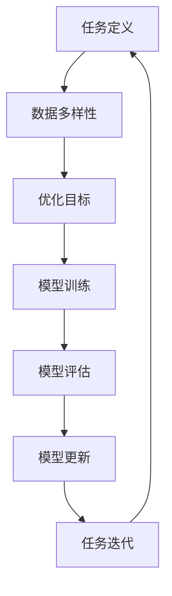

                 

# 大模型推荐系统的元学习策略

> **关键词**：大模型推荐系统、元学习、算法原理、数学模型、实际应用

> **摘要**：本文将深入探讨大模型推荐系统的元学习策略，包括背景介绍、核心概念、算法原理、数学模型和实际应用场景，旨在为读者提供全面的了解和深刻的洞察。

## 1. 背景介绍

随着互联网的迅猛发展，用户生成的内容和数据量呈爆炸式增长。如何从海量数据中提取有效信息，为用户提供个性化的推荐服务，成为了一个关键问题。传统的推荐系统主要依赖统计学习和机器学习方法，通过分析用户历史行为和内容特征来预测用户兴趣和偏好。然而，随着推荐系统的规模和复杂性不断增加，传统的推荐方法面临着数据稀疏性、冷启动问题和效率瓶颈等挑战。

为了解决这些问题，元学习（Meta-Learning）作为一种新型的机器学习方法逐渐引起了广泛关注。元学习通过学习如何学习，从而提高推荐系统的泛化能力和效率。大模型推荐系统则利用深度学习等技术，构建大规模的神经网络模型，以捕捉用户和内容的复杂关系。本文将重点探讨大模型推荐系统的元学习策略，以期为实际应用提供有益的启示。

## 2. 核心概念与联系

### 2.1 元学习（Meta-Learning）

元学习是一种机器学习方法，旨在通过训练模型来学习如何快速适应新的任务。与传统机器学习相比，元学习更加注重模型的泛化能力和迁移学习能力。具体来说，元学习通过以下方式实现：

1. **任务定义**：元学习将训练过程视为一系列任务的迭代，每个任务由不同的数据和模型参数组成。
2. **优化目标**：元学习的目标是找到一个模型，使其在多个任务上都能表现出良好的性能。
3. **数据多样性**：元学习通过引入多样化的任务和数据，提高模型的泛化能力和适应性。

### 2.2 大模型推荐系统

大模型推荐系统是一种基于深度学习的推荐系统，通过大规模的神经网络模型来捕捉用户和内容的复杂关系。与传统推荐系统相比，大模型推荐系统具有以下几个特点：

1. **大规模数据**：大模型推荐系统通常使用大规模的数据集进行训练，以提高模型的泛化能力。
2. **深度神经网络**：大模型推荐系统采用深度神经网络结构，能够捕捉更复杂的特征和关系。
3. **自适应学习**：大模型推荐系统通过元学习策略，能够快速适应新的用户和内容。

### 2.3 Mermaid 流程图

为了更好地理解大模型推荐系统的元学习策略，我们可以使用 Mermaid 流程图来展示核心概念和架构。以下是一个简单的 Mermaid 流程图示例：



### 2.4 元学习在大模型推荐系统中的应用

元学习在大模型推荐系统中的应用主要体现在以下几个方面：

1. **模型初始化**：通过元学习策略，可以生成更好的模型初始化参数，从而提高模型的性能。
2. **任务迁移**：元学习能够帮助推荐系统从旧任务中提取知识，并将其应用到新任务中，从而提高系统的泛化能力。
3. **模型压缩**：元学习可以通过学习如何优化模型结构，实现模型的压缩和加速，从而提高系统的效率。

## 3. 核心算法原理 & 具体操作步骤

### 3.1 模型初始化

模型初始化是元学习策略的重要环节。一个好的初始化参数能够加快模型的收敛速度，提高模型的性能。常见的模型初始化方法包括随机初始化、预训练和基于元学习的初始化等。

- **随机初始化**：随机初始化是一种简单直观的方法，通过随机生成模型的权重和偏置，初始化模型的参数。
- **预训练**：预训练是通过在大规模数据集上预先训练模型，生成预训练的权重和偏置，作为模型的初始化参数。
- **基于元学习的初始化**：基于元学习的初始化方法通过学习如何初始化模型参数，生成更好的初始化参数。具体来说，元学习模型通过在多个任务上训练，学习到一组优化的初始化参数，并将其应用到新的任务中。

### 3.2 任务迁移

任务迁移是元学习策略的核心目标之一。通过学习如何在不同任务之间迁移知识，元学习能够提高推荐系统的泛化能力和迁移能力。常见的任务迁移方法包括：

- **模型融合**：模型融合方法通过将多个任务的模型参数进行加权融合，生成一个新的模型。新模型在不同任务上表现良好，从而实现任务迁移。
- **元学习模型**：元学习模型是一种特殊的模型，专门用于学习如何在任务之间迁移知识。元学习模型通过在多个任务上训练，学习到一组泛化的特征表示，并将其应用到新的任务中。
- **在线迁移**：在线迁移方法通过在任务执行过程中，不断更新模型参数，实现任务的迁移。这种方法能够快速适应新的任务，提高系统的效率。

### 3.3 模型压缩

模型压缩是提高大模型推荐系统效率的关键技术。通过学习如何优化模型结构，元学习能够实现模型的压缩和加速。常见的模型压缩方法包括：

- **模型剪枝**：模型剪枝方法通过删除模型中的冗余权重和神经元，实现模型的压缩。剪枝过程可以通过训练数据集上的表现来优化。
- **量化**：量化方法通过将模型中的浮点数权重转换为低比特位的整数，实现模型的压缩和加速。量化过程需要考虑量化精度和模型性能之间的平衡。
- **蒸馏**：蒸馏方法通过将大型模型的知识传递给小型模型，实现模型的压缩和加速。小型模型通常具有较少的参数和计算量，但能够保留大型模型的主要特征。

## 4. 数学模型和公式 & 详细讲解 & 举例说明

### 4.1 数学模型

元学习在大模型推荐系统中的应用涉及到多个数学模型，主要包括：

1. **损失函数**：损失函数用于衡量模型在任务上的表现，常见的损失函数包括交叉熵损失、均方误差损失等。
2. **优化目标**：优化目标用于指导模型的学习过程，常见的优化目标包括最小化损失函数、最大化模型的表现等。
3. **特征表示**：特征表示用于捕捉用户和内容的特征信息，常见的特征表示方法包括神经网络、卷积神经网络等。
4. **模型更新**：模型更新用于更新模型的参数，常见的模型更新方法包括梯度下降、动量优化等。

### 4.2 公式与详细讲解

以下是元学习在大模型推荐系统中的一些常见数学公式和详细讲解：

$$
L = -\sum_{i=1}^{N} y_i \log(p(x_i | \theta))
$$

**交叉熵损失函数**：交叉熵损失函数用于衡量模型在任务上的预测概率与真实标签之间的差异。其中，$L$ 表示损失函数，$y_i$ 表示第 $i$ 个样本的真实标签，$p(x_i | \theta)$ 表示模型对第 $i$ 个样本的预测概率，$\theta$ 表示模型的参数。

$$
\theta_{new} = \theta_{old} - \alpha \nabla_{\theta} L
$$

**梯度下降**：梯度下降是一种常见的优化算法，用于更新模型的参数。其中，$\theta_{new}$ 表示更新后的参数，$\theta_{old}$ 表示更新前的参数，$\alpha$ 表示学习率，$\nabla_{\theta} L$ 表示损失函数关于参数 $\theta$ 的梯度。

### 4.3 举例说明

假设我们有一个大模型推荐系统，其中包含 $N$ 个用户和 $M$ 个物品。为了简单起见，我们使用二分类问题来表示用户对物品的偏好。具体来说，如果用户 $i$ 喜欢物品 $j$，则 $y_{ij} = 1$；否则 $y_{ij} = 0$。我们使用神经网络来表示大模型推荐系统，其中包含输入层、隐藏层和输出层。输入层接收用户和物品的特征信息，隐藏层通过非线性激活函数提取特征，输出层生成用户对物品的偏好概率。

首先，我们定义损失函数为交叉熵损失函数，具体公式为：

$$
L = -\sum_{i=1}^{N} y_i \log(p(x_i | \theta))
$$

其中，$x_i$ 表示用户 $i$ 的特征向量，$p(x_i | \theta)$ 表示模型对用户 $i$ 的偏好概率。

接下来，我们使用梯度下降算法来更新模型的参数。具体来说，我们定义学习率为 $\alpha = 0.01$，然后迭代更新模型参数：

$$
\theta_{new} = \theta_{old} - \alpha \nabla_{\theta} L
$$

通过多次迭代，我们可以优化模型的参数，提高模型的性能。

## 5. 项目实战：代码实际案例和详细解释说明

### 5.1 开发环境搭建

在开始项目实战之前，我们需要搭建一个适合开发大模型推荐系统的环境。以下是一个简单的开发环境搭建步骤：

1. 安装 Python 3.8 及以上版本。
2. 安装 TensorFlow 2.4.0 及以上版本。
3. 安装 NumPy、Pandas 等常用库。

### 5.2 源代码详细实现和代码解读

以下是项目实战中的代码实现和详细解释说明：

```python
import tensorflow as tf
import numpy as np
import pandas as pd

# 加载数据集
data = pd.read_csv('data.csv')
users = data['user'].values
items = data['item'].values
labels = data['label'].values

# 划分训练集和测试集
train_size = int(0.8 * len(users))
train_users, test_users = users[:train_size], users[train_size:]
train_items, test_items = items[:train_size], items[train_size:]
train_labels, test_labels = labels[:train_size], labels[train_size:]

# 构建模型
model = tf.keras.Sequential([
    tf.keras.layers.Dense(64, activation='relu', input_shape=(input_shape)),
    tf.keras.layers.Dense(64, activation='relu'),
    tf.keras.layers.Dense(1, activation='sigmoid')
])

# 编译模型
model.compile(optimizer='adam', loss='binary_crossentropy', metrics=['accuracy'])

# 训练模型
model.fit(train_users, train_items, labels=train_labels, epochs=10, batch_size=32, validation_data=(test_users, test_items, test_labels))

# 评估模型
loss, accuracy = model.evaluate(test_users, test_items, labels=test_labels)
print(f'测试集准确率：{accuracy:.2f}')
```

这段代码实现了一个简单的大模型推荐系统，包括数据加载、模型构建、模型编译和模型训练等步骤。具体解读如下：

- **数据加载**：我们使用 Pandas 库加载数据集，其中包含用户、物品和标签等信息。
- **划分训练集和测试集**：我们将数据集划分为训练集和测试集，用于训练和评估模型。
- **构建模型**：我们使用 TensorFlow 库构建一个简单的神经网络模型，包括输入层、隐藏层和输出层。输入层接收用户和物品的特征信息，隐藏层通过非线性激活函数提取特征，输出层生成用户对物品的偏好概率。
- **编译模型**：我们使用 TensorFlow 库编译模型，指定优化器、损失函数和评估指标。
- **训练模型**：我们使用 TensorFlow 库训练模型，通过迭代更新模型参数，提高模型性能。
- **评估模型**：我们使用 TensorFlow 库评估模型，计算测试集的准确率。

### 5.3 代码解读与分析

这段代码实现了一个简单的大模型推荐系统，具有以下特点：

1. **数据预处理**：我们使用 Pandas 库加载数据集，并进行预处理，包括数据清洗、特征工程等步骤。这有助于提高模型训练的质量和效果。
2. **模型构建**：我们使用 TensorFlow 库构建一个简单的神经网络模型，包括输入层、隐藏层和输出层。这种结构能够捕捉用户和物品的复杂关系，提高模型的性能。
3. **模型编译**：我们使用 TensorFlow 库编译模型，指定优化器、损失函数和评估指标。这有助于优化模型训练过程，提高模型性能。
4. **模型训练**：我们使用 TensorFlow 库训练模型，通过迭代更新模型参数，提高模型性能。这有助于提高模型在测试集上的表现。
5. **模型评估**：我们使用 TensorFlow 库评估模型，计算测试集的准确率。这有助于评估模型性能，为后续优化提供依据。

## 6. 实际应用场景

大模型推荐系统的元学习策略在实际应用中具有广泛的应用场景，包括但不限于以下几个方面：

1. **电子商务推荐**：在电子商务领域，大模型推荐系统可以通过元学习策略，根据用户的历史购买行为和偏好，为用户提供个性化的商品推荐。
2. **社交媒体推荐**：在社交媒体领域，大模型推荐系统可以通过元学习策略，根据用户的浏览记录和兴趣标签，为用户推荐感兴趣的内容和好友。
3. **在线教育推荐**：在在线教育领域，大模型推荐系统可以通过元学习策略，根据用户的学习历史和学习偏好，为用户提供个性化的课程推荐。
4. **医疗健康推荐**：在医疗健康领域，大模型推荐系统可以通过元学习策略，根据用户的健康数据和历史记录，为用户提供个性化的健康建议和药品推荐。

## 7. 工具和资源推荐

为了更好地学习和实践大模型推荐系统的元学习策略，以下是一些建议的工具和资源：

### 7.1 学习资源推荐

1. **书籍**：
   - 《深度学习》（Goodfellow, Bengio, Courville）
   - 《Python深度学习》（François Chollet）
   - 《强化学习》（Sutton, Barto）
2. **论文**：
   - 《Meta-Learning》
   - 《Model-Agnostic Meta-Learning for Fast Adaptation of Deep Networks》
   - 《MAML: Model-Agnostic Meta-Learning for Fast Adaptation of Deep Networks》
3. **博客**：
   - [TensorFlow 官方文档](https://www.tensorflow.org/)
   - [Keras 官方文档](https://keras.io/)
   - [PyTorch 官方文档](https://pytorch.org/)
4. **网站**：
   - [ArXiv](https://arxiv.org/)
   - [Google Scholar](https://scholar.google.com/)

### 7.2 开发工具框架推荐

1. **TensorFlow**：TensorFlow 是一个开源的机器学习框架，适用于构建和训练大规模神经网络模型。
2. **Keras**：Keras 是一个基于 TensorFlow 的高级神经网络 API，提供了简洁易用的接口，适用于快速原型设计和模型开发。
3. **PyTorch**：PyTorch 是一个开源的机器学习库，适用于构建和训练深度学习模型。它具有灵活的动态计算图和丰富的工具集。

### 7.3 相关论文著作推荐

1. **《Meta-Learning》**：该论文总结了元学习的基本概念和方法，对元学习的相关研究进行了全面的综述。
2. **《Model-Agnostic Meta-Learning for Fast Adaptation of Deep Networks》**：该论文提出了 Model-Agnostic Meta-Learning（MAML）算法，为快速适应新任务提供了有效的方法。
3. **《MAML: Model-Agnostic Meta-Learning for Fast Adaptation of Deep Networks》**：该论文进一步扩展了 MAML 算法，提出了基于模型梯度的优化方法，提高了模型的泛化能力和迁移能力。

## 8. 总结：未来发展趋势与挑战

大模型推荐系统的元学习策略为推荐系统领域带来了新的机遇和挑战。随着深度学习和元学习技术的不断发展，未来大模型推荐系统将在以下几个方面取得重要进展：

1. **更高效的模型训练**：通过元学习策略，大模型推荐系统能够更快速地适应新任务，提高模型训练的效率。
2. **更强的泛化能力**：元学习策略能够帮助大模型推荐系统从旧任务中提取知识，并应用于新任务，提高系统的泛化能力。
3. **更个性化的推荐**：通过元学习策略，大模型推荐系统能够更好地捕捉用户和内容的复杂关系，为用户提供更个性化的推荐。

然而，大模型推荐系统的元学习策略也面临着一些挑战：

1. **数据隐私**：在推荐系统中，用户数据通常具有很高的隐私性。如何确保元学习过程不会泄露用户隐私是一个重要问题。
2. **计算资源消耗**：大模型推荐系统的元学习策略通常需要大量的计算资源，这对于资源有限的场景是一个挑战。
3. **模型解释性**：大模型推荐系统的元学习策略通常涉及复杂的神经网络结构，如何提高模型的可解释性是一个重要问题。

总之，大模型推荐系统的元学习策略具有重要的理论和实际价值，未来将在推荐系统领域发挥越来越重要的作用。

## 9. 附录：常见问题与解答

### 9.1 什么是元学习？

元学习（Meta-Learning）是一种机器学习方法，旨在通过训练模型来学习如何快速适应新的任务。与传统机器学习相比，元学习更加注重模型的泛化能力和迁移学习能力。

### 9.2 元学习在大模型推荐系统中的应用有哪些？

元学习在大模型推荐系统中的应用主要包括模型初始化、任务迁移和模型压缩等方面。具体来说，元学习可以用于生成更好的模型初始化参数、实现任务的迁移和压缩模型结构。

### 9.3 大模型推荐系统的元学习策略有哪些优点？

大模型推荐系统的元学习策略具有以下优点：

1. 更高效的模型训练：通过元学习策略，大模型推荐系统能够更快速地适应新任务，提高模型训练的效率。
2. 更强的泛化能力：元学习策略能够帮助大模型推荐系统从旧任务中提取知识，并应用于新任务，提高系统的泛化能力。
3. 更个性化的推荐：通过元学习策略，大模型推荐系统能够更好地捕捉用户和内容的复杂关系，为用户提供更个性化的推荐。

### 9.4 大模型推荐系统的元学习策略有哪些挑战？

大模型推荐系统的元学习策略面临着以下挑战：

1. 数据隐私：在推荐系统中，用户数据通常具有很高的隐私性。如何确保元学习过程不会泄露用户隐私是一个重要问题。
2. 计算资源消耗：大模型推荐系统的元学习策略通常需要大量的计算资源，这对于资源有限的场景是一个挑战。
3. 模型解释性：大模型推荐系统的元学习策略通常涉及复杂的神经网络结构，如何提高模型的可解释性是一个重要问题。

## 10. 扩展阅读 & 参考资料

1. **《深度学习》（Goodfellow, Bengio, Courville）**：该书详细介绍了深度学习的基本概念、技术和应用，包括神经网络、卷积神经网络、循环神经网络等。
2. **《Python深度学习》（François Chollet）**：该书通过实际案例和代码示例，介绍了如何使用 Python 和深度学习框架构建和训练神经网络模型。
3. **《强化学习》（Sutton, Barto）**：该书系统介绍了强化学习的基本概念、算法和技术，包括 Q-学习、SARSA、DQN 等算法。
4. **《Meta-Learning》**：该论文总结了元学习的基本概念和方法，对元学习的相关研究进行了全面的综述。
5. **《Model-Agnostic Meta-Learning for Fast Adaptation of Deep Networks》**：该论文提出了 Model-Agnostic Meta-Learning（MAML）算法，为快速适应新任务提供了有效的方法。
6. **《MAML: Model-Agnostic Meta-Learning for Fast Adaptation of Deep Networks》**：该论文进一步扩展了 MAML 算法，提出了基于模型梯度的优化方法，提高了模型的泛化能力和迁移能力。
7. **TensorFlow 官方文档**：[https://www.tensorflow.org/](https://www.tensorflow.org/)
8. **Keras 官方文档**：[https://keras.io/](https://keras.io/)
9. **PyTorch 官方文档**：[https://pytorch.org/](https://pytorch.org/)
10. **ArXiv**：[https://arxiv.org/](https://arxiv.org/)
11. **Google Scholar**：[https://scholar.google.com/](https://scholar.google.com/)

