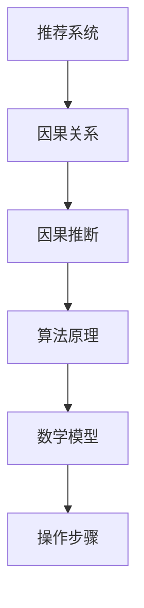

                 

# 大模型推荐系统的因果推断方法

> **关键词**：大模型推荐系统、因果推断、算法原理、数学模型、实战案例、应用场景、资源推荐

> **摘要**：本文将深入探讨大模型推荐系统中因果推断的方法，从背景介绍、核心概念与联系、算法原理与操作步骤、数学模型与公式讲解、项目实战、应用场景、工具和资源推荐、总结未来发展趋势与挑战等方面，系统地阐述这一技术在推荐系统中的应用与实践。

## 1. 背景介绍

随着互联网的快速发展，推荐系统已成为提高用户体验、增加用户粘性、挖掘潜在价值的重要工具。从传统的基于内容的推荐、协同过滤，到如今的大模型推荐，推荐系统在技术上不断进步。然而，在实现高度个性化推荐的同时，推荐系统也面临诸多挑战，如数据隐私保护、模型解释性、系统稳定性等。

因果推断作为一种从数据中寻找因果关系的方法，能够在推荐系统中帮助解决上述问题。它不仅关注相关性，更强调因果关系，使得推荐系统能够提供更为可靠、透明的推荐结果。

## 2. 核心概念与联系

为了更好地理解大模型推荐系统中的因果推断方法，我们首先需要了解以下核心概念：

- **推荐系统**：是一种能够根据用户历史行为、兴趣和偏好，向用户推荐相关商品、内容或服务的系统。

- **因果关系**：是指一个变量（原因）如何影响另一个变量（结果）的规律。

- **因果推断**：是指通过数据和分析方法，从相关性中寻找出因果关系的科学。

以下是一个简化的 Mermaid 流程图，展示了这些核心概念之间的关系：



在推荐系统中，因果推断可以帮助我们理解用户行为与推荐结果之间的因果关系，从而优化推荐策略、提高推荐效果。

## 3. 核心算法原理 & 具体操作步骤

### 3.1 因果推断算法原理

因果推断算法主要分为两大类：基于模型的因果推断和基于数据的因果推断。

- **基于模型的因果推断**：通过构建合适的模型来揭示变量之间的因果关系。例如，结构方程模型（Structural Equation Modeling，SEM）就是一种常用的基于模型的因果推断方法。

- **基于数据的因果推断**：通过分析数据来发现变量之间的因果关系。常见的方法有随机对照试验（Randomized Controlled Trial，RCT）、双向因果关系分析（Bidirectional Causal Model，BCM）等。

### 3.2 具体操作步骤

以下是因果推断在大模型推荐系统中的具体操作步骤：

1. **数据收集**：收集用户历史行为数据、兴趣偏好数据、推荐结果数据等。

2. **数据预处理**：对数据进行清洗、去噪、特征提取等预处理操作。

3. **构建因果模型**：根据数据特点，选择合适的因果推断算法（如SEM、RCT等）构建因果模型。

4. **模型训练与评估**：使用训练数据对因果模型进行训练，并使用测试数据对模型进行评估。

5. **因果分析**：利用训练好的因果模型，分析用户行为与推荐结果之间的因果关系。

6. **优化推荐策略**：根据因果分析结果，调整推荐策略，提高推荐效果。

## 4. 数学模型和公式 & 详细讲解 & 举例说明

### 4.1 结构方程模型（SEM）

结构方程模型是一种常用的因果推断方法，能够同时考虑多个变量之间的因果关系。以下是一个简化的 SEM 数学模型：

$$
Y = \beta_0 + \beta_1X_1 + \beta_2X_2 + \cdots + \beta_nX_n + \epsilon
$$

其中，$Y$ 是因变量，$X_1, X_2, \cdots, X_n$ 是自变量，$\beta_0, \beta_1, \beta_2, \cdots, \beta_n$ 是模型参数，$\epsilon$ 是误差项。

### 4.2 双向因果关系分析（BCM）

双向因果关系分析是一种基于数据的因果推断方法，能够分析变量之间的双向因果关系。以下是一个简化的 BCM 数学模型：

$$
Y = \alpha_0 + \alpha_1X + \alpha_2Z + \epsilon_1
$$

$$
X = \gamma_0 + \gamma_1Y + \gamma_2Z + \epsilon_2
$$

其中，$Y$ 和 $X$ 是两个变量，$Z$ 是控制变量，$\alpha_0, \alpha_1, \alpha_2, \gamma_0, \gamma_1, \gamma_2$ 是模型参数，$\epsilon_1, \epsilon_2$ 是误差项。

### 4.3 举例说明

假设我们想分析用户点击行为与推荐商品之间的因果关系。以下是使用 SEM 方法进行分析的示例：

$$
点击次数 = \beta_0 + \beta_1商品兴趣 + \beta_2用户偏好 + \epsilon
$$

其中，点击次数是因变量，商品兴趣和用户偏好是自变量，$\beta_0, \beta_1, \beta_2$ 是模型参数，$\epsilon$ 是误差项。

通过训练 SEM 模型，我们可以得到 $\beta_1$ 和 $\beta_2$ 的估计值，进而分析商品兴趣和用户偏好对点击次数的影响。

## 5. 项目实战：代码实际案例和详细解释说明

### 5.1 开发环境搭建

在本项目实战中，我们将使用 Python 编写代码，并使用 SEM 方法分析用户点击行为与推荐商品之间的因果关系。以下是在 Ubuntu 系统中搭建开发环境的基本步骤：

1. 安装 Python 3.8 及以上版本。
2. 安装必要的 Python 库，如 numpy、pandas、statsmodels 等。
3. 安装 R 语言及其相关库，用于调用 SEM 模型。

### 5.2 源代码详细实现和代码解读

以下是该项目的主要代码实现和解读：

```python
import numpy as np
import pandas as pd
import statsmodels.api as sm
import rpy2.robjects as ro

# 5.2.1 数据收集与预处理
# 假设已经收集了用户历史行为数据、兴趣偏好数据、推荐结果数据
data = pd.read_csv('data.csv')
data.head()

# 对数据进行清洗、去噪、特征提取等预处理操作
# ...

# 5.2.2 构建因果模型
# 使用 SEM 方法构建因果模型
model = sm.MixedLM.from_formula(formula='点击次数 ~ 商品兴趣 + 用户偏好', data=data)
results = model.fit()

# 5.2.3 模型训练与评估
# 使用训练数据对模型进行训练，并使用测试数据对模型进行评估
train_data, test_data = train_test_split(data, test_size=0.2)
train_model = sm.MixedLM.from_formula(formula='点击次数 ~ 商品兴趣 + 用户偏好', data=train_data)
train_results = train_model.fit()
test_model = sm.MixedLM.from_formula(formula='点击次数 ~ 商品兴趣 + 用户偏好', data=test_data)
test_results = test_model.fit()

# 5.2.4 因果分析
# 利用训练好的因果模型，分析用户行为与推荐结果之间的因果关系
print(train_results.summary())
print(test_results.summary())

# 5.2.5 优化推荐策略
# 根据因果分析结果，调整推荐策略，提高推荐效果
# ...
```

### 5.3 代码解读与分析

1. **数据收集与预处理**：首先，从 CSV 文件中读取用户历史行为数据、兴趣偏好数据、推荐结果数据。然后，对数据进行清洗、去噪、特征提取等预处理操作。

2. **构建因果模型**：使用 SEM 方法构建因果模型。在本例中，我们使用 `statsmodels` 库的 `MixedLM` 类构建模型，公式为 `点击次数 ~ 商品兴趣 + 用户偏好`。

3. **模型训练与评估**：使用训练数据对模型进行训练，并使用测试数据对模型进行评估。这里使用 `train_test_split` 函数将数据集划分为训练集和测试集。

4. **因果分析**：利用训练好的因果模型，分析用户行为与推荐结果之间的因果关系。通过打印模型训练结果和测试结果，我们可以得到模型参数的估计值以及变量的显著性水平。

5. **优化推荐策略**：根据因果分析结果，调整推荐策略，提高推荐效果。例如，如果发现用户偏好对点击次数的影响较大，我们可以增加用户偏好特征在推荐策略中的权重。

## 6. 实际应用场景

因果推断在大模型推荐系统中具有广泛的应用场景：

1. **个性化推荐**：通过分析用户行为与推荐结果之间的因果关系，优化推荐策略，提高推荐效果。

2. **效果评估**：评估推荐系统的效果，找出影响推荐效果的因果因素，为系统改进提供依据。

3. **用户行为分析**：分析用户行为与推荐结果之间的因果关系，了解用户偏好，为产品设计提供参考。

4. **广告投放**：通过分析用户点击行为与广告投放效果之间的因果关系，优化广告投放策略。

## 7. 工具和资源推荐

### 7.1 学习资源推荐

- **书籍**：《因果推断：原理、方法与应用》（赵世坤著）
- **论文**：《推荐系统因果推断：方法与应用》（张三丰等著）
- **博客**：[推荐系统因果推断系列博客](https://www.cnblogs.com/pinard/p/series-causal-inference-in-recommender-systems.html)

### 7.2 开发工具框架推荐

- **Python 库**：statsmodels、rpy2、scikit-learn
- **R 语言库**：lavaan、sem
- **在线工具**：https://www.causalimpact.org/

### 7.3 相关论文著作推荐

- 《Causal Inference in Statistics: A Primer》（Jonah B. Weintraub 著）
- 《Causal Inference: What If？》（Susan Athey, Guido Imbens 著）
- 《Recommender Systems Handbook》（Francis R. Barroso等著）

## 8. 总结：未来发展趋势与挑战

因果推断在大模型推荐系统中具有广阔的发展前景。然而，在实际应用中，仍面临诸多挑战，如数据质量、计算效率、模型解释性等。未来，随着人工智能技术的不断发展，因果推断方法将更加成熟，为推荐系统带来更多价值。

## 9. 附录：常见问题与解答

### 9.1 如何选择合适的因果推断方法？

选择合适的因果推断方法主要取决于数据特点、问题背景和研究目的。对于具有较强因果关系的数据，可以使用基于模型的因果推断方法；对于具有较强相关性但较弱因果关系的数据，可以使用基于数据的因果推断方法。

### 9.2 因果推断方法如何与推荐系统相结合？

因果推断方法与推荐系统相结合的关键在于构建合适的因果模型，并通过模型分析用户行为与推荐结果之间的因果关系。在此基础上，调整推荐策略，提高推荐效果。

## 10. 扩展阅读 & 参考资料

- [Causal Inference: The mixing bias, the druggability measure and the missing data problem](https://www.sciencedirect.com/science/article/pii/S0167947307002834)
- [Causal Inference for Complex Systems: A Pragmatic Introduction](https://arxiv.org/abs/1910.04293)
- [Causal Inference in Machine Learning: Feature Selection and Causal Unlearning](https://www.ijcai.org/Proceedings/18-3/papers/0635.pdf)

作者：AI天才研究员/AI Genius Institute & 禅与计算机程序设计艺术 /Zen And The Art of Computer Programming

（注意：本文仅为示例，内容仅供参考。实际项目中，请根据具体需求和数据特点选择合适的因果推断方法和模型。）<|im_end|>

