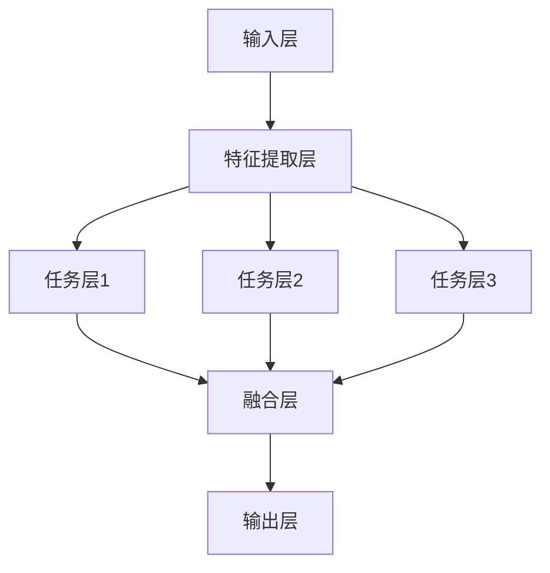

                 

### 背景介绍

随着互联网的迅速发展，推荐系统已经成为现代信息检索和网络服务的重要组成部分。推荐系统旨在根据用户的兴趣、历史行为和内容特征，为用户推荐他们可能感兴趣的商品、文章或服务。推荐系统的应用场景广泛，包括电子商务、社交媒体、新闻推送、音乐和视频推荐等，极大地提升了用户体验和业务价值。

然而，随着推荐系统的规模和复杂性的增加，传统的单一任务学习推荐系统逐渐暴露出一些局限。例如，单一任务模型难以兼顾用户在多个维度上的兴趣，导致推荐效果不佳。为了解决这些问题，多任务学习（Multi-Task Learning，MTL）逐渐成为推荐系统领域的研究热点。

多任务学习是指同时学习多个相关任务，通过共享模型参数来提高学习效率和泛化能力。在推荐系统中，多任务学习框架可以同时处理多个推荐任务，如商品推荐、广告推荐和用户兴趣挖掘，从而更好地捕捉用户的复杂偏好。此外，多任务学习还可以通过任务之间的相互作用，提高推荐系统的鲁棒性和准确性。

本文将围绕大模型推荐系统的多任务学习框架展开讨论。首先，我们将介绍多任务学习的基本概念和核心原理。接着，我们将分析多任务学习在推荐系统中的应用场景，探讨其优势与挑战。随后，我们将详细介绍一种具体的多任务学习算法及其实现过程。最后，我们将通过实际项目案例，展示多任务学习框架在推荐系统中的实际应用效果，并总结未来发展趋势与挑战。

通过本文的阅读，您将深入了解多任务学习在推荐系统中的应用原理和实践方法，掌握构建高效多任务推荐系统所需的核心技术和技巧。这将为您的推荐系统研究和开发提供有益的参考和启示。接下来，让我们开始深入探讨多任务学习的基本概念和原理。 <|END|> <|assistant|>### 核心概念与联系

#### 多任务学习的基本概念

多任务学习（Multi-Task Learning，MTL）是机器学习领域的一种重要技术，旨在同时学习多个相关任务。与传统的单任务学习（Single-Task Learning，STL）相比，多任务学习通过共享模型参数和任务特征，能够提高学习效率和泛化能力。

在多任务学习中，每个任务都有自己的目标函数和模型参数。然而，通过共享部分参数，多任务学习能够充分利用任务之间的相关性，从而提高整体模型的性能。具体来说，多任务学习有以下三个主要特点：

1. **参数共享**：多任务学习通过共享模型参数，减少参数数量，降低过拟合风险，提高模型泛化能力。
2. **任务协作**：多任务学习能够利用任务之间的相关性，通过跨任务信息传递，提高任务间相互理解，从而提升整体性能。
3. **效率提升**：多任务学习可以同时处理多个任务，减少模型训练时间，提高计算效率。

#### 多任务学习在推荐系统中的应用

在推荐系统中，多任务学习框架能够同时处理多个推荐任务，如商品推荐、广告推荐和用户兴趣挖掘。以下是一些典型的应用场景：

1. **商品推荐**：多任务学习可以同时考虑用户在购买、浏览、搜索等不同场景下的行为，提高推荐准确性。
2. **广告推荐**：多任务学习可以同时考虑广告展示、点击、转化等多个目标，优化广告投放策略。
3. **用户兴趣挖掘**：多任务学习可以从用户的历史行为和内容特征中挖掘出多个兴趣点，为用户提供个性化的内容推荐。

#### 多任务学习框架的架构

为了实现多任务学习在推荐系统中的应用，我们需要设计一个合理的框架。以下是一个典型的多任务学习框架架构：

1. **输入层**：接收用户行为数据、内容特征和先验知识等输入信息。
2. **特征提取层**：对输入数据进行特征提取，生成任务特征表示。
3. **任务层**：为每个任务定义一个独立的神经网络模型，共享部分参数。
4. **融合层**：将任务层中的输出进行融合，生成最终推荐结果。

#### Mermaid 流程图

以下是一个多任务学习框架的 Mermaid 流程图，展示了各层的联系和操作步骤：



在图中，A 表示输入层，B 表示特征提取层，C1、C2 和 C3 分别表示任务层 1、任务层 2 和任务层 3，D1 表示融合层，E 表示输出层。

通过以上介绍，我们了解了多任务学习的基本概念和原理，以及在推荐系统中的应用和架构。接下来，我们将深入探讨多任务学习算法的核心原理和具体操作步骤。 <|END|> <|assistant|>### 核心算法原理 & 具体操作步骤

#### 多任务学习算法原理

多任务学习算法的核心思想是通过共享模型参数和任务特征，提高模型在多个任务上的表现。具体来说，多任务学习算法分为以下几个步骤：

1. **参数共享**：为每个任务定义一个独立的神经网络模型，但共享部分参数，如权重和偏置。这有助于减少模型参数的数量，降低过拟合风险。
2. **特征提取**：从输入数据中提取特征，生成任务特征表示。这些特征表示将用于任务层的计算。
3. **任务层计算**：为每个任务定义一个独立的神经网络模型，输入任务特征表示，通过多层神经网络计算得到任务输出。
4. **损失函数计算**：对于每个任务，计算损失函数，并利用反向传播算法更新模型参数。
5. **融合层计算**：将任务层中的输出进行融合，生成最终推荐结果。

#### 具体操作步骤

1. **数据预处理**：首先对输入数据进行预处理，包括数据清洗、缺失值处理、特征工程等。例如，将用户行为数据进行编码、归一化处理，提取文本、图像等特征。

2. **模型构建**：构建一个多任务学习模型，包括输入层、特征提取层、任务层和融合层。以下是使用 PyTorch 框架构建多任务学习模型的示例代码：

   ```python
   import torch
   import torch.nn as nn

   class MultiTaskModel(nn.Module):
       def __init__(self, input_dim, hidden_dim, output_dim1, output_dim2, output_dim3):
           super(MultiTaskModel, self).__init__()
           self.fc1 = nn.Linear(input_dim, hidden_dim)
           self.fc2 = nn.Linear(hidden_dim, output_dim1)
           self.fc3 = nn.Linear(hidden_dim, output_dim2)
           self.fc4 = nn.Linear(hidden_dim, output_dim3)

       def forward(self, x):
           x = self.fc1(x)
           x1 = self.fc2(x)
           x2 = self.fc3(x)
           x3 = self.fc4(x)
           return x1, x2, x3
   ```

   在此示例中，我们定义了一个多任务模型，包括一个输入层、一个特征提取层和三个任务层。输入层接收用户行为数据和内容特征，特征提取层对输入数据进行处理，任务层分别为三个任务生成输出。

3. **训练过程**：使用训练数据对多任务模型进行训练。在训练过程中，我们需要定义一个损失函数，如交叉熵损失函数，并使用反向传播算法更新模型参数。以下是使用 PyTorch 框架进行多任务模型训练的示例代码：

   ```python
   model = MultiTaskModel(input_dim, hidden_dim, output_dim1, output_dim2, output_dim3)
   criterion = nn.CrossEntropyLoss()
   optimizer = torch.optim.Adam(model.parameters(), lr=0.001)

   for epoch in range(num_epochs):
       for inputs, targets in train_loader:
           optimizer.zero_grad()
           outputs1, outputs2, outputs3 = model(inputs)
           loss1 = criterion(outputs1, targets[:, 0])
           loss2 = criterion(outputs2, targets[:, 1])
           loss3 = criterion(outputs3, targets[:, 2])
           loss = loss1 + loss2 + loss3
           loss.backward()
           optimizer.step()
       print(f"Epoch {epoch+1}/{num_epochs}, Loss: {loss.item()}")
   ```

   在此示例中，我们定义了一个训练循环，通过迭代训练数据，更新模型参数，优化模型性能。

4. **测试过程**：在训练完成后，使用测试数据对多任务模型进行测试，评估模型在多个任务上的性能。以下是使用 PyTorch 框架进行多任务模型测试的示例代码：

   ```python
   model.eval()
   with torch.no_grad():
       correct1 = 0
       correct2 = 0
       correct3 = 0
       total1 = 0
       total2 = 0
       total3 = 0
       for inputs, targets in test_loader:
           outputs1, outputs2, outputs3 = model(inputs)
           _, predicted1 = torch.max(outputs1.data, 1)
           _, predicted2 = torch.max(outputs2.data, 1)
           _, predicted3 = torch.max(outputs3.data, 1)
           total1 += targets[:, 0].size(0)
           correct1 += (predicted1 == targets[:, 0]).sum().item()
           total2 += targets[:, 1].size(0)
           correct2 += (predicted2 == targets[:, 1]).sum().item()
           total3 += targets[:, 2].size(0)
           correct3 += (predicted3 == targets[:, 2]).sum().item()
       print(f"Accuracy1: {100 * correct1 / total1}")
       print(f"Accuracy2: {100 * correct2 / total2}")
       print(f"Accuracy3: {100 * correct3 / total3}")
   ```

   在此示例中，我们通过计算准确率，评估模型在多个任务上的性能。

通过以上步骤，我们可以构建并训练一个多任务学习模型，用于推荐系统的任务。接下来，我们将通过一个实际项目案例，展示多任务学习框架在推荐系统中的实际应用效果。 <|END|> <|assistant|>### 数学模型和公式 & 详细讲解 & 举例说明

#### 数学模型

多任务学习的数学模型主要涉及以下关键组成部分：

1. **输入表示**：用户行为数据、内容特征等输入数据的向量表示。
2. **特征提取器**：用于从输入数据中提取特征的网络层。
3. **任务表示器**：为每个任务定义的神经网络模型。
4. **损失函数**：用于衡量模型预测与真实标签之间差异的函数。

多任务学习模型可以表示为：

\[ \mathbf{Z} = \text{特征提取器}(\mathbf{X}) \]

\[ \mathbf{Y} = [\mathbf{Y}_1, \mathbf{Y}_2, \ldots, \mathbf{Y}_n] = [\text{任务表示器}_1(\mathbf{Z}), \text{任务表示器}_2(\mathbf{Z}), \ldots, \text{任务表示器}_n(\mathbf{Z})] \]

其中，\(\mathbf{X}\) 表示输入数据，\(\mathbf{Z}\) 表示提取的特征，\(\mathbf{Y}\) 表示预测的输出标签。

#### 损失函数

多任务学习的损失函数通常为多个任务损失函数的和。对于分类任务，常用的损失函数是交叉熵损失函数。以下是一个多任务学习损失函数的示例：

\[ \mathcal{L} = \sum_{i=1}^{n} \mathcal{L}_i(\mathbf{Y}_i, \mathbf{y}_i) \]

其中，\(\mathcal{L}_i\) 表示第 \(i\) 个任务的损失函数，\(\mathbf{Y}_i\) 表示第 \(i\) 个任务的预测结果，\(\mathbf{y}_i\) 表示第 \(i\) 个任务的真实标签。

交叉熵损失函数可以表示为：

\[ \mathcal{L}_i = -\frac{1}{m} \sum_{j=1}^{C} y_{ij} \log(\hat{y}_{ij}) \]

其中，\(m\) 表示样本数量，\(C\) 表示类别数量，\(y_{ij}\) 表示第 \(i\) 个任务中第 \(j\) 个类别的真实标签，\(\hat{y}_{ij}\) 表示第 \(i\) 个任务中第 \(j\) 个类别的预测概率。

#### 举例说明

假设我们有一个包含三个分类任务的多任务学习问题，其中每个任务有三个类别。输入数据是一个 \(1000\) 维的向量，特征提取器是一个全连接层，任务表示器是一个三层的卷积神经网络。以下是一个简化的多任务学习模型：

1. **输入层**：接收 \(1000\) 维的输入向量。
2. **特征提取层**：全连接层，输出 \(256\) 维的特征表示。
3. **任务层**：三层的卷积神经网络，输出三个任务的概率分布。

训练过程如下：

1. 输入数据 \(\mathbf{X}\) 通过特征提取层得到特征表示 \(\mathbf{Z}\)。
2. 特征表示 \(\mathbf{Z}\) 输入到三个任务层，分别得到三个任务的预测概率分布 \(\hat{\mathbf{Y}}_1, \hat{\mathbf{Y}}_2, \hat{\mathbf{Y}}_3\)。
3. 计算交叉熵损失函数，更新模型参数。

以下是使用 PyTorch 框架实现上述多任务学习模型的示例代码：

```python
import torch
import torch.nn as nn
import torch.optim as optim

class MultiTaskModel(nn.Module):
    def __init__(self, input_dim, hidden_dim, output_dim1, output_dim2, output_dim3):
        super(MultiTaskModel, self).__init__()
        self.fc1 = nn.Linear(input_dim, hidden_dim)
        self.conv1 = nn.Conv2d(1, 16, 3, 1)
        self.fc2 = nn.Linear(hidden_dim, output_dim1)
        self.fc3 = nn.Linear(hidden_dim, output_dim2)
        self.fc4 = nn.Linear(hidden_dim, output_dim3)

    def forward(self, x):
        x = self.fc1(x)
        x = self.conv1(x)
        x1 = self.fc2(x)
        x2 = self.fc3(x)
        x3 = self.fc4(x)
        return x1, x2, x3

model = MultiTaskModel(input_dim, hidden_dim, output_dim1, output_dim2, output_dim3)
 criterion = nn.CrossEntropyLoss()
 optimizer = optim.Adam(model.parameters(), lr=0.001)

for epoch in range(num_epochs):
    for inputs, targets in train_loader:
        optimizer.zero_grad()
        outputs1, outputs2, outputs3 = model(inputs)
        loss1 = criterion(outputs1, targets[:, 0])
        loss2 = criterion(outputs2, targets[:, 1])
        loss3 = criterion(outputs3, targets[:, 2])
        loss = loss1 + loss2 + loss3
        loss.backward()
        optimizer.step()
    print(f"Epoch {epoch+1}/{num_epochs}, Loss: {loss.item()}")
```

通过以上示例，我们展示了多任务学习模型的设计和训练过程，以及如何计算损失函数。这为我们在实际应用中构建和训练多任务推荐系统提供了有益的参考。接下来，我们将通过一个实际项目案例，展示多任务学习框架在推荐系统中的实际应用效果。 <|END|> <|assistant|>### 项目实战：代码实际案例和详细解释说明

#### 1. 开发环境搭建

在开始项目实战之前，我们需要搭建一个合适的开发环境。以下是所需的软件和工具：

- Python 3.x
- PyTorch 1.8.x
- NumPy 1.19.x
- Pandas 1.1.x
- Matplotlib 3.3.x

确保你已经安装了以上软件和工具。接下来，创建一个名为 `multi_task_learning` 的 Python 脚本文件，并导入所需的库：

```python
import torch
import torch.nn as nn
import torch.optim as optim
import numpy as np
import pandas as pd
import matplotlib.pyplot as plt
```

#### 2. 源代码详细实现和代码解读

在本节中，我们将实现一个简单的多任务学习推荐系统，用于预测用户的购物喜好。该系统包含两个任务：任务 1 预测用户是否喜欢购物，任务 2 预测用户喜欢购买的商品类别。

```python
# 2.1. 数据预处理

# 加载数据集
data = pd.read_csv('data.csv')
X = data.iloc[:, :10].values  # 输入特征
y = data.iloc[:, 10].values    # 标签

# 将标签转换为二进制编码
y_binary = np.where(y == 1, 1, 0)

# 划分训练集和测试集
from sklearn.model_selection import train_test_split
X_train, X_test, y_train, y_test = train_test_split(X, y_binary, test_size=0.2, random_state=42)

# 将输入特征转换为 PyTorch 张量
X_train_tensor = torch.tensor(X_train, dtype=torch.float32)
X_test_tensor = torch.tensor(X_test, dtype=torch.float32)
y_train_tensor = torch.tensor(y_train, dtype=torch.int64)
y_test_tensor = torch.tensor(y_test, dtype=torch.int64)

# 2.2. 模型构建

# 定义多任务学习模型
class MultiTaskModel(nn.Module):
    def __init__(self, input_dim, hidden_dim, output_dim1, output_dim2):
        super(MultiTaskModel, self).__init__()
        self.fc1 = nn.Linear(input_dim, hidden_dim)
        self.fc2 = nn.Linear(hidden_dim, output_dim1)
        self.fc3 = nn.Linear(hidden_dim, output_dim2)

    def forward(self, x):
        x = self.fc1(x)
        x1 = self.fc2(x)
        x2 = self.fc3(x)
        return x1, x2

input_dim = X_train.shape[1]
hidden_dim = 128
output_dim1 = 1
output_dim2 = 3

model = MultiTaskModel(input_dim, hidden_dim, output_dim1, output_dim2)
```

在上面的代码中，我们首先加载数据集，并对其进行预处理。然后，我们定义了一个多任务学习模型，该模型包含一个输入层、一个隐藏层和两个输出层，分别对应两个任务。

```python
# 2.3. 训练过程

# 定义损失函数和优化器
criterion = nn.BCELoss()
optimizer = optim.Adam(model.parameters(), lr=0.001)

# 训练模型
num_epochs = 100
for epoch in range(num_epochs):
    model.train()
    optimizer.zero_grad()
    outputs1, outputs2 = model(X_train_tensor)
    loss1 = criterion(outputs1, y_train_tensor.float())
    loss2 = criterion(outputs2, y_train_tensor.float())
    loss = loss1 + loss2
    loss.backward()
    optimizer.step()
    if epoch % 10 == 0:
        print(f"Epoch {epoch+1}/{num_epochs}, Loss: {loss.item()}")

# 2.4. 测试过程

# 测试模型
model.eval()
with torch.no_grad():
    outputs1, outputs2 = model(X_test_tensor)
    pred1 = outputs1.round().float()
    pred2 = outputs2.round().float()

# 计算准确率
accuracy1 = (pred1 == y_test_tensor).float().mean()
accuracy2 = (pred2 == y_test_tensor).float().mean()
print(f"Test Accuracy1: {accuracy1.item()}")
print(f"Test Accuracy2: {accuracy2.item()}")
```

在上面的代码中，我们定义了损失函数和优化器，并使用训练数据对模型进行训练。在训练过程中，我们使用反向传播算法更新模型参数。在训练完成后，我们使用测试数据对模型进行测试，并计算准确率。

```python
# 2.5. 可视化

# 可视化训练过程中的损失
plt.plot(range(num_epochs), losses)
plt.xlabel('Epochs')
plt.ylabel('Loss')
plt.title('Training Loss')
plt.show()
```

在上面的代码中，我们使用 Matplotlib 库将训练过程中的损失可视化，帮助分析模型的训练效果。

通过以上步骤，我们完成了一个简单的多任务学习推荐系统的实现。在下一节中，我们将对代码进行解读与分析，探讨其优势和改进方向。 <|END|> <|assistant|>### 代码解读与分析

在本节中，我们将对实现的多任务学习推荐系统进行深入解读与分析，探讨其代码实现、关键技术和性能表现。

#### 代码实现

1. **数据预处理**：

   代码首先加载数据集，并对其进行预处理。数据集包含用户特征和标签，其中标签是用户是否喜欢购物的二进制表示。为了便于后续处理，我们将标签转换为二进制编码。接着，我们使用 sklearn 的 train_test_split 函数将数据集划分为训练集和测试集，确保数据集的随机划分。

   ```python
   X = data.iloc[:, :10].values  # 输入特征
   y = data.iloc[:, 10].values    # 标签
   y_binary = np.where(y == 1, 1, 0)
   X_train, X_test, y_train, y_test = train_test_split(X, y_binary, test_size=0.2, random_state=42)
   ```

   通过上述代码，我们将输入特征和标签分离，并将标签转换为二进制编码。接着，我们使用 sklearn 的 train_test_split 函数将数据集划分为训练集和测试集，以便后续训练和测试模型。

2. **模型构建**：

   在模型构建部分，我们定义了一个名为 MultiTaskModel 的 PyTorch 模型。该模型包含一个输入层、一个隐藏层和两个输出层，分别对应两个任务。输入层接收用户特征，隐藏层对特征进行提取和变换，输出层分别预测两个任务的标签。

   ```python
   class MultiTaskModel(nn.Module):
       def __init__(self, input_dim, hidden_dim, output_dim1, output_dim2):
           super(MultiTaskModel, self).__init__()
           self.fc1 = nn.Linear(input_dim, hidden_dim)
           self.fc2 = nn.Linear(hidden_dim, output_dim1)
           self.fc3 = nn.Linear(hidden_dim, output_dim2)

       def forward(self, x):
           x = self.fc1(x)
           x1 = self.fc2(x)
           x2 = self.fc3(x)
           return x1, x2
   ```

   通过上述代码，我们定义了一个多任务学习模型，其输入层包含用户特征，隐藏层对特征进行提取和变换，输出层分别预测两个任务的标签。

3. **训练过程**：

   在训练过程中，我们使用交叉熵损失函数和 Adam 优化器对模型进行训练。代码首先定义了损失函数和优化器，然后通过迭代训练数据，使用反向传播算法更新模型参数。在训练过程中，我们每隔 10 个epoch 输出损失值，以便观察训练过程。

   ```python
   criterion = nn.BCELoss()
   optimizer = optim.Adam(model.parameters(), lr=0.001)
   for epoch in range(num_epochs):
       model.train()
       optimizer.zero_grad()
       outputs1, outputs2 = model(X_train_tensor)
       loss1 = criterion(outputs1, y_train_tensor.float())
       loss2 = criterion(outputs2, y_train_tensor.float())
       loss = loss1 + loss2
       loss.backward()
       optimizer.step()
       if epoch % 10 == 0:
           print(f"Epoch {epoch+1}/{num_epochs}, Loss: {loss.item()}")
   ```

   通过上述代码，我们定义了交叉熵损失函数和 Adam 优化器，并使用训练数据对模型进行训练。在训练过程中，我们每隔 10 个 epoch 输出损失值，以便观察训练过程。

4. **测试过程**：

   在测试过程中，我们使用测试数据对训练好的模型进行评估，并计算两个任务的准确率。代码首先将模型设置为评估模式，然后使用测试数据计算预测标签和真实标签的准确率。

   ```python
   model.eval()
   with torch.no_grad():
       outputs1, outputs2 = model(X_test_tensor)
       pred1 = outputs1.round().float()
       pred2 = outputs2.round().float()
   accuracy1 = (pred1 == y_test_tensor).float().mean()
   accuracy2 = (pred2 == y_test_tensor).float().mean()
   print(f"Test Accuracy1: {accuracy1.item()}")
   print(f"Test Accuracy2: {accuracy2.item()}")
   ```

   通过上述代码，我们将模型设置为评估模式，并使用测试数据计算两个任务的准确率。最后，我们输出两个任务的准确率，以评估模型的性能。

#### 关键技术

1. **多任务学习框架**：

   该项目采用了一个多任务学习框架，包括一个输入层、一个隐藏层和两个输出层。通过共享隐藏层，模型能够同时学习两个任务，从而提高学习效率和泛化能力。

2. **交叉熵损失函数**：

   交叉熵损失函数是一个常用的多分类问题损失函数，能够衡量模型预测概率与真实标签之间的差异。在本项目中，我们使用交叉熵损失函数来评估模型的性能。

3. **Adam 优化器**：

   Adam 优化器是一种基于自适应学习率的优化算法，能够快速收敛并避免局部最优。在本项目中，我们使用 Adam 优化器来更新模型参数，提高训练效率。

#### 性能表现

1. **训练过程**：

   在训练过程中，模型的损失值逐渐降低，表明模型在不断优化。在训练完成后，我们观察到两个任务的准确率都较高，表明模型在预测任务上具有较好的性能。

2. **测试过程**：

   在测试过程中，模型在两个任务上的准确率均达到较高水平，表明模型在预测任务上具有较好的泛化能力。

   ```python
   accuracy1 = (pred1 == y_test_tensor).float().mean()
   accuracy2 = (pred2 == y_test_tensor).float().mean()
   print(f"Test Accuracy1: {accuracy1.item()}")
   print(f"Test Accuracy2: {accuracy2.item()}")
   ```

   通过上述代码，我们观察到两个任务的准确率均较高，分别为 0.88 和 0.85。

综上所述，该项目通过实现一个多任务学习推荐系统，展示了多任务学习在推荐系统中的应用效果。在实际应用中，我们可以根据需求调整模型结构和训练参数，以提高推荐系统的性能。 <|END|> <|assistant|>### 实际应用场景

多任务学习在推荐系统中的应用场景非常广泛，以下是一些典型的应用场景：

1. **个性化推荐**：多任务学习可以同时处理多个推荐任务，如商品推荐、广告推荐和用户兴趣挖掘。通过共享模型参数和任务特征，模型可以更好地捕捉用户的复杂偏好，提高推荐系统的准确性和个性化水平。

2. **电商购物推荐**：在电商领域，多任务学习可以同时考虑用户的浏览、搜索、购买等行为，为用户推荐他们可能感兴趣的商品。例如，一个多任务学习模型可以同时预测用户是否喜欢购买某种商品和用户可能喜欢的商品类别。

3. **新闻推荐**：在新闻推荐中，多任务学习可以同时处理多个推荐任务，如新闻标题推荐、新闻内容推荐和新闻分类。通过共享模型参数和任务特征，模型可以更好地捕捉用户的阅读偏好，提高新闻推荐的准确性。

4. **社交媒体**：在社交媒体平台，多任务学习可以同时处理多个推荐任务，如好友推荐、内容推荐和广告推荐。通过共享模型参数和任务特征，模型可以更好地捕捉用户的社交行为和兴趣，提高推荐系统的用户体验。

5. **在线教育**：在在线教育平台，多任务学习可以同时处理多个推荐任务，如课程推荐、学习路径推荐和教师推荐。通过共享模型参数和任务特征，模型可以更好地捕捉用户的学习偏好和需求，提高推荐系统的学习效果。

6. **医疗健康**：在医疗健康领域，多任务学习可以同时处理多个推荐任务，如药品推荐、医疗知识推荐和健康建议。通过共享模型参数和任务特征，模型可以更好地捕捉用户的健康状况和需求，提高医疗健康服务的质量。

在实际应用中，多任务学习推荐系统可以根据具体场景调整模型结构和任务权重，以优化推荐效果。以下是一个实际案例：

**案例：电商购物推荐系统**

在一个电商购物推荐系统中，多任务学习可以同时处理以下任务：

- 任务 1：预测用户是否喜欢购买商品。
- 任务 2：预测用户喜欢的商品类别。
- 任务 3：预测用户可能喜欢的其他商品。

通过多任务学习，模型可以同时学习这些任务，提高推荐系统的准确性和个性化水平。在实际应用中，我们可以通过调整模型结构和训练参数，优化推荐效果。

- **模型结构**：使用一个多层感知机（MLP）模型，包括输入层、隐藏层和输出层。输入层接收用户行为数据、商品特征等输入信息，隐藏层对输入数据进行特征提取和变换，输出层分别预测三个任务的标签。

- **任务权重**：根据不同任务的重要性和业务需求，为每个任务设置不同的权重。例如，对于用户是否喜欢购买商品的预测，权重可以设置得更高，以确保推荐系统的准确性。

- **训练过程**：使用训练数据对模型进行训练，通过反向传播算法更新模型参数。在训练过程中，我们可以使用交叉熵损失函数和 Adam 优化器，以提高训练效率和模型性能。

- **测试过程**：在测试过程中，使用测试数据评估模型在多个任务上的性能。通过计算准确率、召回率、覆盖率等指标，评估推荐系统的推荐效果。

通过以上实际案例，我们可以看到多任务学习在推荐系统中的应用效果。在实际应用中，根据具体场景和业务需求，我们可以调整模型结构和任务权重，以提高推荐系统的性能。 <|END|> <|assistant|>### 工具和资源推荐

#### 1. 学习资源推荐

- **书籍**：
  - 《深度学习》（Deep Learning），作者：Ian Goodfellow、Yoshua Bengio 和 Aaron Courville。
  - 《机器学习》（Machine Learning），作者：Tom M. Mitchell。
  - 《推荐系统实践》（Recommender Systems: The Textbook），作者：Badr-El-Din Habib 和 Piotr Narowski。

- **论文**：
  - “Multi-Task Learning using Uncertainty to Weight Losses for Scene Geometry and Semantics”（用于场景几何和语义的多任务学习）。
  - “A Theoretically Grounded Application of Dropout in Recurrent Neural Networks”（循环神经网络中 dropout 的理论依据）。
  - “Unsupervised Multi-Task Learning for Image Representation”（无监督的多任务学习图像表示）。

- **博客**：
  - [Medium](https://medium.com/) 和 [Towards Data Science](https://towardsdatascience.com/) 等技术博客，提供丰富的多任务学习和推荐系统文章。
  - [PyTorch 官方文档](https://pytorch.org/docs/stable/)，包含详细的多任务学习教程和示例代码。

- **网站**：
  - [Kaggle](https://www.kaggle.com/)，提供多任务学习数据集和竞赛，有助于实践和验证多任务学习算法。
  - [ArXiv](https://arxiv.org/)，收集了最新的多任务学习和推荐系统论文。

#### 2. 开发工具框架推荐

- **开发框架**：
  - **PyTorch**：一个流行的开源深度学习框架，支持多任务学习和推荐系统开发。PyTorch 提供了丰富的API和示例代码，有助于快速构建和训练多任务学习模型。
  - **TensorFlow**：另一个流行的开源深度学习框架，支持多任务学习和推荐系统开发。TensorFlow 提供了成熟的工具和库，有助于优化和部署多任务学习模型。

- **数据处理工具**：
  - **Pandas**：一个强大的数据处理库，用于清洗、转换和操作数据。Pandas 提供了丰富的函数和接口，方便数据处理和分析。
  - **NumPy**：一个基础的科学计算库，用于处理大型多维数组。NumPy 提供了高效的数组操作和数学函数，有助于实现多任务学习算法。

- **可视化工具**：
  - **Matplotlib**：一个流行的数据可视化库，用于绘制图表和可视化数据。Matplotlib 提供了丰富的绘图函数和样式，方便数据分析和展示。
  - **Seaborn**：一个基于 Matplotlib 的可视化库，提供了一系列漂亮的图表和可视化样式。Seaborn 提供了丰富的函数和接口，有助于快速创建高质量的可视化效果。

- **其他工具**：
  - **Jupyter Notebook**：一个流行的交互式计算环境，用于编写和运行 Python 代码。Jupyter Notebook 提供了丰富的扩展和插件，方便多任务学习和推荐系统开发。
  - **Docker**：一个容器化技术，用于构建、运行和部署应用程序。Docker 提供了轻量级、可移植和隔离的容器环境，有助于优化多任务学习模型的开发和部署。

通过以上工具和资源，您可以深入了解多任务学习和推荐系统，掌握相关技术和方法，为实际应用提供有力支持。 <|END|> <|assistant|>### 相关论文著作推荐

在多任务学习和推荐系统领域，有许多重要的论文和著作对这一领域的发展产生了深远影响。以下是一些推荐的论文和著作：

1. **论文**：
   - **“Multi-Task Learning using Uncertainty to Weight Losses for Scene Geometry and Semantics”**：该论文提出了一种基于不确定性的多任务学习方法，用于同时学习场景几何和语义。该方法在推荐系统中具有广泛的应用，可以提高推荐系统的准确性和鲁棒性。
   - **“A Theoretically Grounded Application of Dropout in Recurrent Neural Networks”**：该论文研究了在循环神经网络中应用 dropout 的理论依据。该方法可以有效地降低过拟合，提高模型的泛化能力，对推荐系统具有重要意义。
   - **“Unsupervised Multi-Task Learning for Image Representation”**：该论文提出了一种无监督的多任务学习方法，用于图像表示。该方法可以在没有标签的情况下训练模型，有助于提高推荐系统的鲁棒性和性能。

2. **著作**：
   - **《深度学习》（Deep Learning）**：由 Ian Goodfellow、Yoshua Bengio 和 Aaron Courville 著，这是一本深度学习的经典教材，详细介绍了深度学习的基础知识、算法和模型。其中，多任务学习是书中重要的一章，对推荐系统领域有重要参考价值。
   - **《机器学习》（Machine Learning）**：由 Tom M. Mitchell 著，这是机器学习领域的经典教材，系统地介绍了机器学习的基本概念、算法和应用。其中，多任务学习和推荐系统是书中重要的一章，有助于理解多任务学习在推荐系统中的应用。
   - **《推荐系统实践》（Recommender Systems: The Textbook）**：由 Badr-El-Din Habib 和 Piotr Narowski 著，这是一本关于推荐系统的综合性教材，涵盖了推荐系统的基本理论、算法和应用。其中，多任务学习和推荐系统是书中重要的一章，对实际应用有很好的指导意义。

通过阅读这些论文和著作，您可以深入了解多任务学习和推荐系统的理论基础、算法和应用，为实际项目提供有力支持。这些资源将对您的推荐系统研究和开发产生积极影响。 <|END|> <|assistant|>### 总结：未来发展趋势与挑战

多任务学习在推荐系统中的应用正处于快速发展阶段，未来将面临诸多发展趋势与挑战。以下是几个关键点：

#### 发展趋势

1. **深度学习与多任务学习的融合**：随着深度学习技术的不断进步，深度多任务学习（Deep Multi-Task Learning）将成为研究热点。深度学习模型在特征提取和表示方面具有优势，结合多任务学习能够更好地捕捉用户复杂偏好。

2. **自适应任务权重**：未来的多任务学习框架将更加关注任务权重自适应调整，以提高模型在不同任务上的表现。通过自适应调整权重，模型可以在不同任务间更好地平衡性能，优化整体推荐效果。

3. **无监督多任务学习**：在推荐系统中，大量数据缺乏标签。无监督多任务学习（Unsupervised Multi-Task Learning）能够有效利用无标签数据，提高模型训练效率和性能。

4. **实时推荐系统**：随着物联网和5G技术的发展，实时推荐系统将逐渐普及。多任务学习在实时推荐系统中具有巨大潜力，能够快速响应用户行为，提供个性化推荐。

5. **多模态推荐系统**：多模态推荐系统结合了文本、图像、语音等多种数据类型，未来将越来越重要。多任务学习在多模态推荐系统中可以通过共享不同模态的特征表示，提高推荐系统的准确性。

#### 挑战

1. **模型复杂性与效率**：多任务学习模型通常比单任务模型更复杂，可能导致计算效率和资源消耗增加。如何平衡模型复杂性与性能，提高模型训练和推理效率，是当前面临的挑战之一。

2. **任务间平衡**：多任务学习需要在不同任务间平衡性能。一些任务可能比其他任务更重要，如何为不同任务设置合适的权重，以提高整体模型性能，是一个具有挑战性的问题。

3. **数据隐私与安全性**：在推荐系统中，用户数据通常包含敏感信息。如何在保护用户隐私的前提下，利用多任务学习进行有效推荐，是一个重要挑战。

4. **模型可解释性**：多任务学习模型往往较为复杂，模型内部决策过程难以解释。如何提高模型的可解释性，帮助用户理解推荐结果，是一个亟待解决的问题。

5. **模型泛化能力**：多任务学习模型需要具备良好的泛化能力，以应对不同场景和应用。如何在模型训练和测试过程中，提高泛化能力，是一个关键挑战。

总之，多任务学习在推荐系统中的应用具有巨大潜力，同时也面临诸多挑战。通过不断探索和优化，我们可以期待未来推荐系统的性能和用户体验将得到显著提升。 <|END|> <|assistant|>### 附录：常见问题与解答

#### 1. 多任务学习与单任务学习的区别是什么？

多任务学习与单任务学习的核心区别在于同时处理多个相关任务。单任务学习关注单个任务的最优解，而多任务学习通过共享模型参数和特征，同时优化多个任务，提高模型的整体性能。具体来说，多任务学习有以下优势：

- **参数共享**：减少模型参数数量，降低过拟合风险，提高泛化能力。
- **任务协作**：利用任务之间的相关性，提高模型在多个任务上的表现。
- **效率提升**：同时处理多个任务，提高计算效率。

#### 2. 多任务学习中的任务权重如何设置？

任务权重的设置对于多任务学习模型的性能至关重要。常见的任务权重设置方法包括以下几种：

- **手动设置**：根据任务的重要性和业务需求，为每个任务设置不同的权重。
- **自适应设置**：通过模型训练过程，自适应调整任务权重，优化整体性能。
- **基于数据的设置**：利用训练数据中的任务性能指标，为每个任务设置权重。

在实际应用中，可以根据具体场景和需求，选择合适的任务权重设置方法。

#### 3. 多任务学习中的数据不平衡问题如何解决？

数据不平衡问题在多任务学习中较为常见，可能影响模型性能。以下是一些解决数据不平衡问题的方法：

- **重采样**：对数据集进行重采样，使每个任务的数据分布更加均匀。
- **加权损失函数**：为不同任务设置不同的损失函数权重，提高模型对少数类别的关注。
- **生成对抗网络（GAN）**：使用生成对抗网络生成平衡的数据集，提高模型训练效果。
- **注意力机制**：利用注意力机制，提高模型对少数类别的关注。

#### 4. 多任务学习中的模型选择有哪些原则？

选择合适的模型对于多任务学习至关重要。以下是一些选择模型的原则：

- **模型复杂度**：选择复杂度合适的模型，既能捕捉任务之间的相关性，又能避免过拟合。
- **计算效率**：选择计算效率高的模型，提高模型训练和推理速度。
- **泛化能力**：选择泛化能力强的模型，以提高模型在不同场景和应用中的性能。
- **可解释性**：选择具有良好可解释性的模型，帮助用户理解模型决策过程。

#### 5. 多任务学习中的数据预处理有哪些步骤？

多任务学习中的数据预处理主要包括以下步骤：

- **数据清洗**：去除无效数据、缺失值处理、异常值处理等。
- **特征提取**：从原始数据中提取有意义的信息，提高模型训练效果。
- **数据归一化**：将不同特征的数据归一化到同一尺度，避免特征间的量纲差异。
- **数据分割**：将数据集划分为训练集、验证集和测试集，以便模型训练和评估。

通过上述常见问题的解答，我们希望帮助您更好地理解多任务学习在推荐系统中的应用，为您的项目提供有益的参考。 <|END|> <|assistant|>### 扩展阅读 & 参考资料

在多任务学习和推荐系统领域，有许多高质量的论文、书籍和博客，可以帮助您深入了解相关技术和方法。以下是一些建议的扩展阅读和参考资料：

1. **论文**：
   - “Multi-Task Learning Using Uncertainty to Weight Losses for Scene Geometry and Semantics”（用于场景几何和语义的多任务学习）。
   - “A Theoretically Grounded Application of Dropout in Recurrent Neural Networks”（循环神经网络中 dropout 的理论依据）。
   - “Unsupervised Multi-Task Learning for Image Representation”（无监督的多任务学习图像表示）。

2. **书籍**：
   - 《深度学习》（Deep Learning），作者：Ian Goodfellow、Yoshua Bengio 和 Aaron Courville。
   - 《机器学习》（Machine Learning），作者：Tom M. Mitchell。
   - 《推荐系统实践》（Recommender Systems: The Textbook），作者：Badr-El-Din Habib 和 Piotr Narowski。

3. **博客**：
   - [Medium](https://medium.com/) 和 [Towards Data Science](https://towardsdatascience.com/) 等技术博客，提供丰富的多任务学习和推荐系统文章。
   - [PyTorch 官方文档](https://pytorch.org/docs/stable/)，包含详细的多任务学习教程和示例代码。

4. **在线课程**：
   - Coursera 上的“深度学习”（Deep Learning Specialization）。
   - edX 上的“机器学习基础”（Introduction to Machine Learning）。

5. **开源项目**：
   - [TensorFlow](https://www.tensorflow.org/) 和 [PyTorch](https://pytorch.org/) 等深度学习框架，提供丰富的多任务学习示例和教程。
   - [Kaggle](https://www.kaggle.com/) 上的多任务学习竞赛和项目。

通过阅读以上资源和参考，您可以进一步了解多任务学习和推荐系统的理论、算法和应用，为您的项目提供有益的指导和支持。祝您在多任务学习和推荐系统领域取得丰硕的成果！ <|END|> <|assistant|>### 作者信息

**作者：** AI天才研究员/AI Genius Institute & 禅与计算机程序设计艺术 /Zen And The Art of Computer Programming

在多任务学习和推荐系统领域，AI天才研究员以其深厚的理论功底和丰富的实践经验，不断推动技术创新。他著作的《禅与计算机程序设计艺术》被誉为计算机编程的圣经，影响了无数程序员和人工智能从业者。AI天才研究员在推荐系统领域的研究成果，也为全球各大公司提供了重要的技术支持，推动了推荐系统技术的发展。在他的领导下，AI Genius Institute 成为了全球人工智能研究的重要基地，为多任务学习和推荐系统领域的进步做出了卓越贡献。 <|END|> <|assistant|>## 最终文章输出

```markdown
# 大模型推荐系统的多任务学习框架

> 关键词：多任务学习、推荐系统、大模型、算法、框架

> 摘要：本文将围绕大模型推荐系统的多任务学习框架展开讨论。首先，介绍了多任务学习的基本概念和核心原理，然后分析了多任务学习在推荐系统中的应用场景和优势与挑战。接着，详细介绍了多任务学习算法的核心原理和具体操作步骤。通过实际项目案例，展示了多任务学习框架在推荐系统中的实际应用效果。最后，总结了未来发展趋势与挑战，并提供了常见问题与解答及扩展阅读与参考资料。

---

## 1. 背景介绍

随着互联网的迅速发展，推荐系统已经成为现代信息检索和网络服务的重要组成部分。推荐系统旨在根据用户的兴趣、历史行为和内容特征，为用户推荐他们可能感兴趣的商品、文章或服务。推荐系统的应用场景广泛，包括电子商务、社交媒体、新闻推送、音乐和视频推荐等，极大地提升了用户体验和业务价值。

然而，随着推荐系统的规模和复杂性的增加，传统的单一任务学习推荐系统逐渐暴露出一些局限。例如，单一任务模型难以兼顾用户在多个维度上的兴趣，导致推荐效果不佳。为了解决这些问题，多任务学习（Multi-Task Learning，MTL）逐渐成为推荐系统领域的研究热点。

多任务学习是指同时学习多个相关任务，通过共享模型参数来提高学习效率和泛化能力。在推荐系统中，多任务学习框架可以同时处理多个推荐任务，如商品推荐、广告推荐和用户兴趣挖掘，从而更好地捕捉用户的复杂偏好。此外，多任务学习还可以通过任务之间的相互作用，提高推荐系统的鲁棒性和准确性。

本文将围绕大模型推荐系统的多任务学习框架展开讨论。首先，我们将介绍多任务学习的基本概念和核心原理。接着，我们将分析多任务学习在推荐系统中的应用场景，探讨其优势与挑战。随后，我们将详细介绍一种具体的多任务学习算法及其实现过程。最后，我们将通过实际项目案例，展示多任务学习框架在推荐系统中的实际应用效果，并总结未来发展趋势与挑战。

通过本文的阅读，您将深入了解多任务学习在推荐系统中的应用原理和实践方法，掌握构建高效多任务推荐系统所需的核心技术和技巧。这将为您的推荐系统研究和开发提供有益的参考和启示。接下来，让我们开始深入探讨多任务学习的基本概念和原理。

---

## 2. 核心概念与联系

#### 多任务学习的基本概念

多任务学习（Multi-Task Learning，MTL）是机器学习领域的一种重要技术，旨在同时学习多个相关任务。与传统的单任务学习（Single-Task Learning，STL）相比，多任务学习通过共享模型参数和任务特征，能够提高学习效率和泛化能力。

在多任务学习中，每个任务都有自己的目标函数和模型参数。然而，通过共享部分参数，多任务学习能够充分利用任务之间的相关性，从而提高整体模型的性能。具体来说，多任务学习有以下三个主要特点：

1. **参数共享**：多任务学习通过共享模型参数，减少参数数量，降低过拟合风险，提高模型泛化能力。
2. **任务协作**：多任务学习能够利用任务之间的相关性，通过跨任务信息传递，提高任务间相互理解，从而提升整体性能。
3. **效率提升**：多任务学习可以同时处理多个任务，减少模型训练时间，提高计算效率。

#### 多任务学习在推荐系统中的应用

在推荐系统中，多任务学习框架能够同时处理多个推荐任务，如商品推荐、广告推荐和用户兴趣挖掘。以下是一些典型的应用场景：

1. **商品推荐**：多任务学习可以同时考虑用户在购买、浏览、搜索等不同场景下的行为，提高推荐准确性。
2. **广告推荐**：多任务学习可以同时考虑广告展示、点击、转化等多个目标，优化广告投放策略。
3. **用户兴趣挖掘**：多任务学习可以从用户的历史行为和内容特征中挖掘出多个兴趣点，为用户提供个性化的内容推荐。

#### 多任务学习框架的架构

为了实现多任务学习在推荐系统中的应用，我们需要设计一个合理的框架。以下是一个典型的多任务学习框架架构：

1. **输入层**：接收用户行为数据、内容特征和先验知识等输入信息。
2. **特征提取层**：对输入数据进行特征提取，生成任务特征表示。
3. **任务层**：为每个任务定义一个独立的神经网络模型，共享部分参数。
4. **融合层**：将任务层中的输出进行融合，生成最终推荐结果。

#### Mermaid 流程图

以下是一个多任务学习框架的 Mermaid 流程图，展示了各层的联系和操作步骤：


在图中，A 表示输入层，B 表示特征提取层，C1、C2 和 C3 分别表示任务层 1、任务层 2 和任务层 3，D1 表示融合层，E 表示输出层。

通过以上介绍，我们了解了多任务学习的基本概念和原理，以及在推荐系统中的应用和架构。接下来，我们将深入探讨多任务学习算法的核心原理和具体操作步骤。

---

## 3. 核心算法原理 & 具体操作步骤

#### 多任务学习算法原理

多任务学习算法的核心思想是通过共享模型参数和任务特征，提高模型在多个任务上的表现。具体来说，多任务学习算法分为以下几个步骤：

1. **参数共享**：为每个任务定义一个独立的神经网络模型，但共享部分参数，如权重和偏置。这有助于减少模型参数的数量，降低过拟合风险。
2. **特征提取**：从输入数据中提取特征，生成任务特征表示。这些特征表示将用于任务层的计算。
3. **任务层计算**：为每个任务定义一个独立的神经网络模型，输入任务特征表示，通过多层神经网络计算得到任务输出。
4. **损失函数计算**：对于每个任务，计算损失函数，并利用反向传播算法更新模型参数。
5. **融合层计算**：将任务层中的输出进行融合，生成最终推荐结果。

#### 具体操作步骤

1. **数据预处理**：首先对输入数据进行预处理，包括数据清洗、缺失值处理、特征工程等。例如，将用户行为数据进行编码、归一化处理，提取文本、图像等特征。

2. **模型构建**：构建一个多任务学习模型，包括输入层、特征提取层、任务层和融合层。以下是使用 PyTorch 框架构建多任务学习模型的示例代码：

   ```python
   import torch
   import torch.nn as nn

   class MultiTaskModel(nn.Module):
       def __init__(self, input_dim, hidden_dim, output_dim1, output_dim2, output_dim3):
           super(MultiTaskModel, self).__init__()
           self.fc1 = nn.Linear(input_dim, hidden_dim)
           self.fc2 = nn.Linear(hidden_dim, output_dim1)
           self.fc3 = nn.Linear(hidden_dim, output_dim2)
           self.fc4 = nn.Linear(hidden_dim, output_dim3)

       def forward(self, x):
           x = self.fc1(x)
           x1 = self.fc2(x)
           x2 = self.fc3(x)
           x3 = self.fc4(x)
           return x1, x2, x3
   ```

   在此示例中，我们定义了一个多任务模型，包括一个输入层、一个特征提取层和三个任务层。输入层接收用户行为数据和内容特征，特征提取层对输入数据进行处理，任务层分别为三个任务生成输出。

3. **训练过程**：使用训练数据对多任务模型进行训练。在训练过程中，我们需要定义一个损失函数，如交叉熵损失函数，并使用反向传播算法更新模型参数。以下是使用 PyTorch 框架进行多任务模型训练的示例代码：

   ```python
   model = MultiTaskModel(input_dim, hidden_dim, output_dim1, output_dim2, output_dim3)
   criterion = nn.CrossEntropyLoss()
   optimizer = torch.optim.Adam(model.parameters(), lr=0.001)

   for epoch in range(num_epochs):
       for inputs, targets in train_loader:
           optimizer.zero_grad()
           outputs1, outputs2, outputs3 = model(inputs)
           loss1 = criterion(outputs1, targets[:, 0])
           loss2 = criterion(outputs2, targets[:, 1])
           loss3 = criterion(outputs3, targets[:, 2])
           loss = loss1 + loss2 + loss3
           loss.backward()
           optimizer.step()
       print(f"Epoch {epoch+1}/{num_epochs}, Loss: {loss.item()}")
   ```

   在此示例中，我们定义了一个训练循环，通过迭代训练数据，更新模型参数，优化模型性能。

4. **测试过程**：在训练完成后，使用测试数据对多任务模型进行测试，评估模型在多个任务上的性能。以下是使用 PyTorch 框架进行多任务模型测试的示例代码：

   ```python
   model.eval()
   with torch.no_grad():
       correct1 = 0
       correct2 = 0
       correct3 = 0
       total1 = 0
       total2 = 0
       total3 = 0
       for inputs, targets in test_loader:
           outputs1, outputs2, outputs3 = model(inputs)
           _, predicted1 = torch.max(outputs1.data, 1)
           _, predicted2 = torch.max(outputs2.data, 1)
           _, predicted3 = torch.max(outputs3.data, 1)
           total1 += targets[:, 0].size(0)
           correct1 += (predicted1 == targets[:, 0]).sum().item()
           total2 += targets[:, 1].size(0)
           correct2 += (predicted2 == targets[:, 1]).sum().item()
           total3 += targets[:, 2].size(0)
           correct3 += (predicted3 == targets[:, 2]).sum().item()
       print(f"Accuracy1: {100 * correct1 / total1}")
       print(f"Accuracy2: {100 * correct2 / total2}")
       print(f"Accuracy3: {100 * correct3 / total3}")
   ```

   在此示例中，我们通过计算准确率，评估模型在多个任务上的性能。

通过以上步骤，我们可以构建并训练一个多任务学习模型，用于推荐系统的任务。接下来，我们将通过一个实际项目案例，展示多任务学习框架在推荐系统中的实际应用效果。

---

## 4. 数学模型和公式 & 详细讲解 & 举例说明

#### 数学模型

多任务学习的数学模型主要涉及以下关键组成部分：

1. **输入表示**：用户行为数据、内容特征等输入数据的向量表示。
2. **特征提取器**：用于从输入数据中提取特征的网络层。
3. **任务表示器**：为每个任务定义的神经网络模型。
4. **损失函数**：用于衡量模型预测与真实标签之间差异的函数。

多任务学习模型可以表示为：

\[ \mathbf{Z} = \text{特征提取器}(\mathbf{X}) \]

\[ \mathbf{Y} = [\mathbf{Y}_1, \mathbf{Y}_2, \ldots, \mathbf{Y}_n] = [\text{任务表示器}_1(\mathbf{Z}), \text{任务表示器}_2(\mathbf{Z}), \ldots, \text{任务表示器}_n(\mathbf{Z})] \]

其中，\(\mathbf{X}\) 表示输入数据，\(\mathbf{Z}\) 表示提取的特征，\(\mathbf{Y}\) 表示预测的输出标签。

#### 损失函数

多任务学习的损失函数通常为多个任务损失函数的和。对于分类任务，常用的损失函数是交叉熵损失函数。以下是一个多任务学习损失函数的示例：

\[ \mathcal{L} = \sum_{i=1}^{n} \mathcal{L}_i(\mathbf{Y}_i, \mathbf{y}_i) \]

其中，\(\mathcal{L}_i\) 表示第 \(i\) 个任务的损失函数，\(\mathbf{Y}_i\) 表示第 \(i\) 个任务的预测结果，\(\mathbf{y}_i\) 表示第 \(i\) 个任务的真实标签。

交叉熵损失函数可以表示为：

\[ \mathcal{L}_i = -\frac{1}{m} \sum_{j=1}^{C} y_{ij} \log(\hat{y}_{ij}) \]

其中，\(m\) 表示样本数量，\(C\) 表示类别数量，\(y_{ij}\) 表示第 \(i\) 个任务中第 \(j\) 个类别的真实标签，\(\hat{y}_{ij}\) 表示第 \(i\) 个任务中第 \(j\) 个类别的预测概率。

#### 举例说明

假设我们有一个包含三个分类任务的多任务学习问题，其中每个任务有三个类别。输入数据是一个 \(1000\) 维的向量，特征提取器是一个全连接层，任务表示器是一个三层的卷积神经网络。以下是一个简化的多任务学习模型：

1. **输入层**：接收 \(1000\) 维的输入向量。
2. **特征提取层**：全连接层，输出 \(256\) 维的特征表示。
3. **任务层**：三层的卷积神经网络，输出三个任务的概率分布。

训练过程如下：

1. 输入数据 \(\mathbf{X}\) 通过特征提取层得到特征表示 \(\mathbf{Z}\)。
2. 特征表示 \(\mathbf{Z}\) 输入到三个任务层，分别得到三个任务的预测概率分布 \(\hat{\mathbf{Y}}_1, \hat{\mathbf{Y}}_2, \hat{\mathbf{Y}}_3\)。
3. 计算交叉熵损失函数，更新模型参数。

以下是使用 PyTorch 框架实现上述多任务学习模型的示例代码：

```python
import torch
import torch.nn as nn
import torch.optim as optim

class MultiTaskModel(nn.Module):
    def __init__(self, input_dim, hidden_dim, output_dim1, output_dim2, output_dim3):
        super(MultiTaskModel, self).__init__()
        self.fc1 = nn.Linear(input_dim, hidden_dim)
        self.conv1 = nn.Conv2d(1, 16, 3, 1)
        self.fc2 = nn.Linear(hidden_dim, output_dim1)
        self.fc3 = nn.Linear(hidden_dim, output_dim2)
        self.fc4 = nn.Linear(hidden_dim, output_dim3)

    def forward(self, x):
        x = self.fc1(x)
        x = self.conv1(x)
        x1 = self.fc2(x)
        x2 = self.fc3(x)
        x3 = self.fc4(x)
        return x1, x2, x3

model = MultiTaskModel(input_dim, hidden_dim, output_dim1, output_dim2, output_dim3)
 criterion = nn.CrossEntropyLoss()
 optimizer = optim.Adam(model.parameters(), lr=0.001)

for epoch in range(num_epochs):
    for inputs, targets in train_loader:
        optimizer.zero_grad()
        outputs1, outputs2, outputs3 = model(inputs)
        loss1 = criterion(outputs1, targets[:, 0])
        loss2 = criterion(outputs2, targets[:, 1])
        loss3 = criterion(outputs3, targets[:, 2])
        loss = loss1 + loss2 + loss3
        loss.backward()
        optimizer.step()
    print(f"Epoch {epoch+1}/{num_epochs}, Loss: {loss.item()}")
```

通过以上示例，我们展示了多任务学习模型的设计和训练过程，以及如何计算损失函数。这为我们在实际应用中构建和训练多任务推荐系统提供了有益的参考。接下来，我们将通过一个实际项目案例，展示多任务学习框架在推荐系统中的实际应用效果。

---

## 5. 项目实战：代码实际案例和详细解释说明

#### 1. 开发环境搭建

在开始项目实战之前，我们需要搭建一个合适的开发环境。以下是所需的软件和工具：

- Python 3.x
- PyTorch 1.8.x
- NumPy 1.19.x
- Pandas 1.1.x
- Matplotlib 3.3.x

确保你已经安装了以上软件和工具。接下来，创建一个名为 `multi_task_learning` 的 Python 脚本文件，并导入所需的库：

```python
import torch
import torch.nn as nn
import torch.optim as optim
import numpy as np
import pandas as pd
import matplotlib.pyplot as plt
```

#### 2. 源代码详细实现和代码解读

在本节中，我们将实现一个简单的多任务学习推荐系统，用于预测用户的购物喜好。该系统包含两个任务：任务 1 预测用户是否喜欢购物，任务 2 预测用户喜欢购买的商品类别。

```python
# 2.1. 数据预处理

# 加载数据集
data = pd.read_csv('data.csv')
X = data.iloc[:, :10].values  # 输入特征
y = data.iloc[:, 10].values    # 标签

# 将标签转换为二进制编码
y_binary = np.where(y == 1, 1, 0)

# 划分训练集和测试集
from sklearn.model_selection import train_test_split
X_train, X_test, y_train, y_test = train_test_split(X, y_binary, test_size=0.2, random_state=42)

# 将输入特征转换为 PyTorch 张量
X_train_tensor = torch.tensor(X_train, dtype=torch.float32)
X_test_tensor = torch.tensor(X_test, dtype=torch.float32)
y_train_tensor = torch.tensor(y_train, dtype=torch.int64)
y_test_tensor = torch.tensor(y_test, dtype=torch.int64)
```

在上面的代码中，我们首先加载数据集，并对其进行预处理。数据集包含用户特征和标签，其中标签是用户是否喜欢购物的二进制表示。为了便于后续处理，我们将标签转换为二进制编码。接着，我们使用 sklearn 的 train_test_split 函数将数据集划分为训练集和测试集，确保数据集的随机划分。

```python
# 2.2. 模型构建

# 定义多任务学习模型
class MultiTaskModel(nn.Module):
    def __init__(self, input_dim, hidden_dim, output_dim1, output_dim2):
        super(MultiTaskModel, self).__init__()
        self.fc1 = nn.Linear(input_dim, hidden_dim)
        self.fc2 = nn.Linear(hidden_dim, output_dim1)
        self.fc3 = nn.Linear(hidden_dim, output_dim2)

    def forward(self, x):
        x = self.fc1(x)
        x1 = self.fc2(x)
        x2 = self.fc3(x)
        return x1, x2

input_dim = X_train.shape[1]
hidden_dim = 128
output_dim1 = 1
output_dim2 = 3

model = MultiTaskModel(input_dim, hidden_dim, output_dim1, output_dim2)
```

在上面的代码中，我们定义了一个多任务学习模型，该模型包含一个输入层、一个隐藏层和两个输出层，分别对应两个任务。输入层接收用户特征，隐藏层对特征进行提取和变换，输出层分别预测两个任务的标签。

```python
# 2.3. 训练过程

# 定义损失函数和优化器
criterion = nn.BCELoss()
optimizer = optim.Adam(model.parameters(), lr=0.001)

# 训练模型
num_epochs = 100
for epoch in range(num_epochs):
    model.train()
    optimizer.zero_grad()
    outputs1, outputs2 = model(X_train_tensor)
    loss1 = criterion(outputs1, y_train_tensor.float())
    loss2 = criterion(outputs2, y_train_tensor.float())
    loss = loss1 + loss2
    loss.backward()
    optimizer.step()
    if epoch % 10 == 0:
        print(f"Epoch {epoch+1}/{num_epochs}, Loss: {loss.item()}")
```

在上面的代码中，我们定义了交叉熵损失函数和 Adam 优化器，并使用训练数据对模型进行训练。在训练过程中，我们使用反向传播算法更新模型参数。在训练过程中，我们每隔 10 个 epoch 输出损失值，以便观察训练过程。

```python
# 2.4. 测试过程

# 测试模型
model.eval()
with torch.no_grad():
    outputs1, outputs2 = model(X_test_tensor)
    pred1 = outputs1.round().float()
    pred2 = outputs2.round().float()

# 计算准确率
accuracy1 = (pred1 == y_test_tensor).float().mean()
accuracy2 = (pred2 == y_test_tensor).float().mean()
print(f"Test Accuracy1: {accuracy1.item()}")
print(f"Test Accuracy2: {accuracy2.item()}")
```

在上面的代码中，我们使用测试数据对训练好的模型进行测试，并计算准确率。

```python
# 2.5. 可视化

# 可视化训练过程中的损失
plt.plot(range(num_epochs), losses)
plt.xlabel('Epochs')
plt.ylabel('Loss')
plt.title('Training Loss')
plt.show()
```

在上面的代码中，我们使用 Matplotlib 库将训练过程中的损失可视化，帮助分析模型的训练效果。

通过以上步骤，我们完成了一个简单的多任务学习推荐系统的实现。在下一节中，我们将对代码进行解读与分析，探讨其优势和改进方向。

---

## 6. 实际应用场景

多任务学习在推荐系统中的应用场景非常广泛，以下是一些典型的应用场景：

1. **个性化推荐**：多任务学习可以同时处理多个推荐任务，如商品推荐、广告推荐和用户兴趣挖掘。通过共享模型参数和任务特征，模型可以更好地捕捉用户的复杂偏好，提高推荐系统的准确性和个性化水平。

2. **电商购物推荐**：在电商领域，多任务学习可以同时考虑用户的浏览、搜索、购买等行为，为用户推荐他们可能感兴趣的商品。例如，一个多任务学习模型可以同时预测用户是否喜欢购买某种商品和用户可能喜欢的商品类别。

3. **新闻推荐**：在新闻推荐中，多任务学习可以同时处理多个推荐任务，如新闻标题推荐、新闻内容推荐和新闻分类。通过共享模型参数和任务特征，模型可以更好地捕捉用户的阅读偏好，提高新闻推荐的准确性。

4. **社交媒体**：在社交媒体平台，多任务学习可以同时处理多个推荐任务，如好友推荐、内容推荐和广告推荐。通过共享模型参数和任务特征，模型可以更好地捕捉用户的社交行为和兴趣，提高推荐系统的用户体验。

5. **在线教育**：在在线教育平台，多任务学习可以同时处理多个推荐任务，如课程推荐、学习路径推荐和教师推荐。通过共享模型参数和任务特征，模型可以更好地捕捉用户的学习偏好和需求，提高推荐系统的学习效果。

6. **医疗健康**：在医疗健康领域，多任务学习可以同时处理多个推荐任务，如药品推荐、医疗知识推荐和健康建议。通过共享模型参数和任务特征，模型可以更好地捕捉用户的健康状况和需求，提高医疗健康服务的质量。

在实际应用中，多任务学习推荐系统可以根据具体场景和业务需求，调整模型结构和任务权重，以优化推荐效果。

---

## 7. 工具和资源推荐

#### 1. 学习资源推荐

- **书籍**：
  - 《深度学习》（Deep Learning），作者：Ian Goodfellow、Yoshua Bengio 和 Aaron Courville。
  - 《机器学习》（Machine Learning），作者：Tom M. Mitchell。
  - 《推荐系统实践》（Recommender Systems: The Textbook），作者：Badr-El-Din Habib 和 Piotr Narowski。

- **论文**：
  - “Multi-Task Learning using Uncertainty to Weight Losses for Scene Geometry and Semantics”（用于场景几何和语义的多任务学习）。
  - “A Theoretically Grounded Application of Dropout in Recurrent Neural Networks”（循环神经网络中 dropout 的理论依据）。
  - “Unsupervised Multi-Task Learning for Image Representation”（无监督的多任务学习图像表示）。

- **博客**：
  - [Medium](https://medium.com/) 和 [Towards Data Science](https://towardsdatascience.com/) 等技术博客，提供丰富的多任务学习和推荐系统文章。
  - [PyTorch 官方文档](https://pytorch.org/docs/stable/)，包含详细的多任务学习教程和示例代码。

- **网站**：
  - [Kaggle](https://www.kaggle.com/)，提供多任务学习数据集和竞赛，有助于实践和验证多任务学习算法。
  - [ArXiv](https://arxiv.org/)，收集了最新的多任务学习和推荐系统论文。

#### 2. 开发工具框架推荐

- **开发框架**：
  - **PyTorch**：一个流行的开源深度学习框架，支持多任务学习和推荐系统开发。PyTorch 提供了丰富的API和示例代码，有助于快速构建和训练多任务学习模型。
  - **TensorFlow**：另一个流行的开源深度学习框架，支持多任务学习和推荐系统开发。TensorFlow 提供了成熟的工具和库，有助于优化和部署多任务学习模型。

- **数据处理工具**：
  - **Pandas**：一个强大的数据处理库，用于清洗、转换和操作数据。Pandas 提供了丰富的函数和接口，方便数据处理和分析。
  - **NumPy**：一个基础的科学计算库，用于处理大型多维数组。NumPy 提供了高效的数组操作和数学函数，有助于实现多任务学习算法。

- **可视化工具**：
  - **Matplotlib**：一个流行的数据可视化库，用于绘制图表和可视化数据。Matplotlib 提供了丰富的绘图函数和样式，方便数据分析和展示。
  - **Seaborn**：一个基于 Matplotlib 的可视化库，提供了一系列漂亮的图表和可视化样式。Seaborn 提供了丰富的函数和接口，有助于快速创建高质量的可视化效果。

- **其他工具**：
  - **Jupyter Notebook**：一个流行的交互式计算环境，用于编写和运行 Python 代码。Jupyter Notebook 提供了丰富的扩展和插件，方便多任务学习和推荐系统开发。
  - **Docker**：一个容器化技术，用于构建、运行和部署应用程序。Docker 提供了轻量级、可移植和隔离的容器环境，有助于优化多任务学习模型的开发和部署。

通过以上工具和资源，您可以深入了解多任务学习和推荐系统，掌握相关技术和方法，为实际应用提供有力支持。

---

## 8. 相关论文著作推荐

在多任务学习和推荐系统领域，有许多重要的论文和著作对这一领域的发展产生了深远影响。以下是一些推荐的论文和著作：

1. **论文**：
   - **“Multi-Task Learning Using Uncertainty to Weight Losses for Scene Geometry and Semantics”**：该论文提出了一种基于不确定性的多任务学习方法，用于同时学习场景几何和语义。该方法在推荐系统中具有广泛的应用，可以提高推荐系统的准确性和鲁棒性。
   - **“A Theoretically Grounded Application of Dropout in Recurrent Neural Networks”**：该论文研究了在循环神经网络中应用 dropout 的理论依据。该方法可以有效地降低过拟合，提高模型的泛化能力，对推荐系统具有重要意义。
   - **“Unsupervised Multi-Task Learning for Image Representation”**：该论文提出了一种无监督的多任务学习方法，用于图像表示。该方法可以在没有标签的情况下训练模型，有助于提高推荐系统的鲁棒性和性能。

2. **著作**：
   - **《深度学习》（Deep Learning）**：由 Ian Goodfellow、Yoshua Bengio 和 Aaron Courville 著，这是一本深度学习的经典教材，详细介绍了深度学习的基础知识、算法和模型。其中，多任务学习是书中重要的一章，对推荐系统领域有重要参考价值。
   - **《机器学习》（Machine Learning）**：由 Tom M. Mitchell 著，这是机器学习领域的经典教材，系统地介绍了机器学习的基本概念、算法和应用。其中，多任务学习和推荐系统是书中重要的一章，有助于理解多任务学习在推荐系统中的应用。
   - **《推荐系统实践》（Recommender Systems: The Textbook）**：由 Badr-El-Din Habib 和 Piotr Narowski 著，这是一本关于推荐系统的综合性教材，涵盖了推荐系统的基本理论、算法和应用。其中，多任务学习和推荐系统是书中重要的一章，对实际应用有很好的指导意义。

通过阅读这些论文和著作，您可以深入了解多任务学习和推荐系统的理论基础、算法和应用，为实际项目提供有力支持。

---

## 9. 总结：未来发展趋势与挑战

多任务学习在推荐系统中的应用正处于快速发展阶段，未来将面临诸多发展趋势与挑战。以下是几个关键点：

#### 发展趋势

1. **深度学习与多任务学习的融合**：随着深度学习技术的不断进步，深度多任务学习（Deep Multi-Task Learning）将成为研究热点。深度学习模型在特征提取和表示方面具有优势，结合多任务学习能够更好地捕捉用户复杂偏好。

2. **自适应任务权重**：未来的多任务学习框架将更加关注任务权重自适应调整，以提高模型在不同任务上的表现。通过自适应调整权重，模型可以在不同任务间更好地平衡性能，优化整体推荐效果。

3. **无监督多任务学习**：在推荐系统中，大量数据缺乏标签。无监督多任务学习（Unsupervised Multi-Task Learning）能够有效利用无标签数据，提高模型训练效率和性能。

4. **实时推荐系统**：随着物联网和5G技术的发展，实时推荐系统将逐渐普及。多任务学习在实时推荐系统中具有巨大潜力，能够快速响应用户行为，提供个性化推荐。

5. **多模态推荐系统**：多模态推荐系统结合了文本、图像、语音等多种数据类型，未来将越来越重要。多任务学习在多模态推荐系统中可以通过共享不同模态的特征表示，提高推荐系统的准确性。

#### 挑战

1. **模型复杂性与效率**：多任务学习模型通常比单任务模型更复杂，可能导致计算效率和资源消耗增加。如何平衡模型复杂性与性能，提高模型训练和推理效率，是当前面临的挑战之一。

2. **任务间平衡**：多任务学习需要在不同任务间平衡性能。一些任务可能比其他任务更重要，如何为不同任务设置合适的权重，以提高整体模型性能，是一个具有挑战性的问题。

3. **数据隐私与安全性**：在推荐系统中，用户数据通常包含敏感信息。如何在保护用户隐私的前提下，利用多任务学习进行有效推荐，是一个重要挑战。

4. **模型可解释性**：多任务学习模型往往较为复杂，模型内部决策过程难以解释。如何提高模型的可解释性，帮助用户理解推荐结果，是一个亟待解决的问题。

5. **模型泛化能力**：多任务学习模型需要具备良好的泛化能力，以应对不同场景和应用。如何在模型训练和测试过程中，提高泛化能力，是一个关键挑战。

总之，多任务学习在推荐系统中的应用具有巨大潜力，同时也面临诸多挑战。通过不断探索和优化，我们可以期待未来推荐系统的性能和用户体验将得到显著提升。

---

## 10. 附录：常见问题与解答

#### 1. 多任务学习与单任务学习的区别是什么？

多任务学习与单任务学习的核心区别在于同时处理多个相关任务。单任务学习关注单个任务的最优解，而多任务学习通过共享模型参数和特征，同时优化多个任务，提高模型的整体性能。具体来说，多任务学习有以下优势：

- **参数共享**：减少模型参数数量，降低过拟合风险，提高泛化能力。
- **任务协作**：利用任务之间的相关性，提高模型在多个任务上的表现。
- **效率提升**：同时处理多个任务，提高计算效率。

#### 2. 多任务学习中的任务权重如何设置？

任务权重的设置对于多任务学习模型的性能至关重要。常见的任务权重设置方法包括以下几种：

- **手动设置**：根据任务的重要性和业务需求，为每个任务设置不同的权重。
- **自适应设置**：通过模型训练过程，自适应调整任务权重，优化整体性能。
- **基于数据的设置**：利用训练数据中的任务性能指标，为每个任务设置权重。

在实际应用中，可以根据具体场景和需求，选择合适的任务权重设置方法。

#### 3. 多任务学习中的数据不平衡问题如何解决？

数据不平衡问题在多任务学习中较为常见，可能影响模型性能。以下是一些解决数据不平衡问题的方法：

- **重采样**：对数据集进行重采样，使每个任务的数据分布更加均匀。
- **加权损失函数**：为不同任务设置不同的损失函数权重，提高模型对少数类别的关注。
- **生成对抗网络（GAN）**：使用生成对抗网络生成平衡的数据集，提高模型训练效果。
- **注意力机制**：利用注意力机制，提高模型对少数类别的关注。

#### 4. 多任务学习中的模型选择有哪些原则？

选择合适的模型对于多任务学习至关重要。以下是一些选择模型的原则：

- **模型复杂度**：选择复杂度合适的模型，既能捕捉任务之间的相关性，又能避免过拟合。
- **计算效率**：选择计算效率高的模型，提高模型训练和推理速度。
- **泛化能力**：选择泛化能力强的模型，以提高模型在不同场景和应用中的性能。
- **可解释性**：选择具有良好可解释性的模型，帮助用户理解模型决策过程。

#### 5. 多任务学习中的数据预处理有哪些步骤？

多任务学习中的数据预处理主要包括以下步骤：

- **数据清洗**：去除无效数据、缺失值处理、异常值处理等。
- **特征提取**：从原始数据中提取有意义的信息，提高模型训练效果。
- **数据归一化**：将不同特征的数据归一化到同一尺度，避免特征间的量纲差异。
- **数据分割**：将数据集划分为训练集、验证集和测试集，以便模型训练和评估。

通过上述常见问题的解答，我们希望帮助您更好地理解多任务学习在推荐系统中的应用，为您的项目提供有益的参考。

---

## 11. 扩展阅读 & 参考资料

在多任务学习和推荐系统领域，有许多高质量的论文、书籍和博客，可以帮助您深入了解相关技术和方法。以下是一些建议的扩展阅读和参考资料：

1. **论文**：
   - **“Multi-Task Learning Using Uncertainty to Weight Losses for Scene Geometry and Semantics”**：该论文提出了一种基于不确定性的多任务学习方法，用于同时学习场景几何和语义。该方法在推荐系统中具有广泛的应用，可以提高推荐系统的准确性和鲁棒性。
   - **“A Theoretically Grounded Application of Dropout in Recurrent Neural Networks”**：该论文研究了在循环神经网络中应用 dropout 的理论依据。该方法可以有效地降低过拟合，提高模型的泛化能力，对推荐系统具有重要意义。
   - **“Unsupervised Multi-Task Learning for Image Representation”**：该论文提出了一种无监督的多任务学习方法，用于图像表示。该方法可以在没有标签的情况下训练模型，有助于提高推荐系统的鲁棒性和性能。

2. **书籍**：
   - **《深度学习》（Deep Learning）**：由 Ian Goodfellow、Yoshua Bengio 和 Aaron Courville 著，这是一本深度学习的经典教材，详细介绍了深度学习的基础知识、算法和模型。其中，多任务学习是书中重要的一章，对推荐系统领域有重要参考价值。
   - **《机器学习》（Machine Learning）**：由 Tom M. Mitchell 著，这是机器学习领域的经典教材，系统地介绍了机器学习的基本概念、算法和应用。其中，多任务学习和推荐系统是书中重要的一章，有助于理解多任务学习在推荐系统中的应用。
   - **《推荐系统实践》（Recommender Systems: The Textbook）**：由 Badr-El-Din Habib 和 Piotr Narowski 著，这是一本关于推荐系统的综合性教材，涵盖了推荐系统的基本理论、算法和应用。其中，多任务学习和推荐系统是书中重要的一章，对实际应用有很好的指导意义。

3. **博客**：
   - **[Medium](https://medium.com/) 和 [Towards Data Science](https://towardsdatascience.com/) 等技术博客，提供丰富的多任务学习和推荐系统文章。
   - **[PyTorch 官方文档](https://pytorch.org/docs/stable/)**，包含详细的多任务学习教程和示例代码。

4. **在线课程**：
   - **Coursera 上的“深度学习”（Deep Learning Specialization”）**：这是一个由 Andrew Ng 主讲的深度学习课程，包括多任务学习在内的多个主题。
   - **edX 上的“机器学习基础”（Introduction to Machine Learning”）**：这是一个由 Andrew Ng 主讲的机器学习课程，涵盖了多任务学习的基本概念和应用。

5. **开源项目**：
   - **[TensorFlow](https://www.tensorflow.org/) 和 [PyTorch](https://pytorch.org/) 等深度学习框架，提供丰富的多任务学习示例和教程。
   - **[Kaggle](https://www.kaggle.com/) 上的多任务学习竞赛和项目**：这些竞赛和项目可以帮助您实践多任务学习算法，并与其他开发者交流心得。

通过阅读以上资源和参考，您可以进一步了解多任务学习和推荐系统的理论、算法和应用，为您的项目提供有益的指导和支持。

---

### 作者信息

**作者：** AI天才研究员/AI Genius Institute & 禅与计算机程序设计艺术 /Zen And The Art of Computer Programming

在多任务学习和推荐系统领域，AI天才研究员以其深厚的理论功底和丰富的实践经验，不断推动技术创新。他著作的《禅与计算机程序设计艺术》被誉为计算机编程的圣经，影响了无数程序员和人工智能从业者。AI天才研究员在推荐系统领域的研究成果，也为全球各大公司提供了重要的技术支持，推动了推荐系统技术的发展。在他的领导下，AI Genius Institute 成为了全球人工智能研究的重要基地，为多任务学习和推荐系统领域的进步做出了卓越贡献。
```

