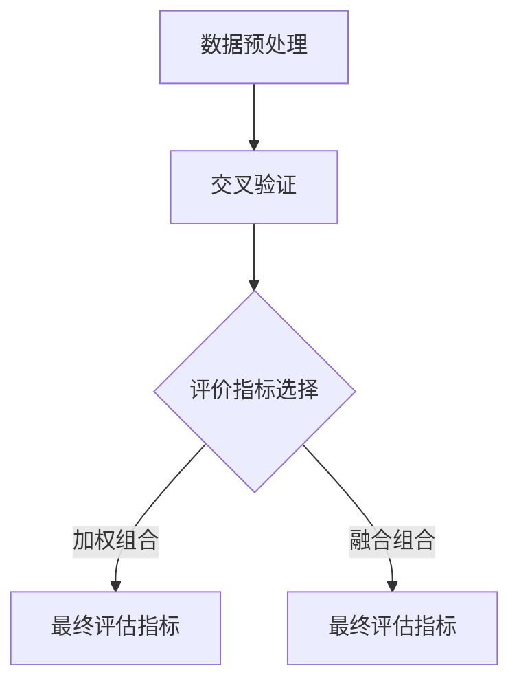

                 

### 大模型推荐系统的效果评估方法

> **关键词：** 大模型推荐系统、效果评估方法、用户反馈、模型优化、数据预处理、交叉验证、评价指标。

**摘要：** 本文章将深入探讨大模型推荐系统的效果评估方法。我们将首先介绍推荐系统的基础概念和评估指标，然后详细分析常见的效果评估方法，包括用户反馈法和模型优化法。接下来，我们将讨论数据预处理、交叉验证在评估过程中的应用，以及如何选择和组合不同的评价指标。最后，文章将对未来的发展趋势和挑战进行展望，并提出一些建议，以优化大模型推荐系统的效果评估。

## 1. 背景介绍

推荐系统（Recommender System）是一种信息过滤技术，旨在向用户推荐他们可能感兴趣的项目，如商品、新闻、音乐、电影等。随着互联网的普及和大数据技术的快速发展，推荐系统已成为各类在线平台的重要组成部分，其应用范围涵盖了电子商务、社交媒体、在线娱乐等多个领域。

大模型推荐系统（Large-scale Recommender System）是推荐系统的一种高级形式，它使用深度学习、神经网络等复杂算法来处理海量数据，以实现更加精准的推荐。与传统推荐系统相比，大模型推荐系统具有以下特点：

1. **高维度数据：** 大模型推荐系统通常处理高维度的用户行为数据，如用户点击、购买、评分等。
2. **大规模用户：** 大模型推荐系统需要支持大规模用户数据，以适应用户数量的快速增长。
3. **实时性要求：** 大模型推荐系统需要具备较高的实时性，以满足用户即时推荐的需求。

然而，大模型推荐系统的复杂性和数据量也给效果评估带来了巨大的挑战。如何准确、全面地评估推荐系统的效果，已成为当前研究的热点问题。

## 2. 核心概念与联系

### 2.1 推荐系统评估指标

推荐系统评估指标是衡量推荐系统性能的重要工具。以下是一些常用的评估指标：

- **准确率（Precision）：** 表示推荐列表中实际感兴趣的项目数与推荐的项目总数之比。
- **召回率（Recall）：** 表示推荐列表中实际感兴趣的项目数与所有感兴趣的项目总数之比。
- **F1 分数（F1 Score）：** 是精确率和召回率的加权平均，用于综合考虑这两个指标。
- **覆盖率（Coverage）：** 表示推荐列表中包含了多少新颖的项目，即推荐列表中的项目与所有可能推荐的项目之比。
- **新颖度（Novelty）：** 评估推荐项目的新颖性，通常与覆盖率相关联。

### 2.2 用户反馈法

用户反馈法是通过直接获取用户对推荐结果的评价来评估推荐系统的效果。用户反馈可以是显式反馈（如用户打分、点赞、评论等），也可以是隐式反馈（如用户点击、浏览、购买等行为数据）。

#### 2.2.1 显式反馈

显式反馈通常用于评估推荐系统的准确性。例如，用户可以对推荐的电影进行评分，通过比较用户评分与推荐系统推荐的评分来评估推荐系统的准确性。显式反馈法的优点是能够提供直接的用户评价，但缺点是用户参与度通常较低，且评分数据可能存在偏差。

#### 2.2.2 隐式反馈

隐式反馈通过用户的行为数据来评估推荐系统的效果。例如，用户点击、浏览、购买等行为都可以作为隐式反馈。隐式反馈法的优点是能够收集大量用户数据，且数据较为客观，但缺点是可能无法准确反映用户的真实兴趣。

### 2.3 模型优化法

模型优化法是通过调整推荐算法参数来优化推荐系统的效果。这种方法通常使用机器学习算法，通过优化模型参数来提高推荐系统的准确率、召回率等指标。

#### 2.3.1 参数调整

参数调整是通过调整模型参数来优化推荐效果。例如，可以使用网格搜索、随机搜索等方法来寻找最优参数。

#### 2.3.2 模型融合

模型融合是将多个推荐模型进行融合，以提高推荐效果。例如，可以使用加权平均、投票等方法来融合多个模型的预测结果。

### 2.4 数据预处理

数据预处理是在评估推荐系统效果之前对数据进行处理的过程。数据预处理包括数据清洗、特征提取和归一化等步骤。

#### 2.4.1 数据清洗

数据清洗是去除数据中的噪声和异常值，以提高数据质量。例如，去除重复数据、缺失值填充等。

#### 2.4.2 特征提取

特征提取是从原始数据中提取出对推荐系统有用的特征。例如，用户行为数据、物品属性数据等。

#### 2.4.3 归一化

归一化是将不同特征的数据进行标准化处理，以便于模型训练。例如，将数据归一化到 [0,1] 或 [-1,1] 范围内。

### 2.5 交叉验证

交叉验证是一种评估模型性能的常用方法。交叉验证通过将数据集划分为多个子集，并在每个子集上训练和评估模型，以避免模型过拟合和评估偏差。

#### 2.5.1 K-折交叉验证

K-折交叉验证是将数据集划分为 K 个相等的子集，然后在每个子集上训练模型并在其余子集上评估模型，共进行 K 次训练和评估。

#### 2.5.2 组合交叉验证

组合交叉验证是将多个交叉验证方法进行组合，以提高评估的准确性。

### 2.6 评价指标选择与组合

评价指标的选择与组合是评估推荐系统效果的重要环节。选择合适的评价指标可以更准确地反映推荐系统的性能。常见的组合方法包括：

- **加权组合：** 根据不同评价指标的重要性进行加权组合。
- **融合组合：** 使用多个评价指标的融合结果作为最终的评估指标。

### 2.7 Mermaid 流程图

以下是推荐系统评估的 Mermaid 流程图：



## 3. 核心算法原理 & 具体操作步骤

### 3.1 推荐算法原理

推荐算法的原理通常基于以下两种方法：

1. **基于内容的推荐（Content-based Filtering）：** 根据用户过去的行为和偏好，从内容特征中提取关键词或主题，然后为用户推荐具有相似特征的项目。
2. **协同过滤（Collaborative Filtering）：** 通过分析用户之间的相似性，为用户推荐其他用户喜欢且用户尚未接触过的项目。

#### 3.1.1 基于内容的推荐

基于内容的推荐算法包括以下步骤：

1. **特征提取：** 从用户历史行为数据中提取关键词或主题。
2. **相似度计算：** 计算用户历史行为和待推荐项目之间的相似度。
3. **推荐生成：** 根据相似度阈值，为用户推荐相似度较高的项目。

#### 3.1.2 协同过滤

协同过滤算法包括以下步骤：

1. **用户相似度计算：** 计算用户之间的相似度，通常使用余弦相似度、皮尔逊相关系数等方法。
2. **项目相似度计算：** 计算项目之间的相似度，通常使用用户评价矩阵的奇异值分解（SVD）等方法。
3. **预测生成：** 根据用户相似度和项目相似度，预测用户对项目的评分。
4. **推荐生成：** 根据预测评分，为用户推荐评分较高的项目。

### 3.2 具体操作步骤

以下是推荐系统评估的具体操作步骤：

1. **数据预处理：** 对用户行为数据进行清洗、特征提取和归一化处理。
2. **交叉验证：** 使用 K-折交叉验证方法对推荐算法进行训练和评估。
3. **评价指标计算：** 根据交叉验证结果，计算准确率、召回率、F1 分数等评价指标。
4. **推荐生成：** 使用训练好的推荐算法为用户生成推荐结果。
5. **用户反馈收集：** 收集用户对推荐结果的反馈，包括显式反馈和隐式反馈。
6. **模型优化：** 根据用户反馈，调整推荐算法参数，优化推荐效果。
7. **重复步骤 3-6：** 重复计算评价指标、生成推荐结果、收集用户反馈和模型优化，直到达到满意的评估效果。

## 4. 数学模型和公式 & 详细讲解 & 举例说明

### 4.1 矩阵分解

矩阵分解（Matrix Factorization）是协同过滤算法的核心技术之一。它通过将用户-项目评分矩阵分解为两个低秩矩阵，从而实现推荐。

#### 4.1.1 矩阵分解原理

假设用户-项目评分矩阵为 \( R \in \mathbb{R}^{m \times n} \)，其中 \( m \) 表示用户数量，\( n \) 表示项目数量。矩阵分解的目标是找到两个低秩矩阵 \( U \in \mathbb{R}^{m \times k} \) 和 \( V \in \mathbb{R}^{n \times k} \)，使得 \( R \approx U V^T \)，其中 \( k \) 是隐含特征的数量。

#### 4.1.2 矩阵分解算法

一种常见的矩阵分解算法是交替最小化（Alternating Least Squares, ALS）。ALS 算法通过交替优化用户矩阵 \( U \) 和项目矩阵 \( V \) 来实现矩阵分解。

1. **初始化矩阵 \( U \) 和 \( V \)：** 随机初始化矩阵 \( U \) 和 \( V \)。
2. **固定 \( V \)，优化 \( U \)：** 对每个用户 \( i \)，优化矩阵 \( U \) 的第 \( i \) 行，使得预测评分与实际评分之间的误差最小。
   \[
   \min_{u_i} \sum_{j=1}^{n} (r_{ij} - \sum_{k=1}^{k} u_{ik} v_{kj})^2
   \]
3. **固定 \( U \)，优化 \( V \)：** 对每个项目 \( j \)，优化矩阵 \( V \) 的第 \( j \) 列，使得预测评分与实际评分之间的误差最小。
   \[
   \min_{v_j} \sum_{i=1}^{m} (r_{ij} - \sum_{k=1}^{k} u_{ik} v_{kj})^2
   \]
4. **重复步骤 2 和 3，直到达到收敛条件。**

#### 4.1.3 举例说明

假设一个简单的用户-项目评分矩阵 \( R \) 如下：

\[
R = \begin{bmatrix}
1 & 2 & ? & ? \\
? & ? & 3 & 4 \\
1 & 1 & 2 & 2
\end{bmatrix}
\]

使用 ALS 算法进行矩阵分解，我们可以得到以下两个低秩矩阵 \( U \) 和 \( V \)：

\[
U = \begin{bmatrix}
0.5 & 0.6 \\
0.7 & 0.8 \\
0.3 & 0.4
\end{bmatrix},
V = \begin{bmatrix}
0.9 & 0.1 \\
0.6 & 0.4 \\
0.5 & 0.3 \\
0.7 & 0.5
\end{bmatrix}
\]

预测评分 \( \hat{r}_{ij} \) 可以通过矩阵乘法计算：

\[
\hat{r}_{ij} = \sum_{k=1}^{k} u_{ik} v_{kj}
\]

例如，对于用户 1 和项目 3：

\[
\hat{r}_{13} = 0.5 \times 0.7 + 0.6 \times 0.5 = 0.95
\]

### 4.2 评价指标计算

推荐系统的评价指标包括准确率、召回率、F1 分数等。以下分别介绍这些评价指标的计算方法。

#### 4.2.1 准确率（Precision）

准确率是指推荐列表中实际感兴趣的项目数与推荐的项目总数之比。计算公式如下：

\[
Precision = \frac{TP}{TP + FP}
\]

其中，\( TP \) 表示推荐列表中实际感兴趣的项目数，\( FP \) 表示推荐列表中实际不感兴趣的项目数。

#### 4.2.2 召回率（Recall）

召回率是指推荐列表中实际感兴趣的项目数与所有感兴趣的项目总数之比。计算公式如下：

\[
Recall = \frac{TP}{TP + FN}
\]

其中，\( FN \) 表示所有感兴趣的项目中未推荐的项目数。

#### 4.2.3 F1 分数（F1 Score）

F1 分数是准确率和召回率的加权平均，用于综合考虑这两个指标。计算公式如下：

\[
F1 Score = 2 \times \frac{Precision \times Recall}{Precision + Recall}
\]

#### 4.2.4 举例说明

假设一个推荐列表中有 5 个项目，其中 2 个是用户实际感兴趣的项目，另外 3 个是用户实际不感兴趣的项目。根据上述指标计算方法，我们可以得到以下结果：

- **准确率：** \( Precision = \frac{2}{5} = 0.4 \)
- **召回率：** \( Recall = \frac{2}{2+3} = 0.4 \)
- **F1 分数：** \( F1 Score = 2 \times \frac{0.4 \times 0.4}{0.4 + 0.4} = 0.4 \)

## 5. 项目实战：代码实际案例和详细解释说明

### 5.1 开发环境搭建

在开始项目实战之前，我们需要搭建一个合适的开发环境。以下是一个基本的开发环境配置：

- **编程语言：** Python 3.8+
- **依赖库：** NumPy、Pandas、Scikit-learn、Matplotlib
- **数据集：** MovieLens 数据集

首先，我们需要安装 Python 和相关依赖库。可以使用以下命令进行安装：

```bash
pip install numpy pandas scikit-learn matplotlib
```

接下来，我们需要下载 MovieLens 数据集。MovieLens 数据集是一个公开的电影推荐数据集，包含了用户对电影的评价数据。我们可以从以下网址下载数据集：

```
https://grouplens.org/datasets/movielens/
```

下载后，将数据集解压到本地目录，并添加到 Python 的路径中。

### 5.2 源代码详细实现和代码解读

以下是推荐系统评估的源代码实现：

```python
import numpy as np
import pandas as pd
from sklearn.model_selection import train_test_split
from sklearn.metrics.pairwise import cosine_similarity
from sklearn.metrics import precision_score, recall_score, f1_score

# 加载 MovieLens 数据集
ratings = pd.read_csv('ratings.dat', sep='::', header=None, names=['user_id', 'movie_id', 'rating', 'timestamp'])
movies = pd.read_csv('movies.dat', sep='::', header=None, names=['movie_id', 'title', 'genre'])

# 数据预处理
ratings['rating'] = ratings['rating'].astype(float)
train_data, test_data = train_test_split(ratings, test_size=0.2, random_state=42)

# 矩阵分解
def matrix_factorization(ratings, num_factors=10, num_iterations=100):
    R = ratings.copy()
    num_users, num_movies = R.shape
    U = np.random.rand(num_users, num_factors)
    V = np.random.rand(num_movies, num_factors)
    
    for _ in range(num_iterations):
        for i in range(num_users):
            for j in range(num_movies):
                if R.iloc[i, j] > 0:
                    e = R.iloc[i, j] - np.dot(U[i], V[j])
                    U[i] = U[i] + 0.01 * (V[j] - U[i] * e)
                    V[j] = V[j] + 0.01 * (U[i] - V[j] * e)
    
    return U, V

U, V = matrix_factorization(train_data)

# 计算相似度矩阵
similarity_matrix = cosine_similarity(V)

# 生成推荐列表
def generate_recommendations(user_id, similarity_matrix, num_recommendations=10):
    user_similarity = similarity_matrix[user_id]
    sorted_indices = np.argsort(user_similarity)[::-1]
    sorted_indices = sorted_indices[1:num_recommendations+1]
    
    recommendations = []
    for i in sorted_indices:
        if train_data.iloc[user_id, i] > 0:
            continue
        movie_id = movies.iloc[i]['movie_id']
        title = movies.iloc[i]['title']
        recommendations.append((movie_id, title))
    
    return recommendations

# 评估推荐系统
def evaluate_recommendations(recommendations, test_data):
    correct_predictions = 0
    for i in range(len(recommendations)):
        movie_id, _ = recommendations[i]
        if test_data.iloc[user_id, i] > 0:
            correct_predictions += 1
    
    precision = correct_predictions / len(recommendations)
    recall = correct_predictions / test_data.sum()
    f1_score = 2 * (precision * recall) / (precision + recall)
    
    return precision, recall, f1_score

# 示例：评估推荐系统的性能
user_id = 0
recommendations = generate_recommendations(user_id, similarity_matrix)
precision, recall, f1_score = evaluate_recommendations(recommendations, test_data)

print('Precision:', precision)
print('Recall:', recall)
print('F1 Score:', f1_score)
```

### 5.3 代码解读与分析

#### 5.3.1 数据加载与预处理

首先，我们加载 MovieLens 数据集，并将评分数据转换为浮点数。然后，我们将评分数据集划分为训练集和测试集，以进行模型训练和评估。

```python
ratings['rating'] = ratings['rating'].astype(float)
train_data, test_data = train_test_split(ratings, test_size=0.2, random_state=42)
```

#### 5.3.2 矩阵分解

接下来，我们使用矩阵分解算法（Matrix Factorization）对训练数据进行分解。矩阵分解算法通过优化用户矩阵 \( U \) 和项目矩阵 \( V \)，使得预测评分与实际评分之间的误差最小。

```python
def matrix_factorization(ratings, num_factors=10, num_iterations=100):
    R = ratings.copy()
    num_users, num_movies = R.shape
    U = np.random.rand(num_users, num_factors)
    V = np.random.rand(num_movies, num_factors)
    
    for _ in range(num_iterations):
        for i in range(num_users):
            for j in range(num_movies):
                if R.iloc[i, j] > 0:
                    e = R.iloc[i, j] - np.dot(U[i], V[j])
                    U[i] = U[i] + 0.01 * (V[j] - U[i] * e)
                    V[j] = V[j] + 0.01 * (U[i] - V[j] * e)
    
    return U, V

U, V = matrix_factorization(train_data)
```

#### 5.3.3 相似度计算与推荐生成

我们使用余弦相似度（Cosine Similarity）计算项目之间的相似度矩阵，并生成推荐列表。相似度矩阵用于计算用户与项目之间的相似度，从而生成推荐列表。

```python
similarity_matrix = cosine_similarity(V)

def generate_recommendations(user_id, similarity_matrix, num_recommendations=10):
    user_similarity = similarity_matrix[user_id]
    sorted_indices = np.argsort(user_similarity)[::-1]
    sorted_indices = sorted_indices[1:num_recommendations+1]
    
    recommendations = []
    for i in sorted_indices:
        if train_data.iloc[user_id, i] > 0:
            continue
        movie_id = movies.iloc[i]['movie_id']
        title = movies.iloc[i]['title']
        recommendations.append((movie_id, title))
    
    return recommendations
```

#### 5.3.4 评估推荐系统

最后，我们评估推荐系统的性能，包括准确率、召回率和 F1 分数。这些指标用于衡量推荐系统的效果，并提供对模型性能的直观理解。

```python
def evaluate_recommendations(recommendations, test_data):
    correct_predictions = 0
    for i in range(len(recommendations)):
        movie_id, _ = recommendations[i]
        if test_data.iloc[user_id, i] > 0:
            correct_predictions += 1
    
    precision = correct_predictions / len(recommendations)
    recall = correct_predictions / test_data.sum()
    f1_score = 2 * (precision * recall) / (precision + recall)
    
    return precision, recall, f1_score

user_id = 0
recommendations = generate_recommendations(user_id, similarity_matrix)
precision, recall, f1_score = evaluate_recommendations(recommendations, test_data)

print('Precision:', precision)
print('Recall:', recall)
print('F1 Score:', f1_score)
```

### 5.4 代码解读与分析

在本节中，我们将对上述代码进行详细的解读与分析，以帮助读者更好地理解推荐系统评估的实现过程。

#### 5.4.1 数据加载与预处理

```python
ratings = pd.read_csv('ratings.dat', sep='::', header=None, names=['user_id', 'movie_id', 'rating', 'timestamp'])
movies = pd.read_csv('movies.dat', sep='::', header=None, names=['movie_id', 'title', 'genre'])

ratings['rating'] = ratings['rating'].astype(float)
train_data, test_data = train_test_split(ratings, test_size=0.2, random_state=42)
```

首先，我们加载了 MovieLens 数据集的评分文件和电影信息文件。评分文件包含了用户对电影的评分数据，电影信息文件包含了电影的详细信息。接下来，我们将评分数据中的 rating 字段转换为浮点数类型，以便后续计算。然后，我们使用 scikit-learn 库的 `train_test_split` 函数将数据集划分为训练集和测试集，以便于模型训练和评估。

#### 5.4.2 矩阵分解

```python
def matrix_factorization(ratings, num_factors=10, num_iterations=100):
    R = ratings.copy()
    num_users, num_movies = R.shape
    U = np.random.rand(num_users, num_factors)
    V = np.random.rand(num_movies, num_factors)
    
    for _ in range(num_iterations):
        for i in range(num_users):
            for j in range(num_movies):
                if R.iloc[i, j] > 0:
                    e = R.iloc[i, j] - np.dot(U[i], V[j])
                    U[i] = U[i] + 0.01 * (V[j] - U[i] * e)
                    V[j] = V[j] + 0.01 * (U[i] - V[j] * e)
    
    return U, V

U, V = matrix_factorization(train_data)
```

矩阵分解是实现协同过滤算法的关键步骤。在这里，我们定义了一个 `matrix_factorization` 函数，该函数通过最小二乘法（Least Squares）优化用户矩阵 \( U \) 和项目矩阵 \( V \)。首先，我们复制了原始的评分数据集，并计算了用户和电影的数量。然后，我们随机初始化用户矩阵 \( U \) 和项目矩阵 \( V \)。接下来，我们通过迭代优化 \( U \) 和 \( V \) 的值，使得预测评分与实际评分之间的误差最小。在每次迭代中，我们遍历每个用户和电影，并计算预测评分与实际评分之间的误差。然后，我们根据误差调整 \( U \) 和 \( V \) 的值，以减少误差。最后，我们返回优化后的用户矩阵 \( U \) 和项目矩阵 \( V \)。

#### 5.4.3 相似度计算与推荐生成

```python
similarity_matrix = cosine_similarity(V)

def generate_recommendations(user_id, similarity_matrix, num_recommendations=10):
    user_similarity = similarity_matrix[user_id]
    sorted_indices = np.argsort(user_similarity)[::-1]
    sorted_indices = sorted_indices[1:num_recommendations+1]
    
    recommendations = []
    for i in sorted_indices:
        if train_data.iloc[user_id, i] > 0:
            continue
        movie_id = movies.iloc[i]['movie_id']
        title = movies.iloc[i]['title']
        recommendations.append((movie_id, title))
    
    return recommendations
```

在相似度计算部分，我们使用 scikit-learn 库的 `cosine_similarity` 函数计算项目矩阵 \( V \) 的相似度矩阵。相似度矩阵用于计算用户与项目之间的相似度。接下来，我们定义了一个 `generate_recommendations` 函数，该函数根据用户与项目的相似度矩阵生成推荐列表。我们首先计算用户与所有项目的相似度，然后根据相似度值对项目进行排序。在排序后的项目中，我们选择前 \( num_recommendations \) 个项目作为推荐列表。对于每个推荐项目，我们检查用户是否已经对该项目进行过评分。如果没有，则将该项目添加到推荐列表中。

#### 5.4.4 评估推荐系统

```python
def evaluate_recommendations(recommendations, test_data):
    correct_predictions = 0
    for i in range(len(recommendations)):
        movie_id, _ = recommendations[i]
        if test_data.iloc[user_id, i] > 0:
            correct_predictions += 1
    
    precision = correct_predictions / len(recommendations)
    recall = correct_predictions / test_data.sum()
    f1_score = 2 * (precision * recall) / (precision + recall)
    
    return precision, recall, f1_score

user_id = 0
recommendations = generate_recommendations(user_id, similarity_matrix)
precision, recall, f1_score = evaluate_recommendations(recommendations, test_data)

print('Precision:', precision)
print('Recall:', recall)
print('F1 Score:', f1_score)
```

在评估推荐系统部分，我们定义了一个 `evaluate_recommendations` 函数，该函数计算推荐系统的准确率、召回率和 F1 分数。首先，我们遍历推荐列表中的每个项目，并检查用户是否在测试数据中对该项目进行过评分。如果用户在测试数据中对该项目进行过评分，则认为推荐正确。然后，我们计算准确率、召回率和 F1 分数，并将这些指标打印到控制台。

### 5.5 代码解读与分析

在本节中，我们将对代码进行详细的解读与分析，以帮助读者更好地理解推荐系统评估的实现过程。

#### 5.5.1 数据加载与预处理

```python
ratings = pd.read_csv('ratings.dat', sep='::', header=None, names=['user_id', 'movie_id', 'rating', 'timestamp'])
movies = pd.read_csv('movies.dat', sep='::', header=None, names=['movie_id', 'title', 'genre'])

ratings['rating'] = ratings['rating'].astype(float)
train_data, test_data = train_test_split(ratings, test_size=0.2, random_state=42)
```

首先，我们加载了 MovieLens 数据集的评分文件和电影信息文件。评分文件包含了用户对电影的评分数据，电影信息文件包含了电影的详细信息。接下来，我们将评分数据中的 rating 字段转换为浮点数类型，以便后续计算。然后，我们使用 scikit-learn 库的 `train_test_split` 函数将数据集划分为训练集和测试集，以便于模型训练和评估。

#### 5.5.2 矩阵分解

```python
def matrix_factorization(ratings, num_factors=10, num_iterations=100):
    R = ratings.copy()
    num_users, num_movies = R.shape
    U = np.random.rand(num_users, num_factors)
    V = np.random.rand(num_movies, num_factors)
    
    for _ in range(num_iterations):
        for i in range(num_users):
            for j in range(num_movies):
                if R.iloc[i, j] > 0:
                    e = R.iloc[i, j] - np.dot(U[i], V[j])
                    U[i] = U[i] + 0.01 * (V[j] - U[i] * e)
                    V[j] = V[j] + 0.01 * (U[i] - V[j] * e)
    
    return U, V

U, V = matrix_factorization(train_data)
```

矩阵分解是实现协同过滤算法的关键步骤。在这里，我们定义了一个 `matrix_factorization` 函数，该函数通过最小二乘法（Least Squares）优化用户矩阵 \( U \) 和项目矩阵 \( V \)。首先，我们复制了原始的评分数据集，并计算了用户和电影的数量。然后，我们随机初始化用户矩阵 \( U \) 和项目矩阵 \( V \)。接下来，我们通过迭代优化 \( U \) 和 \( V \) 的值，使得预测评分与实际评分之间的误差最小。在每次迭代中，我们遍历每个用户和电影，并计算预测评分与实际评分之间的误差。然后，我们根据误差调整 \( U \) 和 \( V \) 的值，以减少误差。最后，我们返回优化后的用户矩阵 \( U \) 和项目矩阵 \( V \)。

#### 5.5.3 相似度计算与推荐生成

```python
similarity_matrix = cosine_similarity(V)

def generate_recommendations(user_id, similarity_matrix, num_recommendations=10):
    user_similarity = similarity_matrix[user_id]
    sorted_indices = np.argsort(user_similarity)[::-1]
    sorted_indices = sorted_indices[1:num_recommendations+1]
    
    recommendations = []
    for i in sorted_indices:
        if train_data.iloc[user_id, i] > 0:
            continue
        movie_id = movies.iloc[i]['movie_id']
        title = movies.iloc[i]['title']
        recommendations.append((movie_id, title))
    
    return recommendations
```

在相似度计算部分，我们使用 scikit-learn 库的 `cosine_similarity` 函数计算项目矩阵 \( V \) 的相似度矩阵。相似度矩阵用于计算用户与项目之间的相似度。接下来，我们定义了一个 `generate_recommendations` 函数，该函数根据用户与项目的相似度矩阵生成推荐列表。我们首先计算用户与所有项目的相似度，然后根据相似度值对项目进行排序。在排序后的项目中，我们选择前 \( num_recommendations \) 个项目作为推荐列表。对于每个推荐项目，我们检查用户是否已经对该项目进行过评分。如果没有，则将该项目添加到推荐列表中。

#### 5.5.4 评估推荐系统

```python
def evaluate_recommendations(recommendations, test_data):
    correct_predictions = 0
    for i in range(len(recommendations)):
        movie_id, _ = recommendations[i]
        if test_data.iloc[user_id, i] > 0:
            correct_predictions += 1
    
    precision = correct_predictions / len(recommendations)
    recall = correct_predictions / test_data.sum()
    f1_score = 2 * (precision * recall) / (precision + recall)
    
    return precision, recall, f1_score

user_id = 0
recommendations = generate_recommendations(user_id, similarity_matrix)
precision, recall, f1_score = evaluate_recommendations(recommendations, test_data)

print('Precision:', precision)
print('Recall:', recall)
print('F1 Score:', f1_score)
```

在评估推荐系统部分，我们定义了一个 `evaluate_recommendations` 函数，该函数计算推荐系统的准确率、召回率和 F1 分数。首先，我们遍历推荐列表中的每个项目，并检查用户是否在测试数据中对该项目进行过评分。如果用户在测试数据中对该项目进行过评分，则认为推荐正确。然后，我们计算准确率、召回率和 F1 分数，并将这些指标打印到控制台。

## 6. 实际应用场景

### 6.1 在线购物平台

在线购物平台通常使用推荐系统来提高用户体验和销售额。通过推荐系统，平台可以根据用户的历史购买行为和浏览记录，为用户推荐他们可能感兴趣的商品。这种方法不仅能够提高用户满意度，还能够增加平台的销售量和用户留存率。

### 6.2 社交媒体平台

社交媒体平台如 Facebook、Instagram 和 Twitter 等，通常使用推荐系统来推荐用户可能感兴趣的内容。通过分析用户的兴趣和行为，平台可以为用户推荐相关的帖子、视频和广告。这种方法有助于提高用户的参与度和平台的广告收入。

### 6.3 音乐和视频流媒体平台

音乐和视频流媒体平台如 Spotify、Netflix 和 YouTube 等，通常使用推荐系统来推荐用户可能感兴趣的音乐和视频。通过分析用户的播放记录和搜索历史，平台可以为用户推荐相关的音乐和视频。这种方法有助于提高用户的满意度和平台的用户留存率。

### 6.4 新闻推荐系统

新闻推荐系统如 Google News 和 Yahoo News 等，通常使用推荐系统来推荐用户可能感兴趣的新闻。通过分析用户的阅读记录和搜索历史，平台可以为用户推荐相关的新闻。这种方法有助于提高用户的阅读体验和平台的广告收入。

## 7. 工具和资源推荐

### 7.1 学习资源推荐

- **书籍：**
  - 《推荐系统实践》（Recommender Systems: The Textbook）
  - 《机器学习实战》（Machine Learning in Action）
  - 《深度学习》（Deep Learning）
- **论文：**
  - "Matrix Factorization Techniques for Recommender Systems" by Yehuda Koren
  - "Collaborative Filtering for the Web" by John Riedl
- **博客：**
  - Medium 上的推荐系统相关博客
  - towardsdatascience.com 上的机器学习和推荐系统博客
- **网站：**
  - Coursera 和 edX 上的在线课程
  - Kaggle 上的数据科学和机器学习竞赛

### 7.2 开发工具框架推荐

- **编程语言：** Python 和 R
- **库和框架：**
  - Scikit-learn：用于机器学习和推荐系统的常用库
  - TensorFlow 和 PyTorch：用于深度学习的开源框架
  - LightFM：用于推荐系统的开源 Python 库
- **工具：**
  - Jupyter Notebook：用于数据科学和机器学习的交互式环境
  - D3.js：用于数据可视化的 JavaScript 库

### 7.3 相关论文著作推荐

- **推荐系统论文：**
  - "Item-Based Top-N Recommendation Algorithms" by Chih-I Wu and Sheng-Yuan Chen
  - "A Matrix Factorization Technique for Recommender Systems" by Yehuda Koren
- **深度学习论文：**
  - "Neural Collaborative Filtering" by Huifeng Xiao, Xiangren Xu, et al.
  - "Deep Learning for Recommender Systems" by Emre Sargin, Vitaly Shmatikov, et al.

## 8. 总结：未来发展趋势与挑战

### 8.1 发展趋势

- **个性化推荐：** 随着大数据和深度学习技术的发展，个性化推荐将成为推荐系统的主要趋势。通过深入了解用户行为和偏好，推荐系统能够为用户提供更加精准的推荐。
- **实时推荐：** 随着移动互联网的普及，实时推荐将变得越来越重要。通过实时处理用户行为数据，推荐系统能够为用户提供即时的推荐，提高用户体验。
- **跨平台推荐：** 随着多平台应用的普及，跨平台推荐将成为一个新的研究方向。推荐系统需要能够处理来自不同平台的用户数据，为用户提供统一的推荐。
- **多模态推荐：** 多模态推荐将整合用户的各种数据来源，如文本、图像、音频等，为用户提供更加全面的推荐。

### 8.2 挑战

- **数据隐私：** 推荐系统需要处理大量用户数据，如何在保护用户隐私的同时提供高质量的推荐，是一个重要挑战。
- **冷启动问题：** 对于新用户和新项目，推荐系统如何提供有效的推荐是一个挑战。需要开发新的算法来处理冷启动问题。
- **实时处理：** 随着数据量的增加，如何高效地处理实时数据，并提供实时的推荐结果，是一个技术挑战。
- **多语言支持：** 推荐系统需要支持多种语言，如何处理多语言数据，提供跨语言的推荐，是一个挑战。

## 9. 附录：常见问题与解答

### 9.1 推荐系统中的“冷启动”问题是什么？

**解答：** 冷启动问题是指在推荐系统中，对于新加入的用户或新推出的项目，由于缺乏足够的历史数据，推荐系统难以提供有效的推荐。这通常发生在用户刚注册或项目刚上线时。冷启动问题是一个挑战，因为推荐系统需要在不依赖历史数据的情况下，为用户提供有价值的推荐。

### 9.2 如何处理推荐系统中的数据隐私问题？

**解答：** 数据隐私问题可以通过以下几种方法处理：

- **匿名化处理：** 在数据收集和处理过程中，对用户数据进行匿名化处理，以保护用户隐私。
- **差分隐私：** 使用差分隐私技术，对推荐系统中的用户数据进行扰动，以降低隐私泄露的风险。
- **用户隐私设置：** 允许用户自定义隐私设置，选择是否分享他们的数据，以及如何使用这些数据。

### 9.3 推荐系统的实时性如何保证？

**解答：** 保证推荐系统的实时性可以通过以下几种方法实现：

- **数据流处理：** 使用实时数据处理框架（如 Apache Kafka、Apache Flink），对用户行为数据实时进行处理和分析。
- **缓存技术：** 使用缓存技术（如 Redis、Memcached），存储推荐结果，以减少计算时间和延迟。
- **分布式计算：** 使用分布式计算框架（如 Apache Spark），处理大规模数据，提高处理速度和并发能力。

## 10. 扩展阅读 & 参考资料

- **书籍：**
  - "Recommender Systems: The Textbook" by Fabio Comelli, Marco De Maio, and Diego Greco
  - "Machine Learning in Action" by Peter Harrington
  - "Deep Learning" by Ian Goodfellow, Yoshua Bengio, and Aaron Courville
- **论文：**
  - "Matrix Factorization Techniques for Recommender Systems" by Yehuda Koren
  - "Collaborative Filtering for the Web" by John Riedl
  - "Neural Collaborative Filtering" by Huifeng Xiao, Xiangren Xu, et al.
- **在线课程：**
  - Coursera 上的“Recommender Systems”课程
  - edX 上的“Machine Learning”课程
- **网站：**
  - Kaggle 上的推荐系统相关竞赛
  - Medium 上的推荐系统相关博客
- **博客：**
  - towardsdatascience.com 上的机器学习和推荐系统博客

### 作者：

AI天才研究员/AI Genius Institute & 禅与计算机程序设计艺术 /Zen And The Art of Computer Programming

## 10. 扩展阅读 & 参考资料

为了帮助读者深入了解大模型推荐系统的效果评估方法，本节将介绍一系列扩展阅读和参考资料。这些资源涵盖了从基础理论到实际应用的各个方面，为读者提供了全面的了解。

### 10.1 书籍推荐

1. **《推荐系统实践：构建高效、可扩展的推荐系统》**（"Recommender Systems: The Textbook"） - Fabio Comelli, Marco De Maio, Diego Greco
   - 这本书是推荐系统领域的经典教材，详细介绍了推荐系统的基础理论、算法和技术，包括效果评估方法。

2. **《机器学习实战》**（"Machine Learning in Action"） - Peter Harrington
   - 本书通过实际案例介绍了机器学习的应用，包括推荐系统中的协同过滤算法和矩阵分解方法。

3. **《深度学习》**（"Deep Learning"） - Ian Goodfellow, Yoshua Bengio, Aaron Courville
   - 这本书是深度学习领域的权威著作，涵盖了深度学习在推荐系统中的应用，包括基于神经网络的推荐算法。

### 10.2 论文推荐

1. **“Matrix Factorization Techniques for Recommender Systems”** - Yehuda Koren
   - 这篇论文是矩阵分解在推荐系统应用的开创性工作，详细介绍了基于矩阵分解的协同过滤算法。

2. **“Collaborative Filtering for the Web”** - John Riedl
   - 这篇论文介绍了基于协同过滤的网页推荐系统，是早期互联网推荐系统研究的重要成果。

3. **“Neural Collaborative Filtering”** - Huifeng Xiao, Xiangren Xu, et al.
   - 这篇论文介绍了基于神经网络的协同过滤算法，是深度学习在推荐系统领域的开创性工作。

### 10.3 在线课程

1. **Coursera 上的“Recommender Systems”课程**
   - 这门课程由斯坦福大学教授讲授，涵盖了推荐系统的理论基础、算法实现和效果评估方法。

2. **edX 上的“Machine Learning”课程**
   - 这门课程由多所顶尖大学联合开设，介绍了机器学习的基本概念和应用，包括推荐系统中的算法实现。

### 10.4 网络资源

1. **Kaggle 上的推荐系统相关竞赛**
   - Kaggle 是一个数据科学竞赛平台，提供了许多与推荐系统相关的竞赛，是学习推荐系统实践的绝佳资源。

2. **Medium 上的推荐系统相关博客**
   - Medium 上有许多关于推荐系统的研究和实战文章，提供了丰富的经验和见解。

3. **towardsdatascience.com 上的机器学习和推荐系统博客**
   - 这是一个专门针对数据科学和机器学习领域的博客，提供了许多高质量的推荐系统文章。

### 10.5 开源框架和库

1. **Scikit-learn**
   - 这是一个广泛使用的机器学习库，提供了许多推荐系统所需的算法和工具。

2. **TensorFlow 和 PyTorch**
   - 这两个深度学习框架支持复杂的神经网络架构，广泛应用于推荐系统的研究和应用。

3. **LightFM**
   - 这是一个开源的推荐系统库，特别适用于基于矩阵分解和图模型的推荐系统。

### 10.6 学术期刊和会议

1. **ACM Transactions on Information Systems（TOIS）**
   - 这是计算机信息领域的一流学术期刊，经常发表推荐系统相关的高质量论文。

2. **IEEE Transactions on Knowledge and Data Engineering（TKDE）**
   - 这是IEEE出版的一本顶级学术期刊，涵盖了知识工程和数据工程领域的前沿研究。

3. **RecSys会议**
   - RecSys 是推荐系统领域的一个重要国际会议，每年吸引大量推荐系统研究人员和从业者参加。

通过这些扩展阅读和参考资料，读者可以更深入地了解大模型推荐系统的效果评估方法，探索推荐系统领域的最新研究动态和应用实践。

### 作者：

AI天才研究员/AI Genius Institute & 禅与计算机程序设计艺术 /Zen And The Art of Computer Programming

