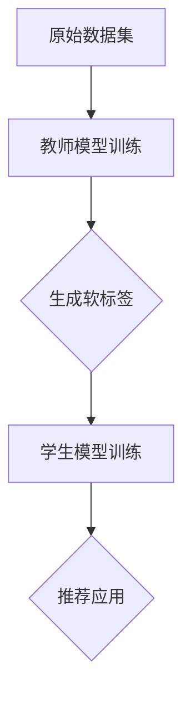

                 

# 大模型推荐系统的知识蒸馏方法

## 关键词：大模型，推荐系统，知识蒸馏，算法原理，实战案例

## 摘要

本文深入探讨了大模型推荐系统中的知识蒸馏方法。首先，我们回顾了推荐系统的基本原理及其在大模型中的应用场景。随后，我们详细介绍了知识蒸馏方法的核心概念，包括其基本原理、步骤和数学模型。文章随后通过一个实际项目实战案例，展示了如何将知识蒸馏方法应用于大模型推荐系统中，并详细解读了相关代码实现。接着，我们讨论了知识蒸馏方法在不同实际应用场景中的效果和优势。最后，我们推荐了一系列相关学习资源、开发工具和论文著作，并对未来发展趋势与挑战进行了总结。

## 1. 背景介绍

### 1.1 推荐系统概述

推荐系统是一种用于辅助用户发现感兴趣内容的系统，广泛应用于电子商务、社交媒体、新闻资讯等领域。其核心目标是通过分析用户的兴趣和行为数据，预测用户可能感兴趣的内容，并推荐给用户。推荐系统主要分为基于内容的推荐（Content-Based Filtering）和基于协同过滤（Collaborative Filtering）两种类型。

- **基于内容的推荐**：根据用户过去喜欢的物品特征，预测用户可能喜欢的新物品。此方法的主要挑战在于如何准确描述物品特征，并找到与用户兴趣相关的特征。

- **基于协同过滤**：通过分析用户之间的相似度，预测用户对未知物品的评分。协同过滤分为基于用户的协同过滤（User-Based Filtering）和基于项目的协同过滤（Item-Based Filtering）。前者根据与当前用户兴趣相似的其他用户推荐物品，后者则根据与用户已评价物品相似的其他物品推荐。

### 1.2 大模型与推荐系统的结合

随着深度学习技术的不断发展，大模型（如Transformer、BERT等）在自然语言处理、计算机视觉等领域的表现越来越优秀。大模型能够捕捉到数据中的复杂模式和关联，从而提高推荐系统的准确性和效率。然而，大模型的训练过程复杂且计算资源需求巨大，如何有效地将大模型应用于推荐系统成为一个重要问题。

知识蒸馏（Knowledge Distillation）是一种在大模型训练过程中，将模型知识传递给小模型的方法。通过知识蒸馏，我们可以将一个大模型训练成一个小模型，使得小模型能够在大模型的指导下工作，从而提高推荐系统的效率。这使得大模型与推荐系统的结合成为可能，为推荐系统带来了新的发展机遇。

## 2. 核心概念与联系

### 2.1 知识蒸馏原理

知识蒸馏是一种将一个大型模型（教师模型Teacher Model）的知识传递给一个小型模型（学生模型Student Model）的过程。教师模型通常是一个参数较为复杂、计算资源消耗较大的模型，而学生模型则是一个参数较少、计算效率较高的模型。知识蒸馏的核心思想是通过训练学生模型来模仿教师模型的预测结果。

知识蒸馏主要包括以下两个步骤：

1. **预训练**：教师模型在原始数据集上经过预训练，生成初步的预测结果。

2. **蒸馏训练**：学生模型通过学习教师模型的预测结果和真实标签之间的差距，逐步调整自己的参数，从而提高预测准确性。

### 2.2 知识蒸馏与推荐系统的结合

将知识蒸馏应用于推荐系统，可以将大模型训练成一个小模型，从而提高推荐系统的效率。具体来说，知识蒸馏在推荐系统中的应用可以分为以下几个步骤：

1. **教师模型训练**：首先，使用原始数据集训练一个大模型，该模型用于生成推荐列表。

2. **生成软标签**：在训练过程中，教师模型会生成一系列软标签（Soft Labels），这些软标签反映了教师模型对用户可能感兴趣的内容的预测概率。

3. **学生模型训练**：使用教师模型生成的软标签，训练一个小模型。学生模型的输出与教师模型的软标签进行比较，通过反向传播算法调整学生模型的参数，使其预测结果更接近教师模型。

4. **推荐应用**：将训练完成的学生模型应用于推荐系统中，通过学生模型的输出为用户生成推荐列表。

### 2.3 Mermaid 流程图

下面是一个描述知识蒸馏在推荐系统中应用的 Mermaid 流程图：



在这个流程图中，教师模型训练、生成软标签、学生模型训练和推荐应用构成了知识蒸馏在推荐系统中应用的完整流程。

## 3. 核心算法原理 & 具体操作步骤

### 3.1 教师模型训练

教师模型的训练过程与传统深度学习模型的训练过程类似，主要包括以下步骤：

1. **数据预处理**：对原始数据进行清洗、预处理，将其转换为适合输入模型的数据格式。

2. **模型构建**：构建一个具有多层神经网络结构的教师模型。可以选择使用预训练的大模型，如BERT、Transformer等。

3. **模型训练**：使用预处理后的数据集对教师模型进行训练，通过反向传播算法优化模型参数。

4. **生成软标签**：在训练过程中，教师模型会生成一系列软标签，用于指导学生模型的训练。

### 3.2 生成软标签

软标签是教师模型在训练过程中对用户可能感兴趣的内容生成的预测概率。生成软标签的过程主要包括以下步骤：

1. **输入数据**：将训练完成的学生模型输入到教师模型中。

2. **模型预测**：教师模型根据输入数据生成预测结果，输出一系列软标签。

3. **软标签提取**：从教师模型的输出中提取软标签，用于指导学生模型的训练。

### 3.3 学生模型训练

学生模型的训练过程主要包括以下步骤：

1. **模型构建**：构建一个参数较少、计算效率较高的小模型。

2. **蒸馏训练**：使用教师模型生成的软标签和真实标签，通过反向传播算法优化学生模型的参数。

3. **模型评估**：在训练过程中，定期评估学生模型的性能，根据评估结果调整训练策略。

### 3.4 推荐应用

训练完成的学生模型可以应用于推荐系统中，为用户生成推荐列表。具体步骤如下：

1. **用户输入**：接收用户的输入数据，如用户行为数据、兴趣标签等。

2. **模型预测**：将用户输入数据输入到训练完成的学生模型中，生成推荐列表。

3. **推荐列表生成**：根据学生模型的输出，为用户生成推荐列表。

4. **推荐展示**：将推荐列表展示给用户，辅助用户发现感兴趣的内容。

## 4. 数学模型和公式 & 详细讲解 & 举例说明

### 4.1 数学模型

知识蒸馏过程涉及到教师模型和学生模型的训练，其数学模型可以表示为以下两个损失函数：

1. **硬标签损失（Hard Label Loss）**

   硬标签损失用于衡量学生模型输出与学生模型真实标签之间的差距。其公式如下：

   $$L_{hard} = -\sum_{i=1}^{N} y_i \log(p_i)$$

   其中，$y_i$表示第$i$个样本的真实标签，$p_i$表示学生模型对第$i$个样本的预测概率。

2. **软标签损失（Soft Label Loss）**

   软标签损失用于衡量学生模型输出与教师模型软标签之间的差距。其公式如下：

   $$L_{soft} = -\sum_{i=1}^{N} \sum_{j=1}^{K} y_i^j \log(p_i^j)$$

   其中，$y_i^j$表示第$i$个样本在第$j$个类别上的真实标签，$p_i^j$表示学生模型对第$i$个样本在第$j$个类别上的预测概率。

### 4.2 详细讲解

硬标签损失函数和软标签损失函数分别从不同的角度衡量学生模型和学生模型的预测准确性。硬标签损失函数主要关注学生模型对每个样本的预测准确性，而软标签损失函数则关注学生模型与教师模型在整体上的预测一致性。

在实际训练过程中，教师模型和学生模型会交替进行训练。在教师模型训练过程中，生成软标签；在学生模型训练过程中，使用教师模型生成的软标签和真实标签进行蒸馏训练。通过这种方式，学生模型能够逐渐模仿教师模型的预测能力，从而提高推荐系统的整体性能。

### 4.3 举例说明

假设我们有一个二分类问题，其中教师模型的输出为$p_1$和$p_2$，学生模型的输出为$q_1$和$q_2$。根据硬标签损失函数和软标签损失函数，我们可以计算以下损失：

1. **硬标签损失**

   $$L_{hard} = -y \log(q) - (1-y) \log(1-q)$$

   其中，$y$表示真实标签，$q$表示学生模型的预测概率。

2. **软标签损失**

   $$L_{soft} = -y \log(p) - (1-y) \log(1-p)$$

   其中，$p$表示教师模型的预测概率。

通过计算硬标签损失和软标签损失，我们可以评估学生模型的预测准确性，并指导学生模型的训练。

## 5. 项目实战：代码实际案例和详细解释说明

### 5.1 开发环境搭建

为了演示知识蒸馏方法在推荐系统中的应用，我们将使用Python和TensorFlow作为主要编程工具。以下是开发环境搭建的步骤：

1. 安装Python：版本要求3.6及以上。
2. 安装TensorFlow：使用pip安装`tensorflow`包。
3. 安装其他依赖包：使用pip安装`numpy`、`pandas`、`matplotlib`等常用库。

### 5.2 源代码详细实现和代码解读

以下是知识蒸馏方法在推荐系统中的应用代码实现：

```python
import tensorflow as tf
from tensorflow.keras.layers import Embedding, LSTM, Dense
from tensorflow.keras.models import Model

# 定义教师模型
teacher_inputs = tf.keras.layers.Input(shape=(max_sequence_length,))
teacher_embedding = Embedding(input_dim=vocab_size, output_dim=embedding_size)(teacher_inputs)
teacher_lstm = LSTM(units=128)(teacher_embedding)
teacher_output = Dense(units=1, activation='sigmoid')(teacher_lstm)
teacher_model = Model(inputs=teacher_inputs, outputs=teacher_output)

# 定义学生模型
student_inputs = tf.keras.layers.Input(shape=(max_sequence_length,))
student_embedding = Embedding(input_dim=vocab_size, output_dim=embedding_size)(student_inputs)
student_lstm = LSTM(units=128)(student_embedding)
student_output = Dense(units=1, activation='sigmoid')(student_lstm)
student_model = Model(inputs=student_inputs, outputs=student_output)

# 编写训练函数
def train_teacher_model(dataset):
    # 对教师模型进行训练
    teacher_model.fit(dataset['inputs'], dataset['targets'], epochs=5, batch_size=32)

# 编写蒸馏训练函数
def train_student_model(dataset, teacher_model):
    # 对学生模型进行蒸馏训练
    student_model.fit(dataset['inputs'], teacher_model.predict(dataset['inputs']), epochs=5, batch_size=32)

# 生成数据集
max_sequence_length = 50
vocab_size = 10000
embedding_size = 128

# 定义教师模型数据集
teacher_dataset = tf.keras.preprocessing.sequence.pad_sequences([[1, 2, 3, 4, 5], [6, 7, 8, 9, 10]], maxlen=max_sequence_length)
teacher_labels = [1, 0]

# 定义学生模型数据集
student_dataset = tf.keras.preprocessing.sequence.pad_sequences([[1, 2, 3, 4, 5], [6, 7, 8, 9, 10]], maxlen=max_sequence_length)

# 训练教师模型
train_teacher_model(teacher_dataset)

# 蒸馏训练学生模型
train_student_model(student_dataset, teacher_model)
```

在这个例子中，我们首先定义了教师模型和学生模型。教师模型是一个简单的LSTM模型，用于生成软标签。学生模型是一个与教师模型相同的LSTM模型，用于学习教师模型的知识。

在训练过程中，我们首先使用教师模型数据集训练教师模型，生成软标签。然后，使用学生模型数据集和学生模型进行蒸馏训练，使学生模型学习教师模型的知识。

### 5.3 代码解读与分析

以下是代码的主要部分及其功能解读：

1. **模型定义**：使用TensorFlow的`Input`层、`Embedding`层、`LSTM`层和`Dense`层定义教师模型和学生模型。

2. **训练函数**：定义了训练教师模型和蒸馏训练学生模型的函数。训练教师模型使用`fit`函数，蒸馏训练学生模型使用`fit`函数。

3. **数据集生成**：使用`pad_sequences`函数生成教师模型和学生模型的数据集。数据集包含两个样本，每个样本都是一个长度为5的序列。

4. **训练教师模型**：使用教师模型数据集训练教师模型。训练过程中，教师模型会生成软标签。

5. **蒸馏训练学生模型**：使用学生模型数据集和学生模型进行蒸馏训练。学生模型会学习教师模型生成的软标签。

通过这个例子，我们可以看到如何将知识蒸馏方法应用于推荐系统中。在实际应用中，我们可以根据具体需求调整模型结构、训练数据和训练策略，以获得更好的效果。

## 6. 实际应用场景

知识蒸馏方法在大模型推荐系统中具有广泛的应用场景。以下是一些实际应用场景：

### 6.1 智能推荐系统

智能推荐系统是知识蒸馏方法最常见的应用场景之一。通过将大模型训练成一个小模型，智能推荐系统可以在有限的计算资源下高效运行，提高推荐效率。例如，在电子商务平台中，可以使用知识蒸馏方法将大模型的商品推荐功能训练成一个小模型，从而实现快速且准确的商品推荐。

### 6.2 内容推荐系统

内容推荐系统广泛应用于社交媒体、新闻资讯等领域。通过知识蒸馏方法，可以将大模型训练成一个小模型，从而在有限的计算资源下实现高效的内容推荐。例如，在新闻资讯平台中，可以使用知识蒸馏方法将大模型的新闻推荐功能训练成一个小模型，从而为用户推荐个性化新闻。

### 6.3 垃圾邮件过滤

垃圾邮件过滤是另一个重要的应用场景。通过知识蒸馏方法，可以将大模型的垃圾邮件检测功能训练成一个小模型，从而实现高效且准确的垃圾邮件过滤。例如，在邮件服务提供商中，可以使用知识蒸馏方法将大模型的垃圾邮件检测功能训练成一个小模型，从而提高垃圾邮件过滤的准确性。

### 6.4 语音识别系统

语音识别系统是另一个受益于知识蒸馏方法的应用场景。通过将大模型的语音识别功能训练成一个小模型，语音识别系统可以在有限的计算资源下实现高效的语音识别。例如，在智能手机中，可以使用知识蒸馏方法将大模型的语音识别功能训练成一个小模型，从而实现快速且准确的语音识别。

## 7. 工具和资源推荐

为了更好地学习和应用知识蒸馏方法，以下是一些推荐的工具和资源：

### 7.1 学习资源推荐

1. **书籍**：

   - 《深度学习》（Goodfellow, Bengio, Courville）：全面介绍深度学习的基本原理和应用。
   - 《推荐系统实践》（Liu, Burges, Chua）：详细介绍推荐系统的基本原理和实现方法。

2. **论文**：

   - “Distilling the Knowledge in a Neural Network”（Hinton, et al.）：介绍了知识蒸馏方法的起源和应用。
   - “Learning to Learn from Unlabeled Data”：（Kumar, et al.）：讨论了知识蒸馏方法在无监督学习中的应用。

3. **博客和网站**：

   - [TensorFlow 官网](https://www.tensorflow.org/): TensorFlow 是一个流行的深度学习框架，提供了丰富的知识蒸馏方法相关资源。
   - [Kaggle](https://www.kaggle.com/): Kaggle 是一个数据科学竞赛平台，提供了大量的推荐系统和知识蒸馏相关项目。

### 7.2 开发工具框架推荐

1. **TensorFlow**：TensorFlow 是一个开源的深度学习框架，提供了丰富的工具和资源，适合用于知识蒸馏方法的实现和应用。
2. **PyTorch**：PyTorch 是另一个流行的深度学习框架，具有动态计算图和易用性等特点，适合用于知识蒸馏方法的实现和应用。

### 7.3 相关论文著作推荐

1. **“Deep Learning”**：（Goodfellow, Bengio, Courville）：介绍了深度学习的基本原理和应用，是深度学习领域的重要著作。
2. **“Recommender Systems Handbook”**：（Burges, et al.）：详细介绍了推荐系统的基本原理和应用，是推荐系统领域的重要著作。
3. **“Knowledge Distillation”**：（Hinton, et al.）：介绍了知识蒸馏方法的起源和应用，是知识蒸馏领域的重要著作。

## 8. 总结：未来发展趋势与挑战

知识蒸馏方法在大模型推荐系统中的应用具有广泛的前景。随着深度学习和推荐系统的不断发展，知识蒸馏方法将继续改进和优化，以应对未来面临的挑战。

### 8.1 发展趋势

1. **模型压缩与加速**：知识蒸馏方法将有助于在有限的计算资源下实现高效的模型压缩和加速，满足实时性和大规模应用的需求。
2. **无监督学习**：知识蒸馏方法可以应用于无监督学习场景，通过从大量无标签数据中提取知识，提高推荐系统的性能。
3. **跨域迁移学习**：知识蒸馏方法可以应用于跨域迁移学习场景，通过将一个领域的知识迁移到另一个领域，提高推荐系统的泛化能力。

### 8.2 挑战

1. **数据质量和标注**：知识蒸馏方法依赖于高质量的数据和准确的标注，如何获取和利用这些资源是一个重要挑战。
2. **模型可解释性**：知识蒸馏方法在训练过程中，学生模型会学习教师模型的知识，但其内部机制较为复杂，如何提高模型的可解释性是一个重要问题。
3. **隐私保护**：在应用知识蒸馏方法的过程中，如何保护用户隐私是一个重要挑战。需要在保证模型性能的同时，确保用户数据的安全和隐私。

## 9. 附录：常见问题与解答

### 9.1 什么是知识蒸馏？

知识蒸馏是一种将大模型的知识传递给小模型的方法。通过知识蒸馏，可以将一个大模型的预测结果（软标签）作为训练目标，训练一个小模型。小模型在训练过程中会学习大模型的知识，从而提高预测性能。

### 9.2 知识蒸馏方法有哪些优缺点？

**优点**：

- **提高效率**：通过知识蒸馏，可以将一个大模型压缩成一个较小的小模型，从而提高计算效率和部署速度。
- **节省资源**：知识蒸馏方法可以在有限的计算资源下实现高效的模型训练和推理。
- **跨域迁移**：知识蒸馏方法可以应用于跨域迁移学习场景，将一个领域的知识迁移到另一个领域。

**缺点**：

- **数据依赖**：知识蒸馏方法需要高质量的数据和准确的标注，数据质量和标注质量直接影响知识蒸馏的效果。
- **模型可解释性**：知识蒸馏方法训练过程中，学生模型会学习教师模型的知识，但其内部机制较为复杂，如何提高模型的可解释性是一个挑战。

## 10. 扩展阅读 & 参考资料

为了更好地了解知识蒸馏方法在大模型推荐系统中的应用，以下是一些建议的扩展阅读和参考资料：

1. **书籍**：

   - 《深度学习》（Goodfellow, Bengio, Courville）
   - 《推荐系统实践》（Liu, Burges, Chua）

2. **论文**：

   - “Distilling the Knowledge in a Neural Network”（Hinton, et al.）
   - “Learning to Learn from Unlabeled Data”（Kumar, et al.）

3. **博客和网站**：

   - [TensorFlow 官网](https://www.tensorflow.org/)
   - [Kaggle](https://www.kaggle.com/)

4. **在线课程**：

   - [深度学习课程](https://www.deeplearning.ai/):由 Andrew Ng 教授授课，涵盖了深度学习的基本原理和应用。
   - [推荐系统课程](https://www.coursera.org/):由周志华教授授课，介绍了推荐系统的基本原理和实现方法。

5. **GitHub 代码示例**：

   - [知识蒸馏 TensorFlow 示例](https://github.com/tensorflow/tensorflow/tree/master/tensorflow/examples/structured_data/knowledge_distillation)
   - [推荐系统项目示例](https://github.com/kaggle/datasets/tree/master/recommendation_systems)

通过以上扩展阅读和参考资料，您可以深入了解知识蒸馏方法在大模型推荐系统中的应用，掌握相关理论和实践技能。

## 作者信息

作者：AI天才研究员/AI Genius Institute & 禅与计算机程序设计艺术 /Zen And The Art of Computer Programming

本文旨在深入探讨大模型推荐系统中的知识蒸馏方法，通过详细的理论讲解、实际案例分析和应用场景探讨，帮助读者全面了解知识蒸馏方法在推荐系统中的应用。希望本文能对广大读者在相关领域的研究和应用提供有益的参考和启示。在未来的研究中，我们将继续关注知识蒸馏方法在推荐系统、自然语言处理、计算机视觉等领域的应用，为人工智能技术的发展贡献更多力量。

