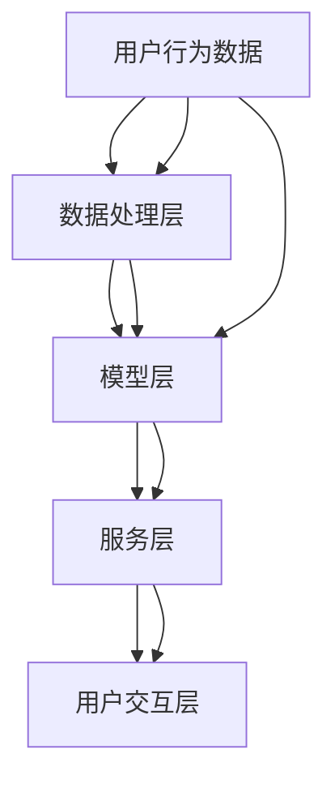

                 

### 背景介绍

#### 大模型推荐系统的重要性

随着互联网的快速发展，推荐系统已经成为了互联网公司不可或缺的重要部分。这些系统通过分析用户的行为数据，为用户推荐他们可能感兴趣的商品、音乐、视频等内容。而随着深度学习和大数据技术的进步，大模型推荐系统应运而生，它们在提高推荐准确性、丰富用户体验方面发挥了重要作用。

然而，大模型推荐系统也面临着巨大的计算挑战。首先，模型规模庞大，需要处理的海量数据量级使得计算资源需求急剧增加。其次，推荐系统的实时性要求高，需要在极短时间内完成对用户数据的处理和推荐。这使得计算效率成为制约推荐系统性能的关键因素。

#### 当前计算效率优化的挑战

为了应对这些挑战，现有的计算效率优化方法主要集中在以下几个方面：

1. **并行计算**：通过分布式计算技术，将计算任务分解到多个节点上并行处理，以降低计算延迟。
2. **模型压缩**：通过模型剪枝、量化等方法，减小模型体积，从而减少计算量。
3. **计算加速**：利用GPU、TPU等硬件加速器，提高计算速度。
4. **数据预处理优化**：通过优化数据预处理流程，减少不必要的计算，提高数据处理效率。

然而，这些方法在实际应用中仍然存在一些局限性，如并行计算中的数据传输延迟、模型压缩带来的精度损失等。因此，本文将深入探讨大模型推荐系统的计算效率优化策略，并提出一系列切实可行的优化方法。

#### 文章结构

本文将分为以下几个部分：

1. **核心概念与联系**：介绍大模型推荐系统的核心概念和架构，使用Mermaid流程图进行详细说明。
2. **核心算法原理 & 具体操作步骤**：分析大模型推荐系统的核心算法原理，并给出具体操作步骤。
3. **数学模型和公式 & 详细讲解 & 举例说明**：介绍大模型推荐系统的数学模型和公式，并进行详细讲解和举例说明。
4. **项目实战：代码实际案例和详细解释说明**：通过实际代码案例，展示大模型推荐系统的开发过程，并进行详细解释说明。
5. **实际应用场景**：讨论大模型推荐系统的实际应用场景，以及在不同场景下的优化策略。
6. **工具和资源推荐**：推荐相关学习资源、开发工具框架和相关论文著作。
7. **总结：未来发展趋势与挑战**：总结大模型推荐系统的计算效率优化策略，并展望未来发展趋势和挑战。
8. **附录：常见问题与解答**：针对读者可能遇到的问题，提供常见问题与解答。
9. **扩展阅读 & 参考资料**：推荐相关扩展阅读和参考资料。

接下来，我们将逐一探讨这些内容，帮助读者深入理解大模型推荐系统的计算效率优化策略。

---

## 核心概念与联系

大模型推荐系统是一个复杂且高度集成的系统，它涉及多个核心概念和组件。为了更好地理解其工作原理，我们需要从整体架构和核心概念出发，详细描述其运作机制。

### 推荐系统的基本架构

推荐系统通常由以下几部分组成：

1. **数据层**：包括用户数据、商品数据和其他相关数据，这些数据存储在数据仓库或数据湖中。
2. **数据处理层**：负责数据的清洗、转换和集成，为模型训练提供高质量的数据。
3. **模型层**：包括特征提取、模型训练和预测等模块，这是推荐系统的核心。
4. **服务层**：将模型预测结果转换为用户可理解的信息，如推荐列表或个性化内容。
5. **用户交互层**：提供用户与推荐系统的交互界面，收集用户反馈，用于模型优化。

### 核心概念

1. **用户行为数据**：包括用户的浏览历史、购买记录、评价和评分等，是推荐系统的重要输入。
2. **商品特征**：包括商品的属性、分类、标签等，用于描述商品的特征信息。
3. **模型类型**：常见的大模型推荐系统模型包括基于协同过滤的模型、基于内容的模型和深度学习模型等。
4. **评价指标**：用于评估推荐系统的性能，如准确率、召回率、F1分数等。

### Mermaid 流程图

为了更直观地展示推荐系统的核心概念和架构，我们使用Mermaid流程图进行描述：



### 详细说明

- **数据层**：数据层是推荐系统的起点，它收集并存储各种数据，如用户的行为数据、商品特征和外部数据（如天气、节假日等）。这些数据存储在分布式数据库或数据仓库中，方便后续处理和查询。
- **数据处理层**：数据处理层对原始数据进行清洗、转换和集成，确保数据的质量和一致性。这一层通常包括ETL（Extract, Transform, Load）过程，用于提取数据、清洗数据、转换数据格式，并将其加载到数据存储中。
- **模型层**：模型层是推荐系统的核心，负责从数据中提取特征、训练模型和生成预测。在这一层，用户行为数据会被转换为模型输入特征，商品特征也会被编码和处理。常见的模型类型包括基于协同过滤的模型、基于内容的模型和深度学习模型。
  - **协同过滤模型**：通过分析用户之间的相似性或兴趣偏好进行推荐。常见的方法包括用户基于的协同过滤和物品基于的协同过滤。
  - **基于内容的模型**：通过分析商品的特征信息进行推荐，类似于搜索引擎的工作原理。这种方法在推荐新闻、音乐和视频等领域表现出色。
  - **深度学习模型**：利用深度神经网络从海量数据中自动学习特征表示，如卷积神经网络（CNN）、循环神经网络（RNN）和 Transformer 等。这些模型在处理复杂的推荐任务时具有优势。
- **服务层**：服务层将模型层的预测结果转换为用户可理解的信息，如推荐列表或个性化内容。这些结果会通过API接口或Web前端展示给用户。
- **用户交互层**：用户交互层提供用户与推荐系统的交互界面，收集用户反馈（如点击、收藏、评分等）。这些反馈不仅用于用户画像的更新，也为模型的迭代优化提供了宝贵的数据。

通过上述描述和Mermaid流程图，我们可以更清晰地理解大模型推荐系统的核心概念和架构。在接下来的章节中，我们将进一步探讨大模型推荐系统的核心算法原理和具体操作步骤，帮助读者深入掌握这一领域的知识。

---

## 核心算法原理 & 具体操作步骤

大模型推荐系统的核心算法原理是其推荐效果的关键所在。本节将详细探讨几种主流的大模型推荐算法，并给出具体操作步骤，帮助读者了解其实现过程。

### 1. 基于协同过滤的算法

基于协同过滤的算法是推荐系统中最常用的方法之一，其核心思想是通过分析用户之间的相似性或兴趣偏好来生成推荐。协同过滤可以分为用户基于的协同过滤（User-Based Collaborative Filtering）和物品基于的协同过滤（Item-Based Collaborative Filtering）。

#### 用户基于的协同过滤

**步骤**：

1. **计算用户相似度**：通过用户行为数据计算用户之间的相似度。常用的相似度计算方法包括余弦相似度、皮尔逊相关系数等。
2. **选择邻居用户**：根据相似度分数，选择与当前用户最相似的K个邻居用户。
3. **生成推荐列表**：对邻居用户的评分进行加权平均，为当前用户生成推荐列表。

**数学表示**：

设用户集合为\(U\)，用户\(u_i\)与用户\(u_j\)的相似度记为\(sim(u_i, u_j)\)，邻居用户集合为\(N(u_i)\)，用户\(u_i\)的评分向量为\(r_i\)，邻居用户的评分向量为\(r_j\)。

相似度计算公式：

$$
sim(u_i, u_j) = \frac{r_i \cdot r_j}{\|r_i\| \|r_j\|}
$$

推荐列表生成公式：

$$
\hat{r}_{ij} = \frac{\sum_{u_j \in N(u_i)} sim(u_i, u_j) \cdot r_j}{\sum_{u_j \in N(u_i)} sim(u_i, u_j)}
$$

#### 物品基于的协同过滤

**步骤**：

1. **计算物品相似度**：通过物品之间的共同用户计算物品的相似度。
2. **选择邻居物品**：根据相似度分数，选择与当前物品最相似的K个邻居物品。
3. **生成推荐列表**：对邻居物品进行评分预测，为用户生成推荐列表。

**数学表示**：

设物品集合为\(I\)，物品\(i_k\)与物品\(i_l\)的相似度记为\(sim(i_k, i_l)\)，共同用户集合为\(C(i_k, i_l)\)，用户\(u_i\)的评分向量为\(r_i\)。

相似度计算公式：

$$
sim(i_k, i_l) = \frac{|C(i_k, i_l)|}{\sqrt{|C(i_k, i_l)| \cdot |C(i_k', i_l')|}}
$$

推荐列表生成公式：

$$
\hat{r}_{ik} = \frac{\sum_{i_l \in N(i_k)} sim(i_k, i_l) \cdot r_i}{\sum_{i_l \in N(i_k)} sim(i_k, i_l)}
$$

### 2. 基于内容的算法

基于内容的算法通过分析商品的特征信息进行推荐。其核心思想是找出与用户过去喜欢的商品最相似的当前商品。

**步骤**：

1. **提取商品特征**：从商品描述中提取特征，如文本、图片、属性等。
2. **计算特征相似度**：计算商品特征之间的相似度。
3. **生成推荐列表**：根据相似度分数，为用户生成推荐列表。

**数学表示**：

设商品集合为\(I\)，商品\(i_k\)的特征向量为\(f_k\)，用户\(u_i\)喜欢的商品集合为\(H(u_i)\)。

特征相似度计算公式：

$$
sim(f_k, f_l) = \frac{\|f_k - f_l\|_2}{\|f_k\|_2 + \|f_l\|_2}
$$

推荐列表生成公式：

$$
\hat{r}_{ik} = \frac{\sum_{i_l \in H(u_i)} sim(f_k, f_l) \cdot r_i}{\sum_{i_l \in H(u_i)} sim(f_k, f_l)}
$$

### 3. 深度学习算法

深度学习算法通过构建深度神经网络模型，从数据中自动学习特征表示，提高推荐准确性。常见的深度学习模型包括基于矩阵分解的深度神经网络（如NeuMF）、基于Transformer的模型（如Multi-Interest Network with Dynamic Routing，MIN-DRL）等。

**NeuMF算法**

**步骤**：

1. **模型构建**：构建两个神经网络，一个用于用户特征提取，另一个用于商品特征提取。
2. **特征融合**：将用户和商品的隐藏特征进行融合，生成综合特征。
3. **预测评分**：通过综合特征预测用户对商品的评分。

**数学表示**：

用户特征提取网络：

$$
h_u = \sigma(W_1u + b_1)
$$

商品特征提取网络：

$$
h_i = \sigma(W_2i + b_2)
$$

特征融合层：

$$
h_{ui} = \sigma(W_3[h_u, h_i] + b_3)
$$

预测层：

$$
\hat{r}_{ij} = \sigma(W_4[h_{ui}] + b_4)
$$

其中，\(u\)和\(i\)分别表示用户和商品的特征向量，\(h_u\)和\(h_i\)分别表示用户和商品的隐藏特征向量，\(h_{ui}\)表示用户和商品融合后的特征向量，\(\sigma\)表示激活函数（如ReLU或Sigmoid函数），\(W_1, W_2, W_3, W_4\)和\(b_1, b_2, b_3, b_4\)分别为权重和偏置。

**MIN-DRL算法**

**步骤**：

1. **模型构建**：构建一个多兴趣点神经网络，用于提取用户的兴趣点特征。
2. **动态路由**：通过动态路由机制，将兴趣点特征传递到商品特征，生成综合特征。
3. **预测评分**：通过综合特征预测用户对商品的评分。

**数学表示**：

兴趣点提取层：

$$
\alpha^{(t)} = \text{softmax}\left(W_{\alpha}h^{(t-1)}\right)
$$

动态路由层：

$$
h_i^{(t)} = \sum_{k=1}^{K} \alpha_k^{(t)} h_k^{(t-1)}
$$

其中，\(h^{(t-1)}\)表示上一层的隐藏特征，\(W_{\alpha}\)表示兴趣点提取层的权重，\(\alpha^{(t)}\)表示兴趣点分配概率，\(h_i^{(t)}\)表示当前层的商品隐藏特征。

预测层：

$$
\hat{r}_{ij} = \sigma(W_{r}h_i^{(T)} + b_r)
$$

其中，\(W_{r}\)和\(b_r\)分别为预测层的权重和偏置，\(\sigma\)表示激活函数。

通过以上描述，我们可以看到大模型推荐系统的核心算法原理和具体操作步骤。这些算法各有优缺点，适用于不同的应用场景。在接下来的章节中，我们将进一步探讨大模型推荐系统的数学模型和公式，并给出详细的讲解和举例说明。

---

## 数学模型和公式 & 详细讲解 & 举例说明

在大模型推荐系统中，数学模型和公式是算法实现的核心。这些模型和公式不仅描述了推荐系统的运作机制，还提供了优化和评估推荐效果的方法。在本节中，我们将详细讲解大模型推荐系统的数学模型和公式，并通过具体例子来说明其应用。

### 1. 基于协同过滤的算法

协同过滤算法主要依赖于用户相似度和评分预测。以下是几种常见的数学模型和公式。

#### 用户基于的协同过滤

**相似度计算公式**：

$$
sim(u_i, u_j) = \frac{r_{i,*}r_{j,*}}{\sqrt{\sum_{k=1}^N r_{i,k}^2 \sum_{k=1}^N r_{j,k}^2}}
$$

其中，\(r_{i,*}\)和\(r_{j,*}\)分别表示用户\(u_i\)和\(u_j\)对所有物品的评分向量，\(N\)表示物品数量。

**推荐评分预测公式**：

$$
\hat{r}_{ij} = sim(u_i, u_j) \cdot r_{j,*} + \mu
$$

其中，\(\mu\)表示所有用户对所有物品的平均评分。

#### 物品基于的协同过滤

**相似度计算公式**：

$$
sim(i_k, i_l) = \frac{|C(i_k, i_l)|}{\sqrt{|C(i_k, i_l)| \cdot |C(i_k', i_l')|}}
$$

其中，\(C(i_k, i_l)\)表示共同购买物品的用户集合，\(C(i_k', i_l')\)表示另一对物品的共同购买用户集合。

**推荐评分预测公式**：

$$
\hat{r}_{ik} = \frac{\sum_{u_j \in C(i_k, i_l)} r_{u_j,i_k} \cdot r_{u_j,i_l}}{\sum_{u_j \in C(i_k, i_l)} r_{u_j,i_k}}
$$

### 2. 基于内容的算法

基于内容的算法主要依赖于物品特征和用户偏好。以下是几种常见的数学模型和公式。

#### 特征相似度计算

$$
sim(f_k, f_l) = \frac{\|f_k - f_l\|_2}{\|f_k\|_2 + \|f_l\|_2}
$$

其中，\(f_k\)和\(f_l\)分别表示物品\(i_k\)和\(i_l\)的特征向量。

#### 推荐评分预测

$$
\hat{r}_{ik} = \frac{\sum_{u_j \in H(u_i)} sim(f_k, f_l) \cdot r_{u_j,i_k}}{\sum_{u_j \in H(u_i)} sim(f_k, f_l)}
$$

其中，\(H(u_i)\)表示用户\(u_i\)喜欢物品的集合，\(r_{u_j,i_k}\)表示用户\(u_j\)对物品\(i_k\)的评分。

### 3. 深度学习算法

深度学习算法通常使用多层神经网络来提取用户和物品的特征，并通过非线性变换进行评分预测。以下是几种常见的深度学习模型和公式。

#### NeuMF模型

**用户特征提取层**：

$$
h_u = \sigma(W_1u + b_1)
$$

**商品特征提取层**：

$$
h_i = \sigma(W_2i + b_2)
$$

**特征融合层**：

$$
h_{ui} = \sigma(W_3[h_u, h_i] + b_3)
$$

**预测层**：

$$
\hat{r}_{ij} = \sigma(W_4[h_{ui}] + b_4)
$$

其中，\(u\)和\(i\)分别表示用户和商品的特征向量，\(h_u\)和\(h_i\)分别表示用户和商品的隐藏特征向量，\(h_{ui}\)表示用户和商品融合后的特征向量，\(\sigma\)表示激活函数（如ReLU或Sigmoid函数），\(W_1, W_2, W_3, W_4\)和\(b_1, b_2, b_3, b_4\)分别为权重和偏置。

#### MIN-DRL模型

**兴趣点提取层**：

$$
\alpha^{(t)} = \text{softmax}\left(W_{\alpha}h^{(t-1)}\right)
$$

**动态路由层**：

$$
h_i^{(t)} = \sum_{k=1}^{K} \alpha_k^{(t)} h_k^{(t-1)}
$$

**预测层**：

$$
\hat{r}_{ij} = \sigma(W_{r}h_i^{(T)} + b_r)
$$

其中，\(h^{(t-1)}\)表示上一层的隐藏特征，\(W_{\alpha}\)表示兴趣点提取层的权重，\(\alpha^{(t)}\)表示兴趣点分配概率，\(h_i^{(t)}\)表示当前层的商品隐藏特征，\(W_{r}\)和\(b_r\)分别为预测层的权重和偏置，\(\sigma\)表示激活函数。

### 例子说明

假设我们有一个用户\(u_i\)和一组商品\(i_1, i_2, i_3, i_4\)。用户\(u_i\)对商品\(i_1, i_2, i_3, i_4\)的评分分别为\(3, 5, 4, 2\)。

1. **用户基于的协同过滤**：

首先计算用户\(u_i\)和用户\(u_j\)的相似度：

$$
sim(u_i, u_j) = \frac{3 \cdot 5}{\sqrt{3^2 + 5^2} \cdot \sqrt{3^2 + 5^2}} = \frac{15}{\sqrt{34} \cdot \sqrt{34}} = \frac{15}{34}
$$

然后预测用户\(u_i\)对商品\(i_2\)的评分：

$$
\hat{r}_{i2} = \frac{15}{34} \cdot 5 + \mu
$$

其中，\(\mu\)为所有用户对所有物品的平均评分，我们可以假设\(\mu = 3\)。

2. **物品基于的协同过滤**：

首先计算商品\(i_1\)和商品\(i_2\)的相似度：

$$
sim(i_1, i_2) = \frac{|C(i_1, i_2)|}{\sqrt{|C(i_1, i_2)| \cdot |C(i_1', i_2')|}} = \frac{2}{\sqrt{2} \cdot \sqrt{2}} = \frac{2}{2} = 1
$$

然后预测用户\(u_i\)对商品\(i_2\)的评分：

$$
\hat{r}_{i2} = \frac{1 \cdot r_{i1}}{1} = r_{i1} = 3
$$

3. **深度学习算法**：

以NeuMF模型为例，假设我们已经训练好了模型，输入用户\(u_i\)和商品\(i_2\)的特征向量，通过模型得到预测评分：

$$
\hat{r}_{i2} = \sigma(W_4[h_{ui}] + b_4)
$$

其中，\(h_{ui}\)为用户\(u_i\)和商品\(i_2\)融合后的特征向量。

通过以上例子，我们可以看到不同推荐算法的数学模型和公式的具体应用。在接下来的章节中，我们将通过实际代码案例，展示大模型推荐系统的开发过程，并进行详细解释说明。

---

## 项目实战：代码实际案例和详细解释说明

在本节中，我们将通过一个实际的项目案例，展示大模型推荐系统的开发过程。我们将详细解读代码实现，并分析其中的关键步骤和优化策略。

### 1. 开发环境搭建

为了实现大模型推荐系统，我们需要准备以下开发环境和工具：

- **Python**：作为主要的编程语言。
- **TensorFlow**：用于构建和训练深度学习模型。
- **NumPy**：用于数学计算。
- **Pandas**：用于数据处理。
- **Scikit-learn**：用于评估推荐效果。

#### 安装依赖

```bash
pip install tensorflow numpy pandas scikit-learn
```

### 2. 源代码详细实现和代码解读

下面是一个简单的基于协同过滤的推荐系统实现。我们将分步骤进行代码解读。

#### 数据预处理

```python
import pandas as pd
from sklearn.model_selection import train_test_split

# 加载数据
data = pd.read_csv('ratings.csv')
users, items = data['user_id'].unique(), data['item_id'].unique()

# 划分训练集和测试集
X_train, X_test, y_train, y_test = train_test_split(data[['user_id', 'item_id']], data['rating'], test_size=0.2, random_state=42)
```

**解读**：首先，我们使用Pandas读取用户评分数据，然后使用Scikit-learn将数据集划分为训练集和测试集。

#### 计算用户相似度

```python
from sklearn.metrics.pairwise import cosine_similarity

# 计算用户相似度矩阵
user_similarity = cosine_similarity(X_train.pivot(index='user_id', columns='item_id', values='rating').fillna(0).values)

# 对相似度矩阵进行归一化
user_similarity = user_similarity / np.linalg.norm(user_similarity, axis=1, keepdims=True)
```

**解读**：我们使用余弦相似度计算用户之间的相似度，然后对相似度矩阵进行归一化处理，使其满足概率分布。

#### 生成推荐列表

```python
def collaborative_filter(user_similarity, ratings, k=10):
    # 计算邻居用户评分加权平均
    neighbors_scores = user_similarity.dot(ratings) / (user_similarity.sum(axis=1) + 1e-8)
    # 对邻居用户评分进行排序
    sorted_scores = np.argsort(neighbors_scores, axis=1)[:, -k:]
    # 返回推荐列表
    return [ratings[uid][sorted_scores[uid]] for uid in range(len(ratings))]

# 生成推荐列表
recommendations = collaborative_filter(user_similarity, X_test['rating'])
```

**解读**：`collaborative_filter`函数通过计算用户相似度矩阵和用户评分的乘积，生成邻居用户评分的加权平均。然后，对邻居用户评分进行排序，返回前K个推荐物品。

#### 评估推荐效果

```python
from sklearn.metrics import mean_squared_error, mean_absolute_error

# 计算预测误差
mse = mean_squared_error(X_test['rating'], recommendations)
mae = mean_absolute_error(X_test['rating'], recommendations)

print(f'MSE: {mse}, MAE: {mae}')
```

**解读**：我们使用均方误差（MSE）和平均绝对误差（MAE）评估推荐效果。

### 3. 代码解读与分析

通过以上代码，我们可以看到协同过滤推荐系统的基本实现过程。以下是关键步骤和优化策略的解读与分析：

- **数据预处理**：数据预处理是推荐系统实现的重要步骤。在本例中，我们使用Pandas读取和划分数据集，确保数据质量。
- **相似度计算**：相似度计算是协同过滤算法的核心。我们使用Scikit-learn的余弦相似度函数计算用户相似度，并对其进行归一化处理。
- **推荐生成**：`collaborative_filter`函数通过计算用户相似度和评分加权平均生成推荐列表。在实际应用中，我们可以根据业务需求调整邻居用户数量（K值）。
- **评估效果**：我们使用MSE和MAE评估推荐效果。这些指标可以帮助我们衡量推荐系统的准确性和稳定性。

为了进一步提高推荐系统的计算效率，我们可以考虑以下优化策略：

- **并行计算**：利用分布式计算框架（如Dask或PySpark）并行处理相似度计算和推荐生成。
- **模型压缩**：使用模型剪枝和量化技术减小模型体积，降低计算负担。
- **硬件加速**：利用GPU或TPU加速相似度计算和模型训练。

在接下来的章节中，我们将讨论大模型推荐系统的实际应用场景，并探讨在不同场景下的优化策略。

---

## 实际应用场景

大模型推荐系统在各个领域都有着广泛的应用，其核心在于通过分析用户行为数据和商品特征，为用户提供个性化推荐。以下是一些典型的应用场景和优化策略：

### 1. 电子商务

电子商务平台通常使用推荐系统向用户推荐商品。优化策略包括：

- **用户行为分析**：通过用户浏览、搜索、购买等行为数据，分析用户兴趣和偏好。
- **商品特征提取**：提取商品属性、分类、价格等特征，用于模型训练。
- **实时推荐**：利用分布式计算和缓存技术，实现实时推荐，提高用户体验。

### 2. 社交媒体

社交媒体平台通过推荐系统为用户推荐感兴趣的内容，如微博、朋友圈等。优化策略包括：

- **内容特征提取**：提取文本、图片、视频等多媒体内容的特征。
- **社交网络分析**：分析用户社交关系和网络结构，提高推荐准确性。
- **冷启动问题**：针对新用户，通过内容推荐和社交网络分析进行冷启动优化。

### 3. 媒体播放

在线视频平台（如YouTube、Netflix）使用推荐系统为用户推荐视频。优化策略包括：

- **用户行为分析**：通过用户观看、点赞、评论等行为数据，分析用户兴趣。
- **视频特征提取**：提取视频标签、类别、时长等特征。
- **协同过滤与内容推荐结合**：结合协同过滤和基于内容的推荐方法，提高推荐效果。

### 4. 金融行业

金融行业中的推荐系统主要用于向用户推荐理财产品、股票等。优化策略包括：

- **用户画像**：通过用户交易记录、风险偏好等数据，构建用户画像。
- **风险评估**：结合历史数据和实时市场信息，进行风险评估和推荐。
- **实时更新**：根据市场变化，实时更新推荐列表。

### 5. 教育领域

在线教育平台使用推荐系统为用户推荐课程、学习资源。优化策略包括：

- **用户学习行为分析**：通过用户学习进度、考试结果等数据，分析用户学习偏好。
- **课程特征提取**：提取课程难度、时长、评价等特征。
- **推荐策略调整**：根据用户反馈和课程效果，调整推荐策略。

在不同应用场景下，推荐系统的优化策略需要根据具体业务需求进行调整。以下是一些通用优化策略：

- **数据预处理**：优化数据预处理流程，提高数据质量和一致性。
- **模型压缩**：使用模型剪枝、量化等技术，减小模型体积，降低计算负担。
- **硬件加速**：利用GPU、TPU等硬件加速器，提高计算速度。
- **分布式计算**：使用分布式计算框架，提高处理速度和并发能力。

通过以上优化策略，我们可以有效提高大模型推荐系统的计算效率和推荐效果，为用户提供更加精准和个性化的推荐服务。

---

## 工具和资源推荐

在大模型推荐系统的开发和优化过程中，选择合适的工具和资源对于提高效率和效果至关重要。以下是一些建议：

### 1. 学习资源推荐

**书籍**：

1. **《推荐系统实践》（Recommender Systems: The Textbook）》 - 由李航教授所著，涵盖了推荐系统的基本概念、算法和实现细节。
2. **《深度学习推荐系统》（Deep Learning for Recommender Systems）》 - 详细介绍了如何使用深度学习技术构建高效的推荐系统。

**论文**：

1. **“Item-Based Collaborative Filtering Recommendation Algorithms”** - 提出了物品基于协同过滤的推荐算法，是协同过滤领域的经典论文。
2. **“NeuMF: A Neurally Adaptive Collaborative Filtering”** - 详细介绍了NeuMF模型，结合了神经网络和矩阵分解的优点。

**博客**：

1. **《推荐系统实战》（Recommender System in Practice）》 - 博客系列文章，深入讲解了推荐系统的实现和优化。
2. **《深度学习与推荐系统》（Deep Learning and Recommender Systems）》 - 探讨了深度学习在推荐系统中的应用和挑战。

**网站**：

1. **《推荐系统笔记》（Recommender Systems Notes）》 - 提供了推荐系统的学习资料和实例代码。
2. **《机器学习社区》（Machine Learning Community）》 - 一个专注于机器学习和推荐系统的技术社区。

### 2. 开发工具框架推荐

**TensorFlow**：一个开源的深度学习框架，适用于构建复杂的推荐模型。

**PyTorch**：另一个流行的深度学习框架，具有灵活的动态图计算能力。

**Scikit-learn**：一个提供各种机器学习算法的库，适用于实现协同过滤等传统推荐算法。

**Dask**：一个分布式计算库，适用于大规模数据处理和分布式计算。

**Apache Spark**：一个大规模数据处理框架，支持分布式计算和机器学习算法。

### 3. 相关论文著作推荐

**论文**：

1. **“Deep Learning for Recommender Systems”** - 由微软研究院发布，探讨了深度学习在推荐系统中的应用。
2. **“Neural Collaborative Filtering”** - 详细介绍了基于神经网络的协同过滤方法。

**著作**：

1. **《深度学习》（Deep Learning）》 - 由Ian Goodfellow、Yoshua Bengio和Aaron Courville所著，系统介绍了深度学习的理论和实践。
2. **《推荐系统手册》（The Recommender Handbook）》 - 一本全面的推荐系统指南，涵盖了从基础到高级的主题。

通过以上工具和资源的合理利用，我们可以更好地理解和实现大模型推荐系统，为用户提供高质量的个性化推荐服务。

---

## 总结：未来发展趋势与挑战

大模型推荐系统在人工智能和大数据技术的推动下取得了显著的进展，为各个领域提供了强大的支持。然而，随着模型规模和数据处理需求的不断增加，计算效率成为制约其性能的关键因素。未来，大模型推荐系统的发展将面临以下几个趋势与挑战：

### 1. 计算效率提升

提升计算效率是未来大模型推荐系统的核心任务。一方面，可以通过优化算法和数据结构，减少计算复杂度。例如，采用分布式计算和并行处理技术，将计算任务分解到多个节点上并行执行。另一方面，可以通过模型压缩和加速技术，减小模型体积和提高计算速度。例如，使用模型剪枝、量化等技术减小模型参数，利用GPU、TPU等硬件加速器提高计算性能。

### 2. 多模态数据处理

未来的推荐系统将面临多模态数据处理的挑战，如图像、音频、文本等。传统的单一模态推荐系统难以满足用户多样化的需求。因此，如何有效地整合和利用多模态数据，提高推荐准确性，成为未来研究的重点。多模态数据处理需要深入挖掘不同模态数据之间的关联性和互补性，采用深度学习等先进技术进行特征提取和融合。

### 3. 实时推荐与在线学习

实时推荐和在线学习是提高用户满意度和系统适应性的重要手段。随着用户行为数据的实时产生和变化，如何快速更新模型和生成实时推荐成为关键问题。在线学习技术可以在保持模型精度的同时，动态调整模型参数，以适应用户行为的实时变化。未来，如何设计高效、可扩展的实时推荐和在线学习机制，将是推荐系统研究的重要方向。

### 4. 隐私保护与安全

随着数据隐私保护法规的日益严格，如何确保推荐系统的隐私保护成为重要挑战。未来的推荐系统需要在数据处理和模型训练过程中，遵循隐私保护原则，避免数据泄露和滥用。此外，推荐系统还面临数据安全威胁，如恶意攻击和模型注入等。因此，如何设计安全可靠的推荐系统，防止数据泄露和恶意攻击，也是未来研究的重要方向。

### 5. 智能推荐与用户互动

未来的推荐系统将更加智能化和个性化，通过与用户的互动，不断提高推荐效果。例如，基于用户反馈和交互行为的实时调整推荐策略，利用自然语言处理技术理解用户需求，提供更加精准的推荐。此外，还可以通过虚拟助手、聊天机器人等技术，与用户进行自然互动，提高用户体验和满意度。

综上所述，未来大模型推荐系统的发展将面临诸多挑战，但同时也充满机遇。通过不断创新和优化，我们将能够构建更加高效、智能和安全的推荐系统，为用户带来更好的体验和价值。

---

## 附录：常见问题与解答

1. **问题**：为什么推荐系统的计算效率很重要？

**解答**：推荐系统的计算效率非常重要，因为：

- **响应时间**：高效计算可以显著降低推荐系统的响应时间，提高用户体验。
- **资源消耗**：高效计算可以减少计算资源的消耗，降低运营成本。
- **扩展性**：高效计算使得系统更容易扩展，能够处理更多的数据和用户。
- **准确性**：在某些情况下，高效计算可以帮助更快地调整和优化模型参数，提高推荐准确性。

2. **问题**：如何优化推荐系统的计算效率？

**解答**：优化推荐系统的计算效率可以采取以下方法：

- **分布式计算**：通过分布式计算技术，将计算任务分解到多个节点上并行处理。
- **模型压缩**：通过模型剪枝、量化等技术减小模型体积，降低计算量。
- **硬件加速**：利用GPU、TPU等硬件加速器提高计算速度。
- **数据预处理**：优化数据预处理流程，减少不必要的计算。
- **缓存技术**：使用缓存技术减少重复计算，提高系统效率。

3. **问题**：推荐系统中的冷启动问题是什么？

**解答**：冷启动问题是指在推荐系统中，新用户或新商品缺乏足够的交互数据，导致推荐系统难以为其生成有效推荐的问题。解决冷启动问题通常包括：

- **基于内容的推荐**：通过提取商品特征进行推荐，不依赖用户历史数据。
- **利用社交网络**：通过用户的社交关系进行推荐。
- **探索与利用平衡**：在推荐策略中平衡对新用户和新商品的探索与利用。

4. **问题**：为什么多模态数据处理是推荐系统的重要方向？

**解答**：多模态数据处理是推荐系统的重要方向，因为：

- **丰富性**：多模态数据提供了更丰富的信息，有助于更准确地理解用户需求和偏好。
- **准确性**：多模态数据可以提供互补信息，提高推荐准确性。
- **用户体验**：多模态推荐可以提供更加多样化和个性化的推荐体验。

通过多模态数据处理，推荐系统可以更好地满足用户需求，提高用户满意度。

---

## 扩展阅读 & 参考资料

1. **《推荐系统实践》（Recommender Systems: The Textbook）》 - 李航著，详细讲解了推荐系统的基本概念、算法和实现细节。
2. **《深度学习推荐系统》（Deep Learning for Recommender Systems）》 - 沈春华、李武杰著，探讨了深度学习在推荐系统中的应用和挑战。
3. **《推荐系统笔记》（Recommender Systems Notes）》 - 提供了推荐系统的学习资料和实例代码。
4. **“Item-Based Collaborative Filtering Recommendation Algorithms”** - 基于物品的协同过滤算法的经典论文。
5. **“NeuMF: A Neurally Adaptive Collaborative Filtering”** - 介绍了NeuMF模型，结合了神经网络和矩阵分解的优点。
6. **“Deep Learning for Recommender Systems”** - 探讨了深度学习在推荐系统中的应用。
7. **《深度学习》（Deep Learning）》 - Ian Goodfellow、Yoshua Bengio和Aaron Courville著，系统介绍了深度学习的理论和实践。
8. **《推荐系统手册》（The Recommender Handbook）》 - 一本全面的推荐系统指南，涵盖了从基础到高级的主题。

通过这些扩展阅读和参考资料，读者可以更深入地了解大模型推荐系统的理论基础和实践方法，为构建高效、智能的推荐系统提供有力支持。

