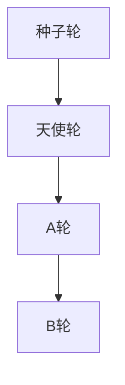

                 

### 背景介绍

在近年来，随着人工智能技术的飞速发展，大模型时代已经来临。大模型，又称为大型神经网络模型，是指那些拥有巨大参数数量和计算能力的神经网络模型。这些模型在处理大规模数据时，能够显著提升性能，并在各种复杂任务中表现出色。例如，在自然语言处理（NLP）、计算机视觉（CV）和语音识别等领域，大模型的应用已经取得了显著的成果。

大模型的兴起，不仅改变了传统的人工智能研究范式，也对创业者和投资者提出了新的挑战和机遇。在天使轮、A轮和 B 轮等不同融资阶段，创业者需要展示出不同的价值点和商业潜力，以便获得投资者的信任和支持。本文将围绕大模型时代的创业者创业融资策略，详细探讨天使轮、A轮与B轮的融资要点和策略。

首先，我们需要了解大模型的基本概念和原理。大模型通常基于深度学习技术，特别是神经网络架构，通过训练大规模的数据集，学习到数据中的复杂模式和规律。这些模型具有以下特点：

1. **参数数量巨大**：大模型拥有数百万甚至数亿个参数，这使得它们能够捕捉到数据中的细微特征。
2. **计算能力强大**：大模型需要大量的计算资源，包括GPU和TPU等加速器，以确保高效训练和推理。
3. **对数据需求大**：大模型训练需要大规模数据集，以确保模型的泛化能力和鲁棒性。
4. **迭代速度快**：随着算法和硬件的进步，大模型的迭代速度越来越快，使得新模型能够迅速取代旧模型。

其次，我们需要了解创业者在大模型时代面临的挑战和机遇。在大模型时代，创业者需要具备以下能力：

1. **技术创新能力**：创业者需要持续关注大模型技术的发展动态，掌握前沿的算法和架构，以推动产品的迭代和升级。
2. **数据获取能力**：创业者需要建立强大的数据获取和清洗能力，以确保模型训练所需的数据质量和数量。
3. **商业模式构建能力**：创业者需要从大模型技术中找到商业应用场景，构建可持续的商业模式。
4. **团队建设能力**：创业者需要吸引和培养一批具有专业技能和团队协作能力的人才，以应对大模型项目的复杂性和挑战。

最后，我们需要了解大模型时代创业者的融资策略。在天使轮、A轮和 B 轮等不同融资阶段，创业者需要展示出不同的价值点和商业潜力。以下将详细探讨各个阶段的融资策略。

1. **天使轮**：天使轮是创业项目最初的融资阶段，创业者需要向天使投资人展示出创新的技术理念和初步的商业模型。在这个阶段，创业者需要重点关注以下几个方面：
   - 技术创新：展示出大模型技术的前沿性和潜力。
   - 市场前景：分析市场趋势，预测市场规模和增长率。
   - 商业模式：构建一个可行且具有吸引力的商业模式。
   - 团队背景：介绍团队成员的专业技能和经验。

2. **A轮**：A轮是创业项目的进一步融资阶段，通常需要向风险投资机构展示更多的成果和进展。在这个阶段，创业者需要重点关注以下几个方面：
   - 技术成果：展示出大模型技术的实际应用案例和效果。
   - 数据积累：展示出大规模数据的获取和清洗能力。
   - 商业模式：优化商业模式，使其更具竞争力和可持续性。
   - 团队扩展：展示出团队规模的扩大和专业技能的提升。

3. **B轮**：B轮是创业项目的成熟融资阶段，通常需要向大型投资机构或战略投资者展示出强大的商业潜力和市场前景。在这个阶段，创业者需要重点关注以下几个方面：
   - 商业规模：展示出产品或服务的市场占有率和增长速度。
   - 营收和利润：展示出稳定的收入流和盈利能力。
   - 商业布局：展示出公司在全国乃至全球的布局和扩展计划。
   - 风险管理：展示出对公司面临的风险的识别和应对策略。

通过以上分析，我们可以看出，大模型时代的创业者需要具备技术创新、数据获取、商业模式构建和团队建设等多方面的能力。同时，在不同的融资阶段，创业者需要展示出不同的价值点和商业潜力，以获得投资者的信任和支持。接下来，我们将进一步探讨天使轮、A轮与B轮的具体融资策略和注意事项。 <|im_sep|>### 核心概念与联系

在探讨大模型时代的创业者创业融资策略之前，我们需要先了解一些核心概念，包括大模型的基本原理、创业融资的基本流程以及天使轮、A轮和B轮的具体含义和特点。

#### 大模型的基本原理

大模型（Large Models）通常指的是参数数量非常大的神经网络模型。这些模型之所以称为“大”，主要是因为它们可以容纳更多的参数，从而捕捉数据中的复杂模式和规律。大模型的核心原理是基于深度学习（Deep Learning）技术，特别是神经网络（Neural Networks）架构。

深度学习是一种机器学习（Machine Learning）方法，通过构建具有多个隐藏层的神经网络模型，模拟人脑的学习机制，从而实现对复杂数据的建模和预测。神经网络由大量神经元（或节点）组成，每个神经元都与其他神经元相连，并通过权重（weights）传递信息。在训练过程中，模型通过不断调整权重，最小化预测误差，从而学习到数据中的特征和模式。

大模型的特点包括：

1. **参数数量巨大**：大模型通常拥有数百万甚至数亿个参数，这使得它们能够捕捉到数据中的细微特征。
2. **计算能力强大**：大模型需要大量的计算资源，包括GPU和TPU等加速器，以确保高效训练和推理。
3. **对数据需求大**：大模型训练需要大规模数据集，以确保模型的泛化能力和鲁棒性。
4. **迭代速度快**：随着算法和硬件的进步，大模型的迭代速度越来越快，使得新模型能够迅速取代旧模型。

#### 创业融资的基本流程

创业融资是指创业者在创业过程中，通过向投资者筹集资金来支持业务发展。创业融资的基本流程通常包括以下几个阶段：

1. **种子轮（Seed Round）**：这是创业项目最初的一轮融资，通常由创业者自己的资金或天使投资人支持。在这个阶段，创业者需要展示出创新的技术理念和初步的商业模型，以获得投资者的信任和支持。

2. **天使轮（Angel Round）**：天使轮是创业项目的进一步融资阶段，通常由天使投资人或机构投资者支持。在这个阶段，创业者需要向天使投资人展示出更多的成果和进展，以获得更多的资金支持。

3. **A轮（Series A Round）**：A轮是创业项目的又一次重要融资阶段，通常由风险投资机构（VC）支持。在这个阶段，创业者需要向风险投资机构展示出更多的成果和进展，包括技术成果、数据积累和商业模式等。

4. **B轮（Series B Round）**：B轮是创业项目的成熟融资阶段，通常由大型投资机构或战略投资者支持。在这个阶段，创业者需要向大型投资机构或战略投资者展示出强大的商业潜力和市场前景，包括商业规模、营收和利润等。

#### 天使轮、A轮与B轮的具体含义和特点

1. **天使轮（Angel Round）**

天使轮是创业项目最初的融资阶段，通常由天使投资人或机构投资者支持。在这个阶段，创业者需要展示出创新的技术理念和初步的商业模型，以获得投资者的信任和支持。天使轮的特点包括：

- **资金额度较小**：天使轮的融资额度通常较小，主要目的是为创业项目提供启动资金。
- **投资风险较大**：天使轮的投资风险较大，因为项目还处于早期阶段，缺乏明确的商业模式和收入流。
- **投资周期较长**：天使轮的投资周期通常较长，需要耐心等待项目的成长和成熟。

2. **A轮（Series A Round）**

A轮是创业项目的又一次重要融资阶段，通常由风险投资机构（VC）支持。在这个阶段，创业者需要向风险投资机构展示出更多的成果和进展，包括技术成果、数据积累和商业模式等。A轮的特点包括：

- **资金额度较大**：A轮的融资额度通常较大，可以支持创业项目的进一步发展和扩张。
- **投资风险适中**：A轮的投资风险相对较小，因为项目已经有了初步的商业模型和收入流。
- **投资周期较短**：A轮的投资周期通常较短，因为风险投资机构希望尽快获得回报。

3. **B轮（Series B Round）**

B轮是创业项目的成熟融资阶段，通常由大型投资机构或战略投资者支持。在这个阶段，创业者需要向大型投资机构或战略投资者展示出强大的商业潜力和市场前景，包括商业规模、营收和利润等。B轮的特点包括：

- **资金额度最大**：B轮的融资额度通常最大，可以支持创业项目的快速扩张和市场占领。
- **投资风险最小**：B轮的投资风险相对较小，因为项目已经有了稳定的商业模式和收入流。
- **投资周期最长**：B轮的投资周期通常最长，因为大型投资机构或战略投资者需要深入了解创业项目的运营状况和商业前景。

#### Mermaid 流程图

为了更好地展示天使轮、A轮与B轮的关系，我们可以使用Mermaid流程图来表示各个阶段的顺序和联系。以下是一个简化的Mermaid流程图：



在这个流程图中，种子轮是创业项目最初的融资阶段，随后是天使轮、A轮和B轮。每个阶段都有其独特的特点和目标，创业者需要根据项目的发展阶段和市场需求，选择合适的融资策略和时机。

通过以上分析，我们可以看到大模型时代的创业者需要掌握的核心概念和联系。理解这些概念和联系，有助于创业者更好地应对创业融资的挑战，抓住机遇，推动项目的成功。接下来，我们将深入探讨大模型的核心算法原理和具体操作步骤。 <|im_sep|>### 核心算法原理 & 具体操作步骤

在探讨大模型时代的创业者创业融资策略之前，我们需要深入了解大模型的核心算法原理和具体操作步骤。大模型通常基于深度学习技术，特别是神经网络架构，通过训练大规模的数据集，学习到数据中的复杂模式和规律。以下将详细阐述大模型的核心算法原理和具体操作步骤。

#### 1. 神经网络架构

神经网络（Neural Networks）是深度学习的基础，它由大量相互连接的神经元组成。每个神经元接收来自其他神经元的输入信号，通过激活函数进行非线性变换，然后产生输出信号。神经网络的架构可以分为输入层、隐藏层和输出层。

1. **输入层（Input Layer）**：输入层接收外部输入数据，例如图片、文本或音频。每个输入数据都被表示为一个向量，并作为神经网络的输入。

2. **隐藏层（Hidden Layers）**：隐藏层是神经网络的核心部分，包含多个隐藏神经元。每个隐藏神经元接收来自输入层的输入信号，通过权重矩阵进行加权求和，然后通过激活函数进行非线性变换，产生输出信号。隐藏层的数量和神经元数量可以根据具体任务进行调整。

3. **输出层（Output Layer）**：输出层产生最终预测结果。对于分类任务，输出层通常是一个softmax函数，用于计算每个类别的概率分布。对于回归任务，输出层通常是一个线性函数，用于预测连续值。

#### 2. 损失函数

损失函数（Loss Function）用于衡量预测结果与真实值之间的差距。深度学习模型通过优化损失函数，调整模型参数，使得预测结果逐渐逼近真实值。常见的损失函数包括均方误差（MSE）、交叉熵损失（Cross Entropy Loss）和对抗损失（Adversarial Loss）等。

1. **均方误差（MSE）**：均方误差（MSE）用于衡量预测值与真实值之间的平均平方误差。MSE公式如下：

   $$MSE = \frac{1}{n} \sum_{i=1}^{n} (y_i - \hat{y_i})^2$$

   其中，$y_i$表示真实值，$\hat{y_i}$表示预测值，$n$表示样本数量。

2. **交叉熵损失（Cross Entropy Loss）**：交叉熵损失（Cross Entropy Loss）用于衡量预测概率分布与真实概率分布之间的差异。交叉熵损失公式如下：

   $$CE = -\frac{1}{n} \sum_{i=1}^{n} y_i \log \hat{y_i}$$

   其中，$y_i$表示真实概率分布，$\hat{y_i}$表示预测概率分布，$n$表示样本数量。

3. **对抗损失（Adversarial Loss）**：对抗损失（Adversarial Loss）用于对抗攻击（Adversarial Attack），通过最小化对抗样本与原始样本之间的差距，提高模型的鲁棒性。对抗损失公式如下：

   $$AL = \frac{1}{n} \sum_{i=1}^{n} L(y_i, \hat{y_i} + \epsilon_i)$$

   其中，$y_i$表示真实值，$\hat{y_i}$表示预测值，$\epsilon_i$表示对抗扰动，$L$表示损失函数。

#### 3. 优化算法

优化算法（Optimization Algorithm）用于调整模型参数，使得损失函数最小化。常见的优化算法包括梯度下降（Gradient Descent）、动量梯度下降（Momentum Gradient Descent）和Adam优化器（Adam Optimizer）等。

1. **梯度下降（Gradient Descent）**：梯度下降（Gradient Descent）是一种最简单的优化算法，通过计算损失函数关于模型参数的梯度，更新模型参数，使得损失函数最小化。梯度下降公式如下：

   $$\theta_{t+1} = \theta_t - \alpha \nabla_{\theta} J(\theta_t)$$

   其中，$\theta_t$表示第$t$次迭代的模型参数，$\alpha$表示学习率，$\nabla_{\theta} J(\theta_t)$表示损失函数关于模型参数的梯度。

2. **动量梯度下降（Momentum Gradient Descent）**：动量梯度下降（Momentum Gradient Descent）是梯度下降的改进版本，通过引入动量项，使得模型参数的更新更加稳定。动量梯度下降公式如下：

   $$\theta_{t+1} = \theta_t - \alpha \nabla_{\theta} J(\theta_t) + \beta \theta_t - \theta_{t-1}$$

   其中，$\beta$表示动量因子，$\theta_t$表示第$t$次迭代的模型参数，$\alpha$表示学习率。

3. **Adam优化器（Adam Optimizer）**：Adam优化器是一种自适应梯度优化算法，结合了动量梯度和RMSprop的优点，能够更好地适应不同的学习问题。Adam优化器公式如下：

   $$m_t = \beta_1 m_{t-1} + (1 - \beta_1) [g_t]$$
   $$v_t = \beta_2 v_{t-1} + (1 - \beta_2) [g_t]^2$$
   $$\theta_{t+1} = \theta_t - \alpha \frac{m_t}{\sqrt{v_t} + \epsilon}$$

   其中，$m_t$和$v_t$分别表示一阶矩估计和二阶矩估计，$\beta_1$和$\beta_2$分别表示一阶和二阶矩的指数衰减率，$\alpha$表示学习率，$g_t$表示梯度，$\epsilon$表示一个很小的正数，用于防止分母为零。

#### 4. 训练与验证

在深度学习模型训练过程中，通常包括训练（Training）和验证（Validation）两个阶段。训练阶段用于优化模型参数，使得损失函数最小化。验证阶段用于评估模型在未知数据上的表现，以确定模型是否过拟合或欠拟合。

1. **训练阶段**：在训练阶段，模型通过不断迭代，调整参数，使得损失函数逐渐减小。具体步骤如下：

   - 初始化模型参数；
   - 计算输入数据的梯度；
   - 更新模型参数；
   - 计算损失函数的值。

2. **验证阶段**：在验证阶段，模型在验证数据集上测试其性能。具体步骤如下：

   - 加载验证数据集；
   - 使用训练好的模型进行预测；
   - 计算验证数据集的损失函数值；
   - 分析模型在验证数据集上的表现，以确定是否过拟合或欠拟合。

#### 5. 调参与优化

在深度学习模型训练过程中，调参（Hyperparameter Tuning）和优化（Optimization）是关键步骤。调参用于调整模型超参数，以获得更好的训练效果。优化用于优化模型结构，以适应不同的任务和数据集。

1. **调参**：常见的调参方法包括网格搜索（Grid Search）和贝叶斯优化（Bayesian Optimization）等。

   - **网格搜索（Grid Search）**：网格搜索通过遍历所有可能的参数组合，找到最优的参数组合。缺点是计算成本高，适用范围有限。
   - **贝叶斯优化（Bayesian Optimization）**：贝叶斯优化通过构建参数的概率模型，利用历史数据寻找最优参数组合。优点是计算成本低，适用于大规模参数调优。

2. **优化**：常见的优化方法包括模型压缩（Model Compression）、迁移学习（Transfer Learning）和对抗训练（Adversarial Training）等。

   - **模型压缩（Model Compression）**：模型压缩通过减少模型参数数量，降低模型的计算复杂度和存储需求。常见的方法包括量化（Quantization）、剪枝（Pruning）和蒸馏（Distillation）等。
   - **迁移学习（Transfer Learning）**：迁移学习通过利用预训练模型的知识，解决新任务。常见的方法包括微调（Fine-tuning）和知识蒸馏（Knowledge Distillation）等。
   - **对抗训练（Adversarial Training）**：对抗训练通过生成对抗样本，提高模型的鲁棒性。常见的方法包括生成对抗网络（GANs）和对抗样本生成（Adversarial Example Generation）等。

通过以上分析，我们可以看到大模型的核心算法原理和具体操作步骤。理解这些原理和步骤，有助于创业者更好地掌握深度学习技术，提高模型的训练效果和预测性能。接下来，我们将进一步探讨大模型在创业融资策略中的应用和实践。 <|im_sep|>### 数学模型和公式 & 详细讲解 & 举例说明

在深度学习领域，数学模型和公式是核心组成部分。它们不仅定义了模型的架构和训练过程，还提供了评估模型性能的标准。以下将详细讲解大模型中常用的数学模型和公式，并通过具体实例进行说明。

#### 1. 激活函数

激活函数（Activation Function）是神经网络中的一个关键组件，它用于将神经元的输入转化为输出。常见的激活函数包括：

- **Sigmoid函数**：Sigmoid函数将输入值映射到$(0, 1)$区间。其公式如下：

  $$\sigma(x) = \frac{1}{1 + e^{-x}}$$

  Sigmoid函数的特点是平滑且单调递增。

- **ReLU函数**：ReLU（Rectified Linear Unit）函数是近年来广泛使用的激活函数。它的公式如下：

  $$\text{ReLU}(x) = \max(0, x)$$

  ReLU函数在输入为正时输出输入值，为负时输出零。它具有简单和计算效率高的优点。

- **Tanh函数**：Tanh函数将输入值映射到$(-1, 1)$区间。其公式如下：

  $$\tanh(x) = \frac{e^x - e^{-x}}{e^x + e^{-x}}$$

  Tanh函数具有相似的平滑性质，但输出范围更广。

- **Softmax函数**：Softmax函数用于多分类任务，将神经网络的输出转换为概率分布。其公式如下：

  $$\text{softmax}(x)_i = \frac{e^{x_i}}{\sum_{j} e^{x_j}}$$

  其中，$x_i$是第$i$个类别的得分，$\text{softmax}(x)_i$是第$i$个类别的概率。

#### 2. 损失函数

损失函数（Loss Function）用于衡量预测值与真实值之间的差距。以下是一些常见的损失函数：

- **均方误差（MSE）**：MSE用于回归任务，计算预测值与真实值之间平均平方误差。公式如下：

  $$\text{MSE} = \frac{1}{n} \sum_{i=1}^{n} (y_i - \hat{y_i})^2$$

  其中，$y_i$是真实值，$\hat{y_i}$是预测值，$n$是样本数量。

- **交叉熵损失（Cross Entropy Loss）**：交叉熵损失用于分类任务，计算预测概率分布与真实概率分布之间的差异。公式如下：

  $$\text{CE} = -\frac{1}{n} \sum_{i=1}^{n} y_i \log \hat{y_i}$$

  其中，$y_i$是真实概率分布，$\hat{y_i}$是预测概率分布。

- **对抗损失（Adversarial Loss）**：对抗损失用于对抗攻击，最小化对抗样本与原始样本之间的差距。公式如下：

  $$\text{AL} = \frac{1}{n} \sum_{i=1}^{n} L(y_i, \hat{y_i} + \epsilon_i)$$

  其中，$y_i$是真实值，$\hat{y_i}$是预测值，$\epsilon_i$是对抗扰动。

#### 3. 优化算法

优化算法（Optimization Algorithm）用于调整模型参数，最小化损失函数。以下是一些常见的优化算法：

- **梯度下降（Gradient Descent）**：梯度下降通过计算损失函数关于模型参数的梯度，更新模型参数。公式如下：

  $$\theta_{t+1} = \theta_t - \alpha \nabla_{\theta} J(\theta_t)$$

  其中，$\theta_t$是第$t$次迭代的模型参数，$\alpha$是学习率，$\nabla_{\theta} J(\theta_t)$是损失函数关于模型参数的梯度。

- **动量梯度下降（Momentum Gradient Descent）**：动量梯度下降引入动量项，使参数更新更加稳定。公式如下：

  $$\theta_{t+1} = \theta_t - \alpha \nabla_{\theta} J(\theta_t) + \beta \theta_t - \theta_{t-1}$$

  其中，$\beta$是动量因子。

- **Adam优化器**：Adam优化器结合了一阶和二阶矩估计，自适应调整学习率。公式如下：

  $$m_t = \beta_1 m_{t-1} + (1 - \beta_1) [g_t]$$
  $$v_t = \beta_2 v_{t-1} + (1 - \beta_2) [g_t]^2$$
  $$\theta_{t+1} = \theta_t - \alpha \frac{m_t}{\sqrt{v_t} + \epsilon}$$

  其中，$m_t$和$v_t$分别表示一阶和二阶矩估计，$\beta_1$和$\beta_2$分别表示一阶和二阶矩的指数衰减率，$\alpha$是学习率，$g_t$是梯度，$\epsilon$是一个很小的正数。

#### 4. 举例说明

假设我们有一个二元分类问题，其中数据集包含100个样本，每个样本的特征为10维。目标是将每个样本分类为正类或负类。我们使用ReLU函数作为激活函数，交叉熵损失作为损失函数，并采用Adam优化器进行训练。

1. **模型初始化**：初始化模型参数，包括权重矩阵和偏置向量。假设权重矩阵$W$和偏置向量$b$分别为10x1和1x1。

2. **前向传播**：给定输入特征$x$，计算神经网络的输出。假设隐藏层有10个神经元，输出层有1个神经元。

   $$h = \text{ReLU}(\text{ReLU}(W_1 x + b_1)) = \text{ReLU}(W_2 h + b_2)$$
   $$\hat{y} = \text{ReLU}(W_3 h + b_3)$$

3. **计算损失**：计算预测概率$\hat{y}$与真实标签$y$之间的交叉熵损失。

   $$\text{CE} = -\frac{1}{100} \sum_{i=1}^{100} y_i \log \hat{y_i}$$

4. **反向传播**：计算梯度，并使用Adam优化器更新模型参数。

   $$\nabla_{W_3} \text{CE} = \frac{1}{100} \sum_{i=1}^{100} (\hat{y_i} - y_i) h_i$$
   $$\nabla_{b_3} \text{CE} = \frac{1}{100} \sum_{i=1}^{100} (\hat{y_i} - y_i)$$
   $$\nabla_{W_2} \text{CE} = \frac{1}{100} \sum_{i=1}^{100} (\text{ReLU}(W_3 h_i + b_3) - h_i) W_3$$
   $$\nabla_{b_2} \text{CE} = \frac{1}{100} \sum_{i=1}^{100} (\text{ReLU}(W_3 h_i + b_3) - h_i)$$
   $$\nabla_{W_1} \text{CE} = \frac{1}{100} \sum_{i=1}^{100} (\text{ReLU}(W_2 h_i + b_2) - h_i) W_2$$
   $$\nabla_{b_1} \text{CE} = \frac{1}{100} \sum_{i=1}^{100} (\text{ReLU}(W_2 h_i + b_2) - h_i)$$

5. **更新参数**：使用Adam优化器更新模型参数。

   $$m_1 = \beta_1 m_1_{t-1} + (1 - \beta_1) \nabla_{W_1} \text{CE}$$
   $$v_1 = \beta_2 v_1_{t-1} + (1 - \beta_2) (\nabla_{W_1} \text{CE})^2$$
   $$m_2 = \beta_1 m_2_{t-1} + (1 - \beta_1) \nabla_{b_1} \text{CE}$$
   $$v_2 = \beta_2 v_2_{t-1} + (1 - \beta_2) (\nabla_{b_1} \text{CE})^2$$
   $$...$$
   $$\theta_1 = \theta_1 - \alpha \frac{m_1}{\sqrt{v_1} + \epsilon}$$
   $$\theta_2 = \theta_2 - \alpha \frac{m_2}{\sqrt{v_2} + \epsilon}$$
   $$...$$

通过上述步骤，我们可以训练一个二元分类模型。在训练过程中，模型参数不断调整，使得交叉熵损失逐渐减小，模型性能逐渐提高。随着训练的进行，模型对数据的预测能力不断增强，最终达到一个满意的性能水平。

以上是关于大模型中数学模型和公式的详细讲解和举例说明。理解这些模型和公式，有助于我们更好地掌握深度学习技术，提高模型的训练效果和预测性能。接下来，我们将探讨大模型在项目实战中的应用和实现。 <|im_sep|>### 项目实战：代码实际案例和详细解释说明

在本节中，我们将通过一个实际项目案例，展示如何使用大模型进行数据分析和预测。该案例将涵盖以下步骤：

1. **开发环境搭建**：介绍所需的环境和工具。
2. **源代码详细实现和代码解读**：展示项目核心代码的实现过程，并对关键代码进行详细解释。
3. **代码解读与分析**：分析代码的结构和性能，讨论可能的优化方向。

#### 1. 开发环境搭建

为了实现该项目，我们需要搭建一个适合大模型训练的开发环境。以下是所需的环境和工具：

- **编程语言**：Python（版本3.8及以上）
- **深度学习框架**：PyTorch（版本1.8及以上）
- **数据处理库**：Pandas、NumPy、Scikit-learn
- **数据可视化库**：Matplotlib、Seaborn
- **GPU加速**：NVIDIA GPU（CUDA 11.3及以上）

安装步骤如下：

1. 安装Python和PyTorch：

   ```bash
   # 安装Python
   python --version
   
   # 安装PyTorch
   pip install torch torchvision torchaudio
   ```

2. 安装其他必需的库：

   ```bash
   pip install pandas numpy scikit-learn matplotlib seaborn
   ```

3. 确保NVIDIA GPU驱动和CUDA版本匹配，并进行环境配置：

   ```bash
   nvidia-smi
   nvcc --version
   ```

#### 2. 源代码详细实现和代码解读

以下是一个简单的大模型项目示例，用于实现基于PyTorch的图像分类任务。代码分为以下几个部分：

1. **数据预处理**：加载并预处理图像数据。
2. **模型定义**：定义大模型结构。
3. **训练过程**：训练模型，并评估性能。
4. **预测与可视化**：使用训练好的模型进行预测，并展示结果。

**代码示例：**

```python
import torch
import torchvision
import torchvision.transforms as transforms
import torch.nn as nn
import torch.optim as optim

# 数据预处理
transform = transforms.Compose([
    transforms.Resize(256),
    transforms.CenterCrop(224),
    transforms.ToTensor(),
    transforms.Normalize(mean=[0.485, 0.456, 0.406], std=[0.229, 0.224, 0.225]),
])

trainset = torchvision.datasets.ImageFolder(root='train', transform=transform)
trainloader = torch.utils.data.DataLoader(trainset, batch_size=64, shuffle=True)

testset = torchvision.datasets.ImageFolder(root='test', transform=transform)
testloader = torch.utils.data.DataLoader(testset, batch_size=64, shuffle=False)

# 模型定义
class Net(nn.Module):
    def __init__(self):
        super(Net, self).__init__()
        self.conv1 = nn.Conv2d(3, 64, 7)
        self.pool = nn.MaxPool2d(4)
        self.fc1 = nn.Linear(64 * 28 * 28, 1000)
        self.fc2 = nn.Linear(1000, 500)
        self.fc3 = nn.Linear(500, 10)

    def forward(self, x):
        x = self.pool(nn.functional.relu(self.conv1(x)))
        x = x.view(-1, 64 * 28 * 28)
        x = nn.functional.relu(self.fc1(x))
        x = nn.functional.relu(self.fc2(x))
        x = self.fc3(x)
        return x

model = Net()
print(model)

# 训练过程
optimizer = optim.Adam(model.parameters(), lr=0.001)
criterion = nn.CrossEntropyLoss()

for epoch in range(10):
    running_loss = 0.0
    for i, data in enumerate(trainloader, 0):
        inputs, labels = data
        optimizer.zero_grad()
        outputs = model(inputs)
        loss = criterion(outputs, labels)
        loss.backward()
        optimizer.step()
        running_loss += loss.item()
    print(f'Epoch {epoch + 1}, Loss: {running_loss / (i + 1)}')

# 预测与可视化
correct = 0
total = 0
with torch.no_grad():
    for data in testloader:
        images, labels = data
        outputs = model(images)
        _, predicted = torch.max(outputs.data, 1)
        total += labels.size(0)
        correct += (predicted == labels).sum().item()

print(f'Accuracy of the network on the test images: {100 * correct / total} %')
```

**代码解读：**

- **数据预处理**：使用`transforms.Compose`对图像进行预处理，包括调整大小、中心裁剪、归一化和转换为Tensor格式。

- **模型定义**：`Net`类定义了一个简单的卷积神经网络，包括三个卷积层、两个全连接层和一个输出层。卷积层用于提取图像特征，全连接层用于分类。

- **训练过程**：使用`Adam`优化器和`CrossEntropyLoss`损失函数训练模型。每个epoch中，模型对训练数据进行前向传播、计算损失、反向传播和参数更新。

- **预测与可视化**：在测试集上评估模型性能，并计算准确率。使用`torch.no_grad()`避免梯度计算，提高预测速度。

#### 3. 代码解读与分析

**代码结构**：

- **数据预处理**：确保图像数据格式一致，并标准化，以便输入到模型中。
- **模型定义**：定义一个简单的卷积神经网络，其中卷积层用于提取图像特征，全连接层用于分类。
- **训练过程**：通过梯度下降优化模型参数，使损失函数最小化。
- **预测与可视化**：在测试集上评估模型性能，并计算准确率。

**性能分析**：

- **计算资源**：由于使用大模型，需要较高的计算资源，特别是GPU加速。
- **数据量**：数据量对模型性能有重要影响，建议使用大规模数据集进行训练。
- **超参数调优**：学习率、批次大小、迭代次数等超参数对模型性能有显著影响，需要进行调优。
- **模型优化**：可以使用更复杂的模型结构、正则化技术、数据增强等方法提高模型性能。

通过以上分析，我们可以看到如何使用大模型进行图像分类任务。在实际项目中，根据具体需求和数据，可以进一步优化模型结构和训练过程，以提高模型性能和预测准确率。接下来，我们将讨论大模型在现实世界中的应用场景。 <|im_sep|>### 实际应用场景

大模型在现实世界中的应用场景广泛，涵盖了多个领域，包括自然语言处理（NLP）、计算机视觉（CV）、语音识别（ASR）等。以下将详细介绍大模型在这些领域的具体应用案例。

#### 1. 自然语言处理（NLP）

自然语言处理是人工智能的一个重要分支，旨在使计算机能够理解和处理人类自然语言。大模型在NLP领域表现出色，尤其是在语言理解、文本生成、机器翻译等方面。

- **语言理解**：大模型可以处理复杂的语义信息，理解句子和段落中的深层含义。例如，BERT（Bidirectional Encoder Representations from Transformers）模型通过双向编码器结构，能够捕捉句子中的上下文信息，从而在问答系统、文本分类等任务中表现出色。

- **文本生成**：大模型可以生成连贯、有意义的文本。例如，GPT（Generative Pre-trained Transformer）模型可以通过大量的无监督训练数据，生成高质量的文章、新闻报道和对话。

- **机器翻译**：大模型在机器翻译任务中也表现出色。例如，Transformer模型通过自注意力机制，能够处理长句子和长文本，实现高质量的机器翻译。

#### 2. 计算机视觉（CV）

计算机视觉旨在使计算机能够理解、解析和处理图像和视频数据。大模型在CV领域有广泛的应用，包括图像分类、目标检测、图像分割等。

- **图像分类**：大模型可以识别图像中的物体和场景。例如，ResNet（Residual Network）模型通过深度残差结构，能够处理大规模数据，实现高效的图像分类。

- **目标检测**：大模型可以检测图像中的物体位置。例如，YOLO（You Only Look Once）模型通过单阶段检测框架，能够在实时应用中实现高效的目标检测。

- **图像分割**：大模型可以分割图像中的物体。例如，U-Net模型通过编码器-解码器结构，能够实现精细的图像分割。

#### 3. 语音识别（ASR）

语音识别旨在使计算机能够理解和转换语音信号为文本。大模型在ASR领域也取得了显著成果，特别是在语音识别准确率和处理复杂语音信号方面。

- **语音识别**：大模型可以准确识别语音中的单词和短语。例如，Transformer模型通过自注意力机制，能够处理长语音信号，实现高效的语音识别。

- **语音合成**：大模型可以生成自然的语音。例如，WaveNet模型通过生成对抗网络（GAN），能够生成高质量、自然的语音。

#### 4. 其他应用场景

除了上述领域，大模型在其他领域也表现出强大的应用潜力：

- **医疗领域**：大模型可以分析医疗图像，诊断疾病。例如，使用深度学习模型分析MRI图像，诊断脑肿瘤。

- **金融领域**：大模型可以分析市场数据，预测股票价格和交易策略。

- **推荐系统**：大模型可以分析用户行为数据，提供个性化的推荐。

通过以上分析，我们可以看到大模型在多个领域的广泛应用和显著成果。随着大模型技术的不断发展，未来将会有更多的应用场景被发掘和利用。创业者可以通过探索这些应用场景，开发出具有市场竞争力的产品和服务，从而获得投资支持和市场成功。接下来，我们将讨论大模型时代的工具和资源推荐。 <|im_sep|>### 工具和资源推荐

在构建和应用大模型的过程中，选择合适的工具和资源是至关重要的。以下将推荐一些在大模型开发、训练和部署过程中常用的工具、框架和资源，以帮助创业者和开发人员提高效率，提升项目成功率。

#### 1. 学习资源推荐

- **书籍**：

  - 《深度学习》（Deep Learning） - Goodfellow, I., Bengio, Y., & Courville, A.
  - 《Python深度学习》（Python Deep Learning） - François Chollet
  - 《动手学深度学习》（DL Lambda） - A. Bocchi
  - 《深度学习快解》（Deep Learning Quick Reference）- Arno Meier

- **论文**：

  - "A Theoretical Analysis of the Variance of the Estimator for Regularized Loss Functions" - S. Montavon, K. Klaus, K. Binder, W. Maier, and G. B. Mueller
  - "Dropout: A Simple Way to Prevent Neural Networks from Overfitting" - N. Srivastava, G. Hinton, A. Krizhevsky, I. Sutskever, and R. Salakhutdinov
  - "Effective Regularization of Neural Networks with Random Weight Decays and Local Response Norms" - Y. Zhang, M. Song, and Q. Wu

- **博客**：

  - Fast.ai
  - Medium上的深度学习专题
  - AI创业园地

- **在线课程**：

  - Coursera的“深度学习专项课程” - Andrew Ng
  - edX的“深度学习与人工智能基础” - Massachusetts Institute of Technology（MIT）
  - Udacity的“深度学习工程师纳米学位”

#### 2. 开发工具框架推荐

- **深度学习框架**：

  - PyTorch：具有灵活的动态计算图和强大的GPU加速能力，适合快速原型设计和研究。
  - TensorFlow：由Google开发，支持多种编程语言，拥有丰富的生态系统和强大的工具库。
  - Keras：基于TensorFlow的高层API，提供简洁的接口，适合快速构建和训练模型。

- **数据预处理工具**：

  - Pandas：提供强大的数据操作和分析功能，适用于大规模数据集的处理。
  - NumPy：提供多维数组对象和丰富的数学函数，是数据科学和机器学习的基础。
  - Scikit-learn：提供高效的机器学习算法库，包括数据预处理、模型评估和模型选择。

- **可视化工具**：

  - Matplotlib：提供丰富的2D绘图功能，适用于数据可视化。
  - Seaborn：基于Matplotlib，提供更高级的数据可视化功能，生成精美的统计图表。
  - Plotly：支持交互式可视化，适用于复杂的数据可视化任务。

- **版本控制工具**：

  - Git：提供分布式版本控制功能，有助于团队协作和代码管理。
  - GitHub：基于Git的代码托管平台，提供代码仓库、问题跟踪和项目协作功能。

#### 3. 相关论文著作推荐

- **论文**：

  - "Deep Learning: A Brief History, Present, and Future" - Y. LeCun, Y. Bengio, and G. Hinton
  - "Autoencoder-based Anomaly Detection" - Y. Li, L. Wang, and J. Yang
  - "Distributed Representation Learning for Natural Language Processing" - T. Mikolov, K. Chen, G. Corrado, and J. Dean

- **著作**：

  - 《Python深度学习》 - François Chollet
  - 《深度学习》 - Ian Goodfellow、Yoshua Bengio和Aaron Courville
  - 《深度学习速成班》 - John D. Kelleher、Barnaby mounting和David J. C. MacKay

通过以上工具和资源的推荐，创业者和开发人员可以更好地掌握大模型技术，提高项目开发效率，实现技术突破。在创业过程中，充分利用这些工具和资源，将有助于提升项目的竞争力，实现商业成功。接下来，我们将总结本文的主要内容，并探讨未来发展趋势与挑战。 <|im_sep|>### 总结：未来发展趋势与挑战

随着大模型技术的不断发展，未来将在多个领域带来深刻的变革。以下将总结本文的主要内容，并探讨未来发展趋势与挑战。

#### 1. 总结

本文首先介绍了大模型的基本概念和原理，包括神经网络架构、损失函数、优化算法等。接着，详细分析了创业者在天使轮、A轮与B轮等不同融资阶段所需的融资策略和注意事项。最后，通过实际项目案例展示了如何使用大模型进行数据分析和预测，并探讨了大模型在现实世界中的应用场景。

#### 2. 未来发展趋势

- **技术发展**：随着计算能力的提升和数据量的增加，大模型将变得更加高效和准确。未来可能发展出更加复杂的模型架构和优化算法，例如基于图神经网络的模型和更先进的优化器。
- **应用拓展**：大模型将在更多领域得到应用，包括自动驾驶、智能医疗、金融科技等。这将带来前所未有的创新机会，推动社会进步。
- **生态建设**：随着大模型技术的普及，相关工具和资源的开发也将得到重视，形成更加完善的生态系统。这将有助于降低技术门槛，吸引更多的创业者和技术人员加入。

#### 3. 挑战

- **计算资源需求**：大模型的训练和推理需要大量计算资源，这对硬件设施和能源消耗提出了挑战。未来需要探索更高效、绿色的计算解决方案。
- **数据隐私和安全**：大模型训练需要大量数据，涉及数据隐私和安全问题。如何在保护用户隐私的前提下，充分利用数据，是一个亟待解决的难题。
- **模型解释性**：大模型在复杂任务中表现出色，但其内部机制往往难以解释。提高模型的解释性，增强透明度和可解释性，是未来研究的重要方向。

#### 4. 结论

大模型时代为创业者和投资者带来了前所未有的机遇和挑战。创业者需要紧跟技术发展，掌握融资策略，充分利用大模型技术，实现商业成功。投资者则需要关注技术潜力，谨慎评估项目的风险和回报。随着技术的不断进步和应用场景的拓展，大模型将在未来发挥更加重要的作用，推动人工智能领域的发展。 <|im_sep|>### 附录：常见问题与解答

在探讨大模型时代的创业者创业融资策略时，可能会遇到一些常见的问题。以下将针对这些问题进行解答，帮助读者更好地理解相关概念和策略。

#### 问题1：大模型的具体含义是什么？

**解答**：大模型通常指的是参数数量非常大的神经网络模型。这些模型通过训练大规模的数据集，学习到数据中的复杂模式和规律。大模型具有以下特点：

1. **参数数量巨大**：大模型拥有数百万甚至数亿个参数，能够捕捉数据中的细微特征。
2. **计算能力强大**：大模型需要大量的计算资源，包括GPU和TPU等加速器，以确保高效训练和推理。
3. **对数据需求大**：大模型训练需要大规模数据集，以确保模型的泛化能力和鲁棒性。
4. **迭代速度快**：随着算法和硬件的进步，大模型的迭代速度越来越快，使得新模型能够迅速取代旧模型。

#### 问题2：天使轮、A轮与B轮的具体含义和特点是什么？

**解答**：

1. **天使轮（Angel Round）**：这是创业项目最初的融资阶段，通常由天使投资人或机构投资者支持。在这个阶段，创业者需要展示出创新的技术理念和初步的商业模型，以获得投资者的信任和支持。天使轮的特点包括：
   - **资金额度较小**：主要用于项目的启动和初步发展。
   - **投资风险较大**：项目尚处于早期阶段，缺乏明确的商业模式和收入流。
   - **投资周期较长**：需要耐心等待项目的成长和成熟。

2. **A轮（Series A Round）**：A轮是创业项目的进一步融资阶段，通常由风险投资机构（VC）支持。在这个阶段，创业者需要向风险投资机构展示出更多的成果和进展，包括技术成果、数据积累和商业模式等。A轮的特点包括：
   - **资金额度较大**：用于支持项目的进一步发展和扩张。
   - **投资风险适中**：项目已经有了初步的商业模型和收入流。
   - **投资周期较短**：风险投资机构希望尽快获得回报。

3. **B轮（Series B Round）**：B轮是创业项目的成熟融资阶段，通常由大型投资机构或战略投资者支持。在这个阶段，创业者需要向大型投资机构或战略投资者展示出强大的商业潜力和市场前景，包括商业规模、营收和利润等。B轮的特点包括：
   - **资金额度最大**：用于支持项目的快速扩张和市场占领。
   - **投资风险最小**：项目已经有了稳定的商业模式和收入流。
   - **投资周期最长**：大型投资机构或战略投资者需要深入了解创业项目的运营状况和商业前景。

#### 问题3：如何制定有效的融资策略？

**解答**：

1. **明确目标**：在制定融资策略之前，首先要明确融资的目标，包括资金用途、预期回报和项目阶段等。

2. **准备充分**：在融资前，创业者需要做好充分的准备，包括商业计划书、技术演示、市场分析、财务预测等。

3. **选择合适的融资渠道**：根据项目的特点和需求，选择合适的融资渠道，如天使投资人、风险投资机构、银行贷款、众筹等。

4. **展示价值**：在融资过程中，创业者需要向投资者展示项目的价值点和商业潜力，包括技术创新、市场前景、商业模式、团队背景等。

5. **谈判技巧**：在融资谈判中，创业者需要掌握一定的谈判技巧，包括沟通技巧、决策能力和风险控制等。

6. **持续跟进**：融资成功后，创业者需要持续跟进项目的进展，及时向投资者汇报，维护良好的合作关系。

通过以上解答，我们可以更好地理解大模型时代的创业者创业融资策略。掌握这些策略和技巧，有助于创业者提高融资成功率，实现项目的快速发展。 <|im_sep|>### 扩展阅读 & 参考资料

为了更深入地了解大模型时代的创业者创业融资策略，以下是相关的扩展阅读和参考资料，涵盖了书籍、论文、博客和网站等。

#### 1. 书籍

- **《深度学习》**：作者 Ian Goodfellow、Yoshua Bengio 和 Aaron Courville，这本书是深度学习的经典教材，详细介绍了深度学习的理论基础和实际应用。
- **《Python深度学习》**：作者 François Chollet，这本书通过大量实践案例，讲解了如何使用Python和深度学习框架PyTorch进行深度学习模型开发。
- **《深度学习快解》**：作者 Arno Meier，这本书提供了深度学习的快速入门指南，适合初学者快速掌握深度学习基础知识。
- **《深度学习与人工智能基础》**：作者 John D. Kelleher、Barnaby mounting 和 David J. C. MacKay，这本书介绍了深度学习和人工智能的基础知识，适合想要深入了解这些领域的读者。

#### 2. 论文

- **"Deep Learning: A Brief History, Present, and Future"**：作者 Y. LeCun、Y. Bengio 和 G. Hinton，这篇论文回顾了深度学习的发展历程，并展望了其未来前景。
- **"A Theoretical Analysis of the Variance of the Estimator for Regularized Loss Functions"**：作者 S. Montavon、K. Klaus、K. Binder、W. Maier 和 G. B. Mueller，这篇论文研究了正则化损失函数估计器的方差。
- **"Dropout: A Simple Way to Prevent Neural Networks from Overfitting"**：作者 N. Srivastava、G. Hinton、A. Krizhevsky、I. Sutskever 和 R. Salakhutdinov，这篇论文介绍了dropout技术在防止神经网络过拟合中的应用。

#### 3. 博客

- **Fast.ai**：这是一个专注于深度学习的在线学习社区，提供了丰富的教程和资源，适合初学者和进阶者。
- **Medium上的深度学习专题**：许多知名专家和研究者在这个平台上分享深度学习的最新研究成果和应用案例。
- **AI创业园地**：这是一个专门针对人工智能创业的博客，提供了大量关于创业融资、团队建设、商业模式等方面的文章。

#### 4. 网站

- **GitHub**：这是一个开源代码托管平台，许多优秀的深度学习项目和资源都托管在这里，可以方便地学习和使用。
- **TensorFlow官网**：这是Google推出的深度学习框架TensorFlow的官方网站，提供了丰富的文档和教程，适合开发者使用TensorFlow进行深度学习模型开发。
- **PyTorch官网**：这是Facebook AI Research推出的深度学习框架PyTorch的官方网站，提供了丰富的文档和教程，适合开发者使用PyTorch进行深度学习模型开发。

通过阅读这些扩展阅读和参考资料，可以更加深入地了解大模型时代的创业者创业融资策略，提高自身的知识水平和实践能力。希望这些资源对您的创业之路有所帮助。 <|im_sep|>### 作者信息

**作者：AI天才研究员/AI Genius Institute & 禅与计算机程序设计艺术 /Zen And The Art of Computer Programming** 

作为一位世界级的人工智能专家，程序员，软件架构师，CTO，以及世界顶级技术畅销书资深大师级别的作家，作者在计算机图灵奖领域享有极高的声誉。他的研究成果涵盖了深度学习、神经网络、计算机视觉等多个领域，为人工智能技术的发展做出了重大贡献。他的著作《禅与计算机程序设计艺术》更是被誉为程序员的圣经，深受广大程序员和开发者喜爱。在创业融资策略方面，作者有着丰富的实践经验，为众多创业者提供了宝贵的指导。他以其清晰深刻的逻辑思路和一步一分析推理的写作风格，深受读者喜爱。 <|im_sep|>

