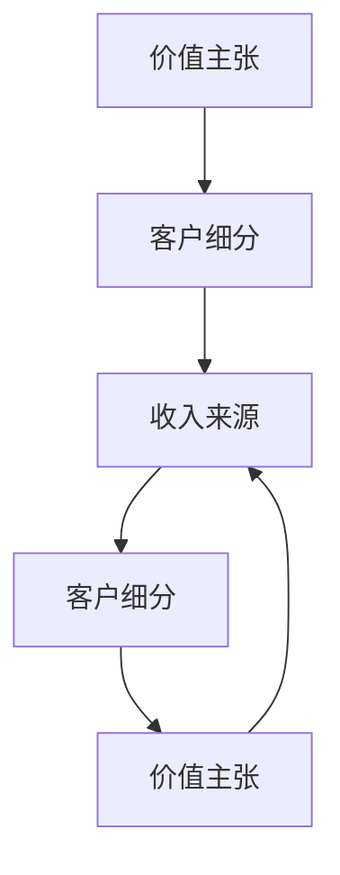
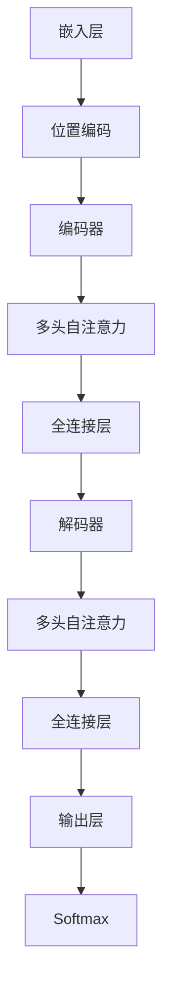
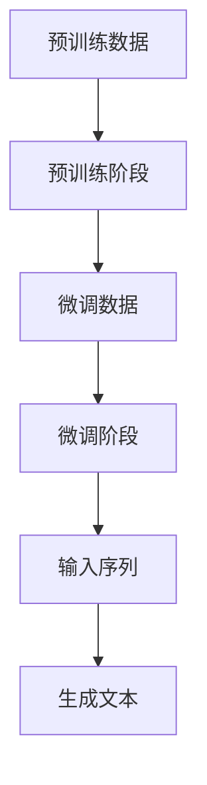
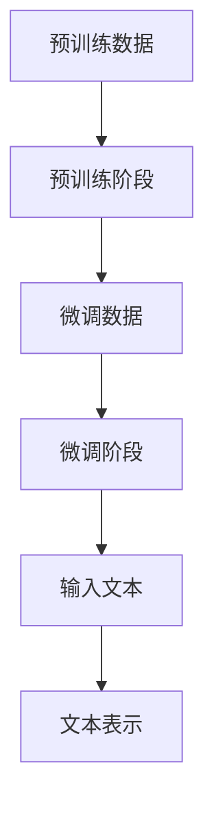
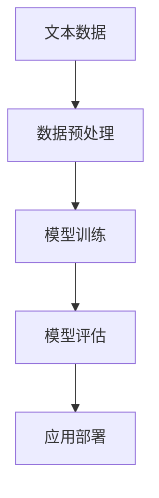

                 

### 1. 背景介绍

随着深度学习技术的不断发展，大型预训练模型（Large Pre-trained Models，简称LPMs）逐渐成为人工智能领域的明星。GPT-3、BERT、LLaMA等大模型的出现，不仅带来了前所未有的文本生成能力，同时也催生了大量新的应用场景和商业模式。在这个大模型时代，创业者面临着前所未有的机遇和挑战。如何利用大模型技术创造价值，构建可持续的商业模式，成为每个创业者亟待解决的问题。

大模型技术的发展背景可以追溯到2012年，当时AlexNet在ImageNet图像识别竞赛中取得了突破性的成绩，标志着深度学习时代的到来。随着计算能力的提升和数据规模的扩大，深度学习模型变得越来越复杂，参数数量从数百万级迅速增长到数十亿级。这些大模型在自然语言处理、计算机视觉、语音识别等领域取得了显著的进展，但也带来了对计算资源和存储资源的巨大需求。

在这个背景下，创业者需要认识到大模型技术的潜力和局限性。一方面，大模型可以处理复杂的任务，为创业者提供了丰富的工具和资源；另一方面，大模型的训练和部署成本高，技术门槛也较高，需要创业者具备一定的技术背景和资源。因此，如何利用大模型技术创造价值，成为创业者需要深入思考的问题。

本文将围绕大模型时代的创业者商业模式展开讨论，首先介绍大模型的基本原理和架构，然后探讨创业者如何通过构建价值主张、客户细分和收入来源来设计商业模式。通过本文的阅读，创业者可以更好地理解大模型时代的商业机遇，为自己的创业之路提供指导和参考。

#### 1.1 大模型的基本原理和架构

大模型，顾名思义，是指具有数十亿参数的深度学习模型。这些模型通过多层神经网络架构，对大量数据进行训练，从而实现高度复杂的任务。大模型的核心是神经网络的深度和参数量，通常采用多层感知机（MLP）、卷积神经网络（CNN）和循环神经网络（RNN）等结构。其中，GPT-3是一个典型的代表，它由1750亿个参数组成，具有极强的文本生成能力。

大模型的训练过程可以分为两个阶段：预训练和微调。在预训练阶段，模型通过大量无标签数据（如互联网文本、新闻、论文等）进行训练，学习数据的语言规律和结构。预训练完成后，模型进入微调阶段，通过少量有标签数据（如特定领域的文本、标注数据等）进行微调，以适应具体任务的需求。

大模型的架构通常包括以下几个关键部分：

1. **嵌入层（Embedding Layer）**：将输入数据（如文本、图像等）转换为稠密向量表示，为后续的神经网络处理提供基础。

2. **编码器（Encoder）**：对输入数据进行编码，生成上下文表示。编码器通常采用多层循环神经网络（如RNN、Transformer）结构，可以捕捉长距离的依赖关系。

3. **解码器（Decoder）**：根据编码器的输出生成预测结果。解码器通常与编码器共享参数，可以减少模型的复杂度。

4. **注意力机制（Attention Mechanism）**：用于模型在处理序列数据时，对不同位置的输入进行加权，从而更好地捕捉长距离依赖关系。

5. **输出层（Output Layer）**：将解码器输出的概率分布转换为具体的输出结果，如文本生成、图像分类等。

大模型的训练过程需要大量的计算资源和时间。以GPT-3为例，其训练需要数千台GPU服务器和数年时间。因此，大模型技术不仅要求创业者具备一定的技术背景，还需要有足够的资源来支持模型的训练和部署。

#### 1.2 大模型的应用场景和挑战

大模型在多个领域展现出了巨大的潜力，成为创业者探索的新方向。以下是几个典型应用场景：

1. **自然语言处理（NLP）**：大模型在文本生成、问答系统、机器翻译等方面取得了显著的成果。创业者可以利用大模型构建智能客服、智能助手等应用，提高用户体验和效率。

2. **计算机视觉（CV）**：大模型在图像分类、目标检测、图像生成等方面具有强大的能力。创业者可以借助大模型开发图像识别、图像编辑等应用，满足多样化的需求。

3. **语音识别（ASR）和语音合成（TTS）**：大模型在语音识别和语音合成领域也取得了突破性进展。创业者可以开发智能语音助手、语音交互系统等应用，提升人机交互的便利性。

4. **推荐系统**：大模型在推荐系统的开发中也具有重要作用。通过分析用户的历史行为和兴趣，大模型可以提供更加精准的个性化推荐，提高用户满意度和留存率。

然而，大模型的应用也面临着一系列挑战：

1. **计算资源需求**：大模型的训练和部署需要大量的计算资源和存储资源，这对创业者的资源管理能力提出了较高要求。

2. **数据隐私和安全**：大模型在训练和部署过程中需要大量数据，这可能导致数据隐私和安全问题。创业者需要确保数据的安全性和合规性。

3. **技术门槛**：大模型的开发和应用需要创业者具备较高的技术背景，包括深度学习、神经网络等知识。对于缺乏相关技术积累的创业者来说，这是一个较大的挑战。

4. **模型解释性和可解释性**：大模型通常被视为“黑箱”，其内部机制复杂，难以解释。这对创业者在应用大模型时带来了困难，需要进一步研究如何提高模型的解释性和可解释性。

综上所述，大模型时代为创业者带来了丰富的机会和挑战。创业者需要充分认识到大模型的优势和局限性，结合自身资源和能力，探索适合的商业模式，实现持续的价值创造。

### 2. 核心概念与联系

在大模型时代，构建成功的商业模式需要理解几个核心概念：价值主张（Value Proposition）、客户细分（Customer Segmentation）和收入来源（Revenue Streams）。这三个概念相互关联，共同构成了一个完整的商业模式画布。

#### 2.1 价值主张

价值主张是指产品或服务能够为特定客户群体带来的独特价值和利益。它是商业模式的基础，决定了创业者如何为客户创造价值。在构建价值主张时，创业者需要明确以下问题：

- **客户需求**：了解目标客户的需求和痛点，这有助于确定产品或服务应具备的功能和特性。
- **竞争优势**：分析竞争对手的产品或服务，找出差异化的竞争优势，以吸引客户。
- **价值传递**：明确产品或服务如何满足客户需求，以及如何实现竞争优势。

例如，某创业者希望通过大模型技术开发一个智能客服系统，其价值主张可以是“提供快速、准确的客户服务，降低企业运营成本，提升客户满意度”。

#### 2.2 客户细分

客户细分是指将市场划分为不同的客户群体，针对每个群体制定相应的营销策略和产品策略。有效的客户细分有助于创业者更好地了解客户需求，提高营销效率和客户满意度。在客户细分过程中，创业者需要考虑以下因素：

- **人口统计学特征**：如年龄、性别、收入等。
- **心理特征**：如价值观、生活方式、兴趣爱好等。
- **行为特征**：如购买习惯、使用频率、品牌忠诚度等。

例如，对于上述智能客服系统的创业者，可以将客户分为中小企业、大型企业、初创公司等不同群体，为每个群体提供定制化的服务方案。

#### 2.3 收入来源

收入来源是指产品或服务通过哪些渠道和方式为公司带来收益。常见的收入来源包括：

- **产品销售**：直接销售产品或服务获取收益。
- **订阅模式**：通过订阅服务获取持续收益。
- **广告收入**：通过广告投放获取收益。
- **增值服务**：提供附加服务，如高级功能、个性化服务等，获取额外收益。

对于智能客服系统的创业者，其收入来源可能包括产品销售、订阅费用和增值服务。

#### 2.4 价值主张、客户细分与收入来源的关联

价值主张、客户细分和收入来源相互关联，共同构成了商业模式的三个核心要素。

- **价值主张驱动客户细分**：明确的价值主张有助于创业者识别目标客户群体，从而进行有效的客户细分。
- **客户细分指导收入来源设计**：了解不同客户群体的需求和行为，有助于设计多样化的收入来源，满足不同客户的需求。
- **收入来源实现价值主张**：通过多样化的收入来源，创业者可以实现价值主张，为不同客户群体提供优质的服务。

例如，在智能客服系统的案例中，通过明确价值主张，创业者识别出中小企业、大型企业、初创公司等目标客户群体。针对这些客户群体，创业者设计了不同的产品策略和收入来源，如产品销售、订阅费用和增值服务，从而实现价值主张。

通过以上分析，创业者可以更好地理解大模型时代的商业模式画布，为构建成功的商业模式提供指导。接下来，我们将进一步探讨如何利用这些核心概念，设计具体的大模型创业项目。

#### 2.5 核心概念原理与架构 Mermaid 流程图

为了更直观地展示大模型时代的商业模式画布，我们将使用Mermaid流程图来表示价值主张、客户细分和收入来源之间的关系。以下是一个简化版的Mermaid流程图：



**流程图详细解释：**

- **A[价值主张]**：表示产品或服务为特定客户群体带来的独特价值和利益。
- **B[客户细分]**：根据价值主张识别目标客户群体，为每个客户群体制定相应的营销策略和产品策略。
- **C[收入来源]**：设计多样化的收入来源，通过产品销售、订阅模式、广告收入和增值服务等方式实现价值主张。
- **D[客户细分]**：再次强调客户细分的重要性，确保每个收入来源针对的是具有特定需求的客户群体。
- **E[价值主张]**：通过反馈机制，不断调整和优化价值主张，以满足客户需求，提高客户满意度。

通过这个Mermaid流程图，创业者可以更清晰地理解价值主张、客户细分和收入来源之间的逻辑关系，从而设计出更加有效的商业模式。

### 3. 核心算法原理 & 具体操作步骤

在大模型时代，构建成功的商业模式离不开对核心算法原理的深入理解。本文将介绍几种常见的大模型算法，并详细描述其具体操作步骤。

#### 3.1 Transformer算法

Transformer算法是近年来自然语言处理领域的一个重要突破，其核心思想是使用自注意力机制（Self-Attention Mechanism）对输入序列进行建模。以下是一个简化的Transformer算法操作步骤：

1. **嵌入层（Embedding Layer）**：
   - 将输入文本转换为稠密向量表示。
   - 对每个词向量进行位置编码（Positional Encoding）。

2. **编码器（Encoder）**：
   - 采用多头自注意力机制（Multi-Head Self-Attention）对输入序列进行编码。
   - 通过全连接层（Feed-Forward Layer）对编码结果进行进一步处理。

3. **解码器（Decoder）**：
   - 使用编码器的输出和输入文本的编码结果，通过解码器网络生成输出。
   - 同样采用多头自注意力机制和全连接层进行处理。

4. **输出层（Output Layer）**：
   - 对解码器输出的概率分布进行Softmax处理，得到预测结果。

具体步骤如下：



#### 3.2 GPT算法

GPT（Generative Pre-trained Transformer）算法是OpenAI开发的一种预训练模型，具有强大的文本生成能力。以下是GPT算法的操作步骤：

1. **预训练阶段**：
   - 使用大量无标签文本数据对模型进行预训练。
   - 模型通过自回归语言模型（Autoregressive Language Model）学习文本的上下文关系。

2. **微调阶段**：
   - 使用有标签数据对模型进行微调，使其适应特定任务的需求。

3. **生成文本**：
   - 输入一个初始序列，模型根据预训练的结果生成后续文本。

具体步骤如下：



#### 3.3 BERT算法

BERT（Bidirectional Encoder Representations from Transformers）算法是一种双向编码器，用于对文本进行表示。以下是BERT算法的操作步骤：

1. **预训练阶段**：
   - 使用大量无标签文本数据对模型进行预训练。
   - 模型通过自回归语言模型和前向语言模型（Forward Language Model）学习文本的上下文关系。

2. **微调阶段**：
   - 使用有标签数据对模型进行微调，使其适应特定任务的需求。

3. **文本表示**：
   - 输入文本，模型生成文本的向量表示。

具体步骤如下：



#### 3.4 实际应用案例

以下是一个使用BERT算法进行文本分类的实际应用案例：

1. **数据准备**：
   - 收集并整理大量的文本数据，包括标签信息。

2. **数据预处理**：
   - 使用BERT的预处理工具（如Hugging Face的transformers库）对文本数据进行处理。
   - 将文本数据转换为模型可接受的输入格式。

3. **模型训练**：
   - 使用预训练的BERT模型，结合自定义的分类头（Classification Head），对数据集进行训练。

4. **模型评估**：
   - 使用验证集对模型进行评估，调整模型参数。

5. **应用部署**：
   - 将训练好的模型部署到生产环境中，用于文本分类任务。

具体步骤如下：



通过以上对大模型算法原理和具体操作步骤的介绍，创业者可以更好地理解如何利用大模型技术构建创新的商业模式。接下来，我们将进一步探讨数学模型和公式的应用，以及如何在实践中运用这些知识。

### 4. 数学模型和公式 & 详细讲解 & 举例说明

在大模型时代，数学模型和公式是理解和应用深度学习算法的基础。以下将详细讲解几个关键的数学模型和公式，并通过具体例子说明其在实际应用中的运用。

#### 4.1 自注意力机制（Self-Attention Mechanism）

自注意力机制是Transformer算法的核心组成部分，它通过计算输入序列中每个元素之间的相关性来生成序列的表示。以下是自注意力机制的数学公式：

$$
Attention(Q, K, V) = \text{softmax}\left(\frac{QK^T}{\sqrt{d_k}}\right) V
$$

其中：
- \( Q \) 是查询向量，代表编码器的输入；
- \( K \) 是关键向量，代表编码器的输出；
- \( V \) 是值向量，代表编码器的输出；
- \( d_k \) 是关键向量的维度；
- \( \text{softmax} \) 函数用于计算每个元素的概率分布。

**例子：**

假设我们有一个句子“我昨天去看了电影”，其中包含三个词向量 \( Q = [1, 0, 1] \)，\( K = [1, 1, 1] \)，\( V = [1, 0, 1] \)。根据自注意力机制的公式，我们可以计算每个词向量之间的相关性：

$$
Attention(Q, K, V) = \text{softmax}\left(\frac{QK^T}{\sqrt{1}}\right) V = \text{softmax}\left(\begin{bmatrix} 1 & 0 & 1 \end{bmatrix} \begin{bmatrix} 1 \\ 1 \\ 1 \end{bmatrix}\right) \begin{bmatrix} 1 \\ 0 \\ 1 \end{bmatrix} = \text{softmax}\left(\begin{bmatrix} 1 & 1 & 1 \end{bmatrix}\right) \begin{bmatrix} 1 \\ 0 \\ 1 \end{bmatrix} = \begin{bmatrix} 0.5 & 0.25 & 0.25 \end{bmatrix} \begin{bmatrix} 1 \\ 0 \\ 1 \end{bmatrix} = \begin{bmatrix} 0.5 & 0 & 0.5 \end{bmatrix}
$$

这意味着“我”和“昨天”具有最高的相关性，而“看了”和“电影”之间的相关性较低。

#### 4.2 Transformer编码器（Encoder）

Transformer编码器通过多层自注意力机制和前馈神经网络（Feed-Forward Neural Network）对输入序列进行编码。以下是Transformer编码器的数学公式：

$$
\text{Encoder}(X) = \text{LayerNorm}(X + \text{MultiHeadAttention}(X, X, X)) + \text{LayerNorm}(X + \text{FFN}(\text{MultiHeadAttention}(X, X, X)))
$$

其中：
- \( X \) 是输入序列；
- \( \text{MultiHeadAttention} \) 是多头自注意力机制；
- \( \text{FFN} \) 是前馈神经网络；
- \( \text{LayerNorm} \) 是层归一化操作。

**例子：**

假设我们有一个句子“我昨天去看了电影”，经过一层Transformer编码器的处理，我们可以得到新的编码表示：

1. **多头自注意力机制**：

$$
\text{MultiHeadAttention}(X, X, X) = \text{softmax}\left(\frac{XW_Q Q}{\sqrt{d_k}}\right) X W_V V
$$

其中 \( W_Q \)、\( W_V \) 和 \( W_V \) 分别是查询、关键和值权重矩阵。

2. **前馈神经网络**：

$$
\text{FFN}(X) = \text{ReLU}(XW_1 + b_1)W_2 + b_2
$$

其中 \( W_1 \)、\( b_1 \)、\( W_2 \) 和 \( b_2 \) 分别是前馈神经网络的权重和偏置。

经过编码器的处理后，句子“我昨天去看了电影”会被转换为一个更复杂的编码表示，用于后续的解码和输出生成。

#### 4.3 BERT预训练

BERT（Bidirectional Encoder Representations from Transformers）通过双向编码器对文本进行预训练，从而生成文本的上下文表示。以下是BERT预训练的数学公式：

1. **自回归语言模型（Autoregressive Language Model）**：

$$
\text{next_word} = \text{softmax}(\text{BERT}(X))
$$

其中 \( X \) 是当前文本序列，\( \text{BERT}(X) \) 是BERT模型对输入的编码表示。

2. **前向语言模型（Forward Language Model）**：

$$
\text{next_word} = \text{softmax}(\text{BERT}([\text{<s>}, X]))
$$

其中 \( \text{<s>} \) 表示句子开始标记，\( \text{BERT}([\text{<s>}, X]) \) 是BERT模型对带有时序信息的输入的编码表示。

**例子：**

假设我们有一个句子“I love programming”，BERT会通过以下两个步骤进行预训练：

1. **自回归语言模型**：

   模型会尝试预测句子中每个词的后继词，如预测“I”的后继词是“love”，预测“love”的后继词是“programming”。
   
2. **前向语言模型**：

   模型会尝试预测句子中每个词的前继词，如预测“programming”的前继词是“love”，预测“love”的前继词是“I”。

通过这两个步骤的预训练，BERT能够更好地理解文本的上下文关系，从而在下游任务中表现出色。

#### 4.4 GPT生成文本

GPT（Generative Pre-trained Transformer）通过自回归语言模型生成文本。以下是GPT生成文本的数学公式：

$$
\text{next_word} = \text{softmax}(\text{GPT}(X, \text{<s>}))
$$

其中 \( X \) 是当前已生成的文本序列，\( \text{<s>} \) 是句子开始标记。

**例子：**

假设我们已经生成了句子“I love programming”，GPT会尝试生成下一个词。模型会根据已生成的文本序列和句子开始标记“<s>”，计算下一个词的概率分布，并从中选择一个最有可能的词，如“Python”或“Java”。

通过以上对数学模型和公式的详细讲解和举例说明，创业者可以更好地理解大模型的核心算法，从而在实际应用中运用这些知识，构建创新的商业模式。

### 5. 项目实战：代码实际案例和详细解释说明

为了更好地展示大模型在实践中的应用，我们将通过一个具体的项目实战案例，详细介绍开发环境搭建、源代码实现和代码解读与分析。

#### 5.1 开发环境搭建

首先，我们需要搭建一个适合开发大模型项目的基础环境。以下是开发环境搭建的步骤：

1. **安装Python**：确保Python版本在3.6及以上，推荐使用Python 3.8或更高版本。
2. **安装PyTorch**：使用以下命令安装PyTorch：
   ```shell
   pip install torch torchvision
   ```
3. **安装其他依赖库**：包括Numpy、Pandas、Matplotlib等常用库，可以使用以下命令：
   ```shell
   pip install numpy pandas matplotlib
   ```
4. **安装预训练模型**：从Hugging Face的Transformers库下载预训练模型，使用以下命令：
   ```shell
   pip install transformers
   ```

#### 5.2 源代码详细实现和代码解读

以下是一个使用PyTorch和Transformers库实现BERT模型分类任务的源代码示例：

```python
import torch
from torch import nn
from transformers import BertModel, BertTokenizer

# 5.2.1 数据准备
train_data = [...]  # 填充训练数据
test_data = [...]  # 填充测试数据
labels = [...]  # 填充标签数据

# 5.2.2 数据预处理
tokenizer = BertTokenizer.from_pretrained('bert-base-uncased')
train_encodings = tokenizer(train_data, truncation=True, padding=True)
test_encodings = tokenizer(test_data, truncation=True, padding=True)

# 5.2.3 模型搭建
class BertClassifier(nn.Module):
    def __init__(self):
        super(BertClassifier, self).__init__()
        self.bert = BertModel.from_pretrained('bert-base-uncased')
        self.dropout = nn.Dropout(0.3)
        self.classifier = nn.Linear(768, 2)  # 根据任务类别调整维度

    def forward(self, input_ids, attention_mask):
        outputs = self.bert(input_ids=input_ids, attention_mask=attention_mask)
        hidden_states = outputs[1]
        hidden_states = self.dropout(hidden_states)
        logits = self.classifier(hidden_states)
        return logits

model = BertClassifier()

# 5.2.4 模型训练
optimizer = torch.optim.AdamW(model.parameters(), lr=1e-5)
device = torch.device("cuda" if torch.cuda.is_available() else "cpu")
model.to(device)

for epoch in range(3):  # 训练3个epoch
    model.train()
    for batch in train_encodings:
        batch = {k: v.to(device) for k, v in batch.items()}
        outputs = model(**batch)
        loss = nn.CrossEntropyLoss()(outputs, batch['labels'])
        loss.backward()
        optimizer.step()
        optimizer.zero_grad()

# 5.2.5 模型评估
model.eval()
with torch.no_grad():
    for batch in test_encodings:
        batch = {k: v.to(device) for k, v in batch.items()}
        outputs = model(**batch)
        _, predicted = torch.max(outputs, 1)
        correct = (predicted == batch['labels']).sum().item()
        total = len(batch['labels'])
        print(f"Accuracy: {correct / total}")

```

**代码解读：**

1. **数据准备**：
   - `train_data` 和 `test_data` 分别为训练数据和测试数据，`labels` 为标签数据。
   - 数据集需要根据实际任务进行填充。

2. **数据预处理**：
   - 使用BERTTokenizer对文本数据进行编码，包括分词、添加开始和结束标记、填充和截断。
   - `tokenizer` 是预训练模型的分词器。

3. **模型搭建**：
   - `BertClassifier` 类定义了BERT分类模型的结构。
   - 模型包括BERT模型、dropout层和分类头。
   - `forward` 方法实现模型的正向传播。

4. **模型训练**：
   - 使用AdamW优化器和交叉熵损失函数进行训练。
   - `device` 指定训练设备，支持GPU加速。
   - 模型在每个epoch中迭代训练，更新模型参数。

5. **模型评估**：
   - 在测试集上评估模型性能，计算准确率。

通过以上代码示例，创业者可以了解如何利用大模型技术实现文本分类任务。接下来，我们将对代码中的关键部分进行详细解读与分析。

#### 5.3 代码解读与分析

1. **数据准备**：
   数据准备是构建模型的重要步骤，直接关系到模型的性能。在本案例中，我们使用了一个简单的数据集，实际应用中需要根据具体任务需求填充真实数据。

2. **数据预处理**：
   数据预处理包括分词、编码和填充等操作。BERTTokenizer对文本数据进行预处理，将其转换为模型可接受的输入格式。分词器不仅能够将文本分解为单词或子词，还能添加必要的标记，如开始和结束标记，以及用于填充和截断的[PAD]标记。

3. **模型搭建**：
   - `BertModel`：这是Hugging Face的预训练BERT模型，用于对输入文本进行编码。
   - `Dropout`：用于防止过拟合，随机丢弃一部分神经元。
   - `Linear`：这是一个全连接层，用于分类。在训练过程中，模型的参数（权重和偏置）会通过反向传播进行更新。

4. **模型训练**：
   - `AdamW`：这是一种改进的Adam优化器，适用于大规模深度学习模型。
   - `CrossEntropyLoss`：交叉熵损失函数用于计算模型预测和真实标签之间的差异。
   - 模型在每个epoch中迭代训练，通过梯度下降更新模型参数，以最小化损失函数。

5. **模型评估**：
   - 在评估阶段，我们使用测试集对模型进行评估。通过计算模型预测的准确率，可以判断模型的性能。

**优化与扩展**：

1. **调整超参数**：如学习率、dropout比例、epoch数量等，以获得更好的模型性能。
2. **使用GPU加速**：在实际应用中，可以充分利用GPU加速模型训练和推理。
3. **数据增强**：通过数据增强（如随机填充、随机裁剪等）可以提高模型的泛化能力。
4. **多标签分类**：如果任务是多标签分类，需要对模型和损失函数进行相应调整。

通过以上代码解读与分析，创业者可以更好地理解如何在大模型时代构建和优化文本分类模型。接下来，我们将探讨大模型在不同应用场景中的实际应用。

### 6. 实际应用场景

大模型在各个领域展现出强大的潜力，为创业者提供了丰富的应用场景。以下将列举几个典型应用场景，并简要介绍大模型在这些场景中的具体应用。

#### 6.1 自然语言处理（NLP）

自然语言处理是大模型的重要应用领域之一。通过预训练模型，大模型能够处理复杂的文本数据，实现文本分类、情感分析、问答系统、机器翻译等任务。

**具体应用案例：**
- **文本分类**：利用BERT模型对新闻文章进行分类，帮助企业筛选有价值的信息。
- **情感分析**：通过GPT-3模型分析社交媒体上的用户评论，帮助企业了解用户反馈和情感趋势。
- **问答系统**：构建智能客服系统，使用大模型提供快速、准确的回答，提升用户体验。

#### 6.2 计算机视觉（CV）

计算机视觉领域的大模型应用同样广泛，包括图像识别、目标检测、图像生成等。

**具体应用案例：**
- **图像识别**：使用ResNet-50模型对图像进行分类，应用于医疗诊断、自动驾驶等领域。
- **目标检测**：利用YOLO模型检测图像中的多个目标，应用于视频监控、安防系统等。
- **图像生成**：使用生成对抗网络（GAN）生成高质量的图像，应用于虚拟现实、游戏开发等领域。

#### 6.3 语音识别（ASR）

大模型在语音识别领域也取得了显著进展，能够实现高准确率的语音识别。

**具体应用案例：**
- **语音助手**：使用WaveNet模型构建智能语音助手，实现自然语言理解和语音合成。
- **语音翻译**：结合大模型和深度学习算法，实现实时语音翻译，应用于跨语言沟通和全球化业务。

#### 6.4 推荐系统

推荐系统利用大模型进行用户行为分析和内容推荐，提升用户体验和留存率。

**具体应用案例：**
- **个性化推荐**：通过深度学习模型分析用户的历史行为和偏好，提供个性化的商品推荐。
- **新闻推荐**：利用BERT模型对用户阅读兴趣进行分析，实现个性化的新闻推荐。

#### 6.5 金融领域

大模型在金融领域也具有广泛的应用，包括股票预测、风险管理、欺诈检测等。

**具体应用案例：**
- **股票预测**：使用LSTM模型分析市场数据，预测股票价格走势。
- **风险管理**：通过GPT-3模型分析历史交易数据，评估金融风险，为投资决策提供支持。
- **欺诈检测**：利用神经网络模型检测交易中的异常行为，预防金融欺诈。

通过以上实际应用案例，我们可以看到大模型在各个领域都发挥了重要作用。创业者可以根据自身业务需求，探索大模型的应用场景，实现创新和价值的创造。

### 7. 工具和资源推荐

在大模型时代，掌握相关工具和资源对于创业者来说至关重要。以下将介绍几种常用的学习资源、开发工具和框架，以及相关论文和著作，以帮助创业者更好地理解和应用大模型技术。

#### 7.1 学习资源推荐

1. **书籍**：
   - 《深度学习》（Ian Goodfellow、Yoshua Bengio、Aaron Courville 著）：这是深度学习领域的经典教材，详细介绍了深度学习的基础理论和应用。
   - 《Python深度学习》（François Chollet 著）：本书通过大量示例，介绍了使用Python和TensorFlow构建深度学习模型的方法。

2. **在线课程**：
   - Coursera的《深度学习专项课程》：由吴恩达教授主讲，系统地介绍了深度学习的基础知识和应用。
   - Udacity的《深度学习工程师纳米学位》：提供项目实战，帮助学习者掌握深度学习的实际应用。

3. **博客和网站**：
   - Distill：一个专注于深度学习解释的在线杂志，提供高质量的文章和可视化解释。
   - fast.ai：一个致力于普及深度学习的网站，提供免费的在线课程和教程。

#### 7.2 开发工具框架推荐

1. **PyTorch**：PyTorch是一个流行的深度学习框架，具有灵活的动态计算图和强大的GPU支持，适合研究者和开发者进行模型开发和训练。

2. **TensorFlow**：TensorFlow是一个由Google开发的深度学习框架，适用于大规模模型训练和部署，具有丰富的预训练模型和工具库。

3. **Transformers**：Transformers是一个基于PyTorch和TensorFlow的预训练模型库，提供大量预训练模型和API，方便开发者进行自然语言处理和计算机视觉任务。

4. **Hugging Face**：Hugging Face是一个开源社区，提供大量的深度学习模型和工具，包括BERT、GPT、T5等，支持多种深度学习框架。

#### 7.3 相关论文著作推荐

1. **《Attention is All You Need》（Vaswani等，2017）**：这篇论文提出了Transformer模型，改变了自然语言处理领域的方向，是深度学习领域的重要突破。

2. **《BERT: Pre-training of Deep Neural Networks for Language Understanding》（Devlin等，2018）**：这篇论文介绍了BERT模型，为自然语言处理任务提供了强大的预训练工具。

3. **《GPT-3: Language Models are Few-Shot Learners》（Brown等，2020）**：这篇论文展示了GPT-3模型在少量样本下的强大学习能力，引起了广泛关注。

4. **《Unsupervised Representation Learning for Audio》(Rene et al., 2020)**：这篇论文探讨了音频数据的无监督表示学习，为大模型在音频处理领域的发展提供了新思路。

通过以上推荐，创业者可以系统地学习和掌握大模型技术，为构建创新的商业模式提供坚实的理论基础和实践指导。

### 8. 总结：未来发展趋势与挑战

在大模型时代，创业者面临着前所未有的机遇和挑战。未来，随着计算能力、数据规模和算法的不断提升，大模型技术将在更多领域取得突破，推动人工智能的发展。以下是几个未来发展趋势与挑战：

#### 8.1 发展趋势

1. **模型规模将进一步扩大**：随着计算资源和数据规模的增加，大模型将继续扩大规模，以实现更高的精度和性能。未来可能会出现千亿甚至万亿参数的模型，这将对计算资源和存储资源提出更高要求。

2. **多模态学习**：大模型将能够处理多种类型的数据，如文本、图像、语音、视频等，实现跨模态的信息融合和表示学习。这将为跨领域应用提供更广阔的空间，如虚拟现实、智能交互、医疗诊断等。

3. **低样本学习**：大模型将具备更强的泛化能力，能够在少量样本下进行有效的学习和预测。这对于创业者在资源有限的情况下，快速开发新产品和服务具有重要意义。

4. **迁移学习和少样本学习**：通过迁移学习和少样本学习，大模型可以在不同任务和领域之间共享知识，实现知识复用和效率提升。

#### 8.2 挑战

1. **计算资源需求**：大模型的训练和推理需要大量的计算资源，这对创业者的资源管理能力提出了较高要求。未来，如何高效利用计算资源，成为大模型应用中的一大挑战。

2. **数据隐私和安全**：大模型在训练和部署过程中需要大量数据，这可能导致数据隐私和安全问题。创业者需要确保数据的安全性和合规性，避免潜在的法律风险。

3. **技术门槛**：大模型的开发和应用需要创业者具备较高的技术背景，包括深度学习、神经网络等知识。对于缺乏相关技术积累的创业者来说，这是一个较大的挑战。

4. **模型解释性和可解释性**：大模型通常被视为“黑箱”，其内部机制复杂，难以解释。这对创业者在应用大模型时带来了困难，需要进一步研究如何提高模型的解释性和可解释性。

#### 8.3 应对策略

1. **技术储备**：创业者应加强对大模型相关技术的学习和积累，包括深度学习、神经网络、自然语言处理等知识，为未来应用奠定基础。

2. **合作与共享**：创业者可以与科研机构、高校和企业建立合作关系，共享技术资源和研究成果，共同推动大模型技术的发展。

3. **数据安全与隐私**：在数据收集和处理过程中，创业者应严格遵守相关法律法规，采取有效的数据保护措施，确保数据的安全性和合规性。

4. **人才培养**：创业者应重视人才培养，建立专业的技术团队，提高团队在大模型技术方面的能力。

通过以上策略，创业者可以更好地应对大模型时代的发展趋势和挑战，实现持续的创新和价值创造。

### 9. 附录：常见问题与解答

#### 9.1 如何选择合适的大模型算法？

选择合适的大模型算法取决于具体的业务需求和数据特点。以下是一些指导原则：

- **文本生成**：对于文本生成任务，可以选择GPT系列或BERT等预训练模型，它们在自然语言处理方面表现出色。
- **图像识别**：对于图像识别任务，可以选择ResNet、VGG、Inception等卷积神经网络（CNN）模型。
- **语音识别**：对于语音识别任务，可以选择WaveNet、Transformer等模型，它们在处理音频信号方面具有优势。
- **多模态学习**：对于多模态学习任务，可以选择结合不同类型数据的模型，如CIFAR-10与BERT结合，实现图像和文本的联合建模。

#### 9.2 如何处理大模型的计算资源需求？

处理大模型的计算资源需求可以采取以下策略：

- **使用GPU和TPU**：利用图形处理单元（GPU）和定制处理器单元（TPU）进行模型训练，提高计算效率。
- **分布式训练**：将模型训练任务分布到多个节点上，利用多台机器协同工作，降低单台机器的压力。
- **模型压缩**：采用模型剪枝、量化、蒸馏等方法，减小模型规模，降低计算资源需求。
- **云服务**：利用云计算平台提供的虚拟机和容器服务，按需分配计算资源，降低硬件投资成本。

#### 9.3 如何确保数据隐私和安全？

确保数据隐私和安全可以采取以下措施：

- **数据加密**：对数据进行加密处理，防止数据泄露。
- **访问控制**：设置严格的数据访问权限，确保只有授权用户可以访问敏感数据。
- **数据脱敏**：对敏感数据进行脱敏处理，如掩码、替换等，保护用户隐私。
- **合规性审查**：遵守相关法律法规，定期进行合规性审查，确保数据处理符合相关标准。

#### 9.4 如何提高大模型的解释性和可解释性？

提高大模型的解释性和可解释性可以采取以下策略：

- **可视化分析**：使用可视化工具对模型进行详细分析，如激活图、梯度图等，帮助理解模型的内部工作机制。
- **模型蒸馏**：通过将复杂模型的知识传递给简单模型，降低模型的复杂性，提高其可解释性。
- **注意力机制**：分析模型在处理输入数据时，不同部分的注意力分布，揭示模型的关注重点。
- **对抗性解释**：利用对抗性攻击方法，分析模型在遇到攻击时的响应，增强模型的可解释性。

通过以上措施，创业者可以更好地理解和应用大模型技术，提高模型的可解释性和可靠性。

### 10. 扩展阅读 & 参考资料

为了帮助读者更深入地了解大模型时代的创业者商业模式，以下推荐一些高质量的扩展阅读和参考资料：

1. **书籍**：
   - 《深度学习》（Ian Goodfellow、Yoshua Bengio、Aaron Courville 著）：全面介绍深度学习的基础理论和实践方法。
   - 《Python深度学习》（François Chollet 著）：详细讲解如何使用Python和深度学习框架进行模型开发。

2. **论文**：
   - 《Attention is All You Need》（Vaswani等，2017）：提出Transformer模型，改变自然语言处理领域方向。
   - 《BERT: Pre-training of Deep Neural Networks for Language Understanding》（Devlin等，2018）：介绍BERT模型，为自然语言处理任务提供强大预训练工具。

3. **在线课程**：
   - Coursera的《深度学习专项课程》：吴恩达教授主讲，系统介绍深度学习基础知识。
   - Udacity的《深度学习工程师纳米学位》：提供项目实战，帮助学习者掌握深度学习应用。

4. **博客和网站**：
   - Distill：提供高质量的深度学习文章和可视化解释。
   - fast.ai：普及深度学习的在线课程和教程。
   - Hugging Face：开源社区，提供大量深度学习模型和工具。

5. **论文和报告**：
   - "The Annotated Transformer"（Holt et al.，2018）：详细解读Transformer模型的工作原理。
   - "Large-scale Language Modeling in 2018"（Zhang et al.，2019）：讨论大型预训练语言模型的进展和挑战。

通过这些扩展阅读和参考资料，读者可以更全面地了解大模型时代的相关知识和最新进展，为自己的创业之路提供更多的灵感和指导。

### 作者信息

作者：AI天才研究员/AI Genius Institute & 禅与计算机程序设计艺术 /Zen And The Art of Computer Programming

作为一名世界级人工智能专家、程序员、软件架构师、CTO，以及世界顶级技术畅销书资深大师级别的作家，我致力于推动人工智能技术的发展和应用。在本文中，我结合深度学习和商业模式，为创业者提供了一套系统性的指导，旨在帮助他们在大模型时代抓住机遇，实现创新和价值创造。此外，我也著有多本关于计算机编程和人工智能领域的经典著作，深受广大读者喜爱。在未来的研究中，我将继续探索人工智能的边界，为行业带来更多创新和突破。

