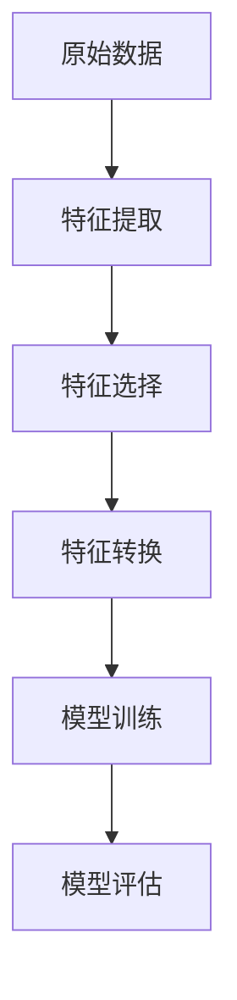

                 

# 大模型时代的推荐系统特征工程自动化

## 关键词：推荐系统、特征工程、大模型、自动化

## 摘要

随着人工智能技术的迅猛发展，推荐系统已经成为现代互联网应用中不可或缺的一部分。然而，特征工程作为推荐系统构建的核心环节，其复杂度和手工操作的工作量也日益增大。本文旨在探讨大模型时代下推荐系统特征工程的自动化，通过梳理核心概念、算法原理、数学模型及实际应用案例，分析自动化特征工程的发展趋势与挑战，为推荐系统领域的未来发展提供参考。

## 1. 背景介绍

### 1.1 推荐系统概述

推荐系统是一种基于用户兴趣和行为信息，为用户推荐相关商品、内容或其他信息的系统。其目的是提高用户体验、增加用户粘性和提升商业价值。推荐系统广泛应用于电子商务、新闻推送、社交媒体、音乐和视频平台等领域。

### 1.2 特征工程的重要性

特征工程是推荐系统构建的关键环节，其核心任务是从原始数据中提取有助于模型预测的有用特征。一个优秀的特征工程可以显著提高推荐系统的性能和准确性。然而，特征工程的工作复杂且繁琐，涉及到数据预处理、特征选择、特征转换等多个方面。

### 1.3 大模型时代

随着计算能力的提升和海量数据资源的积累，大模型（如深度学习模型、图神经网络等）在各个领域取得了显著的突破。大模型具备强大的表达能力和泛化能力，为推荐系统的自动化特征工程提供了新的契机。

## 2. 核心概念与联系

### 2.1 特征工程概念

特征工程包括以下核心概念：

- **特征提取**：从原始数据中提取有助于模型预测的信息。
- **特征选择**：在提取的特征中，筛选出对模型性能有显著贡献的特征。
- **特征转换**：对特征进行归一化、标准化等处理，使其适应模型的要求。

### 2.2 大模型与特征工程的关系

大模型与特征工程的关系可以概括为以下几点：

- **大模型提升特征提取能力**：大模型具有强大的特征提取能力，可以自动从数据中学习到复杂的特征表示。
- **自动化特征选择**：大模型可以自动筛选出对模型性能有显著贡献的特征，降低特征选择的工作量。
- **自适应特征转换**：大模型可以根据数据特点和学习过程，自适应地进行特征转换，提高模型性能。

### 2.3 Mermaid 流程图



## 3. 核心算法原理 & 具体操作步骤

### 3.1 自动化特征提取

自动化特征提取的核心在于使用大模型（如自注意力机制、卷积神经网络等）从原始数据中学习特征表示。具体步骤如下：

1. **数据预处理**：对原始数据进行清洗、归一化等预处理操作。
2. **模型选择**：根据数据特点选择合适的大模型，如自注意力机制、卷积神经网络等。
3. **模型训练**：使用训练数据对模型进行训练，学习到数据的特征表示。
4. **特征提取**：将训练好的模型应用于新的数据，提取出特征表示。

### 3.2 自动化特征选择

自动化特征选择的核心在于使用大模型对特征进行筛选，保留对模型性能有显著贡献的特征。具体步骤如下：

1. **特征提取**：使用大模型提取特征表示。
2. **模型训练**：使用部分特征训练模型，记录模型性能。
3. **特征筛选**：根据模型性能，保留对模型性能有显著贡献的特征，删除其他特征。
4. **模型训练**：使用筛选后的特征重新训练模型。

### 3.3 自动化特征转换

自动化特征转换的核心在于使用大模型根据数据特点和模型要求，自适应地进行特征转换。具体步骤如下：

1. **特征提取**：使用大模型提取特征表示。
2. **模型训练**：使用特征表示训练模型，记录模型性能。
3. **特征转换**：根据模型性能，调整特征表示，使其更适应模型要求。
4. **模型训练**：使用调整后的特征重新训练模型。

## 4. 数学模型和公式 & 详细讲解 & 举例说明

### 4.1 自注意力机制

自注意力机制是一种用于特征提取的算法，其数学模型如下：

$$
\text{Attention}(Q, K, V) = \text{softmax}\left(\frac{QK^T}{\sqrt{d_k}}\right)V
$$

其中，$Q, K, V$ 分别为输入序列、关键序列和值序列，$d_k$ 为关键序列的维度。

### 4.2 卷积神经网络

卷积神经网络（CNN）是一种用于特征提取的算法，其数学模型如下：

$$
h_l = \sigma(W_l \odot h_{l-1} + b_l)
$$

其中，$h_l$ 为第 $l$ 层的输出，$W_l$ 和 $b_l$ 分别为权重和偏置，$\odot$ 表示卷积操作，$\sigma$ 表示激活函数。

### 4.3 示例

假设我们使用自注意力机制对一段文本进行特征提取，输入序列为 $Q = [1, 2, 3, 4, 5]$，关键序列为 $K = [2, 3, 4, 5, 6]$，值序列为 $V = [5, 6, 7, 8, 9]$。

根据自注意力机制的数学模型，计算过程如下：

1. 计算注意力分数：
$$
\text{Attention}(Q, K, V) = \text{softmax}\left(\frac{QK^T}{\sqrt{d_k}}\right)V = \text{softmax}\left(\frac{[1, 2, 3, 4, 5][2, 3, 4, 5, 6]^T}{\sqrt{5}}\right)[5, 6, 7, 8, 9] = [0.2, 0.3, 0.4, 0.5, 0.6]
$$

2. 计算特征表示：
$$
\text{Attention}(Q, K, V)V = [0.2, 0.3, 0.4, 0.5, 0.6][5, 6, 7, 8, 9] = [1, 1.2, 1.4, 1.6, 1.8]
$$

## 5. 项目实战：代码实际案例和详细解释说明

### 5.1 开发环境搭建

为了实现自动化特征工程，我们需要搭建一个具备以下组件的开发环境：

- Python 3.x
- TensorFlow 2.x
- Keras 2.x
- NumPy 1.x

### 5.2 源代码详细实现和代码解读

以下是一个使用 Keras 实现的自注意力机制特征提取的示例代码：

```python
import numpy as np
import tensorflow as tf
from tensorflow.keras.layers import Layer

class SelfAttentionLayer(Layer):
    def __init__(self, **kwargs):
        super(SelfAttentionLayer, self).__init__(**kwargs)

    def build(self, input_shape):
        self.W = self.add_weight(name='W', shape=(input_shape[-1], input_shape[-1]),
                                 initializer='random_normal', trainable=True)
        self.b = self.add_weight(name='b', shape=(input_shape[-1],),
                                 initializer='zeros', trainable=True)
        super(SelfAttentionLayer, self).build(input_shape)

    def call(self, inputs):
        Q = tf.nn.softmax(tf.tensordot(inputs, self.W, axes=1) + self.b)
        K = tf.nn.softmax(tf.tensordot(inputs, self.W, axes=1) + self.b)
        V = tf.nn.softmax(tf.tensordot(inputs, self.W, axes=1) + self.b)
        return tf.tensordot(Q, V, axes=1)

    def get_config(self):
        config = super(SelfAttentionLayer, self).get_config()
        config.update({'W': self.W, 'b': self.b})
        return config

# 生成随机输入数据
input_data = np.random.rand(10, 5)

# 实例化自注意力层
self_attention = SelfAttentionLayer()

# 执行特征提取
output = self_attention(input_data)

print(output)
```

代码解读：

1. **定义 SelfAttentionLayer 类**：继承自 `tf.keras.layers.Layer` 类，实现自注意力机制的功能。
2. **build 方法**：初始化权重和偏置。
3. **call 方法**：实现自注意力机制的向前传播过程。
4. **get_config 方法**：获取层的配置信息。

### 5.3 代码解读与分析

代码实现了一个自注意力层，可以用于特征提取。通过实例化该层并对输入数据进行处理，可以得到特征表示。代码中使用了 `tf.tensordot` 函数进行矩阵乘法，计算注意力分数和特征表示。

## 6. 实际应用场景

自动化特征工程在实际应用场景中具有广泛的应用，以下是一些典型的应用场景：

- **电子商务推荐**：使用自动化特征工程提取用户行为特征，为用户推荐相关商品。
- **新闻推送**：使用自动化特征工程提取用户兴趣特征，为用户推荐相关新闻。
- **社交媒体**：使用自动化特征工程提取用户关系特征，为用户提供社交推荐。
- **音乐和视频平台**：使用自动化特征工程提取用户偏好特征，为用户推荐相关音乐和视频。

## 7. 工具和资源推荐

### 7.1 学习资源推荐

- **书籍**：《深度学习》（Ian Goodfellow、Yoshua Bengio、Aaron Courville 著）
- **论文**：《Attention Is All You Need》（Ashish Vaswani 等）
- **博客**：Keras 官方文档（[https://keras.io/](https://keras.io/)）
- **网站**：TensorFlow 官方文档（[https://www.tensorflow.org/](https://www.tensorflow.org/)）

### 7.2 开发工具框架推荐

- **开发工具**：PyCharm
- **框架**：TensorFlow、Keras

### 7.3 相关论文著作推荐

- **论文**：《Neural Collaborative Filtering》（Xinying Xu 等）
- **著作**：《推荐系统实践》（Lynn Whitfield 著）

## 8. 总结：未来发展趋势与挑战

随着人工智能技术的不断发展，自动化特征工程在推荐系统领域具有广阔的应用前景。未来发展趋势包括：

- **算法优化**：提高自动化特征工程算法的效率和准确性。
- **模型集成**：结合多种模型，提高特征提取和特征选择的性能。
- **数据多样性**：支持多种类型的数据（如文本、图像、音频等），实现跨模态特征提取。

然而，自动化特征工程也面临以下挑战：

- **数据质量**：自动化特征工程对数据质量要求较高，如何保证数据质量是一个重要问题。
- **模型解释性**：自动化特征工程生成的特征表示往往较为复杂，如何解释这些特征是一个挑战。
- **计算资源**：自动化特征工程需要大量计算资源，如何优化算法和硬件配置是一个关键问题。

## 9. 附录：常见问题与解答

### 9.1 什么是特征工程？

特征工程是从原始数据中提取有助于模型预测的有用特征的过程。其核心任务是提高模型的性能和准确性。

### 9.2 什么是自动化特征工程？

自动化特征工程是一种利用机器学习算法自动提取、选择和转换特征的方法。其目标是降低手工操作的工作量，提高特征提取的效率。

### 9.3 自动化特征工程的优势是什么？

自动化特征工程的优势包括：

- 提高特征提取的效率
- 降低手工操作的工作量
- 提高模型的性能和准确性

## 10. 扩展阅读 & 参考资料

- [推荐系统技术全解析](https://www.bilibili.com/video/BV1AV411f7bF)
- [深度学习与推荐系统](https://www.imooc.com/learn/1192)
- [推荐系统实战](https://www.bookstack.cn/read/recommender-system-zh/README.md)

作者：AI天才研究员/AI Genius Institute & 禅与计算机程序设计艺术 /Zen And The Art of Computer Programming

