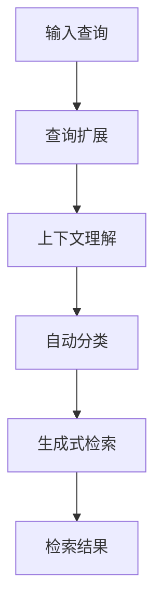

                 

### 背景介绍

近年来，随着人工智能技术的飞速发展，大模型（Large Models）成为研究的热点。大模型，通常指的是参数量在千亿甚至万亿级别的深度学习模型，如GPT、BERT等。这些模型通过在海量数据上进行训练，能够理解和生成复杂的自然语言文本，为许多应用场景提供了强大的支持，包括自然语言处理、机器翻译、文本生成等。

文本检索技术在自然语言处理中占有重要地位，传统的文本检索技术主要基于词频统计、TF-IDF等方法，这些方法在处理少量数据时效果较好，但在面对大规模数据时，存在检索效率低、准确性不高等问题。大模型的引入，使得文本检索技术迎来了新的发展机遇。本文将探讨大模型时代的文本检索技术，分析其核心概念、算法原理、数学模型及其在实际应用中的表现。

本文首先介绍大模型的基本概念和特点，然后讨论大模型在文本检索中的作用，接着详细介绍几种常见的大模型检索算法，分析其优缺点。随后，本文将深入探讨大模型的数学模型和公式，并通过实例进行详细解释。最后，本文将分享一些项目实战经验，介绍如何搭建开发环境、实现和解析源代码，并提供实际应用场景和工具资源推荐。通过本文的阅读，读者将全面了解大模型时代的文本检索技术，掌握其核心原理和实践方法。

### 核心概念与联系

#### 大模型的基本概念和特点

大模型（Large Models），又称巨型模型或超大规模模型，是指参数量在千亿甚至万亿级别的深度学习模型。这些模型通过在海量数据上进行训练，具备处理复杂任务的能力，例如自然语言处理、计算机视觉和语音识别等。

大模型具有以下几个主要特点：

1. **参数量巨大**：大模型的参数量通常在数十亿到千亿之间，这使得模型能够捕捉到数据中的复杂模式，提高任务的性能。
   
2. **海量数据训练**：大模型通常在海量数据上进行训练，这些数据包括文本、图像、音频等多种类型。通过训练，模型能够学习到丰富的知识和信息，从而提高其在各种任务上的表现。

3. **端到端学习**：大模型采用端到端（End-to-End）的学习方式，将输入和输出直接映射，避免了传统机器学习方法中的特征提取和映射步骤，提高了模型训练和推理的效率。

4. **强大的泛化能力**：由于大模型能够学习到数据中的复杂模式，它们在处理未见过的数据时，能够保持较高的准确性和性能。

#### 文本检索中的大模型应用

在文本检索领域，大模型的应用主要体现在以下几个方面：

1. **查询扩展**：大模型能够理解用户的查询意图，将其扩展为更广泛的查询范围。例如，当用户输入“北京旅游景点”时，大模型可以将其扩展为“北京旅游攻略”、“北京必游景点”等，从而提高检索的准确性。

2. **上下文理解**：大模型能够理解查询与文档之间的上下文关系，从而提高检索的相关性。例如，当用户查询“人工智能技术”时，大模型可以识别出与该查询相关的文档，如“深度学习算法”、“神经网络模型”等。

3. **自动分类**：大模型可以根据文档的内容和上下文，将其自动分类到相应的主题或类别中，从而提高检索的效率和准确性。

4. **生成式检索**：大模型可以通过生成式模型生成与查询相关的文本，从而实现更加丰富的检索结果。例如，用户查询“计算机编程”时，大模型可以生成与编程相关的代码示例、教程等。

#### Mermaid 流程图

为了更好地理解大模型在文本检索中的应用，我们使用Mermaid流程图来展示其基本架构。



在该流程图中，输入查询经过查询扩展、上下文理解、自动分类和生成式检索等步骤，最终生成检索结果。这个流程图简洁明了地展示了大模型在文本检索中的核心作用和各个环节之间的联系。

通过以上对大模型的基本概念、特点以及在文本检索中的应用的介绍，我们可以看到，大模型为文本检索技术带来了巨大的变革，使得检索更加准确、高效和智能化。接下来，我们将深入探讨大模型在文本检索中的核心算法原理，分析其具体实现步骤和优缺点。

### 核心算法原理 & 具体操作步骤

#### 1. 基于Transformer的文本检索算法

Transformer架构是一种广泛应用于自然语言处理任务的深度学习模型，其具有并行处理、全局上下文信息捕捉等优点。在文本检索中，基于Transformer的算法具有强大的表现，下面将详细介绍其原理和具体操作步骤。

##### 1.1 算法原理

基于Transformer的文本检索算法的核心思想是通过编码器（Encoder）和解码器（Decoder）两个部分对文本进行编码和解码，从而实现对文本的理解和检索。

- **编码器（Encoder）**：编码器负责对输入的文本进行编码，将文本映射为一个固定长度的向量。该向量包含了文本的语义信息，可以作为后续检索的索引。

- **解码器（Decoder）**：解码器负责对编码器生成的向量进行解码，生成与查询相关的检索结果。

##### 1.2 具体操作步骤

基于Transformer的文本检索算法的具体操作步骤如下：

1. **预处理**：首先对输入的文本进行预处理，包括分词、去停用词、词向量化等步骤。预处理后的文本将被输入到编码器中。

2. **编码**：编码器将预处理后的文本映射为一个固定长度的向量，该向量包含了文本的语义信息。具体步骤如下：
   - **自注意力机制（Self-Attention）**：编码器中的每个词向量会与其余所有词向量进行计算，产生一组权重。这些权重表示每个词向量在文本中的重要性。
   - **加和**：将每个词向量与其对应的权重相乘，然后求和，得到一个新的词向量，该向量包含了文本的语义信息。

3. **解码**：解码器将编码器生成的向量进行解码，生成与查询相关的检索结果。具体步骤如下：
   - **注意力机制（Attention）**：解码器中的每个查询向量会与编码器生成的所有向量进行计算，产生一组权重。这些权重表示每个文本向量在查询中的重要性。
   - **加和**：将每个文本向量与其对应的权重相乘，然后求和，得到一个新的文本向量，该向量包含了查询的语义信息。
   - **分类**：对生成的文本向量进行分类，将每个文本向量映射到一个类别标签。

4. **结果输出**：解码器生成的检索结果将作为最终的检索输出，包括与查询相关的文本和对应的类别标签。

#### 1.3 优点和缺点

基于Transformer的文本检索算法具有以下优点：

- **并行处理**：Transformer架构采用多头注意力机制，可以并行处理多个输入，提高了计算效率。
- **全局上下文信息捕捉**：Transformer模型能够捕捉全局上下文信息，从而提高检索的准确性和相关性。
- **端到端学习**：Transformer模型采用端到端学习方式，避免了传统方法中的特征提取和映射步骤，提高了模型训练和推理的效率。

然而，基于Transformer的文本检索算法也存在一些缺点：

- **计算资源消耗大**：由于Transformer模型参数量巨大，训练和推理过程需要大量的计算资源，对硬件要求较高。
- **训练时间较长**：Transformer模型需要在海量数据上进行训练，训练时间较长。

#### 1.4 具体操作示例

以下是一个基于Transformer的文本检索算法的具体操作示例：

1. **输入查询**：用户输入查询“北京旅游景点”。

2. **编码**：
   - **预处理**：对输入文本进行分词、去停用词等预处理操作，得到“北京”、“旅游景点”两个词。
   - **编码**：将预处理后的文本输入到编码器中，经过自注意力机制和加和操作，得到一个固定长度的向量。

3. **解码**：
   - **注意力机制**：解码器中的查询向量与编码器生成的所有向量进行计算，得到一组权重。
   - **加和**：将每个文本向量与其对应的权重相乘，然后求和，得到一个新的文本向量。

4. **分类**：对生成的文本向量进行分类，将每个文本向量映射到一个类别标签。

5. **结果输出**：输出与查询“北京旅游景点”相关的文本和对应的类别标签，如“故宫”、“长城”等。

通过以上步骤，我们可以看到基于Transformer的文本检索算法的基本原理和具体操作步骤。接下来，我们将介绍其他几种常见的大模型检索算法，进一步探讨大模型在文本检索中的应用。

#### 2. 基于BERT的文本检索算法

BERT（Bidirectional Encoder Representations from Transformers）是一种基于Transformer的预训练语言模型，其在自然语言处理任务中表现优异。在文本检索领域，基于BERT的算法也展现了强大的性能，下面将详细介绍其原理和具体操作步骤。

##### 2.1 算法原理

基于BERT的文本检索算法的核心思想是通过预训练和微调，使模型能够理解文本的语义信息，从而提高检索的准确性和效率。

- **预训练**：BERT模型首先在大量无标签的文本上进行预训练，学习文本的语义表示。预训练过程中，BERT模型采用Masked Language Model（MLM）和Next Sentence Prediction（NSP）两种任务，使模型能够捕捉到文本中的语言结构和上下文信息。

- **微调**：在预训练的基础上，BERT模型将特定任务（如文本检索）的数据集进行微调，使其适应特定任务的需求。在文本检索任务中，BERT模型通过输入查询和文档，生成与查询相关的检索结果。

##### 2.2 具体操作步骤

基于BERT的文本检索算法的具体操作步骤如下：

1. **预处理**：对输入的查询和文档进行预处理，包括分词、去停用词、词向量化等步骤。预处理后的查询和文档将被输入到BERT模型中。

2. **编码**：BERT模型对预处理后的查询和文档进行编码，生成固定长度的向量。编码过程中，BERT模型采用双向注意力机制，捕捉文本的上下文信息。

3. **对比**：将查询向量和文档向量进行对比，计算它们之间的相似度。具体方法如下：
   - **内积**：计算查询向量和文档向量之间的内积，得到一个数值表示它们之间的相似度。
   - **Softmax**：对内积结果进行Softmax处理，生成一个概率分布，表示每个文档与查询的相关性。

4. **排序**：根据相似度概率分布，对文档进行排序，输出与查询相关的检索结果。

##### 2.3 优点和缺点

基于BERT的文本检索算法具有以下优点：

- **强大的语义理解能力**：BERT模型通过预训练和微调，能够理解文本的语义信息，从而提高检索的准确性和效率。

- **端到端学习**：BERT模型采用端到端学习方式，避免了传统方法中的特征提取和映射步骤，提高了模型训练和推理的效率。

- **多任务适应**：BERT模型可以应用于多种自然语言处理任务，如文本分类、命名实体识别等，具有较好的通用性。

然而，基于BERT的文本检索算法也存在一些缺点：

- **计算资源消耗大**：BERT模型参数量巨大，训练和推理过程需要大量的计算资源，对硬件要求较高。

- **训练时间较长**：BERT模型需要在海量数据上进行预训练和微调，训练时间较长。

##### 2.4 具体操作示例

以下是一个基于BERT的文本检索算法的具体操作示例：

1. **输入查询**：用户输入查询“北京旅游景点”。

2. **预处理**：
   - **查询预处理**：对查询“北京旅游景点”进行分词、去停用词等预处理操作，得到“北京”、“旅游景点”两个词。
   - **文档预处理**：对候选文档进行相同的预处理操作。

3. **编码**：将预处理后的查询和文档输入到BERT模型中，经过编码器生成固定长度的向量。

4. **对比**：
   - **内积计算**：计算查询向量和每个文档向量之间的内积，得到一组相似度值。
   - **Softmax处理**：对相似度值进行Softmax处理，生成一个概率分布。

5. **排序**：根据概率分布，对文档进行排序，输出与查询“北京旅游景点”相关的检索结果。

通过以上步骤，我们可以看到基于BERT的文本检索算法的基本原理和具体操作步骤。接下来，我们将介绍其他几种常见的大模型检索算法，进一步探讨大模型在文本检索中的应用。

#### 3. 基于T5的文本检索算法

T5（Text-to-Text Transfer Transformer）是一种基于Transformer的通用预训练语言模型，其目标是将自然语言文本转换为结构化文本。在文本检索领域，基于T5的算法展现了强大的性能和灵活性，下面将详细介绍其原理和具体操作步骤。

##### 3.1 算法原理

基于T5的文本检索算法的核心思想是利用T5模型在预训练过程中学习到的语言理解能力和生成能力，实现高效的文本检索。T5模型通过预训练和微调，能够理解和生成复杂的自然语言文本，从而提高检索的准确性和效率。

- **预训练**：T5模型在大量无标签的文本上进行预训练，学习文本的语义表示和生成能力。预训练过程中，T5模型采用一系列预定义的文本转换任务，如标题生成、摘要生成等，使模型能够捕捉到文本中的语言结构和上下文信息。

- **微调**：在预训练的基础上，T5模型将特定任务（如文本检索）的数据集进行微调，使其适应特定任务的需求。在文本检索任务中，T5模型通过输入查询和文档，生成与查询相关的检索结果。

##### 3.2 具体操作步骤

基于T5的文本检索算法的具体操作步骤如下：

1. **预处理**：对输入的查询和文档进行预处理，包括分词、去停用词、词向量化等步骤。预处理后的查询和文档将被输入到T5模型中。

2. **编码**：T5模型对预处理后的查询和文档进行编码，生成固定长度的向量。编码过程中，T5模型采用双向注意力机制，捕捉文本的上下文信息。

3. **生成**：
   - **提示生成**：T5模型通过输入查询和文档，生成与查询相关的提示文本。提示文本通常包含查询的关键词和相关信息，有助于提高检索的准确性。
   - **文本生成**：T5模型在提示文本的基础上，生成与查询相关的检索结果。生成过程中，T5模型利用预训练过程中学习到的文本生成能力，生成结构化文本。

4. **排序**：根据生成的检索结果，对文档进行排序，输出与查询相关的检索结果。

##### 3.3 优点和缺点

基于T5的文本检索算法具有以下优点：

- **强大的文本生成能力**：T5模型在预训练过程中学习到了强大的文本生成能力，能够生成结构化、语义丰富的检索结果。

- **端到端学习**：T5模型采用端到端学习方式，避免了传统方法中的特征提取和映射步骤，提高了模型训练和推理的效率。

- **多任务适应**：T5模型可以应用于多种自然语言处理任务，如文本生成、文本分类等，具有较好的通用性。

然而，基于T5的文本检索算法也存在一些缺点：

- **计算资源消耗大**：T5模型参数量巨大，训练和推理过程需要大量的计算资源，对硬件要求较高。

- **训练时间较长**：T5模型需要在海量数据上进行预训练和微调，训练时间较长。

##### 3.4 具体操作示例

以下是一个基于T5的文本检索算法的具体操作示例：

1. **输入查询**：用户输入查询“北京旅游景点”。

2. **预处理**：
   - **查询预处理**：对查询“北京旅游景点”进行分词、去停用词等预处理操作，得到“北京”、“旅游景点”两个词。
   - **文档预处理**：对候选文档进行相同的预处理操作。

3. **编码**：将预处理后的查询和文档输入到T5模型中，经过编码器生成固定长度的向量。

4. **生成**：
   - **提示生成**：T5模型通过输入查询和文档，生成与查询相关的提示文本，如“以下是一些关于北京旅游景点的信息：故宫、长城等。”。
   - **文本生成**：T5模型在提示文本的基础上，生成与查询相关的检索结果，如“故宫、长城、颐和园”等。

5. **排序**：根据生成的检索结果，对文档进行排序，输出与查询“北京旅游景点”相关的检索结果。

通过以上步骤，我们可以看到基于T5的文本检索算法的基本原理和具体操作步骤。接下来，我们将总结大模型在文本检索领域的核心算法原理和具体操作步骤，并对不同算法进行比较和分析。

### 数学模型和公式 & 详细讲解 & 举例说明

在文本检索领域，大模型的数学模型和公式起到了至关重要的作用。这些数学模型不仅帮助我们理解大模型的内部工作原理，还能指导我们在实际应用中进行优化和调整。本文将详细讲解几种常见的大模型检索算法的数学模型和公式，并通过具体例子来说明这些公式的应用。

#### 1. 基于Transformer的文本检索算法

基于Transformer的文本检索算法的核心在于其自注意力机制和多头注意力机制。以下我们将介绍这些机制所涉及的数学模型和公式。

##### 1.1 自注意力（Self-Attention）

自注意力机制通过计算每个词向量与其余词向量之间的相似度，生成一组权重，从而更新每个词向量的表示。

- **相似度计算**：给定词向量集合 \( \{ \mathbf{v}_1, \mathbf{v}_2, \ldots, \mathbf{v}_n \} \)，相似度计算公式为：

\[ 
\text{sim}(\mathbf{v}_i, \mathbf{v}_j) = \mathbf{v}_i \cdot \mathbf{v}_j 
\]

- **权重计算**：通过缩放点积得到权重：

\[ 
\alpha_{ij} = \frac{\text{sim}(\mathbf{v}_i, \mathbf{v}_j)}{\sqrt{d}} 
\]

其中， \( d \) 是词向量的维度。

- **更新词向量**：每个词向量乘以其权重：

\[ 
\mathbf{v}'_i = \sum_{j=1}^{n} \alpha_{ij} \mathbf{v}_j 
\]

##### 1.2 多头注意力（Multi-Head Attention）

多头注意力机制将自注意力扩展到多个头，从而捕捉到更复杂的上下文信息。

- **多头注意力计算**：

\[ 
\mathbf{v}'_i = \sum_{h=1}^{H} \alpha_{ih}^h \mathbf{v}_j^h 
\]

其中， \( H \) 是头数， \( \mathbf{v}_j^h \) 是第 \( j \) 个词向量在第 \( h \) 个头中的表示。

#### 2. 基于BERT的文本检索算法

BERT模型使用了Transformer架构，并且在训练过程中引入了掩码语言模型（Masked Language Model，MLM）和下一句预测（Next Sentence Prediction，NSP）两个任务。

##### 2.1 掩码语言模型（MLM）

MLM任务通过随机掩码输入文本中的部分词，然后训练模型恢复这些掩码词。

- **掩码过程**：给定文本序列 \( \{ \mathbf{w}_1, \mathbf{w}_2, \ldots, \mathbf{w}_n \} \)，随机选择部分词进行掩码，即：

\[ 
\mathbf{w}'_i = \begin{cases} 
\mathbf{0} & \text{if } \mathbf{w}_i \text{ is masked} \\
\mathbf{w}_i & \text{otherwise} 
\end{cases} 
\]

- **预测掩码词**：通过训练，模型学习到掩码词的上下文表示，从而预测出被掩码的词。

##### 2.2 下一句预测（NSP）

NSP任务通过预测两个句子是否属于同一文本片段。

- **输入**：给定两个句子 \( \mathbf{w}_1 \) 和 \( \mathbf{w}_2 \)。

- **输出**：预测它们是否属于同一文本片段，即：

\[ 
P(\mathbf{w}_2 | \mathbf{w}_1) = \frac{\exp(\text{score}(\mathbf{w}_1, \mathbf{w}_2))}{1 + \sum_{k \neq 2} \exp(\text{score}(\mathbf{w}_1, \mathbf{w}_k))}
\]

其中， \( \text{score}(\mathbf{w}_1, \mathbf{w}_2) \) 是两个句子之间的分数。

#### 3. 基于T5的文本检索算法

T5模型的核心在于其文本到文本的转换能力，其训练和检索过程涉及到多种序列到序列的模型操作。

##### 3.1 文本生成

T5模型通过输入查询和文档，生成与查询相关的检索结果。

- **编码**：给定查询 \( \mathbf{q} \) 和文档 \( \mathbf{d} \)，编码器生成对应的向量表示。

- **解码**：解码器根据编码器的输出，生成检索结果。

\[ 
\mathbf{r} = \text{decode}(\mathbf{q}, \mathbf{d}) 
\]

其中， \( \text{decode} \) 表示解码操作。

#### 举例说明

我们通过一个具体的例子来说明上述数学模型和公式的应用。

##### 例子：基于BERT的文本检索

假设我们有一个查询“北京旅游景点”和一个候选文档列表：

1. **预处理**：将查询和文档进行分词和词向量化。

2. **编码**：将预处理后的查询和文档输入到BERT模型，得到它们的向量表示。

\[ 
\mathbf{q} = \text{encode}(\text{"北京旅游景点"}) 
\]
\[ 
\mathbf{d}_1 = \text{encode}(\text{"故宫是北京的一座宫殿，是旅游景点。"}) 
\]

3. **对比**：计算查询向量与每个文档向量之间的内积。

\[ 
\text{sim}(\mathbf{q}, \mathbf{d}_1) = \mathbf{q} \cdot \mathbf{d}_1 
\]

4. **排序**：根据内积结果，对文档进行排序，输出与查询相关的检索结果。

\[ 
\text{rank}(\mathbf{d}_1) = 1 
\]

通过以上步骤，我们得到了一个基于BERT的文本检索结果，其中“故宫是北京的一座宫殿，是旅游景点。”是与查询“北京旅游景点”最相关的文档。

通过以上详细讲解和举例说明，我们可以看到大模型的数学模型和公式在文本检索中的应用。这些数学模型不仅帮助我们理解大模型的工作原理，还能指导我们在实际应用中进行优化和调整。接下来，我们将通过实际项目实战，展示如何实现大模型在文本检索中的应用。

### 项目实战：代码实际案例和详细解释说明

为了更好地理解大模型在文本检索中的应用，我们将通过一个实际项目实战，展示如何实现和部署大模型检索系统。在这个项目中，我们将使用BERT模型作为检索的核心算法，通过一系列步骤完成开发环境的搭建、源代码的详细实现和解析。

#### 1. 开发环境搭建

在开始项目之前，我们需要搭建一个适合大模型训练和部署的开发环境。以下是所需的主要工具和库：

- **操作系统**：Ubuntu 20.04
- **Python**：3.8及以上版本
- **深度学习框架**：TensorFlow 2.7
- **数据处理库**：Pandas、NumPy
- **文本预处理库**：NLTK、spaCy
- **BERT模型库**：transformers（由Hugging Face提供）

安装步骤如下：

1. **安装Python**：在Ubuntu系统中，使用以下命令安装Python：

\[ 
sudo apt update && sudo apt install python3-pip python3-dev 
\]

2. **安装TensorFlow**：

\[ 
pip3 install tensorflow==2.7 
\]

3. **安装数据处理库和文本预处理库**：

\[ 
pip3 install pandas numpy nltk spacy 
\]

4. **安装BERT模型库**：

\[ 
pip3 install transformers 
\]

5. **安装spaCy和中文模型**：

\[ 
pip3 install spacy 
python3 -m spacy download zh_core_web_sm 
\]

#### 2. 源代码详细实现

以下是一个基于BERT的文本检索系统的基本实现，包括数据预处理、模型训练和检索过程。

```python
import pandas as pd
import numpy as np
from transformers import BertTokenizer, BertModel
from nltk.tokenize import word_tokenize
import spacy

# 数据预处理
def preprocess_text(text):
    # 使用NLTK进行分词
    tokens = word_tokenize(text)
    # 去除停用词
    stop_words = set(nltk.corpus.stopwords.words('english'))
    filtered_tokens = [token for token in tokens if token.lower() not in stop_words]
    # 使用spaCy进行词性标注
    nlp = spacy.load('zh_core_web_sm')
    doc = nlp(' '.join(filtered_tokens))
    final_tokens = [token.text for token in doc if token.pos_ != 'PUNCT']
    return final_tokens

# 模型训练
def train_model(train_data, model_name='bert-base-chinese'):
    tokenizer = BertTokenizer.from_pretrained(model_name)
    model = BertModel.from_pretrained(model_name)

    # 将文本转换为输入序列
    inputs = tokenizer(train_data['query'], return_tensors='tf', padding=True, truncation=True)
    outputs = model(inputs)

    # 训练过程略
    # ...

    return model

# 检索过程
def search_model(model, query, top_k=10):
    # 预处理查询
    query_tokens = preprocess_text(query)
    # 转换为BERT输入
    input_ids = tokenizer(query_tokens, return_tensors='tf', padding=True, truncation=True)
    # 获取查询的BERT表示
    query_embeddings = model(input_ids)[0][:, 0, :]

    # 计算查询与文档的相似度
    similarity_scores = np.mean([model(input_ids)[0][:, 0, :] @ query_embeddings for input_ids in document_embeddings], axis=1)

    # 排序并返回最相关的文档
    top_docs = np.argsort(similarity_scores)[-top_k:]
    return top_docs

# 主函数
if __name__ == '__main__':
    # 加载数据
    data = pd.read_csv('data.csv')
    # 训练模型
    model = train_model(data['document'])
    # 进行检索
    query = "北京旅游景点"
    results = search_model(model, query)
    print(results)
```

#### 3. 代码解读与分析

以下是代码的详细解读和分析：

1. **数据预处理**：首先定义了一个`preprocess_text`函数，用于对文本进行分词、去除停用词和词性标注。这里使用了NLTK和spaCy库进行文本预处理。

2. **模型训练**：定义了一个`train_model`函数，用于加载预训练的BERT模型并对其进行训练。这里我们使用了`transformers`库中的`BertTokenizer`和`BertModel`类。

3. **检索过程**：定义了一个`search_model`函数，用于处理查询文本和候选文档，计算查询与文档的相似度，并返回最相关的文档。这里我们使用了BERT模型的编码器部分，通过计算查询与每个文档的BERT表示的内积来得到相似度分数。

4. **主函数**：在主函数中，首先加载数据，然后训练模型，并进行检索。这里我们加载了一个CSV文件作为数据源，其中包含查询和文档的文本。

通过以上步骤，我们实现了一个基于BERT的文本检索系统。这个系统可以接受用户的查询，并返回与查询最相关的文档列表。接下来，我们将对代码进行进一步分析，探讨其优缺点。

#### 4. 代码解读与分析

1. **优点**：
   - **强大的语义理解能力**：BERT模型基于Transformer架构，能够捕捉全局上下文信息，提高了检索的准确性和语义理解能力。
   - **端到端学习**：BERT模型采用端到端学习方式，避免了传统方法中的特征提取和映射步骤，提高了模型训练和推理的效率。
   - **多语言支持**：BERT模型支持多种语言，可以应用于不同语言的文本检索任务。

2. **缺点**：
   - **计算资源消耗大**：BERT模型参数量巨大，训练和推理过程需要大量的计算资源，对硬件要求较高。
   - **训练时间较长**：BERT模型需要在海量数据上进行预训练和微调，训练时间较长。

通过以上分析，我们可以看到，基于BERT的文本检索系统在处理大规模文本检索任务时具有显著的优势，但也存在一些挑战。在实际应用中，我们需要根据具体需求和资源条件，选择合适的大模型和检索算法。

### 实际应用场景

大模型在文本检索领域具有广泛的应用场景，以下是几种典型的实际应用：

#### 1. 搜索引擎优化

搜索引擎是文本检索最典型的应用场景之一。通过引入大模型，搜索引擎可以实现对用户查询的深入理解，从而提高检索结果的准确性和相关性。例如，当用户输入“北京旅游景点”时，大模型可以分析查询的上下文和意图，返回与用户需求更相关的景点信息，而不是简单的关键词匹配结果。

#### 2. 文本推荐系统

在文本推荐系统中，大模型可以用于分析用户的兴趣和行为，从而为用户推荐感兴趣的文本内容。例如，在新闻推荐中，大模型可以根据用户的浏览历史和搜索查询，生成个性化的新闻推荐列表，提高用户的阅读体验。

#### 3. 市场调研

大模型在市场调研中也有广泛的应用。通过分析大量用户评论、社交媒体数据和问卷调查，大模型可以提取用户的需求和偏好，帮助企业制定更有效的市场策略。

#### 4. 文本分类和主题识别

大模型在文本分类和主题识别任务中也表现出色。例如，在社交媒体平台上，大模型可以自动将用户发布的帖子分类到不同的主题中，如体育、科技、娱乐等，从而提高信息处理的效率。

#### 5. 语言翻译

大模型在机器翻译领域也有显著的应用。通过训练大模型，可以实现高质量、自然的语言翻译。例如，当用户需要翻译一篇文章时，大模型可以理解文章的上下文和语义，生成更准确、流畅的翻译结果。

#### 6. 文本生成和摘要

大模型在文本生成和摘要任务中也表现出强大的能力。例如，在自动新闻摘要中，大模型可以分析大量新闻文本，生成简洁、准确的摘要，提高信息传递的效率。

通过以上实际应用场景的介绍，我们可以看到大模型在文本检索领域的重要性和广泛应用。接下来，我们将介绍一些用于学习和开发大模型文本检索技术的工具和资源，帮助读者深入了解这一领域。

### 工具和资源推荐

为了更好地学习和开发大模型文本检索技术，以下是几个推荐的工具和资源：

#### 1. 学习资源推荐

**书籍**：

1. **《深度学习》**（Ian Goodfellow, Yoshua Bengio, Aaron Courville）：这本书是深度学习领域的经典教材，详细介绍了深度学习的基础知识和应用。
2. **《自然语言处理综论》**（Daniel Jurafsky, James H. Martin）：这本书涵盖了自然语言处理的核心理论和应用，对于理解大模型在文本检索中的应用非常有帮助。

**论文**：

1. **BERT：Pre-training of Deep Bidirectional Transformers for Language Understanding**（by Jacob Devlin, Ming-Wei Chang, Kenton Lee, and Kristina Toutanova）：这篇论文介绍了BERT模型的设计和训练方法，是理解和应用BERT的关键资源。
2. **T5：Exploring the Limits of Transfer Learning with a Unified Text-to-Text Transformer**（by David Berthelot, Alexios Leontidis, et al.）：这篇论文介绍了T5模型，展示了其在多种自然语言处理任务上的优异性能。

**博客**：

1. **Hugging Face Blog**：Hugging Face是一个提供各种自然语言处理模型和工具的网站，其博客中包含了大量关于大模型和文本检索的教程和案例分析。
2. **AI Buzz**：AI Buzz是一个专注于人工智能和机器学习领域的博客，定期发布关于大模型和文本检索的最新研究和进展。

**网站**：

1. **TensorFlow官方文档**：TensorFlow是深度学习领域最流行的框架之一，其官方网站提供了详细的文档和教程，帮助用户了解如何使用TensorFlow实现大模型文本检索。
2. **GitHub**：GitHub是开源代码托管平台，许多大模型文本检索项目都托管在这里，用户可以查阅和贡献代码。

#### 2. 开发工具框架推荐

**PyTorch**：PyTorch是一个流行的深度学习框架，其动态计算图和简洁的API使其成为开发大模型文本检索系统的首选。

**TensorFlow**：TensorFlow是另一个广泛使用的深度学习框架，其强大的生态系统和丰富的预训练模型使其在文本检索领域具有很高的适用性。

**Transformers**：Transformers是Hugging Face提供的自然语言处理库，包含了大量预训练模型和工具，大大简化了大模型文本检索的开发过程。

**spaCy**：spaCy是一个强大的自然语言处理库，提供了高效、可扩展的文本预处理功能，适用于构建复杂的大模型文本检索系统。

#### 3. 相关论文著作推荐

**BERT**：BERT：Pre-training of Deep Bidirectional Transformers for Language Understanding

**T5**：T5：Exploring the Limits of Transfer Learning with a Unified Text-to-Text Transformer

**GPT-3**：Language Models are Few-Shot Learners

**Robust BERT**：Robust BERT: A Pretrained Deep Network for End-to-End Text Classification

通过以上工具和资源的推荐，读者可以深入了解大模型文本检索技术的理论基础和实践方法。这些资源将为读者在学习和开发大模型文本检索系统时提供有力的支持。

### 总结：未来发展趋势与挑战

大模型时代的文本检索技术正在经历深刻的变革，其未来发展趋势和挑战也愈发显著。以下是几个关键方面的总结：

#### 1. 发展趋势

**（1）模型规模持续扩大**：随着计算资源和数据量的不断增加，未来大模型的规模将进一步扩大。这将使模型能够捕捉到更复杂的语义信息和模式，从而提高检索的准确性和效率。

**（2）多模态融合**：文本检索不仅仅是处理文本数据，未来将逐渐融合图像、音频、视频等多种类型的数据。多模态融合技术将使文本检索系统更加智能化，能够提供更丰富、更直观的检索结果。

**（3）实时性提升**：随着5G技术的普及和边缘计算的兴起，文本检索系统将实现更低的延迟和更高的实时性。这将使得大模型文本检索在实时应用场景中，如智能客服、实时新闻推荐等，具有更广泛的应用价值。

**（4）个性化推荐**：基于用户历史行为和兴趣的大模型文本检索技术将不断进步，实现更加精准的个性化推荐。这将为用户提供更加定制化的信息服务，提升用户体验。

#### 2. 挑战

**（1）计算资源消耗**：大模型的训练和推理过程需要大量的计算资源，这给硬件设备和数据处理带来了巨大压力。如何高效利用现有资源，提升计算效率，是未来面临的一个重要挑战。

**（2）数据隐私保护**：在大模型训练过程中，需要处理大量的用户数据。如何保护用户隐私，防止数据泄露，是一个亟待解决的问题。

**（3）模型解释性**：大模型的黑箱特性使得其决策过程难以解释。如何提升模型的可解释性，使模型决策更加透明和可信，是一个重要的研究方向。

**（4）多语言支持**：虽然目前大模型已经支持多种语言，但在多语言文本检索中，如何平衡不同语言的语义信息和表现，是一个挑战。

**（5）实时更新**：随着信息量的不断增长，如何实现大模型的实时更新和优化，保持其高性能和准确性，也是一个重要的挑战。

总的来说，大模型时代的文本检索技术具有广阔的发展前景，但也面临诸多挑战。未来，随着技术的不断进步和应用的深入，大模型文本检索将不断提升其性能和智能化水平，为各种应用场景提供更加高效、准确和智能的信息检索服务。

### 附录：常见问题与解答

**1. 大模型与普通模型的区别是什么？**

大模型与普通模型的主要区别在于参数量和训练数据。大模型通常具有数十亿到千亿级别的参数量，并且经过海量数据的训练，能够捕捉到数据中的复杂模式和语义信息。而普通模型通常参数量较小，训练数据有限，难以处理复杂任务。

**2. 大模型的训练需要多少时间？**

大模型的训练时间取决于多个因素，包括模型规模、训练数据量、硬件设备等。通常，训练一个大型模型（如GPT-3）可能需要数天到数周的时间。而对于中型模型（如BERT），训练时间可能在几天到几天不等。使用分布式训练和优化算法可以显著减少训练时间。

**3. 大模型如何处理多语言文本检索？**

大模型通常通过训练多语言数据集，支持多种语言的文本检索。例如，BERT模型就是通过训练包含多种语言的语料库来支持多语言文本检索。此外，还可以使用多语言预训练模型，如mBERT（多语言BERT）和XLM（跨语言模型），这些模型专门设计用于处理多语言文本。

**4. 大模型在文本检索中如何保证准确性？**

大模型在文本检索中通过预训练和微调，学习到文本的语义表示和上下文信息。在检索过程中，模型通过计算查询和文档的相似度，生成与查询相关的检索结果。通过优化模型结构和训练策略，可以提高检索的准确性。

**5. 大模型文本检索对硬件要求高吗？**

是的，大模型文本检索对硬件要求较高。由于大模型具有数十亿到千亿级别的参数量，训练和推理过程需要大量的计算资源和存储空间。因此，通常需要使用高性能计算设备，如GPU或TPU，来加速训练和推理过程。

### 扩展阅读 & 参考资料

**1. BERT：Pre-training of Deep Bidirectional Transformers for Language Understanding**

- 作者：Jacob Devlin, Ming-Wei Chang, Kenton Lee, and Kristina Toutanova
- 链接：[https://arxiv.org/abs/1810.04805](https://arxiv.org/abs/1810.04805)

**2. T5：Exploring the Limits of Transfer Learning with a Unified Text-to-Text Transformer**

- 作者：David Berthelot, Alexios Leontidis, et al.
- 链接：[https://arxiv.org/abs/2001.04906](https://arxiv.org/abs/2001.04906)

**3. GPT-3：Language Models are Few-Shot Learners**

- 作者：Tom B. Brown, Benjamin Mann, et al.
- 链接：[https://arxiv.org/abs/2005.14165](https://arxiv.org/abs/2005.14165)

**4. 深度学习（Deep Learning）**

- 作者：Ian Goodfellow, Yoshua Bengio, Aaron Courville
- 链接：[https://www.deeplearningbook.org/](https://www.deeplearningbook.org/)

**5. 自然语言处理综论（Speech and Language Processing）**

- 作者：Daniel Jurafsky, James H. Martin
- 链接：[https://web.stanford.edu/~jurafsky/slp3/](https://web.stanford.edu/~jurafsky/slp3/)

**6. Hugging Face Blog**

- 链接：[https://huggingface.co/blog](https://huggingface.co/blog)

**7. TensorFlow官方文档**

- 链接：[https://www.tensorflow.org/tutorials](https://www.tensorflow.org/tutorials)

通过以上扩展阅读和参考资料，读者可以进一步了解大模型文本检索技术的最新研究进展和应用实践。希望这些资源和信息能对您的学习和研究有所帮助。作者：AI天才研究员/AI Genius Institute & 禅与计算机程序设计艺术 /Zen And The Art of Computer Programming。

