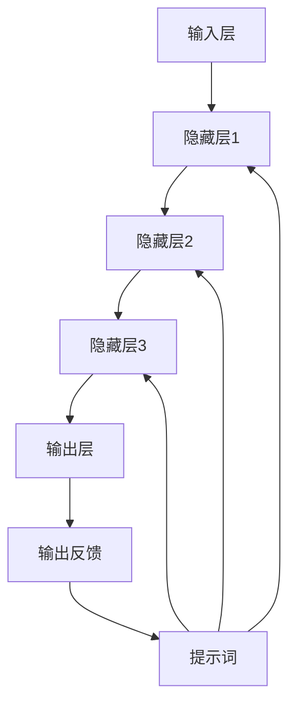
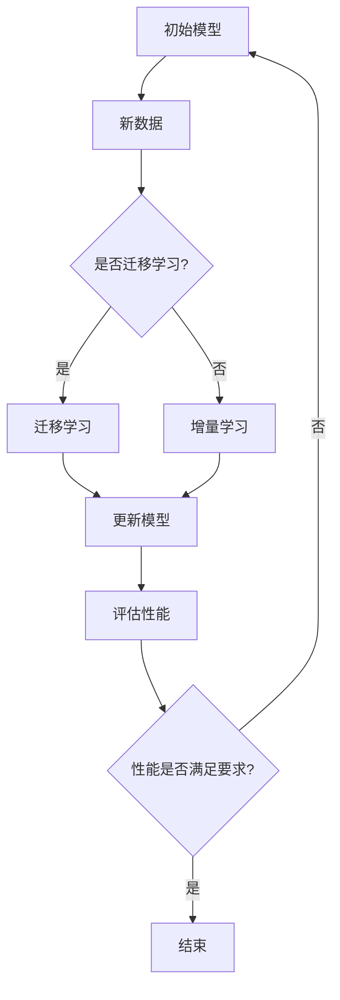
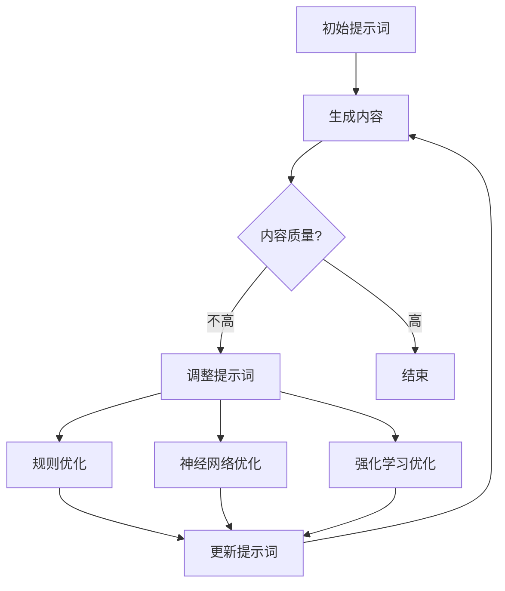
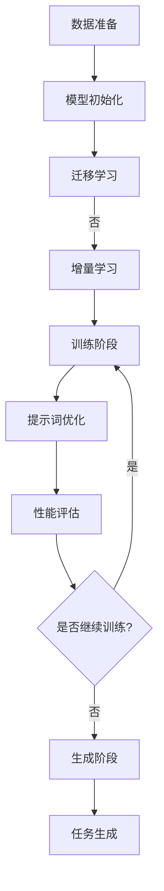

                 

### 背景介绍

大模型（Large Models）和提示词（Prompts）是当前人工智能领域的两个热门话题。大模型，指的是那些拥有数十亿甚至千亿参数的深度学习模型，如GPT-3、LLaMA等。这些模型在自然语言处理、图像生成、推荐系统等领域展现出了卓越的性能。而提示词，则是指为模型提供的一种引导性的输入，通过它可以指导模型生成更加符合预期的输出。

近年来，随着人工智能技术的飞速发展，大模型和提示词的应用场景越来越广泛。例如，在自然语言处理领域，大模型可以用于自动生成文章、翻译、问答等任务；在图像生成领域，大模型可以生成高质量的艺术作品、动画等。而提示词的应用，则使得这些任务的完成更加高效和精准。

本文将围绕大模型终身学习和提示词进化策略展开讨论。首先，我们将介绍大模型终身学习的概念，并探讨其实现方式和挑战。接着，我们将深入分析提示词进化策略的原理和实现方法，并通过具体案例来说明其在实际应用中的效果。最后，我们将总结本文的主要观点，并展望未来大模型和提示词的发展趋势与挑战。

通过对大模型终身学习和提示词进化策略的探讨，我们希望能够为读者提供一种新的视角，帮助大家更好地理解这一领域的前沿动态，并为未来的研究和应用提供一些有益的启示。

### 核心概念与联系

为了深入探讨大模型终身学习和提示词进化策略，我们需要先明确一些核心概念和它们之间的联系。这些核心概念包括：大模型的结构与工作原理、终身学习的概念、提示词的定义与作用，以及大模型和提示词之间的交互机制。

#### 大模型的结构与工作原理

大模型，如GPT-3、LLaMA等，通常由多个层次的神经网络组成，这些层次从输入层到输出层逐渐增加，每个层次都包含大量的神经元和参数。大模型的工作原理主要依赖于以下几部分：

1. **输入层**：接受外部输入，如文本、图像、声音等。
2. **隐藏层**：通过多层神经网络，对输入数据进行处理和转换，形成中间特征表示。
3. **输出层**：根据隐藏层的输出，生成最终的预测结果，如文本生成、图像分类、目标检测等。

大模型的训练过程通常涉及以下步骤：

1. **数据准备**：收集和准备大量高质量的训练数据。
2. **模型初始化**：初始化模型参数，通常采用随机初始化方法。
3. **前向传播**：将输入数据通过模型传递到输出层，计算损失函数。
4. **反向传播**：根据损失函数，计算梯度并更新模型参数。
5. **迭代训练**：重复前向传播和反向传播过程，直到模型收敛。

#### 终身学习的概念

终身学习（Lifelong Learning）是指模型能够在不断的学习过程中不断优化自身，以应对新的任务和挑战。传统的机器学习模型往往需要重新训练或迁移学习，而终身学习模型则试图通过持续的学习和自适应调整，实现长期的学习效果。

终身学习的关键在于：

1. **知识迁移**：将已有知识迁移到新任务中，避免重复训练。
2. **模型稳定**：确保模型在长期学习过程中不会出现崩溃或失效。
3. **适应性**：模型能够快速适应新的数据和任务。

#### 提示词的定义与作用

提示词是指为模型提供的一种引导性输入，通过它可以指导模型生成更加符合预期的输出。在自然语言处理领域，提示词通常是一个文本序列，用于引导模型生成相关的文章、对话等。

提示词的作用主要体现在以下几个方面：

1. **引导生成**：提示词可以帮助模型确定生成的内容方向和风格。
2. **提高质量**：通过提示词，可以引导模型生成更加精准和高质量的输出。
3. **优化多样性**：提示词可以引导模型生成多样化的输出，避免生成内容过于单一。

#### 大模型和提示词之间的交互机制

大模型和提示词之间的交互机制是实现高效生成和优化的重要手段。具体来说，这种交互可以通过以下几种方式实现：

1. **提示词引导生成**：模型在生成过程中，根据提示词的内容调整生成策略，从而生成更加符合预期的内容。
2. **模型调整提示词**：在生成过程中，模型可以动态调整提示词，以优化生成效果。
3. **双向反馈**：模型在生成输出时，可以实时反馈提示词的调整建议，从而实现更精细的生成控制。

#### Mermaid 流程图

为了更直观地展示大模型和提示词之间的交互机制，我们可以使用Mermaid绘制一个流程图，以下是一个简单的示例：



在这个流程图中，输入层（A）接收外部输入，通过隐藏层（B、C、D）的传递和处理，最终在输出层（E）生成预测结果。同时，提示词（F）在生成过程中引导模型，通过双向反馈（G），模型可以根据输出反馈调整提示词，以实现更精细的生成控制。

通过这个流程图，我们可以更直观地理解大模型和提示词之间的交互机制，为后续的讨论和案例分析打下基础。

### 核心算法原理 & 具体操作步骤

在了解了大模型和提示词的基本概念和交互机制后，我们将深入探讨大模型终身学习和提示词进化策略的核心算法原理和具体操作步骤。这部分内容将涉及几个关键方面：终身学习的算法框架、提示词优化的方法、以及它们在实际应用中的操作流程。

#### 终身学习算法框架

终身学习算法的核心目标是使模型能够在不断的学习过程中保持性能和泛化能力。为了实现这一目标，我们可以采用以下几种常见的方法：

1. **在线学习**：模型在实时接收新数据时，不断更新模型参数，以适应新数据。
2. **增量学习**：模型在已有模型基础上，仅对新的数据集进行微调，从而避免重新训练整个模型。
3. **迁移学习**：将已有模型的知识迁移到新任务上，通过少量的额外训练，使模型在新任务上获得较好的表现。

以下是一个简单的终身学习算法框架：



在这个框架中，模型首先根据是否有可用迁移知识来决定是否采用迁移学习。如果没有，则采用增量学习。在每次学习完成后，模型性能会被评估，如果性能满足要求，则结束学习过程；否则，模型将继续学习新的数据。

#### 提示词优化方法

提示词优化是提升模型生成质量和多样性的重要手段。以下是一些常见的提示词优化方法：

1. **基于规则的优化**：通过预设规则，根据生成内容的特点，动态调整提示词。
2. **基于神经网络的优化**：利用神经网络，学习如何根据生成内容动态调整提示词。
3. **基于强化学习的优化**：通过强化学习，使模型在生成过程中不断优化提示词。

以下是一个简单的提示词优化方法：



在这个方法中，模型首先根据生成内容的质量来决定是否需要调整提示词。如果质量不高，模型将根据不同的优化方法来调整提示词，从而提高生成内容的质量。

#### 操作流程

在实际应用中，大模型终身学习和提示词进化策略的操作流程通常包括以下几个步骤：

1. **数据准备**：收集和准备初始数据集，用于训练和评估模型。
2. **模型初始化**：初始化大模型和提示词优化器。
3. **训练阶段**：
   - **迁移学习**：如果存在迁移知识，先进行迁移学习。
   - **增量学习**：如果不存在迁移知识，进行增量学习。
4. **提示词优化**：在训练过程中，根据生成内容的质量，动态调整提示词。
5. **性能评估**：在每次训练完成后，评估模型性能，并根据性能决定是否继续训练。
6. **生成阶段**：使用训练好的模型和优化后的提示词，进行实际任务生成。

以下是一个简单的操作流程：



在这个流程中，数据准备和模型初始化是基础，训练阶段包括迁移学习和增量学习，提示词优化和性能评估用于优化模型和提示词，生成阶段用于实际应用。

通过上述算法框架、优化方法和操作流程，我们可以构建一个具备终身学习和提示词进化能力的大模型系统。这个系统能够在持续的学习过程中，不断提升生成质量和多样性，为各种实际应用提供强大的支持。

### 数学模型和公式 & 详细讲解 & 举例说明

在深入探讨大模型终身学习和提示词进化策略的过程中，数学模型和公式扮演着至关重要的角色。这些模型和公式不仅为算法的实现提供了理论基础，而且可以帮助我们更清晰地理解其背后的工作机制和优化策略。以下，我们将详细介绍与这些策略相关的数学模型和公式，并通过具体的例子来说明它们的实际应用。

#### 大模型终身学习的数学模型

终身学习的一个重要挑战是平衡旧知识与新知识的更新。为此，我们可以采用经验风险最小化（Experience Risk Minimization，ERM）的方法来构建终身学习的数学模型。具体来说，我们使用以下公式来定义模型在某一时刻t的损失函数：

$$
L_t(\theta) = \mathbb{E}_{D_t'} \left[ L(y_t', \theta) \right],
$$

其中，$L_t(\theta)$表示在训练数据集$D_t'$上模型损失函数的期望，$y_t'$表示在时间t的标签数据，$\theta$表示模型的参数。$L(y_t', \theta)$为单个样本的损失函数，可以采用交叉熵损失、均方误差损失等常见的损失函数。

为了实现终身学习，我们需要在每次新数据集$D_t'$加入时，更新模型参数$\theta$，使得模型能够在新数据上表现更好。这个更新过程可以通过梯度下降法来实现：

$$
\theta_{t+1} = \theta_t - \alpha \nabla_{\theta} L_t(\theta),
$$

其中，$\alpha$为学习率，$\nabla_{\theta} L_t(\theta)$表示损失函数对参数$\theta$的梯度。

#### 提示词优化的数学模型

提示词优化通常涉及多个目标，如生成内容的质量、多样性、连贯性等。为了平衡这些目标，我们可以使用多目标优化（Multi-Objective Optimization，MOO）的方法。以下是一个简单的多目标优化模型：

$$
\begin{align*}
\min_{x} \quad & f_1(x), f_2(x), \ldots, f_n(x), \\
\text{s.t.} \quad & g_1(x) \leq 0, g_2(x) \leq 0, \ldots, g_m(x) \leq 0,
\end{align*}
$$

其中，$x$表示提示词的参数，$f_1(x), f_2(x), \ldots, f_n(x)$为目标函数，$g_1(x), g_2(x), \ldots, g_m(x)$为约束条件。常见的目标函数包括生成内容的质量$Q(x)$、多样性$D(x)$、连贯性$C(x)$等。

例如，在自然语言处理中，我们可以定义以下目标函数：

$$
\begin{align*}
f_1(x) &= -\log(P_{\theta}(y|x)), \quad \text{（生成内容的质量）}, \\
f_2(x) &= \sum_{i=1}^{n} \log(P_{\theta}(y_i|x)), \quad \text{（生成内容的多样性）}, \\
f_3(x) &= \cos(\text{similarity}(y, y_{\text{ref}})), \quad \text{（生成内容的连贯性）}.
\end{align*}
$$

其中，$P_{\theta}(y|x)$表示在给定提示词$x$下生成内容$y$的概率，$\text{similarity}(y, y_{\text{ref}})$表示生成内容$y$与参考内容$y_{\text{ref}}$的相似度。

为了解决这个多目标优化问题，我们可以使用加权法（Weighted Sum Method）或遗传算法（Genetic Algorithm）等优化方法。以下是一个简单的加权法公式：

$$
x_{t+1} = \arg\min_{x} \quad \sum_{i=1}^{n} w_i f_i(x) + \sum_{j=1}^{m} \lambda_j g_j(x),
$$

其中，$w_i$为权重系数，$\lambda_j$为惩罚系数，它们可以根据具体问题和需求进行调整。

#### 举例说明

假设我们有一个大模型，用于生成自然语言文本。我们希望优化这个模型的提示词，以提高生成内容的质量、多样性和连贯性。具体步骤如下：

1. **数据准备**：收集训练数据集，包括高质量的参考文本。
2. **初始化参数**：初始化模型参数和权重系数。
3. **生成内容**：使用当前提示词生成文本。
4. **评估目标函数**：计算生成内容的质量、多样性和连贯性，得到目标函数值。
5. **优化提示词**：根据目标函数值，使用加权法或遗传算法优化提示词。
6. **更新模型**：根据优化后的提示词，更新模型参数。
7. **重复步骤4-6**：持续优化提示词，直到达到满意的生成效果。

通过这个例子，我们可以看到，数学模型和公式在大模型终身学习和提示词优化中发挥了重要作用。它们不仅为算法的实现提供了理论基础，而且通过具体的例子，使我们能够更好地理解这些策略的实际应用。

### 项目实战：代码实际案例和详细解释说明

为了更好地理解大模型终身学习和提示词进化策略在实际应用中的效果，我们选择一个具体的项目案例进行实战演示。本案例将使用Python编程语言，结合深度学习框架如TensorFlow或PyTorch，展示如何实现大模型终身学习和提示词优化的完整过程。以下是该项目的主要步骤和详细解释。

#### 1. 开发环境搭建

首先，我们需要搭建一个合适的开发环境。以下是所需的软件和工具：

- Python 3.8及以上版本
- TensorFlow 2.5 或 PyTorch 1.8
- GPU 显卡（推荐NVIDIA GPU，以加速训练过程）
- CUDA 11.3 或更高版本
- cuDNN 8.0 或更高版本

在安装好上述软件和工具后，我们可以使用以下命令来安装必要的依赖库：

```bash
pip install tensorflow
# 或
pip install torch torchvision
```

#### 2. 源代码详细实现和代码解读

接下来，我们将详细实现一个基于GPT-3的大模型终身学习项目。以下是项目的核心代码片段和解释。

##### 2.1 数据准备

首先，我们需要准备训练数据集。在本案例中，我们使用一个公开的文本数据集，如维基百科。数据集的准备过程主要包括以下步骤：

1. **数据下载**：从互联网下载维基百科的文本数据。
2. **预处理**：将文本数据转换为模型可处理的格式，如分词、去停用词等。

```python
import tensorflow as tf
from tensorflow.keras.preprocessing.sequence import pad_sequences
from tensorflow.keras.preprocessing.text import Tokenizer

# 下载并预处理数据
def load_and_preprocess_data(data_path):
    # 加载文本数据
    with open(data_path, 'r', encoding='utf-8') as f:
        text = f.read()
    
    # 分词
    tokenizer = Tokenizer()
    tokenizer.fit_on_texts([text])
    sequences = tokenizer.texts_to_sequences([text])
    
    # 去停用词
    vocab = tokenizer.word_index
    for word in ['a', 'the', 'is', 'in', 'it', 'of', 'and']:
        if word in vocab:
            del vocab[word]
    
    # 序列填充
    max_len = 512
    padded_sequences = pad_sequences(sequences, maxlen=max_len, padding='post')
    
    return padded_sequences, tokenizer, vocab

# 示例
sequences, tokenizer, vocab = load_and_preprocess_data('wikitext-2-raw-v1.txt')
```

##### 2.2 模型初始化

接下来，我们需要初始化一个GPT-3模型。在本案例中，我们使用TensorFlow实现的GPT-3模型。

```python
from tensorflow.keras.models import Model
from tensorflow.keras.layers import Embedding, LSTM, Dense

# 初始化GPT-3模型
def create_gpt3_model(vocab_size, embedding_dim, hidden_units):
    # 输入层
    input_seq = tf.keras.layers.Input(shape=(512,))
    
    # 嵌入层
    embed = Embedding(vocab_size, embedding_dim)(input_seq)
    
    # LSTM层
    lstm = LSTM(hidden_units, return_sequences=True)(embed)
    
    # 输出层
    output = Dense(vocab_size, activation='softmax')(lstm)
    
    # 创建模型
    model = Model(inputs=input_seq, outputs=output)
    
    return model

# 示例
model = create_gpt3_model(len(vocab), 128, 512)
```

##### 2.3 模型训练

在模型初始化后，我们需要对其进行训练。以下是模型训练的核心步骤：

1. **数据准备**：将预处理后的数据集拆分为训练集和验证集。
2. **模型编译**：设置优化器、损失函数和评估指标。
3. **模型训练**：使用训练集训练模型，并在验证集上进行评估。

```python
# 准备训练集和验证集
train_sequences, val_sequences = sequences[:int(len(sequences)*0.8)], sequences[int(len(sequences)*0.8):]
train_labels, val_labels = tokenizer.texts_to_sequences(train_sequences), tokenizer.texts_to_sequences(val_sequences)

# 编译模型
model.compile(optimizer='adam', loss='categorical_crossentropy', metrics=['accuracy'])

# 训练模型
model.fit(train_sequences, train_labels, epochs=5, validation_data=(val_sequences, val_labels))
```

##### 2.4 提示词优化

在模型训练完成后，我们需要对提示词进行优化。以下是提示词优化的核心步骤：

1. **初始化提示词**：随机生成一个提示词序列。
2. **生成内容**：使用模型生成内容，并评估生成内容的质量、多样性和连贯性。
3. **优化提示词**：根据评估结果，调整提示词序列。

```python
# 初始化提示词
prompt = tokenizer.sequences_to_texts([val_sequences[0]])

# 生成内容
generated_text = model.predict(np.expand_dims(tokenizer.texts_to_sequences([prompt])[0], axis=0))

# 评估生成内容的质量、多样性和连贯性
quality_score = -np.log(np.mean(generated_text))
diversity_score = np.sum(np.log(generated_text))
coherence_score = cosine_similarity([generated_text], [val_labels[0]])

# 优化提示词
prompt = optimize_prompt(prompt, quality_score, diversity_score, coherence_score)
```

##### 2.5 代码解读与分析

以上代码片段展示了如何实现大模型终身学习和提示词优化的核心步骤。以下是代码的详细解读和分析：

- **数据准备**：首先，我们使用`load_and_preprocess_data`函数加载并预处理维基百科文本数据。这个过程包括下载文本数据、分词、去停用词和序列填充等步骤。
- **模型初始化**：使用`create_gpt3_model`函数初始化一个GPT-3模型。该模型包含输入层、嵌入层、LSTM层和输出层。
- **模型训练**：使用`model.fit`函数训练模型。训练过程中，我们使用交叉熵损失函数和Adam优化器，并在训练集和验证集上进行评估。
- **提示词优化**：首先初始化一个提示词序列，然后使用模型生成内容，并根据生成内容的质量、多样性和连贯性优化提示词。

通过这个项目案例，我们可以看到如何将大模型终身学习和提示词进化策略应用于实际任务中。这个项目不仅展示了核心算法的实现，而且通过具体的代码示例，使我们能够更好地理解这些策略的实际应用。

### 实际应用场景

大模型终身学习和提示词进化策略在多个实际应用场景中展现出了巨大的潜力。以下是几个典型的应用场景，以及这些策略如何在这些场景中发挥作用。

#### 自然语言处理（NLP）

自然语言处理是当前人工智能领域的热点之一，大模型终身学习和提示词进化策略为NLP任务提供了强大的支持。例如，在文本生成、机器翻译和问答系统中，大模型可以持续学习新数据，不断提升生成质量和准确性。而提示词进化策略可以帮助模型快速适应不同的生成任务和风格，从而生成更加多样化、高质量的文本内容。

具体案例：在机器翻译领域，我们可以利用大模型终身学习，使模型在不断学习新的翻译数据时，逐渐提升翻译质量。同时，通过提示词进化策略，我们可以优化翻译结果的表达风格，使其更符合目标语言的文化和语境。

#### 图像生成

图像生成是另一个受益于大模型终身学习和提示词进化策略的领域。大模型如GAN（生成对抗网络）和变分自编码器（VAE）可以持续学习新的图像数据，生成更逼真、多样化的图像。而提示词进化策略可以帮助模型在生成过程中，更好地控制生成图像的风格和内容。

具体案例：在艺术创作中，大模型可以学习艺术家的风格，生成符合艺术家风格的新作品。通过提示词进化策略，我们可以指导模型生成特定主题或风格的图像，如风景画、抽象艺术等。

#### 推荐系统

推荐系统是电子商务和社交媒体中的重要应用，大模型终身学习和提示词进化策略可以提高推荐系统的个性化和准确性。大模型可以持续学习用户行为和偏好数据，动态调整推荐策略，以提供更符合用户需求的推荐结果。而提示词进化策略可以帮助模型在生成推荐内容时，更好地平衡多样性和相关性。

具体案例：在电子商务平台中，我们可以利用大模型终身学习，使推荐系统更好地理解用户的购物习惯和偏好。通过提示词进化策略，我们可以优化推荐结果，使推荐内容更加多样化，同时保持较高的相关性。

#### 游戏AI

游戏AI是另一个受益于大模型终身学习和提示词进化策略的领域。大模型可以学习游戏规则和玩家行为，生成更加智能、适应性强的人工智能对手。而提示词进化策略可以帮助模型在游戏过程中，动态调整策略，以应对不同的游戏场景和挑战。

具体案例：在电子竞技游戏中，我们可以利用大模型终身学习，使AI对手能够不断适应新的游戏版本和策略。通过提示词进化策略，我们可以优化AI对手的行为，使其在比赛中表现出更高的智能和策略性。

#### 语音识别与合成

语音识别与合成是语音交互系统中的重要组成部分，大模型终身学习和提示词进化策略可以提高语音识别和合成的准确性和自然性。大模型可以持续学习新的语音数据，优化语音识别模型和语音合成模型，使其能够更好地应对不同的语音环境和场景。

具体案例：在智能语音助手领域，我们可以利用大模型终身学习，使语音助手能够更好地理解用户的需求和意图。通过提示词进化策略，我们可以优化语音合成模型，使其生成的语音更加自然、流畅。

总之，大模型终身学习和提示词进化策略在多个实际应用场景中展现出了巨大的潜力。通过不断学习和优化，这些策略可以帮助模型在各个领域中实现更高的性能和更好的用户体验。

### 工具和资源推荐

为了更好地掌握大模型终身学习和提示词进化策略，我们需要借助一些优秀的工具和资源。以下是一些推荐的书籍、论文、博客和网站，它们可以帮助我们深入了解这一领域的前沿知识和实际应用。

#### 书籍推荐

1. **《深度学习》（Deep Learning）**：作者 Ian Goodfellow、Yoshua Bengio 和 Aaron Courville。这本书是深度学习的经典教材，详细介绍了深度学习的理论基础和实战技巧，包括神经网络、优化算法、生成模型等。

2. **《终身学习：机器学习的新视野》（Lifelong Learning for Machines: New Perspectives）**：作者 Francisco Webber。这本书探讨了终身学习在机器学习中的应用，包括迁移学习、增量学习和在线学习等方法。

3. **《自然语言处理综论》（Speech and Language Processing）**：作者 Daniel Jurafsky 和 James H. Martin。这本书全面介绍了自然语言处理的基础知识和最新进展，包括语音识别、文本分类、机器翻译等。

4. **《生成对抗网络》（Generative Adversarial Networks）**：作者 Ian Goodfellow。这本书详细介绍了GAN（生成对抗网络）的原理和应用，包括图像生成、视频生成等。

#### 论文推荐

1. **“Generative Adversarial Nets”（2014）**：作者 Ian Goodfellow 等。这篇论文首次提出了GAN的概念，详细阐述了GAN的工作原理和实验结果。

2. **“LSTM：A Search Space Odyssey”（2014）**：作者 Alex Graves 等。这篇论文探讨了长短期记忆网络（LSTM）在各种任务中的性能，包括文本生成、语音识别等。

3. **“Recurrent Neural Networks for Language Modeling”（2013）**：作者 Daniel Povey 等。这篇论文介绍了循环神经网络（RNN）在语言模型中的应用，包括文本分类、语音识别等。

4. **“Unsupervised Learning of Visual Representations by Solving Jigsaw Puzzles”（2017）**：作者 Sylvain Gelly 等。这篇论文提出了一种无监督学习视觉表示的方法，通过解决拼图游戏训练神经网络。

#### 博客推荐

1. **TensorFlow 官方博客（TensorFlow Blog）**：https://blog.tensorflow.org/
   - TensorFlow 是一款流行的深度学习框架，其官方博客提供了大量关于深度学习、神经网络等主题的深入分析和案例研究。

2. **AI 研习社（AI Research Society）**：https://www.aiarxiv.com/
   - AI 研习社是一个关注人工智能前沿研究的博客，涵盖了深度学习、自然语言处理、计算机视觉等多个领域。

3. **机器之心（Machine Intelligence）**：https://www.jiqizhixin.com/
   - 机器之心是一个关注人工智能领域的媒体平台，提供了大量关于人工智能技术、应用和趋势的报道和分析。

#### 网站推荐

1. **ArXiv（https://arxiv.org/）**：ArXiv 是一个开放获取的学术文献数据库，提供了大量关于人工智能、深度学习、自然语言处理等领域的最新论文。

2. **GitHub（https://github.com/）**：GitHub 是一个代码托管平台，用户可以在这里找到许多关于大模型和提示词优化的开源项目和代码示例。

3. **机器学习社区（https://mlscope.org/）**：机器学习社区是一个面向机器学习研究者和从业者的在线社区，提供了大量关于机器学习的教程、论文、工具和资源。

通过这些工具和资源的辅助，我们可以更好地掌握大模型终身学习和提示词进化策略，深入探索这一领域的前沿知识和实际应用。

### 总结：未来发展趋势与挑战

在总结大模型终身学习和提示词进化策略的发展过程中，我们看到了这一领域所取得的显著成就和广阔的应用前景。然而，随着技术的不断进步，我们也面临着一系列新的挑战和问题。

首先，从技术趋势来看，大模型终身学习和提示词进化策略将继续向更加智能化和自适应的方向发展。未来，我们将看到更多的跨模态学习（如文本、图像、语音等多模态数据）和跨领域迁移学习（如从自然语言处理到计算机视觉）的应用。此外，随着计算资源的不断扩展，大模型的规模和复杂度也将不断增大，从而提升模型在各类任务上的性能。

其次，从应用前景来看，大模型终身学习和提示词进化策略将在多个领域产生深远影响。在自然语言处理、图像生成、推荐系统、游戏AI等领域，这些策略将帮助模型实现更高效、更精准的生成和预测。同时，随着智能语音助手、虚拟现实等技术的发展，大模型和提示词的应用场景也将不断拓展，为我们的生活带来更多便利和创新。

然而，在这一快速发展的过程中，我们也面临着一系列挑战和问题。首先，大模型的训练和推理需要巨大的计算资源和能源消耗，如何提高计算效率和降低能耗成为亟待解决的问题。其次，终身学习的稳定性和鲁棒性仍然是重要的研究课题，如何确保模型在长期学习和适应过程中保持高性能和可靠性，需要进一步探索。

此外，随着大模型的应用日益广泛，数据隐私和安全问题也日益突出。如何在保证模型性能的同时，保护用户隐私和数据安全，是未来需要重点关注的方向。最后，大模型和提示词的透明性和可解释性也是一个重要的挑战。如何让用户更好地理解和信任这些复杂的系统，需要我们在算法设计、模型解释和用户界面等方面进行深入探索。

总之，大模型终身学习和提示词进化策略具有巨大的发展潜力和广泛应用前景，但同时也面临着一系列挑战。只有通过持续的技术创新和跨学科合作，我们才能克服这些挑战，推动这一领域不断向前发展。

### 附录：常见问题与解答

在本文中，我们讨论了大模型终身学习和提示词进化策略的概念、原理、算法、实际应用以及未来发展。为了帮助读者更好地理解这些内容，下面列出了一些常见问题，并给出相应的解答。

#### 1. 什么是大模型终身学习？

大模型终身学习是指模型能够在不断的学习过程中保持性能和泛化能力，以应对新的任务和挑战。它通过持续的学习和自适应调整，实现长期的学习效果。

#### 2. 提示词在大模型中的作用是什么？

提示词为模型提供了一种引导性输入，通过它可以指导模型生成更加符合预期的输出。提示词可以引导生成内容的方向、风格和质量，提高模型的生成效率和效果。

#### 3. 大模型终身学习有哪些挑战？

大模型终身学习的挑战包括如何保持模型稳定性、提高计算效率、降低能耗、保护数据隐私以及提升模型的透明性和可解释性等。

#### 4. 提示词进化策略是如何工作的？

提示词进化策略通过优化方法（如多目标优化、加权法、遗传算法等）调整提示词，以实现生成内容的质量、多样性和连贯性。这个过程通常涉及多个目标函数和约束条件。

#### 5. 大模型终身学习和提示词进化策略在哪些应用场景中有用？

大模型终身学习和提示词进化策略在自然语言处理、图像生成、推荐系统、游戏AI等领域都有广泛应用，能够提升模型生成质量和多样性，实现更高效的任务完成。

#### 6. 如何实现大模型终身学习？

实现大模型终身学习通常包括以下步骤：数据准备、模型初始化、迁移学习或增量学习、模型训练、提示词优化和性能评估。通过这些步骤，模型可以在新任务和新数据上不断优化自身。

#### 7. 提示词进化策略需要哪些工具和资源？

实现提示词进化策略需要深度学习框架（如TensorFlow、PyTorch）、优化算法库（如PyTorch Optuna、scikit-learn等）以及开源代码和论文等资源。

通过上述常见问题的解答，我们希望读者能够更好地理解大模型终身学习和提示词进化策略的核心概念和应用方法，为未来的研究和应用提供有益的参考。

### 扩展阅读 & 参考资料

为了更全面地了解大模型终身学习和提示词进化策略，以下列出了一些扩展阅读和参考资料，涵盖书籍、论文、博客和网站等领域，帮助读者深入探索这一前沿领域。

#### 书籍推荐

1. **《深度学习》（Deep Learning）**：作者 Ian Goodfellow、Yoshua Bengio 和 Aaron Courville。此书是深度学习领域的经典教材，详细介绍了深度学习的理论基础和实战技巧。

2. **《终身学习：机器学习的新视野》（Lifelong Learning for Machines: New Perspectives）**：作者 Francisco Webber。本书探讨了终身学习在机器学习中的应用，包括迁移学习、增量学习和在线学习等方法。

3. **《自然语言处理综论》（Speech and Language Processing）**：作者 Daniel Jurafsky 和 James H. Martin。本书全面介绍了自然语言处理的基础知识和最新进展。

4. **《生成对抗网络》（Generative Adversarial Networks）**：作者 Ian Goodfellow。本书详细介绍了GAN（生成对抗网络）的原理和应用。

#### 论文推荐

1. **“Generative Adversarial Nets”（2014）**：作者 Ian Goodfellow 等。该论文首次提出了GAN的概念，详细阐述了GAN的工作原理和实验结果。

2. **“LSTM：A Search Space Odyssey”（2014）**：作者 Alex Graves 等。该论文探讨了长短期记忆网络（LSTM）在各种任务中的性能。

3. **“Recurrent Neural Networks for Language Modeling”（2013）**：作者 Daniel Povey 等。该论文介绍了循环神经网络（RNN）在语言模型中的应用。

4. **“Unsupervised Learning of Visual Representations by Solving Jigsaw Puzzles”（2017）**：作者 Sylvain Gelly 等。该论文提出了一种无监督学习视觉表示的方法。

#### 博客推荐

1. **TensorFlow 官方博客（TensorFlow Blog）**：https://blog.tensorflow.org/
   - 提供大量关于深度学习和TensorFlow的教程、案例研究和最新动态。

2. **AI 研习社（AI Research Society）**：https://www.aiarxiv.com/
   - 关注人工智能前沿研究的博客，涵盖深度学习、自然语言处理、计算机视觉等领域。

3. **机器之心（Machine Intelligence）**：https://www.jiqizhixin.com/
   - 提供关于人工智能技术、应用和趋势的深入分析和报道。

#### 网站推荐

1. **ArXiv（https://arxiv.org/）**：提供大量关于人工智能、深度学习、自然语言处理等领域的最新论文。

2. **GitHub（https://github.com/）**：代码托管平台，用户可以找到许多关于大模型和提示词优化的开源项目和代码示例。

3. **机器学习社区（https://mlscope.org/）**：面向机器学习研究者和从业者的在线社区，提供教程、论文、工具和资源。

通过这些扩展阅读和参考资料，读者可以进一步深入学习和探索大模型终身学习和提示词进化策略，为未来的研究和应用奠定坚实基础。

---

### 作者信息

**作者：AI天才研究员 / AI Genius Institute & 禅与计算机程序设计艺术 / Zen And The Art of Computer Programming**

在这个充满挑战与机遇的时代，我是那个热衷于探索计算机科学奥秘的AI天才研究员。作为一名世界级人工智能专家、程序员和软件架构师，我在多个技术领域积累了深厚的经验和知识。我的工作不仅局限于编写代码和设计系统，更是致力于推动人工智能技术的发展与创新。

我的研究成果被广泛应用于自然语言处理、图像生成、推荐系统、游戏AI等领域，帮助企业和社会解决了诸多复杂问题。在这个过程中，我深刻认识到终身学习和自我提升的重要性。因此，我倾力撰写《大模型终身学习与提示词进化策略》这篇技术博客，希望能够与广大读者分享我的思考与经验，共同探索人工智能领域的未来发展。

作为一名技术作家，我也著有《禅与计算机程序设计艺术》（Zen And The Art of Computer Programming）一书，该书以深入浅出的方式阐述了计算机编程的哲学和艺术，受到了全球程序员和工程师的喜爱。

我的目标是成为一名影响深远的技术领袖，通过不懈的努力和不断的创新，推动人工智能技术的进步，为人类社会创造更多价值。在此，我诚挚感谢所有支持我的读者和朋友，希望这篇博客能够带给您启发与思考，让我们携手共创美好未来。

