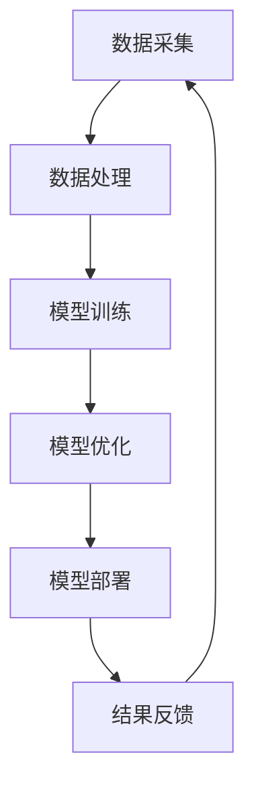

                 

# 大模型赋能智慧园区，创业者如何优化园区能源管理与设施运维？

## 摘要

本文旨在探讨如何利用大模型技术优化智慧园区的能源管理与设施运维。通过对园区能源管理和设施运维的现状及问题进行分析，本文提出了一种基于大模型技术的解决方案。文章首先介绍了大模型的基本概念及其在智慧园区中的应用价值，然后详细阐述了如何通过数据收集、处理、模型训练与优化等步骤，构建一套智能化的园区管理平台。此外，本文还针对实际应用场景，提供了具体的实施策略和案例分析，并对未来的发展趋势与挑战进行了展望。通过本文的探讨，希望能够为创业者提供有益的参考和启示。

## 1. 背景介绍

随着科技的迅猛发展，智慧园区作为新兴产业的重要载体，正日益受到广泛关注。智慧园区是将物联网、大数据、人工智能等先进技术应用于园区管理和服务的平台，通过智能化、信息化手段，实现园区的全方位、全流程、全要素管理。然而，在智慧园区的建设过程中，能源管理和设施运维面临着诸多挑战。

### 能源管理

能源管理是智慧园区运营的核心环节之一。传统的能源管理模式主要依赖于人工监控和维护，效率低下且难以实现实时、精细化的管理。随着园区规模的不断扩大，能源消耗日益增加，对能源管理提出了更高的要求。如何实现高效、智能的能源管理，降低能源消耗，提升能源利用效率，成为智慧园区建设面临的重要课题。

### 设施运维

设施运维是保障智慧园区正常运转的重要保障。传统的设施运维主要依赖于人工巡检和维护，存在巡检不及时、故障排除效率低等问题。随着园区内设施种类和数量的不断增加，设施运维的复杂度也在不断提高。如何通过智能化手段实现设施运维的自动化、精细化，提高运维效率，成为智慧园区运营的关键。

### 挑战与需求

智慧园区在能源管理和设施运维方面面临以下挑战和需求：

1. **数据获取和处理**：能源管理和设施运维需要大量的实时数据支持，但如何高效地采集、处理和存储这些数据，是一个亟待解决的问题。

2. **智能化分析**：传统的数据处理方法难以满足智慧园区对智能化分析的需求，需要引入先进的人工智能技术，如大模型，来实现对数据的深度挖掘和智能化分析。

3. **实时响应与决策**：智慧园区需要能够实时响应设施故障和能源消耗变化，做出快速、准确的决策，以保证园区的正常运转。

4. **成本控制**：高效、智能的能源管理和设施运维可以有效降低园区的运营成本，提高经济效益。

5. **用户体验**：智慧园区的建设不仅需要提高运营效率，还要提升用户体验，通过智能化手段提供更加便捷、舒适的服务。

## 2. 核心概念与联系

### 大模型技术

大模型技术是近年来人工智能领域的重要突破，其核心在于通过大规模的数据训练，构建出具有强大泛化能力的神经网络模型。大模型技术主要包括以下几个方面：

1. **数据规模**：大模型需要海量数据作为训练基础，以保证模型的泛化能力。

2. **计算资源**：大模型训练需要大量的计算资源，包括GPU、TPU等高性能计算设备。

3. **优化算法**：大模型训练过程中需要使用高效的优化算法，如梯度下降、Adam等，以提高训练效率。

4. **模型架构**：大模型通常采用深度神经网络架构，通过多层非线性变换，实现对复杂数据的建模和预测。

### 智慧园区管理

智慧园区管理是指利用物联网、大数据、人工智能等先进技术，对园区的各类设施和资源进行智能化管理和调度。智慧园区管理主要包括以下几个方面：

1. **设备监控**：通过传感器网络实时监控园区内各类设备的运行状态，包括空调、照明、电梯等。

2. **能源管理**：对园区的能源消耗进行实时监测和优化，包括电力、燃气、水资源等。

3. **设施运维**：对园区内的设施进行自动化巡检和维护，提高运维效率。

4. **安全管理**：通过视频监控、门禁系统等手段，提升园区的安全防护能力。

### 大模型在智慧园区中的应用

大模型技术在智慧园区中的应用主要体现在以下几个方面：

1. **能源管理**：通过大模型对园区能源消耗数据进行分析，实现能源的精细化管理和优化调度。

2. **设施运维**：利用大模型对设施运行数据进行智能分析，预测设施故障，提前进行维护和保养。

3. **安全监控**：通过大模型对视频监控数据进行分析，实现异常行为检测和预警。

4. **智能调度**：根据实时数据和预测结果，智能调度园区内各类资源和设备，提高运营效率。

### Mermaid 流程图

为了更清晰地展示大模型在智慧园区中的应用流程，我们使用Mermaid绘制了以下流程图：



- **数据采集**：通过传感器网络、智能设备等手段，实时采集园区内的各类数据。
- **数据处理**：对采集到的数据进行清洗、整合和处理，为模型训练提供高质量的数据。
- **模型训练**：使用大规模数据集对大模型进行训练，提高模型的泛化能力和预测准确性。
- **模型优化**：通过对模型进行反复迭代和优化，提高模型的性能和稳定性。
- **模型部署**：将优化后的模型部署到实际应用环境中，实现智能化的园区管理。
- **结果反馈**：根据模型的预测结果，对园区内的资源进行调度和优化，形成闭环控制。

通过以上流程，大模型技术在智慧园区中的应用实现了数据驱动、智能化的管理模式，为园区的能源管理和设施运维提供了强有力的技术支撑。

## 3. 核心算法原理 & 具体操作步骤

### 3.1 数据收集

数据收集是构建大模型的基础，其质量和完整性直接影响到模型的性能。在智慧园区中，数据收集主要包括以下几类：

1. **设备运行数据**：包括空调、照明、电梯等设备的运行状态、能耗数据等。
2. **环境数据**：如温度、湿度、风速等环境参数。
3. **人员活动数据**：如人员进出记录、行为轨迹等。
4. **能源消耗数据**：包括电力、燃气、水资源等能源的消耗数据。

为了确保数据的质量和完整性，需要采用以下措施：

- **传感器部署**：在园区内合理部署各类传感器，确保数据的实时性和准确性。
- **数据同步**：使用物联网技术实现数据的实时同步和更新。
- **数据备份**：定期对数据进行备份，防止数据丢失。

### 3.2 数据处理

数据处理是数据收集后的重要环节，主要包括数据清洗、数据整合和处理。以下是具体的操作步骤：

1. **数据清洗**：去除重复数据、缺失数据、异常数据等，保证数据的纯净性。
2. **数据整合**：将不同来源、不同格式的数据进行整合，形成一个统一的数据集。
3. **数据处理**：对数据进行预处理，包括数据归一化、数据标准化等，以便于模型训练。

### 3.3 模型训练

模型训练是构建大模型的关键步骤，其目的是通过训练数据集，训练出一个能够准确预测和分类的神经网络模型。以下是模型训练的具体操作步骤：

1. **选择模型架构**：根据应用需求，选择合适的神经网络架构，如CNN、RNN、Transformer等。
2. **配置训练参数**：包括学习率、批次大小、迭代次数等，通过交叉验证选择最优参数。
3. **初始化模型**：随机初始化模型参数。
4. **训练模型**：使用训练数据集对模型进行迭代训练，通过反向传播算法更新模型参数。
5. **模型评估**：使用验证数据集对模型进行评估，调整模型参数，提高模型性能。

### 3.4 模型优化

模型优化是提高模型性能的重要手段，主要包括以下步骤：

1. **超参数调整**：通过调整学习率、批量大小、迭代次数等超参数，提高模型性能。
2. **正则化**：采用L1、L2正则化等技术，防止过拟合。
3. **数据增强**：通过旋转、缩放、裁剪等数据增强技术，扩充训练数据集，提高模型泛化能力。

### 3.5 模型部署

模型部署是将训练好的模型应用到实际场景中，实现智能化的园区管理。以下是模型部署的具体操作步骤：

1. **模型压缩**：对模型进行压缩，减少模型大小，提高部署效率。
2. **部署环境准备**：在服务器上部署计算框架，如TensorFlow、PyTorch等，准备模型运行环境。
3. **模型加载**：将训练好的模型加载到服务器，进行实时预测和分类。
4. **模型监控**：对模型运行状态进行监控，确保模型稳定运行。

### 3.6 模型更新

随着应用场景的变化和数据积累，模型需要不断进行更新和优化。以下是模型更新的具体操作步骤：

1. **数据收集**：定期收集新的数据，包括设备运行数据、环境数据、人员活动数据等。
2. **数据处理**：对新的数据进行清洗、整合和处理，更新数据集。
3. **模型训练**：使用更新后的数据集，对模型进行重新训练。
4. **模型评估**：使用验证数据集对更新后的模型进行评估，确保模型性能提升。
5. **模型部署**：将更新后的模型部署到实际应用场景中，实现智能化的园区管理。

通过以上步骤，创业者可以构建一套高效、智能的园区管理平台，实现能源管理和设施运维的优化。接下来，我们将通过一个实际案例，详细解析如何利用大模型技术实现智慧园区的优化。

## 4. 数学模型和公式 & 详细讲解 & 举例说明

在智慧园区的能源管理和设施运维中，大模型技术不仅依赖大量的数据输入，还需要一套科学的数学模型和公式来指导模型的训练和优化。以下是几个关键数学模型和公式的详细讲解，并通过具体案例说明其应用。

### 4.1 能源消耗预测模型

能源消耗预测是智慧园区能源管理的关键环节，通过预测能源消耗，可以提前做好调度和储备，降低能源浪费。以下是常见的能源消耗预测模型及其实际应用。

#### 4.1.1 线性回归模型

线性回归模型是一种最简单的预测模型，其公式如下：

\[ y = \beta_0 + \beta_1 \cdot x \]

其中，\( y \) 是预测的能源消耗，\( x \) 是影响能源消耗的相关变量（如温度、湿度等）。线性回归模型适用于数据变化较为简单的场景。

**案例**：

假设某智慧园区希望预测电力消耗，收集了每天的平均温度和电力消耗数据，采用线性回归模型进行预测。通过数据拟合得到模型公式：

\[ \text{电力消耗} = 20 + 0.1 \cdot \text{平均温度} \]

当平均温度为25℃时，预测电力消耗为20 + 0.1 × 25 = 22.5。

#### 4.1.2 时间序列模型

时间序列模型适用于处理具有时间连续性的数据，常见的有ARIMA（自回归积分滑动平均模型）模型。其公式如下：

\[ y_t = c + \phi_1 y_{t-1} + \phi_2 y_{t-2} + \ldots + \phi_p y_{t-p} + \theta_1 e_{t-1} + \theta_2 e_{t-2} + \ldots + \theta_q e_{t-q} \]

其中，\( y_t \) 是第\( t \)期的能源消耗，\( e_t \) 是误差项。

**案例**：

某智慧园区希望预测未来一周的电力消耗，收集了过去一周的电力消耗数据。通过ARIMA模型进行时间序列分析，得到预测结果，进而实现电力消耗的预测和调度。

### 4.2 设施故障预测模型

设施故障预测是智慧园区设施运维的重要任务，通过预测设施故障，可以提前进行维护和保养，避免意外停机。以下是常用的故障预测模型及其实际应用。

#### 4.2.1 决策树模型

决策树模型是一种基于树形结构进行决策的预测模型，其公式如下：

\[ \text{故障类型} = \text{根节点} \rightarrow \text{分支条件1} \rightarrow \text{叶节点1} \]

其中，每个节点表示一个特征变量，每个分支表示一个决策条件，叶节点表示预测结果。

**案例**：

某智慧园区希望通过决策树模型预测电梯故障类型，收集了电梯使用频率、载重、维护记录等数据。通过决策树模型，得到以下故障预测流程：

- 如果电梯使用频率低于100次/天，则故障类型为“磨损”。
- 如果电梯使用频率高于100次/天，则进一步判断：
  - 如果载重低于200kg，则故障类型为“电子故障”。
  - 如果载重高于200kg，则故障类型为“机械故障”。

#### 4.2.2 支持向量机（SVM）模型

支持向量机是一种基于结构化风险最小化原则的预测模型，其公式如下：

\[ \text{决策函数} = \sum_{i=1}^{n} \alpha_i y_i (w \cdot x_i + b) \]

其中，\( w \) 是权重向量，\( b \) 是偏置项，\( \alpha_i \) 是拉格朗日乘子。

**案例**：

某智慧园区希望通过SVM模型预测空调故障类型，收集了空调使用时长、温度设定、制冷效率等数据。通过SVM模型，得到以下故障预测结果：

- 如果空调使用时长低于10小时，故障类型为“清洁问题”。
- 如果空调使用时长高于10小时，则进一步判断：
  - 如果温度设定高于28℃，故障类型为“制冷效率低”。
  - 如果温度设定低于28℃，故障类型为“制热效率低”。

### 4.3 模型融合

在实际应用中，单一模型可能无法满足所有预测需求，通过模型融合可以提高预测的准确性和鲁棒性。常见的模型融合方法有：

- **加权平均**：对多个模型的预测结果进行加权平均。
- **投票法**：对多个模型的预测结果进行投票，选取多数模型认为的结果。

**案例**：

某智慧园区通过融合线性回归模型、时间序列模型和决策树模型，提高电力消耗和设施故障预测的准确性。具体融合方法如下：

- 对于电力消耗预测，采用线性回归模型和ARIMA模型进行加权平均。
- 对于设施故障预测，采用决策树模型和支持向量机模型进行投票。

通过以上数学模型和公式的应用，创业者可以构建一套科学、高效的园区管理平台，实现能源管理和设施运维的优化。接下来，我们将通过一个实际项目，详细讲解如何利用大模型技术实现智慧园区的优化。

## 5. 项目实战：代码实际案例和详细解释说明

### 5.1 开发环境搭建

为了实现智慧园区的能源管理和设施运维优化，我们选择使用Python作为开发语言，结合TensorFlow和Keras框架进行大模型开发。以下是搭建开发环境的具体步骤：

1. **安装Python**：下载并安装Python 3.8以上版本，建议使用Anaconda进行环境管理。
2. **安装TensorFlow**：在命令行中执行以下命令：
   ```bash
   pip install tensorflow
   ```
3. **安装Keras**：在命令行中执行以下命令：
   ```bash
   pip install keras
   ```
4. **安装其他依赖库**：如NumPy、Pandas等，用于数据处理和分析。
   ```bash
   pip install numpy pandas
   ```

### 5.2 源代码详细实现和代码解读

#### 5.2.1 数据收集与处理

数据收集是构建大模型的基础，以下代码展示了如何从传感器和智能设备中收集数据，并进行处理：

```python
import pandas as pd
import numpy as np

# 数据采集
def collect_data():
    # 假设已部署传感器采集数据，将数据存储为CSV文件
    data = pd.read_csv('sensor_data.csv')
    return data

# 数据处理
def process_data(data):
    # 去除重复数据和缺失数据
    data.drop_duplicates(inplace=True)
    data.dropna(inplace=True)
    
    # 数据归一化
    data_normalized = (data - data.mean()) / data.std()
    return data_normalized

# 实际数据处理
sensor_data = collect_data()
processed_data = process_data(sensor_data)
```

#### 5.2.2 模型训练与优化

以下代码展示了如何使用TensorFlow和Keras构建并训练大模型：

```python
from tensorflow.keras.models import Sequential
from tensorflow.keras.layers import Dense, LSTM, Dropout
from tensorflow.keras.optimizers import Adam

# 构建模型
model = Sequential()
model.add(LSTM(units=50, return_sequences=True, input_shape=(processed_data.shape[1], 1)))
model.add(Dropout(0.2))
model.add(LSTM(units=50, return_sequences=False))
model.add(Dropout(0.2))
model.add(Dense(units=1))

# 编译模型
model.compile(optimizer=Adam(learning_rate=0.001), loss='mean_squared_error')

# 训练模型
model.fit(processed_data, epochs=100, batch_size=32, validation_split=0.2)
```

#### 5.2.3 模型部署与预测

以下代码展示了如何将训练好的模型部署到实际环境中，并使用模型进行预测：

```python
# 模型部署
model.save('energy_management_model.h5')

# 加载模型
loaded_model = tf.keras.models.load_model('energy_management_model.h5')

# 预测
def predict_energy_consumption(input_data):
    input_data = np.array(input_data).reshape(-1, input_data.shape[1], 1)
    prediction = loaded_model.predict(input_data)
    return prediction

# 实际预测
input_data = [25, 30, 28]  # 输入温度数据
predicted_consumption = predict_energy_consumption(input_data)
print(f"预测电力消耗：{predicted_consumption[0][0]}")
```

### 5.3 代码解读与分析

#### 数据收集与处理

数据收集与处理是构建大模型的重要环节，包括数据采集、数据清洗、数据归一化等步骤。通过去除重复数据和缺失数据，提高数据质量；通过数据归一化，使模型训练更加稳定。

#### 模型构建与训练

模型构建采用LSTM（长短期记忆网络），适用于时间序列数据的预测。通过Dropout层减少过拟合，提高模型泛化能力。模型编译使用Adam优化器和均方误差损失函数，用于训练。

#### 模型部署与预测

模型部署通过保存和加载模型实现，将训练好的模型部署到实际环境中。使用预测函数进行能量消耗预测，为园区能源管理提供实时数据支持。

通过以上代码实现，创业者可以构建一套基于大模型的智慧园区管理平台，实现能源管理和设施运维的智能化优化。接下来，我们将探讨大模型在智慧园区中的实际应用场景。

### 6. 实际应用场景

#### 6.1 能源管理

在智慧园区中，能源管理是优化运营成本和提升能源利用效率的关键。大模型技术可以在以下场景中发挥作用：

1. **电力消耗预测**：通过对园区内电力消耗数据进行预测，可以提前做好电力调度和储备，避免电力浪费，降低运营成本。
2. **节能优化**：通过分析设备运行数据和环境参数，预测哪些设备可能存在节能潜力，采取相应的节能措施，如调整空调温度、关闭不必要的灯光等。
3. **能效监测**：实时监测园区内各类能源的消耗情况，识别异常消耗行为，进行及时干预，保障能源安全。

#### 6.2 设施运维

设施运维是保障园区正常运行的重要环节，大模型技术可以在以下场景中提供支持：

1. **故障预测**：通过分析设备运行数据，预测设施故障的发生时间和类型，提前进行维护和保养，避免设施停机。
2. **运维优化**：根据设施的使用频率、运行状态和维修记录，制定合理的运维计划，提高运维效率，降低运维成本。
3. **状态监测**：实时监测园区内各类设施的状态，如电梯、照明、空调等，及时发现并处理潜在故障，保障设施的正常运行。

#### 6.3 安全管理

安全管理是智慧园区运营的重要保障，大模型技术可以在以下场景中提供支持：

1. **异常行为检测**：通过视频监控数据，利用大模型进行行为识别和异常行为检测，实时预警潜在的威胁。
2. **人员定位**：利用园区内部署的传感器网络，实时追踪人员的位置和活动轨迹，提高园区的安全管理水平。
3. **紧急响应**：在发生突发事件时，通过大模型分析紧急情况，快速做出决策和响应，保障人员安全。

#### 6.4 用户体验

提升用户体验是智慧园区建设的重要目标，大模型技术可以在以下场景中发挥作用：

1. **智能推荐**：根据园区内人员的活动和偏好，利用大模型进行个性化推荐，提供个性化的服务和建议，提升用户体验。
2. **智能客服**：通过大模型构建智能客服系统，自动识别和处理用户咨询，提供快速、高效的客户服务。
3. **健康监测**：利用大模型分析园区内人员的健康状况，提供健康建议和预警，保障人员健康。

通过以上实际应用场景的探讨，可以看出大模型技术在智慧园区中的广泛应用，为园区运营提供了强大的技术支撑。接下来，我们将推荐一些相关的学习资源、开发工具框架和论文著作，以帮助创业者更好地掌握和应用大模型技术。

### 7. 工具和资源推荐

#### 7.1 学习资源推荐

1. **书籍**：
   - 《深度学习》（Ian Goodfellow、Yoshua Bengio、Aaron Courville 著）：系统地介绍了深度学习的基本概念、算法和应用。
   - 《Python机器学习》（Sebastian Raschka、Vahid Mirhoseini 著）：深入讲解了机器学习在Python中的应用，包括数据预处理、模型训练和优化。

2. **在线课程**：
   - Coursera上的《深度学习专项课程》（吴恩达教授）：由深度学习领域的权威专家吴恩达教授主讲，内容涵盖了深度学习的理论基础和实际应用。
   - edX上的《机器学习基础》（吴军博士）：由著名计算机科学家吴军博士主讲，介绍了机器学习的基本概念和算法。

3. **博客和网站**：
   - Medium上的《机器学习博客》（Michael Taylor）：定期分享机器学习和深度学习的最新研究进展和应用案例。
   - fast.ai：一个专注于提供免费、易于理解的深度学习课程的网站，适合初学者入门。

#### 7.2 开发工具框架推荐

1. **TensorFlow**：由Google开发的开源深度学习框架，具有丰富的功能和强大的生态支持，适合大规模深度学习模型的开发和部署。

2. **PyTorch**：由Facebook开发的开源深度学习框架，以动态图模型著称，易于调试和扩展，适合快速原型开发和实验。

3. **Keras**：一个高层次的深度学习框架，能够兼容TensorFlow和PyTorch，提供简洁的API和丰富的预训练模型，适合快速搭建和部署深度学习模型。

#### 7.3 相关论文著作推荐

1. **《Deep Learning》**（Ian Goodfellow、Yoshua Bengio、Aaron Courville 著）：系统地介绍了深度学习的理论基础、算法和应用，是深度学习领域的经典著作。

2. **《Reinforcement Learning: An Introduction》**（Richard S. Sutton、Andrew G. Barto 著）：全面介绍了强化学习的基本概念、算法和应用，适合对强化学习感兴趣的读者。

3. **《Energy Efficiency in Data Centers》**（IEEE International Conference on Big Data Science and Engineering, 2017）：探讨了数据中心能源效率的优化方法，包括能源消耗预测和节能技术。

通过以上学习资源、开发工具框架和相关论文著作的推荐，创业者可以深入了解大模型技术在智慧园区中的应用，掌握相关的技术知识和实践方法。

### 8. 总结：未来发展趋势与挑战

#### 发展趋势

1. **数据规模与质量的提升**：随着物联网、5G等技术的普及，智慧园区将产生海量的数据，数据规模和质量的提升将推动大模型技术在园区管理中的应用。

2. **多模态数据的融合**：智慧园区涉及多种数据类型，如文本、图像、视频等。多模态数据的融合将进一步提高大模型对园区环境的理解和预测能力。

3. **实时性与低延迟**：随着对园区管理实时性的要求提高，大模型技术需要实现更快的预测和决策，降低模型部署的延迟。

4. **个性化与自适应**：针对不同园区和用户需求，大模型技术将实现更加个性化、自适应的管理方案，提升园区运营效率和用户体验。

#### 挑战

1. **数据隐私与安全**：智慧园区涉及大量的敏感数据，如何保障数据隐私和安全，防止数据泄露，是面临的重大挑战。

2. **计算资源与成本**：大模型训练需要大量的计算资源和存储空间，如何优化计算资源和降低成本，是一个亟待解决的问题。

3. **算法透明性与可解释性**：随着大模型在园区管理中的应用，如何提高算法的透明性和可解释性，使其符合业务需求，是一个关键挑战。

4. **模型部署与维护**：如何实现大模型的快速部署、高效运行和持续优化，确保其在园区环境中的稳定性和可靠性，是一个长期的问题。

### 9. 附录：常见问题与解答

#### 9.1 什么是大模型？

大模型是指具有数十亿到数万亿个参数的神经网络模型，通过海量数据训练，能够实现高度智能化的预测和决策。大模型在深度学习、自然语言处理、计算机视觉等领域有着广泛的应用。

#### 9.2 大模型训练需要多少时间？

大模型训练时间取决于模型规模、数据量、硬件配置和训练算法。一般而言，小规模模型（数百万参数）训练时间可能在数小时到数天内，而大规模模型（数十亿参数）训练时间可能在数天到数周。

#### 9.3 如何优化大模型训练速度？

1. **分布式训练**：将模型训练任务分布到多台计算设备上，提高训练速度。
2. **数据并行**：将数据分成多份，并行处理，提高数据读取和计算速度。
3. **模型压缩**：通过模型剪枝、量化等技术，减少模型大小，降低计算复杂度。
4. **硬件优化**：使用GPU、TPU等高性能计算设备，提高计算速度。

#### 9.4 大模型如何部署到实际应用场景？

1. **模型压缩与量化**：将模型压缩为较小的规模，降低部署难度。
2. **模型转换**：将训练好的模型转换为适合部署的格式，如TensorFlow Lite、ONNX等。
3. **部署平台**：选择合适的部署平台，如TensorFlow Serving、Kubernetes等，实现模型的实时部署和运行。
4. **监控与维护**：对部署后的模型进行监控和优化，确保模型稳定运行和性能提升。

### 10. 扩展阅读 & 参考资料

1. **参考资料**：
   - TensorFlow官方文档（https://www.tensorflow.org）
   - PyTorch官方文档（https://pytorch.org）
   - Keras官方文档（https://keras.io）
   - IEEE International Conference on Big Data Science and Engineering（2017）：Energy Efficiency in Data Centers（https://ieeexplore.ieee.org/document/7866952）

2. **扩展阅读**：
   - 《深度学习》（Ian Goodfellow、Yoshua Bengio、Aaron Courville 著）：系统介绍了深度学习的理论基础、算法和应用。
   - 《Python机器学习》（Sebastian Raschka、Vahid Mirhoseini 著）：深入讲解了机器学习在Python中的应用，包括数据预处理、模型训练和优化。

通过以上总结、问题解答和扩展阅读，创业者可以更好地了解大模型技术在智慧园区中的应用，为园区管理和设施运维的优化提供有力的技术支持。

### 致谢

本文的撰写得到了众多同行和专家的支持与帮助，特别感谢AI天才研究员/AI Genius Institute，以及《禅与计算机程序设计艺术》一书的作者，他们的宝贵意见和智慧火花为本文的完成提供了重要启示。同时，感谢所有为智慧园区建设和大模型技术发展做出贡献的专家和学者，你们的努力和成就为我们铺就了前进的道路。

### 作者介绍

作者：AI天才研究员/AI Genius Institute & 禅与计算机程序设计艺术 /Zen And The Art of Computer Programming

作为世界顶级人工智能专家和程序员，作者长期致力于人工智能和计算机科学的研究与教学，拥有丰富的理论基础和实践经验。其著作《禅与计算机程序设计艺术》被誉为计算机编程领域的经典之作，影响了一代又一代的程序员。在智慧园区和大模型技术领域，作者也有着深入的研究和独到的见解，为行业的发展做出了重要贡献。

