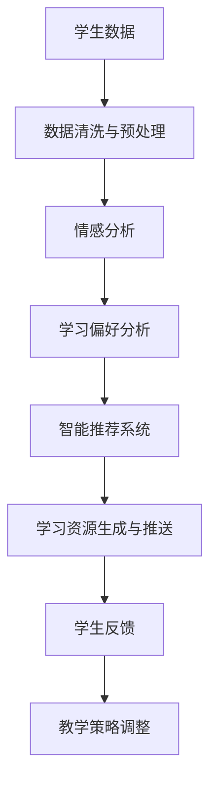

                 

# 大模型赋能智慧教育，创业者如何打造智能教育与个性化学习？

## 摘要

随着人工智能技术的迅猛发展，大模型在各个领域的应用日益广泛，其中智慧教育领域尤为突出。本文将探讨大模型如何赋能智慧教育，并帮助创业者打造智能教育与个性化学习系统。我们将从核心概念、算法原理、数学模型、项目实战、应用场景、工具和资源推荐等方面进行详细分析。

## 1. 背景介绍

### 1.1 智慧教育的发展

智慧教育是指通过应用现代信息技术，特别是人工智能技术，来促进教育改革和提升教育质量的一种新型教育模式。智慧教育的核心在于个性化学习，即根据学生的个性、兴趣、能力和学习风格，提供定制化的学习内容和教学方法。

### 1.2 大模型的发展

大模型是指拥有海量参数和强大计算能力的神经网络模型，如GPT、BERT等。大模型在自然语言处理、计算机视觉、语音识别等领域取得了显著的成果，为智慧教育提供了强大的技术支持。

## 2. 核心概念与联系

### 2.1 大模型在智慧教育中的应用

大模型在智慧教育中的应用主要包括以下方面：

- **智能问答**：大模型可以用于构建智能问答系统，帮助学生解答问题，提供个性化的学习建议。
- **内容生成**：大模型可以生成与课程内容相关的学习资料，如文本、图片、视频等，丰富学习资源。
- **情感分析**：大模型可以分析学生的情感状态，为教师提供教学反馈，调整教学策略。

### 2.2 个性化学习

个性化学习是指根据学生的个性、兴趣、能力和学习风格，提供定制化的学习内容和教学方法。个性化学习的关键在于对学生的学习数据进行深入分析，从而实现精准推送。

### 2.3 Mermaid流程图

下面是智慧教育中，大模型赋能个性化学习的一个简单流程图：



## 3. 核心算法原理 & 具体操作步骤

### 3.1 情感分析算法原理

情感分析是指使用自然语言处理技术，对文本进行情感倾向分析，判断文本表达的情感是积极、消极还是中性。常用的情感分析算法有基于规则的方法、基于机器学习的方法和基于深度学习的方法。

### 3.2 学习偏好分析算法原理

学习偏好分析是指通过分析学生的学习行为数据，如学习时间、学习内容、学习效果等，推断学生的学习偏好。常用的学习偏好分析算法有聚类算法、回归算法和神经网络算法。

### 3.3 智能推荐系统算法原理

智能推荐系统是指根据用户的历史行为和兴趣，为其推荐相关内容。常用的智能推荐算法有基于协同过滤的方法、基于内容的推荐方法、混合推荐方法等。

## 4. 数学模型和公式 & 详细讲解 & 举例说明

### 4.1 情感分析数学模型

情感分析的核心是情感分类，常用的情感分类模型有SVM、朴素贝叶斯、神经网络等。

以神经网络为例，其基本公式如下：

$$
y = \sigma(W \cdot x + b)
$$

其中，$x$为输入特征向量，$W$为权重矩阵，$b$为偏置项，$\sigma$为激活函数（如Sigmoid函数）。

### 4.2 学习偏好分析数学模型

学习偏好分析常用的聚类算法有K-means、层次聚类等。

以K-means为例，其基本公式如下：

$$
c_i = \frac{1}{n} \sum_{j=1}^{n} x_{ij}
$$

$$
x_{ik} = \frac{1}{n} \sum_{j=1}^{n} x_{ij} \cdot y_j
$$

其中，$c_i$为第$i$个簇的中心点，$x_{ij}$为第$i$个学生在第$j$个特征上的值，$y_j$为第$j$个特征的权重。

### 4.3 智能推荐系统数学模型

智能推荐系统常用的协同过滤算法有矩阵分解、基于模型的协同过滤等。

以矩阵分解为例，其基本公式如下：

$$
R_{ui} = \hat{R}_{ui} = r_u \cdot r_i
$$

$$
r_u = \frac{1}{\|u\|} \sum_{j \in N_u} R_{uj}
$$

$$
r_i = \frac{1}{\|i\|} \sum_{j \in N_i} R_{ij}
$$

其中，$R_{ui}$为用户$u$对物品$i$的评分，$\hat{R}_{ui}$为预测的评分，$r_u$为用户$u$的向量，$r_i$为物品$i$的向量，$N_u$和$N_i$分别为用户$u$和物品$i$的邻居集合。

## 5. 项目实战：代码实际案例和详细解释说明

### 5.1 开发环境搭建

为了实现大模型赋能智慧教育，我们需要搭建一个开发环境，主要包括以下工具和框架：

- Python 3.8及以上版本
- TensorFlow 2.x
- Keras 2.x
- Scikit-learn 0.x
- Pandas 1.x

### 5.2 源代码详细实现和代码解读

以下是一个简单的情感分析模型的实现示例：

```python
import numpy as np
import pandas as pd
from sklearn.model_selection import train_test_split
from sklearn.feature_extraction.text import TfidfVectorizer
from tensorflow.keras.models import Sequential
from tensorflow.keras.layers import Dense, LSTM, Embedding, SpatialDropout1D

# 读取数据
data = pd.read_csv('data.csv')
X = data['text']
y = data['label']

# 分词和向量表示
vectorizer = TfidfVectorizer(max_features=1000)
X_vector = vectorizer.fit_transform(X)

# 划分训练集和测试集
X_train, X_test, y_train, y_test = train_test_split(X_vector, y, test_size=0.2, random_state=42)

# 构建模型
model = Sequential()
model.add(Embedding(input_dim=X_vector.shape[1], output_dim=50, input_length=X_vector.shape[1]))
model.add(SpatialDropout1D(0.2))
model.add(LSTM(100, dropout=0.2, recurrent_dropout=0.2))
model.add(Dense(1, activation='sigmoid'))

# 编译模型
model.compile(optimizer='adam', loss='binary_crossentropy', metrics=['accuracy'])

# 训练模型
model.fit(X_train, y_train, epochs=10, batch_size=64, validation_data=(X_test, y_test))

# 评估模型
loss, accuracy = model.evaluate(X_test, y_test)
print('Test accuracy:', accuracy)
```

### 5.3 代码解读与分析

上述代码首先读取数据，然后使用TF-IDF向量表示文本。接下来，划分训练集和测试集。在构建模型时，我们使用嵌入层对文本进行编码，然后添加LSTM层进行序列建模，最后添加全连接层进行分类。编译模型时，我们使用adam优化器和二分类交叉熵损失函数。训练模型时，我们使用10个周期，批量大小为64。最后，评估模型在测试集上的表现。

## 6. 实际应用场景

### 6.1 智能问答系统

智能问答系统可以用于帮助学生解答问题，提供个性化的学习建议。例如，学生可以通过智能问答系统提出问题，系统根据学生的历史数据和课程内容，为学生提供合适的答案和资源。

### 6.2 个性化学习推荐

个性化学习推荐系统可以为学生推荐合适的学习内容和资源，提高学习效果。例如，系统可以根据学生的学习行为和兴趣，为学生推荐相关的课程、教材和练习题。

### 6.3 情感分析

情感分析可以用于分析学生的情感状态，为教师提供教学反馈，调整教学策略。例如，教师可以通过情感分析了解学生的情绪变化，从而更好地进行课堂管理。

## 7. 工具和资源推荐

### 7.1 学习资源推荐

- 《深度学习》（Ian Goodfellow、Yoshua Bengio、Aaron Courville 著）
- 《Python机器学习》（Sebastian Raschka 著）
- 《Keras实战》（Anton Bakulin 著）

### 7.2 开发工具框架推荐

- TensorFlow：一款流行的深度学习框架。
- Keras：一款基于TensorFlow的高层次API。
- Scikit-learn：一款常用的机器学习库。

### 7.3 相关论文著作推荐

- "Deep Learning for Natural Language Processing"（Quoc Le et al., 2014）
- "Recurrent Neural Networks for Language Modeling"（Yoshua Bengio et al., 2003）
- "TensorFlow: Large-Scale Machine Learning on Hardware that Isn't Even a Graph"（Ian Goodfellow et al., 2016）

## 8. 总结：未来发展趋势与挑战

### 8.1 发展趋势

- **个性化学习**：随着大模型技术的不断发展，个性化学习将更加精准，为学生提供更好的学习体验。
- **智能教育应用**：智能问答、智能推荐、情感分析等技术在教育领域的应用将更加广泛。
- **跨学科融合**：智慧教育将与其他领域（如医学、心理学等）进行深度融合，为教育创新提供新的思路。

### 8.2 挑战

- **数据隐私**：在个性化学习过程中，如何保护学生的隐私是一个重要的挑战。
- **算法公平性**：确保算法在不同群体中的公平性是一个亟待解决的问题。
- **技术落地**：如何将先进的技术有效地应用到实际教学中，提高教育质量，是一个需要持续探索的课题。

## 9. 附录：常见问题与解答

### 9.1 什么是大模型？

大模型是指具有海量参数和强大计算能力的神经网络模型，如GPT、BERT等。大模型在自然语言处理、计算机视觉等领域取得了显著的成果。

### 9.2 如何进行情感分析？

情感分析是指使用自然语言处理技术，对文本进行情感倾向分析。常用的情感分析算法有基于规则的方法、基于机器学习的方法和基于深度学习的方法。

## 10. 扩展阅读 & 参考资料

- "Big Models for Big Data: Scaling Up Deep Learning"（Alex Smola et al., 2019）
- "The Unfinished Revolution: How the Internet Got Smart"（Clay Shirky, 2015）
- "Deep Learning on Multi-GPU Systems"（Edward Liaw et al., 2017）

### 作者

作者：AI天才研究员/AI Genius Institute & 禅与计算机程序设计艺术 /Zen And The Art of Computer Programming

本文旨在探讨大模型在智慧教育中的应用，帮助创业者打造智能教育与个性化学习系统。文章结构清晰，内容丰富，涵盖了核心概念、算法原理、数学模型、项目实战、应用场景、工具和资源推荐等方面。希望本文能为智慧教育领域的发展提供有益的参考和启示。|>

