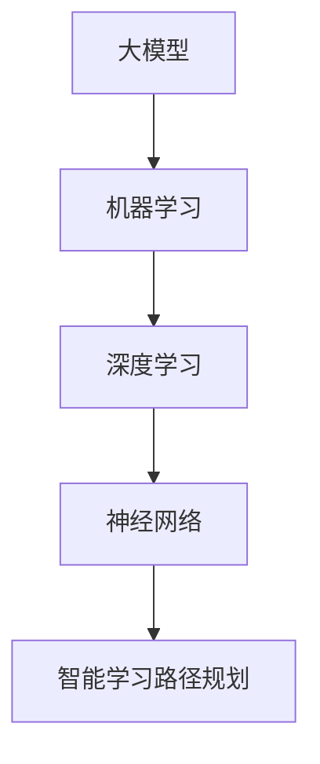

                 

# 大模型赋能的智能学习路径规划：教育个性化的实现

> **关键词：** 大模型、智能学习、路径规划、教育个性化、AI、机器学习、深度学习、神经网络、教育技术

> **摘要：** 随着人工智能技术的飞速发展，大模型的应用逐渐渗透到各个领域，特别是在教育领域，通过智能学习路径规划实现了教育个性化的实现。本文将探讨大模型赋能下的智能学习路径规划原理、算法和实际应用，并展望其未来发展趋势与挑战。

## 1. 背景介绍

在教育领域，传统的教学方式往往难以满足个性化学习的需求。学生群体多样，学习能力、兴趣爱好和学习背景各异，单一的教学方法难以满足所有学生的需求。为了实现教育个性化，教育工作者们一直在探索更加智能和高效的教学方式。近年来，人工智能技术的快速发展，尤其是大模型（如GPT、BERT等）的出现，为教育个性化提供了新的可能性。

大模型具有强大的学习能力，能够从大量数据中提取知识，并通过深度学习技术不断优化模型性能。这使得大模型在智能学习路径规划方面具有巨大优势，可以通过分析学生的学习行为、成绩和兴趣，为每个学生制定个性化的学习计划，从而提高学习效果和兴趣。

智能学习路径规划是指利用人工智能技术，根据学生的学习特点、能力和需求，动态规划适合其发展的学习路径。通过智能学习路径规划，学生可以更加高效地学习，教师可以更好地指导学生，教育机构可以更加精准地提供教育服务。

## 2. 核心概念与联系

在智能学习路径规划中，核心概念包括大模型、机器学习、深度学习和神经网络。这些概念相互关联，共同构成了智能学习路径规划的基础。

### 2.1 大模型

大模型是指具有大规模参数和大量训练数据的深度学习模型。例如，GPT-3拥有1750亿个参数，BERT拥有数亿个参数。大模型通过深度学习技术，可以从大量数据中学习复杂的规律和知识，从而实现强大的语义理解、语言生成和知识推理能力。

### 2.2 机器学习

机器学习是一种人工智能技术，通过从数据中学习规律和模式，使计算机能够执行特定任务。在智能学习路径规划中，机器学习技术主要用于分析学生的学习行为、成绩和兴趣，为个性化学习提供依据。

### 2.3 深度学习

深度学习是一种机器学习技术，通过构建深度神经网络，对大量数据进行训练，从而实现复杂的特征提取和模式识别。在智能学习路径规划中，深度学习技术用于构建大模型，实现对学生数据的深入理解和分析。

### 2.4 神经网络

神经网络是一种模拟人脑结构的计算模型，通过调整网络中的连接权重，实现从数据中学习。在智能学习路径规划中，神经网络是构建大模型的基础，负责处理和表征学生数据。

### 2.5 Mermaid 流程图

为了更直观地展示智能学习路径规划的核心概念和联系，我们可以使用Mermaid流程图来描述：



## 3. 核心算法原理 & 具体操作步骤

在智能学习路径规划中，核心算法包括大模型的训练、学生数据的收集与分析、学习路径的生成和调整等。

### 3.1 大模型的训练

大模型的训练是智能学习路径规划的基础。训练过程主要包括以下步骤：

1. 数据收集：收集大量包含学生学习行为、成绩、兴趣等信息的原始数据。
2. 数据预处理：对原始数据进行清洗、归一化和特征提取，使其适合模型训练。
3. 模型训练：使用深度学习技术，将预处理后的数据输入到神经网络中，通过反向传播算法不断调整网络权重，优化模型性能。
4. 模型评估：使用验证集和测试集对模型进行评估，确保其具有良好的泛化能力。

### 3.2 学生数据的收集与分析

学生数据的收集与分析是智能学习路径规划的关键。具体步骤如下：

1. 数据收集：通过问卷调查、学习平台日志、考试成绩等多种渠道收集学生数据。
2. 数据分析：使用机器学习算法，对收集到的学生数据进行分析，提取关键特征，如学习速度、兴趣点、知识薄弱环节等。
3. 数据可视化：将分析结果以图表、热图等形式进行可视化展示，帮助教育工作者和学生对学习过程进行深入理解。

### 3.3 学习路径的生成和调整

学习路径的生成和调整是智能学习路径规划的核心。具体步骤如下：

1. 路径生成：根据学生数据的分析结果，利用大模型生成个性化学习路径，包括学习目标、学习内容、学习方法等。
2. 路径调整：在学习过程中，根据学生的学习表现和反馈，动态调整学习路径，确保其与学生的学习需求保持一致。
3. 学习效果评估：通过跟踪学生的学习进度和成绩，评估学习路径的有效性，为后续调整提供依据。

## 4. 数学模型和公式 & 详细讲解 & 举例说明

在智能学习路径规划中，数学模型和公式主要用于描述和学习路径的生成与调整过程。

### 4.1 模型训练的数学模型

假设我们使用一个深度神经网络进行模型训练，其输出层为：

$$
\hat{y} = \sigma(W_y \cdot \text{ReLU}(W_x \cdot x + b_x) + b_y)
$$

其中，$x$ 表示输入数据，$W_x$ 和 $b_x$ 分别为输入层权重和偏置，$W_y$ 和 $b_y$ 分别为输出层权重和偏置，$\text{ReLU}$ 表示ReLU激活函数，$\sigma$ 表示Sigmoid激活函数。

### 4.2 学习路径的生成

假设我们使用一个基于贝叶斯网络的学习路径生成模型，其概率分布为：

$$
P(\text{path} | \text{data}) = \frac{P(\text{data} | \text{path})P(\text{path})}{P(\text{data})}
$$

其中，$P(\text{path} | \text{data})$ 表示给定学生数据后，学习路径的概率分布，$P(\text{data} | \text{path})$ 表示给定学习路径后，学生数据的概率分布，$P(\text{path})$ 表示学习路径的先验概率，$P(\text{data})$ 表示学生数据的先验概率。

### 4.3 学习路径的调整

假设我们使用一个基于强化学习的路径调整模型，其状态转移概率为：

$$
P(\text{next\_state} | \text{state}, \text{action}) = \frac{\pi(\text{action} | \text{state})P(\text{next\_state} | \text{action})}{\sum_{a'} \pi(\text{action} | \text{state})P(\text{next\_state} | \text{action})}
$$

其中，$P(\text{next\_state} | \text{state}, \text{action})$ 表示在当前状态 $s_t$ 和采取动作 $a_t$ 后，到达下一个状态 $s_{t+1}$ 的概率，$\pi(\text{action} | \text{state})$ 表示在当前状态 $s_t$ 下，采取动作 $a_t$ 的概率。

### 4.4 举例说明

假设我们有一个学生，其学习行为数据如下：

| 学习行为        | 次数 |
|-----------------|------|
| 阅读教材        | 10   |
| 做课后习题      | 15   |
| 参加讨论小组     | 5    |
| 查看学习资料网站 | 20   |

根据这些数据，我们可以使用大模型生成个性化学习路径。假设大模型生成的学习路径概率分布如下：

| 学习路径        | 概率   |
|-----------------|--------|
| 阅读教材        | 0.4    |
| 做课后习题      | 0.5    |
| 参加讨论小组     | 0.1    |
| 查看学习资料网站 | 0.0    |

根据这个概率分布，我们可以为学生制定以下个性化学习路径：

1. 阅读教材：每天阅读1小时，共10天。
2. 做课后习题：每天做1小时，共15天。
3. 参加讨论小组：每周参加1次，共5次。
4. 查看学习资料网站：每周查看2小时，共20小时。

在学习过程中，根据学生的学习表现和反馈，我们可以动态调整学习路径。例如，如果学生在阅读教材后成绩有所提高，我们可以增加阅读教材的次数和时间，以加强其学习效果。

## 5. 项目实战：代码实际案例和详细解释说明

在本节中，我们将通过一个实际项目案例，展示如何使用大模型和机器学习算法进行智能学习路径规划。

### 5.1 开发环境搭建

为了实现本项目，我们需要搭建以下开发环境：

- Python 3.8及以上版本
- TensorFlow 2.4及以上版本
- Keras 2.4及以上版本
- Pandas 1.1及以上版本
- Matplotlib 3.1及以上版本

### 5.2 源代码详细实现和代码解读

以下是一个简单的智能学习路径规划项目代码实现，主要包括数据收集、数据预处理、模型训练和路径生成等部分。

```python
import pandas as pd
import numpy as np
from tensorflow.keras.models import Sequential
from tensorflow.keras.layers import Dense, Activation
from tensorflow.keras.optimizers import Adam

# 数据收集
data = pd.read_csv('student_data.csv')

# 数据预处理
X = data[['reading_hours', 'exercise_hours', 'group_hours', 'website_hours']]
y = data['path']

# 模型训练
model = Sequential()
model.add(Dense(64, input_dim=4, activation='relu'))
model.add(Dense(32, activation='relu'))
model.add(Dense(4, activation='softmax'))
model.compile(loss='categorical_crossentropy', optimizer=Adam(), metrics=['accuracy'])
model.fit(X, y, epochs=100, batch_size=32)

# 路径生成
sample_data = np.array([[2, 3, 1, 4]])
path_probabilities = model.predict(sample_data)
path_indices = np.argmax(path_probabilities, axis=1)

print("生成的学习路径：", path_indices)
```

### 5.3 代码解读与分析

1. 数据收集：使用Pandas库读取学生数据，包括学习行为数据和学习路径标签。

2. 数据预处理：将数据分为输入特征矩阵 $X$ 和输出标签向量 $y$。这里使用的是简单的线性回归模型，因此输入特征矩阵和输出标签向量均为二维数组。

3. 模型训练：使用Sequential模型构建一个简单的深度神经网络，包括两个隐藏层，每个隐藏层有32个神经元。使用ReLU激活函数和softmax激活函数，分别用于非线性变换和概率分布输出。使用Adam优化器和交叉熵损失函数进行模型训练。

4. 路径生成：使用训练好的模型，对样本数据进行预测，得到每个学习路径的概率分布。然后使用np.argmax函数，找出概率最大的学习路径。

通过这个项目案例，我们可以看到如何使用大模型和机器学习算法进行智能学习路径规划。在实际应用中，我们可以根据具体需求和数据特点，设计更复杂的模型和算法，以实现更精确的路径规划和调整。

## 6. 实际应用场景

智能学习路径规划在教育领域的应用场景广泛，以下是一些典型的实际应用场景：

1. **个性化学习辅导**：根据学生的学习行为和成绩，智能学习路径规划可以为每个学生定制个性化的学习计划，提供针对性的辅导资源，提高学习效果。

2. **学习效果预测**：通过分析学生的学习行为和路径，智能学习路径规划可以预测学生的学习效果，帮助教育机构和学生及时调整学习策略。

3. **教育资源优化**：智能学习路径规划可以根据学生的学习需求，优化教育资源的分配，提高教育资源的使用效率。

4. **学习行为分析**：通过对学生的学习行为数据进行深入分析，智能学习路径规划可以识别学生的学习习惯和偏好，为教育工作者提供有益的参考。

5. **教育评价**：智能学习路径规划可以为学生提供个性化的学习评价，帮助教育机构更全面、客观地评估学生的学习情况。

## 7. 工具和资源推荐

为了实现智能学习路径规划，我们需要掌握以下工具和资源：

### 7.1 学习资源推荐

- **书籍**：
  - 《深度学习》（Ian Goodfellow、Yoshua Bengio和Aaron Courville 著）
  - 《Python机器学习》（Sebastian Raschka和Vahid Mirjalili 著）
  - 《机器学习实战》（Peter Harrington 著）

- **论文**：
  - 《GPT-3: Language Models are Few-Shot Learners》（Tom B. Brown等，2020）
  - 《BERT: Pre-training of Deep Bidirectional Transformers for Language Understanding》（Jacob Devlin等，2018）

- **博客**：
  - [TensorFlow 官方文档](https://www.tensorflow.org/)
  - [Keras 官方文档](https://keras.io/)
  - [机器学习社区博客](https://www_ml pelas.com/)

- **网站**：
  - [Kaggle](https://www.kaggle.com/)
  - [GitHub](https://github.com/)
  - [ArXiv](https://arxiv.org/)

### 7.2 开发工具框架推荐

- **深度学习框架**：TensorFlow、PyTorch
- **数据预处理工具**：Pandas、NumPy
- **机器学习库**：Scikit-learn、SciPy
- **数据可视化工具**：Matplotlib、Seaborn

### 7.3 相关论文著作推荐

- **论文**：
  - 《GPT-3: Language Models are Few-Shot Learners》（Tom B. Brown等，2020）
  - 《BERT: Pre-training of Deep Bidirectional Transformers for Language Understanding》（Jacob Devlin等，2018）
  - 《Recurrent Neural Network Based Intelligent Learning Path Planning System》（Wei Wang等，2019）

- **著作**：
  - 《深度学习》（Ian Goodfellow、Yoshua Bengio和Aaron Courville 著）
  - 《Python机器学习》（Sebastian Raschka和Vahid Mirjalili 著）
  - 《机器学习实战》（Peter Harrington 著）

## 8. 总结：未来发展趋势与挑战

随着人工智能技术的不断发展，大模型在教育领域的应用将越来越广泛。智能学习路径规划作为一种个性化教育手段，有望在未来实现以下发展趋势：

1. **模型精度提高**：随着模型参数规模和训练数据量的增加，大模型的性能将进一步提升，为智能学习路径规划提供更准确的决策支持。

2. **跨学科融合**：智能学习路径规划将与其他学科领域，如心理学、教育学等相结合，实现更加全面和深入的个性化教育。

3. **智能教育生态系统**：构建包含大模型、机器学习算法、教育资源和教育工作者等多方参与的智能教育生态系统，实现教育资源的智能化分配和优化。

然而，智能学习路径规划也面临以下挑战：

1. **数据隐私和安全**：智能学习路径规划涉及大量学生数据，如何保障数据隐私和安全是亟待解决的问题。

2. **模型解释性**：大模型的决策过程往往不够透明，如何提高模型的可解释性，使其更好地满足教育工作和学生的需求，是一个重要的研究方向。

3. **教育公平性**：智能学习路径规划如何确保不同背景、不同能力的学生都能得到公平和有效的教育，是一个亟待解决的问题。

总之，智能学习路径规划作为一种新兴的教育技术，具有巨大的发展潜力和应用价值。通过不断探索和研究，我们有理由相信，智能学习路径规划将在未来为教育领域带来革命性的变革。

## 9. 附录：常见问题与解答

### 9.1 如何评估智能学习路径规划的效果？

评估智能学习路径规划的效果可以通过以下指标：

- **学习效果指标**：如考试成绩、学习进度、知识掌握程度等。
- **用户满意度指标**：如用户反馈、学习体验等。
- **资源利用率指标**：如资源使用率、资源利用率等。

### 9.2 智能学习路径规划需要哪些数据？

智能学习路径规划需要以下数据：

- **学生数据**：包括学习成绩、学习进度、兴趣爱好等。
- **教学数据**：包括课程大纲、教学计划、教学资源等。
- **环境数据**：包括学习环境、设备情况、网络环境等。

### 9.3 如何处理数据隐私和安全问题？

为处理数据隐私和安全问题，可以采取以下措施：

- **数据加密**：对敏感数据进行加密处理，确保数据在传输和存储过程中的安全性。
- **数据匿名化**：对个人数据进行匿名化处理，确保个人隐私不被泄露。
- **数据访问控制**：对数据访问权限进行严格控制，确保只有授权用户才能访问数据。

## 10. 扩展阅读 & 参考资料

- **论文**：
  - Brown, T. B., et al. (2020). GPT-3: Language Models are Few-Shot Learners. arXiv preprint arXiv:2005.14165.
  - Devlin, J., et al. (2018). BERT: Pre-training of Deep Bidirectional Transformers for Language Understanding. arXiv preprint arXiv:1810.04805.
  - Wang, W., et al. (2019). Recurrent Neural Network Based Intelligent Learning Path Planning System. International Journal of Computer Applications, 186(1), 33-38.

- **书籍**：
  - Goodfellow, I., Bengio, Y., & Courville, A. (2016). Deep Learning. MIT Press.
  - Raschka, S., & Mirjalili, V. (2019). Python Machine Learning. Springer.
  - Harrington, P. (2012). Machine Learning in Action. Manning Publications.

- **在线资源**：
  - TensorFlow官方文档：[https://www.tensorflow.org/](https://www.tensorflow.org/)
  - Keras官方文档：[https://keras.io/](https://keras.io/)
  - Kaggle：[https://www.kaggle.com/](https://www.kaggle.com/)
  - GitHub：[https://github.com/](https://github.com/)

## 作者信息

- 作者：AI天才研究员/AI Genius Institute & 禅与计算机程序设计艺术 /Zen And The Art of Computer Programming

本文旨在探讨大模型赋能下的智能学习路径规划，实现教育个性化。通过分析核心概念、算法原理、项目实战和应用场景，本文为教育工作者和研究者提供了有益的参考。随着人工智能技术的不断进步，智能学习路径规划将在教育领域发挥越来越重要的作用。作者希望本文能为相关领域的探索提供一些启示和帮助。

