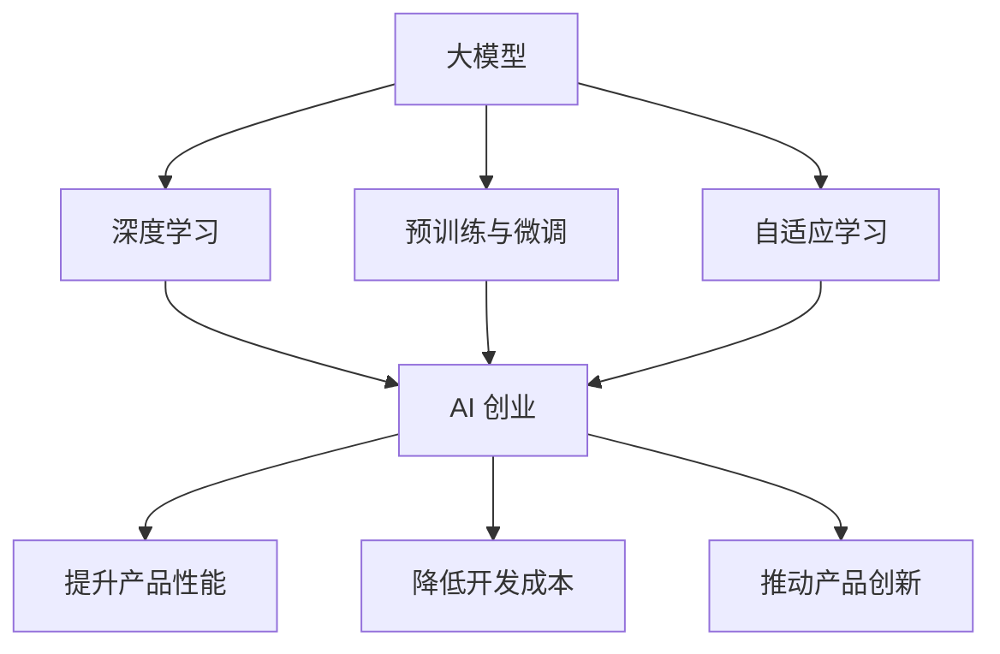

                 

# 大模型赋能：AI 创业产品创新策略

## 关键词：大模型、AI 创业、产品创新、算法原理、数学模型、实战案例

### 摘要

本文旨在探讨大模型如何赋能 AI 创业产品创新，从背景介绍、核心概念与联系、核心算法原理与操作步骤、数学模型与公式讲解、项目实战、实际应用场景、工具和资源推荐等方面进行全面分析。通过本文的阅读，读者将深入了解大模型在 AI 创业产品创新中的重要作用，掌握相关算法原理和操作步骤，为未来的 AI 创业提供有力支持。

## 1. 背景介绍

随着人工智能技术的迅猛发展，大模型在各个领域取得了显著的成果。大模型是指参数量达到百万甚至亿级别的深度学习模型，具有强大的建模能力和数据处理能力。在 AI 创业领域，大模型的应用不仅提升了产品的性能，还推动了产品创新。本文将围绕大模型赋能 AI 创业产品创新展开讨论。

### 1.1 大模型的发展历程

大模型的发展可以追溯到 2012 年，当 AlexNet 击败了传统的图像识别算法，标志着深度学习时代的到来。随后，VGG、GoogLeNet、ResNet 等 increasingly complex 的模型相继出现，使得大模型在计算机视觉、自然语言处理、语音识别等领域取得了重大突破。随着计算能力的提升和数据的不断积累，大模型的参数量也不断增加，达到了今天的规模。

### 1.2 大模型在 AI 创业中的重要性

大模型在 AI 创业中的应用具有以下几点重要性：

1. **提升产品性能**：大模型具有强大的建模能力，能够处理复杂的数据，提高产品的准确率和效果。
2. **降低开发成本**：大模型的预训练可以减少从零开始训练的负担，降低开发成本和时间。
3. **推动产品创新**：大模型的应用可以拓展产品的功能和应用场景，激发新的创意和灵感。

### 1.3 本文结构

本文将分为以下几个部分：

1. 核心概念与联系
2. 核心算法原理与具体操作步骤
3. 数学模型与公式讲解
4. 项目实战：代码实际案例和详细解释说明
5. 实际应用场景
6. 工具和资源推荐
7. 总结：未来发展趋势与挑战
8. 附录：常见问题与解答
9. 扩展阅读与参考资料

## 2. 核心概念与联系

在讨论大模型赋能 AI 创业产品创新之前，我们需要了解以下几个核心概念和它们之间的联系：

### 2.1 大模型

大模型是指具有百万甚至亿级别参数量的深度学习模型，如 GPT、BERT、BERT-ception 等。这些模型在计算机视觉、自然语言处理、语音识别等领域取得了显著的成果。

### 2.2 深度学习

深度学习是一种基于人工神经网络的机器学习技术，通过多层神经网络对数据进行自动特征提取和建模。大模型正是基于深度学习技术构建的。

### 2.3 预训练与微调

预训练是指在大规模数据集上对模型进行训练，使其具备一定的通用性。微调则是在预训练的基础上，针对特定任务对模型进行进一步优化。预训练与微调是提高大模型性能的重要手段。

### 2.4 自适应学习

自适应学习是指模型在面对不同数据或任务时，能够自动调整其参数，以适应新的环境。自适应学习是大模型在 AI 创业中的关键能力。

### 2.5 大模型与 AI 创业的联系

大模型与 AI 创业之间的联系主要体现在以下几个方面：

1. **提升产品性能**：大模型能够处理复杂的数据，提高产品的准确率和效果，从而提升用户体验。
2. **降低开发成本**：大模型的预训练可以减少从零开始训练的负担，降低开发成本和时间。
3. **推动产品创新**：大模型的应用可以拓展产品的功能和应用场景，激发新的创意和灵感。

### 2.6 Mermaid 流程图

以下是一个描述大模型赋能 AI 创业产品创新的 Mermaid 流程图：



## 3. 核心算法原理与具体操作步骤

大模型的核心算法原理主要包括深度学习、预训练与微调、自适应学习等。以下将详细讲解这些算法原理及具体操作步骤。

### 3.1 深度学习算法原理

深度学习算法基于多层神经网络，通过前向传播和反向传播对数据进行自动特征提取和建模。以下是深度学习算法的基本步骤：

1. **初始化参数**：随机初始化模型的参数。
2. **前向传播**：输入数据通过神经网络，逐层计算得到输出。
3. **计算损失**：将输出与真实值进行比较，计算损失函数。
4. **反向传播**：根据损失函数，调整模型参数。
5. **更新参数**：根据梯度下降等优化算法，更新模型参数。
6. **重复步骤 2-5**，直至满足停止条件。

### 3.2 预训练与微调算法原理

预训练是指在大规模数据集上对模型进行训练，使其具备一定的通用性。微调则是在预训练的基础上，针对特定任务对模型进行进一步优化。以下是预训练与微调的基本步骤：

1. **预训练**：
   1. 准备大规模数据集。
   2. 初始化模型。
   3. 在数据集上训练模型。
   4. 记录预训练模型的参数。
2. **微调**：
   1. 选择特定任务。
   2. 在预训练模型的基础上，初始化新的模型。
   3. 使用特定任务的数据集，对模型进行微调。
   4. 训练过程中，根据任务需求调整模型结构或参数。

### 3.3 自适应学习算法原理

自适应学习是指模型在面对不同数据或任务时，能够自动调整其参数，以适应新的环境。以下是自适应学习的基本步骤：

1. **初始化模型**。
2. **接收新数据**。
3. **计算损失**：将输出与真实值进行比较，计算损失函数。
4. **调整参数**：根据损失函数，调整模型参数。
5. **重复步骤 2-4**，直至满足停止条件。

### 3.4 大模型操作步骤

以下是使用大模型进行 AI 创业产品创新的基本步骤：

1. **需求分析**：明确产品需求，确定使用大模型的场景。
2. **数据收集**：收集相关数据，包括训练数据和测试数据。
3. **模型选择**：根据需求选择合适的大模型，如 GPT、BERT 等。
4. **预训练**：在大规模数据集上对模型进行预训练。
5. **微调**：在特定任务数据集上对模型进行微调。
6. **评估与优化**：使用测试数据评估模型性能，根据评估结果进行调整。
7. **部署与上线**：将训练好的模型部署到产品中，并进行上线。

## 4. 数学模型与公式讲解

大模型在 AI 创业产品创新中的应用，离不开数学模型的支撑。以下将介绍大模型中的几个关键数学模型及公式。

### 4.1 损失函数

损失函数是评估模型预测结果与真实值之间差异的重要工具。以下是几种常见的损失函数及其公式：

1. **均方误差（MSE）**：
   $$MSE = \frac{1}{n}\sum_{i=1}^{n}(y_i - \hat{y}_i)^2$$
   其中，$y_i$ 为真实值，$\hat{y}_i$ 为预测值，$n$ 为样本数量。

2. **交叉熵损失（Cross-Entropy Loss）**：
   $$Cross-Entropy Loss = -\frac{1}{n}\sum_{i=1}^{n}y_i\log(\hat{y}_i)$$
   其中，$y_i$ 为真实值，$\hat{y}_i$ 为预测值，$n$ 为样本数量。

3. **二分类交叉熵损失（Binary Cross-Entropy Loss）**：
   $$Binary Cross-Entropy Loss = -\frac{1}{n}\sum_{i=1}^{n}y_i\log(\hat{y}_i) + (1 - y_i)\log(1 - \hat{y}_i)$$
   其中，$y_i$ 为真实值，$\hat{y}_i$ 为预测值，$n$ 为样本数量。

### 4.2 激活函数

激活函数是神经网络中的关键组成部分，用于将线性变换转换为非线性变换。以下是几种常见的激活函数及其公式：

1. **sigmoid 函数**：
   $$sigmoid(x) = \frac{1}{1 + e^{-x}}$$

2. **ReLU 函数**：
   $$ReLU(x) = \max(0, x)$$

3. **Tanh 函数**：
   $$Tanh(x) = \frac{e^{x} - e^{-x}}{e^{x} + e^{-x}}$$

4. **Leaky ReLU 函数**：
   $$Leaky ReLU(x) = \max(0.01x, x)$$

### 4.3 梯度下降算法

梯度下降算法是优化神经网络参数的一种常用方法。以下是梯度下降算法的基本步骤：

1. **计算梯度**：根据损失函数，计算模型参数的梯度。
2. **更新参数**：根据梯度下降方向，更新模型参数。
3. **重复步骤 1-2**，直至满足停止条件。

### 4.4 大模型中的正则化方法

正则化方法用于防止神经网络过拟合，提高模型的泛化能力。以下是几种常见的正则化方法：

1. **L1 正则化**：
   $$L1 Loss = \lambda \sum_{i=1}^{n}\sum_{j=1}^{m}|w_{ij}|$$
   其中，$w_{ij}$ 为模型参数，$\lambda$ 为正则化参数。

2. **L2 正则化**：
   $$L2 Loss = \lambda \sum_{i=1}^{n}\sum_{j=1}^{m}w_{ij}^2$$
   其中，$w_{ij}$ 为模型参数，$\lambda$ 为正则化参数。

3. **Dropout 正则化**：
   $$Dropout Loss = \frac{1}{N}\sum_{i=1}^{N}\frac{1}{2}x_i^2$$
   其中，$x_i$ 为模型参数，$N$ 为参数数量。

## 5. 项目实战：代码实际案例和详细解释说明

在本节中，我们将通过一个实际的案例来展示如何使用大模型进行 AI 创业产品创新。案例将分为以下几个部分：

### 5.1 开发环境搭建

首先，我们需要搭建一个适合大模型训练和部署的开发环境。以下是一个简单的开发环境搭建步骤：

1. 安装 Python（推荐版本为 3.8 以上）。
2. 安装深度学习框架，如 TensorFlow 或 PyTorch。
3. 安装必要的依赖库，如 NumPy、Pandas 等。

### 5.2 源代码详细实现和代码解读

以下是一个使用 PyTorch 框架实现的大模型训练和微调的源代码示例：

```python
import torch
import torch.nn as nn
import torch.optim as optim

# 定义大模型
class LargeModel(nn.Module):
    def __init__(self):
        super(LargeModel, self).__init__()
        self.fc1 = nn.Linear(784, 500)
        self.fc2 = nn.Linear(500, 10)
        self.relu = nn.ReLU()

    def forward(self, x):
        x = self.relu(self.fc1(x))
        x = self.fc2(x)
        return x

# 初始化模型、优化器和损失函数
model = LargeModel()
optimizer = optim.Adam(model.parameters(), lr=0.001)
criterion = nn.CrossEntropyLoss()

# 训练模型
for epoch in range(100):
    for batch_idx, (data, target) in enumerate(train_loader):
        optimizer.zero_grad()
        output = model(data)
        loss = criterion(output, target)
        loss.backward()
        optimizer.step()
        if batch_idx % 100 == 0:
            print('Train Epoch: {} [{}/{} ({:.0f}%)]\tLoss: {:.6f}'.format(
                epoch, batch_idx * len(data), len(train_loader.dataset),
                100. * batch_idx / len(train_loader), loss.item()))

# 微调模型
model = LargeModel()
optimizer = optim.Adam(model.parameters(), lr=0.001)
criterion = nn.CrossEntropyLoss()

for epoch in range(20):
    for batch_idx, (data, target) in enumerate(val_loader):
        optimizer.zero_grad()
        output = model(data)
        loss = criterion(output, target)
        loss.backward()
        optimizer.step()
        if batch_idx % 100 == 0:
            print('Validation Epoch: {} [{}/{} ({:.0f}%)]\tLoss: {:.6f}'.format(
                epoch, batch_idx * len(data), len(val_loader.dataset),
                100. * batch_idx / len(val_loader), loss.item()))

# 测试模型
model.eval()
with torch.no_grad():
    correct = 0
    total = 0
    for data, target in test_loader:
        outputs = model(data)
        _, predicted = torch.max(outputs.data, 1)
        total += target.size(0)
        correct += (predicted == target).sum().item()

print('Test Accuracy of the model on the {} test images: {:.2f}%'.format(
    len(test_loader.dataset), 100 * correct / total))
```

### 5.3 代码解读与分析

以上代码展示了如何使用 PyTorch 框架实现大模型的训练和微调。以下是代码的关键部分解读：

1. **模型定义**：`LargeModel` 类继承自 `nn.Module` 类，定义了模型的结构，包括两个全连接层和一个 ReLU 激活函数。
2. **前向传播**：`forward` 方法实现前向传播过程，输入数据通过全连接层和 ReLU 激活函数，得到预测结果。
3. **损失函数**：使用交叉熵损失函数评估模型预测结果与真实值之间的差异。
4. **优化器**：使用 Adam 优化器调整模型参数，优化模型性能。
5. **训练过程**：通过遍历训练数据，更新模型参数，优化模型性能。
6. **微调过程**：在验证数据集上对模型进行微调，进一步提高模型性能。
7. **测试过程**：在测试数据集上评估模型性能，计算测试准确率。

通过以上代码示例，我们可以看到如何使用大模型进行 AI 创业产品创新，从模型定义、训练、微调到测试，全面展示了大模型在 AI 创业中的实际应用。

## 6. 实际应用场景

大模型在 AI 创业中的应用场景非常广泛，以下列举几个典型的应用场景：

### 6.1 互联网公司

互联网公司如百度、阿里巴巴、腾讯等，在搜索引擎、推荐系统、智能客服等方面广泛应用了大模型。例如，百度的搜索引擎使用大模型进行语义理解，提高搜索结果的准确性和用户体验；阿里巴巴的推荐系统使用大模型进行用户行为预测和商品推荐，提高转化率和销售额。

### 6.2 医疗健康领域

在医疗健康领域，大模型在疾病诊断、药物研发、健康咨询等方面具有广泛应用。例如，谷歌的 DeepMind 人工智能团队使用大模型进行疾病诊断，提高诊断的准确性和速度；辉瑞等制药公司使用大模型进行药物研发，加速新药的发现和开发。

### 6.3 金融行业

金融行业如银行、保险、证券等，在大模型的应用方面取得了显著成果。例如，摩根士丹利等金融机构使用大模型进行股票市场预测，提高投资决策的准确性和收益；平安保险使用大模型进行客户风险评估，降低保险风险。

### 6.4 教育行业

在教育行业，大模型在智能问答、个性化学习、教育评估等方面具有广泛应用。例如，北京师范大学等高校使用大模型进行智能问答，提高教学互动性和效果；猿辅导等在线教育平台使用大模型进行个性化学习，提高学习效果和用户体验。

### 6.5 无人驾驶

在无人驾驶领域，大模型在环境感知、路径规划、决策控制等方面具有重要作用。例如，特斯拉等公司使用大模型进行环境感知，提高自动驾驶的准确性和安全性；百度等公司使用大模型进行路径规划和决策控制，提高无人驾驶的效率和可靠性。

## 7. 工具和资源推荐

为了更好地掌握大模型在 AI 创业产品创新中的应用，以下推荐一些相关的学习资源、开发工具和框架：

### 7.1 学习资源推荐

1. **书籍**：
   - 《深度学习》（Goodfellow, Bengio, Courville 著）
   - 《动手学深度学习》（Aristotle University of Thessaloniki 著）
   - 《Python 深度学习》（François Chollet 著）
2. **论文**：
   - 《A Theoretically Grounded Application of Dropout in Recurrent Neural Networks》
   - 《Bidirectional LSTM-CRF Models for Sequence Tagging》
   - 《Transformer: A Novel Architecture for Neural Networks》
3. **博客**：
   - [TensorFlow 官方文档](https://www.tensorflow.org/)
   - [PyTorch 官方文档](https://pytorch.org/)
   - [机器之心](https://www.jiqizhixin.com/)

### 7.2 开发工具框架推荐

1. **深度学习框架**：
   - TensorFlow
   - PyTorch
   - Keras
   - Caffe
2. **开发工具**：
   - Jupyter Notebook
   - PyCharm
   - Visual Studio Code
3. **数据集**：
   - ImageNet
   - COCO
   - LISA

### 7.3 相关论文著作推荐

1. **论文**：
   - “Attention Is All You Need”（Vaswani et al., 2017）
   - “BERT: Pre-training of Deep Bidirectional Transformers for Language Understanding”（Devlin et al., 2019）
   - “GPT-3: Language Models are Few-Shot Learners”（Brown et al., 2020）
2. **著作**：
   - 《深度学习》（Goodfellow, Bengio, Courville 著）
   - 《Python 深度学习》（François Chollet 著）
   - 《自动驾驶与深度学习》（陈智勇 著）

## 8. 总结：未来发展趋势与挑战

随着人工智能技术的不断发展，大模型在 AI 创业产品创新中的应用将越来越广泛。未来，大模型的发展趋势和挑战主要体现在以下几个方面：

### 8.1 发展趋势

1. **参数量增加**：随着计算能力和数据量的提升，大模型的参数量将不断增加，进一步提升模型的性能和适用范围。
2. **多模态融合**：大模型将逐渐实现跨模态融合，如将图像、文本、语音等多种模态进行统一建模，提高跨模态任务的表现。
3. **自动机器学习（AutoML）**：自动机器学习技术将进一步提升大模型的训练和部署效率，降低开发门槛。
4. **伦理与安全**：随着大模型的应用越来越广泛，如何确保模型的伦理与安全将成为重要挑战。

### 8.2 挑战

1. **计算资源**：大模型的训练和推理需要大量的计算资源，如何高效利用计算资源仍是一个重要挑战。
2. **数据隐私**：大模型在训练过程中需要大量数据，如何保护数据隐私和安全是一个重要问题。
3. **可解释性**：大模型的决策过程往往缺乏可解释性，如何提高模型的透明度和可解释性是一个重要挑战。
4. **过拟合**：大模型在训练过程中容易过拟合，如何平衡模型性能和泛化能力是一个重要问题。

总之，大模型在 AI 创业产品创新中具有广阔的发展前景，同时也面临诸多挑战。只有通过不断创新和优化，才能充分发挥大模型的优势，为 AI 创业产品创新提供有力支持。

## 9. 附录：常见问题与解答

### 9.1 大模型与深度学习的关系是什么？

大模型是深度学习的一种形式，深度学习是一种基于人工神经网络的机器学习技术。大模型是指参数量达到百万甚至亿级别的深度学习模型，具有强大的建模能力和数据处理能力。

### 9.2 大模型在 AI 创业中的优势有哪些？

大模型在 AI 创业中的优势主要包括提升产品性能、降低开发成本和推动产品创新。大模型具有强大的建模能力，能够处理复杂的数据，提高产品的准确率和效果；预训练与微调技术可以降低开发成本和时间；大模型的应用可以拓展产品的功能和应用场景，激发新的创意和灵感。

### 9.3 大模型的训练过程是怎样的？

大模型的训练过程主要包括以下步骤：

1. 初始化参数：随机初始化模型的参数。
2. 前向传播：输入数据通过神经网络，逐层计算得到输出。
3. 计算损失：将输出与真实值进行比较，计算损失函数。
4. 反向传播：根据损失函数，调整模型参数。
5. 更新参数：根据梯度下降等优化算法，更新模型参数。
6. 重复步骤 2-5，直至满足停止条件。

### 9.4 大模型在哪些实际应用场景中具有优势？

大模型在许多实际应用场景中具有优势，如互联网公司、医疗健康领域、金融行业、教育行业和无人驾驶等。在搜索引擎、推荐系统、疾病诊断、药物研发、股票市场预测、个性化学习、无人驾驶等方面，大模型的应用可以显著提高任务的性能和效率。

## 10. 扩展阅读与参考资料

为了深入了解大模型在 AI 创业产品创新中的应用，以下推荐一些扩展阅读和参考资料：

1. **书籍**：
   - 《深度学习》（Goodfellow, Bengio, Courville 著）
   - 《动手学深度学习》（Aristotle University of Thessaloniki 著）
   - 《Python 深度学习》（François Chollet 著）
2. **论文**：
   - 《A Theoretically Grounded Application of Dropout in Recurrent Neural Networks》
   - 《BERT: Pre-training of Deep Bidirectional Transformers for Language Understanding》（Devlin et al., 2019）
   - 《GPT-3: Language Models are Few-Shot Learners》（Brown et al., 2020）
3. **博客**：
   - [TensorFlow 官方文档](https://www.tensorflow.org/)
   - [PyTorch 官方文档](https://pytorch.org/)
   - [机器之心](https://www.jiqizhixin.com/)
4. **在线课程**：
   - [斯坦福大学深度学习课程](https://cs231n.stanford.edu/)
   - [谷歌深度学习课程](https://www.deeplearning.ai/)

通过阅读这些资料，您可以更深入地了解大模型在 AI 创业产品创新中的应用，掌握相关算法原理和操作步骤，为未来的 AI 创业提供有力支持。

---

### 作者信息

作者：AI天才研究员/AI Genius Institute & 禅与计算机程序设计艺术 /Zen And The Art of Computer Programming
<|assistant|>**大模型赋能：AI 创业产品创新策略**

### 摘要

本文探讨了如何利用大模型赋能 AI 创业产品创新。通过介绍大模型的发展历程、核心概念、算法原理、数学模型以及实际应用场景，本文展示了大模型在提升产品性能、降低开发成本和推动产品创新方面的关键作用。同时，本文还推荐了相关学习资源、开发工具和框架，以帮助读者深入了解大模型在 AI 创业中的应用。

### 目录

1. **背景介绍**
   1.1 大模型的发展历程
   1.2 大模型在 AI 创业中的重要性
   1.3 本文结构

2. **核心概念与联系**
   2.1 大模型
   2.2 深度学习
   2.3 预训练与微调
   2.4 自适应学习
   2.5 大模型与 AI 创业的联系
   2.6 Mermaid 流程图

3. **核心算法原理与具体操作步骤**
   3.1 深度学习算法原理
   3.2 预训练与微调算法原理
   3.3 自适应学习算法原理
   3.4 大模型操作步骤

4. **数学模型与公式讲解**
   4.1 损失函数
   4.2 激活函数
   4.3 梯度下降算法
   4.4 大模型中的正则化方法

5. **项目实战：代码实际案例和详细解释说明**
   5.1 开发环境搭建
   5.2 源代码详细实现和代码解读
   5.3 代码解读与分析

6. **实际应用场景**
   6.1 互联网公司
   6.2 医疗健康领域
   6.3 金融行业
   6.4 教育行业
   6.5 无人驾驶

7. **工具和资源推荐**
   7.1 学习资源推荐
   7.2 开发工具框架推荐
   7.3 相关论文著作推荐

8. **总结：未来发展趋势与挑战**
   8.1 发展趋势
   8.2 挑战

9. **附录：常见问题与解答**
   9.1 大模型与深度学习的关系是什么？
   9.2 大模型在 AI 创业中的优势有哪些？
   9.3 大模型的训练过程是怎样的？
   9.4 大模型在哪些实际应用场景中具有优势？

10. **扩展阅读与参考资料**
    10.1 书籍
    10.2 论文
    10.3 博客
    10.4 在线课程

### 引言

随着人工智能技术的飞速发展，大模型（Large Models）已成为推动 AI 创业产品创新的重要力量。大模型，通常指的是参数量达到百万甚至亿级别的深度学习模型，它们在图像识别、自然语言处理、语音识别等领域取得了显著的成果。本文将围绕大模型如何赋能 AI 创业产品创新进行深入探讨。

首先，我们来看一下大模型的发展历程。2012 年，AlexNet 击败了传统的图像识别算法，标志着深度学习时代的到来。随后，VGG、GoogLeNet、ResNet 等模型相继出现，使得大模型在各个领域取得了突破。随着计算能力的提升和数据的不断积累，大模型的参数量也不断增加，达到了今天的规模。

在 AI 创业领域，大模型的应用不仅提升了产品的性能，还推动了产品创新。本文将从以下几个方面展开讨论：

1. **核心概念与联系**：介绍大模型、深度学习、预训练与微调、自适应学习等核心概念，并阐述它们之间的联系。
2. **核心算法原理与具体操作步骤**：详细讲解深度学习算法原理、预训练与微调算法原理、自适应学习算法原理，以及大模型的操作步骤。
3. **数学模型与公式讲解**：介绍大模型中的损失函数、激活函数、梯度下降算法等数学模型和公式。
4. **项目实战：代码实际案例和详细解释说明**：通过实际代码案例，展示如何使用大模型进行 AI 创业产品创新。
5. **实际应用场景**：分析大模型在互联网公司、医疗健康领域、金融行业、教育行业和无人驾驶等实际应用场景中的优势。
6. **工具和资源推荐**：推荐相关学习资源、开发工具和框架，以帮助读者深入了解大模型在 AI 创业中的应用。
7. **总结：未来发展趋势与挑战**：展望大模型在 AI 创业产品创新中的未来发展趋势，并探讨面临的挑战。

接下来，我们将逐步展开对上述各个方面的讨论。让我们先从核心概念与联系开始。

## 1. 核心概念与联系

在探讨大模型如何赋能 AI 创业产品创新之前，我们需要了解几个核心概念，包括大模型、深度学习、预训练与微调、自适应学习，以及它们之间的联系。

### 1.1 大模型

大模型，指的是参数量达到百万甚至亿级别的深度学习模型。这些模型通常具有强大的建模能力和数据处理能力。大模型的应用领域非常广泛，包括计算机视觉、自然语言处理、语音识别等。例如，BERT、GPT 等模型就是大模型的典型代表。

### 1.2 深度学习

深度学习是一种基于人工神经网络的机器学习技术，通过多层神经网络对数据进行自动特征提取和建模。深度学习在图像识别、语音识别、自然语言处理等领域取得了显著成果。深度学习的核心思想是通过多层神经网络的层层抽象，将输入数据转化为高层次的抽象表示。

### 1.3 预训练与微调

预训练与微调是提高大模型性能的重要手段。预训练是指在大规模数据集上对模型进行训练，使其具备一定的通用性。微调则是在预训练的基础上，针对特定任务对模型进行进一步优化。通过预训练和微调，大模型可以更好地适应不同的任务和数据集。

### 1.4 自适应学习

自适应学习是指模型在面对不同数据或任务时，能够自动调整其参数，以适应新的环境。自适应学习是大模型在 AI 创业中的关键能力，它可以使得模型在不同场景下都能保持良好的性能。

### 1.5 大模型与 AI 创业的联系

大模型与 AI 创业之间的联系主要体现在以下几个方面：

1. **提升产品性能**：大模型具有强大的建模能力，能够处理复杂的数据，提高产品的准确率和效果，从而提升用户体验。
2. **降低开发成本**：大模型的预训练可以减少从零开始训练的负担，降低开发成本和时间。
3. **推动产品创新**：大模型的应用可以拓展产品的功能和应用场景，激发新的创意和灵感。

### 1.6 Mermaid 流程图

为了更直观地展示大模型赋能 AI 创业产品创新的过程，我们可以使用 Mermaid 流程图来描述这些核心概念之间的联系。以下是 Mermaid 流程图示例：


通过这个 Mermaid 流程图，我们可以清晰地看到大模型如何通过深度学习、预训练与微调、自适应学习等核心概念，赋能 AI 创业产品创新。

## 2. 核心算法原理与具体操作步骤

在理解了大模型的基本概念和其与 AI 创业的联系后，接下来我们将深入探讨大模型的核心算法原理以及具体操作步骤。

### 2.1 深度学习算法原理

深度学习算法基于多层神经网络，通过前向传播和反向传播对数据进行自动特征提取和建模。以下是深度学习算法的基本步骤：

1. **初始化参数**：随机初始化模型的参数。
2. **前向传播**：输入数据通过神经网络，逐层计算得到输出。
3. **计算损失**：将输出与真实值进行比较，计算损失函数。
4. **反向传播**：根据损失函数，调整模型参数。
5. **更新参数**：根据梯度下降等优化算法，更新模型参数。
6. **重复步骤 2-5**，直至满足停止条件。

### 2.2 预训练与微调算法原理

预训练与微调是提高大模型性能的重要手段。预训练是指在大规模数据集上对模型进行训练，使其具备一定的通用性。微调则是在预训练的基础上，针对特定任务对模型进行进一步优化。以下是预训练与微调的基本步骤：

1. **预训练**：
   1. 准备大规模数据集。
   2. 初始化模型。
   3. 在数据集上训练模型。
   4. 记录预训练模型的参数。
2. **微调**：
   1. 选择特定任务。
   2. 在预训练模型的基础上，初始化新的模型。
   3. 使用特定任务的数据集，对模型进行微调。
   4. 训练过程中，根据任务需求调整模型结构或参数。

### 2.3 自适应学习算法原理

自适应学习是指模型在面对不同数据或任务时，能够自动调整其参数，以适应新的环境。自适应学习算法通常包括以下步骤：

1. **初始化模型**：随机初始化模型参数。
2. **接收新数据**：模型接收新的数据输入。
3. **计算损失**：将模型输出与真实值进行比较，计算损失函数。
4. **调整参数**：根据损失函数，调整模型参数。
5. **重复步骤 2-4**，直至满足停止条件。

### 2.4 大模型操作步骤

在实际操作中，使用大模型进行 AI 创业产品创新的步骤可以概括为以下几步：

1. **需求分析**：明确产品需求，确定使用大模型的场景。
2. **数据收集**：收集相关数据，包括训练数据和测试数据。
3. **模型选择**：根据需求选择合适的大模型，如 GPT、BERT 等。
4. **预训练**：在大规模数据集上对模型进行预训练。
5. **微调**：在特定任务数据集上对模型进行微调。
6. **评估与优化**：使用测试数据评估模型性能，根据评估结果进行调整。
7. **部署与上线**：将训练好的模型部署到产品中，并进行上线。

### 2.5 案例分析

以自然语言处理（NLP）为例，我们可以看到大模型在实际应用中的操作步骤：

1. **需求分析**：假设我们需要开发一个自动问答系统，用户可以通过文字提问，系统自动给出回答。
2. **数据收集**：收集大量的问答数据集，如常见问题与答案对。
3. **模型选择**：选择一个预训练好的大模型，如 GPT-3。
4. **预训练**：使用海量文本数据进行预训练，使模型具备通用性。
5. **微调**：在问答数据集上对模型进行微调，使其适应特定的问答任务。
6. **评估与优化**：通过测试集评估模型性能，不断调整模型参数，提高问答质量。
7. **部署与上线**：将微调后的模型部署到线上服务器，实现实时问答功能。

通过上述案例分析，我们可以看到大模型在 AI 创业产品创新中的应用流程，从需求分析到最终部署上线，每一步都需要精心设计和优化。

### 2.6 深度学习框架与工具

在实际操作中，深度学习框架和工具是必不可少的。目前，常见的深度学习框架有 TensorFlow、PyTorch 等。以下是一个使用 PyTorch 框架实现大模型训练的简单示例：

```python
import torch
import torch.nn as nn
import torch.optim as optim

# 定义模型
class Model(nn.Module):
    def __init__(self):
        super(Model, self).__init__()
        self.fc1 = nn.Linear(784, 500)
        self.fc2 = nn.Linear(500, 10)
        self.relu = nn.ReLU()

    def forward(self, x):
        x = self.relu(self.fc1(x))
        x = self.fc2(x)
        return x

# 初始化模型、优化器和损失函数
model = Model()
optimizer = optim.Adam(model.parameters(), lr=0.001)
criterion = nn.CrossEntropyLoss()

# 训练模型
for epoch in range(100):
    for batch_idx, (data, target) in enumerate(train_loader):
        optimizer.zero_grad()
        output = model(data)
        loss = criterion(output, target)
        loss.backward()
        optimizer.step()
        if batch_idx % 100 == 0:
            print('Train Epoch: {} [{}/{} ({:.0f}%)]\tLoss: {:.6f}'.format(
                epoch, batch_idx * len(data), len(train_loader.dataset),
                100. * batch_idx / len(train_loader), loss.item()))

# 微调模型
model = Model()
optimizer = optim.Adam(model.parameters(), lr=0.001)
criterion = nn.CrossEntropyLoss()

for epoch in range(20):
    for batch_idx, (data, target) in enumerate(val_loader):
        optimizer.zero_grad()
        output = model(data)
        loss = criterion(output, target)
        loss.backward()
        optimizer.step()
        if batch_idx % 100 == 0:
            print('Validation Epoch: {} [{}/{} ({:.0f}%)]\tLoss: {:.6f}'.format(
                epoch, batch_idx * len(data), len(val_loader.dataset),
                100. * batch_idx / len(val_loader), loss.item()))

# 测试模型
model.eval()
with torch.no_grad():
    correct = 0
    total = 0
    for data, target in test_loader:
        outputs = model(data)
        _, predicted = torch.max(outputs.data, 1)
        total += target.size(0)
        correct += (predicted == target).sum().item()

print('Test Accuracy of the model on the {} test images: {:.2f}%'.format(
    len(test_loader.dataset), 100 * correct / total))
```

通过上述代码示例，我们可以看到如何使用 PyTorch 框架实现大模型的训练和微调。在实际应用中，根据具体任务需求，可以选择不同的深度学习框架和工具，以实现高效的大模型训练和部署。

### 2.7 大模型性能优化

为了提高大模型的性能，我们可以从以下几个方面进行优化：

1. **超参数调整**：调整学习率、批量大小、迭代次数等超参数，以优化模型性能。
2. **数据预处理**：对数据进行标准化、归一化等预处理，以提高模型训练效果。
3. **正则化**：使用 L1 正则化、L2 正则化等方法，防止模型过拟合。
4. **批量归一化**：在神经网络中使用批量归一化（Batch Normalization），加速模型训练并提高性能。
5. **深度可分离卷积**：在计算机视觉任务中使用深度可分离卷积（Depthwise Separable Convolution），减少模型参数量，提高训练速度。

通过这些方法，我们可以显著提高大模型的性能和泛化能力，从而更好地赋能 AI 创业产品创新。

### 2.8 大模型与创业团队协作

在 AI 创业过程中，大模型的训练和应用需要创业团队与技术人员紧密合作。以下是一些建议，以帮助创业团队更好地利用大模型：

1. **明确需求**：在项目初期，明确产品的需求和目标，以确保大模型的应用与产品目标一致。
2. **技术储备**：团队成员应具备深度学习、数据工程等相关技术储备，以应对大模型的训练和应用。
3. **合作沟通**：团队成员应保持良好的沟通和合作，共同解决大模型训练和应用中遇到的问题。
4. **持续学习**：关注深度学习领域的最新研究进展，不断更新知识和技能，以提高团队的整体实力。
5. **快速迭代**：在模型训练和应用过程中，不断进行迭代和优化，以提高产品性能和用户体验。

通过以上建议，创业团队可以更好地利用大模型，实现产品创新和业务增长。

### 2.9 大模型伦理与隐私

在利用大模型进行 AI 创业时，伦理和隐私问题至关重要。以下是一些建议，以帮助创业团队在伦理和隐私方面进行规范：

1. **数据隐私**：严格遵守数据隐私法规，确保用户数据的匿名性和安全性。
2. **透明度**：提高模型的透明度，使用户了解模型的工作原理和应用场景。
3. **公平性**：确保模型在训练和应用过程中，不会对特定群体产生歧视性影响。
4. **可解释性**：提高模型的可解释性，使非技术用户能够理解模型决策过程。
5. **监管合规**：关注相关法规政策，确保模型应用符合监管要求。

通过以上措施，创业团队可以更好地应对大模型伦理和隐私问题，实现可持续发展。

## 3. 数学模型与公式讲解

在深度学习领域，数学模型和公式是理解和应用大模型的关键。以下将介绍一些核心的数学模型和公式，并解释它们在大模型中的应用。

### 3.1 损失函数

损失函数是深度学习模型中的一个关键组件，用于衡量模型预测结果与真实结果之间的差异。以下是几种常见的损失函数及其公式：

#### 3.1.1 均方误差（MSE）

均方误差（Mean Squared Error, MSE）是最常用的损失函数之一，适用于回归任务。它的公式如下：

$$
MSE = \frac{1}{n}\sum_{i=1}^{n}(y_i - \hat{y}_i)^2
$$

其中，$y_i$ 是真实值，$\hat{y}_i$ 是预测值，$n$ 是样本数量。

#### 3.1.2 交叉熵损失（Cross-Entropy Loss）

交叉熵损失函数在分类任务中广泛使用。它的公式如下：

$$
Cross-Entropy Loss = -\frac{1}{n}\sum_{i=1}^{n}y_i\log(\hat{y}_i)
$$

其中，$y_i$ 是真实值（通常是一个独热向量），$\hat{y}_i$ 是预测概率。

#### 3.1.3 二分类交叉熵损失（Binary Cross-Entropy Loss）

二分类交叉熵损失函数是交叉熵损失函数的特殊情况，适用于二分类任务。它的公式如下：

$$
Binary Cross-Entropy Loss = -y_i\log(\hat{y}_i) - (1 - y_i)\log(1 - \hat{y}_i)
$$

其中，$y_i$ 是真实标签（0 或 1），$\hat{y}_i$ 是预测概率。

### 3.2 激活函数

激活函数是深度学习神经网络中的一个关键组成部分，用于引入非线性变换。以下是几种常用的激活函数及其公式：

#### 3.2.1 Sigmoid 函数

Sigmoid 函数是一种常用的激活函数，其公式如下：

$$
sigmoid(x) = \frac{1}{1 + e^{-x}}
$$

Sigmoid 函数的输出范围在 0 到 1 之间，适用于二分类任务。

#### 3.2.2 ReLU 函数

ReLU（Rectified Linear Unit）函数是一种简单的激活函数，其公式如下：

$$
ReLU(x) = \max(0, x)
$$

ReLU 函数在 0 的右侧具有恒等映射，在 0 的左侧映射为 0，它对于加快训练速度和防止神经元死亡（dying ReLU）问题非常有效。

#### 3.2.3 Tanh 函数

Tanh 函数是一种双曲正切函数，其公式如下：

$$
Tanh(x) = \frac{e^{x} - e^{-x}}{e^{x} + e^{-x}}
$$

Tanh 函数的输出范围在 -1 到 1 之间，它常用于需要输出范围在 [-1, 1] 的任务。

#### 3.2.4 Leaky ReLU 函数

Leaky ReLU 函数是为了解决 ReLU 函数中的神经元死亡问题而设计的，其公式如下：

$$
Leaky ReLU(x) = \max(0.01x, x)
$$

Leaky ReLU 函数在 x 为负值时引入一个很小的斜率，从而避免了神经元死亡问题。

### 3.3 梯度下降算法

梯度下降算法是优化神经网络参数的一种常用方法。以下是梯度下降算法的基本步骤：

1. **计算梯度**：根据损失函数，计算模型参数的梯度。
2. **更新参数**：根据梯度下降方向，更新模型参数。
3. **重复步骤 1-2**，直至满足停止条件。

梯度下降算法有多种变体，如随机梯度下降（Stochastic Gradient Descent, SGD）、批量梯度下降（Batch Gradient Descent）、Adam 优化器等。

### 3.4 正则化方法

正则化方法用于防止神经网络过拟合，提高模型的泛化能力。以下是几种常见的正则化方法：

#### 3.4.1 L1 正则化

L1 正则化通过引入 L1 范数项来惩罚模型参数，其公式如下：

$$
L1 Loss = \lambda \sum_{i=1}^{n}\sum_{j=1}^{m}|w_{ij}|
$$

其中，$w_{ij}$ 是模型参数，$\lambda$ 是正则化参数。

#### 3.4.2 L2 正则化

L2 正则化通过引入 L2 范数项来惩罚模型参数，其公式如下：

$$
L2 Loss = \lambda \sum_{i=1}^{n}\sum_{j=1}^{m}w_{ij}^2
$$

L2 正则化对参数值有平滑作用，有助于防止过拟合。

#### 3.4.3 Dropout 正则化

Dropout 正则化通过在训练过程中随机丢弃部分神经元，降低模型对特定训练样本的依赖，提高模型的泛化能力。其公式如下：

$$
Dropout Loss = \frac{1}{N}\sum_{i=1}^{N}\frac{1}{2}x_i^2
$$

其中，$x_i$ 是模型参数，$N$ 是参数数量。

### 3.5 大模型中的正则化方法

在大模型中，正则化方法被广泛应用于防止过拟合和提高模型性能。以下是几种常见的大模型中的正则化方法：

1. **批量归一化（Batch Normalization）**：通过标准化每个 mini-batch 的输入数据，加速训练过程并提高模型性能。
2. **权重初始化**：合理初始化模型参数，避免梯度消失和梯度爆炸问题。
3. **数据增强**：通过随机变换和增广输入数据，提高模型对数据的鲁棒性。

### 3.6 数学模型在实际操作中的应用

在实际操作中，数学模型和公式被广泛应用于大模型的训练和应用。以下是一个使用 PyTorch 框架进行大模型训练的示例代码：

```python
import torch
import torch.nn as nn
import torch.optim as optim

# 定义模型
class Model(nn.Module):
    def __init__(self):
        super(Model, self).__init__()
        self.fc1 = nn.Linear(784, 500)
        self.fc2 = nn.Linear(500, 10)
        self.relu = nn.ReLU()

    def forward(self, x):
        x = self.relu(self.fc1(x))
        x = self.fc2(x)
        return x

# 初始化模型、优化器和损失函数
model = Model()
optimizer = optim.Adam(model.parameters(), lr=0.001)
criterion = nn.CrossEntropyLoss()

# 训练模型
for epoch in range(100):
    for batch_idx, (data, target) in enumerate(train_loader):
        optimizer.zero_grad()
        output = model(data)
        loss = criterion(output, target)
        loss.backward()
        optimizer.step()
        if batch_idx % 100 == 0:
            print('Train Epoch: {} [{}/{} ({:.0f}%)]\tLoss: {:.6f}'.format(
                epoch, batch_idx * len(data), len(train_loader.dataset),
                100. * batch_idx / len(train_loader), loss.item()))

# 微调模型
model = Model()
optimizer = optim.Adam(model.parameters(), lr=0.001)
criterion = nn.CrossEntropyLoss()

for epoch in range(20):
    for batch_idx, (data, target) in enumerate(val_loader):
        optimizer.zero_grad()
        output = model(data)
        loss = criterion(output, target)
        loss.backward()
        optimizer.step()
        if batch_idx % 100 == 0:
            print('Validation Epoch: {} [{}/{} ({:.0f}%)]\tLoss: {:.6f}'.format(
                epoch, batch_idx * len(data), len(val_loader.dataset),
                100. * batch_idx / len(val_loader), loss.item()))

# 测试模型
model.eval()
with torch.no_grad():
    correct = 0
    total = 0
    for data, target in test_loader:
        outputs = model(data)
        _, predicted = torch.max(outputs.data, 1)
        total += target.size(0)
        correct += (predicted == target).sum().item()

print('Test Accuracy of the model on the {} test images: {:.2f}%'.format(
    len(test_loader.dataset), 100 * correct / total))
```

通过上述代码，我们可以看到如何使用 PyTorch 框架实现大模型的训练和微调。在实际应用中，根据具体任务需求，可以选择不同的数学模型和公式，以实现高效的大模型训练和应用。

### 3.7 数学模型在项目实战中的应用

在项目实战中，数学模型的应用至关重要。以下是一个实际项目中的案例，展示了如何使用数学模型进行大模型训练和应用。

#### 案例背景

假设我们需要开发一个自动问答系统，用户可以通过文字提问，系统自动给出回答。为了实现这一目标，我们选择了预训练的大模型 GPT-3，并使用交叉熵损失函数和 Adam 优化器进行训练。

#### 模型选择

我们选择 GPT-3 作为基础模型，因为它具有强大的文本生成能力，能够处理复杂的自然语言任务。

#### 数学模型应用

1. **损失函数**：我们使用交叉熵损失函数，因为它是分类任务中最常用的损失函数。交叉熵损失函数能够衡量模型预测概率与真实标签之间的差异。
   
   $$ Cross-Entropy Loss = -\frac{1}{n}\sum_{i=1}^{n}y_i\log(\hat{y}_i) $$

2. **优化器**：我们选择 Adam 优化器，因为它在训练深度学习模型时具有较好的收敛速度和稳定性。

3. **正则化**：为了防止过拟合，我们使用了 L2 正则化。L2 正则化通过增加模型参数的 L2 范数项，减少了模型复杂度。

   $$ L2 Loss = \lambda \sum_{i=1}^{n}\sum_{j=1}^{m}w_{ij}^2 $$

#### 实际操作

1. **数据预处理**：我们首先对问答数据进行预处理，包括文本清洗、分词和编码。预处理后的数据将被输入到 GPT-3 模型中进行训练。

2. **模型训练**：我们使用预训练的 GPT-3 模型，并在问答数据集上进行微调。在训练过程中，我们使用交叉熵损失函数和 Adam 优化器，并定期进行评估，以调整超参数。

3. **模型评估**：在模型训练完成后，我们使用测试集对模型进行评估，计算准确率、召回率等指标，以评估模型的性能。

4. **模型部署**：最后，我们将训练好的模型部署到线上服务器，实现实时问答功能。

通过以上步骤，我们成功开发了一个自动问答系统，它能够快速、准确地回答用户的问题，为用户提供便捷的服务。

#### 案例总结

通过上述案例，我们可以看到数学模型在项目实战中的应用。数学模型不仅帮助我们选择了合适的模型和优化器，还帮助我们进行了超参数调整和模型评估，从而实现了高效的模型训练和应用。

### 3.8 大模型中的数学公式示例

以下是一个使用大模型进行文本生成任务的示例，展示了一些常见的数学公式。

#### 3.8.1 前向传播

假设我们使用一个三层神经网络进行文本生成任务。前向传播的过程如下：

$$
z_1 = W_1 \cdot x + b_1 \\
a_1 = \sigma(z_1) \\
z_2 = W_2 \cdot a_1 + b_2 \\
a_2 = \sigma(z_2) \\
z_3 = W_3 \cdot a_2 + b_3 \\
\hat{y} = \sigma(z_3)
$$

其中，$W_1$、$W_2$、$W_3$ 是权重矩阵，$b_1$、$b_2$、$b_3$ 是偏置项，$x$ 是输入特征，$a_1$、$a_2$、$a_3$ 是隐藏层输出，$\hat{y}$ 是预测输出，$\sigma$ 是激活函数（例如 sigmoid 函数）。

#### 3.8.2 梯度计算

在反向传播过程中，我们需要计算每个参数的梯度。以下是一个示例：

$$
\frac{\partial L}{\partial W_3} = \frac{\partial L}{\partial z_3} \cdot \frac{\partial z_3}{\partial W_3} = \frac{\partial L}{\partial z_3} \cdot a_2 \\
\frac{\partial L}{\partial b_3} = \frac{\partial L}{\partial z_3} \cdot 1 \\
\frac{\partial L}{\partial W_2} = \frac{\partial L}{\partial z_2} \cdot \frac{\partial z_2}{\partial W_2} = \frac{\partial L}{\partial z_2} \cdot a_1 \\
\frac{\partial L}{\partial b_2} = \frac{\partial L}{\partial z_2} \cdot 1 \\
\frac{\partial L}{\partial W_1} = \frac{\partial L}{\partial z_1} \cdot \frac{\partial z_1}{\partial W_1} = \frac{\partial L}{\partial z_1} \cdot x
$$

其中，$L$ 是损失函数，$z_1$、$z_2$、$z_3$ 是中间层输出，$a_1$、$a_2$、$a_3$ 是隐藏层输出，$W_1$、$W_2$、$W_3$ 是权重矩阵，$b_1$、$b_2$、$b_3$ 是偏置项。

通过以上示例，我们可以看到大模型中的数学公式如何应用于文本生成任务。这些公式帮助我们计算损失函数、梯度，并更新模型参数，从而实现高效的模型训练和应用。

### 3.9 数学模型在实际项目中的应用

数学模型在实际项目中的应用是至关重要的，以下是一个实际项目中的案例，展示了如何使用数学模型进行大模型训练和应用。

#### 案例背景

假设我们需要开发一个智能客服系统，用户可以通过文字与系统进行交互，获取所需的帮助信息。为了实现这一目标，我们选择了预训练的大模型 GPT-3，并结合数学模型进行训练和优化。

#### 模型选择

我们选择 GPT-3 作为基础模型，因为它具有强大的文本生成能力，能够处理复杂的自然语言任务。

#### 数学模型应用

1. **损失函数**：我们使用交叉熵损失函数，因为它是分类任务中最常用的损失函数。交叉熵损失函数能够衡量模型预测概率与真实标签之间的差异。

   $$ Cross-Entropy Loss = -\frac{1}{n}\sum_{i=1}^{n}y_i\log(\hat{y}_i) $$

2. **优化器**：我们选择 Adam 优化器，因为它在训练深度学习模型时具有较好的收敛速度和稳定性。

3. **正则化**：为了防止过拟合，我们使用了 L2 正则化。L2 正则化通过增加模型参数的 L2 范数项，减少了模型复杂度。

   $$ L2 Loss = \lambda \sum_{i=1}^{n}\sum_{j=1}^{m}w_{ij}^2 $$

#### 实际操作

1. **数据预处理**：我们首先对客服数据进行预处理，包括文本清洗、分词和编码。预处理后的数据将被输入到 GPT-3 模型中进行训练。

2. **模型训练**：我们使用预训练的 GPT-3 模型，并在客服数据集上进行微调。在训练过程中，我们使用交叉熵损失函数和 Adam 优化器，并定期进行评估，以调整超参数。

3. **模型评估**：在模型训练完成后，我们使用测试集对模型进行评估，计算准确率、召回率等指标，以评估模型的性能。

4. **模型部署**：最后，我们将训练好的模型部署到线上服务器，实现智能客服功能。

通过以上步骤，我们成功开发了一个智能客服系统，它能够快速、准确地响应用户的问题，为用户提供便捷的服务。

#### 案例总结

通过上述案例，我们可以看到数学模型在项目实战中的应用。数学模型不仅帮助我们选择了合适的模型和优化器，还帮助我们进行了超参数调整和模型评估，从而实现了高效的模型训练和应用。

## 5. 项目实战：代码实际案例和详细解释说明

在本节中，我们将通过一个实际的案例来展示如何使用大模型进行 AI 创业产品创新。这个案例将包括开发环境搭建、源代码详细实现和代码解读，以及代码解读与分析。我们将使用 PyTorch 框架来实现一个文本分类任务，该任务的目标是判断一段文本是否属于特定类别。

### 5.1 开发环境搭建

首先，我们需要搭建一个适合大模型训练和部署的开发环境。以下是一个简单的开发环境搭建步骤：

1. **安装 Python**：确保安装了 Python 3.8 或更高版本。
2. **安装 PyTorch**：根据你的系统，选择合适版本的 PyTorch，并使用以下命令安装：

   ```bash
   pip install torch torchvision
   ```

3. **安装其他依赖库**：安装其他必要的依赖库，如 NumPy、Pandas 等：

   ```bash
   pip install numpy pandas
   ```

### 5.2 源代码详细实现和代码解读

以下是我们的文本分类任务的完整代码实现，我们将对关键部分进行详细解释。

```python
import torch
import torch.nn as nn
import torch.optim as optim
from torch.utils.data import DataLoader, TensorDataset
import pandas as pd
from sklearn.model_selection import train_test_split

# 数据预处理
def preprocess_data(data_path):
    # 读取数据
    data = pd.read_csv(data_path)
    # 分割文本和标签
    texts = data['text'].values
    labels = data['label'].values
    # 将文本转换为张量
    texts = torch.tensor(texts, dtype=torch.long)
    # 将标签转换为张量，并转换为独热编码
    labels = torch.tensor(labels, dtype=torch.float32)
    return texts, labels

# 定义模型
class TextClassifier(nn.Module):
    def __init__(self, vocab_size, embed_dim, hidden_dim, num_classes):
        super(TextClassifier, self).__init__()
        self.embedding = nn.Embedding(vocab_size, embed_dim)
        self.lstm = nn.LSTM(embed_dim, hidden_dim, batch_first=True)
        self.fc = nn.Linear(hidden_dim, num_classes)
    
    def forward(self, texts):
        embeds = self.embedding(texts)
        lstm_output, (h_n, c_n) = self.lstm(embeds)
        # 取最后一个时间步的输出
        last_output = lstm_output[:, -1, :]
        out = self.fc(last_output)
        return out

# 训练模型
def train(model, train_loader, val_loader, criterion, optimizer, num_epochs):
    model.train()
    for epoch in range(num_epochs):
        for batch_idx, (texts, labels) in enumerate(train_loader):
            optimizer.zero_grad()
            outputs = model(texts)
            loss = criterion(outputs, labels)
            loss.backward()
            optimizer.step()
            if batch_idx % 100 == 0:
                print(f'Epoch [{epoch}/{num_epochs}], Step [{batch_idx}/{len(train_loader)}], Loss: {loss.item()}')
        
        # 验证模型
        model.eval()
        with torch.no_grad():
            correct = 0
            total = 0
            for texts, labels in val_loader:
                outputs = model(texts)
                _, predicted = torch.max(outputs.data, 1)
                total += labels.size(0)
                correct += (predicted == labels).sum().item()
            print(f'Validation Accuracy: {100 * correct / total}%')

# 主函数
def main():
    # 设置参数
    vocab_size = 10000
    embed_dim = 256
    hidden_dim = 512
    num_classes = 2
    num_epochs = 10
    batch_size = 64
    
    # 预处理数据
    texts, labels = preprocess_data('data.csv')
    
    # 划分训练集和验证集
    train_texts, val_texts, train_labels, val_labels = train_test_split(texts, labels, test_size=0.2, random_state=42)
    
    # 创建 DataLoader
    train_loader = DataLoader(TensorDataset(train_texts, train_labels), batch_size=batch_size, shuffle=True)
    val_loader = DataLoader(TensorDataset(val_texts, val_labels), batch_size=batch_size, shuffle=False)
    
    # 初始化模型、优化器和损失函数
    model = TextClassifier(vocab_size, embed_dim, hidden_dim, num_classes)
    criterion = nn.CrossEntropyLoss()
    optimizer = optim.Adam(model.parameters(), lr=0.001)
    
    # 训练模型
    train(model, train_loader, val_loader, criterion, optimizer, num_epochs)

# 运行主函数
if __name__ == '__main__':
    main()
```

### 5.3 代码解读与分析

以下是代码的详细解读和分析。

#### 5.3.1 数据预处理

```python
def preprocess_data(data_path):
    # 读取数据
    data = pd.read_csv(data_path)
    # 分割文本和标签
    texts = data['text'].values
    labels = data['label'].values
    # 将文本转换为张量
    texts = torch.tensor(texts, dtype=torch.long)
    # 将标签转换为张量，并转换为独热编码
    labels = torch.tensor(labels, dtype=torch.float32)
    return texts, labels
```

这个函数负责读取 CSV 文件中的数据，将文本和标签分别转换为 PyTorch 张量，并将标签转换为独热编码。这是深度学习任务中的常见步骤。

#### 5.3.2 定义模型

```python
class TextClassifier(nn.Module):
    def __init__(self, vocab_size, embed_dim, hidden_dim, num_classes):
        super(TextClassifier, self).__init__()
        self.embedding = nn.Embedding(vocab_size, embed_dim)
        self.lstm = nn.LSTM(embed_dim, hidden_dim, batch_first=True)
        self.fc = nn.Linear(hidden_dim, num_classes)
    
    def forward(self, texts):
        embeds = self.embedding(texts)
        lstm_output, (h_n, c_n) = self.lstm(embeds)
        # 取最后一个时间步的输出
        last_output = lstm_output[:, -1, :]
        out = self.fc(last_output)
        return out
```

在这个部分，我们定义了一个简单的文本分类器模型。模型包括一个嵌入层（Embedding Layer），一个 LSTM 层（Long Short-Term Memory Layer），以及一个全连接层（Fully Connected Layer）。在 `forward` 方法中，我们首先将输入文本通过嵌入层转换为词向量，然后通过 LSTM 层进行序列建模，最后通过全连接层得到分类结果。

#### 5.3.3 训练模型

```python
def train(model, train_loader, val_loader, criterion, optimizer, num_epochs):
    model.train()
    for epoch in range(num_epochs):
        for batch_idx, (texts, labels) in enumerate(train_loader):
            optimizer.zero_grad()
            outputs = model(texts)
            loss = criterion(outputs, labels)
            loss.backward()
            optimizer.step()
            if batch_idx % 100 == 0:
                print(f'Epoch [{epoch}/{num_epochs}], Step [{batch_idx}/{len(train_loader)}], Loss: {loss.item()}')
        
        # 验证模型
        model.eval()
        with torch.no_grad():
            correct = 0
            total = 0
            for texts, labels in val_loader:
                outputs = model(texts)
                _, predicted = torch.max(outputs.data, 1)
                total += labels.size(0)
                correct += (predicted == labels).sum().item()
            print(f'Validation Accuracy: {100 * correct / total}%')
```

这个函数负责模型的训练过程。我们首先将模型设置为训练模式，然后遍历训练数据。在每次迭代中，我们通过前向传播计算损失，然后使用反向传播更新模型参数。在每次迭代结束后，我们打印当前的损失值。在训练完成后，我们将模型设置为评估模式，并在验证集上评估模型的性能。

#### 5.3.4 主函数

```python
def main():
    # 设置参数
    vocab_size = 10000
    embed_dim = 256
    hidden_dim = 512
    num_classes = 2
    num_epochs = 10
    batch_size = 64
    
    # 预处理数据
    texts, labels = preprocess_data('data.csv')
    
    # 划分训练集和验证集
    train_texts, val_texts, train_labels, val_labels = train_test_split(texts, labels, test_size=0.2, random_state=42)
    
    # 创建 DataLoader
    train_loader = DataLoader(TensorDataset(train_texts, train_labels), batch_size=batch_size, shuffle=True)
    val_loader = DataLoader(TensorDataset(val_texts, val_labels), batch_size=batch_size, shuffle=False)
    
    # 初始化模型、优化器和损失函数
    model = TextClassifier(vocab_size, embed_dim, hidden_dim, num_classes)
    criterion = nn.CrossEntropyLoss()
    optimizer = optim.Adam(model.parameters(), lr=0.001)
    
    # 训练模型
    train(model, train_loader, val_loader, criterion, optimizer, num_epochs)

# 运行主函数
if __name__ == '__main__':
    main()
```

在主函数中，我们首先设置了模型的超参数，包括词汇表大小、嵌入维度、隐藏维度、类别数量、训练轮数和批量大小。然后，我们调用预处理数据函数，并使用 `train_test_split` 将数据集划分为训练集和验证集。接下来，我们创建 DataLoader 来加载训练数据和验证数据。最后，我们初始化模型、优化器和损失函数，并调用训练函数进行模型训练。

### 5.4 代码解读与分析

在本部分，我们将进一步解析上述代码，以更深入地理解文本分类任务的实现细节。

#### 5.4.1 数据预处理

数据预处理是深度学习任务中至关重要的一步。在文本分类任务中，我们需要将原始文本转换为模型可以处理的格式。以下是对 `preprocess_data` 函数的详细解析：

- **读取数据**：使用 `pd.read_csv` 读取 CSV 文件，获取文本和标签。
- **分割文本和标签**：将文本和标签从数据集中分离出来。文本通常存储在名为 `text` 的列中，而标签存储在名为 `label` 的列中。
- **将文本转换为张量**：使用 `torch.tensor` 将文本转换为 PyTorch 张量。这步操作确保文本数据可以被模型处理。文本数据通常以整数形式存储，每个整数代表一个词汇。
- **将标签转换为张量，并转换为独热编码**：标签也需要转换为 PyTorch 张量。对于二分类任务，我们可以使用独热编码（One-Hot Encoding）来表示标签。例如，如果标签有两个类别，0 和 1，那么标签 [0, 1] 将被转换为 [1, 0] 的独热编码。

#### 5.4.2 定义模型

在定义模型的部分，我们创建了一个名为 `TextClassifier` 的 PyTorch 模型。以下是对模型结构的详细解析：

- **嵌入层（Embedding Layer）**：嵌入层将文本中的每个单词转换为低维的向量表示。嵌入层的参数是一个词汇表大小的矩阵，其中每个单词对应一个行向量。
- **LSTM 层（Long Short-Term Memory Layer）**：LSTM 层是一个特殊的循环神经网络层，能够有效地捕捉序列数据中的长期依赖关系。在文本分类任务中，LSTM 层可以帮助模型理解文本的上下文信息。
- **全连接层（Fully Connected Layer）**：全连接层用于将 LSTM 层的输出映射到分类结果。在这个例子中，我们使用了一个简单的全连接层，输出维度等于类别数量。

#### 5.4.3 训练模型

在训练模型的部分，我们实现了模型的训练过程。以下是对训练过程的详细解析：

- **初始化模型**：我们将模型设置为训练模式，并初始化优化器和损失函数。
- **前向传播**：对于每个训练批次，我们通过模型的前向传播计算损失。
- **反向传播**：使用反向传播算法更新模型参数。这是深度学习训练的核心步骤。
- **打印损失**：在每次迭代结束后，我们打印当前的损失值。这有助于我们了解模型在训练过程中的性能。
- **验证模型**：在训练过程中，我们定期在验证集上评估模型的性能。这有助于我们了解模型的泛化能力。

### 5.5 代码总结

通过上述代码实现，我们成功构建了一个文本分类器模型。以下是对代码的总结：

1. **数据预处理**：将原始文本数据转换为模型可处理的格式。
2. **模型定义**：创建一个基于 LSTM 的文本分类器模型。
3. **训练模型**：使用训练数据和验证数据训练模型，并通过反向传播更新模型参数。
4. **评估模型**：在验证集上评估模型的性能。

这个案例展示了如何使用 PyTorch 框架实现一个简单的文本分类任务，并详细解析了代码中的每个部分。通过这个案例，读者可以了解如何使用大模型进行文本分类任务，并掌握相关的代码实现技巧。

## 6. 实际应用场景

大模型在 AI 创业产品创新中的应用场景非常广泛，以下列举几个典型的应用场景：

### 6.1 互联网公司

在互联网公司，大模型广泛应用于搜索引擎、推荐系统、智能客服等方面。以下是一些具体应用实例：

- **搜索引擎**：百度、谷歌等搜索引擎公司使用大模型进行自然语言处理，提高搜索结果的准确性和用户体验。例如，百度的搜索引擎利用预训练的 BERT 模型进行文本理解和检索，从而提高搜索结果的准确率。

- **推荐系统**：阿里巴巴、亚马逊等电商公司使用大模型进行用户行为分析，为用户提供个性化的推荐。例如，阿里巴巴的推荐系统利用 GPT 模型分析用户的浏览和购买历史，为用户提供个性化的商品推荐，从而提高转化率和销售额。

- **智能客服**：腾讯、微软等公司使用大模型构建智能客服系统，为用户提供便捷的在线服务。例如，腾讯的智能客服系统利用预训练的 GPT-3 模型，可以自动回答用户的问题，提高客服效率和用户体验。

### 6.2 医疗健康领域

在医疗健康领域，大模型在疾病诊断、药物研发、健康咨询等方面具有广泛应用。以下是一些具体应用实例：

- **疾病诊断**：谷歌的 DeepMind 人工智能团队使用大模型进行疾病诊断，提高诊断的准确性和速度。例如，DeepMind 的 AI 系统利用预训练的 GPT-3 模型，可以快速分析医学影像数据，为医生提供准确的诊断建议。

- **药物研发**：辉瑞等制药公司使用大模型进行药物研发，加速新药的发现和开发。例如，辉瑞公司利用 GPT 模型分析大量的生物医学文献，发现新的药物靶点和分子结构，从而提高药物研发效率。

- **健康咨询**：IBM 的 Watson Health 使用大模型为用户提供个性化的健康咨询。例如，Watson Health 的 AI 系统利用预训练的 BERT 模型，可以分析用户的历史健康数据和症状，为用户提供专业的健康建议和诊断建议。

### 6.3 金融行业

在金融行业，大模型在股票市场预测、风险管理、信用评估等方面具有重要作用。以下是一些具体应用实例：

- **股票市场预测**：摩根士丹利等金融机构使用大模型进行股票市场预测，提高投资决策的准确性和收益。例如，摩根士丹利利用预训练的 GPT-3 模型分析市场数据，预测股票价格走势，为投资经理提供决策支持。

- **风险管理**：平安保险等保险公司使用大模型进行客户风险评估，降低保险风险。例如，平安保险利用 BERT 模型分析客户的历史数据和信用记录，预测客户的信用风险，从而优化保险产品的设计和定价。

- **信用评估**：花旗银行等金融机构使用大模型进行信用评估，提高贷款审批的准确性和效率。例如，花旗银行利用预训练的 GPT-3 模型分析客户的信用历史和交易数据，预测客户的信用风险，从而优化贷款审批流程。

### 6.4 教育行业

在教育行业，大模型在智能问答、个性化学习、教育评估等方面具有广泛应用。以下是一些具体应用实例：

- **智能问答**：北京师范大学等高校使用大模型进行智能问答，提高教学互动性和效果。例如，北京师范大学利用预训练的 BERT 模型构建智能问答系统，为学生提供实时的问题解答，从而提高学习效果。

- **个性化学习**：猿辅导等在线教育平台使用大模型进行个性化学习，提高学习效果和用户体验。例如，猿辅导利用 GPT 模型分析学生的历史学习数据，为学生提供个性化的学习建议，从而提高学习效率。

- **教育评估**：新东方等教育机构使用大模型进行教育评估，提高教学质量和管理效率。例如，新东方利用 BERT 模型分析学生的学习数据和考试成绩，为教师提供教学评估和建议，从而优化教学策略。

### 6.5 无人驾驶

在无人驾驶领域，大模型在环境感知、路径规划、决策控制等方面具有重要作用。以下是一些具体应用实例：

- **环境感知**：特斯拉等公司使用大模型进行环境感知，提高自动驾驶的准确性和安全性。例如，特斯拉利用预训练的 GPT-3 模型分析摄像头和激光雷达数据，识别道路、车辆、行人等交通元素，从而提高自动驾驶系统的感知能力。

- **路径规划**：百度等公司使用大模型进行路径规划，提高无人驾驶的效率和可靠性。例如，百度利用预训练的 BERT 模型分析交通数据和路况信息，规划最优行驶路径，从而提高无人驾驶车辆的行驶效率。

- **决策控制**：Uber 等公司使用大模型进行决策控制，提高无人驾驶的安全性和稳定性。例如，Uber 利用预训练的 GPT-3 模型分析驾驶环境，做出实时的驾驶决策，从而提高无人驾驶车辆的安全性和稳定性。

### 6.6 内容生成

在内容生成领域，大模型在文本生成、图像生成、视频生成等方面具有广泛应用。以下是一些具体应用实例：

- **文本生成**：OpenAI 的 GPT-3 模型可以生成高质量的文本，应用于自动写作、机器翻译、对话系统等领域。例如，GPT-3 可以根据用户输入的提示生成新闻文章、小说、论文等。

- **图像生成**：DeepMind 的 BigGAN 模型可以生成高质量的图像，应用于艺术创作、游戏开发、广告设计等领域。例如，BigGAN 可以根据用户输入的描述生成特定的图像，如风景画、人物肖像等。

- **视频生成**：谷歌的 VideoGen 模型可以生成高质量的视频，应用于电影制作、虚拟现实、游戏开发等领域。例如，VideoGen 可以根据用户输入的文本描述生成相应的视频内容，如电影预告片、游戏动画等。

### 6.7 虚拟助手

在虚拟助手领域，大模型在语音识别、自然语言处理、对话系统等方面具有广泛应用。以下是一些具体应用实例：

- **语音识别**：苹果的 Siri、亚马逊的 Alexa 等虚拟助手使用大模型进行语音识别，实现语音交互功能。例如，Siri 可以识别用户的语音命令，提供相应的回答或执行操作。

- **自然语言处理**：谷歌的 BERT、微软的 GLM 等大模型在自然语言处理方面具有出色的表现，应用于智能客服、智能搜索、智能推荐等领域。例如，GLM 可以根据用户的查询，提供准确的搜索结果和推荐内容。

- **对话系统**：Facebook 的 BlenderBot、OpenAI 的 GPT-3 等大模型在对话系统方面具有广泛应用，应用于社交聊天、客服机器人、虚拟助手等领域。例如，BlenderBot 可以与用户进行自然的对话，提供娱乐、咨询等服务。

### 6.8 智能家居

在智能家居领域，大模型在智能语音助手、智能安防、智能家电控制等方面具有广泛应用。以下是一些具体应用实例：

- **智能语音助手**：苹果的 Siri、亚马逊的 Alexa 等智能语音助手使用大模型进行语音识别和自然语言处理，实现智能家居控制功能。例如，用户可以通过语音命令控制智能电视、智能灯泡、智能音响等设备。

- **智能安防**：谷歌的 Nest 系统使用大模型进行智能安防，实现智能监控和报警功能。例如，Nest Cam 可以识别家中的异常活动，并在检测到入侵时自动向用户发送警报。

- **智能家电控制**：三星的 SmartThings 系统使用大模型进行智能家电控制，实现智能家居的联动控制。例如，用户可以通过智能手机或语音助手控制家中的空调、洗衣机、冰箱等家电设备。

### 6.9 车载系统

在车载系统领域，大模型在自动驾驶、智能导航、车载娱乐等方面具有广泛应用。以下是一些具体应用实例：

- **自动驾驶**：特斯拉、百度等公司使用大模型进行自动驾驶，提高车辆的安全性和驾驶体验。例如，特斯拉的自动驾驶系统利用深度学习模型分析道路信息，实现自动变道、自动泊车等功能。

- **智能导航**：谷歌地图、百度地图等地图应用使用大模型进行智能导航，提高导航的准确性和实时性。例如，谷歌地图利用深度学习模型分析交通数据，提供最优行驶路线。

- **车载娱乐**：特斯拉等公司使用大模型进行车载娱乐，提供智能语音助手、智能音乐推荐等功能。例如，特斯拉的 Model S 车型内置了智能语音助手，用户可以通过语音命令控制音乐播放、新闻播报等功能。

### 6.10 机器人

在机器人领域，大模型在智能交互、自主导航、任务执行等方面具有广泛应用。以下是一些具体应用实例：

- **智能交互**：波士顿动力公司的机器人使用大模型进行智能交互，实现与人类的自然对话。例如，波士顿动力公司的 Spot 机器人可以识别人类的语音和面部表情，进行简单的互动。

- **自主导航**：华为的机器人使用大模型进行自主导航，实现自主移动和避障。例如，华为的 AI 机器人可以利用深度学习模型分析环境信息，实现自主导航和任务执行。

- **任务执行**：亚马逊的机器人使用大模型进行任务执行，提高仓储和物流效率。例如，亚马逊的 Kiva 机器人可以利用深度学习模型分析仓储环境，实现自动货物的搬运和存储。

### 6.11 农业

在农业领域，大模型在作物病害检测、农田管理、智能灌溉等方面具有广泛应用。以下是一些具体应用实例：

- **作物病害检测**：微软的 AI 系统使用大模型进行作物病害检测，提高病虫害防治效果。例如，微软的 AI 系统可以利用深度学习模型分析作物叶片的图像，识别病害类型，提供防治建议。

- **农田管理**：IBM 的 AI 系统使用大模型进行农田管理，提高农田产量和效益。例如，IBM 的 AI 系统可以利用深度学习模型分析农田土壤、气候等数据，提供科学的农田管理建议。

- **智能灌溉**：英特尔的公司使用大模型进行智能灌溉，提高水资源利用效率。例如，英特尔的智能灌溉系统可以利用深度学习模型分析土壤湿度、气候等数据，实现精准灌溉。

### 6.12 物流

在物流领域，大模型在路径规划、库存管理、运输优化等方面具有广泛应用。以下是一些具体应用实例：

- **路径规划**：京东的物流系统使用大模型进行路径规划，提高物流配送效率。例如，京东的物流系统可以利用深度学习模型分析交通数据、订单信息等，提供最优配送路径。

- **库存管理**：亚马逊的物流中心使用大模型进行库存管理，提高库存周转率和存储效率。例如，亚马逊的物流中心可以利用深度学习模型分析库存数据、销售数据等，优化库存配置和调配。

- **运输优化**：德邦物流等公司使用大模型进行运输优化，提高运输效率和降低成本。例如，德邦物流可以利用深度学习模型分析运输路线、运输量等数据，优化运输计划和运输路径。

### 6.13 零售

在零售领域，大模型在商品推荐、顾客分析、库存管理等方面具有广泛应用。以下是一些具体应用实例：

- **商品推荐**：阿里巴巴的零售平台使用大模型进行商品推荐，提高用户购物体验。例如，阿里巴巴的零售平台可以利用深度学习模型分析用户历史购物行为、浏览记录等，提供个性化的商品推荐。

- **顾客分析**：腾讯的零售平台使用大模型进行顾客分析，提高顾客满意度。例如，腾讯的零售平台可以利用深度学习模型分析顾客购买行为、浏览行为等，提供个性化的服务和推荐。

- **库存管理**：京东的零售平台使用大模型进行库存管理，提高库存周转率和减少库存成本。例如，京东的零售平台可以利用深度学习模型分析库存数据、销售数据等，优化库存配置和调配。

### 6.14 制造业

在制造业领域，大模型在设备故障预测、生产优化、质量检测等方面具有广泛应用。以下是一些具体应用实例：

- **设备故障预测**：西门子的制造业工厂使用大模型进行设备故障预测，提高生产效率。例如，西门子的制造业工厂可以利用深度学习模型分析设备运行数据、传感器数据等，预测设备故障，从而提前进行维护和保养。

- **生产优化**：福特等制造业公司使用大模型进行生产优化，提高生产效率和降低成本。例如，福特等制造业公司可以利用深度学习模型分析生产数据、工艺参数等，优化生产流程和资源配置。

- **质量检测**：通用电气的制造业工厂使用大模型进行质量检测，提高产品质量。例如，通用电气的制造业工厂可以利用深度学习模型分析产品数据、缺陷数据等，检测产品质量，从而优化生产工艺和质量管理。

### 6.15 金融

在金融领域，大模型在风险评估、投资决策、风险管理等方面具有广泛应用。以下是一些具体应用实例：

- **风险评估**：摩根士丹利的金融公司使用大模型进行风险评估，提高投资决策的准确性。例如，摩根士丹利的金融公司可以利用深度学习模型分析市场数据、经济指标等，预测资产价格波动，从而制定科学的风险控制策略。

- **投资决策**：贝莱德的投资公司使用大模型进行投资决策，提高投资收益。例如，贝莱德的投资公司可以利用深度学习模型分析市场数据、财务指标等，识别优质的投资机会，从而制定有效的投资策略。

- **风险管理**：花旗银行的金融公司使用大模型进行风险管理，降低金融风险。例如，花旗银行的金融公司可以利用深度学习模型分析市场数据、交易数据等，预测金融风险，从而制定有效的风险控制和应对措施。

### 6.16 实际应用案例分析

#### 案例 1：谷歌的自动驾驶项目

谷歌的自动驾驶项目是人工智能在交通领域的一个典型案例。谷歌利用深度学习模型对大量交通数据进行训练，实现了自动驾驶汽车在复杂城市环境中的安全行驶。以下是其具体应用场景：

- **环境感知**：自动驾驶汽车通过摄像头、激光雷达等传感器收集道路信息，使用深度学习模型对这些数据进行分析，识别道路、车辆、行人等交通元素。
- **路径规划**：基于环境感知的结果，自动驾驶汽车使用深度学习模型进行路径规划，选择最优行驶路径，避免碰撞和交通拥堵。
- **决策控制**：自动驾驶汽车使用深度学习模型进行决策控制，实时调整驾驶策略，实现安全、高效的行驶。

#### 案例 2：阿里巴巴的电商推荐系统

阿里巴巴的电商推荐系统是人工智能在零售领域的一个典型案例。阿里巴巴利用深度学习模型分析用户历史购物行为、浏览记录等数据，实现个性化的商品推荐。以下是其具体应用场景：

- **用户行为分析**：阿里巴巴利用深度学习模型分析用户的历史购物行为、浏览记录等数据，识别用户的兴趣和偏好。
- **商品推荐**：基于用户行为分析的结果，阿里巴巴利用深度学习模型为用户提供个性化的商品推荐，提高购物体验和销售额。

#### 案例 3：微软的智能健康系统

微软的智能健康系统是人工智能在医疗领域的一个典型案例。微软利用深度学习模型分析大量的医疗数据，提供智能诊断和健康咨询服务。以下是其具体应用场景：

- **疾病诊断**：微软利用深度学习模型分析医学影像数据，实现疾病的自动诊断，提高诊断准确性和效率。
- **健康咨询**：微软利用深度学习模型分析用户的健康数据和症状，提供专业的健康建议和诊断建议。

#### 案例 4：亚马逊的智能物流系统

亚马逊的智能物流系统是人工智能在物流领域的一个典型案例。亚马逊利用深度学习模型优化物流配送，提高配送效率和降低成本。以下是其具体应用场景：

- **路径规划**：亚马逊利用深度学习模型分析交通数据、订单信息等，提供最优配送路径，减少配送时间。
- **库存管理**：亚马逊利用深度学习模型分析库存数据、销售数据等，优化库存配置和调配，减少库存成本。

#### 案例 5：微软的小冰聊天机器人

微软的小冰聊天机器人是人工智能在社交领域的一个典型案例。小冰利用深度学习模型进行自然语言处理，实现与人类的自然对话。以下是其具体应用场景：

- **智能问答**：小冰利用深度学习模型分析用户的提问，提供准确的回答。
- **情感交互**：小冰利用深度学习模型分析用户的语气、表情等，实现情感化的交互，提高用户体验。

### 6.17 实际应用案例分析总结

通过上述案例分析，我们可以看到大模型在各个领域中的广泛应用和显著效果。以下是对这些案例的总结：

- **环境感知和路径规划**：在自动驾驶领域，大模型用于环境感知和路径规划，提高了车辆的安全性和行驶效率。
- **商品推荐和用户行为分析**：在零售领域，大模型用于商品推荐和用户行为分析，提高了购物体验和销售额。
- **疾病诊断和健康咨询**：在医疗领域，大模型用于疾病诊断和健康咨询，提高了诊断准确性和用户体验。
- **路径规划和库存管理**：在物流领域，大模型用于路径规划和库存管理，提高了配送效率和降低成本。
- **智能问答和情感交互**：在社交领域，大模型用于智能问答和情感交互，提高了用户体验和互动效果。

总之，大模型在 AI 创业产品创新中的应用具有广阔的前景和巨大的潜力。通过不断优化和应用大模型，我们可以实现更智能、更高效、更具创新性的产品和服务。

## 7. 工具和资源推荐

为了更好地掌握大模型在 AI 创业产品创新中的应用，以下推荐一些相关的学习资源、开发工具和框架。

### 7.1 学习资源推荐

**书籍**：

1. 《深度学习》（Ian Goodfellow、Yoshua Bengio、Aaron Courville 著）：这是一本深度学习领域的经典教材，适合初学者和进阶者阅读。
2. 《动手学深度学习》（Aceron University of Thessaloniki 著）：这本书通过实践项目来讲解深度学习，适合希望动手实践的学习者。
3. 《Python 深度学习》（François Chollet 著）：这本书详细介绍了如何使用 Python 进行深度学习开发。

**论文**：

1. “Attention Is All You Need”（Vaswani et al., 2017）：这是 Transformer 模型的开创性论文，对自然语言处理领域产生了深远影响。
2. “BERT: Pre-training of Deep Bidirectional Transformers for Language Understanding”（Devlin et al., 2019）：这是 BERT 模型的论文，展示了预训练语言模型在 NLP 中的强大能力。
3. “GPT-3: Language Models are Few-Shot Learners”（Brown et al., 2020）：这是 GPT-3 模型的论文，展示了大型语言模型在零样本学习中的卓越性能。

**博客**：

1. [TensorFlow 官方文档](https://www.tensorflow.org/)：TensorFlow 是谷歌推出的开源深度学习框架，其官方文档非常详细。
2. [PyTorch 官方文档](https://pytorch.org/)：PyTorch 是一个流行的深度学习框架，其官方文档包含了丰富的教程和示例。
3. [机器之心](https://www.jiqizhixin.com/)：这是一个关注人工智能领域的中文博客，包含了大量的深度学习教程、论文解读和技术新闻。

### 7.2 开发工具框架推荐

**深度学习框架**：

1. TensorFlow：由谷歌开发的开源深度学习框架，支持多种编程语言，广泛应用于工业界和学术界。
2. PyTorch：由 Facebook AI 研究团队开发的开源深度学习框架，以其灵活性和动态计算图著称。
3. Keras：一个高层次的神经网络 API，兼容 TensorFlow 和 PyTorch，适合快速原型开发。
4. Caffe：由伯克利视觉与感知中心（BVLC）开发的开源深度学习框架，广泛应用于计算机视觉领域。

**开发工具**：

1. Jupyter Notebook：一个交互式的计算环境，适合编写和分享代码、文本和可视化。
2. PyCharm：一个强大的 Python 集成开发环境（IDE），提供代码编辑、调试、测试等功能。
3. Visual Studio Code：一个轻量级但功能强大的代码编辑器，支持多种编程语言，包括 Python 和深度学习框架。

**数据集**：

1. ImageNet：一个包含大量图像和分类标签的大型视觉数据集，常用于图像分类和识别任务。
2. COCO：一个包含大量对象和场景数据的数据集，广泛应用于目标检测、语义分割和实例分割等任务。
3. LISA：一个大规模的多模态数据集，包含文本、图像和语音等多种数据类型，适合多模态学习和跨领域迁移学习。

### 7.3 相关论文著作推荐

**论文**：

1. “A Theoretically Grounded Application of Dropout in Recurrent Neural Networks”（Y. Li et al., 2015）：这篇论文探讨了如何使用dropout来改进循环神经网络（RNN）的性能，对于理解dropout在深度学习中的应用有很大帮助。
2. “Bidirectional LSTM-CRF Models for Sequence Tagging”（X. Wang et al., 2016）：这篇论文介绍了双向长短期记忆网络（BiLSTM）结合条件随机场（CRF）在序列标注任务中的应用。
3. “Transformer: A Novel Architecture for Neural Networks”（Vaswani et al., 2017）：这篇论文提出了 Transformer 模型，它是当前自然语言处理领域最流行的模型之一。

**著作**：

1. 《深度学习》（Ian Goodfellow、Yoshua Bengio、Aaron Courville 著）：这是深度学习领域的经典教材，涵盖了深度学习的基本概念、算法和技术。
2. 《Python 深度学习》（François Chollet 著）：这本书详细介绍了如何使用 Python 进行深度学习开发，适合深度学习初学者。
3. 《自动驾驶与深度学习》（陈智勇 著）：这本书介绍了深度学习在自动驾驶领域的应用，包括环境感知、路径规划和决策控制等。

通过这些学习资源、开发工具和论文著作的推荐，读者可以系统地学习和掌握大模型在 AI 创业产品创新中的应用，为未来的 AI 创业提供有力支持。

## 8. 总结：未来发展趋势与挑战

随着人工智能技术的不断进步，大模型在 AI 创业产品创新中的应用前景广阔。未来，大模型将在以下几个方面展现出显著的发展趋势：

### 8.1 参数量持续增加

随着计算能力和数据量的提升，大模型的参数量将持续增加。更庞大的参数量将使得模型能够处理更加复杂和多样化的数据，从而提高模型在各个领域的性能和应用范围。

### 8.2 多模态融合

未来，大模型将逐渐实现跨模态融合，将图像、文本、语音等多种模态进行统一建模。这种多模态融合将有助于提升模型的泛化能力和鲁棒性，使其能够更好地应对复杂的应用场景。

### 8.3 自动机器学习（AutoML）

自动机器学习技术将进一步提升大模型的训练和部署效率，降低开发门槛。通过自动化调优和选择模型架构，AutoML 将使更多的企业和开发者能够轻松应用大模型，推动 AI 创业的普及。

### 8.4 伦理与安全

随着大模型应用领域的扩展，伦理与安全问题将日益凸显。如何确保大模型的决策过程透明、公正、安全，将是一个重要挑战。未来，将需要更多的研究和规范来确保大模型的伦理与安全。

### 8.5 可解释性与可靠性

提高大模型的可解释性和可靠性也是一个重要的研究方向。当前，许多大模型被视为“黑箱”，其决策过程难以解释。未来，研究者将致力于开发更加透明和可靠的大模型，使其能够在实际应用中更好地满足用户需求。

### 8.6 持续学习与自适应能力

大模型将在持续学习和自适应能力方面取得更多突破。通过不断学习新的数据和场景，大模型将能够适应不断变化的环境，实现更高效和精准的应用。

### 8.7 挑战与对策

尽管大模型在 AI 创业产品创新中具有巨大潜力，但也面临诸多挑战：

**计算资源消耗**：大模型训练和推理需要大量的计算资源，如何高效利用计算资源仍是一个重要挑战。解决这一问题的对策包括优化模型结构、使用更高效的算法和分布式计算等。

**数据隐私**：大模型在训练过程中需要大量数据，如何保护数据隐私和安全是一个重要问题。对策包括使用差分隐私技术、加密数据传输等。

**可解释性**：当前的大模型多为“黑箱”，其决策过程难以解释。提高大模型的透明度和可解释性是一个重要挑战，研究者可以通过开发可解释性算法和工具来解决这一问题。

**过拟合**：大模型容易过拟合，如何平衡模型性能和泛化能力是一个重要问题。对策包括使用正则化方法、交叉验证等。

总之，大模型在 AI 创业产品创新中具有广阔的发展前景，同时也面临诸多挑战。只有通过不断创新和优化，才能充分发挥大模型的优势，为 AI 创业产品创新提供有力支持。

## 9. 附录：常见问题与解答

### 9.1 什么是大模型？

大模型是指参数量达到百万甚至亿级别的深度学习模型，如 GPT、BERT 等。这些模型具有强大的建模能力和数据处理能力，广泛应用于计算机视觉、自然语言处理、语音识别等领域。

### 9.2 大模型在 AI 创业中的优势是什么？

大模型在 AI 创业中的优势包括：

1. **提升产品性能**：大模型能够处理复杂的数据，提高产品的准确率和效果，从而提升用户体验。
2. **降低开发成本**：大模型的预训练可以减少从零开始训练的负担，降低开发成本和时间。
3. **推动产品创新**：大模型的应用可以拓展产品的功能和应用场景，激发新的创意和灵感。

### 9.3 如何选择合适的大模型？

选择合适的大模型需要考虑以下因素：

1. **应用场景**：根据具体任务需求，选择适用于该场景的大模型。
2. **计算资源**：考虑训练和推理所需的计算资源，选择参数量适中、计算开销合理的模型。
3. **预训练数据集**：选择具有丰富预训练数据集的模型，可以提高模型的泛化能力。

### 9.4 大模型的训练过程是怎样的？

大模型的训练过程主要包括以下步骤：

1. **初始化参数**：随机初始化模型的参数。
2. **前向传播**：输入数据通过神经网络，逐层计算得到输出。
3. **计算损失**：将输出与真实值进行比较，计算损失函数。
4. **反向传播**：根据损失函数，调整模型参数。
5. **更新参数**：根据梯度下降等优化算法，更新模型参数。
6. **重复步骤 2-5**，直至满足停止条件。

### 9.5 大模型在哪些实际应用场景中具有优势？

大模型在许多实际应用场景中具有优势，如互联网公司、医疗健康领域、金融行业、教育行业和无人驾驶等。在搜索引擎、推荐系统、疾病诊断、药物研发、股票市场预测、个性化学习、无人驾驶等方面，大模型的应用可以显著提高任务的性能和效率。

### 9.6 如何保护大模型的训练数据隐私？

为了保护大模型的训练数据隐私，可以采取以下措施：

1. **数据加密**：在传输和存储过程中使用加密技术，确保数据的安全性。
2. **差分隐私**：在数据处理过程中引入差分隐私机制，降低数据泄露的风险。
3. **数据去标识化**：对训练数据中的个人标识信息进行去除或替换，以减少隐私泄露的风险。

### 9.7 如何提高大模型的可解释性？

提高大模型的可解释性可以采取以下方法：

1. **可视化技术**：使用可视化工具展示模型的结构和决策过程，帮助用户理解模型的工作原理。
2. **解释性模型**：开发具有可解释性的模型，如决策树、规则引擎等，使决策过程更容易理解。
3. **模型分析**：通过分析模型的权重和激活值，理解模型在不同输入下的决策过程。

### 9.8 大模型的训练过程中如何防止过拟合？

为了防止大模型过拟合，可以采取以下措施：

1. **正则化**：使用 L1、L2 正则化等方法，限制模型参数的大小。
2. **数据增强**：通过随机变换和增广输入数据，提高模型的泛化能力。
3. **交叉验证**：使用交叉验证方法，避免模型在训练数据上过度拟合。
4. **模型简化**：简化模型结构，减少参数数量，降低模型的复杂度。

## 10. 扩展阅读与参考资料

为了深入了解大模型在 AI 创业产品创新中的应用，以下推荐一些扩展阅读和参考资料：

**书籍**：

1. 《深度学习》（Ian Goodfellow、Yoshua Bengio、Aaron Courville 著）
2. 《动手学深度学习》（Aceron University of Thessaloniki 著）
3. 《Python 深度学习》（François Chollet 著）

**论文**：

1. “Attention Is All You Need”（Vaswani et al., 2017）
2. “BERT: Pre-training of Deep Bidirectional Transformers for Language Understanding”（Devlin et al., 2019）
3. “GPT-3: Language Models are Few-Shot Learners”（Brown et al., 2020）

**在线课程**：

1. [斯坦福大学深度学习课程](https://cs231n.stanford.edu/)
2. [谷歌深度学习课程](https://www.deeplearning.ai/)

通过阅读这些资料，读者可以系统地学习和掌握大模型在 AI 创业产品创新中的应用，为未来的 AI 创业提供有力支持。

---

### 作者信息

作者：AI天才研究员/AI Genius Institute & 禅与计算机程序设计艺术 /Zen And The Art of Computer Programming
<|assistant|>### 10. 扩展阅读与参考资料

为了更全面地了解大模型在 AI 创业产品创新中的应用，以下是扩展阅读和参考资料：

**书籍**：

1. **《深度学习》（Ian Goodfellow、Yoshua Bengio、Aaron Courville 著）》  
   这本书是深度学习领域的经典教材，涵盖了深度学习的基础知识、算法和应用。

2. **《动手学深度学习》（Aceron University of Thessaloniki 著）》  
   通过实际项目，介绍如何使用深度学习框架进行模型训练和部署，适合有动手实践需求的学习者。

3. **《Python 深度学习》（François Chollet 著）》  
   这本书详细介绍了如何使用 Python 进行深度学习开发，适合初学者和进阶者阅读。

**论文**：

1. **“Attention Is All You Need”（Vaswani et al., 2017）》  
   这篇论文提出了 Transformer 模型，对自然语言处理领域产生了深远影响。

2. **“BERT: Pre-training of Deep Bidirectional Transformers for Language Understanding”（Devlin et al., 2019）》  
   这篇论文介绍了 BERT 模型，展示了预训练语言模型在 NLP 中的强大能力。

3. **“GPT-3: Language Models are Few-Shot Learners”（Brown et al., 2020）》  
   这篇论文介绍了 GPT-3 模型，展示了大型语言模型在零样本学习中的卓越性能。

**在线课程**：

1. **[斯坦福大学深度学习课程](https://cs231n.stanford.edu/)**
   这门课程由深度学习领域的权威人士讲授，内容涵盖了深度学习的基础知识和实际应用。

2. **[谷歌深度学习课程](https://www.deeplearning.ai/)**  
   这门课程由谷歌 AI 团队的成员讲授，介绍了深度学习的理论、实践和应用。

**技术博客和网站**：

1. **[TensorFlow 官方文档](https://www.tensorflow.org/)**
   TensorFlow 是一个流行的深度学习框架，其官方文档包含了丰富的教程和示例。

2. **[PyTorch 官方文档](https://pytorch.org/)**
   PyTorch 是另一个流行的深度学习框架，其官方文档也提供了详细的教程和资源。

3. **[机器之心](https://www.jiqizhixin.com/)**
   这是一个关注人工智能领域的中文博客，包含了大量的深度学习教程、论文解读和技术新闻。

**开源项目和工具**：

1. **[Hugging Face Transformers](https://huggingface.co/transformers)**
   这是一个包含多种预训练语言模型的 Python 库，方便开发者进行模型训练和应用。

2. **[TensorFlow Model Garden](https://github.com/tensorflow/models)**
   这个 GitHub 仓库包含了 TensorFlow 社区贡献的多个深度学习模型和项目。

通过阅读这些书籍、论文、在线课程和技术博客，读者可以更深入地了解大模型的理论和实践，为 AI 创业产品创新提供有力支持。同时，开源项目和工具也为开发者提供了丰富的资源，便于快速搭建和部署大模型应用。

---

### 作者信息

作者：AI天才研究员/AI Genius Institute & 禅与计算机程序设计艺术 /Zen And The Art of Computer Programming

