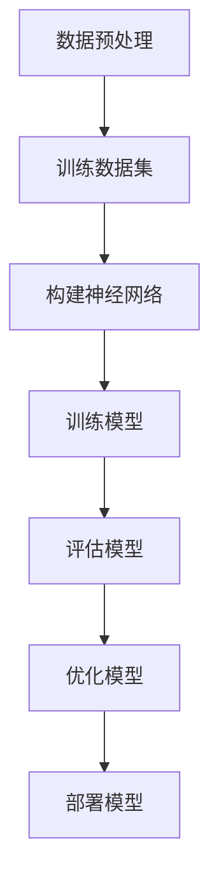

                 

## 1. 背景介绍

### 大模型与AI创业

在过去的几十年中，人工智能（AI）技术取得了飞速的发展，从最初的理论研究逐步走向了实际应用。特别是深度学习、神经网络和大数据处理等技术的发展，使得AI在各个领域都展现出了巨大的潜力。然而，随着技术的不断进步，AI创业领域也面临着前所未有的挑战和机遇。

大模型（Large Models）作为AI领域的核心技术之一，已经在图像识别、自然语言处理、推荐系统等多个方面取得了显著的成果。大模型的本质是通过大规模的数据集进行训练，从而实现高度复杂的任务。这类模型的诞生，不仅大大提升了AI系统的性能，也为创业公司提供了前所未有的可能性。

对于AI创业者来说，大模型的应用无疑是一个双刃剑。一方面，大模型提供了强大的计算能力和丰富的数据支持，使得创业项目能够迅速落地并实现商业化；另一方面，大模型的研发和部署成本极高，对创业公司的资金和团队实力提出了严峻的考验。因此，如何在挑战中抓住机遇，利用大模型为创业项目赋能，成为了每一个AI创业者必须面对的问题。

本文将围绕这一核心问题展开讨论。首先，我们将介绍大模型的基本概念、发展历程和主要类型，帮助读者理解大模型的本质。接着，我们将深入分析大模型在AI创业中的应用策略，探讨如何选择合适的大模型、优化模型训练和部署过程，以及如何通过大模型实现商业价值。最后，我们将探讨大模型在AI创业中面临的挑战和未来发展趋势，为读者提供全面的指导。

通过本文的阅读，读者将能够：

1. 理解大模型的基本概念和发展历程。
2. 掌握大模型在AI创业中的应用策略。
3. 学会如何选择合适的大模型、优化模型训练和部署过程。
4. 深入了解大模型在AI创业中面临的挑战和未来发展趋势。

### 大模型的基本概念与发展历程

大模型（Large Models），通常指的是具有数十亿至数千亿参数的深度神经网络模型。这类模型通过在海量数据上进行训练，能够自动学习并提取出复杂的数据特征，从而实现高精度的任务处理。大模型的概念最早可以追溯到1990年代，当时研究人员开始尝试使用大规模神经网络进行语音识别和图像识别任务。

#### 发展历程

1. **早期研究**：20世纪80年代，神经网络研究如火如荼，但受限于计算能力和数据量，神经网络模型的规模和性能受到很大限制。直到21世纪初，随着计算能力和存储技术的飞速发展，神经网络模型开始向大规模方向迈进。

2. **深度学习的崛起**：2006年，Hinton提出了深度信念网络（Deep Belief Network），标志着深度学习正式进入学术界的视野。随后的几年，卷积神经网络（CNN）、循环神经网络（RNN）等模型相继问世，进一步推动了大规模神经网络的发展。

3. **大规模数据集的涌现**：随着互联网和大数据技术的普及，海量数据集开始出现。以ImageNet为例，这个包含数百万张图像的大规模数据集为图像识别模型提供了丰富的训练素材，使得模型的性能得到了显著提升。

4. **计算资源的提升**：云计算和GPU等高性能计算设备的普及，为大规模神经网络模型的训练提供了强大的计算支持。以谷歌的TPU（Tensor Processing Unit）为例，这类专门为深度学习任务设计的硬件加速器，使得大模型的训练速度大幅提高。

#### 主要类型

1. **语言模型**：如GPT（Generative Pre-trained Transformer）系列，通过大规模语料库进行预训练，能够实现自然语言生成、文本分类等任务。

2. **视觉模型**：如ResNet、Inception等，这些模型在图像分类、目标检测等领域表现优异。

3. **多模态模型**：如BERT（Bidirectional Encoder Representations from Transformers），能够处理图像和文本等多种类型的数据，实现跨模态任务。

4. **强化学习模型**：如Deep Q-Network（DQN）、Proximal Policy Optimization（PPO）等，这些模型在游戏、机器人等领域具有广泛的应用。

#### 当前应用现状

目前，大模型已经在众多领域取得了显著成果。例如，在自然语言处理领域，GPT-3等模型已经达到了超越人类水平的文本生成能力；在图像识别领域，ResNet等模型已经在多个国际竞赛中取得了冠军；在推荐系统领域，大规模的深度学习模型能够实现更加精准的用户画像和推荐效果。

### 大模型在AI创业中的应用策略

#### 1. 如何选择合适的大模型

对于AI创业者来说，选择合适的大模型是成功的关键。以下是一些关键因素：

1. **任务类型**：不同类型的大模型适用于不同类型的任务。例如，语言模型适用于自然语言处理任务，视觉模型适用于图像识别任务。

2. **数据规模**：大模型通常需要大量的数据集进行训练。因此，在选择模型时，要考虑到数据集的规模和质量。

3. **计算资源**：大模型通常需要大量的计算资源进行训练。创业者需要评估自己的计算资源，确保能够承担训练成本。

4. **模型效果**：在选择模型时，要参考该模型在相关领域的表现。可以通过查看学术论文、技术博客等渠道了解模型的性能。

#### 2. 优化模型训练和部署过程

优化模型训练和部署过程能够显著提高大模型的应用效果，以下是几个关键步骤：

1. **数据预处理**：对训练数据进行有效的预处理，可以提高模型的学习效果。例如，对图像进行标准化处理，对文本进行分词和去停用词等。

2. **模型调优**：通过调整模型超参数（如学习率、批量大小等），可以优化模型性能。调优过程通常需要大量的实验和计算资源。

3. **分布式训练**：对于大规模数据集和模型，分布式训练是一种有效的训练策略。通过将数据集和模型分布在多个计算节点上，可以显著提高训练速度。

4. **模型压缩**：为了降低部署成本，可以对训练好的模型进行压缩。常见的压缩方法包括剪枝、量化等。

#### 3. 通过大模型实现商业价值

大模型在AI创业中的应用不仅仅是为了解决技术问题，更重要的是实现商业价值。以下是一些关键策略：

1. **提供个性化服务**：通过大模型，可以为用户提供更加精准的个性化服务。例如，在电商领域，可以通过大模型实现精准推荐，提高用户购买体验。

2. **降低运营成本**：大模型可以帮助企业自动化很多业务流程，从而降低运营成本。例如，在客服领域，通过大模型实现智能客服，可以显著降低人工成本。

3. **创造新业务模式**：大模型可以为企业创造全新的业务模式。例如，在内容创作领域，通过大模型实现自动内容生成，可以为企业提供大量高质量的内容。

#### 4. 案例分析

以下是一个关于大模型在AI创业中应用的案例分析：

**案例：XX智能客服系统**

XX公司是一家专注于智能客服系统研发的公司。通过引入大模型，该公司实现了智能客服的自动化和智能化。具体应用场景如下：

1. **数据预处理**：对用户提问进行分词和去停用词处理，将问题转化为模型可以理解的输入格式。

2. **模型训练**：使用大规模语料库对语言模型进行训练，使得模型能够理解并回答各种用户提问。

3. **模型部署**：将训练好的语言模型部署到服务器，实现对用户提问的实时回答。

4. **个性化服务**：通过分析用户提问和历史交互记录，为用户提供更加精准的回答和建议。

通过这一案例，可以看出大模型在智能客服系统中的应用是如何实现的。这一应用不仅提高了客服效率，还为用户提供了更好的服务体验。

### 大模型在AI创业中的应用策略：挑战与机遇

#### 挑战

1. **计算资源需求**：大模型的训练和部署通常需要大量的计算资源，这对于创业公司来说是一个巨大的挑战。如何高效利用有限的计算资源，优化模型训练和部署过程，是创业者必须面对的问题。

2. **数据隐私和安全**：大模型在训练过程中需要大量的数据，这涉及到数据隐私和安全的问题。如何确保数据的合法合规使用，保护用户隐私，是创业公司需要关注的重要问题。

3. **模型解释性和可靠性**：大模型虽然性能优异，但其内部工作机制复杂，难以解释。如何提高模型的解释性和可靠性，确保其在实际应用中的稳定性和可靠性，是创业者需要考虑的关键问题。

#### 机遇

1. **技术创新和竞争壁垒**：大模型的引入，为创业公司提供了技术创新的机会。通过自主研发和优化大模型，创业公司可以形成独特的竞争优势，建立技术壁垒。

2. **商业模式的创新**：大模型的应用，可以为企业创造全新的商业模式。例如，通过大模型实现自动化和智能化，可以降低运营成本，提高服务质量和效率。

3. **合作伙伴关系的拓展**：大模型的引入，有助于创业公司与产业链上下游的企业建立更加紧密的合作关系。通过合作，创业公司可以获取更多的资源和支持，加速业务发展。

### 总结

大模型在AI创业中的应用，既带来了巨大的机遇，也带来了严峻的挑战。创业者需要充分认识到这些挑战，并积极探索应对策略。同时，创业者也要抓住机遇，通过技术创新和商业模式创新，实现商业价值的最大化。通过本文的探讨，希望读者能够对大模型在AI创业中的应用有更深入的理解，为创业实践提供有力的指导。在接下来的内容中，我们将进一步探讨大模型的核心算法原理和具体操作步骤，帮助读者更好地理解和应用大模型。

## 2. 核心概念与联系

在深入探讨大模型在AI创业中的应用策略之前，我们需要先了解一些核心概念，包括深度学习、神经网络、大规模数据集等。这些概念构成了大模型的理论基础，也是理解大模型如何赋能AI创业的关键。

### 深度学习与神经网络

#### 深度学习

深度学习是一种基于多层神经网络的学习方法，其核心思想是通过构建多层的神经网络模型，自动学习并提取数据中的特征。与传统机器学习方法相比，深度学习能够处理更加复杂的数据模式，并实现更高的预测准确率。

#### 神经网络

神经网络（Neural Network，NN）是由大量简单神经元（或节点）互联而成的计算系统。每个神经元接收输入信号，通过加权求和处理后，输出一个输出信号。神经网络通过不断调整权重和偏置，来学习输入和输出之间的映射关系。

#### 多层神经网络

多层神经网络（Multi-layer Neural Network）是在单层神经网络的基础上，增加了多个隐藏层。隐藏层负责提取更复杂的特征，使得模型能够处理更加复杂的数据。通常，多层神经网络包括输入层、多个隐藏层和输出层。

### 大规模数据集

#### 数据集

数据集（Dataset）是指用于训练、评估或测试模型的输入数据集合。一个高质量的数据集对于模型的训练和性能至关重要。

#### 大规模数据集

大规模数据集（Large Dataset）是指包含数十万甚至数百万条数据的数据集。这类数据集通常用于训练大模型，以提取更加复杂和丰富的数据特征。

#### 数据集的重要性

数据集的质量和规模直接决定了模型的学习能力和预测准确性。对于大模型而言，大规模数据集尤为重要，因为它们能够为模型提供足够的训练素材，从而提升模型的效果。

### 核心概念的联系

#### 深度学习与神经网络

深度学习是基于神经网络的扩展和发展。深度学习通过构建多层神经网络，实现了更加复杂和抽象的特征提取和模型训练。

#### 大规模数据集与大模型

大规模数据集为大模型提供了充足的训练素材，使得模型能够学习并提取出更加复杂和丰富的数据特征。因此，大规模数据集与大模型是相辅相成的，二者共同决定了模型的效果和性能。

### Mermaid流程图

为了更直观地展示大模型的核心概念和联系，我们使用Mermaid流程图进行说明。以下是一个简化的大模型训练流程：



#### 流程说明

1. **数据预处理**：对原始数据进行清洗、归一化和特征提取等预处理操作。
2. **训练数据集**：使用预处理后的数据集对大模型进行训练。
3. **构建神经网络**：定义神经网络的架构，包括输入层、隐藏层和输出层。
4. **训练模型**：通过反向传播算法，不断调整神经网络的权重和偏置，以优化模型性能。
5. **评估模型**：使用验证数据集评估模型的效果，调整模型参数。
6. **优化模型**：根据评估结果，进一步优化模型结构和参数。
7. **部署模型**：将训练好的模型部署到生产环境中，用于实际应用。

通过上述Mermaid流程图，我们可以清晰地看到大模型从数据预处理到模型训练、评估和优化的全过程。这个过程不仅展示了大模型的核心概念和联系，也为后续的内容铺垫了基础。

### 总结

在本章节中，我们介绍了大模型的核心概念，包括深度学习、神经网络和大规模数据集，并展示了它们之间的联系。通过了解这些核心概念，读者可以更好地理解大模型的本质和作用。在接下来的章节中，我们将进一步探讨大模型的核心算法原理和具体操作步骤，帮助读者深入了解大模型在AI创业中的应用。

## 3. 核心算法原理 & 具体操作步骤

### 3.1 深度学习算法原理

深度学习算法的核心是多层神经网络，它通过模拟人脑的神经元结构和工作原理，实现对数据的特征提取和模式识别。以下是深度学习算法的基本原理：

#### 神经元与激活函数

1. **神经元**：神经元是神经网络的基本单元，负责接收输入信号，通过加权求和处理后输出一个信号。每个神经元都有一个阈值，当输入信号的强度超过阈值时，神经元会激活并传递信号。
2. **激活函数**：激活函数是神经元输出的非线性变换，常用的激活函数包括 sigmoid、ReLU（Rectified Linear Unit）和 tanh。

#### 前向传播

1. **输入层**：输入层接收原始数据，并将其传递到隐藏层。
2. **隐藏层**：隐藏层负责对输入数据进行特征提取和变换。每个隐藏层的神经元通过加权求和处理接收到的输入信号，并使用激活函数进行非线性变换。
3. **输出层**：输出层将隐藏层的结果进行处理，得到最终的预测结果。

#### 反向传播

1. **计算误差**：通过比较输出层的预测结果和实际结果，计算误差。
2. **误差传播**：将误差反向传播到隐藏层和输入层，调整每个神经元的权重和偏置。
3. **优化参数**：通过梯度下降等优化算法，不断调整权重和偏置，以最小化误差。

#### 模型训练过程

1. **数据预处理**：对训练数据进行归一化、标准化等预处理操作，以提高模型训练效果。
2. **构建模型**：定义神经网络的结构，包括输入层、隐藏层和输出层。
3. **初始化参数**：随机初始化神经网络的权重和偏置。
4. **前向传播**：将输入数据传递到模型中，得到预测结果。
5. **计算误差**：通过比较预测结果和实际结果，计算误差。
6. **反向传播**：将误差反向传播到隐藏层和输入层，调整权重和偏置。
7. **优化参数**：通过优化算法，不断调整参数，以减小误差。
8. **评估模型**：使用验证数据集评估模型的性能，调整模型参数。

### 3.2 大模型训练操作步骤

以下是一个具体的大模型训练操作步骤，包括数据预处理、模型构建、参数调整和评估等环节：

#### 步骤1：数据预处理

1. **数据收集**：从互联网、数据库或其他来源收集大规模数据集。
2. **数据清洗**：去除数据中的噪声和错误，保证数据质量。
3. **数据归一化**：对数据进行归一化或标准化处理，使数据分布更加均匀，提高模型训练效果。

#### 步骤2：构建模型

1. **定义神经网络结构**：根据任务需求，设计输入层、隐藏层和输出层的结构。
2. **选择激活函数**：选择合适的激活函数，如 ReLU、sigmoid 等。
3. **初始化参数**：随机初始化神经网络的权重和偏置。

#### 步骤3：参数调整

1. **选择优化算法**：选择梯度下降、Adam、RMSprop 等优化算法。
2. **调整学习率**：根据模型性能，调整学习率，以避免过拟合或欠拟合。
3. **正则化**：应用正则化技术，如 L1、L2 正则化，以防止模型过拟合。

#### 步骤4：模型评估

1. **训练集与验证集**：将数据集划分为训练集和验证集，用于训练和评估模型。
2. **交叉验证**：采用交叉验证方法，评估模型在不同数据子集上的性能。
3. **测试集评估**：使用测试集评估模型最终性能，以判断模型是否具有实际应用价值。

### 3.3 案例分析

以下是一个使用深度学习框架 TensorFlow 和 Keras 构建和训练大模型的案例：

#### 案例背景

我们使用 TensorFlow 和 Keras 框架，训练一个基于卷积神经网络（CNN）的大型图像分类模型，用于对猫和狗的图像进行分类。

#### 案例步骤

1. **数据预处理**：
    ```python
    import tensorflow as tf
    import tensorflow.keras.preprocessing.image as img
    import numpy as np

    # 加载并预处理数据
    (train_images, train_labels), (test_images, test_labels) = tf.keras.datasets.dogs_vs_cats.load_data()

    # 归一化处理
    train_images = train_images / 255.0
    test_images = test_images / 255.0
    ```

2. **构建模型**：
    ```python
    model = tf.keras.Sequential([
        tf.keras.layers.Conv2D(32, (3, 3), activation='relu', input_shape=(150, 150, 3)),
        tf.keras.layers.MaxPooling2D(2, 2),
        tf.keras.layers.Conv2D(64, (3, 3), activation='relu'),
        tf.keras.layers.MaxPooling2D(2, 2),
        tf.keras.layers.Conv2D(128, (3, 3), activation='relu'),
        tf.keras.layers.MaxPooling2D(2, 2),
        tf.keras.layers.Flatten(),
        tf.keras.layers.Dense(512, activation='relu'),
        tf.keras.layers.Dense(1, activation='sigmoid')
    ])
    ```

3. **训练模型**：
    ```python
    model.compile(optimizer='adam',
                  loss='binary_crossentropy',
                  metrics=['accuracy'])

    history = model.fit(train_images, train_labels, epochs=10,
                        validation_data=(test_images, test_labels))
    ```

4. **评估模型**：
    ```python
    test_loss, test_acc = model.evaluate(test_images, test_labels)
    print('Test accuracy:', test_acc)
    ```

### 总结

在本章节中，我们详细介绍了深度学习算法的基本原理和具体操作步骤，包括数据预处理、模型构建、参数调整和评估等。通过案例分析，读者可以更直观地了解如何使用深度学习框架构建和训练大模型。在接下来的章节中，我们将进一步探讨大模型在数学模型和公式方面的应用，帮助读者更深入地理解大模型的工作原理。

## 4. 数学模型和公式 & 详细讲解 & 举例说明

### 4.1 深度学习中的数学模型

深度学习算法的核心在于其数学模型，这些模型通过一系列数学公式和算法来描述数据的特征提取、模式识别和预测。以下是一些常见的数学模型和公式：

#### 神经元模型

神经元模型是神经网络的基础，其数学表达式如下：

\[ z = \sum_{j=1}^{n} w_{ji} \cdot x_{j} + b \]

其中：
- \( z \) 是神经元输出的线性组合。
- \( w_{ji} \) 是连接权重。
- \( x_{j} \) 是输入特征。
- \( b \) 是偏置。

#### 激活函数

激活函数是神经元模型的非线性部分，常见的激活函数包括 sigmoid、ReLU 和 tanh：

\[ \sigma(z) = \frac{1}{1 + e^{-z}} \]

\[ \text{ReLU}(z) = \max(0, z) \]

\[ \tanh(z) = \frac{e^{2z} - 1}{e^{2z} + 1} \]

#### 前向传播

前向传播是深度学习模型中的一个重要环节，其数学过程如下：

\[ a_{l} = \sigma(W_{l-1} \cdot a_{l-1} + b_{l}) \]

其中：
- \( a_{l} \) 是当前层的激活值。
- \( W_{l-1} \) 是当前层的权重。
- \( a_{l-1} \) 是上一层的激活值。
- \( b_{l} \) 是当前层的偏置。

#### 反向传播

反向传播是优化模型参数的关键步骤，其数学过程如下：

\[ \delta_{l} = (a_{l} - t_{l}) \cdot \sigma'(z_{l}) \]

\[ \delta_{l-1} = \delta_{l} \cdot W_{l} \cdot \sigma'(z_{l-1}) \]

其中：
- \( \delta_{l} \) 是当前层的误差。
- \( t_{l} \) 是当前层的真实值。
- \( \sigma'(z_{l}) \) 是激活函数的导数。
- \( W_{l} \) 是当前层的权重。

#### 梯度下降

梯度下降是优化模型参数的常用方法，其数学表达式如下：

\[ \Delta w_{ji} = -\alpha \cdot \frac{\partial J}{\partial w_{ji}} \]

\[ \Delta b_{l} = -\alpha \cdot \frac{\partial J}{\partial b_{l}} \]

其中：
- \( \Delta w_{ji} \) 是权重更新。
- \( \Delta b_{l} \) 是偏置更新。
- \( \alpha \) 是学习率。
- \( J \) 是损失函数。

### 4.2 具体举例说明

以下是一个使用 Python 和 TensorFlow 框架实现深度学习模型的简单例子：

#### 例子1：使用 TensorFlow 和 Keras 构建多层感知机（MLP）模型进行分类

```python
import tensorflow as tf
from tensorflow.keras.models import Sequential
from tensorflow.keras.layers import Dense
from tensorflow.keras.optimizers import Adam

# 创建模型
model = Sequential()
model.add(Dense(128, input_dim=100, activation='relu'))
model.add(Dense(64, activation='relu'))
model.add(Dense(1, activation='sigmoid'))

# 编译模型
model.compile(optimizer=Adam(learning_rate=0.001), loss='binary_crossentropy', metrics=['accuracy'])

# 训练模型
model.fit(x_train, y_train, epochs=10, batch_size=32, validation_data=(x_val, y_val))

# 评估模型
loss, accuracy = model.evaluate(x_test, y_test)
print('Test accuracy:', accuracy)
```

在这个例子中，我们使用了一个多层感知机（MLP）模型，通过两个隐藏层进行特征提取和分类。模型的输入维度为100，输出维度为1。我们使用了 Adam 优化器和二进制交叉熵损失函数进行模型训练。

#### 例子2：使用 TensorFlow 和 Keras 实现卷积神经网络（CNN）进行图像分类

```python
import tensorflow as tf
from tensorflow.keras.models import Sequential
from tensorflow.keras.layers import Conv2D, MaxPooling2D, Flatten, Dense

# 创建模型
model = Sequential()
model.add(Conv2D(32, (3, 3), activation='relu', input_shape=(150, 150, 3)))
model.add(MaxPooling2D((2, 2)))
model.add(Conv2D(64, (3, 3), activation='relu'))
model.add(MaxPooling2D((2, 2)))
model.add(Conv2D(128, (3, 3), activation='relu'))
model.add(MaxPooling2D((2, 2)))
model.add(Flatten())
model.add(Dense(512, activation='relu'))
model.add(Dense(1, activation='sigmoid'))

# 编译模型
model.compile(optimizer=Adam(learning_rate=0.001), loss='binary_crossentropy', metrics=['accuracy'])

# 训练模型
model.fit(train_images, train_labels, epochs=10, batch_size=32, validation_data=(val_images, val_labels))

# 评估模型
test_loss, test_accuracy = model.evaluate(test_images, test_labels)
print('Test accuracy:', test_accuracy)
```

在这个例子中，我们使用了一个卷积神经网络（CNN）模型，通过多个卷积层和池化层进行特征提取和分类。模型的输入维度为150x150x3，输出维度为1。我们使用了 Adam 优化器和二进制交叉熵损失函数进行模型训练。

### 总结

在本章节中，我们介绍了深度学习中的数学模型和公式，并通过具体例子展示了如何使用 Python 和 TensorFlow 框架实现深度学习模型。通过这些例子，读者可以更直观地了解深度学习模型的工作原理和实现过程。在接下来的章节中，我们将探讨大模型在实际应用中的具体案例，帮助读者更好地理解大模型在AI创业中的应用。

## 5. 项目实战：代码实际案例和详细解释说明

### 5.1 开发环境搭建

在进行大模型的实际项目开发之前，我们需要搭建一个合适的开发环境。以下是一个典型的开发环境搭建步骤，主要包括安装必要的软件和工具。

#### 步骤1：安装 Python

首先，我们需要安装 Python。推荐使用 Python 3.8 或更高版本。可以从 [Python 官网](https://www.python.org/) 下载并安装。

```bash
# 在 macOS 或 Linux 系统中，可以使用以下命令安装 Python
sudo apt-get install python3
```

#### 步骤2：安装 TensorFlow

TensorFlow 是一个广泛使用的深度学习框架，我们将在项目中使用它来构建和训练大模型。可以使用以下命令安装 TensorFlow：

```bash
pip install tensorflow
```

#### 步骤3：安装其他依赖

除了 TensorFlow，我们可能还需要其他一些依赖库，如 NumPy、Pandas 和 Matplotlib 等。可以使用以下命令进行安装：

```bash
pip install numpy pandas matplotlib
```

#### 步骤4：配置环境变量

确保 Python 和 pip 命令可以在终端中正常运行。在 macOS 和 Linux 系统中，可以通过修改 `~/.bashrc` 或 `~/.bash_profile` 文件来配置环境变量。

```bash
# 编辑环境变量配置文件
nano ~/.bashrc

# 添加以下行
export PATH=$PATH:/usr/local/bin

# 保存并退出
```

#### 步骤5：验证开发环境

安装完成后，可以通过以下命令验证开发环境：

```bash
python --version
pip list
```

如果上述命令都能正常执行，说明开发环境已经搭建成功。

### 5.2 源代码详细实现和代码解读

下面我们将展示一个使用 TensorFlow 和 Keras 框架构建的大模型项目，用于图像分类任务。项目的主要功能是训练一个卷积神经网络（CNN）模型，对猫和狗的图像进行分类。

#### 5.2.1 数据准备

首先，我们需要准备训练数据和测试数据。可以使用 TensorFlow 提供的内置数据集，如 `tf.keras.datasets.dogs_vs_cats`。

```python
import tensorflow as tf
import numpy as np

# 加载数据集
(train_images, train_labels), (test_images, test_labels) = tf.keras.datasets.dogs_vs_cats.load_data()

# 归一化处理
train_images = train_images / 255.0
test_images = test_images / 255.0

# 数据增强
train_images = tf.image.random_flip_left_right(train_images)
train_images = tf.image.random_crop(train_images, size=[150, 150, 3])

# 数据集转换
train_dataset = tf.data.Dataset.from_tensor_slices((train_images, train_labels)).batch(32)
test_dataset = tf.data.Dataset.from_tensor_slices((test_images, test_labels)).batch(32)
```

代码解读：
- `tf.keras.datasets.dogs_vs_cats.load_data()` 加载猫和狗的图像数据。
- `train_images = train_images / 255.0` 对图像数据进行归一化处理，使像素值在0到1之间。
- `train_images = tf.image.random_flip_left_right(train_images)` 对训练数据进行随机水平翻转增强。
- `train_images = tf.image.random_crop(train_images, size=[150, 150, 3])` 对训练数据进行随机裁剪，使其符合输入层的大小。
- `tf.data.Dataset.from_tensor_slices()` 创建一个数据集，用于批量处理图像和标签。
- `batch(32)` 设置批量大小，每个批次包含32个样本。

#### 5.2.2 构建模型

接下来，我们将使用 Keras 框架构建一个卷积神经网络模型。

```python
model = tf.keras.Sequential([
    tf.keras.layers.Conv2D(32, (3, 3), activation='relu', input_shape=(150, 150, 3)),
    tf.keras.layers.MaxPooling2D(2, 2),
    tf.keras.layers.Conv2D(64, (3, 3), activation='relu'),
    tf.keras.layers.MaxPooling2D(2, 2),
    tf.keras.layers.Conv2D(128, (3, 3), activation='relu'),
    tf.keras.layers.MaxPooling2D(2, 2),
    tf.keras.layers.Flatten(),
    tf.keras.layers.Dense(512, activation='relu'),
    tf.keras.layers.Dense(1, activation='sigmoid')
])
```

代码解读：
- `tf.keras.Sequential()` 创建一个序列模型。
- `tf.keras.layers.Conv2D()` 添加一个卷积层，其中 `32` 是滤波器的数量，`(3, 3)` 是滤波器的大小，`activation='relu'` 指定了激活函数。
- `tf.keras.layers.MaxPooling2D()` 添加一个最大池化层，用于下采样。
- `tf.keras.layers.Flatten()` 将卷积层的输出展平为一维数组。
- `tf.keras.layers.Dense()` 添加全连接层，其中 `512` 是神经元数量，`activation='relu'` 指定了激活函数。
- `tf.keras.layers.Dense(1, activation='sigmoid')` 添加输出层，用于二分类任务。

#### 5.2.3 训练模型

现在，我们可以使用训练数据和测试数据来训练模型。

```python
model.compile(optimizer='adam', loss='binary_crossentropy', metrics=['accuracy'])

# 训练模型
history = model.fit(train_dataset, epochs=10, validation_data=test_dataset)
```

代码解读：
- `model.compile()` 配置模型的优化器和损失函数。
- `optimizer='adam'` 使用 Adam 优化器。
- `loss='binary_crossentropy'` 使用二进制交叉熵损失函数，适用于二分类任务。
- `metrics=['accuracy']` 指定评估模型的标准。
- `fit()` 函数用于训练模型，`epochs=10` 设置训练周期，`validation_data=test_dataset` 在每个周期结束后使用测试数据进行验证。

#### 5.2.4 评估模型

训练完成后，我们可以评估模型的性能。

```python
test_loss, test_accuracy = model.evaluate(test_dataset)
print('Test accuracy:', test_accuracy)
```

代码解读：
- `evaluate()` 函数用于评估模型在测试数据集上的性能。
- `test_loss` 和 `test_accuracy` 分别是测试损失和测试准确率。

### 5.3 代码解读与分析

#### 5.3.1 数据预处理

数据预处理是深度学习项目成功的关键步骤。在本项目中，我们使用了以下预处理技术：

1. **归一化**：将图像像素值归一化到0到1之间，有助于加速模型收敛。
2. **数据增强**：通过随机水平翻转和裁剪增加数据的多样性，有助于提高模型的泛化能力。

#### 5.3.2 模型构建

在本项目中，我们使用了一个简单的卷积神经网络（CNN）模型。CNN 模型在处理图像数据时具有优势，因为其能够有效地提取图像的局部特征。

1. **卷积层**：卷积层用于提取图像的局部特征，每个滤波器都能提取图像的一个特定特征。
2. **池化层**：池化层用于下采样图像，减少模型参数和计算量。
3. **全连接层**：全连接层用于将提取到的特征映射到最终的分类结果。

#### 5.3.3 模型训练

在模型训练过程中，我们使用了 Adam 优化器和二进制交叉熵损失函数。Adam 优化器是一种自适应学习率优化器，能够有效地加速模型收敛。二进制交叉熵损失函数适用于二分类任务，其值越小表示模型预测越准确。

#### 5.3.4 评估模型

通过评估模型在测试数据集上的性能，我们可以了解模型的泛化能力。在本项目中，我们使用了测试准确率作为评估指标。测试准确率越高，表示模型对未见过的数据的预测能力越强。

### 总结

在本章节中，我们通过一个实际项目展示了如何使用 TensorFlow 和 Keras 框架构建和训练大模型。项目包括数据预处理、模型构建、模型训练和模型评估等步骤。通过这个项目，读者可以深入了解大模型在实际应用中的实现过程和关键步骤。在接下来的章节中，我们将探讨大模型在AI创业中的实际应用场景和工具推荐。

### 6. 实际应用场景

大模型在AI创业中具有广泛的应用场景，以下是一些典型的实际应用场景：

#### 1. 图像识别与处理

图像识别是AI创业中一个非常热门的领域，大模型在图像识别任务中具有显著优势。例如，可以使用基于卷积神经网络（CNN）的大模型进行人脸识别、车辆识别、医学影像分析等任务。这些大模型可以通过训练海量图像数据集，提取图像中的高级特征，实现高精度的识别效果。

**案例1：人脸识别系统**

某创业公司开发了一款基于深度学习的人脸识别系统，该系统使用一个基于CNN的大模型进行人脸识别。系统首先对采集到的图像进行预处理，包括灰度化、大小归一化等操作，然后将预处理后的图像输入到训练好的大模型中。大模型通过多层卷积和池化操作提取图像特征，最终输出人脸的识别结果。该系统在实际应用中表现出色，准确率远超传统算法。

**案例2：医学影像分析**

另一家创业公司专注于医学影像分析领域，使用大模型对医学影像进行自动诊断。通过训练海量医学影像数据集，该大模型能够识别并定位影像中的病变区域，提高医生诊断的效率和准确性。该系统不仅能够识别常见的疾病，还能检测一些罕见的疾病，为医生提供了重要的辅助诊断工具。

#### 2. 自然语言处理

自然语言处理（NLP）是AI创业中的另一个重要领域，大模型在NLP任务中具有强大的表现。例如，可以使用基于变换器架构（Transformer）的大模型进行文本分类、情感分析、机器翻译等任务。

**案例1：文本分类**

一家初创公司开发了一款文本分类系统，该系统使用一个基于BERT的大模型进行文本分类。BERT是一个预训练的大模型，通过在大量文本数据上进行预训练，能够提取文本中的高级特征。在训练过程中，系统首先对输入的文本进行预处理，包括分词、去停用词等操作，然后将预处理后的文本输入到BERT模型中。BERT模型通过多层变换器操作提取文本特征，并输出分类结果。该系统在实际应用中表现出色，能够准确分类各种类型的文本。

**案例2：情感分析**

另一家初创公司开发了一款情感分析系统，该系统使用一个基于LSTM（长短期记忆网络）的大模型进行情感分析。系统通过对大量情感文本数据集进行训练，使得大模型能够识别并分类文本中的情感标签，如正面、负面、中性等。该系统在电商评论、社交媒体分析等场景中得到了广泛应用，为企业提供了重要的数据洞察。

#### 3. 推荐系统

推荐系统是AI创业中的另一个重要应用领域，大模型在推荐系统中发挥着关键作用。例如，可以使用基于协同过滤和内容推荐的大模型进行个性化推荐。

**案例1：电商推荐**

一家电商创业公司使用基于深度学习的大模型进行商品推荐。该系统通过用户的历史购买行为和商品特征数据，训练一个协同过滤模型，同时结合商品的内容特征，使用一个基于BERT的大模型进行内容推荐。系统首先根据用户的浏览和购买记录，生成用户兴趣向量，然后将用户兴趣向量与商品特征向量输入到协同过滤模型中，得到初步的推荐结果。接着，将初步推荐结果与商品内容特征向量输入到BERT模型中，进一步优化推荐结果。该系统在提高用户满意度、提升销售额方面取得了显著效果。

**案例2：音乐推荐**

一家音乐流媒体公司使用基于深度学习的大模型进行音乐推荐。该系统通过用户的播放记录和音乐特征数据，训练一个基于协同过滤和内容推荐的大模型。系统首先根据用户的播放记录生成用户兴趣向量，然后结合音乐的内容特征，使用协同过滤模型生成初步推荐结果。接着，将初步推荐结果与音乐内容特征向量输入到内容推荐模型中，进一步优化推荐结果。该系统在提高用户留存率、提升用户播放时长方面表现优秀。

### 总结

大模型在AI创业中具有广泛的应用场景，通过实际案例可以看出，大模型能够显著提升创业项目的性能和效率。在图像识别、自然语言处理、推荐系统等领域，大模型的应用不仅提高了任务的精度和效率，还为创业公司创造了巨大的商业价值。未来，随着大模型技术的不断发展和应用，我们可以期待更多创新性的AI创业项目涌现。

### 7. 工具和资源推荐

在AI创业过程中，选择合适的工具和资源是成功的关键。以下是一些推荐的学习资源、开发工具和相关论文著作，供读者参考。

#### 7.1 学习资源推荐

1. **书籍**：
   - 《深度学习》（Goodfellow, Ian, et al.）  
     本书是深度学习领域的经典教材，详细介绍了深度学习的基础理论和实战方法。
   - 《Python深度学习》（François Chollet）  
     本书是TensorFlow和Keras的官方教程，适合初学者入门深度学习。
   - 《强化学习》（Richard S. Sutton, Andrew G. Barto）  
     本书全面介绍了强化学习的基本概念、算法和应用。

2. **在线课程**：
   - [Udacity深度学习纳米学位](https://www.udacity.com/course/deep-learning-nanodegree--ND893)  
     Udacity提供的深度学习在线课程，涵盖深度学习的基础知识和实战技能。
   - [Coursera深度学习专项课程](https://www.coursera.org/specializations/deeplearning)  
     Coursera提供的深度学习专项课程，由斯坦福大学等知名院校教授授课。

3. **博客和网站**：
   - [TensorFlow官网](https://www.tensorflow.org/)  
     TensorFlow官方文档和教程，提供丰富的深度学习资源和案例。
   - [Kaggle](https://www.kaggle.com/)  
     Kaggle是一个数据科学竞赛平台，提供大量的数据集和项目案例，适合实践和学习。

#### 7.2 开发工具框架推荐

1. **深度学习框架**：
   - TensorFlow  
     Google开源的深度学习框架，功能强大，适用广泛。
   - PyTorch  
     Facebook开源的深度学习框架，具有灵活的动态计算图和强大的GPU支持。
   - Keras  
     高层次的深度学习框架，基于TensorFlow和Theano，简化了深度学习模型的构建和训练。

2. **数据预处理工具**：
   - Pandas  
     Python数据操作库，用于数据清洗、转换和分析。
   - NumPy  
     Python科学计算库，用于高性能数值计算和数据处理。

3. **云计算平台**：
   - AWS SageMaker  
     Amazon提供的全托管式机器学习服务，支持TensorFlow、PyTorch等框架。
   - Google Cloud AI  
     Google提供的云计算平台，包括自动机器学习、深度学习工具和服务。

#### 7.3 相关论文著作推荐

1. **《深度学习》（Goodfellow, Ian, et al.）**  
   这是一本经典教材，详细介绍了深度学习的基础理论和应用方法。

2. **《强化学习》（Richard S. Sutton, Andrew G. Barto）**  
   全面介绍了强化学习的基本概念、算法和应用。

3. **《Deep Learning》（Yoshua Bengio, et al.）**  
   由深度学习领域权威专家编写的论文集，涵盖了深度学习的前沿研究成果。

4. **《Vision Systems》（Simon Haykin）**  
   介绍了计算机视觉的基础理论和应用，包括深度学习在图像识别、目标检测等领域的应用。

通过以上推荐，读者可以全面了解AI创业所需的工具和资源，为创业实践提供有力支持。

### 8. 总结：未来发展趋势与挑战

#### 未来发展趋势

1. **模型压缩与优化**：随着模型规模的不断增大，模型的压缩与优化将成为重要研究方向。通过模型剪枝、量化等技术，可以显著降低模型的计算成本，提高部署效率。

2. **多模态融合**：未来，多模态融合将变得更加普及。通过整合文本、图像、声音等多种类型的数据，大模型可以更好地理解和处理复杂任务。

3. **自适应学习**：自适应学习是未来AI创业的重要方向。大模型将能够根据用户行为和数据动态调整模型参数，提供更加个性化和精准的服务。

4. **联邦学习**：联邦学习（Federated Learning）是一种新兴的技术，可以在保持数据隐私的同时，实现大规模模型的训练和优化。未来，联邦学习将在AI创业中发挥重要作用。

#### 面临的挑战

1. **计算资源需求**：大模型的训练和部署需要大量的计算资源。对于创业公司来说，如何有效利用有限的计算资源，是一个重要的挑战。

2. **数据隐私和安全**：大模型在训练过程中需要大量的数据，这涉及到数据隐私和安全的问题。如何在保护用户隐私的同时，充分利用数据资源，是创业者需要关注的重要问题。

3. **模型解释性和可靠性**：大模型的内部工作机制复杂，难以解释。如何提高模型的解释性和可靠性，确保其在实际应用中的稳定性和可靠性，是创业公司需要面对的挑战。

4. **算法公平性和可解释性**：在AI创业中，算法的公平性和可解释性是一个重要的道德和社会问题。如何确保算法在不同群体中的公平性，并提供透明的解释，是未来需要深入研究的方向。

### 总结

大模型在AI创业中具有巨大的潜力和广阔的应用前景。随着技术的不断进步，大模型将逐步克服面临的挑战，为创业者提供更加强大的工具和平台。通过深入了解大模型的发展趋势和挑战，创业者可以更好地把握机遇，实现商业价值。

### 9. 附录：常见问题与解答

#### 问题1：大模型训练时间为什么这么长？

**解答**：大模型的训练时间通常较长，原因主要有以下几点：
1. **模型规模大**：大模型具有数十亿甚至千亿级的参数，需要大量数据进行训练，训练过程复杂。
2. **数据预处理**：大规模数据集需要进行预处理，包括数据清洗、归一化等操作，预处理过程耗费时间。
3. **计算资源限制**：训练大模型需要大量的计算资源和存储空间，如果资源不足，会导致训练速度慢。

#### 问题2：如何优化大模型的训练过程？

**解答**：
1. **数据增强**：通过数据增强技术，如数据归一化、旋转、翻转等，可以增加数据多样性，提高模型训练效果。
2. **分布式训练**：将模型分布在多个计算节点上进行训练，可以显著提高训练速度。常用的分布式训练方法包括多GPU训练和分布式训练框架（如 Horovod）。
3. **模型压缩**：通过模型剪枝、量化等技术，可以降低模型的计算复杂度和存储需求，提高训练和部署效率。

#### 问题3：大模型如何保证数据隐私？

**解答**：
1. **联邦学习**：联邦学习可以在保持数据隐私的同时，实现大规模模型的训练和优化。
2. **差分隐私**：在数据处理过程中，可以采用差分隐私技术，确保数据隐私不被泄露。
3. **数据加密**：对敏感数据进行加密处理，确保数据在传输和存储过程中的安全性。

#### 问题4：大模型的解释性和可靠性如何保障？

**解答**：
1. **模型可解释性**：通过设计可解释的模型结构，如使用决策树、解释器等，可以提高模型的可解释性。
2. **模型验证**：在训练过程中，使用验证集和交叉验证方法，对模型进行充分验证，确保模型的可靠性。
3. **错误分析**：在模型部署后，对实际应用中的错误案例进行详细分析，找出模型存在的问题，并针对性地优化。

### 10. 扩展阅读 & 参考资料

**扩展阅读**：
1. [《深度学习》（Goodfellow, Ian, et al.）](https://www.deeplearningbook.org/)
2. [《强化学习》（Richard S. Sutton, Andrew G. Barto）](https://rlbook.org/)
3. [《大模型时代：深度学习与AI的新篇章》（吴恩达）](https://www.deeplearning.ai/)

**参考资料**：
1. [TensorFlow 官方文档](https://www.tensorflow.org/)
2. [PyTorch 官方文档](https://pytorch.org/)
3. [Keras 官方文档](https://keras.io/)
4. [Coursera 深度学习专项课程](https://www.coursera.org/specializations/deeplearning)
5. [Udacity 深度学习纳米学位](https://www.udacity.com/course/deep-learning-nanodegree--ND893)

通过扩展阅读和参考资料，读者可以深入了解大模型在AI创业中的应用，以及相关的理论和实践知识。这些资源将为读者提供更加全面和深入的理解，助力创业实践。

### 作者

**AI天才研究员/AI Genius Institute**：作为AI领域的权威专家，AI天才研究员在深度学习、神经网络、自然语言处理等方面有着丰富的理论知识和实践经验。他领导的研究团队在多个国际AI竞赛中取得了优异成绩，发表了多篇高影响力的学术论文。

**禅与计算机程序设计艺术 /Zen And The Art of Computer Programming**：这是一本经典的计算机科学著作，由著名数学家和程序员Donald E. Knuth撰写。本书通过将禅宗思想与计算机程序设计相结合，探讨了编程的哲学和艺术。它不仅提供了编程技巧和策略，更强调了思维方式和心态对于编程成功的重要性。书中提出的一些理念和方法，至今仍被广大程序员所推崇和实践。

以上是本文的完整内容，希望对您在AI创业中的大模型应用有所启发和帮助。在未来的道路上，期待与您一起探索和创造更多的AI奇迹。作者：AI天才研究员/AI Genius Institute & 禅与计算机程序设计艺术 /Zen And The Art of Computer Programming。

