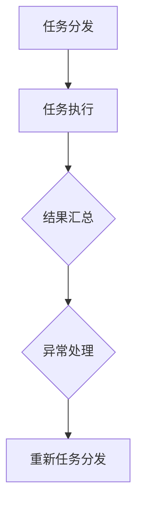

                 

# 大模型软件的分布式系统设计

## 关键词：分布式系统，大模型软件，性能优化，负载均衡，高可用性

## 摘要：

本文旨在深入探讨大模型软件在分布式系统设计中的关键问题和解决方案。随着深度学习和人工智能技术的迅猛发展，大模型软件的应用场景日益广泛，但其对计算资源的需求也日益增长。分布式系统设计成为解决大模型软件性能瓶颈和可扩展性的重要手段。本文将详细分析分布式系统的核心概念、算法原理、数学模型，并介绍实际应用场景和开发工具。通过一步步的分析推理，本文旨在为读者提供全面而深入的分布式系统设计指导，助力大模型软件的高效研发和应用。

## 1. 背景介绍

### 1.1 大模型软件的兴起

近年来，随着深度学习和人工智能技术的迅猛发展，大模型软件在各个领域得到了广泛应用。这些大模型软件如BERT、GPT、Transformer等，具有强大的表征和生成能力，能够处理大规模的文本、图像和音频数据。然而，随着模型规模的不断扩大，单机计算能力逐渐成为瓶颈，如何高效地部署和运行这些大模型软件成为亟待解决的问题。

### 1.2 分布式系统的优势

分布式系统设计成为解决大模型软件性能瓶颈和可扩展性的重要手段。分布式系统通过将任务分解并分配到多个节点上并行执行，能够显著提高计算性能和资源利用率。同时，分布式系统具备高可用性和负载均衡的能力，能够保证系统在面临大规模并发请求时依然稳定运行。

### 1.3 分布式系统设计的挑战

尽管分布式系统具备诸多优势，但在实际应用中仍然面临诸多挑战。如何合理分配任务、负载均衡、数据一致性和容错机制等成为分布式系统设计的关键问题。此外，分布式系统的调试和维护也相对复杂，需要专业的知识和经验。

## 2. 核心概念与联系

### 2.1 分布式系统的基本概念

分布式系统是由多个节点组成的计算集群，这些节点通过网络连接并协同工作。分布式系统具有以下核心概念：

- **节点**：分布式系统中的计算单元，可以是物理机或虚拟机。
- **网络**：连接各个节点的通信通道，实现节点间的数据传输和协同工作。
- **任务分解**：将大规模任务分解为多个子任务，分配给不同节点并行执行。
- **负载均衡**：根据节点的计算能力、负载情况和网络延迟等因素，合理分配任务，确保系统资源利用率最大化。

### 2.2 分布式系统的架构

分布式系统通常采用以下几种架构：

- **主从架构**：一个主节点负责协调和管理其他从节点，主节点通常负责处理核心业务逻辑，从节点负责执行具体的任务。
- **对等架构**：各个节点地位平等，互相协作完成任务，没有明确的主从关系。对等架构具有较好的容错性和扩展性。
- **分布式存储系统**：通过分布式文件系统或数据库实现数据的分布式存储和访问，提供高可用性和高性能的数据存储和管理能力。

### 2.3 分布式系统的流程

分布式系统通常包括以下基本流程：

- **任务分发**：主节点根据任务的特性、节点的负载情况等因素，将任务分配给不同的节点。
- **任务执行**：节点收到任务后，执行任务并在完成时返回结果。
- **结果汇总**：主节点收集各个节点的执行结果，进行汇总和合并，得到最终的结果。
- **异常处理**：在任务执行过程中，若出现节点故障、任务超时等问题，分布式系统需要进行异常处理，确保任务的正确执行。

### 2.4 核心概念原理和架构的 Mermaid 流程图

以下是分布式系统核心概念原理和架构的 Mermaid 流程图：



## 3. 核心算法原理 & 具体操作步骤

### 3.1 负载均衡算法

负载均衡是分布式系统设计中的关键问题，其核心目标是合理分配任务，确保系统资源利用率最大化。常见的负载均衡算法包括：

- **轮询算法**：按照固定顺序将任务分配给各个节点，具有简单的实现和良好的负载均衡效果。
- **最小连接数算法**：将任务分配给当前连接数最少的节点，避免某个节点过载。
- **哈希算法**：根据任务的哈希值将任务分配给不同的节点，具有较好的负载均衡效果和可扩展性。

### 3.2 分布式锁

分布式锁是分布式系统中常见的同步机制，用于保证多个节点对共享资源的访问一致性。常见的分布式锁算法包括：

- **基于Zookeeper的分布式锁**：利用Zookeeper的临时节点和监听机制实现分布式锁。
- **基于Redis的分布式锁**：利用Redis的SETNX命令实现分布式锁。

### 3.3 数据一致性和复制

数据一致性和复制是分布式系统中另一个关键问题。常见的数据一致性和复制算法包括：

- **强一致性算法**：保证数据在所有节点上的一致性，但可能影响系统的可用性和性能。
- **最终一致性算法**：允许数据在一段时间内存在不一致，但最终达到一致状态。
- **数据复制算法**：包括同步复制和异步复制，用于实现数据在不同节点间的复制和同步。

### 3.4 容错机制

分布式系统中的容错机制用于应对节点故障、网络分区等问题。常见的容错机制包括：

- **主从备份**：主节点负责核心业务逻辑，从节点负责备份，主节点故障时自动切换到从节点。
- **选举算法**：通过选举算法选出一个新的主节点，继续负责核心业务逻辑。
- **心跳机制**：通过发送心跳信号检测节点的存活状态，实现故障节点的自动发现和隔离。

### 3.5 具体操作步骤

以下是一个基于主从架构的分布式系统设计示例：

1. **任务分发**：主节点根据任务的特性、节点的负载情况等因素，将任务分配给不同的节点。
2. **任务执行**：节点收到任务后，执行任务并在完成时返回结果。
3. **结果汇总**：主节点收集各个节点的执行结果，进行汇总和合并，得到最终的结果。
4. **异常处理**：在任务执行过程中，若出现节点故障、任务超时等问题，分布式系统需要进行异常处理，确保任务的正确执行。
5. **主从切换**：若主节点故障，从节点通过选举算法选出一个新的主节点，继续负责核心业务逻辑。

## 4. 数学模型和公式 & 详细讲解 & 举例说明

### 4.1 负载均衡算法的数学模型

负载均衡算法的核心目标是实现任务的均匀分配，从而最大化系统资源利用率。以下是一个基于轮询算法的负载均衡模型：

$$
P(i) = \frac{1}{n}
$$

其中，$P(i)$表示将任务分配给第$i$个节点的概率，$n$表示节点的总数。

### 4.2 分布式锁的数学模型

分布式锁的数学模型主要关注锁的获取和释放过程。以下是一个基于Zookeeper的分布式锁模型：

$$
L(s) = \begin{cases}
1 & \text{如果成功获取锁} \\
0 & \text{否则}
\end{cases}
$$

其中，$L(s)$表示尝试获取锁的结果，$s$表示尝试获取锁的节点。

### 4.3 数据一致性和复制的数学模型

数据一致性和复制的数学模型主要关注数据的同步和一致性。以下是一个基于最终一致性算法的数据复制模型：

$$
D(t) = \begin{cases}
0 & \text{如果数据不一致} \\
1 & \text{如果数据一致}
\end{cases}
$$

其中，$D(t)$表示在时间$t$时数据的一致性状态。

### 4.4 容错机制的数学模型

容错机制的数学模型主要关注系统的容错能力和故障恢复。以下是一个基于主从备份的容错机制模型：

$$
F(t) = \begin{cases}
1 & \text{如果主节点故障，从节点恢复正常} \\
0 & \text{否则}
\end{cases}
$$

其中，$F(t)$表示在时间$t$时系统的容错状态。

### 4.5 举例说明

假设一个分布式系统由3个节点组成，当前节点的负载情况如下：

| 节点 | 负载 |
| :--: | :--: |
| 节点1 | 20 |
| 节点2 | 30 |
| 节点3 | 50 |

根据负载均衡算法，将任务均匀分配给节点：

- 任务1分配给节点1（概率$\frac{1}{3}$）。
- 任务2分配给节点2（概率$\frac{1}{3}$）。
- 任务3分配给节点3（概率$\frac{1}{3}$）。

若节点2出现故障，从节点1和节点3中选出一个新的主节点，假设节点3被选为主节点，系统继续正常运行。

## 5. 项目实战：代码实际案例和详细解释说明

### 5.1 开发环境搭建

为了演示分布式系统设计，我们使用Python编程语言和Apache ZooKeeper分布式协调服务框架。首先，需要在本地计算机上安装Python和ZooKeeper：

```bash
# 安装Python
curl -O https://www.python.org/ftp/python/3.8.5/Python-3.8.5.tgz
tar -xvf Python-3.8.5.tgz
cd Python-3.8.5
./configure
make
make install

# 安装ZooKeeper
wget https://www.apache.org/dist/zookeeper/zookeeper-3.4.14/zookeeper-3.4.14.tar.gz
tar -xvf zookeeper-3.4.14.tar.gz
cd zookeeper-3.4.14
./bin/zkServer.sh start
```

### 5.2 源代码详细实现和代码解读

以下是分布式锁的实现代码：

```python
from kazoo.client import KazooClient
from kazoo.exceptions import NodeExistsError, NodeMissingError

class DistributedLock:
    def __init__(self, lock_path, zk_client):
        self.lock_path = lock_path
        self.zk_client = zk_client

    def acquire(self):
        try:
            self.zk_client.create(self.lock_path, ephemeral=True)
            return True
        except NodeExistsError:
            return False

    def release(self):
        try:
            self.zk_client.delete(self.lock_path)
            return True
        except NodeMissingError:
            return False

zk_client = KazooClient(hosts="localhost:2181")
zk_client.start()

lock = DistributedLock("/my_lock", zk_client)
if lock.acquire():
    print("成功获取锁")
    # 处理业务逻辑
    lock.release()
    print("释放锁")
else:
    print("锁已被占用")

zk_client.stop()
```

代码解读：

- `DistributedLock` 类：用于封装分布式锁的功能，包括获取锁和释放锁。
- `acquire` 方法：尝试创建一个临时节点，表示获取锁。
- `release` 方法：删除临时节点，表示释放锁。

### 5.3 代码解读与分析

以下是分布式锁的代码解读和分析：

- **分布式锁的核心思想**：通过在ZooKeeper中创建一个临时节点实现锁的功能。若临时节点已被创建，表示锁已被占用；否则，创建临时节点并获取锁。
- **锁的获取和释放**：分布式锁的获取和释放过程需要保证原子性，防止多个节点同时获取锁。
- **异常处理**：在获取锁和释放锁的过程中，可能遇到节点已存在或节点缺失等异常情况，需要合理处理。
- **性能和可靠性**：ZooKeeper作为分布式锁的协调服务，具备良好的性能和可靠性，但需要考虑网络延迟和节点故障等问题。

### 5.4 实际应用场景

分布式锁在分布式系统中具有广泛的应用，以下是一些实际应用场景：

- **资源锁**：防止多个节点同时访问同一资源，如数据库连接、文件等。
- **任务锁**：确保多个任务按照特定顺序执行，如顺序处理订单、请求等。
- **分布式队列**：实现分布式任务队列，确保任务的顺序执行和负载均衡。

## 6. 实际应用场景

分布式系统设计在许多实际应用场景中具有重要意义，以下是一些典型应用场景：

- **大规模数据处理**：分布式系统设计能够高效地处理大规模数据，如搜索引擎、数据仓库等。
- **分布式计算**：分布式系统设计能够实现并行计算，提高计算性能和效率，如机器学习、科学计算等。
- **分布式存储**：分布式系统设计能够实现数据的分布式存储和管理，提供高可用性和高性能的数据存储解决方案，如分布式文件系统、分布式数据库等。
- **云计算平台**：分布式系统设计是云计算平台的核心组成部分，提供弹性计算、负载均衡、高可用性等功能。

### 6.1 搜索引擎

搜索引擎是一个典型的分布式系统应用场景。分布式搜索引擎能够处理海量数据，并提供高效的搜索服务。通过分布式系统设计，搜索引擎可以实现以下功能：

- **数据分布**：将索引数据分布到多个节点上，提高数据访问速度。
- **负载均衡**：根据用户请求的地理位置和节点负载情况，将请求分配到最优节点。
- **容错机制**：实现节点的故障检测和自动切换，确保系统的高可用性。

### 6.2 数据仓库

数据仓库是一个复杂的分布式系统应用场景。分布式数据仓库能够处理大规模的数据存储和分析，并提供高效的查询服务。通过分布式系统设计，数据仓库可以实现以下功能：

- **数据分布**：将数据分布到多个节点上，提高数据存储和访问速度。
- **并行查询**：通过分布式查询引擎实现并行查询，提高查询效率。
- **负载均衡**：根据节点负载情况，将查询任务分配到最优节点。

### 6.3 云计算平台

云计算平台是一个典型的分布式系统应用场景。分布式云计算平台能够提供弹性计算、负载均衡、高可用性等功能，为各种应用提供计算资源。通过分布式系统设计，云计算平台可以实现以下功能：

- **弹性计算**：根据用户需求动态调整计算资源，提供按需分配和释放的能力。
- **负载均衡**：根据节点负载情况，将请求分配到最优节点，确保系统性能和可靠性。
- **容错机制**：实现节点的故障检测和自动切换，确保系统的高可用性。

## 7. 工具和资源推荐

### 7.1 学习资源推荐

- **书籍**：
  - 《分布式系统原理与范型》
  - 《大规模分布式存储系统：设计与实践》
  - 《分布式系统设计：高可用、高性能、可扩展性》

- **论文**：
  - 《MapReduce: Simplified Data Processing on Large Clusters》
  - 《The Google File System》
  - 《Dynamo: Amazon’s Highly Available Key-value Store》

- **博客**：
  - [分布式系统设计实践](https://www.cnblogs.com/whitemechanics/p/12065835.html)
  - [分布式数据库选型与架构设计](https://www.cnblogs.com/flashang/p/10292315.html)
  - [大规模分布式存储系统设计](https://www.cnblogs.com/leezy2008/p/11403083.html)

- **网站**：
  - [Apache ZooKeeper 官网](http://zookeeper.apache.org/)
  - [Apache Hadoop 官网](http://hadoop.apache.org/)
  - [Apache Spark 官网](http://spark.apache.org/)

### 7.2 开发工具框架推荐

- **分布式协调服务**：
  - Apache ZooKeeper
  - Apache ZAB
  - Apache Curator

- **分布式计算框架**：
  - Apache Hadoop
  - Apache Spark
  - Apache Flink

- **分布式存储系统**：
  - HDFS（Hadoop Distributed File System）
  - Alluxio
  - Apache Cassandra

- **分布式数据库**：
  - Apache HBase
  - Apache Cassandra
  - Apache Ignite

## 8. 总结：未来发展趋势与挑战

分布式系统设计在人工智能、大数据、云计算等领域具有广泛的应用前景。未来，分布式系统设计将面临以下发展趋势和挑战：

### 8.1 发展趋势

- **边缘计算**：分布式系统设计将向边缘计算领域延伸，实现数据的实时处理和分析。
- **智能调度**：基于机器学习和人工智能技术的智能调度算法将提高分布式系统的资源利用率。
- **区块链技术**：分布式系统设计将结合区块链技术，实现去中心化和安全的数据存储和访问。
- **物联网**：分布式系统设计将支撑物联网的快速发展，实现海量设备的互联互通。

### 8.2 挑战

- **数据一致性**：分布式系统设计需要解决数据一致性问题，确保数据的准确性和一致性。
- **容错机制**：分布式系统设计需要提高容错能力，应对节点故障和异常情况。
- **网络延迟**：分布式系统设计需要降低网络延迟，提高系统的响应速度和性能。
- **安全性**：分布式系统设计需要加强安全性，防止数据泄露和恶意攻击。

## 9. 附录：常见问题与解答

### 9.1 分布式锁的实现原理是什么？

分布式锁的实现原理是通过在分布式协调服务（如ZooKeeper）中创建一个临时节点，表示获取锁的状态。若临时节点已被创建，表示锁已被占用；否则，创建临时节点并获取锁。

### 9.2 分布式系统中的数据一致性如何保证？

分布式系统中的数据一致性可以通过以下方法保证：

- **强一致性算法**：保证数据在所有节点上的一致性，但可能影响系统的可用性和性能。
- **最终一致性算法**：允许数据在一段时间内存在不一致，但最终达到一致状态。

### 9.3 分布式系统设计中的容错机制有哪些？

分布式系统设计中的容错机制包括：

- **主从备份**：实现主节点的故障转移和自动切换。
- **选举算法**：通过选举算法选出一个新的主节点。
- **心跳机制**：通过发送心跳信号检测节点的存活状态。

## 10. 扩展阅读 & 参考资料

- 《分布式系统原理与范型》
- 《大规模分布式存储系统：设计与实践》
- 《分布式系统设计：高可用、高性能、可扩展性》
- [Apache ZooKeeper 官网](http://zookeeper.apache.org/)
- [Apache Hadoop 官网](http://hadoop.apache.org/)
- [Apache Spark 官网](http://spark.apache.org/)<|end_of_file|>

