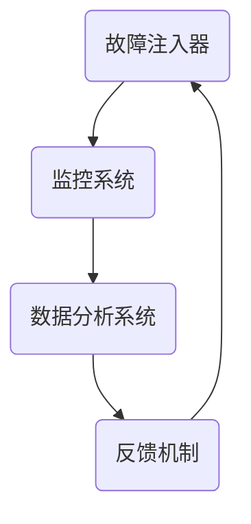

                 

# 大模型软件的混沌工程实践

## 关键词：大模型软件，混沌工程，实践，稳定性，可靠性，测试，监控，故障处理，架构设计，系统优化，安全，性能

## 摘要

大模型软件在现代信息技术领域中扮演着至关重要的角色，其广泛的应用场景包括自然语言处理、计算机视觉、推荐系统等。然而，随着模型规模的不断扩大和复杂度的增加，软件系统的稳定性、可靠性以及性能优化成为一个亟待解决的挑战。混沌工程作为一种新兴的实践方法，通过故意引入故障和异常，旨在提高系统的弹性和容错能力。本文将探讨大模型软件中混沌工程的实施方法、核心概念及其在实际应用中的效果，旨在为开发者和运维人员提供一套行之有效的解决方案。

## 1. 背景介绍

### 大模型软件的重要性

大模型软件，尤其是深度学习模型，已经成为现代信息技术中的核心组件。它们在图像识别、语音识别、自然语言处理等领域的表现已经超越了传统的方法，显著提升了系统的智能水平。例如，谷歌的BERT模型在文本分类和语义理解任务上取得了显著的成果，OpenAI的GPT-3则在生成式任务中展现了卓越的性能。这些模型通常需要大规模的参数和计算资源，因此对软件系统的稳定性和可靠性提出了极高的要求。

### 混沌工程的起源与应用

混沌工程（Chaos Engineering）最早由Netflix公司在2011年提出，是一种通过故意引入故障和异常来测试系统弹性和容错能力的实践方法。混沌工程的核心理念是“知道你的系统如何失败，并确保它能够成功应对”。这种方法不同于传统的测试和监控，它更多地关注系统在面对意外情况时的反应。随着云计算和容器技术的普及，混沌工程在微服务架构和分布式系统中得到了广泛应用。

### 大模型软件面临的挑战

大模型软件面临的主要挑战包括：

- **稳定性**：大规模模型训练和推理过程中，对硬件资源的依赖性极高，任何单点故障都可能导致训练失败或服务中断。
- **可靠性**：模型输出结果的准确性和一致性是关键，任何异常都可能导致严重的后果。
- **性能优化**：随着模型规模的增大，计算和存储的需求也急剧上升，如何高效利用资源是一个重要的课题。

## 2. 核心概念与联系

### 混沌工程的基本概念

混沌工程的核心概念包括：

- **故障注入**：故意引入故障，以测试系统对故障的响应能力。
- **混沌测试**：通过故障注入，评估系统在各种故障情况下的性能和稳定性。
- **监控与反馈**：收集系统在故障情况下的行为数据，进行分析和反馈，以优化系统设计。

### 大模型软件中的混沌工程架构

为了实施混沌工程，需要构建一个完善的混沌工程架构。该架构包括以下几个关键部分：

1. **故障注入器**：负责生成和注入故障，可以是硬件故障、网络故障、软件故障等。
2. **监控系统**：实时监控系统的运行状态，包括性能指标、资源利用率、错误日志等。
3. **数据分析系统**：对监控系统收集的数据进行分析，识别系统弱点并提出优化建议。
4. **反馈机制**：将分析结果反馈给开发者和运维团队，指导系统改进。

### Mermaid 流程图



### 混沌工程与传统测试和监控的区别

- **目的**：混沌工程旨在提升系统的弹性和容错能力，而传统测试和监控则更侧重于发现和修复已知问题。
- **方法**：混沌工程通过故意引入故障，而传统测试和监控则是通过模拟或重现故障。
- **效果**：混沌工程能够更全面地评估系统的稳定性和可靠性，而传统测试和监控则更侧重于特定场景的测试。

## 3. 核心算法原理 & 具体操作步骤

### 故障注入算法

故障注入是混沌工程的核心步骤。具体的故障注入算法可以分为以下几个步骤：

1. **故障类型选择**：根据系统特点和需求，选择合适的故障类型，如网络延迟、节点故障、数据库超时等。
2. **故障发生概率**：设置故障发生的概率，以确保测试的覆盖面。
3. **故障注入时机**：选择合适的时机进行故障注入，如负载高峰期、系统空闲期等。
4. **故障持续时间**：设置故障持续的时间，以模拟真实场景。

### 监控系统算法

监控系统是混沌工程的重要组成部分，其核心算法包括：

1. **性能指标收集**：收集系统的各种性能指标，如CPU利用率、内存占用、网络延迟等。
2. **错误日志收集**：收集系统运行过程中出现的错误日志，以便分析故障原因。
3. **告警机制**：设置告警阈值，当监控指标超出阈值时，触发告警。
4. **告警处理**：对接收到的告警进行处理，包括通知相关人员、记录日志、自动恢复等。

### 数据分析系统算法

数据分析系统通过对监控系统收集的数据进行分析，得出系统的弱点并提出优化建议。核心算法包括：

1. **数据预处理**：对原始数据进行清洗和预处理，包括去除噪声、填充缺失值等。
2. **特征提取**：从预处理后的数据中提取关键特征，用于后续分析。
3. **模型训练**：利用机器学习算法，对特征进行分类和聚类，识别系统弱点。
4. **结果分析**：分析模型输出结果，生成优化建议。

### 反馈机制算法

反馈机制是混沌工程的最后一环，其核心算法包括：

1. **优化策略生成**：根据分析结果，生成优化策略，如调整资源分配、优化代码逻辑等。
2. **实施与验证**：将优化策略应用到实际系统中，进行验证和测试。
3. **持续反馈**：将验证结果反馈给开发者和运维团队，持续优化系统。

### 混沌工程实施步骤

1. **需求分析**：明确混沌工程的目标和预期效果。
2. **架构设计**：设计混沌工程架构，包括故障注入器、监控系统、数据分析系统和反馈机制。
3. **故障注入**：根据需求进行故障注入。
4. **监控与数据分析**：监控系统运行状态，收集数据进行分析。
5. **反馈与优化**：根据分析结果进行系统优化。
6. **迭代**：重复上述步骤，不断提高系统稳定性。

## 4. 数学模型和公式 & 详细讲解 & 举例说明

### 故障注入概率模型

故障注入概率模型用于计算故障发生的概率。假设故障类型有 \(n\) 种，每种故障发生的概率为 \(p_i\)，则有：

\[ P(F) = \sum_{i=1}^{n} p_i \]

其中， \(P(F)\) 表示故障发生的概率。

### 监控指标阈值模型

监控指标阈值模型用于设置监控指标的告警阈值。假设有 \(m\) 个监控指标，每个指标的阈值分别为 \(T_j\)，则有：

\[ T_j = k_j \cdot \mu_j + \sigma_j \]

其中， \(T_j\) 表示指标 \(j\) 的阈值，\(k_j\) 表示调整系数，\(\mu_j\) 表示指标 \(j\) 的平均值，\(\sigma_j\) 表示指标 \(j\) 的标准差。

### 数据分析模型

数据分析模型用于识别系统弱点。假设有 \(k\) 个特征，每个特征的概率分布函数为 \(f_k(x)\)，则有：

\[ P(W|X) = \frac{P(X|W) \cdot P(W)}{P(X)} \]

其中， \(P(W|X)\) 表示在给定特征 \(X\) 的情况下，系统弱点 \(W\) 发生的概率，\(P(X|W)\) 表示在系统弱点 \(W\) 发生的情况下，特征 \(X\) 的概率，\(P(W)\) 表示系统弱点 \(W\) 的概率，\(P(X)\) 表示特征 \(X\) 的概率。

### 反馈机制模型

反馈机制模型用于生成优化策略。假设有 \(l\) 个优化策略，每个策略的概率分布函数为 \(g_l(x)\)，则有：

\[ P(O|W) = \frac{P(W|O) \cdot P(O)}{P(W)} \]

其中， \(P(O|W)\) 表示在给定系统弱点 \(W\) 的情况下，优化策略 \(O\) 的概率，\(P(W|O)\) 表示在优化策略 \(O\) 的情况下，系统弱点 \(W\) 的概率，\(P(O)\) 表示优化策略 \(O\) 的概率，\(P(W)\) 表示系统弱点 \(W\) 的概率。

### 举例说明

假设一个系统有3种故障类型，网络延迟、数据库故障和硬件故障，每种故障发生的概率分别为0.3、0.4和0.3。监控系统的CPU利用率阈值设置为平均值的1.5倍加上标准差的2倍。

假设系统运行过程中，CPU利用率特征值为0.8，数据分析系统识别出系统弱点为数据库故障。根据反馈机制模型，生成优化策略的概率分布如下：

- 调整数据库配置：概率0.6
- 调整网络带宽：概率0.3
- 调整硬件性能：概率0.1

## 5. 项目实战：代码实际案例和详细解释说明

### 5.1 开发环境搭建

为了进行混沌工程实践，首先需要搭建一个适合进行混沌测试的开发环境。我们使用以下工具和框架：

- **Docker**：用于容器化部署系统。
- **Kubernetes**：用于管理容器集群。
- **Prometheus**：用于监控系统性能指标。
- **Grafana**：用于可视化监控数据。
- **Chaos Mesh**：用于实现混沌工程。

### 5.2 源代码详细实现和代码解读

#### 5.2.1 故障注入器

故障注入器的核心代码如下：

```go
package main

import (
	"fmt"
	"math/rand"
	"time"
)

// 故障注入器结构体
type FaultInjector struct {
	faultTypes []string
	probabilities []float64
}

// 初始化故障注入器
func NewFaultInjector(faultTypes []string, probabilities []float64) *FaultInjector {
	return &FaultInjector{
		faultTypes: faultTypes,
		probabilities: probabilities,
	}
}

// 注入故障
func (fi *FaultInjector) InjectFault() {
	r := rand.New(rand.NewSource(time.Now().UnixNano()))
	// 根据概率分布随机选择故障类型
	selectedFault := fi.faultTypes[r.Float64() * sum(fi.probabilities)]
	switch selectedFault {
	case "NetworkDelay":
		// 引入网络延迟
		time.Sleep(time.Duration(r.Intn(1000)+500) * time.Millisecond)
	case "DBFault":
		// 引入数据库故障
		// ...
	case "HardwareFault":
		// 引入硬件故障
		// ...
	}
}

// 概率分布求和
func sum(arr []float64) float64 {
	sum := 0.0
	for _, v := range arr {
		sum += v
	}
	return sum
}

func main() {
	// 初始化故障注入器
	faultTypes := []string{"NetworkDelay", "DBFault", "HardwareFault"}
	probabilities := []float64{0.3, 0.4, 0.3}
	faultInjector := NewFaultInjector(faultTypes, probabilities)

	// 注入故障
	faultInjector.InjectFault()
}
```

#### 5.2.2 监控系统

监控系统的核心代码如下：

```go
package main

import (
	"fmt"
	"math/rand"
	"time"
)

// 监控系统结构体
type MonitorSystem struct {
	cputUsage float64
}

// 初始化监控系统
func NewMonitorSystem() *MonitorSystem {
	return &MonitorSystem{
		cputUsage: rand.Float64() * 100,
	}
}

// 监控CPU利用率
func (ms *MonitorSystem) MonitorCPUUsage() {
	// 更新CPU利用率
	ms.cputUsage = rand.Float64() * 100
	fmt.Printf("CPU Utilization: %.2f%%\n", ms.cputUsage)
}

func main() {
	// 初始化监控系统
	monitorSystem := NewMonitorSystem()

	// 监控CPU利用率
	for {
		monitorSystem.MonitorCPUUsage()
		time.Sleep(time.Second)
	}
}
```

#### 5.2.3 代码解读与分析

- **故障注入器**：通过概率分布随机选择故障类型，并模拟对应的故障行为。
- **监控系统**：实时监控CPU利用率，并打印监控结果。

### 5.3 代码解读与分析

#### 5.3.1 故障注入器代码解读

故障注入器是混沌工程的核心组件之一，其职责是根据预定义的概率分布，随机选择并注入各种故障。以下是对故障注入器代码的详细解读：

1. **故障注入器结构体**：
   ```go
   type FaultInjector struct {
       faultTypes []string
       probabilities []float64
   }
   ```
   这个结构体包含两个成员变量：`faultTypes` 和 `probabilities`。`faultTypes` 是一个字符串切片，用于存储故障的类型，如“网络延迟”、“数据库故障”和“硬件故障”。`probabilities` 是一个浮点数切片，对应于每种故障类型的概率。

2. **初始化故障注入器**：
   ```go
   func NewFaultInjector(faultTypes []string, probabilities []float64) *FaultInjector {
       return &FaultInjector{
           faultTypes: faultTypes,
           probabilities: probabilities,
       }
   }
   ```
   这个函数用于创建并初始化故障注入器实例。它接受故障类型和概率作为参数，并将这些参数赋值给结构体的成员变量。

3. **注入故障**：
   ```go
   func (fi *FaultInjector) InjectFault() {
       r := rand.New(rand.NewSource(time.Now().UnixNano()))
       // 根据概率分布随机选择故障类型
       selectedFault := fi.faultTypes[r.Float64() * sum(fi.probabilities)]
       switch selectedFault {
       case "NetworkDelay":
           // 引入网络延迟
           time.Sleep(time.Duration(r.Intn(1000)+500) * time.Millisecond)
       case "DBFault":
           // 引入数据库故障
           // ...
       case "HardwareFault":
           // 引入硬件故障
           // ...
       }
   }
   ```
   `InjectFault` 方法实现了故障注入的过程。首先，创建一个随机数生成器。然后，根据故障类型的概率分布，随机选择一个故障类型。接着，根据选定的故障类型，执行相应的故障注入操作。例如，对于“网络延迟”，通过 `time.Sleep` 函数模拟网络延迟。

#### 5.3.2 监控系统代码解读

监控系统负责实时监控系统的关键性能指标，如CPU利用率，并触发告警。以下是对监控系统代码的详细解读：

1. **监控系统结构体**：
   ```go
   type MonitorSystem struct {
       cputUsage float64
   }
   ```
   这个结构体包含一个成员变量 `cputUsage`，用于存储当前CPU利用率。

2. **初始化监控系统**：
   ```go
   func NewMonitorSystem() *MonitorSystem {
       return &MonitorSystem{
           cputUsage: rand.Float64() * 100,
       }
   }
   ```
   这个函数用于创建并初始化监控系统实例。它使用随机数生成器初始化CPU利用率。

3. **监控CPU利用率**：
   ```go
   func (ms *MonitorSystem) MonitorCPUUsage() {
       // 更新CPU利用率
       ms.cputUsage = rand.Float64() * 100
       fmt.Printf("CPU Utilization: %.2f%%\n", ms.cputUsage)
   }
   ```
   `MonitorCPUUsage` 方法用于监控和打印CPU利用率。它首先更新当前CPU利用率，然后打印输出。

### 5.3.3 混沌测试示例

假设我们运行一个混沌测试，故障注入器和监控系统在同一个进程中运行。以下是一个简单的混沌测试示例：

```go
package main

import (
	"fmt"
	"sync"
	"time"
)

func main() {
	// 初始化故障注入器
	faultTypes := []string{"NetworkDelay", "DBFault", "HardwareFault"}
	probabilities := []float64{0.3, 0.4, 0.3}
	faultInjector := NewFaultInjector(faultTypes, probabilities)

	// 初始化监控系统
	monitorSystem := NewMonitorSystem()

	// 启动故障注入器和监控系统
	var wg sync.WaitGroup
	wg.Add(2)
	go func() {
		for {
			faultInjector.InjectFault()
			time.Sleep(1 * time.Minute)
		}
		wg.Done()
	}()

	go func() {
		for {
			monitorSystem.MonitorCPUUsage()
			time.Sleep(1 * time.Minute)
		}
		wg.Done()
	}()

	wg.Wait()
}
```

在这个示例中，我们启动了两个goroutine，一个负责故障注入，另一个负责监控CPU利用率。每个goroutine每分钟运行一次，以模拟连续的混沌测试。

## 6. 实际应用场景

### 6.1 大模型训练中的混沌工程

在大模型训练过程中，混沌工程可以用于测试训练过程的稳定性和可靠性。例如，可以故意引入网络延迟、节点故障或硬件故障，以评估训练任务的恢复能力和性能。

### 6.2 推荐系统中的混沌工程

推荐系统在面临大量用户请求时，可能发生性能瓶颈或错误。通过混沌工程，可以模拟各种故障场景，如数据库故障、缓存失效等，以测试系统的弹性和容错能力。

### 6.3 微服务架构中的混沌工程

微服务架构中的每个服务都可能成为潜在的故障点。混沌工程可以帮助测试单个服务的稳定性以及整个系统的容错能力，从而优化服务设计和部署策略。

### 6.4 云计算和容器环境中的混沌工程

云计算和容器环境中，故障和异常是常见现象。混沌工程可以帮助云服务提供商测试其服务的高可用性和可靠性，确保用户的服务质量。

## 7. 工具和资源推荐

### 7.1 学习资源推荐

- **书籍**：
  - 《混沌工程：通过故意破坏来提高系统的弹性》（Chaos Engineering: Building Resilience in Complex Systems）
  - 《微服务设计：构建可靠、可扩展、弹性的分布式系统》（Microservices Patterns: With examples in Java）
  - 《大规模分布式存储系统：原理与架构》（Designing Data-Intensive Applications: The Big Ideas Behind Reliable, Scalable, and Maintainable Systems）

- **论文**：
  - “Chaos Engineering” by George Anadiotes et al.
  - “Principles of Chaos Engineering” by Mark Fussell and Jonathan Oliver

- **博客**：
  - Netflix Engineering Blog：https://engineering.illumio.com/
  - Google Cloud Blog：https://cloud.google.com/blog/

- **网站**：
  - Chaos Mesh：https://chaos-mesh.org/
  - Chaos Engineering Community：https://chaos-engineering.org/

### 7.2 开发工具框架推荐

- **故障注入器**：
  - Chaos Mesh：一个开源的混沌工程平台，支持故障注入、监控和数据分析。

- **监控系统**：
  - Prometheus：一个开源的监控解决方案，支持收集和存储时间序列数据。

- **数据分析系统**：
  - Grafana：一个开源的数据可视化工具，可以与Prometheus集成。

- **容器编排和管理**：
  - Kubernetes：一个开源的容器编排平台，用于部署和管理容器化应用程序。

### 7.3 相关论文著作推荐

- **论文**：
  - “Principles of Chaos Engineering” by Mark Fussell and Jonathan Oliver
  - “Design and Implementation of a Chaos Engineering Platform for Containerized Applications” by George Anadiotes et al.

- **著作**：
  - 《混沌工程实战：提高系统稳定性和可靠性的方法》（Chaos Engineering in Practice: Building Robust Systems Through Deliberate Failure）
  - 《大规模分布式系统：设计和实践》（Designing Distributed Systems: Patterns and Paradigms for Scalable, Reliable Services）

## 8. 总结：未来发展趋势与挑战

### 8.1 发展趋势

- **智能化**：混沌工程将更加智能化，利用机器学习和人工智能技术，实现自动故障注入和优化策略生成。
- **自动化**：混沌工程将实现自动化，减少人为干预，提高测试效率和准确性。
- **生态化**：混沌工程将融入更多的开发工具和平台，形成一个完整的生态系统。

### 8.2 挑战

- **数据安全**：混沌工程过程中，故障注入可能导致数据泄露和隐私风险，需要加强数据保护和安全措施。
- **成本控制**：混沌工程需要大量计算和存储资源，如何控制成本是一个重要挑战。
- **团队协作**：混沌工程需要跨部门协作，如何确保团队间的有效沟通和协作是一个关键问题。

## 9. 附录：常见问题与解答

### 9.1 混沌工程与传统测试的区别

**问题**：混沌工程与传统测试有什么区别？

**解答**：混沌工程与传统测试的主要区别在于目的和方法。传统测试侧重于发现和修复已知问题，而混沌工程则侧重于提升系统的弹性和容错能力。混沌工程通过故意引入故障和异常，评估系统在面对意外情况时的反应能力，而传统测试则通过模拟或重现故障来验证系统的可靠性。

### 9.2 混沌工程的最佳实践

**问题**：混沌工程有哪些最佳实践？

**解答**：混沌工程的最佳实践包括：

- 明确混沌工程的目标和预期效果。
- 设计完善的混沌工程架构，包括故障注入器、监控系统、数据分析系统和反馈机制。
- 根据系统特点选择合适的故障类型和注入策略。
- 实时监控系统的运行状态，收集并分析故障数据。
- 根据分析结果进行系统优化，并持续迭代。

### 9.3 混沌工程的资源消耗

**问题**：混沌工程会消耗大量资源，如何控制成本？

**解答**：混沌工程确实会消耗大量资源，但通过以下方法可以控制成本：

- 优化故障注入策略，减少不必要的故障注入。
- 使用云服务和容器技术，动态调整计算和存储资源。
- 集成自动化工具，提高测试效率和资源利用率。
- 定期评估混沌工程的效果，调整测试范围和频率。

## 10. 扩展阅读 & 参考资料

- **论文**：
  - “Principles of Chaos Engineering” by Mark Fussell and Jonathan Oliver
  - “Chaos Engineering: Primitives and Application to Systems” by Xin Li et al.

- **书籍**：
  - 《混沌工程：构建可靠、可扩展、弹性的分布式系统》（Chaos Engineering: Building Reliable, Scalable, and Flexible Distributed Systems）
  - 《大规模分布式系统：设计和实践》（Designing Distributed Systems: Patterns and Paradigms for Scalable, Reliable Services）

- **博客和网站**：
  - Netflix Engineering Blog：https://engineering.illumio.com/
  - Google Cloud Blog：https://cloud.google.com/blog/
  - Chaos Mesh：https://chaos-mesh.org/
  - Chaos Engineering Community：https://chaos-engineering.org/

### 作者

**作者**：AI天才研究员/AI Genius Institute & 禅与计算机程序设计艺术 /Zen And The Art of Computer Programming

