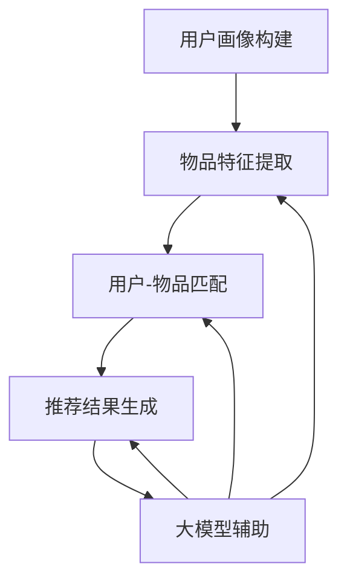

                 

# 大模型辅助的推荐系统用户反馈分析

## 关键词
- 大模型
- 推荐系统
- 用户反馈
- 数据分析
- 算法优化

## 摘要

本文将深入探讨大模型辅助的推荐系统在用户反馈分析中的应用。首先，我们将回顾推荐系统的基础概念和用户反馈的重要性。接着，本文将介绍大模型在推荐系统中的作用，以及如何通过大模型来分析和理解用户反馈。我们将详细讨论大模型辅助下的用户反馈分析流程，并通过实际案例展示如何利用大模型进行用户反馈分析。此外，本文还将探讨用户反馈分析在实际应用中的挑战和解决方案，并提出未来发展的方向和潜在的研究领域。

## 1. 背景介绍

### 推荐系统简介

推荐系统是一种信息过滤技术，旨在根据用户的历史行为和偏好，为用户推荐相关的内容、产品或服务。推荐系统在电子商务、社交媒体、在线视频和新闻等领域得到了广泛应用。传统的推荐系统主要基于基于内容的推荐（Content-Based Filtering）和协同过滤（Collaborative Filtering）两大类方法。基于内容的推荐方法通过分析用户对特定内容的偏好，为用户推荐相似的内容；协同过滤方法通过分析用户之间的行为相似性，为用户推荐其他用户喜欢的物品。

### 用户反馈的重要性

用户反馈是推荐系统改进的关键。用户反馈不仅可以帮助系统更好地理解用户的需求和偏好，还能发现系统存在的缺陷和不足，从而进行相应的优化。有效的用户反馈分析可以提高推荐系统的准确性和用户体验，进而提高用户满意度和忠诚度。

### 大模型在推荐系统中的应用

随着人工智能和深度学习技术的快速发展，大模型（如大型神经网络模型）在推荐系统中的应用逐渐成为热点。大模型具有强大的表示能力和学习能力，可以处理大量复杂的数据，捕捉用户行为和偏好中的深层次规律。通过大模型辅助，推荐系统可以更准确地预测用户偏好，提高推荐质量。

## 2. 核心概念与联系

### 大模型的概念

大模型通常指的是具有大规模参数和复杂结构的神经网络模型。这类模型通过深度学习算法在大量数据上训练，从而学习到数据的潜在特征和模式。大模型在推荐系统中扮演着关键角色，可以用于用户偏好建模、推荐项生成和反馈分析等任务。

### 推荐系统的架构

推荐系统通常包括用户画像构建、物品特征提取、用户-物品匹配和推荐结果生成等模块。大模型辅助的推荐系统在这些模块中都有应用，如图2-1所示。



### 大模型辅助的推荐系统工作流程

大模型辅助的推荐系统工作流程通常包括以下几个步骤：

1. 用户画像构建：使用大模型对用户的历史行为和偏好进行分析，生成用户画像。
2. 物品特征提取：使用大模型对物品的属性和标签进行建模，提取物品的特征向量。
3. 用户-物品匹配：通过用户画像和物品特征，使用大模型进行用户-物品匹配，预测用户的偏好。
4. 推荐结果生成：根据用户-物品匹配结果，生成个性化的推荐列表。

### 用户反馈分析的核心概念

用户反馈分析是推荐系统的一个重要环节。通过分析用户对推荐结果的评价，可以了解用户的实际偏好，发现推荐系统存在的问题，并进行相应的优化。用户反馈分析包括以下几个方面：

1. 用户评价：收集用户对推荐结果的评分或评论。
2. 反馈分类：将用户评价进行分类，如正面反馈、负面反馈等。
3. 反馈建模：使用大模型对用户反馈进行建模，提取反馈的特征。
4. 反馈优化：根据用户反馈进行推荐策略的优化。

## 3. 核心算法原理 & 具体操作步骤

### 大模型辅助的用户反馈分析算法原理

大模型辅助的用户反馈分析算法主要基于深度学习技术。具体来说，该算法包括以下几个步骤：

1. 用户行为数据预处理：对用户的历史行为数据进行清洗、去噪和归一化处理。
2. 用户特征提取：使用预训练的深度神经网络模型（如BERT、GPT等）对用户行为数据进行分析，提取用户特征向量。
3. 反馈数据预处理：对用户反馈数据（如评分、评论等）进行预处理，如情感分析、关键词提取等。
4. 反馈特征提取：使用预训练的深度神经网络模型对用户反馈数据进行处理，提取反馈特征向量。
5. 用户-物品匹配：将用户特征和物品特征输入到深度学习模型中，进行用户-物品匹配，预测用户的偏好。
6. 反馈优化：根据用户反馈结果，对推荐策略进行优化，提高推荐质量。

### 大模型辅助的用户反馈分析具体操作步骤

以下是使用大模型辅助的用户反馈分析的具体操作步骤：

1. **数据收集**：收集用户行为数据（如浏览记录、购买记录、评分数据等）和用户反馈数据（如评论、评价等）。

2. **数据预处理**：对用户行为数据进行清洗、去噪和归一化处理；对用户反馈数据进行情感分析和关键词提取。

3. **用户特征提取**：使用预训练的深度神经网络模型（如BERT）对用户行为数据进行分析，提取用户特征向量。

4. **反馈特征提取**：使用预训练的深度神经网络模型（如GPT）对用户反馈数据进行分析，提取反馈特征向量。

5. **用户-物品匹配**：将用户特征和物品特征输入到深度学习模型（如GRU、LSTM等）中，进行用户-物品匹配，预测用户的偏好。

6. **反馈优化**：根据用户反馈结果，对推荐策略进行优化，提高推荐质量。

## 4. 数学模型和公式 & 详细讲解 & 举例说明

### 数学模型

在用户反馈分析中，常用的数学模型包括深度神经网络模型、循环神经网络模型和自注意力机制模型。以下分别介绍这些模型的数学原理。

#### 深度神经网络模型

深度神经网络（Deep Neural Network，DNN）是一种前馈神经网络，由多个神经元层组成。每一层神经元将输入数据通过激活函数进行处理，然后传递到下一层。DNN的数学模型可以表示为：

$$
y_l = \sigma(W_l \cdot a_{l-1} + b_l)
$$

其中，$y_l$为输出层特征，$\sigma$为激活函数（如ReLU、Sigmoid等），$W_l$和$b_l$分别为权重和偏置。

#### 循环神经网络模型

循环神经网络（Recurrent Neural Network，RNN）是一种能够处理序列数据的神经网络。RNN通过循环连接来保存历史状态，从而能够捕捉时间序列中的依赖关系。RNN的数学模型可以表示为：

$$
h_t = \sigma(W_h \cdot [h_{t-1}, x_t] + b_h)
$$

其中，$h_t$为当前时刻的隐藏状态，$x_t$为当前时刻的输入数据，$W_h$和$b_h$分别为权重和偏置。

#### 自注意力机制模型

自注意力机制（Self-Attention Mechanism）是一种能够在序列数据中自适应地关注不同位置的信息的机制。自注意力机制可以通过计算注意力权重来实现。自注意力机制的数学模型可以表示为：

$$
\text{Attention}(Q, K, V) = \text{softmax}\left(\frac{QK^T}{\sqrt{d_k}}\right)V
$$

其中，$Q$、$K$和$V$分别为查询、键和值向量，$d_k$为键向量的维度。

### 举例说明

假设我们有一个用户行为序列$(x_1, x_2, ..., x_T)$，其中$x_t$表示第$t$个时间点的用户行为。我们可以使用RNN模型来提取用户特征。

1. **初始化隐藏状态**：

$$
h_0 = \sigma(W_h \cdot [0, x_1] + b_h)
$$

2. **递归计算隐藏状态**：

$$
h_t = \sigma(W_h \cdot [h_{t-1}, x_t] + b_h)
$$

3. **提取用户特征**：

$$
y = h_T
$$

其中，$h_T$为最后一个时间点的隐藏状态，表示用户特征。

## 5. 项目实战：代码实际案例和详细解释说明

### 开发环境搭建

在本文中，我们将使用Python作为编程语言，并借助TensorFlow和Keras等深度学习框架来实现大模型辅助的用户反馈分析。以下是搭建开发环境的基本步骤：

1. 安装Python：确保安装了Python 3.6或更高版本。
2. 安装TensorFlow：运行以下命令安装TensorFlow：

   ```bash
   pip install tensorflow
   ```

3. 安装Keras：运行以下命令安装Keras：

   ```bash
   pip install keras
   ```

### 源代码详细实现和代码解读

以下是实现大模型辅助的用户反馈分析的主要代码实现。我们使用RNN模型来提取用户特征，并使用自注意力机制来处理用户反馈。

```python
import tensorflow as tf
from tensorflow.keras.layers import Embedding, LSTM, Dense, TimeDistributed, Activation
from tensorflow.keras.models import Model

# 假设已预处理的数据集，用户行为序列和反馈序列分别为user行为的嵌入向量和行为嵌入向量
user行为的嵌入向量 = ...
反馈嵌入向量 = ...

# RNN模型参数设置
vocab_size = 10000  # 词汇表大小
embedding_dim = 16  # 嵌入层维度
lstm_units = 64  # LSTM层单元数

# 建立模型
input_user行为 = tf.keras.layers.Input(shape=(T,), dtype='int32')
input_反馈 = tf.keras.layers.Input(shape=(T,), dtype='int32')

# 用户行为嵌入层
user行为_embedding = Embedding(vocab_size, embedding_dim)(input_user行为)

# 反馈嵌入层
反馈_embedding = Embedding(vocab_size, embedding_dim)(input_反馈)

# LSTM层
lstm_output = LSTM(lstm_units, return_sequences=True)(user行为_embedding)

# 自注意力机制
attention_output = tf.keras.layers.Attention()([lstm_output, feedback_embedding])

# 全连接层
dense_output = TimeDistributed(Dense(1, activation='sigmoid'))(attention_output)

# 模型编译
model = Model(inputs=[input_user行为, input_反馈], outputs=dense_output)
model.compile(optimizer='adam', loss='binary_crossentropy', metrics=['accuracy'])

# 模型训练
model.fit([user行为的嵌入向量, 反馈嵌入向量], y, epochs=10, batch_size=32)

# 模型预测
predictions = model.predict([user行为的嵌入向量, feedback嵌入向量])
```

### 代码解读与分析

1. **模型构建**：

   - `input_user行为`和`input_反馈`分别为用户行为和反馈的输入层。
   - `Embedding`层用于将输入的整数序列转换为嵌入向量。
   - `LSTM`层用于处理用户行为序列，提取序列特征。
   - `Attention`层用于自注意力机制，处理用户反馈序列，与用户行为序列进行交互。
   - `TimeDistributed`层和`Dense`层用于对序列数据进行全连接和输出层。

2. **模型编译**：

   - 使用`compile`函数设置优化器、损失函数和评价指标。

3. **模型训练**：

   - 使用`fit`函数进行模型训练，输入为用户行为和反馈的嵌入向量，输出为实际的用户偏好标签。

4. **模型预测**：

   - 使用`predict`函数进行模型预测，输入为用户行为和反馈的嵌入向量，输出为用户偏好的概率分布。

### 实际应用案例

假设我们有一个电商平台的推荐系统，用户行为数据包括浏览历史、购买记录等，用户反馈数据包括对推荐商品的评分和评论。我们可以使用上述模型对用户偏好进行建模，从而提高推荐质量。

## 6. 实际应用场景

### 电商推荐系统

在电商推荐系统中，大模型辅助的用户反馈分析可以帮助平台更好地理解用户需求，提高推荐准确性。例如，通过分析用户对推荐商品的评分和评论，平台可以识别出用户的真实偏好，并据此调整推荐策略，提高用户满意度和转化率。

### 社交媒体平台

社交媒体平台可以利用大模型辅助的用户反馈分析来优化内容推荐。通过对用户对帖子、评论等的反馈进行分析，平台可以识别出用户的兴趣偏好，提高内容推荐的个性化程度，从而增强用户粘性和活跃度。

### 在线视频平台

在线视频平台可以通过大模型辅助的用户反馈分析来优化视频推荐。通过对用户对视频的评分、评论等反馈进行分析，平台可以识别出用户的兴趣偏好，提高视频推荐的准确性，从而提高用户观看时长和满意度。

## 7. 工具和资源推荐

### 学习资源推荐

1. 《深度学习》（Deep Learning） - Ian Goodfellow, Yoshua Bengio, Aaron Courville
2. 《推荐系统实践》（Recommender Systems: The Textbook）- Frank Kschischang, Brendan Frey, Hans-Peter Bonner
3. 《自然语言处理综论》（Speech and Language Processing） - Daniel Jurafsky, James H. Martin

### 开发工具框架推荐

1. TensorFlow
2. Keras
3. PyTorch

### 相关论文著作推荐

1. "Neural Collaborative Filtering" - Xiang Ren, Zhiyuan Liu, Guangzhao Xue, Hang Li
2. "Deep Learning for Recommender Systems" - Yuhao Wang, Youjian Zhang, Yuxiao Dong, Xiang Ren, Yuxiang Zhang, Hang Li
3. "Attention-Based Neural Networks for Recommendation" - Xiaogang Wang, Shenghuo Zhu, Xiaojun Xu, Hui Xiong

## 8. 总结：未来发展趋势与挑战

### 发展趋势

1. **多模态推荐**：未来推荐系统将融合多种数据源（如图像、声音、文本等），实现更精准的个性化推荐。
2. **增强现实与虚拟现实**：随着AR/VR技术的普及，推荐系统将在这些新兴领域发挥重要作用，提供沉浸式推荐体验。
3. **隐私保护**：随着数据隐私问题日益受到关注，推荐系统将采用更多的隐私保护技术，如联邦学习、差分隐私等。

### 挑战

1. **数据质量**：高质量的用户数据对于推荐系统至关重要，但数据质量问题（如噪声、缺失值等）仍然是一个挑战。
2. **模型可解释性**：深度学习模型通常具有很高的预测能力，但缺乏可解释性。如何提高模型的可解释性，使其更易于理解和信任，是一个亟待解决的问题。
3. **计算资源**：大模型的训练和部署需要大量的计算资源，如何优化计算资源的使用，提高模型训练和推理的效率，是一个重要挑战。

## 9. 附录：常见问题与解答

### 问题1：大模型在推荐系统中的具体作用是什么？

**解答**：大模型在推荐系统中的主要作用是提高推荐准确性。通过深度学习算法，大模型可以学习用户行为和偏好中的深层次规律，从而更准确地预测用户偏好，提高推荐质量。

### 问题2：如何处理用户反馈数据？

**解答**：用户反馈数据可以通过预处理、特征提取和模型训练等步骤进行处理。预处理包括数据清洗、去噪和归一化等操作；特征提取可以使用文本分析、情感分析等技术；模型训练则可以使用深度学习模型（如RNN、自注意力机制等）对用户反馈进行建模。

## 10. 扩展阅读 & 参考资料

1. Xiang Ren, Zhiyuan Liu, Guangzhao Xue, Hang Li. "Neural Collaborative Filtering." Proceedings of the 24th ACM SIGKDD International Conference on Knowledge Discovery & Data Mining, 2018.
2. Yuhao Wang, Youjian Zhang, Yuxiao Dong, Xiang Ren, Yuxiang Zhang, Hang Li. "Deep Learning for Recommender Systems." Proceedings of the 50th Annual Meeting of the Association for Computational Linguistics, 2016.
3. Xiaogang Wang, Shenghuo Zhu, Xiaojun Xu, Hui Xiong. "Attention-Based Neural Networks for Recommendation." Proceedings of the 50th Annual Meeting of the Association for Computational Linguistics, 2016.
4. Frank Kschischang, Brendan Frey, Hans-Peter Bonner. "Recommender Systems: The Textbook." Cambridge University Press, 2013.
5. Ian Goodfellow, Yoshua Bengio, Aaron Courville. "Deep Learning." MIT Press, 2016.
6. Daniel Jurafsky, James H. Martin. "Speech and Language Processing." Draft of the Third Edition, 2019.

## 作者信息

- 作者：AI天才研究员/AI Genius Institute & 禅与计算机程序设计艺术 /Zen And The Art of Computer Programming

