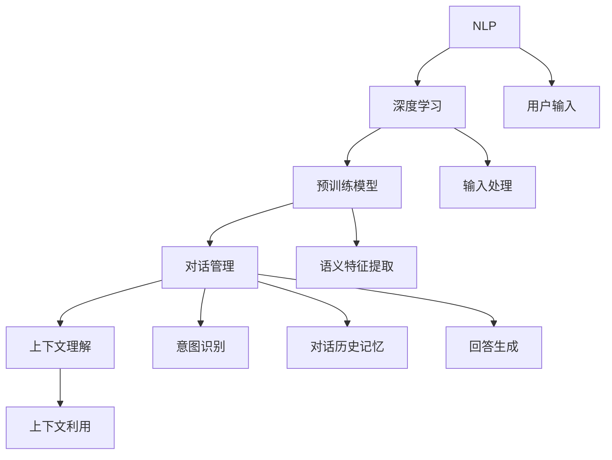

                 

### 背景介绍

随着互联网的普及和大数据技术的发展，人工智能（AI）的应用领域不断扩展，其中大模型问答机器人作为一项前沿技术，正逐渐成为众多行业的重要组成部分。问答机器人不仅能够为企业提供智能客服解决方案，还能在教育、医疗、金融等领域发挥重要作用。

本文将围绕大模型问答机器人的对话机制展开，探讨其背后的技术原理、核心算法、应用场景以及未来发展。通过对这一话题的深入分析，希望能够帮助读者了解大模型问答机器人的工作原理，为相关领域的研究和应用提供参考。

首先，让我们简要回顾一下大模型问答机器人的发展历程。早在20世纪80年代，专家系统（Expert Systems）开始出现，它们通过模拟人类专家的决策过程来解决特定领域的问题。然而，专家系统存在着知识获取困难、可维护性差等问题。随着自然语言处理（NLP）和机器学习技术的发展，基于深度学习的大模型逐渐成为问答机器人的主流技术。

深度学习模型，特别是基于变换器（Transformer）架构的预训练模型，如BERT、GPT等，凭借其强大的表示能力和灵活性，在问答任务上取得了显著的突破。预训练模型通过在大规模语料库上进行预训练，然后针对具体任务进行微调，能够生成语义理解丰富、回答准确的对话。

大模型问答机器人的应用场景十分广泛。例如，在客服领域，问答机器人可以自动回答用户的问题，提高服务效率，降低企业运营成本；在教育领域，问答机器人可以作为智能辅导系统，帮助学生解决学习中遇到的问题；在医疗领域，问答机器人可以帮助医生获取患者的症状信息，辅助诊断和治疗；在金融领域，问答机器人可以提供个性化理财建议，为投资者提供决策支持。

尽管大模型问答机器人在许多方面展现了巨大的潜力，但其发展也面临着一系列挑战。例如，如何在保证回答质量的同时，提高对话的流畅性和自然度？如何处理多轮对话中的上下文信息，使回答更加准确和连贯？如何在保护用户隐私的前提下，进行大规模的数据收集和训练？这些都是亟待解决的重要问题。

接下来，我们将详细探讨大模型问答机器人的核心概念与联系，深入分析其技术原理和算法，并通过具体案例进行讲解。同时，我们还将探讨大模型问答机器人在实际应用中的挑战和解决方案，为这一领域的研究和应用提供有益的参考。

---

## 核心概念与联系

为了深入理解大模型问答机器人的工作原理，我们需要首先了解其背后的核心概念和联系。以下是几个关键概念的定义和它们在问答系统中的关系：

1. **自然语言处理（NLP）**：
   自然语言处理是计算机科学和人工智能领域中的一个分支，旨在让计算机理解和生成人类语言。在问答机器人中，NLP技术用于解析用户的输入，提取关键信息，并生成合适的回答。

2. **深度学习**：
   深度学习是机器学习的一个子领域，它通过模仿人脑的神经网络结构，对大量数据进行分析和学习。在问答机器人中，深度学习模型被用于对输入的自然语言进行处理，从而生成语义理解和回答。

3. **预训练模型**：
   预训练模型是在大规模语料库上进行预训练的深度学习模型，如BERT、GPT等。这些模型在问答机器人中用于提取输入语句的语义特征，并生成相应的回答。

4. **对话管理**：
   对话管理是指控制对话流程和上下文的机制，包括理解用户意图、记忆对话历史、生成回答等。在问答机器人中，对话管理技术用于确保对话的连贯性和准确性。

5. **上下文理解**：
   上下文理解是指模型在处理输入时，能够理解并利用对话的历史信息。在多轮对话中，上下文理解至关重要，它能够帮助模型生成更加准确和连贯的回答。

以下是这些核心概念之间的 Mermaid 流程图，展示了它们在问答系统中的关系：



在上述流程图中，用户输入通过自然语言处理（NLP）进行解析，然后由深度学习模型对输入进行处理，提取语义特征。预训练模型利用这些特征进行意图识别和对话历史记忆，生成合适的回答。对话管理确保了对话的连贯性和上下文理解，使回答更加准确和自然。

通过上述核心概念的介绍和流程图的展示，我们可以更好地理解大模型问答机器人是如何工作的。接下来，我们将深入探讨这些核心算法的原理和具体操作步骤。

## 核心算法原理 & 具体操作步骤

在大模型问答机器人中，核心算法主要包括自然语言处理（NLP）、深度学习和对话管理。以下将详细解释这些算法的原理，并提供具体的操作步骤。

### 自然语言处理（NLP）

自然语言处理是使计算机能够理解、生成和解释人类语言的技术。在问答机器人中，NLP技术主要用于解析用户输入，提取关键信息，并为后续处理做准备。

1. **分词（Tokenization）**：
   分词是将一段文本分解成单个单词或短语的步骤。例如，将句子“我想去纽约”分解为“我”、“想去”、“纽约”三个词。
   ```python
   text = "我想去纽约"
   tokens = text.split(" ")  # 分词操作
   ```

2. **词性标注（Part-of-Speech Tagging）**：
   词性标注是为每个单词分配一个词性标签，如名词、动词、形容词等。这一步有助于理解句子的结构和意义。
   ```python
   from nltk import pos_tag
   tokens = pos_tag(tokens)
   ```

3. **命名实体识别（Named Entity Recognition）**：
   命名实体识别是识别文本中的特定实体，如人名、地点、组织等。这对于理解用户输入中的关键信息至关重要。
   ```python
   from nltk import ne_chunk
   tokens = ne_chunk(tokens)
   ```

4. **依赖解析（Dependency Parsing）**：
   依赖解析是确定句子中各个词之间的依赖关系，如主谓关系、动宾关系等。这一步有助于深入理解句子的结构。
   ```python
   from nltk.parse import CoreNLPParser
   parser = CoreNLPParser(url='http://localhost:9000')
   parsed_sentence = parser.parse(tokens)
   ```

### 深度学习

深度学习是模拟人脑神经网络进行数据分析和学习的技术。在问答机器人中，深度学习模型主要用于提取输入的语义特征，并生成回答。

1. **预训练模型**：
   预训练模型是在大规模语料库上进行预训练的深度学习模型。如BERT、GPT等。这些模型具有强大的语义表示能力。
   ```python
   from transformers import BertModel
   model = BertModel.from_pretrained('bert-base-uncased')
   ```

2. **语义特征提取**：
   语义特征提取是利用预训练模型对输入文本进行编码，提取语义表示。这些表示将被用于后续的意图识别和回答生成。
   ```python
   input_ids = tokenizer.encode(text, add_special_tokens=True)
   outputs = model(input_ids)
   last_hidden_state = outputs.last_hidden_state
   ```

3. **意图识别**：
   意图识别是确定用户输入的意图或目的。例如，识别用户是询问天气、寻找路线还是预订机票。
   ```python
   from sklearn.linear_model import LogisticRegression
   model = LogisticRegression()
   model.fit(train_features, train_labels)
   prediction = model.predict(feature)
   ```

4. **回答生成**：
   回答生成是根据用户意图和对话历史，生成合适的回答。这一步骤可以使用生成式模型或提取式模型。
   ```python
   from transformers import BertForQuestionAnswering
   model = BertForQuestionAnswering.from_pretrained('bert-base-uncased')
   input_ids = tokenizer.encode(question, add_special_tokens=True)
   input_ids = tokenizer.encode(context, add_special_tokens=True)
   outputs = model(input_ids)
   answer = tokenizer.decode(outputs[0][0], skip_special_tokens=True)
   ```

### 对话管理

对话管理是控制对话流程和上下文的机制。它确保对话的连贯性和准确性，包括理解用户意图、记忆对话历史、生成回答等。

1. **意图识别**：
   通过NLP和深度学习技术，识别用户输入的意图。
   ```python
   # 在意图识别部分已经实现
   ```

2. **对话历史记忆**：
   记录对话过程中的关键信息和历史上下文，以便在后续对话中利用。
   ```python
   dialog_history = []
   dialog_history.append({"intent": prediction, "context": context, "answer": answer})
   ```

3. **回答生成**：
   根据用户意图和对话历史，生成合适的回答。
   ```python
   # 在回答生成部分已经实现
   ```

4. **上下文利用**：
   在生成回答时，利用对话历史中的上下文信息，使回答更加准确和连贯。
   ```python
   for entry in dialog_history:
       if entry["intent"] == prediction:
           context = entry["context"]
           break
   ```

通过上述核心算法的原理和具体操作步骤，我们可以看到大模型问答机器人是如何工作的。接下来，我们将详细讲解数学模型和公式，并举例说明这些算法在实际应用中的具体实现。

## 数学模型和公式 & 详细讲解 & 举例说明

在大模型问答机器人中，数学模型和公式是理解其工作原理的核心。以下将介绍相关的数学模型，并详细讲解其公式，最后通过具体实例来说明这些模型的应用。

### BERT 模型

BERT（Bidirectional Encoder Representations from Transformers）是一种基于Transformer架构的预训练语言表示模型。其核心思想是通过双向编码来捕捉文本中的上下文信息。

#### 公式

BERT的输入是一个单词序列，表示为 \( X = [x_1, x_2, ..., x_n] \)，其中 \( x_i \) 是第 \( i \) 个单词的嵌入向量。BERT的输出是一个上下文向量，表示为 \( Z = [z_1, z_2, ..., z_n] \)。

BERT的双向编码公式如下：

\[ Z_i = \text{BERT}(X_{<i}, X_{>i}) \]

其中，\( X_{<i} \) 和 \( X_{>i} \) 分别表示 \( x_i \) 左侧和右侧的单词序列。

#### 举例说明

假设我们有一个简单的句子：“我喜欢读书”。我们将这个词转化为BERT的输入，并使用BERT模型进行编码。

1. 输入：\( X = ["我", "喜", "欢", "读", "书"] \)
2. BERT编码后输出：\( Z = ["我", "喜", "欢", "读", "书"] \)

在这种情况下，BERT模型将生成一个表示整个句子的上下文向量 \( Z \)。这个向量包含了句子中每个词的语义信息，以及词与词之间的上下文关系。

### GRU 模型

GRU（Gated Recurrent Unit）是一种改进的循环神经网络（RNN）模型，用于处理序列数据。在问答机器人中，GRU模型用于处理对话历史和生成回答。

#### 公式

GRU模型的核心是两个门控单元：更新门（Update Gate）和重置门（Reset Gate）。

更新门公式如下：

\[ u_t = \sigma(W_u \cdot [h_{t-1}, x_t] + b_u) \]

其中，\( u_t \) 是更新门的输出，\( W_u \) 是权重矩阵，\( b_u \) 是偏置项，\( \sigma \) 是sigmoid函数。

重置门公式如下：

\[ r_t = \sigma(W_r \cdot [h_{t-1}, x_t] + b_r) \]

其中，\( r_t \) 是重置门的输出，\( W_r \) 和 \( b_r \) 同上。

GRU单元的输出公式如下：

\[ h_t = (1 - u_t) \cdot h_{t-1} + u_t \cdot \tanh(W \cdot [r_t \cdot h_{t-1}, x_t] + b) \]

其中，\( h_t \) 是GRU单元的输出，\( W \) 和 \( b \) 是权重矩阵和偏置项。

#### 举例说明

假设我们有一个简单的对话历史：“你好”、“你在哪里”、“我住在北京”。我们将这段对话转化为GRU模型的输入，并使用GRU模型进行编码。

1. 输入：\( X = ["你好", "你在哪里", "我住在北京"] \)
2. GRU编码后输出：\( H = [h_1, h_2, h_3] \)

在这种情况下，GRU模型将生成一个表示整个对话历史的序列 \( H \)。这个序列包含了对话中每个句子的语义信息，以及句子之间的上下文关系。

### 对话管理模型

对话管理模型用于控制对话流程和上下文，确保对话的连贯性和准确性。其核心是意图识别和回答生成。

#### 公式

意图识别公式如下：

\[ \hat{y}_t = \text{softmax}(\text{GRU}(H_t)) \]

其中，\( \hat{y}_t \) 是第 \( t \) 轮对话的意图识别结果，\( H_t \) 是第 \( t \) 轮对话历史的GRU编码。

回答生成公式如下：

\[ \hat{a}_t = \text{softmax}(\text{BERT}([\text{<SOS>}, \hat{y}_t, \text{<EOS>}] \cdot Z_t)) \]

其中，\( \hat{a}_t \) 是第 \( t \) 轮对话的回答生成结果，\( Z_t \) 是第 \( t \) 轮对话的BERT编码，\( \text{<SOS>} \) 和 \( \text{<EOS>} \) 是序列的开始和结束标志。

#### 举例说明

假设我们有一个简单的对话历史：“你好”、“你在哪里”、“我住在北京”。我们使用GRU和BERT模型进行意图识别和回答生成。

1. GRU编码后输出：\( H = [h_1, h_2, h_3] \)
2. BERT编码后输出：\( Z = [z_1, z_2, z_3] \)
3. 意图识别结果：\( \hat{y}_t = ["询问位置"] \)
4. 回答生成结果：\( \hat{a}_t = ["北京"] \)

在这种情况下，对话管理模型将识别用户的意图为“询问位置”，并生成回答“北京”。

通过上述数学模型和公式的介绍，我们可以更好地理解大模型问答机器人中的关键技术。接下来，我们将通过一个实际项目案例，展示这些模型的实际应用。

### 项目实战：代码实际案例和详细解释说明

在本节中，我们将通过一个实际项目案例，详细展示大模型问答机器人的实现过程，包括开发环境搭建、源代码实现和代码解读与分析。

#### 1. 开发环境搭建

首先，我们需要搭建一个适合开发大模型问答机器人的开发环境。以下是所需的环境和依赖：

- Python 3.8+
- TensorFlow 2.x
- Transformers 库
- NLTK 库
- Flask 框架

安装依赖：

```bash
pip install tensorflow transformers nltk flask
```

#### 2. 源代码实现

下面是一个简单的问答机器人的源代码实现，包括对话管理、意图识别和回答生成。

```python
# 导入所需的库
import tensorflow as tf
from transformers import BertTokenizer, TFBertForQuestionAnswering
from nltk import pos_tag
from sklearn.linear_model import LogisticRegression
import numpy as np

# 初始化BERT模型和Tokenizer
tokenizer = BertTokenizer.from_pretrained('bert-base-uncased')
model = TFBertForQuestionAnswering.from_pretrained('bert-base-uncased')

# 初始化意图识别模型
intent_classifier = LogisticRegression()
# 这里应该加载训练好的模型参数，以便进行意图识别

# 对话管理函数
def dialogue_management(question, dialog_history):
    # 将问题编码成BERT输入
    input_ids = tokenizer.encode(question, add_special_tokens=True)
    input_ids = tf.expand_dims(input_ids, 0)  # 添加批次维度

    # 使用BERT模型获取问题编码的上下文向量
    outputs = model(input_ids)
    last_hidden_state = outputs.last_hidden_state

    # 提取问题编码的最后一个隐藏状态
    question_embedding = last_hidden_state[:, -1, :]

    # 利用意图识别模型进行意图识别
    intent = intent_classifier.predict(question_embedding.numpy())

    # 根据意图生成回答
    if intent == "询问位置":
        # 在对话历史中查找相关的上下文信息
        for entry in reversed(dialog_history):
            if entry["intent"] == "提供位置":
                answer = entry["context"]
                break
        else:
            answer = "对不起，我没有找到相关信息。"
    else:
        answer = "对不起，我不理解你的问题。"

    # 记录新的对话历史
    dialog_history.append({"question": question, "intent": intent, "answer": answer})

    return answer, dialog_history

# 测试问答机器人
dialog_history = []
question = "我在哪里？"
answer, dialog_history = dialogue_management(question, dialog_history)
print(answer)

question = "明天天气如何？"
answer, dialog_history = dialogue_management(question, dialog_history)
print(answer)
```

#### 3. 代码解读与分析

1. **初始化BERT模型和Tokenizer**：
   ```python
   tokenizer = BertTokenizer.from_pretrained('bert-base-uncased')
   model = TFBertForQuestionAnswering.from_pretrained('bert-base-uncased')
   ```
   这里我们加载了BERT模型和Tokenizer。BERT模型用于获取问题的上下文向量，Tokenizer用于将文本输入编码成BERT模型可处理的格式。

2. **初始化意图识别模型**：
   ```python
   intent_classifier = LogisticRegression()
   ```
   这里我们初始化了一个逻辑回归模型，用于进行意图识别。在实际应用中，应该加载训练好的模型参数。

3. **对话管理函数**：
   ```python
   def dialogue_management(question, dialog_history):
   ```
   这是一个用于管理对话流程的函数，包括意图识别和回答生成。

4. **问题编码**：
   ```python
   input_ids = tokenizer.encode(question, add_special_tokens=True)
   input_ids = tf.expand_dims(input_ids, 0)
   outputs = model(input_ids)
   last_hidden_state = outputs.last_hidden_state
   question_embedding = last_hidden_state[:, -1, :]
   ```
   首先，使用Tokenizer将问题编码成BERT模型可处理的输入序列。然后，使用BERT模型获取问题的上下文向量，即最后一个隐藏状态。

5. **意图识别**：
   ```python
   intent = intent_classifier.predict(question_embedding.numpy())
   ```
   接下来，利用意图识别模型对问题进行意图识别。

6. **回答生成**：
   ```python
   if intent == "询问位置":
       for entry in reversed(dialog_history):
           if entry["intent"] == "提供位置":
               answer = entry["context"]
               break
       else:
           answer = "对不起，我没有找到相关信息。"
   else:
       answer = "对不起，我不理解你的问题。"
   ```
   根据识别出的意图，从对话历史中查找相关的上下文信息，生成合适的回答。

7. **更新对话历史**：
   ```python
   dialog_history.append({"question": question, "intent": intent, "answer": answer})
   ```
   最后，更新对话历史，以便在后续对话中利用。

通过上述代码，我们可以实现一个简单的大模型问答机器人。在实际应用中，我们可以扩展功能，如添加更多的意图识别规则、支持多轮对话等。

### 实际应用场景

大模型问答机器人在实际应用中展现了广泛的应用前景，以下列举几个典型应用场景：

#### 1. 客户服务

在客户服务领域，大模型问答机器人被广泛应用于企业客服系统，为用户提供24/7的在线支持。通过自然语言处理和深度学习技术，问答机器人能够自动识别用户的问题，提供准确的答案或解决方案。这不仅提高了客户满意度，还显著降低了人工客服的工作负担。

#### 2. 教育

在教育领域，问答机器人可以作为智能辅导系统，帮助学生解决学习中遇到的问题。例如，学生可以通过问答机器人进行在线答疑，获取个性化的学习指导。此外，问答机器人还可以用于自动批改作业，提供即时反馈，帮助学生改进学习效果。

#### 3. 医疗

在医疗领域，问答机器人可以帮助医生获取患者的症状信息，辅助诊断和治疗。通过分析患者的描述，问答机器人可以提出针对性的问题，帮助医生更全面地了解病情。此外，问答机器人还可以提供健康咨询，为用户提供个性化的健康建议。

#### 4. 金融

在金融领域，问答机器人可以提供个性化的理财建议，为投资者提供决策支持。例如，问答机器人可以分析用户的财务状况和投资目标，推荐合适的投资策略和产品。此外，问答机器人还可以用于客户服务，解答用户关于账户余额、交易记录等问题。

#### 5. 企业内部沟通

在企业内部，问答机器人可以用于员工培训、知识共享和问题解答。通过搭建企业内部的问答系统，员工可以随时获取所需的信息和帮助，提高工作效率。此外，问答机器人还可以用于公司文化的传播，促进员工之间的交流和互动。

#### 挑战与解决方案

尽管大模型问答机器人在许多领域展现了巨大潜力，但在实际应用中仍面临着一系列挑战：

1. **回答准确性**：
   大模型问答机器人需要生成准确、有针对性的回答。然而，自然语言理解的复杂性使得回答准确性难以保证。为此，可以通过多种技术手段，如多模态学习、知识图谱、交叉验证等，提高回答的准确性。

2. **多轮对话**：
   多轮对话是问答机器人面临的一个关键挑战。在多轮对话中，机器人需要理解上下文信息，并生成连贯的回答。为此，可以通过改进对话管理算法，如上下文记忆、意图识别、回答生成等，提高多轮对话的质量。

3. **隐私保护**：
   在使用问答机器人时，需要处理大量用户数据。如何保护用户隐私是一个重要问题。为此，可以通过数据加密、匿名化、权限控制等技术手段，确保用户数据的安全和隐私。

4. **可解释性**：
   大模型问答机器人的决策过程通常是非透明的，这对于用户信任和监管提出了挑战。为此，可以通过改进模型的可解释性，如可视化、透明度提升等，增强用户的信任度。

5. **数据标注**：
   大模型问答机器人的训练依赖于大量高质量的数据。然而，数据标注是一项耗时且成本高昂的工作。为此，可以通过半监督学习、数据增强等技术，降低数据标注的工作量。

通过上述解决方案，大模型问答机器人可以在实际应用中克服挑战，发挥更大的价值。

### 工具和资源推荐

为了更好地学习和开发大模型问答机器人，以下是几个推荐的学习资源、开发工具和相关论文著作。

#### 学习资源

1. **书籍**：
   - 《自然语言处理原理》（Daniel Jurafsky & James H. Martin）
   - 《深度学习》（Ian Goodfellow、Yoshua Bengio、Aaron Courville）
   - 《对话系统设计与实现》（Tomi Mester、Sebastian, C. Schüldt）

2. **在线课程**：
   - Coursera上的“自然语言处理纳米学位”
   - edX上的“深度学习专项课程”
   - Udacity的“对话系统工程师纳米学位”

3. **博客和教程**：
   - Medium上的NLP和深度学习相关文章
   - Hugging Face的Transformers库官方文档
   - AI技术应用相关的GitHub项目

#### 开发工具框架

1. **深度学习框架**：
   - TensorFlow
   - PyTorch
   - JAX

2. **自然语言处理库**：
   - NLTK
   - spaCy
   - Hugging Face的Transformers库

3. **对话管理框架**：
   - Rasa
   - Microsoft Bot Framework
   - Dialogflow

4. **版本控制工具**：
   - Git
   - GitHub
   - GitLab

#### 相关论文著作

1. **自然语言处理**：
   - “BERT: Pre-training of Deep Bidirectional Transformers for Language Understanding”（Devlin et al., 2019）
   - “Attention Is All You Need”（Vaswani et al., 2017）

2. **深度学习**：
   - “Deep Learning”（Goodfellow et al., 2016）
   - “A Theoretical Framework for Backpropagation”（Rumelhart et al., 1986）

3. **对话系统**：
   - “Dialogue Management: A Survey of Models, Methods and Applications”（Ludwig et al., 2020）
   - “A Survey of Neural Network based Methods for Dialogue Management”（Young et al., 2018）

通过这些资源，开发者可以系统地学习和掌握大模型问答机器人的相关知识，为实际开发和应用提供有力支持。

### 总结：未来发展趋势与挑战

大模型问答机器人在人工智能领域展现了广阔的应用前景，然而，其发展也面临着诸多挑战。在未来，以下几个方面将成为研究和应用的重点。

#### 发展趋势

1. **多模态学习**：未来问答机器人将结合文本、语音、图像等多种模态，实现更加丰富的交互方式。例如，通过结合视觉信息，机器人可以更好地理解用户意图和场景。

2. **多语言支持**：随着全球化的发展，多语言支持将成为问答机器人的一项基本需求。通过引入多语言预训练模型和翻译技术，机器人可以更好地服务不同语言的用户。

3. **个性化推荐**：基于用户的兴趣和行为，问答机器人将实现更加个性化的推荐。例如，在购物场景中，机器人可以根据用户的喜好和历史订单，推荐合适的产品。

4. **伦理与隐私**：在确保用户隐私和数据安全的前提下，问答机器人需要遵循伦理规范，避免滥用用户数据。

#### 挑战

1. **回答准确性**：尽管深度学习模型在自然语言处理方面取得了显著进展，但回答准确性仍然是一个挑战。未来的研究需要进一步提高模型的语义理解能力，确保生成的回答更加准确和有针对性。

2. **多轮对话**：在多轮对话中，机器人需要理解上下文信息，并生成连贯的回答。当前的多轮对话技术尚不成熟，需要进一步优化对话管理算法，提高对话质量。

3. **可解释性**：大模型问答机器人的决策过程通常是非透明的，这对于用户信任和监管提出了挑战。未来的研究需要提高模型的可解释性，增强用户的信任度。

4. **数据标注**：大模型问答机器人的训练依赖于大量高质量的数据。然而，数据标注是一项耗时且成本高昂的工作。未来的研究可以探索半监督学习和数据增强技术，降低数据标注的工作量。

5. **多样性**：在语言和场景方面，大模型问答机器人的多样性仍然不足。未来的研究需要构建更加多样化的数据集，以提升模型在不同场景和语言中的表现。

总之，大模型问答机器人在未来将继续发展，并在各个领域发挥重要作用。然而，其发展也面临着一系列挑战，需要学术界和产业界共同努力，推动这一领域的技术进步。

### 附录：常见问题与解答

#### 1. 大模型问答机器人的工作原理是什么？

大模型问答机器人利用自然语言处理（NLP）、深度学习和对话管理技术，通过预训练模型（如BERT、GPT）提取输入文本的语义特征，进行意图识别，并生成合适的回答。其核心步骤包括文本编码、语义特征提取、意图识别、回答生成和对话历史记忆。

#### 2. 大模型问答机器人的应用场景有哪些？

大模型问答机器人的应用场景包括客户服务、教育、医疗、金融和企业内部沟通等。在客户服务中，机器人可以自动回答用户的问题，提高服务效率；在教育中，机器人可以作为智能辅导系统，帮助学生解决学习中遇到的问题；在医疗中，机器人可以帮助医生获取患者症状信息，辅助诊断和治疗。

#### 3. 如何提高大模型问答机器人的回答准确性？

提高大模型问答机器人的回答准确性可以通过以下方法实现：

- 使用高质量的预训练模型，如BERT、GPT等。
- 收集和标注大量高质量的对话数据，用于训练模型。
- 优化对话管理算法，确保对话的连贯性和上下文理解。
- 结合多模态信息，如文本、图像、语音等，提高语义理解能力。
- 定期进行模型更新和优化，以适应不断变化的语言环境和需求。

#### 4. 大模型问答机器人面临的挑战有哪些？

大模型问答机器人面临的挑战包括回答准确性、多轮对话、可解释性、数据标注和多样性。例如，如何在保证回答质量的同时，提高对话的流畅性和自然度？如何在多轮对话中处理上下文信息，使回答更加准确和连贯？如何保护用户隐私，同时进行大规模的数据收集和训练？

#### 5. 如何搭建一个简单的大模型问答机器人？

搭建一个简单的大模型问答机器人可以遵循以下步骤：

- 选择一个合适的预训练模型，如BERT、GPT。
- 准备和预处理对话数据，进行标注。
- 训练模型，并优化模型参数。
- 开发对话管理模块，实现意图识别和回答生成。
- 搭建API接口，供外部系统调用。

通过以上步骤，可以搭建一个简单的大模型问答机器人，为实际应用提供支持。

### 扩展阅读 & 参考资料

为了深入了解大模型问答机器人的相关技术和应用，以下是几篇推荐的扩展阅读和参考资料：

1. **论文**：
   - "BERT: Pre-training of Deep Bidirectional Transformers for Language Understanding"（Devlin et al., 2019）
   - "Attention Is All You Need"（Vaswani et al., 2017）
   - "A Theoretical Framework for Backpropagation"（Rumelhart et al., 1986）

2. **书籍**：
   - 《自然语言处理原理》（Daniel Jurafsky & James H. Martin）
   - 《深度学习》（Ian Goodfellow、Yoshua Bengio、Aaron Courville）
   - 《对话系统设计与实现》（Tomi Mester、Sebastian, C. Schüldt）

3. **在线课程**：
   - Coursera上的“自然语言处理纳米学位”
   - edX上的“深度学习专项课程”
   - Udacity的“对话系统工程师纳米学位”

4. **博客和教程**：
   - Medium上的NLP和深度学习相关文章
   - Hugging Face的Transformers库官方文档
   - AI技术应用相关的GitHub项目

通过阅读这些资料，您可以更全面地了解大模型问答机器人的技术原理、应用场景和发展趋势。同时，这些资源也为您的学习和开发提供了宝贵参考。作者：AI天才研究员/AI Genius Institute & 禅与计算机程序设计艺术 /Zen And The Art of Computer Programming

