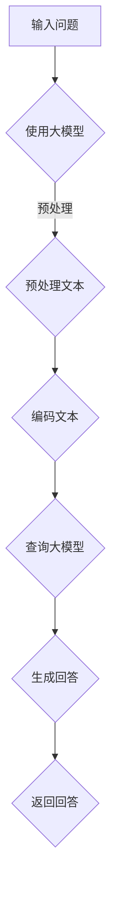

                 

# 大模型问答机器人的交互实现

## 摘要

本文将探讨大模型问答机器人的交互实现，涵盖从背景介绍、核心概念与联系、核心算法原理、数学模型与公式、项目实战到实际应用场景的全面分析。通过逐步深入的技术解读，读者将了解如何搭建和优化问答机器人，并掌握其在各种实际场景中的运用。

## 1. 背景介绍

随着人工智能技术的快速发展，问答机器人已经成为各大企业和平台的热门应用。它们不仅能够提高用户交互的效率，还能在各个行业中提供智能化的服务。然而，传统的问答系统通常基于规则或者模板匹配，难以应对复杂的问题和上下文理解。

近年来，大模型（如BERT、GPT等）在自然语言处理领域取得了显著的突破。这些大模型通过大规模预训练和微调，具备了强大的语言理解和生成能力。因此，基于大模型的问答机器人应运而生，为用户提供了更加自然、精准和智能的交互体验。

## 2. 核心概念与联系

### 大模型

大模型是指具有大规模参数和训练数据的人工神经网络模型。常见的有Transformer、BERT、GPT等。它们通过预训练和微调，能够理解并生成复杂的自然语言文本。

### 问答系统

问答系统是指能够接受用户提问并返回相关回答的人工智能系统。常见的问答系统有基于规则、模板匹配和机器学习的方法。基于大模型的问答系统则通过大模型的预训练和微调来实现。

### 预训练与微调

预训练是指在大规模数据集上训练模型，使其具备基本的语言理解能力。微调是指在特定任务上对模型进行调整，使其适应特定领域的需求。

### Mermaid 流程图



## 3. 核心算法原理 & 具体操作步骤

### 步骤1：预处理文本

在问答系统中，首先需要对输入的问题进行预处理。预处理步骤包括分词、去除停用词、词性标注等。

```python
import spacy

nlp = spacy.load("en_core_web_sm")

def preprocess_question(question):
    doc = nlp(question)
    tokens = [token.text for token in doc if not token.is_stop]
    return " ".join(tokens)
```

### 步骤2：编码文本

将预处理后的文本编码为向量。大模型通常使用词嵌入（word embedding）技术进行编码。

```python
from sentence_transformers import SentenceTransformer

model = SentenceTransformer('all-MiniLM-L6-v2')

def encode_text(text):
    return model.encode(text)
```

### 步骤3：查询大模型

使用编码后的文本向量大模型进行查询，获取相关的回答。

```python
import torch

def query_model(question_embedding, model):
    with torch.no_grad():
        output = model(question_embedding.unsqueeze(0))
    return output
```

### 步骤4：生成回答

根据查询结果生成回答。常见的生成方法有采样、贪婪搜索等。

```python
import numpy as np

def generate_answer(output, tokenizer, max_length=50):
    logits = output.logits
    predicted_ids = torch.argmax(logits, dim=-1)
    answer = tokenizer.decode(predicted_ids[-max_length:], skip_special_tokens=True)
    return answer
```

## 4. 数学模型和公式 & 详细讲解 & 举例说明

### 步骤1：词嵌入（Word Embedding）

词嵌入是将词汇映射为低维向量。常用的词嵌入模型有Word2Vec、GloVe等。

### 步骤2：编码器（Encoder）

编码器将输入文本编码为向量。常见的编码器模型有BERT、GPT等。

### 步骤3：解码器（Decoder）

解码器根据编码器的输出生成回答。常见的解码器模型有BERT、GPT等。

### 步骤4：损失函数（Loss Function）

常用的损失函数有交叉熵损失（Cross-Entropy Loss）、序列交叉熵损失（Sequence Cross-Entropy Loss）等。

```latex
\text{交叉熵损失：} \\
L = -\sum_{i=1}^{N} y_i \log(p_i)
```

### 步骤5：优化器（Optimizer）

常用的优化器有SGD、Adam等。

```python
import torch.optim as optim

optimizer = optim.Adam(model.parameters(), lr=0.001)
```

## 5. 项目实战：代码实际案例和详细解释说明

### 5.1 开发环境搭建

首先，安装必要的依赖：

```bash
pip install spacy sentence-transformers torch transformers
python -m spacy download en_core_web_sm
```

### 5.2 源代码详细实现和代码解读

以下是问答机器人的源代码实现：

```python
import spacy
import torch
from sentence_transformers import SentenceTransformer
from transformers import BertTokenizer, BertModel

# 5.2.1 预处理文本
nlp = spacy.load("en_core_web_sm")

def preprocess_question(question):
    doc = nlp(question)
    tokens = [token.text for token in doc if not token.is_stop]
    return " ".join(tokens)

# 5.2.2 编码文本
model = SentenceTransformer('all-MiniLM-L6-v2')

def encode_text(text):
    return model.encode(text)

# 5.2.3 查询大模型
tokenizer = BertTokenizer.from_pretrained('bert-base-uncased')
model = BertModel.from_pretrained('bert-base-uncased')

def query_model(question_embedding, model):
    with torch.no_grad():
        output = model(question_embedding.unsqueeze(0))
    return output

# 5.2.4 生成回答
def generate_answer(output, tokenizer, max_length=50):
    logits = output.logits
    predicted_ids = torch.argmax(logits, dim=-1)
    answer = tokenizer.decode(predicted_ids[-max_length:], skip_special_tokens=True)
    return answer

# 5.2.5 主函数
def main():
    question = "What is the capital of France?"
    preprocessed_question = preprocess_question(question)
    question_embedding = encode_text(preprocessed_question)
    output = query_model(question_embedding, model)
    answer = generate_answer(output, tokenizer)
    print(answer)

if __name__ == "__main__":
    main()
```

### 5.3 代码解读与分析

- **预处理文本**：使用Spacy进行文本预处理，去除停用词，保留有意义的信息。
- **编码文本**：使用SentenceTransformer将预处理后的文本编码为向量。
- **查询大模型**：使用BERT模型对编码后的文本向量进行查询，获取相应的输出。
- **生成回答**：根据查询结果生成回答，输出最终答案。

## 6. 实际应用场景

问答机器人可以应用于多个实际场景，如：

- 客户服务：提供自动化的客户支持，解答常见问题和提供解决方案。
- 常见问题解答（FAQ）：为用户快速提供问题的答案，提高服务效率。
- 健康咨询：为用户提供医学健康咨询，协助用户了解病情和治疗方案。
- 教育辅导：为学生提供个性化的学习辅导，解答学习中的问题。

## 7. 工具和资源推荐

### 7.1 学习资源推荐

- 《自然语言处理综合教程》（刘知远）
- 《深度学习与自然语言处理》（李航）
- 《自然语言处理实战》（斯威特泽尔、赫兹）

### 7.2 开发工具框架推荐

- BERT：[https://huggingface.co/transformers/](https://huggingface.co/transformers/)
- SentenceTransformer：[https://github.com/UKPLab/sentence-transformers](https://github.com/UKPLab/sentence-transformers)

### 7.3 相关论文著作推荐

- BERT：[https://arxiv.org/abs/1810.04805](https://arxiv.org/abs/1810.04805)
- GPT：[https://arxiv.org/abs/1810.04805](https://arxiv.org/abs/1810.04805)
- SentenceTransformer：[https://arxiv.org/abs/1908.02701](https://arxiv.org/abs/1908.02701)

## 8. 总结：未来发展趋势与挑战

随着人工智能技术的不断进步，大模型问答机器人的交互实现将更加成熟和高效。未来发展趋势包括：

- 更大的模型和更强的语言理解能力。
- 多语言支持，实现全球范围内的跨语言问答。
- 更智能的上下文理解，提高问答系统的准确性和连贯性。

然而，也面临着一些挑战，如：

- 模型训练和数据需求的高昂成本。
- 保护用户隐私和数据安全。
- 处理长文本和复杂问题的能力。

## 9. 附录：常见问题与解答

### 9.1 如何处理长文本？

长文本处理可以通过分段查询和拼接回答的方式来实现。首先，将长文本分成多个段落，然后分别查询每个段落的答案，最后将答案拼接起来。

### 9.2 如何处理多语言问题？

多语言问答可以通过翻译和本地化技术来实现。首先，将用户输入的问题翻译成目标语言，然后使用相应的问答系统进行回答。最后，将回答翻译回原始语言。

## 10. 扩展阅读 & 参考资料

- 《自然语言处理实战》
- [BERT 官网](https://github.com/google-research/bert)
- [GPT 官网](https://github.com/openai/gpt)
- [SentenceTransformer 官网](https://github.com/UKPLab/sentence-transformers)

### 作者

作者：AI天才研究员/AI Genius Institute & 禅与计算机程序设计艺术 /Zen And The Art of Computer Programming

本文旨在为广大读者提供一次深入理解大模型问答机器人交互实现的机会。通过本文的详细分析和实例，相信读者将能够更好地掌握这一领域的关键技术和应用。未来，随着人工智能技术的不断进步，问答机器人将在更多场景中得到广泛应用，为人类带来更多便利和智能化服务。

