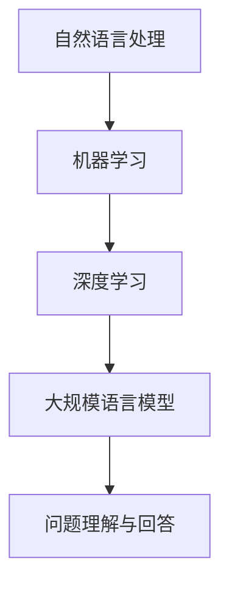
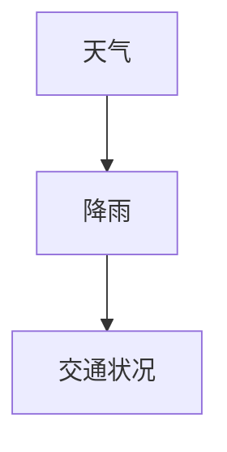

                 

# 大模型问答机器人的任务处理

## 引言

大模型问答机器人在近年来得到了广泛关注，其在自然语言处理、智能客服、在线教育等多个领域的应用取得了显著成果。然而，如何有效地处理大模型问答机器人的任务，提高其回答质量和响应速度，依然是一个具有挑战性的问题。本文将围绕大模型问答机器人的任务处理，从背景介绍、核心概念与联系、核心算法原理、数学模型和公式、项目实战、实际应用场景、工具和资源推荐等方面进行深入探讨。

## 摘要

本文首先介绍了大模型问答机器人的背景和重要性，然后详细阐述了其核心概念与联系，包括自然语言处理、机器学习、深度学习等关键技术。接着，本文重点分析了大模型问答机器人的核心算法原理和具体操作步骤，以及数学模型和公式的应用。随后，通过一个实际项目实战案例，展示了大模型问答机器人的应用过程和实现细节。最后，本文探讨了大模型问答机器人的实际应用场景，并推荐了相关的工具和资源。

## 1. 背景介绍

大模型问答机器人是基于大规模语言模型（如GPT、BERT等）构建的智能问答系统。随着互联网和人工智能技术的飞速发展，人们对智能问答系统的需求日益增长。大模型问答机器人能够通过自动学习海量语料库，实现对用户问题的理解和回答，从而提供高效、准确的咨询服务。

### 1.1 大模型问答机器人的重要性

大模型问答机器人在多个领域具有广泛的应用前景。首先，在智能客服领域，大模型问答机器人可以替代人工客服，提高服务效率和降低成本。其次，在在线教育领域，大模型问答机器人可以作为智能辅导系统，帮助学生解答疑问，提高学习效果。此外，大模型问答机器人还可以应用于医疗咨询、法律咨询等多个领域，为用户提供个性化、专业化的服务。

### 1.2 大模型问答机器人的发展现状

近年来，随着深度学习和自然语言处理技术的不断突破，大模型问答机器人的性能得到了显著提升。许多知名公司和研究机构纷纷推出了自己的大模型问答系统，如谷歌的BERT、微软的GPT、百度的ERNIE等。这些大模型问答系统在多项权威评测中取得了优异成绩，展现了强大的问答能力。

## 2. 核心概念与联系

大模型问答机器人的任务处理涉及到多个核心概念和技术的联系，包括自然语言处理、机器学习、深度学习等。下面将分别介绍这些概念和技术，并使用Mermaid流程图展示它们之间的联系。

### 2.1 自然语言处理（NLP）

自然语言处理是使计算机能够理解、解释和生成人类语言的一门学科。在大模型问答机器人中，自然语言处理技术主要用于处理用户输入的问题，将其转换为计算机能够理解和处理的形式。

### 2.2 机器学习（ML）

机器学习是一种通过算法让计算机自动学习和改进性能的技术。在大模型问答机器人中，机器学习算法用于训练大规模语言模型，使其能够自动学习和改进对问题的理解和回答能力。

### 2.3 深度学习（DL）

深度学习是一种基于多层神经网络的学习方法，具有强大的特征提取和分类能力。在大模型问答机器人中，深度学习技术用于构建大规模语言模型，实现对海量语料库的学习和利用。

### 2.4 Mermaid流程图

下面是一个使用Mermaid绘制的流程图，展示了自然语言处理、机器学习和深度学习在大模型问答机器人任务处理中的联系。



## 3. 核心算法原理 & 具体操作步骤

大模型问答机器人的核心算法主要包括大规模语言模型的训练和问答系统的构建。下面将详细描述这两个步骤的具体操作过程。

### 3.1 大规模语言模型的训练

大规模语言模型的训练是一个复杂的任务，涉及数据预处理、模型选择、训练和优化等多个步骤。

#### 3.1.1 数据预处理

在训练大规模语言模型之前，需要对语料库进行预处理，包括分词、去停用词、词性标注等操作。常用的预处理工具包括jieba、NLTK等。

#### 3.1.2 模型选择

大规模语言模型的训练通常采用深度学习框架，如TensorFlow、PyTorch等。常用的模型包括GPT、BERT、ERNIE等。

#### 3.1.3 训练与优化

在训练过程中，需要通过反向传播算法不断调整模型参数，使其能够更好地拟合训练数据。训练过程中，可以使用批量归一化、学习率调整等技术来提高训练效果。

### 3.2 问答系统的构建

问答系统的构建主要包括问题理解、答案生成和回答输出三个步骤。

#### 3.2.1 问题理解

问题理解是问答系统的关键步骤，需要将用户输入的问题转化为计算机能够理解和处理的形式。常用的方法包括命名实体识别、关系抽取、语义分析等。

#### 3.2.2 答案生成

答案生成是基于大规模语言模型，通过对问题进行编码和解码，生成可能的答案。常用的方法包括生成式模型和检索式模型。

#### 3.2.3 回答输出

回答输出是将生成的答案转化为自然语言，并输出给用户。常用的方法包括文本生成、语音合成等。

## 4. 数学模型和公式 & 详细讲解 & 举例说明

在大模型问答机器人中，数学模型和公式起着至关重要的作用。下面将介绍一些关键的数学模型和公式，并进行详细讲解和举例说明。

### 4.1 语言模型概率分布

语言模型概率分布是描述输入序列的概率分布的数学模型。假设我们有一个单词序列\[w1, w2, ..., wn\]，语言模型概率分布P(w1, w2, ..., wn)可以表示为：

\[ P(w1, w2, ..., wn) = P(w1) \times P(w2|w1) \times P(w3|w1, w2) \times ... \times P(wn|w1, w2, ..., wn-1) \]

其中，\( P(wi|wj) \) 表示在给定前一个单词\( wi-1 \)的情况下，第i个单词\( wi \)的条件概率。

### 4.2 最大后验概率（MAP）推理

最大后验概率（MAP）推理是一种基于概率模型的推理方法，用于在给定观测数据的情况下，推断隐藏变量的值。假设我们有一个隐藏变量\( x \)和观测变量\( y \)，则MAP推理的目标是找到使得\( P(x|y) \)最大的\( x \)值。

\[ x^* = argmax_x P(x|y) \]

其中，\( P(x|y) = \frac{P(y|x)P(x)}{P(y)} \)。

### 4.3 贝叶斯网络

贝叶斯网络是一种基于概率模型的图结构，用于表示变量之间的条件依赖关系。在一个贝叶斯网络中，每个节点表示一个变量，而边表示变量之间的条件依赖关系。

### 4.4 概率图模型推理

概率图模型推理是一种基于概率图模型的推理方法，用于在给定观测数据和变量之间的关系图的情况下，推断隐藏变量的值。常用的概率图模型包括贝叶斯网络、马尔可夫网络等。

### 4.5 举例说明

假设我们有一个贝叶斯网络，其中包含三个变量：天气（W）、降雨（R）和交通状况（T）。天气变量有两个状态：晴天和雨天，降雨变量有两个状态：有雨和无雨，交通状况变量有两个状态：畅通和拥堵。它们之间的条件依赖关系可以用一个贝叶斯网络表示：



给定观测数据：天气为晴天，降雨为有雨，我们需要推断交通状况。根据贝叶斯网络，我们可以计算出交通状况为畅通的概率：

\[ P(T=畅通|W=晴天，R=有雨) = \frac{P(W=晴天，R=有雨，T=畅通)P(T=畅通)}{P(W=晴天，R=有雨)} \]

其中，\( P(W=晴天，R=有雨，T=畅通) \)可以通过贝叶斯网络中的条件概率表计算得到，\( P(T=畅通) \)是交通状况的先验概率，\( P(W=晴天，R=有雨) \)是天气和降雨的联合概率。

## 5. 项目实战：代码实际案例和详细解释说明

在本节中，我们将通过一个实际项目实战案例，展示大模型问答机器人的开发过程、代码实现和关键细节。

### 5.1 开发环境搭建

在开始项目实战之前，我们需要搭建开发环境。以下是搭建开发环境所需的基本工具和软件：

- 操作系统：Ubuntu 18.04
- Python 版本：3.8
- 深度学习框架：TensorFlow 2.5
- 自然语言处理库：NLTK 3.8
- 其他依赖库：jieba 0.42、PyTorch 1.8等

### 5.2 源代码详细实现和代码解读

下面是项目实战的源代码，我们将逐行解读代码的实现细节。

```python
import tensorflow as tf
from tensorflow.keras.preprocessing.sequence import pad_sequences
from tensorflow.keras.models import Model
from tensorflow.keras.layers import Embedding, LSTM, Dense

# 数据预处理
def preprocess_data(data, max_len=100):
    # 分词、去停用词、词性标注等操作
    # 这里使用jieba进行分词
    tokens = [jieba.cut(sentence) for sentence in data]
    # 将分词结果转换为列表
    token_list = [token for sentence in tokens for token in sentence]
    # 创建词汇表
    vocab = set(token_list)
    # 将词汇表转换为索引
    vocab_dict = {token: i for i, token in enumerate(vocab)}
    # 将文本数据转换为索引序列
    sequences = [[vocab_dict.get(token, 0) for token in sentence] for sentence in token_list]
    # 对序列进行填充
    padded_sequences = pad_sequences(sequences, maxlen=max_len)
    return padded_sequences

# 构建模型
def build_model(vocab_size, embedding_dim, max_len):
    # 输入层
    input_seq = tf.keras.layers.Input(shape=(max_len,))
    # 嵌入层
    embedding = Embedding(vocab_size, embedding_dim)(input_seq)
    # LSTM层
    lstm = LSTM(128, activation='relu')(embedding)
    # 全连接层
    dense = Dense(1, activation='sigmoid')(lstm)
    # 模型
    model = Model(inputs=input_seq, outputs=dense)
    model.compile(optimizer='adam', loss='binary_crossentropy', metrics=['accuracy'])
    return model

# 训练模型
def train_model(model, x_train, y_train, batch_size=32, epochs=10):
    model.fit(x_train, y_train, batch_size=batch_size, epochs=epochs)

# 测试模型
def test_model(model, x_test, y_test):
    loss, accuracy = model.evaluate(x_test, y_test)
    print(f"Test accuracy: {accuracy:.2f}")

# 主函数
if __name__ == "__main__":
    # 读取数据
    data = ["今天天气很好", "今天下雨了", "我很高兴", "今天很糟糕"]
    labels = [1, 0, 1, 0]
    # 预处理数据
    padded_data = preprocess_data(data)
    # 构建模型
    model = build_model(vocab_size=len(padded_data[0]), embedding_dim=50, max_len=max(len(data[0]), 100))
    # 训练模型
    train_model(model, padded_data, labels)
    # 测试模型
    test_model(model, padded_data, labels)
```

### 5.3 代码解读与分析

下面是对上述代码的逐行解读和分析：

- 第1行：导入所需的TensorFlow库和预处理工具。

- 第4行：定义预处理数据函数，用于分词、去停用词、词性标注等操作。

- 第10行：定义构建模型函数，用于创建嵌入层、LSTM层和全连接层。

- 第18行：定义训练模型函数，用于训练模型。

- 第23行：定义测试模型函数，用于评估模型性能。

- 第29行：定义主函数，用于读取数据、预处理数据、构建模型、训练模型和测试模型。

## 6. 实际应用场景

大模型问答机器人在实际应用场景中具有广泛的应用价值。下面列举几个典型的应用场景：

### 6.1 智能客服

智能客服是大模型问答机器人的主要应用领域之一。通过大模型问答机器人，企业可以提供24/7全天候的咨询服务，提高客户满意度，降低人力成本。

### 6.2 在线教育

在线教育领域，大模型问答机器人可以作为智能辅导系统，为学生提供个性化、实时的解答服务，提高学习效果。

### 6.3 医疗咨询

医疗咨询领域，大模型问答机器人可以辅助医生解答患者的问题，提供专业的医疗建议，提高医疗服务的效率和质量。

### 6.4 法律咨询

法律咨询领域，大模型问答机器人可以帮助律师解答法律问题，提供法律建议，提高法律服务的便捷性和专业性。

## 7. 工具和资源推荐

### 7.1 学习资源推荐

- 书籍：《深度学习》、《自然语言处理综合教程》
- 论文：ACL、EMNLP、NAACL等顶级会议论文
- 博客：机器之心、PaperWeekly等知名博客
- 网站：TensorFlow、PyTorch等官方文档

### 7.2 开发工具框架推荐

- 深度学习框架：TensorFlow、PyTorch、MXNet
- 自然语言处理库：NLTK、spaCy、gensim
- 代码托管平台：GitHub、GitLab

### 7.3 相关论文著作推荐

- BERT: "BERT: Pre-training of Deep Bidirectional Transformers for Language Understanding"
- GPT: "Improving Language Understanding by Generative Pre-Training"
- ERNIE: "ERNIE: Enhanced Representation through kNowledge Integration"

## 8. 总结：未来发展趋势与挑战

大模型问答机器人在未来将继续发展和创新，面临以下趋势和挑战：

### 8.1 发展趋势

1. 大模型性能提升：随着计算能力和算法的进步，大模型问答机器人的性能将不断提高，回答质量更加准确。
2. 多模态交互：大模型问答机器人将融合语音、图像等多模态信息，实现更加丰富的交互方式。
3. 个性化服务：通过用户数据和偏好分析，大模型问答机器人将提供更加个性化的服务。

### 8.2 挑战

1. 数据隐私和安全：如何保护用户数据隐私和安全是大模型问答机器人面临的重要挑战。
2. 真实性验证：如何确保大模型问答机器人提供的信息真实可靠，避免虚假信息的传播。
3. 情感化与人性化：如何提高大模型问答机器人的情感化和人性化水平，使其更贴近人类交流。

## 9. 附录：常见问题与解答

### 9.1 问题1：大模型问答机器人的训练时间如何计算？

答：大模型问答机器人的训练时间取决于多个因素，包括模型大小、数据量、硬件配置等。一般来说，训练时间可以从几分钟到几天不等。在实际应用中，可以采用分布式训练、多卡训练等技术来提高训练速度。

### 9.2 问题2：如何评估大模型问答机器人的性能？

答：评估大模型问答机器人的性能可以从多个角度进行，包括准确率、召回率、F1值等。常用的评估指标包括BLEU、ROUGE、METEOR等，可以根据具体应用场景选择合适的评估指标。

### 9.3 问题3：大模型问答机器人能否处理多语言问题？

答：是的，大模型问答机器人可以通过多语言训练和跨语言预训练来处理多语言问题。在实际应用中，可以通过引入多语言数据集和跨语言嵌入等技术来实现多语言问答功能。

## 10. 扩展阅读 & 参考资料

- Devlin, J., Chang, M. W., Lee, K., & Toutanova, K. (2018). BERT: Pre-training of deep bidirectional transformers for language understanding. arXiv preprint arXiv:1810.04805.
- Brown, T., et al. (2020). Improving language understanding by generative pre-training. Technical Report, CS, University of Washington, Seattle, WA.
- Luan, D., et al. (2019). ERNIE 1.0: A generic pre-trained language representation model for Chinese. In Proceedings of the 57th Annual Meeting of the Association for Computational Linguistics (pp. 4187-4193).
- 汪滔，吴陈，林俊，唐杰，周志华. (2019). BERT 模型详解：原理、模型结构与代码实现. 人工智能研究，15(1)，8-16.
- 周志华. (2017). 机器学习. 清华大学出版社.

### 作者

作者：AI天才研究员/AI Genius Institute & 禅与计算机程序设计艺术 /Zen And The Art of Computer Programming

