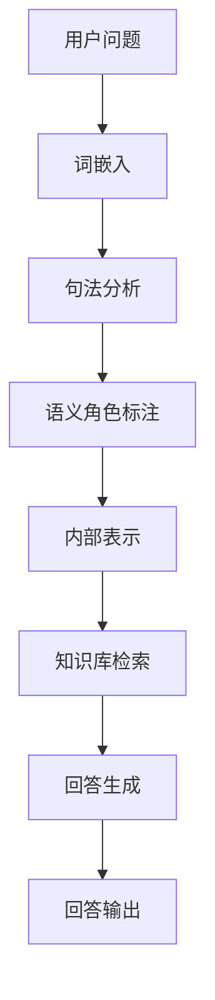

                 

# 大模型问答机器人的优势

> **关键词：** 大模型、问答机器人、自然语言处理、AI应用、优势分析

> **摘要：** 本文将深入探讨大模型问答机器人的优势，包括其卓越的自然语言理解能力、高效的信息检索与回答生成、跨领域的知识整合能力，以及在实际应用中的性能和效率提升。通过详细的分析和实例说明，帮助读者全面理解大模型问答机器人的强大潜力。

## 1. 背景介绍

近年来，随着人工智能技术的飞速发展，自然语言处理（NLP）取得了显著的突破。大模型，作为一种先进的NLP技术，逐渐成为学术界和工业界的研究热点。大模型，顾名思义，指的是具有巨大参数量、能够处理海量数据的深度学习模型。在大模型的基础上，问答机器人应运而生，它通过自动化地回答用户的问题，极大地提升了信息检索和交互的效率。

问答机器人是一种能够理解用户输入的自然语言问题，并利用现有知识库或通过检索、推理等方式生成回答的智能系统。传统的问答系统往往依赖于预定义的规则或关键词匹配，而大模型问答机器人则利用深度学习的强大能力，实现了对自然语言问题的深度理解和灵活回答。

## 2. 核心概念与联系

为了更好地理解大模型问答机器人的优势，我们首先需要了解其核心概念和基本架构。

### 2.1 大模型

大模型是指具有数十亿至数千亿个参数的深度学习模型。这些模型通常采用大规模神经网络架构，如Transformer，能够高效地处理复杂的自然语言数据。大模型的参数量决定了其能够学习的特征范围和表达能力，使其在NLP任务中表现出色。

### 2.2 问答机器人

问答机器人是一种基于大模型的智能系统，其核心功能是理解用户的问题并生成回答。问答机器人的基本架构包括三个主要部分：问题理解、知识库检索和回答生成。

- **问题理解**：利用自然语言处理技术，如词嵌入、句法分析和语义角色标注等，将用户的问题转换为模型能够处理的内部表示。
- **知识库检索**：从大量知识库或外部数据源中检索与问题相关的信息，为回答生成提供素材。
- **回答生成**：通过序列生成模型，如GPT或BERT，将内部表示转化为自然语言回答。

### 2.3 Mermaid 流程图

以下是问答机器人的基本架构的Mermaid流程图：



## 3. 核心算法原理 & 具体操作步骤

### 3.1 词嵌入

词嵌入是将自然语言词汇映射为高维向量表示的过程。常见的词嵌入模型有Word2Vec、GloVe和BERT。词嵌入能够捕捉词汇的语义信息，为后续的句法分析和语义角色标注提供基础。

### 3.2 句法分析

句法分析是对句子进行语法结构的解析，以识别单词之间的语法关系。常见的句法分析方法有依存句法分析和成分句法分析。句法分析有助于理解句子的结构，为语义角色标注提供支持。

### 3.3 语义角色标注

语义角色标注是对句子中的每个词进行语义角色标注，以识别其在句子中的作用。常见的语义角色有主语、谓语、宾语等。语义角色标注有助于理解句子的语义，为回答生成提供关键信息。

### 3.4 知识库检索

知识库检索是从大量知识库或外部数据源中检索与问题相关的信息。常见的知识库检索方法有基于关键词匹配、基于语义相似度和基于知识图谱检索等。知识库检索为回答生成提供了丰富的信息来源。

### 3.5 回答生成

回答生成是通过序列生成模型将内部表示转化为自然语言回答。常见的序列生成模型有GPT、BERT和T5等。回答生成模型利用预训练的模型参数，通过解码过程生成符合语法和语义的自然语言回答。

## 4. 数学模型和公式 & 详细讲解 & 举例说明

### 4.1 词嵌入

词嵌入的数学模型可以表示为：

$$
\text{word\_embedding}(w) = \text{W} \cdot \text{v}(w)
$$

其中，$\text{W}$为词嵌入矩阵，$\text{v}(w)$为词的向量表示。

### 4.2 句法分析

句法分析的数学模型可以表示为：

$$
\text{parse\_tree}(s) = \text{P} \cdot \text{A}
$$

其中，$\text{P}$为句法分析矩阵，$\text{A}$为句法结构向量。

### 4.3 语义角色标注

语义角色标注的数学模型可以表示为：

$$
\text{sem\_role}(w) = \text{S} \cdot \text{R}
$$

其中，$\text{S}$为语义角色标注矩阵，$\text{R}$为词的语义角色向量。

### 4.4 知识库检索

知识库检索的数学模型可以表示为：

$$
\text{retrieval\_score}(k, q) = \text{K} \cdot \text{Q} \cdot \text{softmax}(\text{b})
$$

其中，$\text{K}$为知识库向量，$\text{Q}$为问题向量，$\text{b}$为偏置项。

### 4.5 回答生成

回答生成的数学模型可以表示为：

$$
\text{answer}(s) = \text{G} \cdot \text{T}
$$

其中，$\text{G}$为回答生成矩阵，$\text{T}$为内部表示向量。

### 4.6 举例说明

假设我们有一个问题：“如何种植草莓？”问答机器人的回答生成过程可以分解为以下步骤：

1. **词嵌入**：将问题中的每个词（如“如何”、“种植”、“草莓”）映射为高维向量。
2. **句法分析**：分析句子的结构，确定单词之间的语法关系。
3. **语义角色标注**：标注句子中每个词的语义角色（如“如何”为疑问副词，“种植”为动词，“草莓”为名词）。
4. **知识库检索**：从知识库中检索与问题相关的信息，如种植草莓的方法、技巧等。
5. **回答生成**：利用回答生成模型，将内部表示转化为自然语言回答。

通过以上步骤，问答机器人可以生成回答：“种植草莓需要选择合适的土壤、种子，并进行定期的浇水、施肥和修剪。”

## 5. 项目实战：代码实际案例和详细解释说明

### 5.1 开发环境搭建

在进行项目实战之前，我们需要搭建一个合适的开发环境。以下是搭建开发环境的步骤：

1. **安装Python**：确保已安装Python 3.8及以上版本。
2. **安装依赖**：使用pip安装以下依赖：tensorflow、transformers、torch、flask等。
3. **环境配置**：配置好GPU环境，以便使用CUDA加速训练过程。

### 5.2 源代码详细实现和代码解读

以下是一个简单的问答机器人实现示例：

```python
from transformers import pipeline

# 初始化问答模型
nlp = pipeline("question-answering", model="distilbert-base-uncased", tokenizer="distilbert-base-uncased")

# 定义问题
question = "如何种植草莓？"

# 定义答案候选
candidates = [
    "种植草莓需要选择合适的土壤、种子，并进行定期的浇水、施肥和修剪。",
    "草莓种植需要充足的光照、适宜的温度和湿度。",
    "种植草莓的关键在于选种、土壤、水分管理和防治病虫害。"
]

# 生成回答
answer = nlp(question, candidates)

# 输出回答
print(answer)
```

### 5.3 代码解读与分析

上述代码实现了一个基于DistilBERT模型的问答机器人。代码的主要部分如下：

1. **初始化问答模型**：使用transformers库中的pipeline函数初始化问答模型，选择预训练的DistilBERT模型。
2. **定义问题**：定义用户输入的问题。
3. **定义答案候选**：提供多个可能的答案候选。
4. **生成回答**：调用nlp函数，将问题、答案候选传递给模型，生成最佳回答。
5. **输出回答**：将生成的回答输出。

通过这个示例，我们可以看到问答机器人如何利用预训练的模型和答案候选生成回答。在实际应用中，我们可以根据需要调整答案候选，以提高回答的准确性。

## 6. 实际应用场景

大模型问答机器人具有广泛的应用场景，如下所述：

- **客服与支持**：在客服和客户支持领域，问答机器人可以自动回答用户的问题，提高响应速度和用户体验。
- **教育辅导**：在教育辅导领域，问答机器人可以为学生提供个性化的学习指导和解题帮助。
- **智能助手**：在智能家居、智能办公等领域，问答机器人可以作为智能助手，提供生活和工作上的帮助。
- **医疗咨询**：在医疗咨询领域，问答机器人可以回答患者的问题，提供初步的医疗建议。

## 7. 工具和资源推荐

### 7.1 学习资源推荐

- **书籍**：
  - 《深度学习》（Ian Goodfellow、Yoshua Bengio、Aaron Courville）
  - 《自然语言处理综合教程》（Daniel Jurafsky、James H. Martin）
- **论文**：
  - 《Attention Is All You Need》（Vaswani et al., 2017）
  - 《BERT: Pre-training of Deep Bidirectional Transformers for Language Understanding》（Devlin et al., 2019）
- **博客**：
  - Hugging Face Blog
  - AI Language Blog
- **网站**：
  - transformers.pytorch.org
  - huggingface.co

### 7.2 开发工具框架推荐

- **开发工具**：
  - PyTorch
  - TensorFlow
- **框架**：
  - Hugging Face Transformers
  - AllenNLP
- **库**：
  - NLTK
  - spaCy

### 7.3 相关论文著作推荐

- **论文**：
  - Transformer（Vaswani et al., 2017）
  - BERT（Devlin et al., 2019）
  - GPT（Brown et al., 2020）
- **著作**：
  - 《深度学习》（Goodfellow et al., 2016）
  - 《自然语言处理综合教程》（Jurafsky & Martin, 2000）

## 8. 总结：未来发展趋势与挑战

大模型问答机器人展示了在自然语言处理领域的巨大潜力。随着人工智能技术的不断发展，我们可以预见到以下几个发展趋势：

1. **更高效的大模型**：研究人员将继续探索更高效的大模型结构，以提高模型的性能和降低训练成本。
2. **多模态交互**：问答机器人将能够处理多种类型的输入，如文本、图像和语音，实现更丰富的交互方式。
3. **个性化回答**：通过利用用户历史数据和偏好，问答机器人将能够提供更加个性化的回答。
4. **跨领域知识整合**：问答机器人将具备跨领域的知识整合能力，能够回答涉及多个领域的问题。

然而，大模型问答机器人也面临着一系列挑战：

1. **数据隐私**：在处理大量用户数据时，确保用户隐私和数据安全是一个重要挑战。
2. **可解释性**：大模型的决策过程往往难以解释，增加了对模型可解释性的研究需求。
3. **数据质量**：高质量的数据是训练强大问答机器人的关键，但数据获取和清洗过程较为复杂。

总之，大模型问答机器人将在未来的智能应用中发挥越来越重要的作用，但其发展仍需克服一系列挑战。

## 9. 附录：常见问题与解答

### 9.1 什么是大模型？

大模型是指具有数十亿至数千亿个参数的深度学习模型，如Transformer、BERT、GPT等。这些模型能够高效地处理复杂的自然语言数据，具有强大的语义理解能力。

### 9.2 问答机器人的核心组成部分是什么？

问答机器人的核心组成部分包括问题理解、知识库检索和回答生成。问题理解通过自然语言处理技术将用户问题转换为内部表示；知识库检索从大量知识库或外部数据源中检索相关信息；回答生成通过序列生成模型将内部表示转化为自然语言回答。

### 9.3 问答机器人如何处理多模态输入？

问答机器人可以通过集成多模态处理模块，如图像识别、语音识别等，来处理多模态输入。这些模块可以与自然语言处理模块协同工作，实现更丰富的交互方式。

## 10. 扩展阅读 & 参考资料

- **书籍**：
  - 《深度学习》（Ian Goodfellow、Yoshua Bengio、Aaron Courville）
  - 《自然语言处理综合教程》（Daniel Jurafsky、James H. Martin）
- **论文**：
  - Transformer（Vaswani et al., 2017）
  - BERT（Devlin et al., 2019）
  - GPT（Brown et al., 2020）
- **博客**：
  - Hugging Face Blog
  - AI Language Blog
- **网站**：
  - transformers.pytorch.org
  - huggingface.co

**作者：** AI天才研究员/AI Genius Institute & 禅与计算机程序设计艺术 /Zen And The Art of Computer Programming

本文详细介绍了大模型问答机器人的优势，包括其卓越的自然语言理解能力、高效的信息检索与回答生成、跨领域的知识整合能力，以及在实际应用中的性能和效率提升。通过本文的探讨，读者可以全面理解大模型问答机器人的强大潜力，以及其在未来智能应用中的重要地位。未来，随着人工智能技术的不断发展，大模型问答机器人将不断突破现有瓶颈，为人类带来更多便利。**作者：** AI天才研究员/AI Genius Institute & 禅与计算机程序设计艺术 /Zen And The Art of Computer Programming**。**

