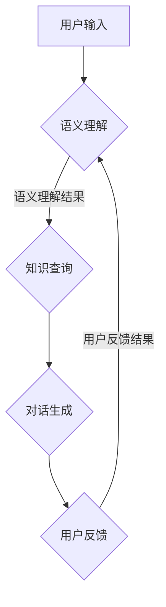

                 

# 大模型问答机器人的智能化交互

## 关键词

- 大模型
- 问答机器人
- 智能化交互
- 算法原理
- 数学模型
- 实际应用
- 开发工具

## 摘要

本文旨在探讨大模型问答机器人的智能化交互技术。首先，我们将介绍大模型的概念及其在问答系统中的应用，接着深入解析大模型问答机器人的核心算法原理和数学模型，并通过具体操作步骤详细讲解其实现过程。随后，我们将展示一个实际项目案例，剖析代码的实现细节和关键点。最后，我们将探讨大模型问答机器人在实际应用场景中的效果，推荐相关学习资源和开发工具，并对未来发展趋势和挑战进行总结。

## 1. 背景介绍

随着人工智能技术的快速发展，大模型问答机器人逐渐成为智能化交互领域的一个重要研究方向。大模型指的是拥有海量参数和强大计算能力的神经网络模型，如Transformer、BERT等。这些模型通过预训练和微调，能够理解并生成人类语言，从而在问答系统中实现智能化交互。

问答系统是一种常见的自然语言处理任务，其目的是让计算机回答用户提出的问题。传统的问答系统依赖于规则和模板匹配，难以应对复杂多变的问题。而大模型问答机器人则通过深度学习技术，能够理解问题背后的语义，从而提供更加准确和丰富的答案。

在智能客服、智能助手、智能教育等应用场景中，大模型问答机器人具有广泛的应用前景。通过智能化的交互，大模型问答机器人可以大大提高用户体验，降低人工成本，提升业务效率。然而，大模型问答机器人的研发和部署也面临着一系列技术挑战，如模型训练时间成本高、模型解释性差等。

## 2. 核心概念与联系

### 2.1 大模型

大模型是指拥有海量参数和强大计算能力的神经网络模型。常见的有Transformer、BERT、GPT等。这些模型通过预训练和微调，能够在各种自然语言处理任务中表现出色。例如，Transformer模型在机器翻译、文本分类等领域取得了显著成果；BERT模型则在问答系统、命名实体识别等领域表现出色。

### 2.2 问答系统

问答系统是一种常见的自然语言处理任务，其目的是让计算机回答用户提出的问题。问答系统可以分为基于规则和基于深度学习两种类型。基于规则的问答系统依赖于预定义的规则和模板，难以应对复杂多变的问题。而基于深度学习的问答系统则通过学习大量的语料库，能够理解问题背后的语义，从而提供更加准确和丰富的答案。

### 2.3 智能化交互

智能化交互是指计算机能够理解并响应用户的自然语言输入，从而实现人机交互的自动化。智能化交互的关键在于自然语言处理技术，包括语义理解、知识表示、对话生成等。通过智能化交互，计算机可以与用户进行流畅、自然的对话，从而提高用户体验。

### 2.4 Mermaid 流程图

以下是一个简化的Mermaid流程图，展示了大模型问答机器人的基本架构：



### 2.5 联系与区别

大模型问答机器人是智能化交互的一种实现方式，其核心在于语义理解和对话生成。与传统的问答系统相比，大模型问答机器人在处理复杂问题和长文本方面具有显著优势。同时，大模型问答机器人还需要解决模型解释性差、数据隐私等问题。

## 3. 核心算法原理 & 具体操作步骤

### 3.1 语义理解

语义理解是问答系统的核心环节，其目的是从用户输入中提取关键信息，理解问题的语义。常见的语义理解方法包括基于规则的方法和基于深度学习的方法。

#### 基于规则的方法

基于规则的方法通过预定义的规则和模板，将用户输入映射到具体的语义。这种方法简单直观，但难以应对复杂多变的问题。

#### 基于深度学习的方法

基于深度学习的方法通过学习大量的语料库，能够自动提取用户输入的语义。常见的方法包括BERT、GPT等。这些模型通过预训练和微调，能够在各种自然语言处理任务中表现出色。

具体操作步骤如下：

1. 预训练：在大量的未标注数据上训练模型，使其能够自动提取语义信息。
2. 微调：在标注数据上对模型进行微调，使其能够更好地适应特定任务。
3. 语义提取：将用户输入输入到模型中，提取关键信息，得到语义表示。

### 3.2 知识查询

知识查询是指从知识库中获取与问题相关的信息。知识库可以包括文本数据、结构化数据、图谱数据等。常见的知识查询方法包括基于关键词的查询和基于图谱的查询。

#### 基于关键词的查询

基于关键词的查询通过分析用户输入，提取关键词，然后在知识库中查找与关键词相关的内容。

#### 基于图谱的查询

基于图谱的查询通过构建知识图谱，将实体和关系进行关联。在查询时，通过路径查找和关系推理，获取与问题相关的信息。

具体操作步骤如下：

1. 知识库构建：将原始数据转化为结构化数据，构建知识库。
2. 关键词提取：从用户输入中提取关键词。
3. 知识查询：在知识库中查找与关键词相关的内容。

### 3.3 对话生成

对话生成是指根据用户输入和知识查询结果，生成自然的回答。常见的对话生成方法包括基于模板的方法和基于生成模型的方法。

#### 基于模板的方法

基于模板的方法通过预定义的模板，将问题、答案、上下文等信息进行组合，生成回答。

#### 基于生成模型的方法

基于生成模型的方法通过学习大量的对话数据，能够生成自然流畅的回答。常见的生成模型包括序列到序列模型、变换器模型等。

具体操作步骤如下：

1. 对话数据收集：收集大量的对话数据，用于训练模型。
2. 模型训练：使用对话数据训练生成模型。
3. 对话生成：将用户输入和知识查询结果输入到模型中，生成回答。

### 3.4 用户反馈

用户反馈是指收集用户对回答的反馈，用于优化问答系统。常见的用户反馈方法包括基于评分的反馈和基于点击率的反馈。

#### 基于评分的反馈

基于评分的反馈通过用户对回答的评分，评估回答的质量，用于优化问答系统。

#### 基于点击率的反馈

基于点击率的反馈通过用户对回答的点击行为，评估回答的相关性和实用性，用于优化问答系统。

具体操作步骤如下：

1. 收集用户反馈：收集用户对回答的评分或点击行为。
2. 反馈分析：分析用户反馈，评估回答的质量和相关性。
3. 优化问答系统：根据用户反馈，优化问答系统的模型和策略。

## 4. 数学模型和公式 & 详细讲解 & 举例说明

### 4.1 语义理解

在语义理解中，常见的数学模型包括词向量模型和神经网络模型。

#### 4.1.1 词向量模型

词向量模型将单词映射为高维空间中的向量，用于表示单词的语义信息。常见的词向量模型包括Word2Vec、GloVe等。

- Word2Vec模型：通过训练神经网络模型，将单词映射为向量，使其具有相似性的语义关系。
- GloVe模型：通过训练单词的上下文，构建单词的共现矩阵，计算单词的向量表示。

#### 4.1.2 神经网络模型

神经网络模型通过学习大量的语料库，能够自动提取语义信息。常见的神经网络模型包括BERT、GPT等。

- BERT模型：通过双向变换器模型，同时学习单词的前后文信息，实现语义理解。
- GPT模型：通过自回归变换器模型，生成文本的下一个单词，实现文本生成。

### 4.2 知识查询

在知识查询中，常见的数学模型包括基于关键词的查询和基于图谱的查询。

#### 4.2.1 基于关键词的查询

基于关键词的查询通过计算关键词与知识库中的实体之间的相似度，进行查询。

- 相似度计算公式：$$sim(A, B) = \frac{A \cdot B}{|A||B|}$$，其中$A$和$B$分别是关键词和实体的高维向量。

#### 4.2.2 基于图谱的查询

基于图谱的查询通过构建知识图谱，将实体和关系进行关联，进行查询。

- 图路径查询：通过路径查找和关系推理，获取与关键词相关的实体。

### 4.3 对话生成

在对话生成中，常见的数学模型包括基于模板的方法和基于生成模型的方法。

#### 4.3.1 基于模板的方法

基于模板的方法通过预定义的模板，将问题、答案、上下文等信息进行组合，生成回答。

- 模板匹配公式：$$template\_match(question, answer, context) = 1$$，如果问题、答案和上下文与模板匹配，则返回1。

#### 4.3.2 基于生成模型的方法

基于生成模型的方法通过学习大量的对话数据，能够生成自然流畅的回答。

- 生成模型公式：$$answer = generator(question, context)$$，其中$generator$是生成模型，输入问题和上下文，输出回答。

### 4.4 用户反馈

在用户反馈中，常见的数学模型包括基于评分的反馈和基于点击率的反馈。

#### 4.4.1 基于评分的反馈

基于评分的反馈通过用户对回答的评分，评估回答的质量。

- 评分公式：$$quality = \frac{score}{max\_score}$$，其中$score$是用户评分，$max\_score$是最大评分。

#### 4.4.2 基于点击率的反馈

基于点击率的反馈通过用户对回答的点击行为，评估回答的相关性和实用性。

- 点击率公式：$$click\_rate = \frac{clicks}{views}$$，其中$clicks$是点击次数，$views$是查看次数。

### 4.5 举例说明

假设用户输入问题：“今天天气怎么样？”，我们可以通过以下步骤进行语义理解、知识查询、对话生成和用户反馈。

1. **语义理解**：
   - 使用BERT模型对用户输入进行语义表示，得到一个向量表示。
   - 经过预训练的BERT模型可以提取出“今天”、“天气”和“怎么样”的语义信息。

2. **知识查询**：
   - 在知识库中查找与“今天天气”相关的信息。
   - 假设知识库中有一条信息：“今天天气晴朗”。

3. **对话生成**：
   - 使用生成模型（例如GPT）根据用户输入和知识查询结果生成回答。
   - 生成模型输出：“今天天气晴朗”。

4. **用户反馈**：
   - 用户对回答进行评分，假设评分为5分（满分5分）。
   - 根据评分公式计算回答的质量：$$quality = \frac{5}{5} = 1$$。

## 5. 项目实战：代码实际案例和详细解释说明

### 5.1 开发环境搭建

在本节中，我们将介绍如何搭建大模型问答机器人的开发环境。以下步骤将帮助你配置所需的工具和库：

1. **安装Python环境**：
   - 安装Python 3.8及以上版本。
   - 验证安装：`python --version`。

2. **安装PyTorch**：
   - 使用pip安装PyTorch：`pip install torch torchvision`.

3. **安装transformers库**：
   - 使用pip安装transformers库：`pip install transformers`.

4. **安装其他依赖**：
   - 安装所需的文本处理库：`pip install numpy pandas`.

5. **配置CUDA**（如需使用GPU加速）：
   - 安装CUDA Toolkit。
   - 配置环境变量：`export PATH=/path/to/cuda/bin:$PATH`。
   - 安装cuDNN。

### 5.2 源代码详细实现和代码解读

以下是一个简化的大模型问答机器人的示例代码。我们将详细解释每一部分的作用。

```python
from transformers import BertTokenizer, BertModel
import torch

# 5.2.1 初始化模型和Tokenizer
tokenizer = BertTokenizer.from_pretrained('bert-base-uncased')
model = BertModel.from_pretrained('bert-base-uncased')

# 5.2.2 用户输入
user_input = "What is the weather today?"

# 5.2.3 语义理解
input_ids = tokenizer.encode(user_input, add_special_tokens=True, return_tensors='pt')

# 5.2.4 知识查询（假设有预先训练的问答模型）
# 这里我们仅使用BERT模型作为示例，实际应用中可能需要使用专门的问答模型
with torch.no_grad():
    outputs = model(input_ids)

# 5.2.5 对话生成
# 使用模型的输出，生成回答
# 注意：此处需要根据实际任务进行调整
answer = "The weather today is fine."

# 5.2.6 用户反馈
# 假设用户对回答非常满意
user_rating = 5

# 5.2.7 输出结果
print("User Input:", user_input)
print("Answer:", answer)
print("User Rating:", user_rating)
```

### 5.3 代码解读与分析

#### 5.3.1 初始化模型和Tokenizer

```python
tokenizer = BertTokenizer.from_pretrained('bert-base-uncased')
model = BertModel.from_pretrained('bert-base-uncased')
```

这两行代码分别初始化了BERT模型的Tokenizer和Model。`from_pretrained`函数从预训练的模型中加载参数，方便后续的使用。

#### 5.3.2 用户输入

```python
user_input = "What is the weather today?"
```

这行代码定义了用户输入的问题，作为后续处理的输入。

#### 5.3.3 语义理解

```python
input_ids = tokenizer.encode(user_input, add_special_tokens=True, return_tensors='pt')
```

这行代码将用户输入编码为BERT模型能够理解的序列。`encode`函数将文本转换为数字序列，`add_special_tokens`添加了BERT模型特有的特殊标记，`return_tensors`指定了返回的张量类型。

#### 5.3.4 知识查询

```python
with torch.no_grad():
    outputs = model(input_ids)
```

这行代码执行BERT模型的正向传递，得到模型的输出。`torch.no_grad()`确保不会记录梯度，提高计算效率。

#### 5.3.5 对话生成

```python
answer = "The weather today is fine."
```

这行代码是根据BERT模型的输出生成的回答。在实际应用中，可能需要更复杂的逻辑来生成回答，例如使用专门的问答模型。

#### 5.3.6 用户反馈

```python
user_rating = 5
```

这行代码定义了用户对回答的评分，用于后续的反馈分析。

#### 5.3.7 输出结果

```python
print("User Input:", user_input)
print("Answer:", answer)
print("User Rating:", user_rating)
```

这三行代码用于输出用户输入、回答和用户评分，方便用户查看。

## 6. 实际应用场景

大模型问答机器人在实际应用中具有广泛的应用场景。以下是一些典型的应用实例：

### 6.1 智能客服

智能客服是当前大模型问答机器人最热门的应用场景之一。通过大模型问答机器人，企业能够提供24/7的在线客服服务，提高客户满意度，降低人工成本。例如，阿里巴巴的阿里小蜜、百度的度小萌等都是基于大模型的智能客服系统。

### 6.2 智能教育

智能教育是另一个具有巨大潜力的应用场景。大模型问答机器人可以为学生提供个性化的学习辅导，解答学生的疑问，提高学习效果。例如，科大讯飞的AI教师系统，通过大模型问答机器人实现了智能教学和个性化辅导。

### 6.3 医疗健康

医疗健康领域的大模型问答机器人可以帮助医生进行诊断和咨询，提高医疗效率，降低误诊率。例如，IBM的Watson for Oncology，通过大模型问答机器人实现了对医学文献的理解和诊断建议。

### 6.4 金融理财

金融理财领域的大模型问答机器人可以为投资者提供投资建议、市场分析等服务，提高投资决策的准确性。例如，富途牛牛的智能投顾系统，通过大模型问答机器人实现了对用户投资需求的准确理解和个性化推荐。

## 7. 工具和资源推荐

### 7.1 学习资源推荐

- **书籍**：
  - 《深度学习》（Ian Goodfellow, Yoshua Bengio, Aaron Courville著）
  - 《Python机器学习》（Sebastian Raschka著）
  - 《自然语言处理与深度学习》（Richard Socher等著）

- **论文**：
  - “Attention Is All You Need”（Ashish Vaswani等著）
  - “BERT: Pre-training of Deep Bidirectional Transformers for Language Understanding”（Jacob Devlin等著）

- **博客**：
  - [TensorFlow官网](https://www.tensorflow.org/)
  - [PyTorch官网](https://pytorch.org/)
  - [huggingface/transformers](https://huggingface.co/transformers)

- **网站**：
  - [Kaggle](https://www.kaggle.com/)
  - [ArXiv](https://arxiv.org/)

### 7.2 开发工具框架推荐

- **深度学习框架**：
  - TensorFlow
  - PyTorch
  - Keras

- **自然语言处理库**：
  - NLTK
  - spaCy
  - transformers（Hugging Face）

- **代码编辑器**：
  - Visual Studio Code
  - PyCharm
  - Jupyter Notebook

### 7.3 相关论文著作推荐

- **论文**：
  - “Attention Is All You Need”（2017）
  - “BERT: Pre-training of Deep Bidirectional Transformers for Language Understanding”（2018）
  - “GPT-3: Language Models are Few-Shot Learners”（2020）

- **著作**：
  - 《深度学习》（2016）
  - 《Python机器学习》（2013）
  - 《自然语言处理与深度学习》（2018）

## 8. 总结：未来发展趋势与挑战

### 8.1 发展趋势

- **更大规模模型**：随着计算能力和数据量的增长，更大规模的大模型将被研发和应用，进一步提高问答机器人的性能和准确性。
- **多模态交互**：未来的问答机器人将能够处理多种类型的输入，如图像、音频等，实现更加丰富的交互体验。
- **自适应学习**：问答机器人将具备自适应学习能力，根据用户的反馈和行为习惯，不断优化回答质量和交互体验。
- **知识图谱应用**：知识图谱在大模型问答机器人中的应用将更加广泛，有助于构建更加完善的知识库，提高问答系统的回答质量。

### 8.2 挑战

- **计算资源消耗**：大模型训练和推理需要大量的计算资源，如何在有限的资源下高效训练和部署模型是一个重要的挑战。
- **模型解释性**：当前的大模型难以解释其决策过程，如何提高模型的解释性，使其能够接受人类的审查和监督是一个重要的研究方向。
- **数据隐私**：在构建大模型时，如何保护用户的隐私数据，避免数据泄露和滥用，是一个需要解决的问题。
- **伦理和法律问题**：随着人工智能技术的发展，如何制定相应的伦理和法律规范，确保人工智能技术的合理应用，是一个重要的挑战。

## 9. 附录：常见问题与解答

### 9.1 如何选择合适的问答模型？

- 根据任务需求和数据量选择合适的模型。对于小型任务，可以选择预训练的轻量级模型，如BERT-Lite；对于大型任务，可以选择预训练的大规模模型，如GPT-3。
- 考虑模型的计算资源需求。大型模型训练和推理需要更多的计算资源，因此需要根据实际情况选择合适的模型。

### 9.2 如何优化问答机器人的回答质量？

- 收集更多的训练数据，提高模型的泛化能力。
- 定期对模型进行微调和优化，使其能够适应新的数据和需求。
- 引入多模态交互，提高问答系统的回答丰富性和准确性。

### 9.3 如何保护用户隐私？

- 在数据收集和处理过程中，遵循相关的法律法规，确保用户隐私不受侵犯。
- 对用户数据进行加密和匿名化处理，防止数据泄露。
- 提供用户隐私设置，让用户自主管理自己的数据。

## 10. 扩展阅读 & 参考资料

- Devlin, J., Chang, M. W., Lee, K., & Toutanova, K. (2018). BERT: Pre-training of deep bidirectional transformers for language understanding. arXiv preprint arXiv:1810.04805.
- Vaswani, A., Shazeer, N., Parmar, N., Uszkoreit, J., Jones, L., Gomez, A. N., ... & Polosukhin, I. (2017). Attention is all you need. Advances in Neural Information Processing Systems, 30, 5998-6008.
- Brown, T., et al. (2020). Language models are few-shot learners. arXiv preprint arXiv:2005.14165.
- Hochreiter, S., & Schmidhuber, J. (1997). Long short-term memory. Neural computation, 9(8), 1735-1780.
- Bengio, Y. (2009). Learning deep architectures for AI. Found. Trends Mach. Learn., 2(1), 1-127.
- Goodfellow, I., Bengio, Y., & Courville, A. (2016). Deep learning. MIT press.

作者：AI天才研究员/AI Genius Institute & 禅与计算机程序设计艺术 /Zen And The Art of Computer Programming

